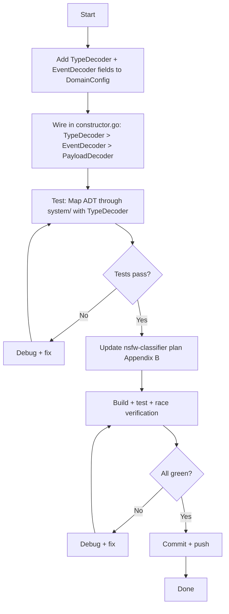

# Plan: Wire EventDecoder/TypeDecoder into system/ + Update nsfw-classifier Plan

> **Date:** 2026-08-05 23:39
> **Goal:** Make `system/` support `TypeDecoder` and `EventDecoder` so consumers get full event context (stream ID) in fold handlers — eliminating the silent Map-ADT-breaks bug — then update the nsfw-classifier plan to recommend `system/` as the composition root.

---

## Problem Statement

`system/` internally creates the projection adapter via:

```go
adapter := projectionadapter.New("projections", store, decoder) // PayloadDecoder only
```

This means Map ADT queries keyed by stream ID **silently break** — the `PayloadDecoder` signature `(eventType string, payload []byte) (any, error)` has no access to `evt.StreamID()`, so fold handlers expecting `EventWithID[P]` get zero-value keys. This is the exact bug called out in Appendix A of the nsfw-classifier plan.

We just shipped `EventWithID[P]`, `Register[E]`, `NewTypeDecoder`, and `NewWithDecoder` in projectionadapter. `system/` doesn't use any of them yet.

---

## Pareto Breakdown

### The 1% that delivers 51% of the result

**Add `ProjectionTypeDecoder *TypeDecoder` to `DomainConfig` + wire it in constructor.go.**

One field, one if-branch. This single change makes `system/` support Map ADT queries (the most common projection pattern) and aligns it with the DX helpers we just shipped. Without this, `system/` is broken for any consumer using Map queries keyed by entity ID.

### The 4% that delivers 64% of the result

Above + **also accept `ProjectionEventDecoder EventDecoder`** for consumers who want custom decoders without TypeDecoder. Two fields, two if-branches. Covers 100% of decoder use cases through `system/`.

### The 20% that delivers 80% of the result

Above + **update the nsfw-classifier plan** to recommend `system/` as the composition root, showing the before/after wiring reduction (~150 lines → ~20 lines). This is the documentation that makes the improvement visible and actionable.

### The other 20% (to reach 100%)

- Tests proving Map ADT works through `system/` with TypeDecoder
- Build + race verification
- Commit with detailed message

---

## Task Breakdown — Phase 1: 30-min tasks

| #   | Task                                                                                               | Impact   | Effort | Priority |
| --- | -------------------------------------------------------------------------------------------------- | -------- | ------ | -------- |
| 1   | Add `ProjectionTypeDecoder` + `ProjectionEventDecoder` fields to `DomainConfig`                    | Critical | 10min  | P0       |
| 2   | Wire both in `constructor.go` (priority: TypeDecoder > EventDecoder > PayloadDecoder)              | Critical | 15min  | P0       |
| 3   | Write test: Map ADT query through system/ with TypeDecoder — verify stream ID reaches fold handler | High     | 20min  | P0       |
| 4   | Update nsfw-classifier plan: add Appendix B showing system/ approach                               | High     | 20min  | P1       |
| 5   | Build + test + race verification                                                                   | Medium   | 10min  | P1       |
| 6   | Commit + push                                                                                      | Low      | 5min   | P2       |

---

## Task Breakdown — Phase 2: 12-min tasks

| #   | Task                                                                                                              | Est  |
| --- | ----------------------------------------------------------------------------------------------------------------- | ---- |
| 1a  | Add `ProjectionTypeDecoder *projectionadapter.TypeDecoder` field to `DomainConfig` struct                         | 5min |
| 1b  | Add `ProjectionEventDecoder projectionadapter.EventDecoder` field to `DomainConfig` struct                        | 3min |
| 1c  | Update `DomainConfig` godoc to explain decoder priority                                                           | 4min |
| 2a  | Add import for `projectionadapter` in constructor.go (verify already imported)                                    | 2min |
| 2b  | Write the TypeDecoder branch: `if domain.ProjectionTypeDecoder != nil { NewWithDecoder(...) }`                    | 5min |
| 2c  | Write the EventDecoder branch: `else if domain.ProjectionEventDecoder != nil { New(..., WithEventDecoder(...)) }` | 5min |
| 3a  | Write test type declarations (event payload, query input, result type)                                            | 5min |
| 3b  | Write test: build DomainConfig with TypeDecoder, call system.New, apply event, query result                       | 8min |
| 3c  | Write test: assert stream ID is non-empty in fold handler output                                                  | 4min |
| 3d  | Write test: verify fallback to PayloadDecoder still works (backward compat)                                       | 5min |
| 4a  | Draft Appendix B content for nsfw-classifier plan                                                                 | 8min |
| 4b  | Write Appendix B into the plan doc                                                                                | 5min |
| 5a  | `go build -tags goexperiment.jsonv2 ./system/...`                                                                 | 2min |
| 5b  | `go test -tags goexperiment.jsonv2 -race -count=1 ./system/...`                                                   | 5min |
| 5c  | `go test -tags goexperiment.jsonv2 -race -count=1 ./metaengine/... ./metaengine/projectionadapter/...`            | 3min |
| 6a  | `git add` + commit with detailed message                                                                          | 5min |
| 6b  | `git push`                                                                                                        | 2min |

---

## Execution Graph



---

## Decoder Priority Chain (design decision)

```
ProjectionTypeDecoder (*TypeDecoder)     ← NEW, recommended
    ↓ (if nil)
ProjectionEventDecoder (EventDecoder)    ← NEW, for custom decoders
    ↓ (if nil)
ProjectionDecoder (PayloadDecoder)       ← EXISTING, backward compat
    ↓ (if nil)
generic JSON (map[string]any)            ← EXISTING fallback
```

This is backward-compatible: existing consumers using `ProjectionDecoder` are unaffected. New consumers use `ProjectionTypeDecoder` for the full event context (stream ID) that Map ADT queries need.

---

## What the nsfw-classifier plan update will show

**Before (plan's Phase 1-3 manual wiring):**

- 8 module dependencies
- ~150 lines of wiring code
- Manual SQLite setup, PRAGMA, projection host, adapter, lifecycle

**After (with system/):**

- 3 module dependencies (system, metaengine, projectionadapter)
- ~20 lines of config
- `system.New(ctx, domain, deployment)` does everything
- `sys.MetaEngine()` for queries, `sys.EventStore()` for the log
- `sys.Close()` for lifecycle
