# SUPERB Post-Docs-Health Execution Plan

**Created:** 2026-08-06 08:29
**Trigger:** Self-review of docs-health session revealed 50+ open items, stale
verify gate, skipped ANNOTATE, stale API-stability golden, 6 files over CI
limits, stale consumer-facing docs (taskmanager + recipes).
**Goal:** Close the highest-impact gaps without Verschlimmbesserung. Ship a
GREEN verify gate. Leave no stale claims.

---

## Pareto Breakdown

### The 1% That Delivers 51%

| # | Task | Why | Impact |
|---|------|-----|--------|
| 1 | **Run verify gate + fix failures** | Validates ALL work from 52+ sessions. Without it, every "done" claim is stale GREEN. | Eliminates the single biggest credibility risk |
| 2 | **Regenerate api-stability golden** | ~20+ exports stale. Guarantees `TestAPIStability` fails. The #1 verify blocker. | Unblocks verify GREEN |
| 3 | **Run `cmd/doc-check` on living docs** | My FEATURES/ROADMAP/CHANGELOG edits added Go import paths. Must validate they resolve. | Catches broken docs before they mislead |

### The 4% That Delivers 64%

| # | Task | Why | Impact |
|---|------|-----|--------|
| 4 | **Update AGENTS.md** (detector count "26"→"~20", cqrs-lint description) | The most-read doc by AI sessions. Stale detector count misleads every future session. | Every future session starts accurate |
| 5 | **Bump cqrs-lint version `4.3.0`→`4.4.0`** | 1-line fix. Unblocks tagging. Every post-v4.3.0 feature is unreleased. | Unblocks release |
| 6 | **Update `recipes.md`** (metaengine old-pattern → DX helpers) | The Crush skill is "single source of truth for AI consumers". Stale recipes mislead every consumer AI. | Consumer DX |
| 7 | **Update `example/taskmanager/metaengine.go`** (49 old refs) | The canonical consumer example. Consumers copy from this file. | Consumer trust |

### The 20% That Delivers 80%

| # | Task | Why | Impact |
|---|------|-----|--------|
| 8 | **Split 3 system/ files** (382/364/357 → all <350) | CI-enforced 350-line limit. Build will FAIL without this. | Unblocks CI |
| 9 | **Split `feature_detect.go`** (502→<350) | Same CI limit. cqrs-lint build will FAIL. | Unblocks CI |
| 10 | **Fix `benchkit` build failure** | `phases_metaengine.go:82` references undefined `stack.Bundle.MetaEngine`. Pre-existing. | Unblocks benchkit |
| 11 | **Update CONTRIBUTING.md** | JSONC, explain, scorecard, group-by, SARIF undocumented. | Consumer onboarding |
| 12 | **Annotate Aug 5 reports** (fully-resolved ones → archive) | 3rd session skipping ANNOTATE. Resolve the #1 docs-health failure mode. | Historical doc hygiene |

### The Other 80% → 100%

Tag releases, fix go.mod drift, regression tests, layer enforcement,
integration test infrastructure, deferred debt, longer-term items. See
TODO_LIST.md for the full inventory (66 open items).

---

## Comprehensive Plan — 30-100min Tasks

> ALL TODOs from TODO_LIST.md + self-review, sorted by impact/effort.
> Estimates assume Go-proficient execution with codebase familiarity.

| ID | Task | Impact | Effort | Deps | Category |
|----|------|--------|--------|------|----------|
| T01 | Regenerate api-stability golden (`-update`) | 🔥 Critical | 30min | — | Verify |
| T02 | Run `nix run .#verify` + triage failures | 🔥 Critical | 60min | T01 | Verify |
| T03 | Run `cmd/doc-check` on all edited markdown | 🔥 Critical | 30min | — | Verify |
| T04 | Fix doc-check failures (stale import paths) | High | 30min | T03 | Verify |
| T05 | Update AGENTS.md (detector count, cqrs-lint desc, module tree) | High | 45min | — | Docs |
| T06 | Bump cqrs-lint version `4.3.0`→`4.4.0` | High | 15min | — | Release |
| T07 | Update `recipes.md` (metaengine DX helpers) | High | 45min | — | Docs |
| T08 | Update `example/taskmanager/metaengine.go` (49 old refs) | High | 60min | — | Consumer |
| T09 | Split `system/constructor.go` (382→<350) | 🔥 Critical | 45min | — | CI-fix |
| T10 | Split `system/system.go` (364→<350) | 🔥 Critical | 30min | — | CI-fix |
| T11 | Split `system/adapter_event.go` (357→<350) | 🔥 Critical | 30min | — | CI-fix |
| T12 | Split `feature_detect.go` (502→<350) | High | 60min | — | CI-fix |
| T13 | Split `metaengine/sse.go` (369→<350) | Medium | 30min | — | CI-fix |
| T14 | Split `cmd/cqrs-lint/output.go` (437→<350) | Medium | 45min | — | CI-fix |
| T15 | Fix `benchkit` build failure (stack/v4 version pin) | High | 30min | — | Build-fix |
| T16 | Update CONTRIBUTING.md (JSONC, explain, scorecard, etc.) | Medium | 45min | — | Docs |
| T17 | Annotate Aug 5 reports — ARCHIVE fully-resolved ones | Medium | 90min | — | Docs |
| T18 | Annotate Aug 4 reports — inline markers on partially-open ones | Medium | 90min | — | Docs |
| T19 | Update `quic/README.md` (JSON→CBOR) | Low | 15min | — | Docs |
| T20 | Update `metadata/README.md` (EnsureCustom→WithCustom) | Low | 15min | — | Docs |
| T21 | Tag `metaengine/v4.5.0` | High | 30min | T02 | Release |
| T22 | Fix DuckDB/PG go.mod version drift (metaengine v4.0.0→v4.5.0) | High | 30min | T21 | Build-fix |
| T23 | Add missing regression tests (S006, A018, B004) | Medium | 45min | — | Quality |
| T24 | Regenerate `.art-dupl-baseline.json` | Low | 15min | T02 | Quality |
| T25 | Run `nix run .#check-layers` + fix issues | Medium | 30min | — | Quality |
| T26 | Run `nix run .#check-coverage` + update FEATURES.md | Low | 30min | — | Docs |
| T27 | Serialize ReadCosts into SerializablePlan | Medium | 45min | — | Feature |
| T28 | Postgres GIN containment indexes | Medium | 60min | — | Feature |
| T29 | ADR for ReadCosts design | Low | 30min | — | Docs |
| T30 | WriteOp.ID dedup ring on loopback transport | Medium | 30min | — | Quality |
| T31 | Add `query.WithCustomMetadata` option | Low | 15min | — | Quality |
| T32 | Fix `metadata.CustomData[K]` immutability gap | Low | 30min | — | Quality |
| T33 | Rename `FOUR-TIER-MODEL.md` → `SEVEN-TIER-MODEL.md` | Low | 15min | — | Docs |
| T34 | Remove dead exception in check-module-layers.sh | Low | 10min | — | Quality |
| T35 | Benchmark audit for 10 skipped modules | Low | 60min | — | Quality |
| T36 | Pin GitHub Actions to commit SHAs | Low | 45min | — | CI |
| T37 | Publish go-finding + go-must as tagged modules | Low | 30min | — | Release |
| T38 | Tag `stack/mysql/v4` | Low | 15min | T02 | Release |
| T39 | Tag `system/v4` | Medium | 15min | T09-T11 | Release |
| T40 | Tag `loopback/v4` + `quic/v4` | Low | 15min | T02 | Release |
| T41 | Ghost bus removal (ADR-0028) — audit consumer repos first | Low | 90min | — | Debt |
| T42 | Metadata aliases completion (ADR-0031) | Low | 60min | — | Debt |
| T43 | Publish cqrs-lint v4.4.0 | High | 30min | T06,T02 | Release |
| T44 | Scream store: PlanDiff/PlanFingerprint/Manifest | Medium | 90min | — | Feature |
| T45 | CommandAdapter + QueryAdapter SQL serialization | Medium | 60min | — | Feature |
| T46 | Migrate example/taskmanager to System | Medium | 90min | T08,T39 | Consumer |
| T47 | System koanf YAML config | Low | 60min | — | Feature |
| T48 | Bus driver registry (NATS/Redis) | Low | 60min | — | Feature |
| T49 | Expand go-arch-lint to remaining 63 of 69 modules | Low | 90min | — | Quality |
| T50 | Rewrite check-module-layers.sh as Go program | Low | 90min | — | Quality |

**Total estimated effort: ~38 hours**

---

## Micro-Breakdown — Max 12min Tasks

> Each 30-100min task decomposed into atomic, independently-verifiable steps.

### T01: Regenerate api-stability golden

| Sub-ID | Sub-task | Time |
|--------|----------|------|
| T01.1 | `cd cmd/api-stability && GOWORK=off go run main.go -update` | 5min |
| T01.2 | Verify diff looks sane (grep for new symbols) | 5min |
| T01.3 | Run `GOWORK=off go test ./...` in cmd/api-stability | 5min |

### T02: Run verify gate + triage

| Sub-ID | Sub-task | Time |
|--------|----------|------|
| T02.1 | `nix run .#verify` (background, ~4min) | 5min |
| T02.2 | Read output, classify failures by module | 10min |
| T02.3 | Fix each failure (one per sub-task, max 12min each) | 12min × N |

### T03: doc-check on living docs

| Sub-ID | Sub-task | Time |
|--------|----------|------|
| T03.1 | `cd cmd/doc-check && GOWORK=off go run . ../../FEATURES.md ../../ROADMAP.md ../../CHANGELOG.md ../../TODO_LIST.md` | 5min |
| T03.2 | If failures: grep for the broken import path in the file | 5min |
| T03.3 | Fix each broken path (one per sub-task) | 5min × N |

### T05: Update AGENTS.md

| Sub-ID | Sub-task | Time |
|--------|----------|------|
| T05.1 | Fix detector count: "26 detectors" → "~20 detectors" | 2min |
| T05.2 | Update cqrs-lint description: add SARIF scorecard, B025, server detection | 10min |
| T05.3 | Update module tree: add loopback, update system description | 10min |
| T05.4 | Verify no other stale counts (grep "68 module", "185 rules") | 5min |

### T06: Bump cqrs-lint version

| Sub-ID | Sub-task | Time |
|--------|----------|------|
| T06.1 | Change `const version = "4.3.0"` → `"4.4.0"` in `cmd/cqrs-lint/main.go` | 2min |
| T06.2 | Check `TestVersionMatchesLatestTag` — may need tag or test skip | 10min |

### T07: Update recipes.md

| Sub-ID | Sub-task | Time |
|--------|----------|------|
| T07.1 | Read current recipes.md metaengine section (lines 790-820) | 5min |
| T07.2 | Read `metaengine/dsl.go` for `NewSQLiteEngineFromDSN` signature | 5min |
| T07.3 | Replace old `eventWithID` pattern with `NewTypeDecoder`/`Register` | 10min |
| T07.4 | Replace manual engine setup with `PlanFromSQLite` | 10min |
| T07.5 | Run `cmd/doc-check` on recipes.md | 5min |

### T08: Update example/taskmanager/metaengine.go

| Sub-ID | Sub-task | Time |
|--------|----------|------|
| T08.1 | Read current metaengine.go (all 49 old-pattern refs) | 10min |
| T08.2 | Read `metaengine/dsl.go` + `projectionadapter/typed_decoder.go` | 10min |
| T08.3 | Replace engine construction with `NewSQLiteEngineFromDSN` | 10min |
| T08.4 | Replace `Plan([]Engine{...}, ...)` with `PlanFromSQLite(dsn, ...)` | 10min |
| T08.5 | Replace `taskEventDecoder` with `NewTypeDecoder(Register[E]...)` | 12min |
| T08.6 | Replace `eventWithID` wrapper with typed decoder pattern | 12min |
| T08.7 | Run `go build ./...` in example/taskmanager | 5min |
| T08.8 | Run `go test ./...` in example/taskmanager | 5min |

### T09: Split constructor.go (382→<350)

| Sub-ID | Sub-task | Time |
|--------|----------|------|
| T09.1 | Read constructor.go, identify projection wiring section | 10min |
| T09.2 | Create `system/projections.go`, move projection code | 10min |
| T09.3 | Fix imports, run `go build ./system/...` | 5min |
| T09.4 | Verify `wc -l system/constructor.go` < 350 | 2min |

### T10: Split system.go (364→<350)

| Sub-ID | Sub-task | Time |
|--------|----------|------|
| T10.1 | Read system.go, identify extractable section (Config methods?) | 10min |
| T10.2 | Move to `system/config.go` or `system/options.go` | 10min |
| T10.3 | Fix imports, run `go build ./system/...` | 5min |

### T11: Split adapter_event.go (357→<350)

| Sub-ID | Sub-task | Time |
|--------|----------|------|
| T11.1 | Read adapter_event.go, identify serialization section | 10min |
| T11.2 | Move `serializedEvent`/`encodeEvent`/`decodeEvent` to `system/adapter_event_sql.go` | 10min |
| T11.3 | Fix imports, run `go build ./system/...` | 5min |

### T12: Split feature_detect.go (502→<350)

| Sub-ID | Sub-task | Time |
|--------|----------|------|
| T12.1 | Read feature_detect.go, identify per-module detection section | 12min |
| T12.2 | Move per-module functions to `feature_detect_permodule.go` | 12min |
| T12.3 | Fix imports, run `go build ./cmd/cqrs-lint/...` | 5min |
| T12.4 | Verify both files < 350 lines | 2min |

### T15: Fix benchkit build failure

| Sub-ID | Sub-task | Time |
|--------|----------|------|
| T15.1 | Read `benchkit/phases_metaengine.go:82` | 5min |
| T15.2 | Bump `benchkit/go.mod` stack require from v4.2.0 → v4.4.0 | 5min |
| T15.3 | Run `go build ./benchkit/...` | 5min |

### T17: Annotate Aug 5 reports

| Sub-ID | Sub-task | Time |
|--------|----------|------|
| T17.1 | Classify each report: ALL-resolved → archive, PARTIAL → annotate | 10min |
| T17.2 | For archive candidates: `git mv docs/status/<file> docs/status/archived/` | 10min |
| T17.3 | For each partially-open report: resolve numbered items inline | 12min × 5 reports |

### T21: Tag metaengine/v4.5.0

| Sub-ID | Sub-task | Time |
|--------|----------|------|
| T21.1 | `git tag -l 'metaengine/v4*' \| sort -V \| tail -1` (verify latest) | 2min |
| T21.2 | `git tag -a metaengine/v4.5.0 -m "..."` | 5min |
| T21.3 | Verify tag: `git tag -l 'metaengine/v4.5.0'` | 2min |

### T22: Fix go.mod drift

| Sub-ID | Sub-task | Time |
|--------|----------|------|
| T22.1 | `cd metaengine/duckdbengine && go mod edit -require=...v4.5.0` | 5min |
| T22.2 | `cd metaengine/pgengine && go mod edit -require=...v4.5.0` | 5min |
| T22.3 | `go mod tidy` in both dirs | 5min |
| T22.4 | `GOWORK=off go build ./...` in both dirs | 10min |

---

## Execution Order (Dependency Graph)

```mermaid
flowchart TD
    %% Phase 1: Verify foundation (the 1%)
    T01[T01: Regen api-stability golden] --> T02[T02: Run verify gate]
    T03[T03: doc-check on living docs] --> T04[T04: Fix doc-check failures]
    T02 --> T04

    %% Phase 2: Quick wins (the 4%)
    T05[T05: Update AGENTS.md]
    T06[T06: Bump cqrs-lint version]
    T07[T07: Update recipes.md]
    T08[T08: Update taskmanager example]

    %% Phase 3: CI fixes (the 20%)
    T09[T09: Split constructor.go]
    T10[T10: Split system.go]
    T11[T11: Split adapter_event.go]
    T12[T12: Split feature_detect.go]
    T13[T13: Split sse.go]
    T14[T14: Split output.go]
    T15[T15: Fix benchkit build]

    %% Phase 4: Docs completeness
    T16[T16: Update CONTRIBUTING.md]
    T17[T17: Annotate Aug 5 reports]
    T18[T18: Annotate Aug 4 reports]
    T19[T19: Fix quic/README.md]
    T20[T20: Fix metadata/README.md]

    %% Phase 5: Release
    T02 --> T21[T21: Tag metaengine/v4.5.0]
    T21 --> T22[T22: Fix go.mod drift]
    T06 --> T43[T43: Publish cqrs-lint v4.4.0]
    T02 --> T38[T38: Tag stack/mysql/v4]
    T09 --> T39[T39: Tag system/v4]
    T02 --> T40[T40: Tag loopback + quic]

    %% Phase 6: Features & quality
    T23[T23: Regression tests]
    T24[T24: Regen dedup baseline]
    T25[T25: Check-layers]
    T26[T26: Check-coverage]
    T27[T27: Serialize ReadCosts]
    T28[T28: Postgres GIN indexes]
    T29[T29: ADR for ReadCosts]
    T30[T30: WriteOp dedup ring]

    %% Dependencies
    T02 --> T05
    T02 --> T43
    T09 --> T39
    T21 --> T22

    %% Styling
    classDef critical fill:#ff6b6b,stroke:#c92a2a,color:white
    classDef high fill:#ffd43b,stroke:#f08c00,color:black
    classDef medium fill:#69db7c,stroke:#2f9e44,color:black
    classDef low fill:#a5d8ff,stroke:#1971c2,color:black

    class T01,T02,T03,T04 critical
    class T05,T06,T07,T08,T09,T10,T11,T12,T15 high
    class T13,T14,T16,T17,T21,T22,T23,T27,T28,T30,T43,T39 medium
    class T18,T19,T20,T24,T25,T26,T29,T31,T32,T33,T34,T35,T36,T37,T38,T40 low
```

---

## Verschlimmbesserung Prevention Checklist

Before each task, verify:

- [ ] **Read before write** — Never edit a file you haven't read in this session
- [ ] **Exact matches** — Copy exact whitespace when editing
- [ ] **Test after change** — Run `go build` immediately after file splits
- [ ] **Don't revert others' work** — Check `git diff` before committing
- [ ] **Don't break the golden** — Only regenerate api-stability with `-update`, never hand-edit
- [ ] **Don't guess tags** — Always `git tag -l` before creating a new tag
- [ ] **Don't skip doc-check** — After any markdown edit with Go paths, run doc-check
- [ ] **Don't annotate with wrong hashes** — Verify `git log --oneline` before citing
- [ ] **Don't force-push** — Use `--force-with-lease` only with approval
- [ ] **Don't Verschlimmbesser** — If a fix could make things worse, STOP and think

---

## Session Execution Strategy

### Session 1 (this plan): Foundation — 2-3 hours

1. T01: Regen api-stability golden (30min)
2. T03: doc-check on living docs (30min)
3. T05: Update AGENTS.md (45min)
4. T06: Bump cqrs-lint version (15min)
5. Commit + push this plan

### Session 2: CI fixes — 3-4 hours

1. T09-T11: Split system/ files (105min)
2. T12: Split feature_detect.go (60min)
3. T15: Fix benchkit build (30min)
4. T02: Run verify gate (60min)

### Session 3: Consumer-facing — 2-3 hours

1. T07: Update recipes.md (45min)
2. T08: Update taskmanager example (60min)
3. T16: Update CONTRIBUTING.md (45min)

### Session 4: Release — 1-2 hours

1. T21: Tag metaengine/v4.5.0 (30min)
2. T22: Fix go.mod drift (30min)
3. T43: Publish cqrs-lint v4.4.0 (30min)

### Session 5+: Annotation + long tail

1. T17-T18: Annotate reports (180min)
2. T23-T50: Quality, features, debt items (as prioritized)
