# Metaengine v2 Architecture — Comprehensive Execution Plan

**Date:** 2026-08-06
**Status:** Planning
**Prerequisite ADRs:** 0062 (amended), 0046 (amended), 0077 (amended), 0111-0117 (new)

## Resolved Open Questions

These were left open in the status report. Resolving them now so the plan is actionable.

| Question | Decision | Rationale |
|----------|----------|-----------|
| Where does Record/CommonMetadata live? | **New `record/` module** | Clean start. event/, command/, metaengine/ all depend on it. Tier 0 primitive. |
| What is CausationID for a Command? | **Optional trigger source** | Parent command ID (sagas), cron job ID (scheduled), HTTP request ID (API). Empty for direct user actions. ActorID covers WHO; CausationID covers WHAT TRIGGERED it. |
| Should design docs be updated now? | **Yes, in the same pass** | Stale design docs will mislead the next session. Update them alongside the code. |

---

## Pareto Analysis

### The Customer Vision

> "Knowing ONLY the Commands + Events + Queries and their relations, we should be able to build superb Projections. Consumers should NOT decide on infrastructure — deployers do."

### 1% that delivers 51%

**Record type extraction (ADR-0111).** Everything depends on it. Without a shared Record type with CommonMetadata, the planner sees `any`, Commands and Events have duplicate metadata, and the ES-native vision cannot start. This single change unlocks the entire roadmap.

### 4% that delivers 64%

**Record type + SQLite extraction (ADR-0111 + 0115).** SQLite extraction is mechanical, low-risk, and gives immediate benefit: the metaengine core becomes clean (interfaces only). Combined with Record, the foundation is solid and the build stays green throughout.

### 20% that delivers 80%

**Record type + SQLite extraction + GraphBackend deletion + ES-native fold signatures.** After these four:
- Clean core (no engine impls, no `database/sql`)
- Typed records (planner understands events)
- Rich graph API (graph.GraphDriver as Engine via adapter)
- Foundation for auto-projection

### The other 20% (to reach 100%)

- Tombstone removal (ADR-0114) — high blast radius, touches event/
- Auto-projection generation (ADR-0116) — complex, needs solid foundation
- Command lifecycle event streams (ADR-0117)
- Badger engine (pure-Go LSM)
- Dgraph engine (gRPC graph DB)
- Design doc updates
- ADR polish (Mermaid diagram, numbering, cross-refs)

---

## Verschlimmbessern Risk Assessment

| Work Item | Risk | Mitigation |
|-----------|------|------------|
| Record type in metadata/ | MEDIUM — new types, but additive | Define types without removing old ones; migrate consumers gradually |
| SQLite extraction | LOW — mechanical move | Run `go build ./...` after every file move |
| GraphBackend deletion | MEDIUM — removes an interface | First create graphadapter, then delete old code, verify adttest passes |
| Tombstone removal | **HIGH** — touches event.Metadata, EVERYTHING depends on event/ | **Do LAST.** Phase it: add domain-event approach first, deprecate old API, then remove |
| ES-native fold signatures | **HIGH** — changes every fold handler, every test | **Phase it:** add Record-typed folds alongside `any`-typed ones, deprecate, then remove |
| Auto-projection | MEDIUM — new feature, no regression risk | Build on solid Record + ES-native foundation |

**Golden rule:** Every phase leaves the build green. No phase starts until the previous is verified with `go build ./...` + `go test`.

---

## Execution Graph

```mermaid
graph TD
    %% Phase 0: ADR Polish
    P0[Phase 0: ADR Polish] --> P1
    P0 --> P0a[Fix ADR-0046 Mermaid diagram]
    P0 --> P0b[Fix ADR-0100 numbering conflict]
    P0 --> P0c[Reverse-reference sweep]
    P0 --> P0d[Update metaengine design docs]

    %% Phase 1: SQLite Extraction (LOW RISK)
    P1[Phase 1: SQLite Extraction] --> P1a[Create sqliteengine module]
    P1 --> P1b[Move engine files]
    P1 --> P1c[Update imports + go.work]
    P1 --> P1d[Verify build + adttest]

    %% Phase 2: Record Type (FOUNDATION)
    P2[Phase 2: Record Type Extraction] --> P2a[Define CommonMetadata in metadata/]
    P2 --> P2b[Define Record type]
    P2 --> P2c[Make event.Event embed Record]
    P2 --> P2d[Make command.Command embed Record]
    P2 --> P2e[Verify build]

    %% Phase 3: GraphBackend Deletion
    P3[Phase 3: GraphBackend Deletion] --> P3a[Create graphadapter module]
    P3 --> P3b[GraphDriver implements Engine]
    P3 --> P3c[Delete old GraphBackend impls]
    P3 --> P3d[Update adttest + planner]

    %% Phase 4: ES-Native Metaengine
    P4[Phase 4: ES-Native Metaengine] --> P4a[metaengine depends on metadata/]
    P4 --> P4b[Add Record-typed fold overloads]
    P4 --> P4c[Deprecate any-typed folds]
    P4 --> P4d[Update all tests]

    %% Phase 5: Tombstone Removal (HIGH RISK - LAST)
    P5[Phase 5: Tombstone Removal] --> P5a[Add domain-event deletion helpers]
    P5 --> P5b[Deprecate DetectTombstone/MarkTombstone]
    P5 --> P5c[Update listing/ module]
    P5 --> P5d[Remove tombstone from metadata]

    %% Phase 6: New Engines
    P6[Phase 6: New Engines] --> P6a[Badger engine]
    P6 --> P6b[Dgraph engine]

    %% Phase 7: Auto-Projection
    P7[Phase 7: Auto-Projection] --> P7a[Type inspection engine]
    P7 --> P7b[Auto-fold generation]
    P7 --> P7c[Materialize-vs-replay integration]

    %% Dependencies
    P1 --> P2
    P2 --> P3
    P2 --> P4
    P3 --> P4
    P4 --> P5
    P2 --> P6
    P4 --> P7

    %% Styling
    classDef done fill:#2d5a3d,color:#fff
    classDef lowRisk fill:#1a3a5c,color:#fff
    classDef foundation fill:#8B4513,color:#fff
    classDef highRisk fill:#8B0000,color:#fff
    classDef future fill:#4a4a4a,color:#fff

    class P0,P0a,P0b,P0c,P0d done
    class P1,P1a,P1b,P1c,P1d lowRisk
    class P2,P2a,P2b,P2c,P2d,P2e foundation
    class P5,P5a,P5b,P5c,P5d highRisk
    class P6,P6a,P6b,P7,P7a,P7b,P7c future
```



---

## Phase 0: ADR Polish (Estimated: 2h total)

> Low risk. Documentation only. Fixes inconsistencies in the ADRs written this session.

### Coarse Tasks (30-100 min)

| ID | Task | Impact | Effort | Est |
|----|------|--------|--------|-----|
| P0-1 | Fix ADR-0046 Mermaid diagram: move metaengine from Tier 0 to Tier 3 subgraph, update edges | Medium | Low | 30min |
| P0-2 | Fix ADR-0100 numbering conflict (two files share 0100, readcosts file says ADR-0099 internally) | Low | Low | 30min |
| P0-3 | Reverse-reference sweep: ensure amended ADRs cross-reference new ADRs (0111-0117) and vice versa | Medium | Low | 30min |
| P0-4 | Update metaengine design docs (project-definition, design, assumptions) to reflect ES-native vision | High | Medium | 60min |
| P0-5 | Update AGENTS.md Quick Reference modules row with planned new modules | Low | Low | 30min |

### Fine Tasks (max 12 min)

| ID | Task | Est |
|----|------|-----|
| P0-1a | Move `metaengine["metaengine/"]` from T0 subgraph to T3 subgraph in ADR-0046 Mermaid | 8min |
| P0-1b | Update `metaengine --> dedup` edge to cross-tier in ADR-0046 Mermaid | 5min |
| P0-1c | Update tier count table (T0: 8→7, T3: 5→6) in ADR-0046 | 5min |
| P0-2a | Rename `0100-readcosts...` to `0099b-readcosts...` or renumber properly | 10min |
| P0-2b | Fix internal title in readcosts file (says ADR-0099) | 5min |
| P0-3a | Add ADR-0112-0117 references to ADR-0062 addendum | 8min |
| P0-3b | Add ADR-0111 reference to ADR-0077 addendum | 5min |
| P0-3c | Verify all new ADRs reference their related amended ADRs | 8min |
| P0-4a | Read meta-engine-project-definition.md, identify stale sections | 10min |
| P0-4b | Update project-definition to reflect ES-native vision | 12min |
| P0-4c | Read meta-engine-design.md, identify stale sections | 10min |
| P0-4d | Update design doc to reflect Record type + auto-projection | 12min |
| P0-5a | Add sqliteengine, badgerengine, dgraphengine, graphadapter to AGENTS.md modules list | 10min |
| P0-5b | Update AGENTS.md module structure tree comments | 10min |

---

## Phase 1: SQLite Extraction (Estimated: 3h total)

> Low risk. Mechanical move. No behavior change. Builds momentum.

### Coarse Tasks (30-100 min)

| ID | Task | Impact | Effort | Est |
|----|------|--------|--------|-----|
| P1-1 | Create `metaengine/sqliteengine/` module: go.mod, go.sum | Medium | Low | 30min |
| P1-2 | Move `sqlite_engine.go`, `sqlite_backends.go` to sqliteengine/ | High | Low | 30min |
| P1-3 | Move SQLite-specific test files to sqliteengine/ | Medium | Low | 30min |
| P1-4 | Update go.work, all imports across the repo | High | Medium | 60min |
| P1-5 | Remove `database/sql` + `modernc.org/sqlite` from metaengine core go.mod | Medium | Low | 30min |
| P1-6 | Verify: `go build ./...`, `go test`, adttest matrix passes | High | Low | 30min |

### Fine Tasks (max 12 min)

| ID | Task | Est |
|----|------|-----|
| P1-1a | Create directory `metaengine/sqliteengine/` | 2min |
| P1-1b | Write go.mod (module path, go version, deps) | 8min |
| P1-1c | Add replace directive for metaengine core | 3min |
| P1-1d | Add module to go.work | 3min |
| P1-2a | Read sqlite_engine.go, understand full structure | 10min |
| P1-2b | Move sqlite_engine.go with git mv | 3min |
| P1-2c | Move sqlite_backends.go with git mv | 3min |
| P1-2d | Update package name from `metaengine` to `sqliteengine` | 8min |
| P1-2e | Update all internal references in moved files | 10min |
| P1-3a | Identify SQLite-specific test files (grep for sqliteEngine) | 5min |
| P1-3b | Move sqlite_engine_test.go | 3min |
| P1-3c | Move sqlite_backends_test.go (if exists) | 3min |
| P1-3d | Update test package name | 5min |
| P1-3e | Move calibration_bench_test.go SQLite-specific parts | 10min |
| P1-4a | Grep all imports of metaengine sqlite types across repo | 5min |
| P1-4b | Update metaengine adt_matrix_test.go to import sqliteengine | 8min |
| P1-4c | Update any example/ imports | 5min |
| P1-4d | Update any stack/ imports | 8min |
| P1-4e | Run go mod tidy in sqliteengine/ | 5min |
| P1-4f | Run go mod tidy in metaengine/ core | 5min |
| P1-5a | Remove modernc.org/sqlite from metaengine/go.mod | 5min |
| P1-5b | Remove database/sql imports from metaengine core files | 8min |
| P1-6a | Run go build -tags goexperiment.jsonv2 ./... | 5min |
| P1-6b | Fix any compile errors from the move | 10min |
| P1-6c | Run go test ./metaengine/... ./metaengine/sqliteengine/... | 8min |
| P1-6d | Verify adttest matrix passes for memory + sqlite | 5min |

---

## Phase 2: Record Type Extraction (Estimated: 4h total)

> Foundation. MEDIUM risk. Additive first — define new types without removing old ones.

### Coarse Tasks (30-100 min)

| ID | Task | Impact | Effort | Est |
|----|------|--------|--------|-----|
| P2-1 | Define `CommonMetadata` struct in `metadata/` | Critical | Low | 30min |
| P2-2 | Define `Record` type with `MetaData CommonMetadata` field | Critical | Low | 30min |
| P2-3 | Define `StreamRef` type (or decide it's `id.StreamID`) | High | Low | 30min |
| P2-4 | Add conversion helpers: event.Event → Record, Record → event.Event | High | Medium | 60min |
| P2-5 | Add conversion helpers: command.Command → Record, Record → command.Command | Medium | Medium | 60min |
| P2-6 | Write tests: JSON + CBOR round-trip for Record | High | Low | 30min |
| P2-7 | Verify: `go build ./...`, `go test ./metadata/...` | High | Low | 30min |

### Fine Tasks (max 12 min)

| ID | Task | Est |
|----|------|-----|
| P2-1a | Read existing metadata/ module to understand current types | 8min |
| P2-1b | Define CommonMetadata struct (7 fields) | 8min |
| P2-1c | Add String() method for debugging | 5min |
| P2-2a | Define Record struct (6 fields) | 8min |
| P2-2b | Add accessor methods (Type, Payload, StreamID, etc.) | 10min |
| P2-2c | Add compile-time assertions | 3min |
| P2-3a | Check if id.StreamID is sufficient or if StreamRef is needed | 8min |
| P2-3b | Define StreamRef or type alias to id.StreamID | 5min |
| P2-4a | Read event.Event (*ImmutableEvent) to understand current shape | 10min |
| P2-4b | Write FromEvent(evt event.Event) Record | 10min |
| P2-4c | Write ToRecord() method on event.Event | 10min |
| P2-4d | Write FromRecord(r Record) (*ImmutableEvent, error) | 12min |
| P2-5a | Read command.BasicCommand to understand current shape | 8min |
| P2-5b | Write FromCommand(cmd Command) Record | 10min |
| P2-5c | Write ToRecord() method on command.Command | 10min |
| P2-6a | Write JSON round-trip test | 8min |
| P2-6b | Write CBOR round-trip test | 8min |
| P2-6c | Write CommonMetadata zero-value test | 5min |
| P2-7a | Run go build -tags goexperiment.jsonv2 ./... | 5min |
| P2-7b | Run go test ./metadata/... | 5min |
| P2-7c | Run go test ./event/... to verify conversions | 8min |

---

## Phase 3: GraphBackend Deletion (Estimated: 4h total)

> MEDIUM risk. Create adapter first, then delete old code. adttest must pass.

### Coarse Tasks (30-100 min)

| ID | Task | Impact | Effort | Est |
|----|------|--------|--------|-----|
| P3-1 | Create `metaengine/graphadapter/` module | High | Medium | 60min |
| P3-2 | Implement Engine + GraphBackend-compatible interface via graph.GraphDriver | High | High | 90min |
| P3-3 | Delete GraphBackend implementations from memory_engine, sqlite, pebble | High | Medium | 60min |
| P3-4 | Update planner to route ADTGraph to graphadapter engines | High | Medium | 60min |
| P3-5 | Update adttest graph scenario | High | Low | 30min |
| P3-6 | Verify: build + tests + adttest matrix | High | Low | 30min |

### Fine Tasks (max 12 min)

| ID | Task | Est |
|----|------|-----|
| P3-1a | Create metaengine/graphadapter/ directory + go.mod | 8min |
| P3-1b | Add replace directives + go.work entry | 5min |
| P3-2a | Read graph.GraphDriver interface (RunInTx + Close) | 5min |
| P3-2b | Read metaengine.Engine interface (Profile + Close) | 5min |
| P3-2c | Design adapter: graphAdapter struct wrapping GraphDriver | 10min |
| P3-2d | Implement Profile() returning EngineProfile with ADTGraph | 10min |
| P3-2e | Implement MapBackend by storing maps as graph properties | 12min |
| P3-2f | Implement GraphAddEdge → MergeEdge synthesis from Edge{From,To} | 10min |
| P3-2g | Implement GraphNeighbors → graph.Traverse | 10min |
| P3-2h | Implement Close() delegating to GraphDriver.Close() | 3min |
| P3-2i | Add compile-time assertions for all interfaces | 5min |
| P3-3a | Delete GraphBackend from metaengine/engine.go | 5min |
| P3-3b | Delete graph impl from memory_engine.go + memory_backends.go | 10min |
| P3-3c | Delete graph impl from sqlite_backends.go (or sqliteengine/) | 8min |
| P3-3d | Delete graph impl from pebbleengine/engine.go | 10min |
| P3-3e | Delete GraphBackend from compile-time assertions | 5min |
| P3-4a | Update store.go: remove GraphBackend type assertion | 8min |
| P3-4b | Update execute.go: remove GraphBackend type assertion | 8min |
| P3-4c | Update planner.go: graph routing to use adapter | 10min |
| P3-5a | Update adttest harness.go graph scenario | 10min |
| P3-6a | Run go build ./... | 5min |
| P3-6b | Run adttest matrix (memory + pebble + sqlite) | 10min |
| P3-6c | Fix any parity failures | 12min |

---

## Phase 4: ES-Native Metaengine (Estimated: 5h total)

> HIGH risk. Changes fold signatures. Phase it: add Record-typed overloads, deprecate old ones.

### Coarse Tasks (30-100 min)

| ID | Task | Impact | Effort | Est |
|----|------|--------|--------|-----|
| P4-1 | Add `metadata/` dependency to metaengine go.mod | High | Low | 30min |
| P4-2 | Add `OnRecord` fold registration alongside existing `On` | Critical | High | 90min |
| P4-3 | Add Record-aware execution path in store.go | High | High | 90min |
| P4-4 | Update adttest harness to test Record-typed folds | Medium | Medium | 60min |
| P4-5 | Deprecate `any`-typed fold registration (add deprecation comments) | Low | Low | 30min |
| P4-6 | Verify: build + tests + adttest with Record-typed folds | High | Low | 30min |

### Fine Tasks (max 12 min)

| ID | Task | Est |
|----|------|-----|
| P4-1a | Add metadata/ to metaengine/go.mod require | 5min |
| P4-1b | Run go mod tidy | 5min |
| P4-2a | Read existing On() registration to understand fold interface | 8min |
| P4-2b | Design OnRecord[Payload](eventType, func(Record, Payload) Result) | 12min |
| P4-2c | Add RecordFold interface alongside existing Fold interface | 10min |
| P4-2d | Update fold_classify.go to classify RecordFolds | 10min |
| P4-2e | Update query.go to accept RecordFolds in Query declaration | 10min |
| P4-3a | Read store.go applyFold dispatch | 8min |
| P4-3b | Add applyRecordFold dispatch path | 12min |
| P4-3c | Read execute.go read dispatch | 8min |
| P4-3d | Update to handle Record-typed query results | 10min |
| P4-4a | Add Record-typed test scenario to adttest | 10min |
| P4-4b | Update existing tests to also test Record path | 12min |
| P4-5a | Add // Deprecated comments to any-typed On() | 8min |
| P4-6a | Run go build ./... | 5min |
| P4-6b | Run go test ./metaengine/... | 8min |
| P4-6c | Verify Record-typed folds produce same results | 10min |

---

## Phase 5: Tombstone Removal (Estimated: 4h total)

> **HIGHEST RISK.** Do LAST among structural changes. Touches event/ which everything depends on.

### Coarse Tasks (30-100 min)

| ID | Task | Impact | Effort | Est |
|----|------|--------|--------|-----|
| P5-1 | Add domain-event deletion helpers (convention docs, examples) | Medium | Low | 30min |
| P5-2 | Audit all consumers of DetectTombstone/MarkTombstone/TombstoneStatus | Critical | Medium | 60min |
| P5-3 | Update listing/ module (tombstone detection, StatusMiddleware) | High | High | 90min |
| P5-4 | Update example/taskmanager tombstone usage | Medium | Medium | 60min |
| P5-5 | Deprecate then remove tombstone API from event/ | Critical | High | 60min |
| P5-6 | Verify: full build + full test suite | Critical | Low | 30min |

### Fine Tasks (max 12 min)

| ID | Task | Est |
|----|------|-----|
| P5-1a | Write migration guide: tombstone metadata → domain events | 12min |
| P5-2a | Grep for DetectTombstone across all modules | 5min |
| P5-2b | Grep for MarkTombstone across all modules | 5min |
| P5-2c | Grep for TombstoneStatus across all modules | 5min |
| P5-2d | Grep for Tombstone field in metadata usage | 5min |
| P5-3a | Read listing/ module tombstone code | 10min |
| P5-3b | Design event-type-based replacement for listing | 12min |
| P5-3c | Implement replacement in listing/ | 12min |
| P5-3d | Update listing/ tests | 10min |
| P5-4a | Read example/taskmanager tombstone usage | 8min |
| P5-4b | Update taskmanager to use domain events for deletion | 12min |
| P5-4c | Update taskmanager tests | 10min |
| P5-5a | Add // Deprecated to DetectTombstone | 3min |
| P5-5b | Add // Deprecated to MarkTombstone | 3min |
| P5-5c | Remove Tombstone field from event.Metadata | 10min |
| P5-5d | Remove DetectTombstone function | 5min |
| P5-5e | Remove MarkTombstone function | 5min |
| P5-5f | Remove TombstoneStatus type | 3min |
| P5-6a | Run go build -tags goexperiment.jsonv2 ./... | 5min |
| P5-6b | Fix compile errors from removed API | 12min |
| P5-6c | Run go test ./... -count=1 | 10min |
| P5-6d | Fix test failures | 12min |

---

## Phase 6: New Engines (Estimated: 8h total)

> NEW WORK. No regression risk. Builds on stable foundation from Phases 1-4.

### Coarse Tasks (30-100 min)

| ID | Task | Impact | Effort | Est |
|----|------|--------|--------|-----|
| P6-1 | Write ADR for Badger engine | Medium | Low | 30min |
| P6-2 | Create `metaengine/badgerengine/` module (follow pebbleengine pattern) | High | High | 90min |
| P6-3 | Implement all backends (Map, Set, Counter, Scan, Graph-via-adapter, Multimap, Log) | High | High | 90min |
| P6-4 | Write adttest matrix for badgerengine | High | Medium | 60min |
| P6-5 | Write ADR for Dgraph engine | Medium | Low | 30min |
| P6-6 | Create `metaengine/dgraphengine/` module (follow pgengine pattern, gRPC) | High | High | 90min |
| P6-7 | Implement GraphDriver interface via DQL | High | High | 90min |
| P6-8 | Write adttest matrix for dgraphengine (graph only) | Medium | Medium | 60min |

---

## Phase 7: Auto-Projection (Estimated: 6h total)

> FUTURE. The killer feature. Builds on ES-native metaengine (Phase 4).

### Coarse Tasks (30-100 min)

| ID | Task | Impact | Effort | Est |
|----|------|--------|--------|-----|
| P7-1 | Design type inspection rules (Created→insert, Deleted→remove, Updated→upsert) | Critical | High | 90min |
| P7-2 | Implement reflection-based fold inference from event struct shapes | Critical | High | 90min |
| P7-3 | Add diagnostic: emit warning when inference is ambiguous | High | Medium | 60min |
| P7-4 | Integrate with materialize-vs-replay cost model | High | Medium | 60min |
| P7-5 | Write comprehensive tests for auto-generated folds | High | Medium | 60min |
| P7-6 | Write example: define only types, get projections | High | Low | 30min |

---

## Summary: Phase Priority Matrix

| Phase | Customer Value | Risk | Effort | Priority |
|-------|---------------|------|--------|----------|
| P0: ADR Polish | Medium | None | 2h | 1 (do first, clears confusion) |
| P1: SQLite Extraction | Medium | Low | 3h | 2 (quick win, momentum) |
| P2: Record Type | **Critical** | Medium | 4h | 3 (foundation for everything) |
| P3: GraphBackend Deletion | High | Medium | 4h | 4 (unblocks Dgraph) |
| P4: ES-Native Metaengine | **Critical** | High | 5h | 5 (the vision) |
| P5: Tombstone Removal | Medium | **Highest** | 4h | 6 (do late, high blast radius) |
| P6: New Engines | High | Low | 8h | 7 (Badger first, Dgraph second) |
| P7: Auto-Projection | **Critical** | Medium | 6h | 8 (the killer feature) |

**Total estimated effort: ~36h**

### Critical Path (minimum viable path to the vision)

```
P0 (2h) → P1 (3h) → P2 (4h) → P4 (5h) → P7 (6h) = 20h
```

This delivers: clean docs, clean core, typed records, ES-native planner, auto-projection. That's the 80% from the 20%.
