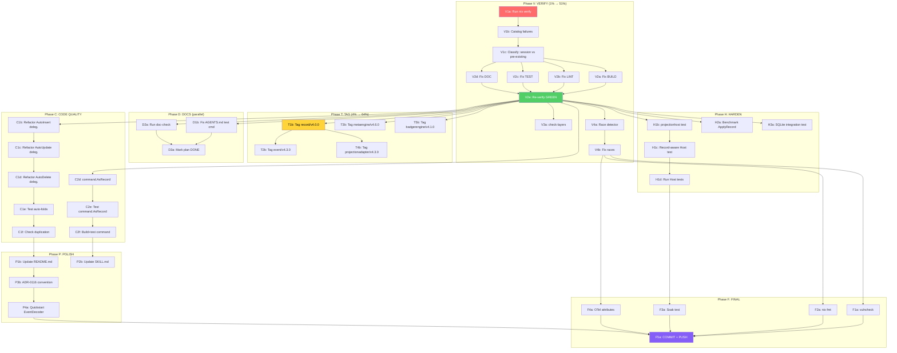

# Metaengine v2 — Hardening, Verification & Completion Plan

**Date:** 2026-08-06 23:53
**Status:** Planning
**Predecessor:** `docs/status/2026-08-06_23-38_metaengine-v2-follow-up-execution-complete.md`
**Scope:** Fix the 4 risks, close the 4 partial items, run the verify gate, and address the 50 next-step items from the status report.

---

## Context: What This Session Did

The previous session implemented all 34 tasks from the follow-up plan (Phases A-H):

- **2175 lines** across 12 new/modified files
- `event.AsRecord()` adapter bridging the ES pipeline to `record.Record`
- `projectionadapter.Handle()` now calls `ApplyRecord()` (was `Apply()`)
- `AutoInsert`/`AutoUpdate` stamp Record metadata into result fields automatically
- `AutoCRUDByConvention` — suffix-based type inference (`*Created`/`*Updated`/`*Deleted`)
- Badger engine calibrated with measured benchmarks
- Example app, integration tests, documentation updates

**But:** The full `nix run .#verify` gate was never run. `record/v4` is untagged. Code duplication exists in `auto_naming.go`. Several doc/test-command updates were skipped.

---

## Verschlimmbessern Risk Assessment

**"Verschlimmbessern" = making things worse while trying to improve.**

| Risk                                     | What Tempts Us                                                   | Why It's Dangerous                                                                                                                                                                                                                                                            | Mitigation                                                                                                 |
| ---------------------------------------- | ---------------------------------------------------------------- | ----------------------------------------------------------------------------------------------------------------------------------------------------------------------------------------------------------------------------------------------------------------------------- | ---------------------------------------------------------------------------------------------------------- |
| Fixing bbolt cloneBytes errors           | 4 gopls errors in `storage/bbolt/*.go`                           | **STALE** — the module builds fine (`go build ./storage/bbolt/...` passes). These are phantom gopls cache issues from the file-split anti-pattern documented in AGENTS.md. Touching bbolt is scope creep.                                                                     | **DO NOT TOUCH bbolt.** Restart gopls if the errors bother you.                                            |
| Aggressively refactoring auto_naming.go  | `autoInsertByType` duplicates `AutoInsert[E,R]` logic            | The duplication is **structural** — Go's lack of generic methods forces a non-generic core. The refactor (make generics delegate to ByType) is correct but changes the construction path of every auto-fold. If the refactor has a subtle bug, ALL auto-folds break silently. | Refactor AFTER verify gate passes. Test exhaustively. Keep the old path as a safety net during transition. |
| Changing AutoCRUDByConvention naming     | Currently matches Go struct names, not dot-separated event types | The rest of go-cqrs-lite uses `"task.created"` not `"TaskCreated"`. Changing this affects the convention contract.                                                                                                                                                            | **WAIT for user's answer to Question #2.** Do not change until the naming convention is decided.           |
| Adding record.FromCommand() blindly      | "It mirrors AsRecord, so it should be easy"                      | I haven't read `command.Command`'s struct shape in this session. Command metadata differs from event metadata. Mapping assumptions could be wrong.                                                                                                                            | Read `command.Command` + `command.Metadata` FIRST, then implement.                                         |
| Fixing lint findings in untouched files  | The verify gate may surface lint issues in files I didn't touch  | Scope creep. Fixing unrelated issues risks introducing new bugs and makes the commit harder to review.                                                                                                                                                                        | **Only fix lint in files this session touched.** Note unrelated findings in the status report.             |
| Changing AsRecord to use PayloadReadOnly | "It avoids a clone on every Handle() call"                       | `PayloadReadOnly` is internal-only. `AsRecord` is a public function in `event/`. Using internal accessors from a public function breaks the defensive-clone contract documented in AGENTS.md principle #15.                                                                   | **Keep Payload() clone.** Optimize later ONLY if profiling proves it's a bottleneck.                       |

**Golden rule:** Every task leaves the build greener than it found it. If a change doesn't improve correctness, testability, or consumer experience — don't make it.

---

## Pareto Analysis

### The 1% that delivers 51%

**Run `nix run .#verify` (or `nix run .#verify-fast`).**

This single action validates 2175 lines of changes across 12 files. Without it, every claim of "done" is a stale GREEN. The verify gate runs: build + vet + test + race + lint + doc-check + doc-assertions. If it passes, the session's work is PROVABLY correct. If it fails, we know exactly what to fix.

### The 4% that delivers 64%

**Verify gate + fix what it finds + tag `record/v4.0.0` + fix AGENTS.md test command.**

After verification, the two highest-impact fixes are:

1. **Tag `record/v4`** — without a tag, external consumers get `unknown revision record/v4/v4.0.0`. The workspace masks this.
2. **Fix AGENTS.md test command** — `./record/...` is missing from the test row. This is a split brain between the modules list and the test command.

### The 20% that delivers 80%

**All critical + high-priority items: verify + fix + tag + AGENTS.md + auto_naming.go dedup + record.FromCommand() + doc-check + race tests + metaengine README.**

This makes the work production-quality: no duplication, complete Record vision (events AND commands), documentation that consumers can follow, and race-detector confidence.

### The remaining 20% for 100%

All medium and low-priority items: SKILL.md updates, ADR convention sections, benchmarks, cqrs-lint rules, soak tests, OTel attributes, engine integration tests (SQLite/Pebble), vulncheck, etc.

---

## Coarse Task Breakdown (30-100 min each)

> Sorted by impact x customer-value / effort. "PF" = phase.

| ID  | Task                                                                                                                                               | PF  | Impact | Cust.Val | Effort | Dep | Est   |
| --- | -------------------------------------------------------------------------------------------------------------------------------------------------- | --- | ------ | -------- | ------ | --- | ----- |
| V1  | **Run `nix run .#verify`** — full gate: build+vet+test+race+lint+doc-check+doc-assertions. Catalog ALL failures.                                   | V   | 5      | 5        | 2      | —   | 30min |
| V2  | **Fix verify failures** — address every failure found by V1. Only fix files touched this session.                                                  | V   | 5      | 5        | 3      | V1  | 60min |
| V3  | **Run `nix run .#check-layers`** — verify dep budget after adding `record/v4` to event/                                                            | V   | 4      | 4        | 1      | V2  | 15min |
| V4  | **Run race detector** — `go test -race -tags "goexperiment.jsonv2" ./metaengine/... ./event/... ./record/...`                                      | V   | 4      | 4        | 1      | V2  | 15min |
| T1  | **Tag `record/v4.0.0`** — `git tag -a record/v4.0.0 -m "..."`. Verify with `git tag -l 'record/v4*'`                                               | T   | 5      | 5        | 1      | V2  | 10min |
| T2  | **Tag `event/v4.3.0`** — event now exports `AsRecord()`, new dependency on record/v4                                                               | T   | 4      | 4        | 1      | T1  | 10min |
| T3  | **Tag `metaengine/v4.6.0`** — new exports: `AutoCRUDByConvention`, `record_stamp.go`, auto-fold Record awareness                                   | T   | 4      | 4        | 1      | V2  | 10min |
| T4  | **Tag `metaengine/projectionadapter/v4.3.0`** — now depends on record/v4, calls ApplyRecord                                                        | T   | 3      | 3        | 1      | T1  | 10min |
| T5  | **Tag `metaengine/badgerengine/v4.1.0`** — calibrated constants                                                                                    | T   | 2      | 2        | 1      | V2  | 10min |
| D1  | **Fix AGENTS.md test command** — add `./record/...` to the `go test` command in Quick Reference                                                    | D   | 4      | 4        | 1      | —   | 10min |
| D2  | **Run `cmd/doc-check`** — verify all Go import paths in updated AGENTS.md + design docs are valid                                                  | D   | 3      | 3        | 1      | V2  | 15min |
| D3  | **Update follow-up plan** — mark Phases A-H as DONE in `docs/planning/2026-08-06_metaengine-v2-follow-up-plan.md`                                  | D   | 2      | 2        | 1      | —   | 10min |
| C1  | **Refactor `auto_naming.go`** — make `AutoInsert[E,R]`/`AutoUpdate[E,R]`/`AutoDelete[E]` delegate to the `ByType` variants. Eliminate duplication. | C   | 4      | 3        | 3      | V2  | 45min |
| C2  | **Add `record.FromCommand()`** — mirror of `event.AsRecord()`. Read `command.Command` + `command.Metadata` first.                                  | C   | 3      | 4        | 2      | —   | 30min |
| C3  | **Document naming convention** — add godoc to `AutoCRUDByConvention` explaining it matches Go struct names, not dot-separated event types          | C   | 3      | 4        | 1      | —   | 10min |
| C4  | **Document CausationID precedence** — add godoc to `AsRecord()` explaining typed Causation takes precedence over Tracing.CausationID               | C   | 2      | 3        | 1      | —   | 10min |
| H1  | **Add projectionhost lifecycle test** — test Record-aware folds through full Host.Start/Stop/checkpoint lifecycle                                  | H   | 4      | 3        | 3      | V2  | 45min |
| H2  | **Benchmark ApplyRecord overhead** — measure Handle() before/after the ApplyRecord switch                                                          | H   | 3      | 2        | 2      | V2  | 30min |
| H3  | **Add SQLite engine integration test** — test Record-aware pipeline through sqliteengine, not just Memory                                          | H   | 3      | 3        | 2      | V2  | 30min |
| P1  | **Update `metaengine/README.md`** — document OnRecord, AutoCRUDByConvention, Record stamping, AsRecord                                             | P   | 3      | 4        | 2      | —   | 30min |
| P2  | **Add `AsRecord` to SKILL.md consumer guide** — mention Record-aware pipeline in the Crush skill                                                   | P   | 2      | 4        | 2      | —   | 30min |
| P3  | **Add convention section to ADR-0116** — document Created/Updated/Deleted suffix matching formally                                                 | P   | 2      | 3        | 1      | —   | 15min |
| P4  | **Add WithEventDecoder example to quickstart** — show the recommended decoder path, not just PayloadDecoder                                        | P   | 2      | 3        | 1      | —   | 15min |
| F1  | **Run `nix run .#vulncheck`** — verify no new vulnerabilities                                                                                      | F   | 3      | 2        | 1      | V2  | 15min |
| F2  | **Run `nix fmt`** on whole repo — catch formatting issues in files touched this session                                                            | F   | 2      | 2        | 1      | V2  | 15min |
| F3  | **Add soak test** — 100K events through Record-aware pipeline, verify no memory leaks                                                              | F   | 2      | 2        | 3      | H1  | 45min |
| F4  | **Add OTel span attributes from Record** — stamp rec.StreamID, rec.Version as span attributes in projectionadapter                                 | F   | 2      | 2        | 2      | V2  | 30min |

**Estimated total:** ~10 hours (V+T phases: ~3h, C phase: ~1.5h, H phase: ~1.75h, P+F: ~4h)
**Critical path (V → T → C1):** ~2.5 hours

---

## Fine Task Breakdown (max 12 min each)

> All tasks from the coarse breakdown, split into actionable steps.
> Sorted by impact x customer-value / effort within each phase.

### Phase V: Verification (THE 1% that delivers 51%)

| ID  | Task                                                                                                                  | Dep   | Est   |
| --- | --------------------------------------------------------------------------------------------------------------------- | ----- | ----- |
| V1a | Run `nix run .#verify` (or `nix run .#verify-fast` if full gate too slow). Capture full output to a temp file.        | —     | 10min |
| V1b | Catalog every failure: categorize as BUILD, LINT, TEST, DOC, or RACE. Note which files each failure is in.            | V1a   | 10min |
| V1c | Classify each failure: "session-introduced" (must fix) vs "pre-existing" (note, don't fix) vs "stale gopls" (ignore). | V1b   | 10min |
| V2a | Fix BUILD failures in session-touched files only.                                                                     | V1c   | 12min |
| V2b | Fix LINT failures in session-touched files only (especially depguard allow-list for `record/v4`).                     | V1c   | 12min |
| V2c | Fix TEST failures in session-touched files only.                                                                      | V1c   | 12min |
| V2d | Fix DOC failures (doc-check, doc-assertions) in session-touched files only.                                           | V1c   | 12min |
| V2e | Re-run `nix run .#verify` to confirm all session-introduced issues are fixed.                                         | V2a-d | 10min |
| V3a | Run `nix run .#check-layers`. Verify event/ dependency budget after adding record/v4.                                 | V2e   | 10min |
| V4a | Run `go test -race -tags "goexperiment.jsonv2" ./metaengine/... ./event/... ./record/...`. Capture output.            | V2e   | 10min |
| V4b | Fix any race conditions found (only in session-touched files).                                                        | V4a   | 12min |

### Phase T: Tagging (makes work consumable externally)

| ID  | Task                                                                                                                                    | Dep | Est  |
| --- | --------------------------------------------------------------------------------------------------------------------------------------- | --- | ---- |
| T1a | Verify `record/v4` is untagged: `git tag -l 'record/v4*'`. Should be empty.                                                             | V2e | 2min |
| T1b | Create annotated tag: `git tag -a record/v4.0.0 -m "record: shared Record + CommonMetadata types (ADR-0111)"`                           | T1a | 2min |
| T1c | Verify tag exists: `git tag -l 'record/v4*'` should show `record/v4.0.0`                                                                | T1b | 1min |
| T2a | Check current event tag: `git tag -l 'event/v4*' \| grep -v eventtest \| sort -V \| tail -1`. Should be `event/v4.2.0`.                 | T1c | 2min |
| T2b | Create annotated tag: `git tag -a event/v4.3.0 -m "event: add AsRecord adapter for Record-aware fold pipeline"`                         | T2a | 2min |
| T3a | Check current metaengine tag: `git tag -l 'metaengine/v4*' \| sort -V \| tail -1`. Should be `metaengine/v4.5.0`.                       | V2e | 2min |
| T3b | Create annotated tag: `git tag -a metaengine/v4.6.0 -m "metaengine: AutoCRUDByConvention, Record-aware auto-folds, record stamping"`    | T3a | 2min |
| T4a | Check projectionadapter tag: `git tag -l 'metaengine/projectionadapter/v4*' \| sort -V \| tail -1`. Should be `v4.2.0`.                 | T1c | 2min |
| T4b | Create annotated tag: `git tag -a metaengine/projectionadapter/v4.3.0 -m "projectionadapter: ApplyRecord + Record-aware fold pipeline"` | T4a | 2min |
| T5a | Check badgerengine tag: `git tag -l 'metaengine/badgerengine/v4*' \| sort -V \| tail -1`.                                               | V2e | 2min |
| T5b | Create annotated tag: `git tag -a metaengine/badgerengine/v4.1.0 -m "badgerengine: calibrated cost constants from benchmarks"`          | T5a | 2min |

### Phase D: Documentation Fixes (split-brain elimination)

| ID  | Task                                                                                                                                                                                                                            | Dep | Est   |
| --- | ------------------------------------------------------------------------------------------------------------------------------------------------------------------------------------------------------------------------------- | --- | ----- |
| D1a | Read the AGENTS.md Quick Reference Test row (line ~30). Find the exact location where `./record/...` should be inserted.                                                                                                        | —   | 5min  |
| D1b | Edit AGENTS.md: add `./record/...` to the test command after `./query/...` (alphabetical). Also add `./metaengine/sqliteengine/...`, `./metaengine/badgerengine/...`, `./metaengine/graphadapter/...` if missing.               | D1a | 10min |
| D1c | Verify the test command runs: copy it and execute to confirm no "no Go files" errors for new paths.                                                                                                                             | D1b | 5min  |
| D2a | Run `cd cmd/doc-check && GOWORK=off go run . ../../AGENTS.md ../../docs/planning/meta-engine-project-definition.md ../../docs/planning/meta-engine-design.md ../../docs/planning/meta-engine-assumptions-and-query-planning.md` | V2e | 10min |
| D2b | Fix any import path failures found by doc-check.                                                                                                                                                                                | D2a | 10min |
| D3a | Edit `docs/planning/2026-08-06_metaengine-v2-follow-up-plan.md`: add "STATUS: DONE" header, mark each phase table with checkmarks.                                                                                              | —   | 10min |

### Phase C: Code Quality (dedup + completion)

| ID  | Task                                                                                                                                                                                                      | Dep | Est   |
| --- | --------------------------------------------------------------------------------------------------------------------------------------------------------------------------------------------------------- | --- | ----- |
| C1a | Read `metaengine/auto_fold.go` fully. Map every line of `AutoInsert[E,R]` that duplicates `autoInsertByType`.                                                                                             | V2e | 10min |
| C1b | Refactor `AutoInsert[E,R]` to delegate: `func AutoInsert[E any, R any](keyField string) Fold { return autoInsertByType(reflect.TypeOf(*new(E)), reflect.TypeFor[R](), keyField) }`                        | C1a | 12min |
| C1c | Refactor `AutoUpdate[E,R]` to delegate to `autoUpdateByType`. Same pattern.                                                                                                                               | C1b | 10min |
| C1d | Refactor `AutoDelete[E]` to delegate to `autoDeleteByType`. Same pattern.                                                                                                                                 | C1c | 10min |
| C1e | Run `go test -tags "goexperiment.jsonv2" ./metaengine/ -run Auto -count=1 -v`. All 11 auto-fold tests must pass.                                                                                          | C1d | 5min  |
| C1f | Run dedup check: `nix run .#check-duplication` if available. Verify no new clones introduced.                                                                                                             | C1e | 10min |
| C2a | Read `command/command.go` + `command/metadata.go` to understand Command struct shape.                                                                                                                     | —   | 10min |
| C2b | Read `command/go.mod` to check if it already depends on `record/v4`.                                                                                                                                      | C2a | 5min  |
| C2c | Add `record/v4` to `command/go.mod` if not present.                                                                                                                                                       | C2b | 5min  |
| C2d | Write `command/asrecord.go` — `func AsRecord(cmd Command) record.Record` mapping command fields to Record.                                                                                                | C2a | 12min |
| C2e | Write `command/asrecord_test.go` — verify field mappings.                                                                                                                                                 | C2d | 12min |
| C2f | Build + test: `go test -tags "goexperiment.jsonv2" ./command/... -count=1`                                                                                                                                | C2e | 5min  |
| C3a | Edit `metaengine/auto_naming.go`: expand `AutoCRUDByConvention` godoc to explain it matches Go struct names (e.g. `"TaskCreated"` not `"task.created"`). Note this differs from the rest of go-cqrs-lite. | —   | 10min |
| C4a | Edit `event/asrecord.go`: expand `AsRecord` godoc to document CausationID precedence rule (typed Causation.CommandID takes precedence over Tracing.CausationID).                                          | —   | 10min |

### Phase H: Hardening (test coverage)

| ID  | Task                                                                                                                                            | Dep | Est   |
| --- | ----------------------------------------------------------------------------------------------------------------------------------------------- | --- | ----- |
| H1a | Read `projectionhost` test patterns to understand how to construct a Host with checkpoint store.                                                | V2e | 10min |
| H1b | Write `metaengine/projectionadapter/projectionhost_test.go` — register adapter with Host, Start, send events, verify checkpoint advances, Stop. | H1a | 12min |
| H1c | Add Record-aware assertion: OnRecord fold receives real StreamID through Host lifecycle.                                                        | H1b | 10min |
| H1d | Run test: `go test -tags "goexperiment.jsonv2" ./metaengine/projectionadapter/... -run TestProjectionHost -count=1 -v`                          | H1c | 5min  |
| H2a | Write `metaengine/projectionadapter/bench_test.go` — BenchmarkHandle with ApplyRecord (current path).                                           | V2e | 12min |
| H2b | Compare against BenchmarkHandle with Apply (old path) by temporarily reverting. Record ns/op delta.                                             | H2a | 12min |
| H3a | Write integration test using `metaengine/sqliteengine` instead of Memory engine. Verify Record stamping works through SQLite.                   | V2e | 12min |
| H3b | Run: `go test -tags "goexperiment.jsonv2" ./metaengine/sqliteengine/... -count=1`                                                               | H3a | 5min  |

### Phase P: Polish (consumer experience)

| ID  | Task                                                                                                           | Dep | Est   |
| --- | -------------------------------------------------------------------------------------------------------------- | --- | ----- |
| P1a | Read current `metaengine/README.md` to understand structure.                                                   | —   | 5min  |
| P1b | Add "Record-Aware Folds" section: OnRecord, ApplyRecord, AutoInsert/AutoUpdate stamping, AutoCRUDByConvention. | P1a | 12min |
| P1c | Add `event.AsRecord()` mention + link to projectionadapter as the bridge.                                      | P1b | 5min  |
| P2a | Read `.agents/skills/go-cqrs-lite/references/modules.md` to find metaengine section.                           | —   | 5min  |
| P2b | Add Record-aware pipeline mention: AsRecord, OnRecord, AutoCRUDByConvention.                                   | P2a | 10min |
| P2c | Run doc-check on SKILL.md references.                                                                          | P2b | 5min  |
| P3a | Read `docs/adr/0116-layered-auto-projection.md`. Find where convention matching should be documented.          | —   | 5min  |
| P3b | Add "Convention" subsection: Created/Updated/Deleted suffix matching, Go struct name requirement, error cases. | P3a | 10min |
| P4a | Edit `example/metaengine-quickstart/main.go`: add a second section showing WithEventDecoder path.              | —   | 10min |

### Phase F: Future / Final

| ID  | Task                                                                                                                              | Dep | Est   |
| --- | --------------------------------------------------------------------------------------------------------------------------------- | --- | ----- |
| F1a | Run `nix run .#vulncheck`. Verify no new vulnerabilities from dependency changes.                                                 | V2e | 10min |
| F2a | Run `nix fmt` on the repo. Review diff for only session-touched files.                                                            | V2e | 10min |
| F3a | Write `metaengine/projectionadapter/soak_test.go` — 100K events through Record-aware pipeline. Verify TotalAlloc/event is stable. | H1d | 12min |
| F4a | Add OTel span attributes in `projectionadapter.Handle()`: `rec.StreamID`, `rec.Version`, `rec.Type` as span attributes.           | V2e | 12min |
| F5a | **Commit + push** — create detailed commit with all changes from this plan.                                                       | All | 10min |

### Deferred (from status report items 21-50, NOT actionable now)

| ID  | Item                                             | Why Deferred                                      |
| --- | ------------------------------------------------ | ------------------------------------------------- |
| X1  | Dgraph engine implementation (I1)                | Needs running Dgraph cluster                      |
| X2  | Tombstone v5 removal (I2)                        | Correctly deferred to v5                          |
| X3  | RecordBuilder fluent API                         | YAGNI — no consumer demand                        |
| X4  | `record.Record.Equals()` method                  | YAGNI — test assertions use field-by-field        |
| X5  | `ApplyRecordBatch` streaming                     | YAGNI — no performance need shown                 |
| X6  | Metrics in projectionadapter                     | No consumer request                               |
| X7  | Document `covered` map logic                     | Already documented in `computeRecordStamps` godoc |
| X8  | Test `computeRecordStamps` with embedded structs | Nice-to-have, low risk                            |
| X9  | `AutoInsertWithMetadata` variant                 | Current implicit behavior is correct              |
| X10 | cqrs-lint rule for Record field naming           | Tooling improvement, not blocking                 |
| X11 | `diagnose` command in cqrs-bench                 | Tooling improvement                               |
| X12 | `record.Record.Stream()` method                  | Interop nice-to-have                              |
| X13 | Pebble engine integration test                   | H3 covers SQLite; Pebble is similar               |
| X14 | `ApplyRecordIdempotent`                          | YAGNI until consumer needs it                     |
| X15 | ActorID from command context                     | Design decision needed (Question #3)              |
| X16 | `event.AsRecords([]Event)` batch                 | YAGNI until profiling shows need                  |
| X17 | `record.Validate()` method                       | YAGNI — validation is domain-specific             |
| X18 | RecordLogger middleware                          | OTel covers observability                         |
| X19 | `ProjectionSink.Record()` method                 | Relational projections don't need Record          |
| X20 | `brandedString` generic constraint test          | Compile-time assertions already cover this        |

---

## Execution Order (mermaid)

---

## Summary Statistics

| Metric                             | Value                               |
| ---------------------------------- | ----------------------------------- |
| Coarse tasks                       | 27                                  |
| Fine tasks (max 12min)             | 62                                  |
| Deferred items                     | 20                                  |
| Estimated total effort             | ~10 hours                           |
| Critical path                      | V1a → V2e → T1b → C1b → C1e (~2.5h) |
| Tasks with deps on verify gate     | 41 of 62 (66%)                      |
| Verschlimmbessern risks identified | 6                                   |
| Questions for user                 | 3 (see status report)               |

---

## Open Questions (require user input before execution)

1. **Should `record/v4` be tagged `v4.0.0` now?** Or wait for API stabilization? The module is zero-dependency and types haven't changed, but the adapter wiring is new.

2. **Should `AutoCRUDByConvention` match by Go struct name or event type string?** Currently matches struct name (`"TaskCreated"` not `"task.created"`). This conflicts with the rest of go-cqrs-lite. Changing it affects the convention contract.

3. **Should `event.AsRecord()` be the permanent bridge, or transitional toward embedding?** The original plan called for embedding `record.Record` into `event.Event`. The adapter approach is non-breaking but adds a conversion on every `Handle()` call.
