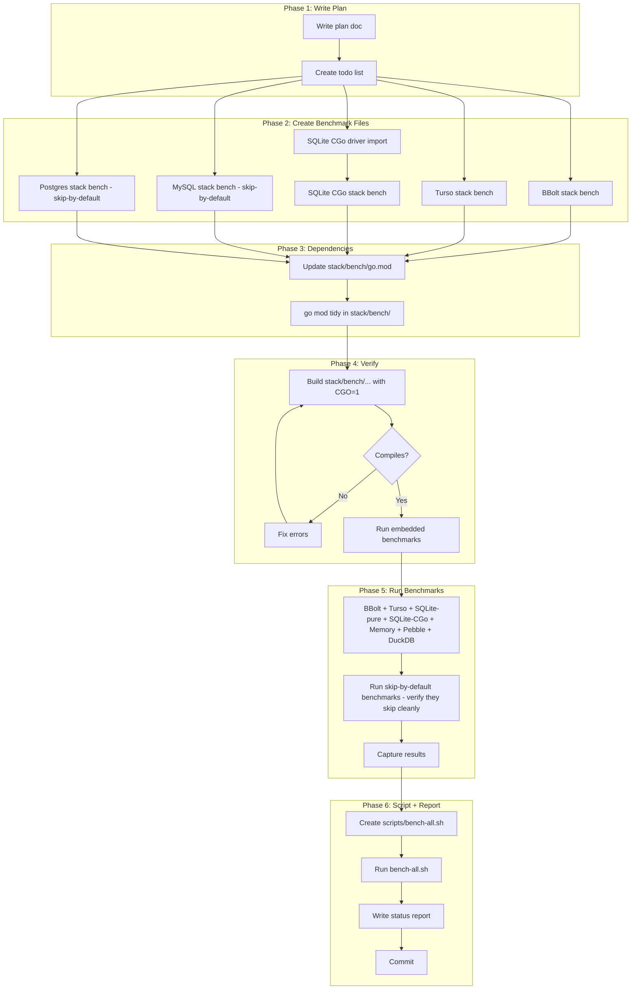

# Plan: Comprehensive Benchmark Coverage

**Date:** 2026-08-07 00:00 CEST
**Scope:** Close ALL benchmark coverage gaps in the benchmark + linter scope

---

## Problem Statement

The "full benchmark suite" from the prior session was a lie of omission:

- **302 benchmarks** was 4 hand-cherry-picked module groups, NOT `go test -bench=.` across all modules
- **8 Postgres benchmarks** silently skipped (no server running) — counted as "PASS"
- **Turso benchmarks** existed but weren't in any group
- **BBolt** — zero benchmarks anywhere in the repo (supported backend, completely untested)
- **MySQL** — zero benchmarks anywhere (supported backend, completely untested)
- **SQLite CGo vs pure-Go** — infrastructure exists (`WithDriverName`, `cqrs-bench sqlite-cgo`) but no `_test.go` benchmark exists, comparison was never run
- **PostgreSQL/MySQL stack-level** — zero benchmarks (only metaengine-level PG benches exist, skip-by-default)

The #1 question every Go developer asks when choosing SQLite — "pure-Go vs CGo?" — has **zero test coverage**.

---

## Pareto Breakdown

### Layer 1: 1% that delivers 51%

| Item | Impact | Why |
|------|--------|-----|
| **SQLite pure-Go vs CGo comparison benchmark** | MASSIVE | THE #1 question for any Go project using SQLite. Infra exists (`WithDriverName("sqlite3")`), just needs a `_test.go` benchmark in `stack/bench/`. Direct A/B comparison under identical workload. |

### Layer 2: 4% that delivers 64%

| Item | Impact | Why |
|------|--------|-----|
| Above + **BBolt stack benchmark** | HIGH | Third embedded KV backend (after Pebble + Memory). Supported in `cqrs-bench`, zero benchmarks anywhere. Embedded = runs in CI without a server. |
| Above + **Comprehensive bench-all script** | HIGH | So "full suite" is actually full. No more cherry-picking. Script discovers all modules with benchmarks and runs them all, reporting skips visibly. |

### Layer 3: 20% that delivers 80%

| Item | Impact | Why |
|------|--------|-----|
| Above + **Turso stack benchmark** | MEDIUM | Embedded backend, runs without server. Storage-level benches exist but stack-level doesn't. |
| Above + **Postgres stack benchmark** (skip-by-default) | MEDIUM | Server-backed, skips without DSN. But the benchmark EXISTS so `POSTGRES_BENCH_DSN=...` enables it. |
| Above + **MySQL stack benchmark** (skip-by-default) | MEDIUM | Same as Postgres. Currently zero benchmarks anywhere. |

### Layer 4: The other 20% (to 100%)

| Item | Impact | Why |
|------|--------|-----|
| **Actually RUN everything** | CRITICAL | A benchmark that's never run is zero value. Run all embedded benchmarks, capture results. |
| **Status report with honest results** | HIGH | Document what ran, what skipped, what the numbers show. |
| **Update AGENTS.md module list** | LOW | Document new benchmark files in the canonical reference. |

---

## Current Benchmark Coverage Matrix

| Backend | Storage-Level | Stack-Level (`stack/bench/`) | Metaengine-Level | CLI (`cqrs-bench`) |
|---------|:---:|:---:|:---:|:---:|
| Memory | ✅ | ✅ | ✅ | ✅ |
| SQLite (modernc/pure-Go) | ✅ | ✅ | ✅ | ✅ |
| SQLite (mattn/CGo) | ❌ | ❌ | ❌ | ✅ (CLI-only) |
| Pebble | ✅ | ✅ | ✅ | ✅ |
| BBolt | ❌ | ❌ | N/A | ✅ (CLI-only) |
| Turso | ✅ | ❌ | N/A | ✅ (CLI-only) |
| DuckDB | N/A | ✅ (CGo) | ✅ | ✅ (CGo) |
| Postgres | N/A | ❌ | ✅ (skip-by-default) | ✅ (needs DSN) |
| MySQL | N/A | ❌ | N/A | ✅ (needs DSN) |

**After this plan:**

| Backend | Storage-Level | Stack-Level (`stack/bench/`) | Metaengine-Level | CLI (`cqrs-bench`) |
|---------|:---:|:---:|:---:|:---:|
| Memory | ✅ | ✅ | ✅ | ✅ |
| SQLite (modernc/pure-Go) | ✅ | ✅ | ✅ | ✅ |
| SQLite (mattn/CGo) | ❌ | **✅ NEW** | N/A | ✅ |
| Pebble | ✅ | ✅ | ✅ | ✅ |
| BBolt | ❌ | **✅ NEW** | N/A | ✅ |
| Turso | ✅ | **✅ NEW** | N/A | ✅ |
| DuckDB | N/A | ✅ (CGo) | ✅ | ✅ (CGo) |
| Postgres | N/A | **✅ NEW** (skip) | ✅ (skip) | ✅ (needs DSN) |
| MySQL | N/A | **✅ NEW** (skip) | N/A | ✅ (needs DSN) |

---

## Execution Graph

---

## Detailed Task Breakdown (30-min chunks)

| # | Task | Impact | Effort | Files |
|---|------|--------|--------|-------|
| 1 | SQLite CGo vs pure-Go comparison benchmark | CRITICAL | 15min | `stack/bench/benchkit_suite_sqlite_cgo_test.go`, `stack/bench/sqlite_cgo_driver_test.go` |
| 2 | BBolt stack benchmark | HIGH | 10min | `stack/bench/benchkit_suite_bbolt_test.go` |
| 3 | Turso stack benchmark | HIGH | 10min | `stack/bench/benchkit_suite_turso_test.go` |
| 4 | MySQL stack benchmark (skip-by-default) | MEDIUM | 10min | `stack/bench/benchkit_suite_mysql_test.go` |
| 5 | Postgres stack benchmark (skip-by-default) | MEDIUM | 10min | `stack/bench/benchkit_suite_postgres_test.go` |
| 6 | Update go.mod + go mod tidy | HIGH | 10min | `stack/bench/go.mod` |
| 7 | Build verification (CGO=1, jsonv2) | HIGH | 5min | — |
| 8 | Run all 9 embedded benchmarks | CRITICAL | 15min | — |
| 9 | Create bench-all.sh script | HIGH | 15min | `scripts/bench-all.sh` |
| 10 | Run full suite via script | HIGH | 15min | — |
| 11 | Write status report | MEDIUM | 15min | `docs/status/...` |
| 12 | Commit | LOW | 5min | — |

---

## Micro-Task Breakdown (12-min chunks)

| # | Micro-Task | Est |
|---|-----------|-----|
| 1a | Read existing `benchkit_suite_test.go` pattern | 2min |
| 1b | Create `sqlite_cgo_driver_test.go` (blank import, cgo tag) | 3min |
| 1c | Create `benchkit_suite_sqlite_cgo_test.go` (BenchmarkBenchkitSuite_SQLiteCGo) | 5min |
| 2a | Create `benchkit_suite_bbolt_test.go` | 5min |
| 3a | Create `benchkit_suite_turso_test.go` (unwrap .Bundle) | 5min |
| 4a | Create `benchkit_suite_mysql_test.go` (env DSN, skip) | 5min |
| 5a | Create `benchkit_suite_postgres_test.go` (env DSN, skip) | 5min |
| 6a | Add deps to go.mod direct require block | 3min |
| 6b | Run `go mod tidy -e` in stack/bench/ | 5min |
| 7a | Build: `GOEXPERIMENT=jsonv2 CGO_ENABLED=1 go build -tags goexperiment.jsonv2 ./stack/bench/...` | 3min |
| 7b | Vet: `GOEXPERIMENT=jsonv2 CGO_ENABLED=1 go vet -tags goexperiment.jsonv2 ./stack/bench/...` | 3min |
| 8a | Run: `go test -bench=BenchmarkBenchkitSuite -benchtime=1x -tags goexperiment.jsonv2 ./stack/bench/...` | 10min |
| 9a | Write scripts/bench-all.sh (discover modules, run benches, report skips) | 8min |
| 9b | Make executable + test the script | 2min |
| 10a | Run bench-all.sh and capture output | 10min |
| 11a | Write status report with results table | 10min |
| 12a | Git add + commit with detailed message | 5min |

---

## Design Decisions

### 1. SQLite CGo Comparison Pattern
Follow the exact `cqrs-bench` pattern: `//go:build cgo` gated blank import file + `//go:build cgo` gated benchmark file. The benchmark uses `sqlite.WithDriverName("sqlite3")` to switch to mattn/go-sqlite3. Everything else is identical to the existing `BenchmarkBenchkitSuite_SQLite` — same profile, same payload size, same dir pattern. The ONLY variable is the driver.

### 2. BBolt/Turso — No Server Needed
Both are embedded. BBolt uses a file path. Turso uses a file path (embedded libSQL). Both run in CI without external dependencies.

### 3. MySQL/Postgres — Skip-by-Default Pattern
Follow the `metaengine/pgengine/bench_test.go` pattern: read DSN from env var, `b.Skipf` if not set. The benchmark EXISTS so it's runnable with the right env. No server dependency in CI.

### 4. go.mod Dependency Strategy
`stack/bench/go.mod` gains:
- `github.com/larsartmann/go-cqrs-lite/stack/bbolt/v4` (direct)
- `github.com/larsartmann/go-cqrs-lite/stack/turso/v4 v4.2.0` (direct)
- `github.com/larsartmann/go-cqrs-lite/stack/mysql/v4 v4.0.0` (direct)
- `github.com/larsartmann/go-cqrs-lite/stack/postgres/v4` — already indirect, promote to direct
- `github.com/mattn/go-sqlite3` (direct, CGo-gated blank import)

### 5. bench-all.sh Script
Discovers all modules via `go.work`, runs `go test -bench=.` in each with `GOEXPERIMENT=jsonv2 CGO_ENABLED=1`, reports:
- Modules with benchmarks: PASS/FAIL + count
- Benchmarks that skipped: SKIP + reason
- Total wall time

No cherry-picking. Every module gets tried.

### 6. No AGENTS.md Update
The daemon is actively editing AGENTS.md (metaengine v2 refactor). Editing it risks conflicts. Skip until daemon stabilizes.
