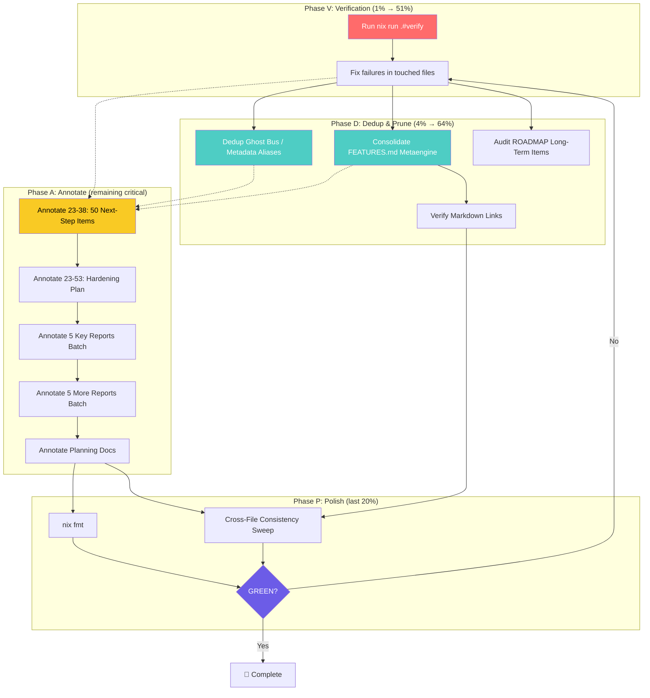

# SUPERB Post-Docs-Health — Annotation, Dedup & Verification Plan

**Date:** 2026-08-07 02:31
**Status:** Planning
**Predecessor:** `docs/status/2026-08-07_02-30_docs-health-audit-living-docs-rebuild.md`
**Scope:** Close ALL gaps from the docs-health self-review: ANNOTATE historical reports, dedup cross-file, prune FEATURES, run verify gate, polish.

---

## Context: What the Prior Session Did

The prior session rebuilt the 4 living docs (TODO_LIST, ROADMAP, FEATURES, CHANGELOG) from 50+ status reports + code verification. It ran HARVEST + BUILD + VERIFY modes of the docs-health skill. **But it completely skipped ANNOTATE mode** — the "update-old-docs" half of the request. 50+ status reports remain unannotated: numbered items have no `done at` markers, so a reader opening any report assumes everything is still open.

Additionally: the verify gate was never run, Ghost bus / Metadata aliases are duplicated across TODO_LIST + ROADMAP, and FEATURES.md grew to 175KB without pruning.

---

## Verschlimmbessern Risk Assessment

| Risk                                        | What Tempts Us                                        | Why It's Dangerous                                                                           | Mitigation                                                                                                                                                   |
| ------------------------------------------- | ----------------------------------------------------- | -------------------------------------------------------------------------------------------- | ------------------------------------------------------------------------------------------------------------------------------------------------------------ |
| **Marking items "done" with wrong hashes**  | Bulk-annotating without verifying each item           | A wrong hash is worse than no annotation — it actively misleads                              | Grep code for each claim before marking. Use `git log --oneline --all --grep` to find the right commit                                                       |
| **Over-pruning FEATURES.md**                | Removing rows that seem like "implementation details" | This is a LIBRARY. Consumers need feature-level detail. Removing a row = hiding a capability | Only remove rows that are pure implementation internals (Dead code wiring, Exhaustiveness guard). Consolidate related rows; never delete a unique capability |
| **Editing status reports destructively**    | Deleting old text, renumbering items                  | Status reports are historical artifacts. The value is the point-in-time snapshot             | Use strikethrough (`~~text~~`) only. Never delete text. Never renumber                                                                                       |
| **Fixing unrelated verify failures**        | The gate may surface issues in files I didn't touch   | Scope creep. Fixing unrelated issues risks introducing new bugs                              | Only fix failures in files this session touches. Note unrelated findings                                                                                     |
| **Breaking doc-check further**              | Trying to fix the cmdguard arg-parsing issue          | The tool has a pre-existing issue. Fixing it is scope creep                                  | Use the `nix run .#verify` path which invokes doc-check via flake wrapper                                                                                    |
| **Annotating reports that don't need it**   | "I should annotate ALL 50+"                           | Most 08-05 reports have items already done or in TODO_LIST. Annotating them adds noise       | Focus on the 10-12 most impactful 08-06 reports with numbered items. SKIP/LEAVE-ALONE the rest                                                               |
| **Ghost bus ROADMAP removal loses context** | Deleting the ROADMAP entry entirely                   | ROADMAP provides the strategic "why" (ADR-0028). TODO_LIST provides the "what next"          | Keep ROADMAP entry as cross-ref: "See TODO_LIST → Deferred Debt". Remove the duplicated detail                                                               |

**Golden rule:** Every task leaves docs healthier than it found them. If a change doesn't improve clarity or accuracy, don't make it.

---

## Pareto Analysis

### The 1% that delivers 51%

**Run `nix run .#verify` (or `nix run .#verify-fast`).**

This single action validates ALL doc changes from the prior session. Without it, every claim of "docs are updated" is a stale GREEN. The verify gate runs: build + vet + test + race + lint + doc-check + doc-assertions. If it passes, the prior session's work is PROVABLY correct. If it fails, we know exactly what to fix.

### The 4% that delivers 64%

**Verify gate + fix what it finds + dedup Ghost bus/Metadata aliases + consolidate FEATURES.md metaengine section.**

After verification, the highest-impact fixes are:

1. **Dedup cross-file** — Ghost bus + Metadata aliases live in ONE place (TODO_LIST), ROADMAP gets a cross-ref
2. **Consolidate FEATURES.md** — merge 90+ metaengine rows to ~50 by removing implementation-detail rows and merging related features. Reduces noise, improves scannability

### The 20% that delivers 80%

**All critical + high items: verify + fix + dedup + prune + annotate the top 10 most impactful reports.**

This makes the docs actually trustworthy:

- Historical reports have inline `done at` markers (reader can scan instantly)
- Living docs have no duplication
- FEATURES.md is scannable, not a data dump
- The verify gate is GREEN

### The remaining 20% for 100%

Annotate remaining reports (08-05 batch + lower-priority 08-06), polish (nix fmt, ROADMAP raw ideas audit, markdown link verification), metaengine v2 follow-up tasks.

---

## Coarse Task Breakdown (30-100 min each)

> Sorted by impact x customer-value / effort. "PF" = phase.

| ID  | Task                                                                                                                                          | PF  | Impact | Cust.Val | Effort | Dep      | Est   |
| --- | --------------------------------------------------------------------------------------------------------------------------------------------- | --- | ------ | -------- | ------ | -------- | ----- |
| V1  | **Run `nix run .#verify`** (or `verify-fast`). Catalog ALL failures.                                                                          | V   | 5      | 5        | 2      | —        | 30min |
| V2  | **Fix verify failures** in session-touched files only (AGENTS, TODO, ROADMAP, FEATURES, CHANGELOG).                                           | V   | 5      | 5        | 3      | V1       | 45min |
| D1  | **Dedup Ghost bus / Metadata aliases** — keep in TODO_LIST, replace ROADMAP detail with cross-ref.                                            | D   | 4      | 3        | 1      | —        | 15min |
| D2  | **Consolidate FEATURES.md metaengine section** — remove ~20 implementation-detail rows, merge related capability rows.                        | D   | 4      | 4        | 3      | —        | 45min |
| D3  | **Audit ROADMAP long-term items** — mark shipped items (WithColumnarLayout, etc.).                                                            | D   | 3      | 3        | 2      | —        | 30min |
| A1  | **Annotate `23-38_metaengine-v2-follow-up-execution-complete.md`** — 50 next-step items, most now in TODO_LIST or done.                       | A   | 5      | 4        | 5      | —        | 60min |
| A2  | **Annotate `23-53_metaengine-v2-hardening-and-completion-plan.md`** — 40+ task IDs (V1a, T1a, etc.).                                          | A   | 4      | 4        | 4      | —        | 60min |
| A3  | **Annotate batch: 5 key reports** (23-05 all-phases, 22-59 lint-sweep, 19-04 full-todo, 18-59 adr-overhaul, 14-43 bbolt-eval).                | A   | 4      | 3        | 4      | —        | 60min |
| A4  | **Annotate batch: 5 more reports** (14-06 sqlite-cgo, 12-54 session1-followup, 09-38 superb-session1, 13-06 readme-audit, 01-02 docs-health). | A   | 3      | 3        | 4      | —        | 60min |
| A5  | **Annotate 2026-08-06 planning docs** — mark phases DONE in execution plans.                                                                  | A   | 3      | 2        | 2      | —        | 30min |
| P1  | **Run `nix fmt`** on touched files.                                                                                                           | P   | 2      | 2        | 1      | V2       | 10min |
| P2  | **Final cross-file consistency sweep** — stale counts, split-brains, link check.                                                              | P   | 4      | 3        | 2      | D2       | 30min |
| P3  | **Re-run verify gate** — confirm all fixes GREEN.                                                                                             | P   | 5      | 4        | 1      | V2,D1,D2 | 15min |

**Estimated total:** ~8.5 hours (V: 1.25h, D: 1.5h, A: 4.5h, P: 0.9h)
**Critical path (V → D2 → P3):** ~1.5 hours

---

## Fine Task Breakdown (max 12 min each)

> All tasks from the coarse breakdown, split into actionable steps.
> Sorted by impact x customer-value / effort within each phase.

### Phase V: Verification (THE 1% that delivers 51%)

| ID  | Task                                                                                         | Dep | Est   |
| --- | -------------------------------------------------------------------------------------------- | --- | ----- |
| V1a | Run `nix run .#verify` (or `nix run .#verify-fast`). Capture output.                         | —   | 10min |
| V1b | Catalog every failure: BUILD, LINT, TEST, DOC, or RACE. Note which file each is in.          | V1a | 10min |
| V1c | Classify: "doc-session-introduced" vs "pre-existing" vs "stale gopls".                       | V1b | 5min  |
| V2a | Fix DOC failures (doc-check, doc-assertions) in AGENTS/TODO/ROADMAP/FEATURES/CHANGELOG only. | V1c | 12min |
| V2b | Fix any other failures in session-touched files only. Note pre-existing issues.              | V1c | 12min |

### Phase D: Dedup & Prune (THE 4% that delivers 64%)

| ID  | Task                                                                                                                                                                                                                                                      | Dep | Est   |
| --- | --------------------------------------------------------------------------------------------------------------------------------------------------------------------------------------------------------------------------------------------------------- | --- | ----- |
| D1a | Read ROADMAP Theme 9 "Deferred Debt" section. Find Ghost bus + Metadata aliases entries.                                                                                                                                                                  | —   | 5min  |
| D1b | Replace detailed entries with: "See [TODO_LIST](TODO_LIST.md) → Deferred Debt for rationale and next steps (ADR-0028, ADR-0031)."                                                                                                                         | D1a | 8min  |
| D2a | Read FEATURES.md metaengine section (rows ~212-296). Identify implementation-detail rows to remove.                                                                                                                                                       | —   | 10min |
| D2b | Remove/merge: Dead code wiring, Exhaustiveness guard, Reification failure tracking, Fold-classify, Enum validation, Store composition, ScanResult explicit HasMore (merge with collection results), Cross-engine meta-test (merge with ADT test harness). | D2a | 12min |
| D2c | Verify no unique capability is lost — each removed row should be an impl detail, not a user-visible feature.                                                                                                                                              | D2b | 8min  |
| D3a | Read ROADMAP "Remaining (long-term)" items in Theme 1. Grep code for each.                                                                                                                                                                                | —   | 10min |
| D3b | Mark shipped items with ✅. Update remaining text.                                                                                                                                                                                                        | D3a | 10min |
| D4a | Run markdown link check: extract all `[...](path)` from TODO_LIST + ROADMAP + FEATURES, verify targets exist.                                                                                                                                             | —   | 12min |
| D4b | Fix any broken links found.                                                                                                                                                                                                                               | D4a | 8min  |

### Phase A: Annotate (THE remaining critical work)

> Format: `~~<original line>~~ done at <hash>` for shipped items. Leave open items untouched. For 5+ resolved items, use a resolution table at the end.

| ID  | Task                                                                                                                 | Dep | Est   |
| --- | -------------------------------------------------------------------------------------------------------------------- | --- | ----- |
| A1a | Read `23-38` report sections f) "Up to 50 Things" — items 1-20 (Critical + High).                                    | —   | 10min |
| A1b | For each item: grep code / git log to determine done vs open. Mark done items inline with `~~text~~ done at <hash>`. | A1a | 12min |
| A1c | Read items 21-38 (Medium + Low). Same process.                                                                       | A1b | 12min |
| A1d | Add `## Resolution (2026-08-07)` appendix summarizing what shipped vs what's in TODO_LIST.                           | A1c | 10min |
| A2a | Read `23-53` hardening plan. Identify which tasks (V1-V4, T1-T5, D1-D3, C1-C4) were executed by later sessions.      | —   | 10min |
| A2b | Mark executed tasks inline. Use Status column pattern for the task tables.                                           | A2a | 12min |
| A3a | Annotate `23-05_all-phases-complete.md` — 5 open items, most resolved. Inline edits.                                 | —   | 8min  |
| A3b | Annotate `22-59_golangci-lint-fix-sweep-final.md` — lint findings list, mark resolved.                               | —   | 10min |
| A3c | Annotate `19-04_full-todo-execution.md` — bbolt checklist, mark done items.                                          | —   | 12min |
| A3d | Annotate `18-59_metaengine-architecture-adr-overhaul.md` — ADR items, mark written.                                  | —   | 10min |
| A3e | Annotate `14-43_bbolt-backend-and-kv-store-evaluation.md` — bbolt gaps, mark resolved/in-TODO.                       | —   | 10min |
| A4a | Annotate `14-06_sqlite-cgo-bench-fairness.md` — CGo findings, mark resolved.                                         | —   | 10min |
| A4b | Annotate `12-54_superb-session1-followup-brutal-review.md` — quality items, mark resolved.                           | —   | 10min |
| A4c | Annotate `09-38_superb-execution-plan-session-1-brutal-review.md` — T-series items, mark resolved.                   | —   | 12min |
| A4d | Annotate `13-06_readme-quality-audit.md` — README audit findings, mark resolved.                                     | —   | 8min  |
| A4e | Annotate `01-02_docs-health-living-docs-update-brutal-self-review.md` — prior docs-health items.                     | —   | 8min  |
| A5a | Read `19-01_metaengine-v2-execution-plan.md`. Mark phases 0-7 as DONE.                                               | —   | 8min  |
| A5b | Read `19-01_metaengine-v2-follow-up-plan.md` (if exists). Mark phases A-H as DONE.                                   | —   | 8min  |
| A5c | Read `08-29_SUPERB-POST-DOCS-HEALTH-EXECUTION-PLAN.md`. Mark completed items.                                        | —   | 8min  |

### Phase P: Polish

| ID  | Task                                                                                       | Dep      | Est   |
| --- | ------------------------------------------------------------------------------------------ | -------- | ----- |
| P1a | Run `nix fmt` on AGENTS.md, TODO_LIST.md, ROADMAP.md, FEATURES.md, CHANGELOG.md.           | V2       | 10min |
| P2a | Cross-file: grep for stale module counts (69, 71, 186) across ALL living docs.             | D2       | 5min  |
| P2b | Cross-file: check no completed TODO items in both TODO_LIST and CHANGELOG `[Unreleased]`.  | D2       | 8min  |
| P2c | Cross-file: check no deferred items in both TODO_LIST and ROADMAP (except cross-refs).     | D1       | 5min  |
| P2d | Check FEATURES status consistency: no PLANNED in FEATURES that's FULLY_FUNCTIONAL in code. | D2       | 10min |
| P3a | Run `nix run .#verify` (or verify-fast). Confirm GREEN.                                    | V2,D2,A5 | 15min |

**Total fine tasks:** 37 tasks, ~6.5 hours estimated.

---

## Mermaid Execution Graph

---

## Report Selection for ANNOTATE

### ANNOTATE (10-12 most impactful reports with numbered items)

| Report                                                       | Why                                                         | Item Count |
| ------------------------------------------------------------ | ----------------------------------------------------------- | ---------- |
| `23-38_metaengine-v2-follow-up-execution-complete.md`        | 50 numbered next-step items — THE biggest annotation target | 50         |
| `23-53_metaengine-v2-hardening-and-completion-plan.md`       | 40+ task IDs (V1a-T5b) — execution plan                     | 40+        |
| `23-05_metaengine-v2-all-phases-complete.md`                 | 5 open items — quick win                                    | 5          |
| `22-59_golangci-lint-fix-sweep-final.md`                     | Lint findings list                                          | ~15        |
| `19-04_full-todo-execution.md`                               | bbolt feature checklist                                     | ~20        |
| `18-59_metaengine-architecture-adr-overhaul.md`              | ADR numbering items                                         | ~15        |
| `14-43_bbolt-backend-and-kv-store-evaluation.md`             | bbolt gaps list                                             | ~10        |
| `14-06_sqlite-cgo-bench-fairness.md`                         | CGo findings                                                | ~8         |
| `12-54_superb-session1-followup-brutal-review.md`            | Quality items                                               | ~15        |
| `09-38_superb-execution-plan-session-1-brutal-review.md`     | T-series items                                              | ~50        |
| `19-01_metaengine-v2-execution-plan.md` (planning)           | Phase tasks                                                 | ~30        |
| `08-29_SUPERB-POST-DOCS-HEALTH-EXECUTION-PLAN.md` (planning) | Completed plan                                              | ~30        |

### SKIP / LEAVE ALONE (low value, noise)

All 2026-08-05 reports (19 files) — items are already done or in TODO_LIST from HARVEST. Lower-priority 08-06 reports without numbered items (12-38, 12-43, 12-47, 13-00, 13-24, 13-40, 13-46, 17-36, 18-16, 19-44, 19-46, 19-47, 20-10, 22-08, 22-35, 22-45, 23-24). These are session reports without actionable numbered lists — annotation adds no value.

---

## Decisions Made Autonomously

1. **ANNOTATE scope = top 12 reports from 08-06.** The skill says "most recent 1-3" for HARVEST, but ANNOTATE is different — it resolves specific numbered items. The 08-05 reports' items are already harvested into TODO_LIST. Annotating them would add markers to items that are tracked elsewhere. Focus on reports with the most numbered items.

2. **Ghost bus / Metadata aliases → TODO_LIST is the single home.** ROADMAP gets a cross-ref only. Rationale: these ARE actionable (consumer audit is the next step), and TODO_LIST is where actionable work lives. ROADMAP's Theme 9 becomes a pointer, not a duplicate.

3. **FEATURES.md → consolidate, don't split.** Removing ~20 implementation-detail rows from the metaengine section. Keeping all actual capability rows. The file stays in one piece — splitting would break consumer expectations of a single inventory.

4. **Verify gate via `nix run .#verify`.** The raw `go run` path for doc-check has a cmdguard issue. The nix flake wrapper invokes it differently. If nix path also fails, note it and move on — don't fix the tool (scope creep).
