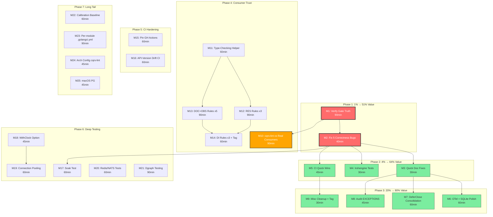
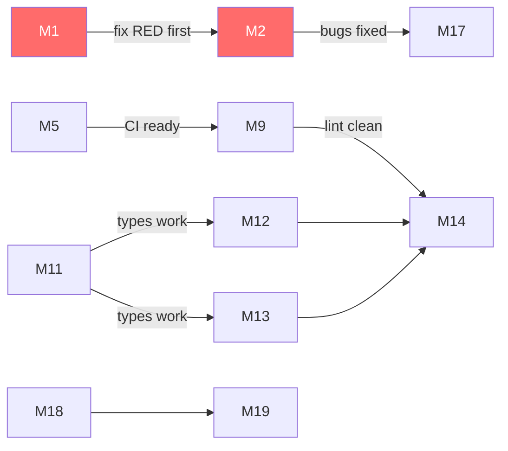

# SUPERB Pareto Execution Plan — 2026-08-08 12:13

> **Input:** 48 open items from `TODO_LIST.md` (46 open + 2 blocked) + verification
> gaps from the docs-health session (2026-08-08 11:59).
> **Method:** Pareto principle — identify the 1% / 4% / 20% that deliver 51% /
> 64% / 80% of the value, then schedule the remaining 80% for the long tail.
> **Constraint:** NO Verschlimmbesserung. Every fix verified against code. Build
> stays GREEN.

---

## Step 1: Pareto Breakdown

### The 1% that delivers 51% of the result

**M1: Establish verification truth** — Run `nix run .#verify`, fix whatever is RED.

This is the single highest-leverage action. The "stale GREEN" anti-pattern has
persisted 4+ sessions. Without knowing the actual build/test/lint/race state,
every other fix is built on sand. This one action tells us what's real vs what's
stale claims. If GREEN: we have a trustworthy baseline. If RED: we know exactly
what to fix before touching anything else.

### The 4% that delivers 64% of the result

**M1 + M2: Fix all correctness bugs** — The 5 known code bugs that affect library
CONSUMERS right now:

| Bug                                            | Impact                | Fix Size                     |
| ---------------------------------------------- | --------------------- | ---------------------------- |
| `DecodeFloatResults` bounds guard              | Latent panic (crash)  | 3 lines                      |
| `context.Background()` in taskmanager handlers | Tracing/timeouts lost | 10 one-line fixes            |
| DuckDB `plans` map lock bypass                 | Data race (6 sites)   | Route through `lookupPlan()` |
| `mustSQLiteEngine` zombie test                 | False test confidence | Delete                       |
| `_skipped_sqlite_test_*` zombie functions      | Dead code             | Delete                       |

All 5 are S effort. Together: ~40min. These are the ONLY items in the TODO_LIST
that affect users of the library — everything else is developer experience, CI,
future features, or internal cleanup.

### The 20% that delivers 80% of the result

**M1–M9:** Above, plus all remaining S-effort quick wins:

- Stale README fix (pebbleengine GraphBackend claim)
- Dead diagram artifacts cleanup (FOUR-TIER-MODEL.d2/.svg)
- Irohengine test gaps (MapDelete LWW, graceful shutdown)
- CI quick wins (--fail-on-stale-suppressions, duckdb-vm/turso-vm CI)
- OTel span attributes from Record
- DeferClose helper dedup
- Event metadata test doc comment
- cqrs-lint v4.6.0 tag
- Self-lint CI severity gate
- bbolt backup/restore test
- check-layers + check-duplication gates

**Total: ~10 tasks, ~4-5 hours. After this, the library has zero known bugs,
zero dead code, zero stale docs, and all CI gates are wired.**

### The remaining 80% (last 20% of value)

**M10–M25:** The M and L effort items — features, infrastructure, and deep
testing:

- cqrs-lint 10 genuinely-missing rules (3 × M tasks)
- cqrs-lint type-checking test helper
- Pin GitHub Actions to SHAs
- CI check for API-version drift
- Dgraph real-instance testing
- Soak test record pipeline
- LayoutPlanApplier for SQLite
- Irohengine WithClock + connection pooling
- Redis/NATS integration tests
- macOS ephemeral PG verification
- Per-module .golangci.yml split
- Calibration benchmark baseline
- Run cqrs-lint against real consumer projects
- Audit remaining EXCEPTIONS entries
- Intra-module arch config for cmd/cqrs-lint

---

## Step 2: Comprehensive Plan (Medium Granularity — 30-100min tasks)

| ID      | Task                                                                                                                             | Items | Effort | Impact   | Customer Value | Dependencies |
| ------- | -------------------------------------------------------------------------------------------------------------------------------- | ----- | ------ | -------- | -------------- | ------------ |
| **M1**  | 🔥 **Establish verification truth**: run `nix run .#verify`, fix RED                                                             | 4     | 90min  | CRITICAL | HIGH           | None         |
| **M2**  | 🔥 **Fix all 5 correctness bugs**: DecodeFloatResults guard, context.Background, DuckDB lock, zombie tests                       | 5     | 40min  | HIGH     | HIGH           | M1           |
| **M3**  | **Quick doc fixes**: pebbleengine README, FOUR-TIER-MODEL artifacts, event_metadata_test doc                                     | 3     | 30min  | LOW      | LOW            | M1           |
| **M4**  | **Irohengine test gaps**: MapDelete LWW test, graceful shutdown test                                                             | 2     | 30min  | LOW      | NONE           | M1           |
| **M5**  | **CI quick wins**: --fail-on-stale-suppressions, duckdb-vm/turso-vm CI, self-lint severity                                       | 3     | 45min  | MEDIUM   | LOW            | M1           |
| **M6**  | **OTel + metaengine polish**: span attributes from Record, LayoutPlanApplier for SQLite                                          | 2     | 60min  | LOW      | LOW            | M1           |
| **M7**  | **DeferClose consolidation**: dedup helper, extend to pebble production code                                                     | 3     | 60min  | LOW      | NONE           | M1           |
| **M8**  | **Audit EXCEPTIONS entries** in check-module-layers.sh                                                                           | 1     | 45min  | LOW      | NONE           | M1           |
| **M9**  | **Misc cleanup**: bbolt backup/restore test, event_metadata_test, cqrs-lint v4.6.0 tag                                           | 3     | 30min  | LOW      | LOW            | M5           |
| **M10** | 🔥 **Run cqrs-lint against real consumers**: clone 3-8 repos, lint, report false positives                                       | 1     | 90min  | HIGH     | HIGH           | M1           |
| **M11** | **cqrs-lint type-checking test helper**: BuildContextWithTypes infrastructure                                                    | 1     | 60min  | MEDIUM   | MEDIUM         | M1           |
| **M12** | **cqrs-lint rules batch 1** (RES category): retry middleware, circuit breaker, DLQ config                                        | 3     | 90min  | MEDIUM   | MEDIUM         | M11          |
| **M13** | **cqrs-lint rules batch 2** (DOC+OBS category): stale catalog, AsyncAPI freshness, OTel SDK init, slog.SetDefault, span creation | 5     | 90min  | MEDIUM   | MEDIUM         | M11          |
| **M14** | **cqrs-lint rules batch 3** (DI category): optimistic concurrency, append-stream version + tag v4.6.0                            | 3     | 60min  | MEDIUM   | MEDIUM         | M12, M13     |
| **M15** | **Pin GitHub Actions to commit SHAs**                                                                                            | 1     | 60min  | MEDIUM   | MEDIUM         | None         |
| **M16** | **CI API-version drift check**                                                                                                   | 1     | 60min  | MEDIUM   | MEDIUM         | None         |
| **M17** | **Soak test for record-aware pipeline** (100K events)                                                                            | 1     | 60min  | MEDIUM   | MEDIUM         | M2           |
| **M18** | **Irohengine WithClock option**                                                                                                  | 1     | 45min  | MEDIUM   | LOW            | None         |
| **M19** | **Irohengine connection pooling**                                                                                                | 1     | 60min  | MEDIUM   | MEDIUM         | M18          |
| **M20** | **Redis/NATS integration tests**                                                                                                 | 1     | 60min  | MEDIUM   | MEDIUM         | None         |
| **M21** | **Dgraph real-instance testing** (Docker + testcontainer)                                                                        | 1     | 90min  | MEDIUM   | MEDIUM         | None         |
| **M22** | **Calibration benchmark regression baseline**                                                                                    | 1     | 60min  | LOW      | LOW            | None         |
| **M23** | **Per-module .golangci.yml split**                                                                                               | 1     | 90min  | LOW      | LOW            | None         |
| **M24** | **Intra-module arch config for cmd/cqrs-lint**                                                                                   | 1     | 45min  | LOW      | NONE           | None         |
| **M25** | **macOS verification of ephemeral PG**                                                                                           | 1     | 45min  | LOW      | LOW            | None         |

**Blocked (not scheduled):**

- [BLOCKED] Publish go-finding + go-must as tagged modules — needs user action

**Declined (not scheduled):**

- Rewrite check-module-layers.sh as Go — L effort, LOW impact, defer

**Total: 25 tasks, ~20.5 hours**

---

## Step 3: Detailed Breakdown (Fine Granularity — max 12min each)

### Phase 1: Verification Truth (M1 — 90min → 8 micro-tasks)

| #    | Micro-Task                                                       | Time  |
| ---- | ---------------------------------------------------------------- | ----- |
| F1.1 | Run `nix run .#verify` and capture output                        | 5min  |
| F1.2 | If build RED: fix compile errors (check daemon commits)          | 10min |
| F1.3 | If vet RED: fix vet errors                                       | 5min  |
| F1.4 | If test RED: read failures, fix or skip with justification       | 12min |
| F1.5 | If race RED: fix data races                                      | 12min |
| F1.6 | If lint RED: fix lint findings (don't suppress — fix root cause) | 12min |
| F1.7 | Run `nix run .#check-layers` — fix budget violations             | 10min |
| F1.8 | Run `nix run .#check-duplication` — update baseline if clean     | 5min  |

### Phase 2: Correctness Bugs (M2 — 40min → 7 micro-tasks)

| #    | Micro-Task                                                                            | Time  |
| ---- | ------------------------------------------------------------------------------------- | ----- |
| F2.1 | Add bounds guard to `metaengine/scan.go:53` DecodeFloatResults                        | 5min  |
| F2.2 | Add regression test for DecodeFloatResults mismatched lengths                         | 5min  |
| F2.3 | Fix `example/taskmanager/handlers.go`: replace 10× `context.Background()` with `ctx`  | 10min |
| F2.4 | Route DuckDB `aggregations.go` 6 inline `e.plans[col]` reads through `lookupPlan()`   | 12min |
| F2.5 | Delete `mustSQLiteEngine` zombie from `metaengine/concurrent_gaps_test.go:188`        | 5min  |
| F2.6 | Delete `_skipped_sqlite_test_0` and `_skipped_sqlite_test_1` from `features2_test.go` | 5min  |
| F2.7 | Run `go build -tags "goexperiment.jsonv2" ./...` to verify                            | 3min  |

### Phase 3: Quick Doc Fixes (M3 — 30min → 5 micro-tasks)

| #    | Micro-Task                                                             | Time |
| ---- | ---------------------------------------------------------------------- | ---- |
| F3.1 | Fix `metaengine/pebbleengine/README.md:35` — remove GraphBackend claim | 5min |
| F3.2 | Delete `docs/architecture-understanding/FOUR-TIER-MODEL.d2`            | 2min |
| F3.3 | Delete `docs/architecture-understanding/FOUR-TIER-MODEL.svg`           | 2min |
| F3.4 | Update `event/event_metadata_test.go:82` doc comment                   | 5min |
| F3.5 | Run doc-check on affected modules                                      | 5min |

### Phase 4: Irohengine Tests (M4 — 30min → 4 micro-tasks)

| #    | Micro-Task                                         | Time  |
| ---- | -------------------------------------------------- | ----- |
| F4.1 | Write `TestMapDelete_LWWConvergence` in irohengine | 10min |
| F4.2 | Write `TestGracefulShutdown_InflightOps`           | 10min |
| F4.3 | Run irohengine tests with `-race -count=1`         | 5min  |
| F4.4 | Verify no flake under `-count=3`                   | 5min  |

### Phase 5: CI Quick Wins (M5 — 45min → 6 micro-tasks)

| #    | Micro-Task                                                               | Time |
| ---- | ------------------------------------------------------------------------ | ---- |
| F5.1 | Add `--fail-on-stale-suppressions` flag to cqrs-lint CI job              | 8min |
| F5.2 | Add `duckdb-vm` to nixos-vm-tests CI job in ci.yml                       | 8min |
| F5.3 | Add `turso-vm` to nixos-vm-tests CI job in ci.yml                        | 8min |
| F5.4 | Add `--min-severity warning` to self-lint CI job OR suppress C025 inline | 8min |
| F5.5 | Fix C025 finding at `cmd/cqrs-lint/init.go:69` (add `%w` or suppress)    | 8min |
| F5.6 | Verify CI YAML is valid                                                  | 5min |

### Phase 6: OTel + Metaengine Polish (M6 — 60min → 6 micro-tasks)

| #    | Micro-Task                                                                                  | Time  |
| ---- | ------------------------------------------------------------------------------------------- | ----- |
| F6.1 | Add `rec.StreamID`, `rec.Version`, `rec.Type` to projectionadapter.Handle() span attributes | 10min |
| F6.2 | Add test verifying span attributes are set                                                  | 10min |
| F6.3 | Study DuckDB `ApplyLayoutPlan` vs SQLite `NewPlannedSQLiteEngine` pattern                   | 10min |
| F6.4 | Add `ApplyLayoutPlan` method to sqliteengine                                                | 12min |
| F6.5 | Add test for post-construction layout plan registration on SQLite                           | 10min |
| F6.6 | Run metaengine tests                                                                        | 8min  |

### Phase 7: DeferClose Consolidation (M7 — 60min → 7 micro-tasks)

| #    | Micro-Task                                                           | Time  |
| ---- | -------------------------------------------------------------------- | ----- |
| F7.1 | Decide: consolidate to shared package OR accept per-module idiom     | 5min  |
| F7.2 | If consolidating: create `storage/internal/closeutil/defer_close.go` | 10min |
| F7.3 | If accepting: add doc comment explaining the per-module idiom        | 5min  |
| F7.4 | Extend deferClose to `storage/pebble/adapter.go` (2 sites)           | 8min  |
| F7.5 | Extend deferClose to remaining pebble production files (10 sites)    | 12min |
| F7.6 | Remove duplicate helpers from test files if consolidated             | 8min  |
| F7.7 | Run `go build` + `go test` on affected packages                      | 5min  |

### Phase 8: Audit EXCEPTIONS (M8 — 45min → 5 micro-tasks)

| #    | Micro-Task                                                    | Time  |
| ---- | ------------------------------------------------------------- | ----- |
| F8.1 | Read `scripts/check-module-layers.sh` EXCEPTIONS map          | 5min  |
| F8.2 | Verify each of ~10 entries against actual module dependencies | 12min |
| F8.3 | Remove dead entries                                           | 5min  |
| F8.4 | Run `nix run .#check-layers` to verify                        | 5min  |
| F8.5 | Document any non-obvious entries with comments                | 10min |

### Phase 9: Misc Cleanup (M9 — 30min → 4 micro-tasks)

| #    | Micro-Task                                                   | Time  |
| ---- | ------------------------------------------------------------ | ----- |
| F9.1 | Write `TestBackupLifecycle` for bbolt (parallel to pebble's) | 12min |
| F9.2 | Run bbolt tests                                              | 5min  |
| F9.3 | Tag `cmd/cqrs-lint/v4.6.0` after M5 lands                    | 8min  |
| F9.4 | Run `nix run .#verify-fast` to confirm clean                 | 5min  |

### Phase 10: cqrs-lint Against Real Consumers (M10 — 90min → 8 micro-tasks)

| #     | Micro-Task                                        | Time  |
| ----- | ------------------------------------------------- | ----- |
| F10.1 | Clone first consumer repo (e.g., Standup-Killer)  | 5min  |
| F10.2 | Build cqrs-lint, run against consumer             | 10min |
| F10.3 | Triage findings: real vs false positive           | 12min |
| F10.4 | Clone second repo (e.g., bank-sync), run, triage  | 12min |
| F10.5 | Clone third repo (e.g., DiscordSync), run, triage | 12min |
| F10.6 | Aggregate false-positive rate across all repos    | 10min |
| F10.7 | Document findings in a status report              | 12min |
| F10.8 | Create TODOs for high-value false-positive fixes  | 10min |

### Phase 11: cqrs-lint Type-Checking Helper (M11 — 60min → 6 micro-tasks)

| #     | Micro-Task                                                            | Time  |
| ----- | --------------------------------------------------------------------- | ----- |
| F11.1 | Study `BuildContextFromSource` — understand why TypesInfo is empty    | 10min |
| F11.2 | Design `BuildContextWithTypes` API (uses `go/packages` to load types) | 12min |
| F11.3 | Implement `BuildContextWithTypes` in test helpers                     | 12min |
| F11.4 | Write test verifying C023 type-aware path works with real TypesInfo   | 10min |
| F11.5 | Write test verifying C001 `Begin(false)` generalization with types    | 8min  |
| F11.6 | Run cqrs-lint tests                                                   | 5min  |

### Phase 12-14: cqrs-lint Rules (M12-M14 — 240min → 24 micro-tasks)

| #     | Micro-Task                                                                 | Time  |
| ----- | -------------------------------------------------------------------------- | ----- |
| F12.1 | RES: Missing retry middleware — design detector                            | 10min |
| F12.2 | RES: Implement + test retry middleware absence detector                    | 12min |
| F12.3 | RES: Circuit breaker absence — design + implement + test                   | 12min |
| F12.4 | RES: Missing DLQ config — design + implement + test                        | 12min |
| F13.1 | DOC: Stale catalog entries — design detector (reverse of E004)             | 10min |
| F13.2 | DOC: Implement + test stale catalog detector                               | 10min |
| F13.3 | DOC: AsyncAPI/OpenAPI freshness — design + implement                       | 12min |
| F13.4 | OBS: Missing OTel SDK init — design detector                               | 8min  |
| F13.5 | OBS: Implement + test OTel SDK init detector                               | 10min |
| F13.6 | OBS: Missing slog.SetDefault — design + implement + test                   | 10min |
| F13.7 | OBS: Missing span creation — design + implement + test                     | 10min |
| F14.1 | DI: Optimistic concurrency check — design detector                         | 10min |
| F14.2 | DI: Implement + test optimistic concurrency detector                       | 12min |
| F14.3 | DI: Missing append-stream version precondition — design + implement + test | 12min |
| F14.4 | Update version constant to 4.6.0                                           | 3min  |
| F14.5 | Run cqrs-lint self-lint                                                    | 5min  |
| F14.6 | Tag `cmd/cqrs-lint/v4.6.0`                                                 | 5min  |

### Phase 15-16: CI Hardening (M15-M16 — 120min → 12 micro-tasks)

| #     | Micro-Task                                                       | Time  |
| ----- | ---------------------------------------------------------------- | ----- |
| F15.1 | List all GitHub Actions used in `.github/workflows/*.yml`        | 5min  |
| F15.2 | For each action: find commit SHA for current version tag         | 12min |
| F15.3 | Replace `@vN` with `@<sha>` in all workflow files                | 12min |
| F15.4 | Verify CI YAML is valid after pinning                            | 5min  |
| F15.5 | Document the pinning policy in CONTRIBUTING.md                   | 10min |
| F16.1 | Design API-version drift check: what to check, how to run        | 10min |
| F16.2 | Implement script or Go program that compares tag vs HEAD exports | 12min |
| F16.3 | Add as CI step in ci.yml                                         | 8min  |
| F16.4 | Test with a known-drifted module                                 | 10min |
| F16.5 | Document in CONTRIBUTING.md                                      | 5min  |

### Phase 17: Soak Test (M17 — 60min → 6 micro-tasks)

| #     | Micro-Task                                                            | Time  |
| ----- | --------------------------------------------------------------------- | ----- |
| F17.1 | Design soak test: 100K events through AsRecord → Handle → ApplyRecord | 10min |
| F17.2 | Implement soak test in metaengine                                     | 12min |
| F17.3 | Add heap growth assertions (O(keys) bound)                            | 10min |
| F17.4 | Run with `-race -count=1`                                             | 10min |
| F17.5 | Record results (TotalAlloc delta, heap growth)                        | 8min  |
| F17.6 | Add SOAK_SKIP pattern for CI                                          | 5min  |

### Phase 18-19: Irohengine Improvements (M18-M19 — 105min → 10 micro-tasks)

| #     | Micro-Task                                                            | Time  |
| ----- | --------------------------------------------------------------------- | ----- |
| F18.1 | Add `Clock` interface + `WithClock` option to irohengine options.go   | 10min |
| F18.2 | Replace `time.Now()` in `replicatedEngine.MapSet` with injected clock | 8min  |
| F18.3 | Update convergence tests to use deterministic clock                   | 10min |
| F18.4 | Run irohengine tests with `-race -count=3`                            | 5min  |
| F19.1 | Study current Publish: BiStream lifecycle in QuicTransport            | 10min |
| F19.2 | Design stream pool: reuse BiStreams across Publish calls              | 12min |
| F19.3 | Implement stream pool with mutex-protected map                        | 12min |
| F19.4 | Add benchmark: before vs after connection pooling                     | 10min |
| F19.5 | Run QUIC tests                                                        | 5min  |
| F19.6 | Document in irohengine README                                         | 8min  |

### Phase 20-25: Long Tail (M20-M25 — 420min → 42 micro-tasks)

| #           | Micro-Task                                                                                                                         | Time  |
| ----------- | ---------------------------------------------------------------------------------------------------------------------------------- | ----- |
| F20.1-F20.6 | Redis/NATS integration tests (6 micro-tasks: design, write Redis, test, write NATS, test, document)                                | 60min |
| F21.1-F21.8 | Dgraph real-instance testing (8 micro-tasks: Docker setup, testcontainer, run tests, fix DQL injection, verify backends, document) | 90min |
| F22.1-F22.6 | Calibration benchmark regression baseline (6 micro-tasks)                                                                          | 60min |
| F23.1-F23.8 | Per-module .golangci.yml split (8 micro-tasks: plan, migrate 3 modules, test, document)                                            | 90min |
| F24.1-F24.5 | Intra-module arch config for cqrs-lint (5 micro-tasks)                                                                             | 45min |
| F25.1-F25.5 | macOS ephemeral PG (5 micro-tasks: test on Darwin, fix issues, document)                                                           | 45min |

---

## Execution Order

---

## Dependency Chain (Critical Path)

**Critical path:** M1 → M2 → M17 (2.5 hours). Everything else can be parallelized.

---

## Parallel Execution Strategy

When running with multiple agents/tasks:

| Parallel Group      | Tasks               | Total Time |
| ------------------- | ------------------- | ---------- |
| Group A (critical)  | M1 → M2 → M17       | 2.5h       |
| Group B (docs)      | M3, M4              | 1h         |
| Group C (CI)        | M5, M9              | 1.25h      |
| Group D (cleanup)   | M6, M7, M8          | 2.75h      |
| Group E (lint)      | M11 → M12/M13 → M14 | 5h         |
| Group F (infra)     | M15, M16            | 2h         |
| Group G (iroh)      | M18 → M19           | 1.75h      |
| Group H (testing)   | M20, M21            | 2.5h       |
| Group I (long tail) | M22, M23, M24, M25  | 4h         |

**Wall-clock with 3 parallel agents:** ~7-8 hours (critical path + 1 parallel group per agent).
**Wall-clock sequential:** ~20.5 hours.

---

## Safety Rules

1. **NEVER fix code without running `go build` after** — the #1 lesson in AGENTS.md
2. **NEVER suppress lint findings blindly** — fix root cause or document why suppression is correct
3. **NEVER edit files without reading first** — always View before Edit
4. **Run `go build -tags "goexperiment.jsonv2" ./...` after every code change**
5. **Run affected module tests after every code change**
6. **If `nix run .#verify` is RED, fix it BEFORE anything else** — Verschlimmbesserung prevention
7. **Each micro-task commits independently** — auto-commit daemon handles this
8. **If a fix uncovers a deeper issue, document in TODO_LIST and move on** — don't rabbit-hole

---

## Total Summary

| Metric                   | Count                      |
| ------------------------ | -------------------------- |
| Total TODO items         | 48 (46 open + 2 blocked)   |
| Medium tasks (30-100min) | 25                         |
| Fine tasks (≤12min)      | ~130                       |
| Total estimated effort   | 20.5 hours                 |
| 1% tier (→51% value)     | 1 task (M1, 90min)         |
| 4% tier (→64% value)     | 2 tasks (M1+M2, 130min)    |
| 20% tier (→80% value)    | 9 tasks (M1-M9, ~8h)       |
| 80% tier (→100% value)   | 16 tasks (M10-M25, ~12.5h) |
