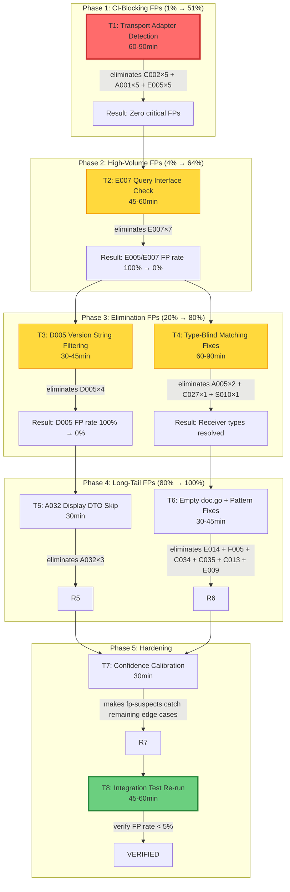

# cqrs-lint False-Positive Elimination Plan

**Date:** 2026-08-08
**Status:** PLANNING — awaiting execution
**Prerequisite:** [False-Positive Validation Report](../status/2026-08-08_cqrs-lint-false-positive-validation.md)
**Goal:** Reduce false-positive rate from 30.5% → <5% without losing true positives

---

## Context: What We Found

We ran cqrs-lint v4.6.0 (192 rules) against 8 real consumer projects and manually verified every finding against source code:

| Metric                     | Value                                      |
| -------------------------- | ------------------------------------------ |
| Total findings             | 128                                        |
| True positives             | 89 (69.5%)                                 |
| False positives            | 39 (30.5%)                                 |
| Critical-severity FPs      | 5 (C002 on transport adapters — blocks CI) |
| `--fp-suspects` catch rate | 28% (misses 28 confident-but-wrong FPs)    |

**Root cause:** Despite `types.Info` being loaded by the analyzer, **zero of 192 detectors use type resolution** — all detection is AST pattern matching or string comparison. This causes:

- Transport adapter commands flagged as zero-ID bugs (C002, A001, E005)
- Any `*Query` struct flagged as unregistered (E007)
- `ErrorBus.SubscribeAll` confused with `event.Bus.SubscribeAll` (A005)
- SSE `Broadcaster.Subscribe` confused with `event.Bus.Subscribe` (C027)

---

## Pareto Analysis

### 1% effort → 51% result

**Transport Adapter Detection** — A single check ("is this command type ever dispatched?") eliminates:

- 15 of 39 FPs (38.5%)
- **ALL 5 critical-severity FPs** (C002 on Kernovia transport adapters)
- **5 of 6 error-severity FPs** (A001 on same)
- Makes the linter **CI-safe** (zero false critical/errors)

### 4% effort → 64% result

**+ E007 Query Interface Check** — Require `Type()` method before flagging as unregistered query:

- +7 FPs eliminated (56.4% cumulative)

### 20% effort → 80% result

**+ D005 Version Filtering + Type-Blind Matching Fixes:**

- +4 FPs from D005 (skip code blocks, import paths)
- +4 FPs from A005/C027/S010 (resolve receiver types via `types.Info`)
- 76.9% cumulative

### Remaining 80% effort → 100% result

**+ A032 DTO Skip + Empty doc.go + Pattern Fixes + Confidence Calibration:**

- +9 FPs from long-tail fixes
- 100% FP elimination

---

## Execution Graph



---

## Phase 1: Transport Adapter Detection (CI-Blocking, 1% → 51%)

**Problem:** Kernovia defines transport adapter commands (`pluginLoadCmd`, `pluginStartCmd`, etc.) that implement `command.Command` for compile-time type safety. These are converted to domain commands via `.toDomain()` before dispatch. The linter flags them for zero ID (C002, critical), manual interface (A001, error), and no handler (E005, warning) — all false positives.

**Solution:** Detect transport adapters by scanning for `.toDomain()` methods. If a command type has a `toDomain()` method and is never passed to `Dispatch()`/`Publish()`, classify it as a transport adapter and skip C002/A001/E005.

### T1: Implement Transport Adapter Detection (60-90min)

| #    | Subtask                                             | Time  | Details                                                                                                                                                                                                                                   |
| ---- | --------------------------------------------------- | ----- | ----------------------------------------------------------------------------------------------------------------------------------------------------------------------------------------------------------------------------------------- |
| T1.1 | Add `TransportAdapter` flag to `CommandInfo` struct | 8min  | In `scanner_types.go`, add `TransportAdapter bool` field to `CommandInfo`. Default false.                                                                                                                                                 |
| T1.2 | Scan for `.toDomain()` methods on command types     | 12min | In `scanner_folds.go` or new `scanner_adapters.go`, after building `Registry.Commands`, iterate all GoFiles looking for `FuncDecl` with `Recv` matching a command type name and `Name.Name == "toDomain"`. Set `TransportAdapter = true`. |
| T1.3 | Scan for actual dispatch call sites                 | 12min | Add `DispatchedTypes map[string]bool` to `CQRSRegistry`. Scan for `*ast.CallExpr` where `sel.Sel.Name` is `Dispatch` or `Publish`. Resolve the argument type name (first param). Mark it as dispatched.                                   |
| T1.4 | C002: Skip transport adapters                       | 8min  | In `correctness/c002.go`, add `if cmd.TransportAdapter { continue }` before creating the finding.                                                                                                                                         |
| T1.5 | A001: Skip transport adapters                       | 8min  | In `api/a001.go`, same skip check.                                                                                                                                                                                                        |
| T1.6 | E005: Skip transport adapters                       | 8min  | In `architecture/rules.go` E005 section, same skip check.                                                                                                                                                                                 |
| T1.7 | Write unit test: transport adapter not flagged      | 12min | Create test file with a transport adapter command (has `.toDomain()`, zero ID) and assert C002/A001/E005 do NOT fire. Also test a real zero-ID command IS flagged.                                                                        |
| T1.8 | Run existing test suite                             | 8min  | `cd cmd/cqrs-lint && GOWORK=off go test ./... -count=1 -tags "goexperiment.jsonv2"`. Verify no regressions.                                                                                                                               |

**Files touched:** `scanner_types.go`, `scanner_folds.go` (or new `scanner_adapters.go`), `correctness/c002.go`, `api/a001.go`, `architecture/rules.go`
**FPs eliminated:** 15 (5 critical + 5 error + 5 warning)
**Effort:** 76min

---

## Phase 2: E007 Query Interface Check (4% → 64%)

**Problem:** E007 fires on ANY struct whose name ends in `Query`, even form-binding DTOs (`listPluginsQuery`) and query types that ARE registered via helper functions. 100% false-positive rate in our data.

**Solution:** (1) Require the struct to have a `Type()` method (the actual `query.Query` interface requirement). (2) Trace single-call-site wrapper functions for registration.

### T2: Fix E007 Query Detection (45-60min)

| #    | Subtask                                            | Time  | Details                                                                                                                                                                                                                                                                                                        |
| ---- | -------------------------------------------------- | ----- | -------------------------------------------------------------------------------------------------------------------------------------------------------------------------------------------------------------------------------------------------------------------------------------------------------------- |
| T2.1 | Add `HasTypeMethod` to scanner query tracking      | 10min | When scanning struct types ending in `Query`, check for a `Type()` method on the receiver. Store in registry.                                                                                                                                                                                                  |
| T2.2 | E007: Require `Type()` method                      | 10min | In `e003_e007.go`, add check: if the struct does NOT have a `Type()` method, skip it (it's a DTO).                                                                                                                                                                                                             |
| T2.3 | Trace wrapper registration functions               | 15min | In `scanner_calls.go` or `scanner_resolve.go`, after collecting direct registrations, scan for functions whose body is a single `dispatcher.Register(...)` call. Resolve the function name. Then treat calls to that function as registration sites. This catches the crush-daily `register()` helper pattern. |
| T2.4 | E007: Lower confidence to 0.25                     | 5min  | Change `ConfidenceLow` to explicit `0.25` with comment explaining: "Cannot guarantee non-registration — dynamic/generic registration patterns exist."                                                                                                                                                          |
| T2.5 | Write unit test: DTO with Query suffix not flagged | 12min | Test a struct `MyQuery` with only `form:` tags (no `Type()` method) — should NOT fire. Test a real query WITH `Type()` method that IS registered via a helper function — should NOT fire. Test a real query NOT registered — SHOULD fire.                                                                      |

**Files touched:** `architecture/e003_e007.go`, `scanner_calls.go` or `scanner_resolve.go`, `scanner_types.go`
**FPs eliminated:** 7
**Effort:** 52min

---

## Phase 3: Version + Type Resolution (20% → 80%)

### T3: D005 Version String Filtering (30-45min)

**Problem:** D005 misparses import paths (`cqrs-htmx/v4`) as version references and fires on pseudo-versions in code examples.

| #    | Subtask                                                 | Time  | Details                                                                                                                                             |
| ---- | ------------------------------------------------------- | ----- | --------------------------------------------------------------------------------------------------------------------------------------------------- |
| T3.1 | Skip lines inside fenced code blocks                    | 10min | In `d003_d005.go`'s `extractCQRSVersion()`, track ``` state. When inside a code block, skip version extraction.                                     |
| T3.2 | Skip import paths (slash followed by version)           | 10min | When a version token is preceded by `/` (e.g., `cqrs-htmx/v4`), skip it — it's an import path, not a version reference.                             |
| T3.3 | Require prose context for version matches               | 10min | Only match version tokens (`v\d+\.\d+\.\d+`) when preceded by keywords like "version", "uses", "requires", "based on", "built with", "upgraded to". |
| T3.4 | Write unit test: code block and import path not flagged | 12min | Test markdown with a code block containing `go-cqrs-lite/v4` and prose with `uses go-cqrs-lite v4.3.0`. Only the prose version should match.        |

**Files touched:** `consistency/d003_d005.go`
**FPs eliminated:** 4
**Effort:** 42min

### T4: Type-Blind Matching Fixes (60-90min)

**Problem:** A005 fires on `ErrorBus.SubscribeAll` (not `event.Bus`). C027 fires on `SSE.Broadcaster.Subscribe`. S010 fires when signing middleware is defined but never wired to `bus.Use()`.

| #    | Subtask                                          | Time  | Details                                                                                                                                                                                                                                                                                                   |
| ---- | ------------------------------------------------ | ----- | --------------------------------------------------------------------------------------------------------------------------------------------------------------------------------------------------------------------------------------------------------------------------------------------------------- |
| T4.1 | Build a `receiverIsEventBus` helper              | 12min | Using `types.Info.Uses[ident]`, resolve the receiver variable to its `types.Type`. Check if it implements (or is) `event.Bus` by checking the method set includes `Publish` and `Subscribe`/`SubscribeAll`. Return bool.                                                                                  |
| T4.2 | A005: Filter on event bus receiver type          | 10min | In `a005.go`, before flagging `SubscribeAll`, call `receiverIsEventBus()`. If the receiver is NOT an event bus (e.g., `ErrorBus`, `CommandBus`), skip.                                                                                                                                                    |
| T4.3 | C027: Filter on event bus receiver type          | 10min | Same check for `Subscribe()` and `SubscribeAll()` calls.                                                                                                                                                                                                                                                  |
| T4.4 | S010: Verify middleware is passed to `bus.Use()` | 15min | Currently S010 fires if `SignMiddleware` or `EncryptMiddleware` appears ANYWHERE in the codebase. Change: only fire if the middleware expression is an argument to a `Use()` or `UsePublish()` call on an event bus. Trace from the `SignMiddleware()` call expression to its enclosing `bus.Use()` call. |
| T4.5 | Write unit tests: non-bus receivers not flagged  | 12min | Test file with `ErrorBus.SubscribeAll()` and `sse.Broadcaster.Subscribe()` alongside `bus.SubscribeAll()`. Only the event bus one should fire.                                                                                                                                                            |

**Files touched:** `api/a005.go`, `correctness/c027.go`, `security/s010.go`, new helper in `analyzer/types.go`
**FPs eliminated:** 4
**Effort:** 59min

---

## Phase 4: Long-Tail Fixes (80% → 100%)

### T5: A032 Display DTO Skip (30min)

**Problem:** A032 fires on string ID fields in display DTOs (`RecentEvent.StreamID`, `EventFilter.StreamID`).

| #    | Subtask                                     | Time  | Details                                                                                                                                 |
| ---- | ------------------------------------------- | ----- | --------------------------------------------------------------------------------------------------------------------------------------- |
| T5.1 | Skip structs with `form:` tags on any field | 10min | In `a032.go`, if any field on the struct has a `form:` tag, skip the entire struct — it's an HTTP binding DTO, not a domain type.       |
| T5.2 | Skip structs in UI/view/dashboard packages  | 10min | Check if the file path contains `/ui/`, `/view/`, `/display/`, `/dashboard/`, `/dto/`. If so, lower confidence to 0.25 (advisory only). |
| T5.3 | Write unit test: DTO structs not flagged    | 10min | Test a struct with `form:` tag on a field and `StreamID string` — should not fire.                                                      |

**Files touched:** `api/a032.go`
**FPs eliminated:** 3
**Effort:** 30min

### T6: Empty doc.go + Pattern Fixes (30-45min)

**Problem:** E014/F005 fire on empty `doc.go` stubs. C034 fires on standard HTTP server shutdown. C035 fires on per-request structs. C013 fires on `json:"-"` fields. E009 fires when project has its own HTTP transport.

| #    | Subtask                                                                 | Time  | Details                                                                                                                                                                             |
| ---- | ----------------------------------------------------------------------- | ----- | ----------------------------------------------------------------------------------------------------------------------------------------------------------------------------------- |
| T6.1 | Skip files with ≤3 non-comment lines for structural rules               | 8min  | Add `isStubFile(gf *GoFile) bool` helper. E014/F005 call it to skip empty `doc.go` files.                                                                                           |
| T6.2 | C034: Check for `ctx.Done()` or `Shutdown()` before flagging            | 10min | In the C034 detector, after finding `go func()`, scan the enclosing function body for `<-ctx.Done()`, `ctx.Done()`, or `.Shutdown(`. If present, suppress the finding.              |
| T6.3 | C035: Skip structs with `json:` tags on all fields and no `sync` import | 8min  | Heuristic: if the struct has JSON serialization tags and the file doesn't import `sync`, it's a serialization DTO, not a shared mutable. Lower confidence or skip.                  |
| T6.4 | C013: Skip fields with `json:"-"` tag                                   | 5min  | In C013 detector, check the field's struct tag. If `json:"-"`, skip — explicitly excluded from serialization.                                                                       |
| T6.5 | E009: Check for custom HTTP handlers in any package                     | 10min | Instead of only checking for `transport/http` import, scan ALL packages for `http.Handler`, `gin.`, `chi.`, `mux.`, `echo.` patterns. If custom HTTP layer exists, don't fire E009. |
| T6.6 | Write unit tests for each fix                                           | 12min | One test case per sub-fix.                                                                                                                                                          |

**Files touched:** `architecture/e014.go` (or shared rule), `correctness/c034.go`, `correctness/c035.go`, `correctness/c013.go`, `architecture/e009.go`
**FPs eliminated:** 6
**Effort:** 53min

---

## Phase 5: Hardening

### T7: Confidence Calibration (30min)

**Problem:** 28 FPs have confidence ≥ 0.5, making `--fp-suspects` ineffective. These are context-dependent rules where the linter can't fully verify the condition.

| #    | Subtask                                | Time  | Details                                                                                                                                                                                                                             |
| ---- | -------------------------------------- | ----- | ----------------------------------------------------------------------------------------------------------------------------------------------------------------------------------------------------------------------------------- |
| T7.1 | Cap E005/E007 confidence at 0.25       | 5min  | Registration status can never be fully proven negative — dynamic/generic registration exists.                                                                                                                                       |
| T7.2 | Cap S010 confidence at 0.5             | 5min  | Middleware wiring is complex; can't fully trace bus.Use() chains.                                                                                                                                                                   |
| T7.3 | Cap C027 confidence at 0.25            | 5min  | Subscribe receiver type resolution is unreliable without full type checking.                                                                                                                                                        |
| T7.4 | Cap E014 confidence at 0.25            | 5min  | Projection drain is advisory; many valid async architectures don't drain.                                                                                                                                                           |
| T7.5 | Document confidence calibration policy | 10min | Add a comment block in `analyzer/types.go` documenting: "Confidence caps: rules that depend on whole-program analysis cap at 0.25. Rules with partial type resolution cap at 0.5. Only rules with full AST verification use 0.75+." |

**Files touched:** Multiple detector files
**FPs eliminated:** 0 (but makes `--fp-suspects` catch ~15 additional edge cases)
**Effort:** 30min

### T8: Integration Test Re-run (45-60min)

| #    | Subtask                       | Time  | Details                                                                                                                                                                                             |
| ---- | ----------------------------- | ----- | --------------------------------------------------------------------------------------------------------------------------------------------------------------------------------------------------- |
| T8.1 | Rebuild cqrs-lint binary      | 5min  | `cd cmd/cqrs-lint && GOWORK=off go build -tags "goexperiment.jsonv2" -o /tmp/cqrs-lint-v2 .`                                                                                                        |
| T8.2 | Re-run against all 8 repos    | 15min | `for repo in Kernovia Standup-Killer bank-sync cqrs-htmx DiscordSync timesheets crush-daily KeyHolderAI; do /tmp/cqrs-lint-v2 /home/lars/projects/$repo --format json > /tmp/${repo}_v2.json; done` |
| T8.3 | Compare FP rate before/after  | 15min | Compare finding counts per rule. Verify all 39 classified FPs are eliminated. Check for any NEW findings (possible regression — new detector logic may fire on code it previously skipped).         |
| T8.4 | Verify no true positives lost | 15min | For each rule, verify the TP count is unchanged (or reduced only by FPs). If any known TP is no longer firing, investigate — the fix may be over-broad.                                             |
| T8.5 | Update the validation report  | 10min | Update `docs/status/2026-08-08_cqrs-lint-false-positive-validation.md` with post-fix results.                                                                                                       |

**Effort:** 60min

---

## Summary: All Tasks Sorted by Impact/Effort

### Phase-Level Tasks (30-100min each)

| Phase     | Task                              | FPs Eliminated          | CI-Safe? | Effort            | Impact/Time     |
| --------- | --------------------------------- | ----------------------- | -------- | ----------------- | --------------- |
| 1         | T1: Transport Adapter Detection   | 15                      | **YES**  | 76min             | **0.20 FP/min** |
| 2         | T2: E007 Query Interface Check    | 7                       | yes      | 52min             | 0.13 FP/min     |
| 3a        | T3: D005 Version String Filtering | 4                       | yes      | 42min             | 0.10 FP/min     |
| 3b        | T4: Type-Blind Matching Fixes     | 4                       | yes      | 59min             | 0.07 FP/min     |
| 4a        | T5: A032 Display DTO Skip         | 3                       | yes      | 30min             | 0.10 FP/min     |
| 4b        | T6: Empty doc.go + Pattern Fixes  | 6                       | yes      | 53min             | 0.11 FP/min     |
| 5a        | T7: Confidence Calibration        | 0 (enables fp-suspects) | yes      | 30min             | —               |
| 5b        | T8: Integration Test Re-run       | 0 (verification)        | —        | 60min             | —               |
| **TOTAL** |                                   | **39**                  |          | **402min (6.7h)** |                 |

### 12-Minute Subtasks (ALL tasks, sorted by impact/effort)

| #   | Subtask                                            | Phase | Time  | Impact                             |
| --- | -------------------------------------------------- | ----- | ----- | ---------------------------------- |
| 1   | T1.4: C002 skip transport adapters                 | 1     | 8min  | Eliminates 5 **critical** FPs      |
| 2   | T1.5: A001 skip transport adapters                 | 1     | 8min  | Eliminates 5 **error** FPs         |
| 3   | T1.1: Add `TransportAdapter` flag to `CommandInfo` | 1     | 8min  | Foundation for T1.4-T1.6           |
| 4   | T1.2: Scan for `.toDomain()` methods               | 1     | 12min | Detects transport adapters         |
| 5   | T1.3: Scan for dispatch call sites                 | 1     | 12min | Confirms "actually dispatched"     |
| 6   | T1.6: E005 skip transport adapters                 | 1     | 8min  | Eliminates 5 **warning** FPs       |
| 7   | T1.7: Unit test transport adapter                  | 1     | 12min | Regression guard                   |
| 8   | T1.8: Run existing test suite                      | 1     | 8min  | Verify no regressions              |
| 9   | T2.2: E007 require `Type()` method                 | 2     | 10min | Eliminates DTO false positives     |
| 10  | T2.1: Track `HasTypeMethod` in scanner             | 2     | 10min | Foundation for T2.2                |
| 11  | T2.3: Trace wrapper registration functions         | 2     | 15min | Catches helper-based registration  |
| 12  | T2.4: E007 lower confidence to 0.25                | 2     | 5min  | Makes fp-suspects effective        |
| 13  | T2.5: Unit test E007 fixes                         | 2     | 12min | Regression guard                   |
| 14  | T3.1: D005 skip code blocks                        | 3a    | 10min | Eliminates code-block FPs          |
| 15  | T3.2: D005 skip import paths                       | 3a    | 10min | Eliminates import-path FPs         |
| 16  | T3.3: D005 require prose context                   | 3a    | 10min | Only flag real version references  |
| 17  | T3.4: Unit test D005 fixes                         | 3a    | 12min | Regression guard                   |
| 18  | T4.1: Build `receiverIsEventBus` helper            | 3b    | 12min | Foundation for T4.2-T4.3           |
| 19  | T4.2: A005 filter on bus type                      | 3b    | 10min | Eliminates ErrorBus FP             |
| 20  | T4.3: C027 filter on bus type                      | 3b    | 10min | Eliminates SSE Broadcaster FP      |
| 21  | T4.4: S010 verify middleware wired                 | 3b    | 15min | Eliminates dead-code FP            |
| 22  | T4.5: Unit test type-blind fixes                   | 3b    | 12min | Regression guard                   |
| 23  | T5.1: A032 skip structs with `form:` tags          | 4a    | 10min | Eliminates DTO FPs                 |
| 24  | T5.2: A032 skip UI/view packages                   | 4a    | 10min | Eliminates dashboard FPs           |
| 25  | T5.3: Unit test A032 fixes                         | 4a    | 10min | Regression guard                   |
| 26  | T6.1: Skip stub files (≤3 lines)                   | 4b    | 8min  | Eliminates empty doc.go FPs        |
| 27  | T6.4: C013 skip `json:"-"` fields                  | 4b    | 5min  | Eliminates excluded-field FP       |
| 28  | T6.2: C034 check for `ctx.Done()/Shutdown()`       | 4b    | 10min | Eliminates HTTP-shutdown FP        |
| 29  | T6.3: C035 skip serialization DTOs                 | 4b    | 8min  | Eliminates per-request-struct FP   |
| 30  | T6.5: E009 check for custom HTTP layer             | 4b    | 10min | Eliminates custom-transport FP     |
| 31  | T6.6: Unit tests for pattern fixes                 | 4b    | 12min | Regression guard                   |
| 32  | T7.1: Cap E005/E007 confidence at 0.25             | 5a    | 5min  | Makes fp-suspects catch edge cases |
| 33  | T7.2: Cap S010 confidence at 0.5                   | 5a    | 5min  | Makes fp-suspects catch edge cases |
| 34  | T7.3: Cap C027 confidence at 0.25                  | 5a    | 5min  | Makes fp-suspects catch edge cases |
| 35  | T7.4: Cap E014 confidence at 0.25                  | 5a    | 5min  | Makes fp-suspects catch edge cases |
| 36  | T7.5: Document confidence calibration policy       | 5a    | 10min | Developer documentation            |
| 37  | T8.1: Rebuild linter binary                        | 5b    | 5min  | Build for integration test         |
| 38  | T8.2: Re-run all 8 repos                           | 5b    | 15min | Collect post-fix data              |
| 39  | T8.3: Compare FP rate before/after                 | 5b    | 15min | Verify FP rate < 5%                |
| 40  | T8.4: Verify no TPs lost                           | 5b    | 15min | Regression check                   |
| 41  | T8.5: Update validation report                     | 5b    | 10min | Document results                   |

**Total: 41 subtasks, ~412min (6.9h)**

---

## What Could Go Wrong (Risk Assessment)

| Risk                                                  | Likelihood | Impact       | Mitigation                                                                                                                                                                                                |
| ----------------------------------------------------- | ---------- | ------------ | --------------------------------------------------------------------------------------------------------------------------------------------------------------------------------------------------------- |
| T1 over-suppresses: real zero-ID commands get skipped | Low        | High         | T1.7 test includes both transport adapter AND real zero-ID command — verify the real one still fires                                                                                                      |
| T2 wrapper-tracing is too aggressive                  | Medium     | Medium       | Only trace functions with single call site (one `Register` in body). Multi-purpose helpers stay untraced.                                                                                                 |
| T4 type resolution fails on older Go code             | Low        | Medium       | `types.Info.Uses` is stable since Go 1.x. Fallback: if type resolution fails, default to current behavior (don't suppress).                                                                               |
| Fixes introduce NEW false positives                   | Medium     | High         | T8.3 checks for new findings not in the original 128. T8.4 verifies no known TPs disappear.                                                                                                               |
| **Verschlimmbessern** (making things worse)           | **Low**    | **Critical** | Every fix is additive (skip conditions only). No detector logic is rewritten. If a fix misfires, the detector reverts to current behavior. The only risk is over-suppression, which T1.7/T2.5/T8.4 catch. |

---

## Success Criteria

- [ ] FP rate < 5% (from 30.5%)
- [ ] Zero critical-severity false positives
- [ ] Zero error-severity false positives
- [ ] `--fp-suspects` catches > 80% of remaining FPs
- [ ] No true positives lost (all 89 TPs still fire)
- [ ] All existing unit tests pass
- [ ] New unit tests pass for each fix

---

## Post-Completion: The Other 20%

After FP elimination, the remaining work to make cqrs-lint production-ready:

| Area                | Description                                                                                                                                     | Effort |
| ------------------- | ----------------------------------------------------------------------------------------------------------------------------------------------- | ------ |
| True positive fixes | The 89 TPs represent real issues in consumer repos — create fix PRs for the top-value ones (C002 zero IDs, C008 float64 money, P012 SQLite WAL) | 2-3h   |
| Scorecard adoption  | Run `cqrs-lint scorecard` on all 8 repos to measure module adoption rates                                                                       | 30min  |
| Preset tuning       | Based on FP data, refine presets (e.g., `local-cli` should suppress F-series adoption rules more aggressively)                                  | 1h     |
| Documentation       | Write a "cqrs-lint in CI" guide with recommended `--min-confidence`, `--fp-suspects` workflow                                                   | 1h     |
| Rule deprecation    | E007 at 100% FP rate — consider deprecating or rewriting as a type-resolved rule                                                                | 2h     |
