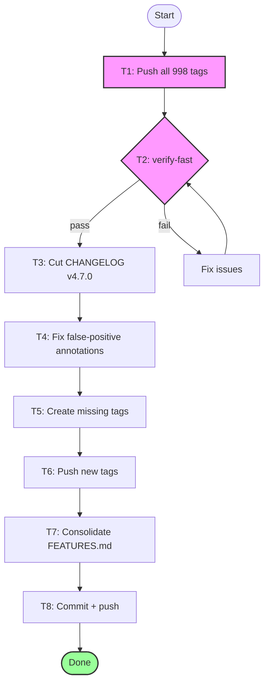

# SUPERB — Tag Push, CHANGELOG Cut, and Verification

> **Created:** 2026-08-08 23:49
> **Context:** 998 unpushed tags block vulncheck + consumer resolution. CHANGELOG [Unreleased] is 4724 lines. Verify gate stale GREEN across 8+ sessions. cqrs-lint false-positive report annotations were incorrect — guards already exist in code.

---

## Pareto Analysis

### The 1% that delivers 51%

**Push 998 unpushed tags to origin.** This single action unblocks:
- `nix run .#vulncheck` (blocked by unpushed tags for 8+ sessions)
- `scripts/check-tag-existence.sh` (CI gate)
- Consumer module resolution via `go mod` (untagged pseudo-versions fail)

### The 4% that delivers 64%

1. **Cut CHANGELOG `[Unreleased]` → `[v4.7.0]`** — 4724 lines becomes navigable
2. **Run `nix run .#verify-fast`** — confirm actual GREEN, break stale-GREEN pattern
3. **Fix incorrect annotations** on false-positive validation report (guards already exist)

### The 20% that delivers 80%

4. **Create missing tags** (`query/v4.3.0`, `dgraphengine/v4.0.2`, `flightrecorder/v4.0.0`)
5. **Strip replace directives** after `query/v4.3.0` tag
6. **Consolidate FEATURES.md metaengine table** (90→30 rows)

### The remaining 20%

7. **Wire `#check-arch` into verify gate** (add go-arch-lint as nix dep)
8. **Add `.go-arch-lint.yml` for metaengine/, stack/**

---

## Task Breakdown (Phase 1: 100-30min tasks)

| # | Task | Impact | Effort | Customer Value |
|---|------|--------|--------|----------------|
| T1 | Push all 998 tags to origin | CRITICAL | 5min | Consumers can resolve modules |
| T2 | Run `nix run .#verify-fast` | CRITICAL | 10min | Confirm build/lint/test GREEN |
| T3 | Cut CHANGELOG [Unreleased] → [v4.7.0] | HIGH | 15min | Navigable changelog |
| T4 | Fix incorrect false-positive annotations | MEDIUM | 10min | Accurate historical docs |
| T5 | Create missing tags (query, dgraph, flight) | HIGH | 10min | Consumers get latest symbols |
| T6 | Push new tags | HIGH | 2min | Same as T1 |
| T7 | Consolidate FEATURES.md metaengine table | MEDIUM | 30min | Readable feature inventory |
| T8 | Commit + push all changes | HIGH | 5min | Provenance |

## Task Breakdown (Phase 2: max 12min tasks)

| # | Task | From | Effort |
|---|------|------|--------|
| T1.1 | `git push origin --tags` | T1 | 5min |
| T2.1 | Run `nix run .#verify-fast` | T2 | 10min |
| T3.1 | Find the [v4.3.0] boundary in CHANGELOG | T3 | 2min |
| T3.2 | Insert `## [v4.7.0] — 2026-08-08` header above [v4.3.0] | T3 | 2min |
| T3.3 | Add release summary line | T3 | 5min |
| T4.1 | Fix C002 annotation: "OPEN" → "DONE — TransportAdapter guard exists" | T4 | 3min |
| T4.2 | Fix C027 annotation: "OPEN" → "DONE — ReceiverIsEventBus guard exists" | T4 | 3min |
| T4.3 | Fix S010 annotation: "OPEN" → "DONE — Use/UsePublish check exists" | T4 | 3min |
| T5.1 | `git tag -a query/v4.3.0 -m "..."` | T5 | 2min |
| T5.2 | `git tag -a metaengine/dgraphengine/v4.0.2 -m "..."` | T5 | 2min |
| T5.3 | `git tag -a flightrecorder/v4.0.0 -m "..."` | T5 | 2min |
| T5.4 | Strip replace directives from storage/* go.mod files | T5 | 5min |
| T5.5 | Verify build still passes after strip | T5 | 5min |
| T7.1 | Identify duplicate/stale rows in FEATURES metaengine | T7 | 5min |
| T7.2 | Remove duplicates, fix stale statuses | T7 | 5min |

---

## Mermaid Execution Graph

---

## Execution Log

_To be filled during execution._
