# SUPERB — Pareto Execution Plan: From 75 Open TODOs to Verified GREEN + Release

> **Created:** 2026-08-09 05:00
> **Context:** Following the docs-health audit session (04:56), the TODO_LIST has 75 open items + 1 BLOCKED. This plan ranks them by Pareto impact, splits into 27 medium tasks (30–100min), then 95 fine tasks (≤12min). The project is a **library** — the quality gate is "would a consumer trust this enough to import it?"
> **Threat model:** Verschlimmbesserung. Every task is surgical. No refactors of working code. No "improvements" that break consumers. Test before and after.

---

## Step 1: Pareto Breakdown — What REALLY matters?

### The 1% that delivers 51%

**Run `nix run .#verify` and fix all failures.**

This is THE foundation. It has been skipped for 10+ sessions (the "stale GREEN" anti-pattern documented in AGENTS.md). Without GREEN:

- We don't know if the project builds
- We can't cut a release
- Every other task is built on sand
- CI will fail on the next PR

1 task. ~60min. Everything else depends on it.

### The 4% that delivers 64%

| #  | Task                                                    | Why                                                                       | Effort |
| -- | ------------------------------------------------------- | ------------------------------------------------------------------------- | ------ |
| M1 | Run `nix run .#verify` + fix failures                   | Foundation — everything depends on GREEN                                  | 60min  |
| M2 | Cut CHANGELOG `[Unreleased]` → `[v4.7.0]` + tag modules | 4800-line changelog is unread; consumers need versioned tags              | 90min  |
| M3 | Fix benchkit timing flakes (3 tests)                    | CI flakiness blocks every PR; hardcoded 5s thresholds under parallel load | 30min  |
| M4 | Add meta-test: `testModules == all go.mod dirs`         | 8 modules were silently untested; prevents recurrence                     | 30min  |

4 tasks. ~210min. These four give us: GREEN verify, a versioned release, reliable CI, and a guard against silent test gaps.

### The 20% that delivers 80%

The 4% above, PLUS the highest-impact consumer-facing work:

| #   | Task                                               | Why                                                          | Effort |
| --- | -------------------------------------------------- | ------------------------------------------------------------ | ------ |
| M5  | Fix end-of-line suppression parser                 | Breaks every consumer who uses inline `// cqrs-lint:disable` | 30min  |
| M6  | cqrs-lint FP batch: C031 + F007/A016 + D005 + C041 | 4 consumer-reported false positives                          | 60min  |
| M7  | Run Postgres system integration test vs live PG    | First real PG test — compiles but never run                  | 30min  |
| M8  | Fix ShutdownOrder naming gap                       | API correctness bug (Profile().Name vs config keys)          | 30min  |
| M9  | QUIC convergence: t.Parallel() + `-race`           | Highest-concurrency transport, never race-tested             | 30min  |
| M10 | Write regression tests for 13 FP fixes             | Prevents regressions in the fixes we just shipped            | 90min  |

10 tasks total (4% + 6 more). ~510min. This gives us: GREEN, released, reliable CI, consumer-trusted linter, real PG test, correct API, race-tested QUIC.

### The other 20% → 100%

The remaining 17 medium tasks cover: Dgraph engine completeness, metaengine coverage, dedup cleanup, system package tests, layer enforcement, documentation, and integration test infrastructure. Important for long-term health but not blocking consumers today.

---

## Step 2: Comprehensive Plan — 27 Tasks (30–100min each)

> Sorted by Impact (customer-value × correctness) descending, then Effort ascending (quick wins first within each impact tier).

### Tier 1: CRITICAL — Foundation (do first, blocks everything)

| ID     | Task                                                                                 | Impact   | Effort | Deps | Source Items                                |
| ------ | ------------------------------------------------------------------------------------ | -------- | ------ | ---- | ------------------------------------------- |
| **M1** | 🔥 Run `nix run .#verify` + `nix fmt` + fix ALL failures                             | CRITICAL | 60min  | —    | TODO: "Run nix run .#verify"                |
| **M2** | 🔥 Cut CHANGELOG `[Unreleased]` → `[v4.7.0]` + tag ≥10 modules via `tag-release.sh`  | HIGH     | 90min  | M1   | TODO: "Cut CHANGELOG v4.7.0"                |
| **M3** | 🔥 Fix benchkit timing flakes (apply `RaceEnabled` relaxed-bound pattern to 3 tests) | HIGH     | 30min  | M1   | TODO: "Fix benchkit timing flakes"          |
| **M4** | 🔥 Add meta-test: `testModules == all go.mod dirs` (like api-stability pattern)      | HIGH     | 30min  | —    | TODO: "Add meta-test enforcing testModules" |

### Tier 2: HIGH — Consumer-facing fixes (do second)

| ID      | Task                                                                                                            | Impact      | Effort | Deps | Source Items                                |
| ------- | --------------------------------------------------------------------------------------------------------------- | ----------- | ------ | ---- | ------------------------------------------- |
| **M5**  | 🔥 Fix end-of-line suppression parser (`HasPrefix` → `Contains` or split on `//`)                               | HIGH        | 30min  | —    | TODO: cqrs-lint consumer feedback           |
| **M6**  | cqrs-lint FP batch: C031 `(any,error)` + F007/A016 imaginary API + D005 indirect-marker + C041 confidence raise | HIGH        | 60min  | —    | TODO: 4 cqrs-lint consumer items            |
| **M7**  | 🔥 Run Postgres system integration test against live PG (`nix run .#integration-pg`)                            | HIGH        | 30min  | —    | TODO: "Run Postgres integration test"       |
| **M8**  | 🔥 Fix ShutdownOrder naming gap (document or change to config keys)                                             | MEDIUM-HIGH | 30min  | —    | TODO: "Fix ShutdownOrder naming gap"        |
| **M9**  | QUIC convergence: add `t.Parallel()` + run full suite under `-race`                                             | MEDIUM      | 30min  | —    | TODO: 2 irohengine items                    |
| **M10** | Write regression unit tests for 13 cqrs-lint FP fixes                                                           | HIGH        | 90min  | M6   | TODO: "Write regression tests for FP fixes" |

### Tier 3: MEDIUM-HIGH — cqrs-lint precision + metaengine

| ID      | Task                                                                               | Impact     | Effort | Deps | Source Items                                 |
| ------- | ---------------------------------------------------------------------------------- | ---------- | ------ | ---- | -------------------------------------------- |
| **M11** | cqrs-lint batch: B029-B031 isBusName + D018 precision + `library-framework` preset | MEDIUM     | 60min  | —    | TODO: 3 cqrs-lint items                      |
| **M12** | Broaden `server` detection + P012/P013 DSN-level pragma detection                  | MEDIUM     | 90min  | —    | TODO: 2 cqrs-lint consumer items             |
| **M13** | Per-module feature profiles + C034 context-derivation tracing                      | MEDIUM     | 90min  | —    | TODO: 2 cqrs-lint consumer items             |
| **M14** | Replace `PackagesWithRegistration` with precise per-type tracing                   | MEDIUM     | 60min  | —    | TODO: "Replace PackagesWithRegistration"     |
| **M15** | Reclassify misclassified FPs + add integration test: lint `example/taskmanager`    | MEDIUM     | 60min  | M6   | TODO: 2 cqrs-lint items                      |
| **M16** | Write cqrs-lint v4.6.0 release notes (202 rules, 10 categories)                    | LOW-MEDIUM | 30min  | —    | TODO: "Write cqrs-lint v4.6.0 release notes" |

### Tier 4: MEDIUM — Metaengine / Dgraph completeness

| ID      | Task                                                                                                          | Impact         | Effort | Deps | Source Items                       |
| ------- | ------------------------------------------------------------------------------------------------------------- | -------------- | ------ | ---- | ---------------------------------- |
| **M17** | Dgraph engine: VM test + retry logic + connection pool tuning                                                 | MEDIUM         | 90min  | —    | TODO: 3 Dgraph items               |
| **M18** | Dgraph engine: StreamLogBackend + CounterIncrement over-read fix + Multimap/Log unit tests + `-race`          | MEDIUM         | 90min  | —    | TODO: 5 Dgraph items               |
| **M19** | Metaengine: `record.FromCommand()` + cross-engine aggregate parity test + SQLite Doctor test + DuckDB `-race` | MEDIUM         | 60min  | —    | TODO: 4 metaengine items           |
| **M20** | Metaengine: aggregate NULL/large-dataset tests + calibration benchmark vs baseline                            | LOW-MEDIUM     | 60min  | —    | TODO: 2 metaengine items           |
| **M21** | ADR-0117 command lifecycle implementation (DLQ as event streams)                                              | LOW (L-effort) | 90min+ | M19  | TODO: "ADR-0117 command lifecycle" |

### Tier 5: MEDIUM — Code quality / dedup

| ID      | Task                                                                                                                        | Impact     | Effort | Deps | Source Items               |
| ------- | --------------------------------------------------------------------------------------------------------------------------- | ---------- | ------ | ---- | -------------------------- |
| **M22** | Quick dedup wins: dead wrappers + non-deferred Close + file rename + gci/goimports + unused func                            | LOW-MEDIUM | 30min  | —    | TODO: 5 dedup items        |
| **M23** | Dedup extraction: DistinctValues SQL helper + engine boilerplate scan + deferClose consolidation                            | LOW-MEDIUM | 90min  | M22  | TODO: 3 dedup items        |
| **M24** | Dedup + config: backup lifecycle suite + `.golangci.yml` audit + depguard check + AGENTS.md dedup section + testModules doc | LOW-MEDIUM | 90min  | —    | TODO: 5 dedup/config items |

### Tier 6: LOWER — System / infra / docs / layer enforcement

| ID      | Task                                                                                                                                                  | Impact     | Effort | Deps | Source Items                    |
| ------- | ----------------------------------------------------------------------------------------------------------------------------------------------------- | ---------- | ------ | ---- | ------------------------------- |
| **M25** | System batch: PG per-test isolation + GracefulClose drain test + TestMain driver consolidation + concurrent Close race tests + Badger/bbolt SOT tests | MEDIUM     | 90min  | M7   | TODO: 5 system items            |
| **M26** | Layer enforcement: `.go-arch-lint.yml` for metaengine/stack/decider/projectionhost + 2 meta-tests                                                     | LOW-MEDIUM | 90min  | —    | TODO: 6 layer items             |
| **M27** | Docs batch: taskmanager DX update + SKILL circuit-breaker FAQ + view-store README docs + 2 ADRs + SHA pinning policy + bbolt ReadStreamFrom perf      | LOW-MEDIUM | 90min  | —    | TODO: 6 docs items + bbolt perf |

> **Not in plan (BLOCKED):** Publish go-finding + go-must as tagged modules — external blocker, needs user action.
> **Not in plan (deferred):** CGo DuckDB test sub-module split — design decision, not actionable yet. macOS PG verification — needs Darwin hardware. Redis/NATS/Dgraph Go integration tests — large effort, lower priority than existing infra.

---

## Step 3: Detailed Breakdown — Fine Tasks (≤12min each)

> Each medium task split into atomic subtasks. Sorted within each medium task by execution order.

### M1: Run verify + fix failures (6 subtasks)

| ID   | Subtask                                                          | Effort |
| ---- | ---------------------------------------------------------------- | ------ |
| M1.1 | Run `nix fmt` on TODO_LIST.md + any unformatted files            | 5min   |
| M1.2 | Run `nix run .#verify` and capture ALL failures (pipe to log)    | 10min  |
| M1.3 | Triage failures: categorize as build/vet/test/lint/race/doc/arch | 10min  |
| M1.4 | Fix build failures (if any) — one commit per fix                 | 12min  |
| M1.5 | Fix lint failures (if any) — `nix fmt` + depguard + nolint       | 12min  |
| M1.6 | Re-run `nix run .#verify` to GREEN, verify no regressions        | 10min  |

### M2: Cut CHANGELOG release (7 subtasks)

| ID   | Subtask                                                        | Effort |
| ---- | -------------------------------------------------------------- | ------ |
| M2.1 | Identify all modules changed since last tag batch (git log)    | 5min   |
| M2.2 | Run `scripts/tag-release.sh --dry-run` for each changed module | 10min  |
| M2.3 | Strip replace directives, tag each module with next semver     | 12min  |
| M2.4 | Push tags to origin (`git push origin --tags`)                 | 5min   |
| M2.5 | Cut CHANGELOG: `## [Unreleased]` → `## [v4.7.0] — 2026-08-09`  | 10min  |
| M2.6 | Add new empty `## [Unreleased]` section above                  | 2min   |
| M2.7 | Run `TestTagContentMatchesChangelog` to verify the cut         | 5min   |

### M3: Fix benchkit timing flakes (4 subtasks)

| ID   | Subtask                                                            | Effort |
| ---- | ------------------------------------------------------------------ | ------ |
| M3.1 | Read the 3 flaky tests + `parallelTimeoutCtx` helper               | 5min   |
| M3.2 | Apply `RaceEnabled` pattern: if RaceEnabled, use 15s instead of 5s | 10min  |
| M3.3 | Run the 3 tests 3x with `-count=3 -race -parallel` to verify fix   | 10min  |
| M3.4 | Run full benchkit test suite to verify no regressions              | 5min   |

### M4: Add testModules meta-test (3 subtasks)

| ID   | Subtask                                                                        | Effort |
| ---- | ------------------------------------------------------------------------------ | ------ |
| M4.1 | Read `flake.nix` testModules list + `TestEveryGoModDirIsInModulesList` pattern | 5min   |
| M4.2 | Write `TestEveryGoModDirIsInTestModules` in cmd/api-stability                  | 10min  |
| M4.3 | Run test, verify it catches any missing modules                                | 5min   |

### M5: Fix end-of-line suppression parser (3 subtasks)

| ID   | Subtask                                                                  | Effort |
| ---- | ------------------------------------------------------------------------ | ------ |
| M5.1 | Read `cmd/cqrs-lint/filters.go` suppression parser + the `HasPrefix` bug | 5min   |
| M5.2 | Replace `HasPrefix` with split-on-`//` or `Contains` approach            | 10min  |
| M5.3 | Write test: `code // cqrs-lint:disable:C002` suppresses correctly        | 10min  |

### M6: cqrs-lint FP batch (8 subtasks)

| ID   | Subtask                                                       | Effort |
| ---- | ------------------------------------------------------------- | ------ |
| M6.1 | Read C031 detector + identify `(any, error)` multi-return gap | 5min   |
| M6.2 | Fix C031: skip `return nil, err` in multi-return functions    | 10min  |
| M6.3 | Read F007/A016 suggestion strings, identify imaginary APIs    | 5min   |
| M6.4 | Fix F007/A016: replace with real building-block suggestions   | 10min  |
| M6.5 | Read D005 version-parsing logic, identify indirect-marker bug | 5min   |
| M6.6 | Fix D005: skip `// indirect` lines when extracting version    | 10min  |
| M6.7 | Raise C041 confidence from 0.25 to 0.5 (one-line change)      | 2min   |
| M6.8 | Run cqrs-lint self-lint + test suite to verify no regressions | 10min  |

### M7: Run PG integration test (3 subtasks)

| ID   | Subtask                                                           | Effort |
| ---- | ----------------------------------------------------------------- | ------ |
| M7.1 | Start ephemeral PG: `nix run .#integration-pg`                    | 5min   |
| M7.2 | Run `go test -run TestIntegration_PostgresSource ./system/... -v` | 10min  |
| M7.3 | Fix any failures, document results in a status report             | 12min  |

### M8: Fix ShutdownOrder naming gap (3 subtasks)

| ID   | Subtask                                                             | Effort |
| ---- | ------------------------------------------------------------------- | ------ |
| M8.1 | Read `ShutdownOrder()` + `ShutdownDependency` type defs             | 5min   |
| M8.2 | Decision: document the discrepancy (add doc comment) — simplest fix | 10min  |
| M8.3 | Add test verifying `ShutdownOrder()` output is documented behavior  | 10min  |

### M9: QUIC convergence tests (3 subtasks)

| ID   | Subtask                                                                      | Effort |
| ---- | ---------------------------------------------------------------------------- | ------ |
| M9.1 | Add `t.Parallel()` to `TestQuicConvergenceSuite` in `quic/transport_test.go` | 2min   |
| M9.2 | Run `go test -race -run TestQuic ./metaengine/irohengine/quic/...`           | 10min  |
| M9.3 | Fix any race conditions found, verify clean pass                             | 12min  |

### M10: Regression tests for FP fixes (9 subtasks)

| ID    | Subtask                                                   | Effort |
| ----- | --------------------------------------------------------- | ------ |
| M10.1 | Write test for A005 (non-event-bus receiver FP)           | 10min  |
| M10.2 | Write test for C027 (non-event-bus receiver FP)           | 10min  |
| M10.3 | Write test for S010 (requires Use() wiring)               | 10min  |
| M10.4 | Write test for A032 (form-tag structs + display packages) | 10min  |
| M10.5 | Write test for C013 (json:"-" skip)                       | 8min   |
| M10.6 | Write test for C034 (HTTP shutdown pattern)               | 10min  |
| M10.7 | Write test for C035 (serialization DTO)                   | 10min  |
| M10.8 | Write test for E009 (custom HTTP)                         | 10min  |
| M10.9 | Write test for D005 (code blocks + import paths)          | 10min  |

### M11: cqrs-lint precision batch (5 subtasks)

| ID    | Subtask                                                                  | Effort |
| ----- | ------------------------------------------------------------------------ | ------ |
| M11.1 | Fix B029-B031: require `.Use()`/`.Publish()` calls, not just name suffix | 12min  |
| M11.2 | Fix D018: use type info for precise `event.NewEvent` detection           | 12min  |
| M11.3 | Add `library-framework` preset to `PresetDefinitions` map                | 10min  |
| M11.4 | Add `library-framework` to `explain` subcommand output                   | 5min   |
| M11.5 | Run cqrs-lint self-lint + test suite                                     | 10min  |

### M12: Server detection + DSN pragma (5 subtasks)

| ID    | Subtask                                                                 | Effort |
| ----- | ----------------------------------------------------------------------- | ------ |
| M12.1 | Read current `server` feature detection logic                           | 5min   |
| M12.2 | Add detection for `http.Server{}` struct literals + `.ListenAndServe()` | 12min  |
| M12.3 | Read P012/P013 detector logic                                           | 5min   |
| M12.4 | Add DSN-level pragma scanning (`_pragma=journal_mode(WAL)`)             | 12min  |
| M12.5 | Write tests for both improvements                                       | 12min  |

### M13: Per-module profiles + context tracing (6 subtasks)

| ID    | Subtask                                                              | Effort |
| ----- | -------------------------------------------------------------------- | ------ |
| M13.1 | Design per-module feature profile detection (multi-go.mod workspace) | 12min  |
| M13.2 | Implement `ProfileForFile` per-module resolution                     | 12min  |
| M13.3 | Read C034 detector, identify context-derivation gap                  | 5min   |
| M13.4 | Fix C034: trace `context.WithCancel(ctx)` → variable → `<-.Done()`   | 12min  |
| M13.5 | Write tests for both                                                 | 12min  |
| M13.6 | Run cqrs-lint self-lint                                              | 5min   |

### M14: Per-type registration tracing (5 subtasks)

| ID    | Subtask                                                                       | Effort |
| ----- | ----------------------------------------------------------------------------- | ------ |
| M14.1 | Read `PackagesWithRegistration` + E007 suppression logic                      | 5min   |
| M14.2 | Design per-type registration tracing (trace through generic wrappers)         | 12min  |
| M14.3 | Implement: scan for `RegisterTyped`/`RegisterQuery` call sites, resolve types | 12min  |
| M14.4 | Remove `PackagesWithRegistration` field + population code                     | 10min  |
| M14.5 | Re-validate E007 against consumer repos                                       | 12min  |

### M15: Reclassify FPs + integration test (4 subtasks)

| ID    | Subtask                                                                       | Effort |
| ----- | ----------------------------------------------------------------------------- | ------ |
| M15.1 | Read validation report, identify 9 TPs misclassified as FPs                   | 10min  |
| M15.2 | Update report with corrected classifications                                  | 12min  |
| M15.3 | Write integration test: run cqrs-lint on `example/taskmanager`, assert golden | 12min  |
| M15.4 | Add `CQRS_LINT_UPDATE_GOLDEN=1` path test                                     | 10min  |

### M16: cqrs-lint release notes (2 subtasks)

| ID    | Subtask                                                                | Effort |
| ----- | ---------------------------------------------------------------------- | ------ |
| M16.1 | Write release notes covering 202 rules, 10 categories, new subcommands | 12min  |
| M16.2 | Add to CHANGELOG under the v4.7.0 section                              | 5min   |

### M17: Dgraph infra (6 subtasks)

| ID    | Subtask                                                          | Effort |
| ----- | ---------------------------------------------------------------- | ------ |
| M17.1 | Read postgres-vm.nix / mysql-vm.nix pattern                      | 5min   |
| M17.2 | Write `nix/vm/dgraph.nix` — NixOS VM test for Dgraph Zero+Alpha  | 12min  |
| M17.3 | Wire as `checks.x86_64-linux.dgraph-vm` in flake.nix             | 5min   |
| M17.4 | Add retry logic for transient `"Please retry again"` RAFT errors | 12min  |
| M17.5 | Add gRPC `MaxCallRecvMsgSize` tuning for large result sets       | 10min  |
| M17.6 | Run Dgraph tests against live instance to verify                 | 10min  |

### M18: Dgraph engine completeness (7 subtasks)

| ID    | Subtask                                                         | Effort |
| ----- | --------------------------------------------------------------- | ------ |
| M18.1 | Read current dgraphengine ADT coverage (8/11)                   | 5min   |
| M18.2 | Implement StreamLogBackend (append-only log via DQL)            | 12min  |
| M18.3 | Fix CounterIncrement: query only delta keys, not all counters   | 12min  |
| M18.4 | Write MultimapBackend unit tests (empty key, limit=0, ordering) | 12min  |
| M18.5 | Write LogBackend unit tests (empty collection, limit > entries) | 10min  |
| M18.6 | Run full test suite against live Dgraph                         | 10min  |
| M18.7 | Run full `-race` suite against live Dgraph                      | 12min  |

### M19: Metaengine core (6 subtasks)

| ID    | Subtask                                                         | Effort |
| ----- | --------------------------------------------------------------- | ------ |
| M19.1 | Write `record.FromCommand(cmd)` — mirror of `event.AsRecord()`  | 10min  |
| M19.2 | Write cross-engine aggregate parity test (5 interfaces)         | 12min  |
| M19.3 | Add SQLite engine Doctor test (real engine)                     | 10min  |
| M19.4 | Run DuckDB full test suite under `-race`                        | 12min  |
| M19.5 | Run all new tests, verify GREEN                                 | 5min   |
| M19.6 | Run `go build -tags "goexperiment.jsonv2" ./...` workspace-wide | 5min   |

### M20: Metaengine coverage (4 subtasks)

| ID    | Subtask                                                      | Effort |
| ----- | ------------------------------------------------------------ | ------ |
| M20.1 | Write aggregate tests with NULL values + 10K+ row datasets   | 12min  |
| M20.2 | Run calibration benchmarks against `calibration-baseline.md` | 12min  |
| M20.3 | Document deviations from baseline                            | 10min  |
| M20.4 | Add CI regression check for calibration drift                | 10min  |

### M21: ADR-0117 command lifecycle (5 subtasks)

| ID    | Subtask                                               | Effort |
| ----- | ----------------------------------------------------- | ------ |
| M21.1 | Read ADR-0117, identify lifecycle event stream shapes | 10min  |
| M21.2 | Implement DLQ as event stream (not status field)      | 12min  |
| M21.3 | Implement retry as event stream                       | 12min  |
| M21.4 | Write tests for command lifecycle                     | 12min  |
| M21.5 | Update ADR-0117 with implementation status            | 5min   |

### M22: Quick dedup wins (5 subtasks)

| ID    | Subtask                                                                            | Effort |
| ----- | ---------------------------------------------------------------------------------- | ------ |
| M22.1 | Replace 5 callers of `newDuckDBPushdown` with `mustNewDuckEngine`, delete function | 10min  |
| M22.2 | Fix non-deferred `eng.Close()` in pgengine + duckdbengine healthcheck tests        | 8min   |
| M22.3 | Rename `helper_test.go` → `helper_cgo_test.go` in duckdbengine                     | 2min   |
| M22.4 | Investigate gci vs goimports on 2 test files, fix or suppress                      | 10min  |
| M22.5 | Remove unused `newSQLiteEngineForPath` in bench/sqlite_factory_test.go             | 3min   |

### M23: Dedup extraction (5 subtasks)

| ID    | Subtask                                                                            | Effort |
| ----- | ---------------------------------------------------------------------------------- | ------ |
| M23.1 | Extract `DistinctValues` row-scan into `metaengine/sqlutil/` or `storage/sql/`     | 12min  |
| M23.2 | Scan badgerengine/pebbleengine/dgraphengine for engine-setup boilerplate           | 12min  |
| M23.3 | Extract shared engine-setup helper if pattern found                                | 12min  |
| M23.4 | Consolidate `deferClose` helper (3 copies → shared or documented per-module idiom) | 12min  |
| M23.5 | Update `.art-dupl-baseline.json` + run `nix run .#check-duplication`               | 10min  |

### M24: Dedup + config (6 subtasks)

| ID    | Subtask                                                                            | Effort |
| ----- | ---------------------------------------------------------------------------------- | ------ |
| M24.1 | Extract bbolt/pebble backup lifecycle test into shared `backuptest` module         | 12min  |
| M24.2 | Audit `.golangci.yml` exclusion blocks (system/ 20, cqrs-lint/ 13, metaengine/ 15) | 12min  |
| M24.3 | Narrow exclusions where safe                                                       | 12min  |
| M24.4 | Add CI check comparing `go.mod` requires vs depguard allow list                    | 12min  |
| M24.5 | Update AGENTS.md "Dedup helper patterns" section with new helpers                  | 12min  |
| M24.6 | Document `testModules` ↔ `lintModules` coupling in AGENTS.md                       | 10min  |

### M25: System batch (6 subtasks)

| ID    | Subtask                                                                           | Effort |
| ----- | --------------------------------------------------------------------------------- | ------ |
| M25.1 | Add per-test database isolation for PG integration test (create/drop DB per test) | 12min  |
| M25.2 | Add `TestSystem_GracefulClose_DrainError_NoClose`                                 | 10min  |
| M25.3 | Consolidate driver registration into shared `TestMain`                            | 12min  |
| M25.4 | Add concurrent Close/GracefulClose race tests                                     | 12min  |
| M25.5 | Add Badger/bbolt source-of-truth integration tests                                | 12min  |
| M25.6 | Run all system tests with `-race`                                                 | 10min  |

### M26: Layer enforcement (6 subtasks)

| ID    | Subtask                                                                           | Effort |
| ----- | --------------------------------------------------------------------------------- | ------ |
| M26.1 | Write `.go-arch-lint.yml` for `metaengine/` (16+ production files)                | 12min  |
| M26.2 | Write `.go-arch-lint.yml` for `stack/`                                            | 10min  |
| M26.3 | Write `.go-arch-lint.yml` for `decider/`                                          | 8min   |
| M26.4 | Write `.go-arch-lint.yml` for `projectionhost/`                                   | 10min  |
| M26.5 | Add meta-test: every `.go-arch-lint.yml` is parseable + components match packages | 12min  |
| M26.6 | Add meta-test: every 3+ package module has a `.go-arch-lint.yml`                  | 10min  |

### M27: Docs batch (7 subtasks)

| ID    | Subtask                                                                          | Effort |
| ----- | -------------------------------------------------------------------------------- | ------ |
| M27.1 | Update `example/taskmanager/metaengine.go` to use `Register` + `NewTypeDecoder`  | 12min  |
| M27.2 | Add SKILL.md FAQ entry: circuit-breaker → failsafe-go cross-reference            | 8min   |
| M27.3 | Document `WithoutViewAutoMigrate` + `AutoMapper` as default in view-store README | 10min  |
| M27.4 | Document `Increment` non-clamping philosophy in README                           | 8min   |
| M27.5 | Write ADR for ApplyLayoutPlan post-construction registration pattern             | 12min  |
| M27.6 | Write ADR for WithClock pattern (injectable time for CRDT testing)               | 10min  |
| M27.7 | Document GitHub Actions SHA pinning policy in CONTRIBUTING.md                    | 8min   |

---

## Execution Graph

```mermaid
graph TD
    %% Tier 1: Foundation
    M1[M1: Run verify + fix] --> M2[M2: Cut CHANGELOG v4.7.0]
    M1 --> M3[M3: Fix benchkit flakes]
    M1 --> M4[M4: testModules meta-test]

    %% Tier 2: Consumer-facing
    M5[M5: Fix suppression parser] --> M10[M10: Regression tests]
    M6[M6: cqrs-lint FP batch] --> M10
    M6 --> M15[M15: Reclassify FPs + taskmanager test]
    M7[M7: PG integration test]
    M8[M8: ShutdownOrder gap]
    M9[M9: QUIC convergence tests]
    M10 --> M16[M16: cqrs-lint release notes]

    %% Tier 3: cqrs-lint precision
    M11[M11: isBusName + D018 + preset]
    M12[M12: Server detection + DSN pragma]
    M13[M13: Per-module profiles + C034]
    M14[M14: Per-type registration tracing]
    M6 --> M11
    M6 --> M12
    M6 --> M13
    M6 --> M14

    %% Tier 4: Metaengine
    M17[M17: Dgraph VM + retry + pool]
    M18[M18: Dgraph StreamLog + Counter fix + unit tests]
    M19[M19: record.FromCommand + aggregate parity]
    M19 --> M21[M21: ADR-0117 command lifecycle]
    M20[M20: Aggregate NULL tests + calibration]

    %% Tier 5: Code quality
    M22[M22: Quick dedup wins]
    M22 --> M23[M23: Dedup extraction]
    M24[M24: Backup suite + golangci audit + AGENTS.md]

    %% Tier 6: System/Infra/Docs
    M7 --> M25[M25: System batch tests]
    M26[M26: Layer enforcement configs]
    M27[M27: Docs batch]

    %% Release gate
    M2 --> RELEASE{{"🏁 RELEASE v4.7.0"}}
    M1 --> RELEASE

    %% Styling
    style M1 fill:#ff6b6b,color:#fff
    style M2 fill:#ffa502,color:#fff
    style M3 fill:#ffa502,color:#fff
    style M4 fill:#ffa502,color:#fff
    style RELEASE fill:#2ed573,color:#fff
```

---

## Execution Order (Recommended)

### Phase 1: Foundation (1% — ~60min)

1. **M1** — Run verify + fix failures → GREEN

### Phase 2: Release (4% — ~150min)

2. **M3** — Fix benchkit flakes (CI must be reliable)
3. **M4** — Add testModules meta-test
4. **M2** — Cut CHANGELOG v4.7.0 + tag modules

### Phase 3: Consumer-facing fixes (20% — ~300min)

5. **M5** — Fix suppression parser
6. **M6** — cqrs-lint FP batch (4 fixes)
7. **M7** — PG integration test vs live PG
8. **M8** — ShutdownOrder gap
9. **M9** — QUIC convergence tests
10. **M10** — Regression tests for FP fixes

### Phase 4: cqrs-lint precision (rest of 20% — ~300min)

11. **M11** — isBusName + D018 + preset
12. **M12** — Server detection + DSN pragma
13. **M13** — Per-module profiles + C034
14. **M14** — Per-type registration tracing
15. **M15** — Reclassify FPs + taskmanager test
16. **M16** — Release notes

### Phase 5: Metaengine completeness (~360min)

17. **M17** — Dgraph infra
18. **M18** — Dgraph engine completeness
19. **M19** — Metaengine core gaps
20. **M20** — Aggregate + calibration tests
21. **M21** — ADR-0117 command lifecycle

### Phase 6: Code quality (~210min)

22. **M22** — Quick dedup wins
23. **M23** — Dedup extraction
24. **M24** — Backup suite + config audit

### Phase 7: System + Infra + Docs (~270min)

25. **M25** — System batch tests
26. **M26** — Layer enforcement
27. **M27** — Docs batch

---

## Verschlimmbesserung Guardrails

1. **Test before AND after every change** — run the affected module's tests
2. **One logical change per commit** — never batch unrelated fixes
3. **Never refactor working code** — if it ain't broke, don't fix it
4. **Never change public API without updating api-stability golden** — `cd cmd/api-stability && GOWORK=off go run main.go -update`
5. **Never delete an export** — this is a library; public API IS the product
6. **Run `nix fmt` BEFORE placing `//nolint` directives** — formatter moves them
7. **Verify module tags exist before adding `require` directives** — `git tag -l '<module>/v4*'`
8. **If `nix run .#verify` fails, STOP and fix before continuing** — never build on broken state
