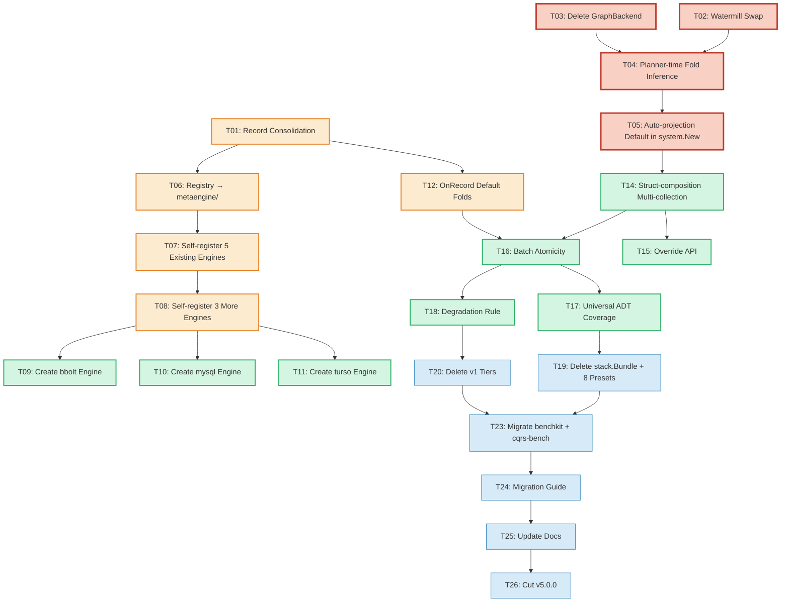

# v5 Unification — Superb Execution Plan

> **Date:** 2026-08-09 06:39
> **Decision:** [ADR-0123](../adr/0123-v5-unification-single-composition-root.md)
> **Vision:** Developers declare only Commands + Events + Queries. The system infers projections, storage layout, indexes, and engine routing. Operators pick infrastructure at deployment time. No developer ever thinks about the storage layer.

---

## Execution Graph



### Critical Path (longest dependency chain)

```
T01 (Record) → T06 (Registry) → T07 (5 Engines) → T08 (3 Engines)
  → T16 (Batch Atomicity) → T17 (Universal ADT) → T19 (Delete stack)
  → T23 (Migrate benchkit) → T24 (Guide) → T25 (Docs) → T26 (v5 Cut)
```

### Parallelizable Tracks

- **Track A (Auto-projection):** T02 → T03 → T04 → T05 → T14 → T15
- **Track B (Foundation):** T01 → T06 → T07 → T08 → T09/T10/T11
- **Track C (Engine internals):** T16 → T17 → T18
- **Track D (Cleanup):** T19 → T20 → T23 (gated on A+B+C)

---

## Pareto Breakdown

### The 1% that delivers 51% of the value

The user's north star: "developer declares only Commands + Events + Queries, system infers projections." The 1% makes this REAL for the first time.

**Why these 4 tasks = 51%:** `AutoCRUDByConvention` reflection logic ALREADY EXISTS (`auto_naming.go:150`). The watermill swap is 1 line (both implement `event.Bus`). GraphBackend is dead code in 4 of 5 engines already. The gap between "today" and "developer declares types, gets projections through a production-ready composition root" is ~3 hours of work.

| Task | What | Why it's 1% | Why it delivers 51% |
|------|------|-------------|---------------------|
| T02 | Swap simpleBus → watermill | 1-line change, both implement `event.Bus` | system/ becomes production-ready (persistent bus, retries, NATS/Redis/Kafka via WithBackend) |
| T03 | Delete GraphBackend | Already removed from 4/5 engines (-433 lines done) | Removes the last dead interface, unblocks graphadapter as sole path |
| T04 | Planner-time fold inference PlanRule | Reflection logic exists in auto_naming.go, just needs a PlanRule wrapper (~60 lines) | THE killer feature: `Plan()` auto-generates folds from struct shapes. Developer writes ZERO fold code. |
| T05 | Auto-projection as default in system.New() | Wire projectionadapter to use auto-projection by default | Consumer declares `Projections: []any{...}` with raw types → working projections with no fold code |

### The 4% that delivers 64% of the value

| Task | What | Why 64% |
|------|------|---------|
| T01 | Record consolidation | Unifies the type system. Only 3 production files use event.Metadata directly. Adapters already exist. |
| T06 | Move registry to metaengine/ | Enables self-registration without dependency inversion. All engines already depend on metaengine/. |
| T07 | Self-register 5 existing engines | memory, sqlite, pebble, postgres, duckdb — all exist as metaengine engines, just need register.go (~10 lines each) |
| T08 | Self-register 3 more (badger, dgraph, iroh) | Same — exist as engines, just register.go |
| T12 | OnRecord as default fold | Folds receive Record (StreamID, Version, Metadata) — ES-native by default, not opt-in |

### The 20% that delivers 80% of the value

| Task | What | Why 80% |
|------|------|---------|
| T09-T11 | Create bbolt/mysql/turso metaengine modules | These don't have metaengine engine modules yet — need adapter or new module |
| T14 | Struct-composition multi-collection | Detect `[]Attachment` on event → auto-generate second collection. The "zero-config relational" dream. |
| T16 | Multi-collection batch atomicity | Currently folds execute independently — no rollback. Needs store-level transaction batching. Critical for correctness. |
| T17 | Universal ADT coverage | Fill gaps: duckdb/pg need Set/Multimap/Log; dgraph needs StreamLog. Every engine handles every ADT. |
| T18 | Capability-degradation rule | Planner emits WARN when ADT is degraded on chosen engine. Honest diagnostics. |

### The remaining 20% (to reach 100%)

| Task | What |
|------|------|
| T13 | Deprecate + remove payload-only On constructor |
| T15 | Fold inference override API |
| T19 | Delete stack.Bundle + all 8 presets |
| T20 | Delete v1 tiers (Materialize, RelationalProjection, SQLViewStore, GraphProjection) |
| T21 | Delete stack.RunProjections |
| T22 | Delete stack.Materialize |
| T23 | Migrate benchkit + cmd/cqrs-bench to system.System |
| T24 | Write v5 migration guide |
| T25 | Update README, SKILL.md, AGENTS.md, examples |
| T26 | Cut v5.0.0 — tag + CHANGELOG |

---

## Medium Plan (30-100min tasks)

> 26 tasks, sorted by Pareto tier then dependency order.

| # | Task | Pareto | Impact | Effort | Deps | Description |
|---|------|--------|--------|--------|------|-------------|
| T01 | Record consolidation (ADR-0111 P3-4) | 4% | Critical | 90min | — | Consolidate event.Metadata, command.Metadata, metadata.Tracing into record.CommonMetadata. 3 production files (watermill/protocol.go, pebble/serialization.go, bbolt/serialization.go) + ~10 test files. Adapters (event.AsRecord, command.AsRecord) already exist. |
| T02 | Swap simpleBus → watermill.EventBus | 1% | Critical | 30min | — | Replace newSimpleBus() with watermill.NewEventBus() in system/driver_registry.go:152. Add watermill dep to system/go.mod. Map BusConfig.Driver to watermill backend selection. Both implement event.Bus — no adapter needed. |
| T03 | Delete metaengine.GraphBackend (ADR-0113) | 1% | High | 60min | — | Remove GraphBackend interface from engine.go:394. Remove assertion from memory engine (engine.go:560). Update adttest.RunMatrix to test graph via graphadapter. ~15 files touched. |
| T04 | Planner-time fold inference PlanRule | 1% | Critical | 60min | T03 | New PlanRule (~60 lines) that accepts event type samples on QueryDecl and calls autoInsertByType/autoUpdateByType/autoDeleteByType internally. Convention logic already exists in AutoCRUDByConvention (auto_naming.go:150). The gap is API design (how samples reach Plan()), not reflection logic. |
| T05 | Auto-projection as default in system.New() | 1% | Critical | 45min | T04 | Wire system/constructor.go projection setup to use auto-projection by default. Consumer passes raw event/query types in DomainConfig.Projections → system auto-generates folds → projectionadapter feeds them to metaengine.Store. Zero fold code from consumer. |
| T06 | Move driver registry to metaengine/ | 4% | High | 60min | T01 | Relocate RegisterDriver, DriverFactory, EngineConfig, lookupDriver from system/driver_registry.go to new metaengine/registry.go. system/ calls metaengine.LookupDriver(name). All engines already depend on metaengine/. |
| T07 | Self-register 5 existing engines | 4% | High | 45min | T06 | Create register.go in memory_engine, sqliteengine, pebbleengine, pgengine, duckdbengine. Each is ~10 lines: `func init() { metaengine.RegisterDriver("name", factory) }`. Move existing init() registrations from system/driver_registry.go. |
| T08 | Self-register 3 more engines | 20% | Medium | 30min | T06 | Create register.go in badgerengine, dgraphengine, irohengine. Same pattern as T07. |
| T09 | Create bbolt metaengine module | 20% | Medium | 60min | T07 | New metaengine/bboltengine/ module (or adapter wrapping storage/bbolt). Implement MapBackend, SetBackend, CounterBackend, LogBackend, StreamLogBackend, AtomicAppender. Self-register as "bbolt". |
| T10 | Create mysql metaengine module | 20% | Medium | 60min | T07 | Extend pgengine pattern to MySQL dialect, or new metaengine/mysqlengine/. Self-register as "mysql". |
| T11 | Create turso metaengine module | 20% | Medium | 60min | T07 | Turso is libSQL (SQLite-compatible). May work with sqliteengine directly, or needs thin adapter for sync API. Self-register as "turso". |
| T12 | Make OnRecord the default fold | 4% | High | 45min | T01 | Update examples, docs, auto-projection to use OnRecord/OnRecordTyped. Fold handlers receive record.Record as first parameter. Mark payload-only On as deprecated. |
| T13 | Deprecate + remove On constructor | Rest | Medium | 30min | T12 | Mark On() as deprecated, update all internal callers, remove in v5 cut. |
| T14 | Struct-composition multi-collection | 20% | High | 90min | T04 | When event has `[]Attachment` field and query requests MessageView (which has Attachments), auto-generate second collection for attachments. Planner detects the relationship. |
| T15 | Fold inference override API | Rest | Medium | 45min | T04 | When auto-projection gets it wrong, consumer can override with explicit OnRecord fold for a specific event/query pair. Override replaces (not supplements) the generated fold. |
| T16 | Multi-collection batch atomicity | 20% | Critical | 90min | T12 | Refactor store.ApplyRecord to QUEUE fold operations, then execute all in one engine transaction. Today folds execute immediately and independently — no rollback. Add BatchTxn interface to engines. Implement in memory + sqlite first. |
| T17 | Universal ADT coverage | 20% | High | 90min | T16 | Audit each engine for missing ADTs. Fill gaps: duckdb/pg need Set/Multimap/Log; dgraph needs StreamLog. Add degraded fallbacks where native is impossible (graph via recursive CTE on SQL engines). |
| T18 | Capability-degradation planner rule | 20% | High | 45min | T17 | New PlanRule that emits WARN/INFO when ADT is routed to engine whose EngineProfile declares it degraded. Shows estimated cost penalty + recommends better engine. Integrates into ExplainPlan() and Doctor(). |
| T19 | Delete stack.Bundle + 8 presets | Rest | Medium | 60min | T17, T18 | Delete stack/bundle.go, stack/accessors.go, stack/options.go, stack/materialize.go, stack/run_projections.go + all 8 preset packages. ~30+ files. |
| T20 | Delete v1 read-model tiers | Rest | Medium | 45min | T19 | Delete storage/relational/ (RelationalProjection + ProjectionSink + RelationalStore), storage/view/ (SQLViewStore + ViewMapper). Absorb concepts as engine internals. |
| T21 | Delete graph.GraphProjection | Rest | Low | 30min | T19 | Delete graph/projection.go + graph/sink.go. Auto-projection + graphadapter replaces it. |
| T22 | Delete stack.Materialize + RunProjections | Rest | Low | 30min | T19 | Already covered by T19 deletion, but listed separately for tracking. Ensure all references are gone. |
| T23 | Migrate benchkit + cqrs-bench | Rest | High | 60min | T19, T20 | benchkit/runner.go stores *stack.Bundle as field — rearchitect to use *system.System. cmd/cqrs-bench/factory.go returns func() (*stack.Bundle, error) — convert to system configs. ~4 files. |
| T24 | Write v5 migration guide | Rest | High | 60min | T23 | Document path from v4 (stack presets, v1 tiers) to v5 (system.System, auto-projection). Before/after examples for each v1 tier. Include auto-projection getting started. |
| T25 | Update README, SKILL.md, AGENTS.md, examples | Rest | High | 60min | T24 | Rewrite all consumer-facing docs for the single composition root + auto-projection. Update 4 examples (taskmanager, getting-started, readme-quickstart, metaengine-quickstart). |
| T26 | Cut v5.0.0 | Rest | Critical | 30min | T25 | Tag all modules with v5.0.0. Update CHANGELOG. Run full verify gate. Push tags. |

**Total estimated effort:** ~21 hours

---

## Fine Plan (max 12min tasks)

> 104 tasks. Each is a single focused action. Sorted by dependency on medium task, then execution order within.

### T01: Record Consolidation (90min → 8 tasks)

| # | Task | Time |
|---|------|------|
| F001 | Audit all references to event.Metadata in production code (grep -rn "event.Metadata" --include="*.go" \| grep -v _test) | 5min |
| F002 | Map field differences: event.Metadata (11 fields) vs record.CommonMetadata (7 fields). Document gap (Tombstone, Causation, Source, IPAddress, UserAgent missing from CommonMetadata). | 10min |
| F003 | Extend record.CommonMetadata with missing fields (Tombstone, Causation, Source, IPAddress, UserAgent) OR decide they move to domain-specific metadata | 12min |
| F004 | Update event/asrecord.go AsRecord() to map ALL fields to the extended CommonMetadata | 10min |
| F005 | Update watermill/protocol.go buildMetadata() to use record.CommonMetadata | 10min |
| F006 | Update storage/pebble/serialization.go + storage/bbolt/serialization.go to use record.CommonMetadata | 12min |
| F007 | Update all ~10 test files that reference event.Metadata | 12min |
| F008 | Run per-module tests: cd event && GOWORK=off go test ./... -count=1. Fix failures. | 10min |

### T02: Watermill Swap (30min → 4 tasks)

| # | Task | Time |
|---|------|------|
| F009 | Read system/bus.go (simpleBus) and system/driver_registry.go:152 (gochannel registration) | 5min |
| F010 | Add watermill dependency to system/go.mod (cd system && GOWORK=off go get github.com/larsartmann/go-cqrs-lite/watermill/v4) | 5min |
| F011 | Replace RegisterBusDriver("gochannel", ...) body: return watermill.NewEventBus() instead of newSimpleBus() | 5min |
| F012 | Delete simpleBus from system/bus.go. Update buildEventBus/buildPublisher if needed. Run system tests. | 12min |

### T03: Delete GraphBackend (60min → 5 tasks)

| # | Task | Time |
|---|------|------|
| F013 | Grep for GraphBackend across all .go files to find all references | 5min |
| F014 | Remove GraphBackend interface + GraphAddEdge/GraphNeighbors/GraphBackend from metaengine/engine.go (~line 394) | 10min |
| F015 | Remove GraphBackend assertion from memory engine (engine.go ~560). Remove graph methods from memory_engine.go. | 12min |
| F016 | Update adttest.RunMatrix: remove GraphBackend tests OR reroute through graphadapter | 12min |
| F017 | Run adttest matrix across all engines. Fix failures. Run metaengine tests. | 12min |

### T04: Planner-time Fold Inference (60min → 5 tasks)

| # | Task | Time |
|---|------|------|
| F018 | Read metaengine/planner.go RulePipeline + existing rules (rule_*.go). Understand the PlanRule interface. | 10min |
| F019 | Design QueryDecl API extension: add WithEventSamples(samples...) option that carries event type samples to Plan() | 12min |
| F020 | Write autoProjectionRule (new rule_auto_projection.go ~60 lines): for each query with event samples, call autoInsertByType/autoUpdateByType/autoDeleteByType based on convention. Inject generated folds into the query. | 12min |
| F021 | Register autoProjectionRule in NewRulePipeline (planner.go:130). Ensure it runs BEFORE layout rules. | 5min |
| F022 | Write test: declare Query with event samples (no explicit folds) → Plan() → Store → Apply event → verify collection has the projected data. | 12min |

### T05: Auto-projection Default in system.New() (45min → 4 tasks)

| # | Task | Time |
|---|------|------|
| F023 | Read system/constructor.go:144-240 (projection wiring: Plan, projectionadapter, host.Register) | 8min |
| F024 | Update DomainConfig.Projections handling: if projections are raw types (not QueryDecl), auto-generate QueryDecl with WithEventSamples | 12min |
| F025 | Ensure projectionadapter auto-derives event types and decoder works with auto-generated folds | 12min |
| F026 | Integration test: system.New() with DomainConfig.Projections = []any{UserCreated{}, UserUpdated{}} → Execute command → MetaEngine() returns projected data. Zero fold code. | 12min |

### T06: Move Registry to metaengine/ (60min → 5 tasks)

| # | Task | Time |
|---|------|------|
| F027 | Create metaengine/registry.go: move RegisterDriver, DriverFactory, EngineConfig, lookupDriver, driverMu, drivers from system/driver_registry.go | 12min |
| F028 | Create metaengine/bus_registry.go: move RegisterBusDriver, BusDriverFactory, lookupBusDriver from system/driver_registry.go | 10min |
| F029 | Update system/driver_registry.go: replace local calls with metaengine.LookupDriver / metaengine.LookupBusDriver. Keep system-specific createEngineFromDriver wrapper. | 10min |
| F030 | Run metaengine tests + system tests. Fix import cycles. | 12min |
| F031 | Run api-stability golden regen (cd cmd/api-stability && GOWORK=off go run main.go -update) | 8min |

### T07: Self-register 5 Existing Engines (45min → 5 tasks)

| # | Task | Time |
|---|------|------|
| F032 | Create metaengine/memory_engine_register.go: func init() { metaengine.RegisterDriver("memory", ...) } | 5min |
| F033 | Create sqliteengine/register.go: func init() { metaengine.RegisterDriver("sqlite", ...) }. Move factory logic from system/driver_registry.go:121-149. | 10min |
| F034 | Create pebbleengine/register.go: func init() { metaengine.RegisterDriver("pebble", ...) } | 8min |
| F035 | Create pgengine/register.go + duckdbengine/register.go | 10min |
| F036 | Remove init() registrations from system/driver_registry.go. Add blank imports in system tests. Run all engine tests. | 12min |

### T08: Self-register 3 More Engines (30min → 3 tasks)

| # | Task | Time |
|---|------|------|
| F037 | Create badgerengine/register.go: func init() { metaengine.RegisterDriver("badger", ...) } | 8min |
| F038 | Create dgraphengine/register.go: func init() { metaengine.RegisterDriver("dgraph", ...) } | 8min |
| F039 | Create irohengine/register.go: func init() { metaengine.RegisterDriver("iroh", ...) }. Test all 3. | 12min |

### T09: Create bbolt Metaengine Module (60min → 5 tasks)

| # | Task | Time |
|---|------|------|
| F040 | Decide: new metaengine/bboltengine/ module OR adapter wrapping storage/bbolt. Check storage/bbolt Backend API. | 10min |
| F041 | Create metaengine/bboltengine/ module with go.mod. Implement Engine interface + EngineProfile. | 12min |
| F042 | Implement MapBackend, SetBackend, CounterBackend, LogBackend (bbolt bucket-per-ADT model) | 12min |
| F043 | Implement StreamLogBackend + AtomicAppender (single-writer tx = optimistic concurrency) | 12min |
| F044 | Create register.go. Run adttest.RunMatrix. Run enginetest.RunMatrix. | 12min |

### T10: Create mysql Metaengine Module (60min → 5 tasks)

| # | Task | Time |
|---|------|------|
| F045 | Study pgengine structure. Identify what dialect-specific code differs (placeholder style, DDL syntax, ON DUPLICATE KEY vs ON CONFLICT). | 10min |
| F046 | Create metaengine/mysqlengine/ module with go.mod. Copy pgengine structure, adapt for MySQL dialect. | 12min |
| F047 | Implement MapBackend + CounterBackend + ScanBackend + StreamLogBackend + AtomicAppender with MySQL syntax | 12min |
| F048 | Implement PushdownScan (MySQL JSON_EXTRACT instead of json_extract) | 10min |
| F049 | Create register.go. Run adttest.RunMatrix. Test with nix run .#integration-mysql-nspawn. | 12min |

### T11: Create turso Metaengine Module (60min → 5 tasks)

| # | Task | Time |
|---|------|------|
| F050 | Determine: is libSQL a drop-in for sqliteengine? Test sqliteengine with Turso DSN. | 10min |
| F051 | If yes: thin adapter wrapping sqliteengine with sync API. If no: new module. | 10min |
| F052 | Implement sync support (WithSync option, Push/Pull lifecycle) | 12min |
| F053 | Create register.go. Test basic CRUD + StreamLog operations. | 10min |
| F054 | Run adttest.RunMatrix. Test with turso VM test if available. | 12min |

### T12: OnRecord Default Folds (45min → 4 tasks)

| # | Task | Time |
|---|------|------|
| F055 | Update metaengine/query.go examples and doc comments to use OnRecord by default | 8min |
| F056 | Update auto_fold.go: AutoInsert/AutoUpdate/AutoDelete internally use record-aware folds | 12min |
| F057 | Update projectionadapter to always pass Record context (already done via ApplyRecord — verify) | 10min |
| F058 | Add // Deprecated comment to On(). Update all internal callers to OnRecord. | 12min |

### T13: Deprecate On Constructor (30min → 3 tasks)

| # | Task | Time |
|---|------|------|
| F059 | Grep for all On( calls in production code (not OnRecord/OnTyped/OnRecordTyped) | 5min |
| F060 | Replace each On( call with OnRecord equivalent. Update fold function signatures. | 12min |
| F061 | Mark On as deprecated with // Deprecated: use OnRecord. Run tests. | 10min |

### T14: Struct-composition Multi-collection (90min → 7 tasks)

| # | Task | Time |
|---|------|------|
| F062 | Design: when event has slice field ([]Attachment), and result type has matching slice, auto-generate second QueryDecl for the sub-type | 10min |
| F063 | Write detectSliceFields(eventType, resultType) → returns []SubCollectionSpec with field name, element type, key field | 12min |
| F064 | Extend autoProjectionRule: for each detected sub-collection, generate insert fold that iterates the slice and inserts each element | 12min |
| F065 | Extend planner: register sub-collections as additional queries in the Store. Parent query can join at read time. | 12min |
| F066 | Write test: MessageCreated{Attachments: []Attachment{...}} → two collections auto-generated → Apply event → both populated | 12min |
| F067 | Write test: query parent collection → results include nested data (via join or separate read + merge) | 10min |
| F068 | Document the convention: slice fields on events → auto sub-collections. Field name = collection name. | 8min |

### T15: Override API (45min → 4 tasks)

| # | Task | Time |
|---|------|------|
| F069 | Design API: WithOverride(eventType, explicitFold) option on QueryDecl. Replaces auto-generated fold for that event type. | 10min |
| F070 | Implement in autoProjectionRule: if override exists for event type, skip auto-generation, use explicit fold | 12min |
| F071 | Write test: auto-projection generates fold for Created → override with custom OnRecord fold → verify override is used | 12min |
| F072 | Document override pattern in ADR-0123 or auto-projection guide | 8min |

### T16: Multi-collection Batch Atomicity (90min → 8 tasks)

| # | Task | Time |
|---|------|------|
| F073 | Read store.ApplyRecord (store.go:267) and applyFold (store.go:360). Understand current execution model (immediate, per-fold). | 8min |
| F074 | Design BatchTxn interface: BeginTxn(ctx) → txn; txn.MapSet/txn.SetAdd/etc; txn.Commit() → error. Engines that can't batch fall back to immediate execution. | 12min |
| F075 | Refactor applyFold to produce FoldOp (queued operation) instead of executing immediately | 12min |
| F076 | Refactor ApplyRecord: collect all FoldOps across all matching queries → if engine implements BatchTxn, execute in one txn. Else fallback to immediate. | 12min |
| F077 | Implement BatchTxn in memory engine (in-memory slice of ops, apply atomically) | 10min |
| F078 | Implement BatchTxn in sqliteengine (BEGIN TRANSACTION ... COMMIT) | 12min |
| F079 | Write test: event triggers 3 collections → second fold fails → verify first fold is rolled back | 12min |
| F080 | Write test: engine without BatchTxn falls back to immediate execution (backward compat) | 8min |

### T17: Universal ADT Coverage (90min → 8 tasks)

| # | Task | Time |
|---|------|------|
| F081 | Audit: for each engine, list missing ADTs. Create coverage matrix (from research: duckdb missing Set/Multimap/Log/Graph; pg missing same; dgraph missing StreamLog/Snapshot) | 8min |
| F082 | Implement SetBackend + MultimapBackend + LogBackend for duckdbengine (SQL tables, same pattern as sqliteengine) | 12min |
| F083 | Implement SetBackend + MultimapBackend + LogBackend for pgengine (same SQL pattern) | 12min |
| F084 | Implement StreamLogBackend for dgraph (append-ordered nodes with seq predicate) | 12min |
| F085 | Add graph traversal degraded fallback for sqliteengine (recursive CTE wrapper) | 12min |
| F086 | Add graph traversal degraded fallback for pgengine (WITH RECURSIVE) | 10min |
| F087 | Update EngineProfile for each engine: mark previously-missing ADTs with appropriate Complexity | 8min |
| F088 | Run adttest.RunMatrix across ALL engines. Fix failures. | 12min |

### T18: Capability-degradation Rule (45min → 4 tasks)

| # | Task | Time |
|---|------|------|
| F089 | Read existing rule pipeline (metaengine/rule_*.go). Understand Diagnostic struct (severity, message, query, engine). | 8min |
| F090 | Write rule_degradation.go: for each query, check if assigned engine's EngineProfile marks the ADT as ComplexityDegraded. If so, emit WARN with cost estimate + recommendation. | 12min |
| F091 | Register rule in NewRulePipeline. Ensure it runs AFTER engine assignment (post-routing). | 8min |
| F092 | Write test: route graph query to SQLite → verify WARN in PlanResult.Diagnostics. Route to graphadapter → no warning. | 12min |

### T19: Delete stack.Bundle + 8 Presets (60min → 5 tasks)

| # | Task | Time |
|---|------|------|
| F093 | Grep for all stack.Bundle references across repo. Document blast radius (~30+ files). | 8min |
| F094 | Delete stack/bundle.go, stack/accessors.go, stack/options.go, stack/capabilities.go, stack/closers.go, stack/debug.go, stack/durability.go, stack/errors.go, stack/health.go, stack/shutdown.go, stack/metaengine.go | 12min |
| F095 | Delete all 8 preset directories: stack/memory/, stack/sqlite/, stack/pebble/, stack/bbolt/, stack/duckdb/, stack/postgres/, stack/mysql/, stack/turso/ | 10min |
| F096 | Delete stack/bench/, stack/contracttest/, stack/sqlopt/ sub-packages | 8min |
| F097 | Run go build ./... — fix cascading import errors. Update go.work (remove deleted modules). | 12min |

### T20: Delete v1 Read-model Tiers (45min → 4 tasks)

| # | Task | Time |
|---|------|------|
| F098 | Delete storage/relational/ (projection.go, sink.go, store.go, schema.go — ~8 files) | 10min |
| F099 | Delete storage/view/ (store.go, query.go, count.go, mapper.go — ~6 files) | 10min |
| F100 | Grep for remaining references to RelationalProjection, SQLViewStore, ViewMapper, ProjectionSink. Remove dead imports. | 12min |
| F101 | Run go build ./... + go test. Fix cascading failures. | 10min |

### T21: Delete graph.GraphProjection (30min → 3 tasks)

| # | Task | Time |
|---|------|------|
| F102 | Delete graph/projection.go + graph/sink.go | 8min |
| F103 | Grep for GraphProjection references. Remove dead imports. | 10min |
| F104 | Run graph tests. Fix failures. | 10min |

### T22: Delete stack.Materialize + RunProjections (30min → 3 tasks)

| # | Task | Time |
|---|------|------|
| F105 | Verify stack/materialize.go + stack/run_projections.go are already deleted (from T19). If not, delete now. | 5min |
| F106 | Grep for Materialize, RunProjections references outside stack/ (examples, tests). Remove. | 12min |
| F107 | Run go build ./... Fix failures. | 10min |

### T23: Migrate benchkit + cqrs-bench (60min → 5 tasks)

| # | Task | Time |
|---|------|------|
| F108 | Read benchkit/runner.go: Runner.bundle field type (*stack.Bundle). Design *system.System replacement. | 10min |
| F109 | Refactor Runner to use system.System instead of stack.Bundle. Update New() constructor, all accessor methods. | 12min |
| F110 | Refactor cmd/cqrs-bench/factory.go: all factory functions return system configs instead of func() (*stack.Bundle, error) | 12min |
| F111 | Update cmd/cqrs-bench/factory_duckdb_cgo.go. Test benchkit suite. | 12min |
| F112 | Run cmd/cqrs-bench tests. Fix failures. | 10min |

### T24: Write v5 Migration Guide (60min → 5 tasks)

| # | Task | Time |
|---|------|------|
| F113 | Create docs/migration/V4_TO_V5.md. Structure: overview, composition root, bus, read models, per-tier migration. | 10min |
| F114 | Write "stack/sqlite.New() → system.New()" before/after example with DomainConfig + DeploymentConfig | 12min |
| F115 | Write "Materialize → auto-projection" before/after example | 12min |
| F116 | Write "RelationalProjection → auto-projection multi-collection" before/after example | 12min |
| F117 | Write "simpleBus → watermill" and "blank-import engine registration" sections | 10min |

### T25: Update Docs (60min → 5 tasks)

| # | Task | Time |
|---|------|------|
| F118 | Rewrite SKILL.md + references/ for single composition root + auto-projection. Update decision matrix, recipes, read-models guide. | 12min |
| F119 | Update AGENTS.md: module list (remove deleted modules), build/test commands, key patterns (remove v1 tier examples) | 12min |
| F120 | Update example/taskmanager to use system.New() with auto-projection (remove stack imports, manual projections) | 12min |
| F121 | Update example/getting-started + example/readme-quickstart + example/metaengine-quickstart | 12min |
| F122 | Run cmd/doc-check to verify all import paths + qualified symbols are valid | 10min |

### T26: Cut v5.0.0 (30min → 4 tasks)

| # | Task | Time |
|---|------|------|
| F123 | Update CHANGELOG.md with v5.0.0 section (all changes from ADR-0123) | 10min |
| F124 | Run full verify gate: nix run .#verify. Fix any failures. | 12min |
| F125 | Tag all modules: bash scripts/tag-release.sh v5.0.0. Verify with git tag -l '*/v5*' | 5min |
| F126 | Push tags: git push origin --tags. Update go.work if needed. | 5min |

---

## Summary Statistics

| Metric | Value |
|--------|-------|
| Medium tasks | 26 |
| Fine tasks | 126 |
| Total estimated effort | ~21 hours |
| Pareto 1% tasks (51% value) | 4 tasks, ~3.25 hours |
| Pareto 4% tasks (64% value) | +5 tasks, +5.25 hours |
| Pareto 20% tasks (80% value) | +7 tasks, +8.25 hours |
| Remaining tasks (100%) | +10 tasks, +4.25 hours |
| Critical path length | 11 tasks |
| Parallelizable tracks | 4 |

---

## Risk Register

| Risk | Mitigation |
|------|------------|
| Auto-projection inference too aggressive (wrong folds) | T15 override API provides escape valve. Start with conservative conventions. |
| Batch atomicity refactoring breaks existing single-collection flows | F080 backward-compat test (fallback for non-BatchTxn engines). |
| Engine ADT coverage gaps are larger than estimated | F081 audit task produces real matrix before commitment. Prioritize core 4 engines. |
| stack.Bundle deletion breaks benchkit deeply | T23 is on the critical path. Can defer benchkit migration to v5.1 if needed. |
| Record consolidation field gap (Tombstone, Causation) | F003 decides: extend CommonMetadata OR move to domain-specific. Don't rush this. |

---

## "Don't Break Shit" Checklist

- [ ] Every phase ends with `go build -tags "goexperiment.jsonv2" ./...` passing
- [ ] Every phase ends with affected module tests passing
- [ ] No module is deleted before all its consumers are migrated
- [ ] api-stability golden is regenerated after any export change
- [ ] go.work is updated when modules are added/removed
- [ ] `nix run .#verify` passes before v5 tag
- [ ] No v4 consumer is broken before v5 tag (v1 tiers + stack stay until Phase 8)
