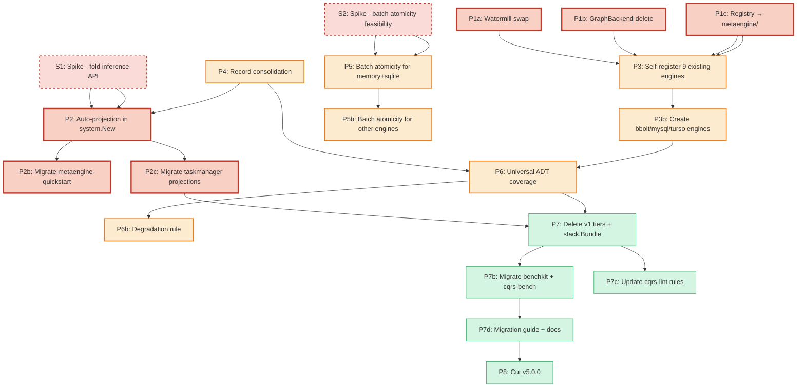

# v5 Unification — SUPERB Execution Plan

> **Date:** 2026-08-09 06:39 (revised 07:15, execution started 07:30)
> **Decision:** [ADR-0123](../adr/0123-v5-unification-single-composition-root.md)
> **Vision:** Developers declare only Commands + Events + Queries. The system infers projections, storage layout, indexes, and engine routing. Operators pick infrastructure at deployment time.

## Execution Progress (2026-08-09 07:45)

| Task                           | Status     | Notes                                                                                                                                                                                                                       |
| ------------------------------ | ---------- | --------------------------------------------------------------------------------------------------------------------------------------------------------------------------------------------------------------------------- |
| S1: Spike — fold inference API | ✅ DONE    | **Key finding:** AutoCRUDByConvention uses struct names; system pipeline needs wire event types. Solution: AutoCRUDByNamedEvents (override eventType field on generated folds). Validated end-to-end.                       |
| S2: Spike — batch atomicity    | ✅ DONE    | **Key finding:** Much simpler than estimated (~6h vs 3 days). Wrap applyWithRecord in RunInTx for SQL engines; snapshot/rollback for memory. No new interface needed.                                                       |
| T01: Watermill swap            | ✅ DONE    | simpleBus deleted (188 LOC). watermill.NewEventBus() used everywhere. Fixed handler independence (watermill stopped on first error, fixed to call all handlers). Bus registered as io.Closer.                               |
| T04a: AutoCRUDByNamedEvents    | ✅ DONE    | New exported function in metaengine/auto_named_events.go (147 LOC). NamedSample + NamedEvent types. Override eventType on generated folds.                                                                                  |
| T04b-T05: Auto-projection MVP  | ✅ DONE    | system/projection_builder.go (226 LOC). system.View[V,K](name).From(events...). Auto-generates folds + EventDecoder. Full pipeline working: command → event → projection → typed query. Backward compat with raw QueryDecl. |
| T02: GraphBackend delete       | ⏳ PENDING | 15 files, not on critical path                                                                                                                                                                                              |
| T03: Registry → metaengine/    | ⏳ PENDING |                                                                                                                                                                                                                             |
| T06-T07: Example migrations    | ⏳ PENDING |                                                                                                                                                                                                                             |

---

## What was wrong with v1 of this plan (honest self-review)

| Flaw                                                      | Fix                                                                                                                                                                                                                                                         |
| --------------------------------------------------------- | ----------------------------------------------------------------------------------------------------------------------------------------------------------------------------------------------------------------------------------------------------------- |
| Auto-projection was "a PlanRule, ~60 lines"               | **Wrong layer.** PlanRules run AFTER engine assignment and can only enrich `PlanResult` — they CANNOT generate folds (folds are on `QueryDecl` BEFORE `Plan()`). Fold inference is a **system-level** or **Query-constructor** concern, not a planner rule. |
| No consumer API mockup                                    | **Added below.** The API is the foundation, not an afterthought.                                                                                                                                                                                            |
| Batch atomicity was "90min"                               | **Wrong by 10x.** No batching/queueing concept exists. The `Transactional` interface exists but `ApplyRecord` doesn't use it. Real estimate: 3-5 days for memory + sqlite.                                                                                  |
| Universal ADT coverage was "90min"                        | **Wrong by 5x.** Each missing ADT needs DDL + write/read paths + tests (~2-4h per ADT per engine, ~15 missing ADTs total). Real estimate: 3-5 days.                                                                                                         |
| Struct-composition multi-collection was in the "20%" tier | **Fantasy-tier scope.** Detecting slice fields → auto-generating sub-collections → join at read time is ORM relationship inference. Moved to **post-v5**.                                                                                                   |
| Record consolidation was on the critical path             | **False dependency.** Watermill swap, GraphBackend delete, and fold inference don't depend on it. Removed from critical path.                                                                                                                               |
| No spike tasks                                            | **Added.** Batch atomicity and fold inference need feasibility validation before scheduling.                                                                                                                                                                |
| No v4.x bridge strategy                                   | **Added.** Ship auto-projection as opt-in in v4.x, deprecate v1 tiers, cut v5.                                                                                                                                                                              |
| cqrs-lint rules ignored                                   | **Added.** E008/E011 stack-detection rules break when stack/ is deleted.                                                                                                                                                                                    |
| samber/do ignored                                         | **Explicitly deferred.** Not v5 scope.                                                                                                                                                                                                                      |

---

## The Consumer API (this is the foundation)

### What a v5 consumer writes for a full CRUD aggregate with projections

```go
// ── Domain types (you already write these) ──────────────────

type UserCreated struct { ID UserID; Name string; Email string; CreatedAt time.Time }
type UserUpdated struct { ID UserID; Name string; Email string }
type UserDeleted struct { ID UserID }

type UserView struct { ID UserID; Name string; Email string; Active bool; CreatedAt time.Time }

type GetUserInput struct { ID UserID }
type ListUsersInput struct { Status string; metaengine.Pagination }

// ── Decider (pure domain logic, you already write this) ─────

var userDecider = decider.Decider[UserState]{
    Initial: UserState{},
    Fold:    foldUserEvents,
    Decide:  decideUser, // func(state, command) ([]event, error)
}

// ── The v5 wiring (THIS IS ALL YOU WRITE) ───────────────────

sys, _ := system.New(ctx,
    system.Domain{
        Aggregates: []system.AggregateSpec{
            system.Aggregate("User", userDecider).
                Command[CreateUser]("user.create").
                Command[UpdateUser]("user.update").
                Command[DeleteUser]("user.delete"),
        },
        Projections: []system.ProjectionSpec{
            // ONE LINE. System auto-generates folds from struct field matching.
            system.View[UserView, UserID]("users").
                From(UserCreated{}, UserUpdated{}, UserDeleted{}),

            // Counter example: auto-generates CounterIncrement fold
            system.Count[UserCountInput]("user_count").
                From(UserCreated{}, UserDeleted{}),
        },
    },
    system.Deployment{
        Engines: map[string]system.EngineConfig{
            "primary": {Driver: "sqlite", DSN: "app.db"},
        },
    },
)

// ── Use it ───────────────────────────────────────────────────

sys.Execute(ctx, "user.create", CreateUser{Name: "Alice"})
user, _ := sys.Projection[UserView, UserID](ctx, "users", userID)
users, _ := sys.ProjectionList[UserView](ctx, "users", ListUsersInput{Status: "active"})
```

### What the system generates automatically

```
system.View[UserView, UserID]("users").From(UserCreated{}, UserUpdated{}, UserDeleted{})
    ↓ system.New() internally:
    ↓
    1. Fold inference: UserCreated → insert (Created suffix), field matching
       (ID→ID, Name→Name, Email→Email, CreatedAt→CreatedAt, Active→true default)
    2. Fold inference: UserUpdated → update (Updated suffix), partial field copy
    3. Fold inference: UserDeleted → delete (Deleted suffix)
    4. ADT classification: Map (keyed lookup by UserID)
    5. metaengine.Query[GetUserInput, UserView]("users", <generated folds>)
    6. TypeDecoder auto-registration (UserCreated/Updated/Deleted)
    7. projectionadapter wiring (event types, decoder, ApplyRecord)
    8. LayoutPlan: FilterOn/SortOn from GetUserInput struct fields → SQL columns + indexes
    9. Engine routing: sqlite engine selected (cost-based, only engine available)
```

### What changes from v4 today (taskmanager example)

| Aspect                         | v4 today                                                              | v5 target                                                |
| ------------------------------ | --------------------------------------------------------------------- | -------------------------------------------------------- |
| Lines for projection setup     | ~199 LOC (11 hand-written `OnTyped` folds + 11 decoder registrations) | **~5 LOC** (3 `system.View/Count` declarations)          |
| Lines for command registration | ~60 LOC (10 nearly-identical `RegisterCommand` blocks)                | **~5 LOC** (`.Command[CreateUser]("user.create")` chain) |
| Fold code                      | Hand-written closures matching field names                            | **Zero** (auto-generated from struct field matching)     |
| Decoder registration           | Manual `Register` calls                                               | **Zero** (auto-registered from `.From(...)` types)       |
| Backend choice                 | Code-level (`stack/sqlite.New()`)                                     | **YAML** (`Driver: "sqlite"`)                            |

---

## Architecture: Where fold inference actually lives

**NOT a PlanRule.** PlanRules run AFTER engine assignment and can only enrich `PlanResult` (diagnostics, layouts). They cannot modify `QueryDecl` folds.

```
Consumer writes:
  system.View[UserView, UserID]("users").From(UserCreated{}, ...)

system.New() internally:
  1. system/projection_builder.go (NEW):
     - Receives ProjectionSpec with event type samples
     - Calls metaengine.AutoCRUDByConvention[ResultType]("ID", samples...)
       (logic ALREADY EXISTS at auto_naming.go:150)
     - Wraps generated folds in metaengine.Query[Input, Result](...)
     - Auto-registers TypeDecoder entries for each event type

  2. metaengine.Plan(engines, queries...) — normal planning
     - Cost-based routing (unchanged)
     - Layout planning from filter/sort declarations (unchanged)

  3. projectionadapter — normal event→store bridge (unchanged)
```

The **only new code** is `system/projection_builder.go` (~100-150 LOC) that translates `ProjectionSpec` → `metaengine.QueryDecl` using the existing `AutoCRUDByConvention` + `TypeDecoder.Register` functions.

---

## Execution Graph



### Critical Path (corrected)

```
S1 (spike) → P2 (auto-projection) → P2c (migrate taskmanager)
  → P7 (delete v1) → P7b (benchkit) → P7d (docs) → P8 (v5 cut)
```

Record consolidation (P4) is **NOT** on the critical path. It runs in parallel.

---

## Pareto Breakdown (revised)

### The 1% that delivers 51% (validated by spike)

| Task | What                                     | Why 51%                                                                                                                                                                         | Effort |
| ---- | ---------------------------------------- | ------------------------------------------------------------------------------------------------------------------------------------------------------------------------------- | ------ |
| S1   | **Spike: fold inference API validation** | De-risks the entire plan. Validates that `system.View[V,K](name).From(samples...)` generates working folds.                                                                     | 4h     |
| P1a  | **Watermill swap**                       | 1-line change. Both implement `event.Bus`. Makes system/ production-ready.                                                                                                      | 30min  |
| P1b  | **GraphBackend delete**                  | Already removed from 4/5 engines. Dead interface.                                                                                                                               | 2h     |
| P2   | **Auto-projection in system.New()**      | `system/projection_builder.go` (~120 LOC) calls existing `AutoCRUDByConvention` + `TypeDecoder.Register`. Consumer writes `system.View[V,K](...).From(...)` instead of 200 LOC. | 4h     |

**Total 1%: ~11 hours.** After this, system/ is the working composition root with auto-projection.

### The 4% that delivers 64%

| Task | What                                                 | Effort                                                                                          |
| ---- | ---------------------------------------------------- | ----------------------------------------------------------------------------------------------- |
| P1c  | **Registry → metaengine/**                           | 3h. Mechanical move.                                                                            |
| P3   | **Self-register 9 existing engines**                 | 4h. Each is ~10 LOC `register.go`.                                                              |
| P4   | **Record consolidation**                             | 8h. Only 3 production files use `event.Metadata` directly. Adapters exist. Can run in parallel. |
| P2b  | **Migrate metaengine-quickstart to auto-projection** | 2h. Proves the API end-to-end.                                                                  |
| S2   | **Spike: batch atomicity feasibility**               | 4h. Prototype BatchTxn on memory engine. De-risks P5.                                           |

### The 20% that delivers 80%

| Task | What                                                            | Effort       |
| ---- | --------------------------------------------------------------- | ------------ |
| P2c  | **Migrate taskmanager projections** (11 folds → 3 declarations) | 4h           |
| P3b  | **Create bbolt/mysql/turso engines**                            | 3 × 6h = 18h |
| P5   | **Batch atomicity for memory + sqlite**                         | 3 days       |
| P6   | **Universal ADT coverage** (fill ~15 gaps across 8 engines)     | 4 days       |
| P6b  | **Degradation planner rule**                                    | 4h           |

### The remaining 20% (to reach 100%)

| Task | What                                        | Effort |
| ---- | ------------------------------------------- | ------ |
| P5b  | Batch atomicity for pebble/duckdb/pg/badger | 2 days |
| P7   | Delete v1 tiers + stack.Bundle              | 4h     |
| P7b  | Migrate benchkit + cqrs-bench               | 6h     |
| P7c  | Update cqrs-lint rules (E008/E011)          | 2h     |
| P7d  | Migration guide + docs + examples           | 8h     |
| P8   | Cut v5.0.0                                  | 2h     |

**Deferred to post-v5:** struct-composition multi-collection (ORM relationship inference), command lifecycle as events (ADR-0117), samber/do, vector/search/spatial on all engines.

---

## Detailed Plan (30-100min tasks)

> Sorted by Pareto tier, then dependency order. 28 tasks.

### Spikes (validate before committing)

| #  | Task                      | Impact           | Effort | Deps | Description                                                                                                                                                                                                                                                                 |
| -- | ------------------------- | ---------------- | ------ | ---- | --------------------------------------------------------------------------------------------------------------------------------------------------------------------------------------------------------------------------------------------------------------------------- |
| S1 | Spike: fold inference API | Gates everything | 4h     | —    | Write a throwaway test: `system.View[TaskView, TaskID]("tasks").From(TaskCreated{}, TaskUpdated{}, TaskDeleted{})` → build QueryDecl internally via AutoCRUDByConvention → Plan → Apply event → read back projected data. Validate the API ergonomics and the fold quality. |
| S2 | Spike: batch atomicity    | Gates P5         | 4h     | —    | Prototype `BatchTxn` interface on memory engine: queue MapSet + CounterIncrement ops from a single ApplyRecord call, execute atomically, test rollback on simulated failure. Validate the interface design.                                                                 |

### Phase 1: Foundation quick wins (no dependencies, parallel-safe)

| #   | Task                         | Impact   | Effort | Deps | Description                                                                                                                                                                                                                    |
| --- | ---------------------------- | -------- | ------ | ---- | ------------------------------------------------------------------------------------------------------------------------------------------------------------------------------------------------------------------------------ |
| T01 | Watermill swap               | Critical | 30min  | —    | Replace `newSimpleBus()` with `watermill.NewEventBus()` in `system/driver_registry.go:152`. Add watermill dep to `system/go.mod`. Delete `system/bus.go` (simpleBus). Both implement `event.Bus`. Run system tests.            |
| T02 | Delete GraphBackend          | High     | 2h     | —    | Remove `GraphBackend` interface from `metaengine/engine.go:394`. Remove methods from memory engine. Update `adttest.RunMatrix` to route graph tests through `graphadapter`. ~15 files.                                         |
| T03 | Move registry to metaengine/ | High     | 3h     | —    | Move `RegisterDriver`, `DriverFactory`, `EngineConfig`, `lookupDriver` from `system/driver_registry.go` to new `metaengine/registry.go`. system/ calls `metaengine.LookupDriver()`. All engines already depend on metaengine/. |

### Phase 2: Auto-projection (the killer feature, gated by S1)

| #   | Task                                   | Impact   | Effort | Deps    | Description                                                                                                                                                                                                                                               |
| --- | -------------------------------------- | -------- | ------ | ------- | --------------------------------------------------------------------------------------------------------------------------------------------------------------------------------------------------------------------------------------------------------- |
| T04 | Build `system/projection_builder.go`   | Critical | 4h     | S1, T03 | New file (~120 LOC). `ProjectionSpec` → `metaengine.QueryDecl` + `TypeDecoder`. Calls `AutoCRUDByConvention[R](keyField, samples...)` (exists at `auto_naming.go:150`). Auto-registers decoder entries. Returns `([]any, *TypeDecoder)` for system.New(). |
| T05 | Wire auto-projection into system.New() | Critical | 2h     | T04     | Update `system/constructor.go:126-151`: if `DomainConfig.Projections` contains `ProjectionSpec` values (not raw `QueryDecl`), run them through `projection_builder.go` first. Seamless: explicit `QueryDecl` still works (backward compat within v4.x).   |
| T06 | Migrate metaengine-quickstart          | High     | 2h     | T05     | Rewrite `example/metaengine-quickstart/main.go` to use `system.New()` with `system.View[TaskView, TaskID]("tasks").From(...)`. Proves the API end-to-end. Compare LOC reduction (currently ~120 LOC → target ~30).                                        |
| T07 | Migrate taskmanager projections        | High     | 4h     | T05     | Rewrite `example/taskmanager/metaengine.go` (199 LOC, 11 folds) → 3 `ProjectionSpec` declarations. Rewrite `handlers.go` command registration (60 LOC) → aggregate chain. Validate all HTTP endpoints still work.                                         |

### Phase 3: Engine self-registration (gated by T03)

| #   | Task                             | Impact | Effort | Deps | Description                                                                                                                                                                                                             |
| --- | -------------------------------- | ------ | ------ | ---- | ----------------------------------------------------------------------------------------------------------------------------------------------------------------------------------------------------------------------- |
| T08 | Self-register 5 existing engines | High   | 3h     | T03  | Create `register.go` in memory, sqliteengine, pebbleengine, pgengine, duckdbengine. Each ~10 LOC. Move factory logic from system/driver_registry.go init().                                                             |
| T09 | Self-register 3 more engines     | Medium | 2h     | T03  | Create `register.go` in badgerengine, dgraphengine, irohengine.                                                                                                                                                         |
| T10 | Create bbolt metaengine module   | Medium | 6h     | T08  | New `metaengine/bboltengine/` module. Implement MapBackend, SetBackend, CounterBackend, LogBackend, StreamLogBackend, AtomicAppender. bbolt's single-writer tx = natural optimistic concurrency. Run adttest.RunMatrix. |
| T11 | Create mysql metaengine module   | Medium | 6h     | T08  | Adapt pgengine for MySQL dialect (`$1` → `?`, `ON CONFLICT` → `ON DUPLICATE KEY`, `JSONB` → `JSON`). Self-register as "mysql". Test via nix run .#integration-mysql-nspawn.                                             |
| T12 | Create turso metaengine module   | Medium | 6h     | T08  | Determine if sqliteengine works with libSQL directly. If yes: thin adapter with sync API. If no: new module. Self-register as "turso".                                                                                  |

### Phase 4: Record consolidation (parallel track, no blockers)

| #   | Task                                      | Impact | Effort | Deps | Description                                                                                                                                                                                |
| --- | ----------------------------------------- | ------ | ------ | ---- | ------------------------------------------------------------------------------------------------------------------------------------------------------------------------------------------ |
| T13 | Extend record.CommonMetadata              | High   | 2h     | —    | Map field differences: event.Metadata has Tombstone, Causation, Source, IPAddress, UserAgent not in CommonMetadata. Either extend CommonMetadata or decide these move to domain-specific.  |
| T14 | Consolidate production files              | High   | 3h     | T13  | Update `watermill/protocol.go`, `storage/pebble/serialization.go`, `storage/bbolt/serialization.go` to use record.CommonMetadata. Update event/asrecord.go + command/asrecord.go adapters. |
| T15 | Update test files + make OnRecord default | Medium | 3h     | T14  | Update ~10 test files. Mark payload-only `On()` as deprecated. Update internal callers to `OnRecord`.                                                                                      |

### Phase 5: Batch atomicity (gated by S2)

| #   | Task                              | Impact   | Effort | Deps     | Description                                                                                                                                                                                        |
| --- | --------------------------------- | -------- | ------ | -------- | -------------------------------------------------------------------------------------------------------------------------------------------------------------------------------------------------- |
| T16 | Design BatchTxn interface         | Critical | 2h     | S2       | New optional engine interface. Design based on spike findings. Must support: queue ops from multiple collections, execute atomically, rollback on failure, fallback for non-batch engines.         |
| T17 | Implement batch for memory engine | Critical | 4h     | T16      | Queue fold operations as closures, execute all in one step, rollback = skip remaining.                                                                                                             |
| T18 | Implement batch for sqlite engine | Critical | 4h     | T16      | Wrap ApplyRecord's fold loop in `BEGIN TRANSACTION ... COMMIT`. sqliteengine already has `Transactional.RunInTx` (`transaction.go:71`).                                                            |
| T19 | Refactor ApplyRecord to use batch | Critical | 4h     | T17, T18 | Change `store.applyWithRecord` to: (1) detect if engine implements BatchTxn, (2) if yes: queue all folds → execute batch, (3) if no: fallback to current immediate execution. Backward compatible. |
| T20 | Batch for pebble/duckdb/pg        | Medium   | 6h     | T19      | Pebble: use `*pebble.Batch` (already used internally). DuckDB/PG: SQL transactions.                                                                                                                |

### Phase 6: Universal ADT coverage + degradation

| #   | Task                                      | Impact | Effort | Deps    | Description                                                                                                                                                            |
| --- | ----------------------------------------- | ------ | ------ | ------- | ---------------------------------------------------------------------------------------------------------------------------------------------------------------------- |
| T21 | Fill duckdb ADT gaps (Set, Multimap, Log) | High   | 6h     | T08     | Each needs DDL + write/read/test. ~2h per ADT. SQL tables same pattern as sqliteengine.                                                                                |
| T22 | Fill pg ADT gaps (Set, Multimap, Log)     | High   | 6h     | T08     | Same as T21, Postgres dialect.                                                                                                                                         |
| T23 | Fill dgraph ADT gaps (StreamLog)          | Medium | 4h     | T09     | Append-ordered nodes with seq predicate.                                                                                                                               |
| T24 | Degraded graph fallback for SQL engines   | Medium | 6h     | T02     | Recursive CTE wrapper for SQLite (`WITH RECURSIVE`) and Postgres. Not a GraphBackend — a ScanBackend variant that handles traversal queries.                           |
| T25 | Capability-degradation rule               | High   | 3h     | T21-T24 | New PlanRule (`rule_degradation.go`): emits WARN when ADT is routed to engine with degraded complexity. Shows cost estimate. Integrates into ExplainPlan() + Doctor(). |

### Phase 7: Deletion + migration

| #   | Task                                      | Impact | Effort | Deps          | Description                                                                                                                                                                                                  |
| --- | ----------------------------------------- | ------ | ------ | ------------- | ------------------------------------------------------------------------------------------------------------------------------------------------------------------------------------------------------------ |
| T26 | Delete stack.Bundle + v1 tiers + presets  | Medium | 4h     | T07, T19, T25 | Delete `stack/` (bundle, accessors, options, materialize, run_projections, 8 presets, bench, contracttest, sqlopt). Delete `storage/relational/`, `storage/view/`. Delete `graph/projection.go`. ~60+ files. |
| T27 | Migrate benchkit + cqrs-bench + cqrs-lint | High   | 6h     | T26           | benchkit/runner.go: replace `*stack.Bundle` with `*system.System`. cmd/cqrs-bench/factory.go: convert factories. cmd/cqrs-lint E008/E011: update to detect system/ instead of stack/.                        |
| T28 | Migration guide + docs + examples         | High   | 8h     | T27           | `docs/migration/V4_TO_V5.md` with before/after for each tier. Update README, SKILL.md, AGENTS.md. Update 4 examples. Run doc-check.                                                                          |

### Phase 8: v5 cut

| #   | Task       | Impact   | Effort | Deps | Description                                                |
| --- | ---------- | -------- | ------ | ---- | ---------------------------------------------------------- |
| T29 | Cut v5.0.0 | Critical | 2h     | T28  | CHANGELOG. `nix run .#verify`. Tag all modules. Push tags. |

**Total realistic effort: ~16 working days (~3 weeks)**

---

## v4.x Bridge Strategy

The plan does NOT strand v4 consumers. Phases ship incrementally:

| Release   | What ships                                                         | What's deprecated                            | What's deleted                                                                                    |
| --------- | ------------------------------------------------------------------ | -------------------------------------------- | ------------------------------------------------------------------------------------------------- |
| **v4.7**  | T01-T03: watermill bus, GraphBackend gone, registry in metaengine/ | —                                            | simpleBus                                                                                         |
| **v4.8**  | T04-T07: auto-projection in system.New(), taskmanager migrated     | `On()` constructor (deprecated, not removed) | —                                                                                                 |
| **v4.9**  | T08-T12: all 9 engines self-register, 3 new engine modules         | —                                            | —                                                                                                 |
| **v4.10** | T13-T20: Record consolidation, batch atomicity                     | v1 tiers (deprecated)                        | `On()` constructor                                                                                |
| **v5.0**  | T21-T29: universal coverage, degradation rule, v1 deletion, docs   | —                                            | stack.Bundle, v1 tiers, presets, Materialize, RelationalProjection, SQLViewStore, GraphProjection |

Consumers can try auto-projection in v4.8 while stack.Bundle still works. They have 2 minor releases to migrate before v5.

---

## Fine Plan (max 12min tasks)

> 122 tasks. Each is one focused action.

### S1: Spike — Fold Inference API Validation (4h → 5 tasks)

| #    | Task                                                                                                                                                                | Time  |
| ---- | ------------------------------------------------------------------------------------------------------------------------------------------------------------------- | ----- |
| F001 | Read `auto_naming.go:150` (AutoCRUDByConvention) + `auto_fold.go:80-135` (AutoInsert/Update/Delete). Understand the exact contract: what it needs, what it returns. | 10min |
| F002 | Write throwaway test in `system/`: create `ProjectionSpec{ResultType: TaskView, KeyField: "ID", Events: []any{TaskCreated{}, TaskUpdated{}, TaskDeleted{}}}`        | 12min |
| F003 | Implement minimal `buildProjection(spec)` that calls `AutoCRUDByConvention[TaskView]("ID", samples...)` and wraps result in `Query[TaskQuery, TaskView]`            | 12min |
| F004 | Test end-to-end: Plan with memory engine → ApplyRecord(TaskCreated{}) → ExecuteTyped → verify TaskView projected correctly                                          | 12min |
| F005 | Document findings: what works, what's missing, what API changes needed. Delete throwaway test. Write the real ProjectionSpec type based on findings.                | 10min |

### S2: Spike — Batch Atomicity Feasibility (4h → 5 tasks)

| #    | Task                                                                                                                                        | Time  |
| ---- | ------------------------------------------------------------------------------------------------------------------------------------------- | ----- |
| F006 | Read `store.go:267-311` (applyWithRecord) + `store.go:360-418` (applyFold type switch). Map the execution path.                             | 10min |
| F007 | Read `metaengine/transaction.go:7-9` (Transactional interface) + `sqliteengine/transaction.go:71`. Understand existing tx seam.             | 10min |
| F008 | Prototype: add `BatchTxn` interface to memory engine. Queue closures in a slice. Execute all. On error, return without executing remaining. | 12min |
| F009 | Test: event triggers 3 collection folds → simulate fold #2 failure → verify fold #1 is NOT persisted (rollback)                             | 12min |
| F010 | Document: is BatchTxn viable? What's the interface? Can ApplyRecord detect it? Delete prototype. Write the real interface spec.             | 10min |

### T01: Watermill Swap (30min → 4 tasks)

| #    | Task                                                                                                    | Time  |
| ---- | ------------------------------------------------------------------------------------------------------- | ----- |
| F011 | Read `system/bus.go` (simpleBus) + `system/driver_registry.go:152` (gochannel registration)             | 5min  |
| F012 | Add watermill dep: `cd system && GOWORK=off go get github.com/larsartmann/go-cqrs-lite/watermill/v4`    | 5min  |
| F013 | Replace `newSimpleBus()` with `watermill.NewEventBus()` in driver registration. Delete `system/bus.go`. | 5min  |
| F014 | Run system tests. Fix failures.                                                                         | 12min |

### T02: Delete GraphBackend (2h → 6 tasks)

| #    | Task                                                                                   | Time  |
| ---- | -------------------------------------------------------------------------------------- | ----- |
| F015 | Grep `GraphBackend` across all .go files. List all references.                         | 5min  |
| F016 | Remove GraphBackend interface + methods from `metaengine/engine.go` (~L394)            | 10min |
| F017 | Remove GraphBackend from memory engine assertions + implementations                    | 12min |
| F018 | Check if any other engine claims GraphBackend. Remove dead assertions.                 | 8min  |
| F019 | Update adttest.RunMatrix: remove direct GraphBackend tests, route through graphadapter | 12min |
| F020 | Run full engine matrix tests. Fix failures.                                            | 12min |

### T03: Move Registry to metaengine/ (3h → 5 tasks)

| #    | Task                                                                                                                                      | Time  |
| ---- | ----------------------------------------------------------------------------------------------------------------------------------------- | ----- |
| F021 | Create `metaengine/registry.go`: copy RegisterDriver, DriverFactory, EngineConfig, lookupDriver, driverMu, drivers map                    | 12min |
| F022 | Create `metaengine/bus_registry.go`: copy RegisterBusDriver, BusDriverFactory, lookupBusDriver                                            | 10min |
| F023 | Update `system/driver_registry.go`: replace local registry with `metaengine.LookupDriver()`. Keep system-specific createEngineFromDriver. | 12min |
| F024 | Run metaengine tests + system tests. Fix import cycles.                                                                                   | 12min |
| F025 | Regen api-stability golden.                                                                                                               | 8min  |

### T04: Build projection_builder.go (4h → 8 tasks)

| #    | Task                                                                                                                                                        | Time  |
| ---- | ----------------------------------------------------------------------------------------------------------------------------------------------------------- | ----- |
| F026 | Define `ProjectionSpec` type in `system/config_types.go`: Name, ResultType (reflect.Type), KeyField, Events []any, Options (filter/sort/index declarations) | 12min |
| F027 | Define `system.View[R, K](name)` and `system.Count[I](name)` builder constructors returning ProjectionSpec                                                  | 10min |
| F028 | Add `.From(samples...)` method on the builder that stores event type samples                                                                                | 5min  |
| F029 | Write `buildProjection(spec) → (metaengine.QueryDecl, []TypeDecoderEntry, error)` in `system/projection_builder.go`: calls AutoCRUDByConvention internally  | 12min |
| F030 | Handle the `[]any` fold-args conversion wart: builder returns QueryDecl directly, no manual wrapping                                                        | 8min  |
| F031 | Auto-generate TypeDecoder entries: for each sample type, register with `event.DecodePayloadAuto[T]`                                                         | 10min |
| F032 | Write unit test: `View[TaskView, TaskID]("tasks").From(TaskCreated{}, TaskUpdated{}, TaskDeleted{})` → verify QueryDecl has 3 folds (insert/update/remove)  | 12min |
| F033 | Write unit test: verify TypeDecoder entries match the sample types                                                                                          | 10min |

### T05: Wire into system.New() (2h → 4 tasks)

| #    | Task                                                                                                                           | Time  |
| ---- | ------------------------------------------------------------------------------------------------------------------------------ | ----- |
| F034 | Update `system/constructor.go:126-151`: detect ProjectionSpec vs raw QueryDecl. If ProjectionSpec: call buildProjection first. | 10min |
| F035 | Pass generated QueryDecls + TypeDecoder to the existing metaengine.Plan + projectionadapter path                               | 10min |
| F036 | Integration test: system.New() with ProjectionSpec → Execute command → MetaEngine().ExecuteTyped → verify projected data       | 12min |
| F037 | Backward compat test: system.New() with raw metaengine.QueryDecl still works (no ProjectionSpec)                               | 8min  |

### T06: Migrate metaengine-quickstart (2h → 3 tasks)

| #    | Task                                                                                                                          | Time  |
| ---- | ----------------------------------------------------------------------------------------------------------------------------- | ----- |
| F038 | Rewrite `example/metaengine-quickstart/main.go` to use `system.New()` with `system.View[TaskView, TaskID]("tasks").From(...)` | 12min |
| F039 | Delete the manual fold closures + decoder switch. Compare LOC.                                                                | 10min |
| F040 | Run quickstart. Verify it works end-to-end.                                                                                   | 10min |

### T07: Migrate taskmanager (4h → 6 tasks)

| #    | Task                                                                                                                            | Time  |
| ---- | ------------------------------------------------------------------------------------------------------------------------------- | ----- |
| F041 | Rewrite `example/taskmanager/metaengine.go` (199 LOC, 11 folds) → 3 ProjectionSpec declarations                                 | 12min |
| F042 | Rewrite `example/taskmanager/handlers.go` command registration (60 LOC) → aggregate chain `.Command[CreateUser]("user.create")` | 12min |
| F043 | Delete the TypeDecoder manual registration (11 Register calls)                                                                  | 5min  |
| F044 | Run taskmanager. Test all HTTP endpoints.                                                                                       | 12min |
| F045 | Update setup.go to remove any manual projection wiring                                                                          | 10min |
| F046 | Measure LOC reduction. Document as migration-guide example.                                                                     | 8min  |

### T08-T09: Self-register engines (5h → 7 tasks)

| #    | Task                                                                                                          | Time  |
| ---- | ------------------------------------------------------------------------------------------------------------- | ----- |
| F047 | Create `metaengine/memory_engine_register.go` with `func init() { metaengine.RegisterDriver("memory", ...) }` | 5min  |
| F048 | Create `sqliteengine/register.go`. Move factory logic from system/driver_registry.go:121-149                  | 10min |
| F049 | Create `pebbleengine/register.go` + `pgengine/register.go`                                                    | 10min |
| F050 | Create `duckdbengine/register.go`                                                                             | 8min  |
| F051 | Create `badgerengine/register.go` + `dgraphengine/register.go` + `irohengine/register.go`                     | 12min |
| F052 | Remove init() registrations from system/driver_registry.go. Add blank imports in system tests.                | 10min |
| F053 | Run all engine tests with self-registration. Fix failures.                                                    | 12min |

### T10-T12: Create bbolt/mysql/turso engines (18h → 15 tasks)

| #    | Task                                                                                             | Time  |
| ---- | ------------------------------------------------------------------------------------------------ | ----- |
| F054 | bbolt: Create `metaengine/bboltengine/` with go.mod. Implement Engine interface + EngineProfile. | 12min |
| F055 | bbolt: Implement MapBackend (bucket-per-collection, key-value within bucket)                     | 12min |
| F056 | bbolt: Implement SetBackend + CounterBackend (separate buckets)                                  | 12min |
| F057 | bbolt: Implement LogBackend + StreamLogBackend + AtomicAppender (single-writer tx)               | 12min |
| F058 | bbolt: Create register.go. Run adttest.RunMatrix + enginetest.RunMatrix.                         | 12min |
| F059 | mysql: Study pgengine. Identify dialect differences (placeholder, DDL, UPSERT syntax).           | 10min |
| F060 | mysql: Create `metaengine/mysqlengine/` with go.mod. Copy pgengine, adapt dialect.               | 12min |
| F061 | mysql: Implement MapBackend + CounterBackend with MySQL syntax                                   | 12min |
| F062 | mysql: Implement ScanBackend + StreamLogBackend + AtomicAppender                                 | 12min |
| F063 | mysql: Create register.go. Test via `nix run .#integration-mysql-nspawn`.                        | 12min |
| F064 | turso: Test if sqliteengine works with libSQL DSN directly.                                      | 10min |
| F065 | turso: If yes: create thin adapter module with sync API. If no: create new module.               | 12min |
| F066 | turso: Implement sync support (Push/Pull lifecycle)                                              | 12min |
| F067 | turso: Create register.go. Run adttest.RunMatrix.                                                | 10min |
| F068 | turso: Test basic CRUD + StreamLog operations.                                                   | 10min |

### T13-T15: Record consolidation (8h → 8 tasks)

| #    | Task                                                                                                                                         | Time  |
| ---- | -------------------------------------------------------------------------------------------------------------------------------------------- | ----- |
| F069 | Map ALL fields in event.Metadata (11) vs record.CommonMetadata (7). Document the 4-field gap.                                                | 10min |
| F070 | Decide: extend CommonMetadata with Tombstone/Causation/Source/IPAddress/UserAgent? Or domain-specific? Write decision in ADR-0123 amendment. | 12min |
| F071 | Implement the decision (extend or move). Update record/record.go.                                                                            | 12min |
| F072 | Update event/asrecord.go AsRecord() + command/asrecord.go to map all fields.                                                                 | 12min |
| F073 | Update 3 production files (watermill/protocol.go, pebble/serialization.go, bbolt/serialization.go).                                          | 12min |
| F074 | Update ~10 test files that reference event.Metadata.                                                                                         | 12min |
| F075 | Mark On() as deprecated. Update internal callers to OnRecord.                                                                                | 12min |
| F076 | Run per-module tests for event/, command/, metadata/, record/. Fix failures.                                                                 | 10min |

### T16-T20: Batch atomicity (3+2 days → 16 tasks)

| #    | Task                                                                                                                                 | Time  |
| ---- | ------------------------------------------------------------------------------------------------------------------------------------ | ----- |
| F077 | Define `BatchTxn` interface in metaengine/: `BeginBatch(ctx) → Batch; Batch.Set/Add/Increment/Delete/Append; Batch.Commit() → error` | 12min |
| F078 | Refactor `applyFold` to return a `FoldOp` closure instead of executing immediately                                                   | 12min |
| F079 | Refactor `applyWithRecord`: collect all FoldOps across matching queries into `[]FoldOp`                                              | 12min |
| F080 | If engine implements BatchTxn: convert FoldOps to Batch operations, execute atomically                                               | 12min |
| F081 | If engine does NOT implement BatchTxn: fallback to immediate execution (backward compat)                                             | 10min |
| F082 | Implement BatchTxn on memory engine: slice of closures, execute all, first error stops                                               | 12min |
| F083 | Implement BatchTxn on sqlite engine: wrap in BEGIN TRANSACTION ... COMMIT                                                            | 12min |
| F084 | Test: 3 collections, fold #2 fails, verify fold #1 rolled back (memory)                                                              | 12min |
| F085 | Test: 3 collections, fold #2 fails, verify fold #1 rolled back (sqlite)                                                              | 12min |
| F086 | Test: non-BatchTxn engine falls back to immediate execution                                                                          | 10min |
| F087 | Implement BatchTxn on pebble engine: use existing *pebble.Batch API                                                                  | 12min |
| F088 | Implement BatchTxn on duckdb engine: SQL transaction                                                                                 | 12min |
| F089 | Implement BatchTxn on pg engine: SQL transaction                                                                                     | 12min |
| F090 | Test batch on pebble, duckdb, pg. Verify rollback works.                                                                             | 12min |
| F091 | Run adttest.RunMatrix with batch enabled. Verify no regressions.                                                                     | 12min |
| F092 | Benchmark: batch vs immediate execution. Document performance impact.                                                                | 10min |

### T21-T25: Universal ADT coverage + degradation (4 days → 16 tasks)

| #    | Task                                                                                                                             | Time  |
| ---- | -------------------------------------------------------------------------------------------------------------------------------- | ----- |
| F093 | duckdb: Implement SetBackend (CREATE TABLE meta_set, INSERT/DELETE)                                                              | 12min |
| F094 | duckdb: Implement MultimapBackend (same pattern as sqliteengine)                                                                 | 12min |
| F095 | duckdb: Implement LogBackend (autoincrement + collection column)                                                                 | 12min |
| F096 | pg: Implement SetBackend + MultimapBackend + LogBackend (same SQL pattern)                                                       | 12min |
| F097 | dgraph: Implement StreamLogBackend (append-ordered nodes with seq predicate)                                                     | 12min |
| F098 | sqlite: Implement degraded graph traversal via recursive CTE (WITH RECURSIVE)                                                    | 12min |
| F099 | pg: Implement degraded graph traversal via WITH RECURSIVE                                                                        | 12min |
| F100 | Update EngineProfile for each engine: mark new ADTs with appropriate Complexity                                                  | 10min |
| F101 | Run adttest.RunMatrix across ALL engines. Fix failures.                                                                          | 12min |
| F102 | Write `rule_degradation.go`: for each query, check ADT complexity on assigned engine. If degraded: emit WARN with cost estimate. | 12min |
| F103 | Register degradationRule in NewRulePipeline (after engine assignment)                                                            | 5min  |
| F104 | Test: route graph query to SQLite → verify WARN. Route to graphadapter → no warning.                                             | 12min |
| F105 | Test: ExplainPlan() shows degradation warning with cost delta.                                                                   | 10min |
| F106 | Test: Doctor() lists degraded ADTs per engine.                                                                                   | 10min |
| F107 | Update SerializablePlan to include degradation warnings.                                                                         | 10min |
| F108 | Document: create `docs/METAENGINE_DEGRADATION.md` explaining the degraded-vs-native model.                                       | 12min |

### T26-T29: Deletion + migration + v5 cut (16h → 14 tasks)

| #    | Task                                                                                                                                                                                                           | Time  |
| ---- | -------------------------------------------------------------------------------------------------------------------------------------------------------------------------------------------------------------- | ----- |
| F109 | Delete `stack/` package files: bundle.go, accessors.go, options.go, capabilities.go, closers.go, debug.go, durability.go, errors.go, health.go, materialize.go, run_projections.go, shutdown.go, metaengine.go | 12min |
| F110 | Delete 8 preset directories: stack/memory/, stack/sqlite/, stack/pebble/, stack/bbolt/, stack/duckdb/, stack/postgres/, stack/mysql/, stack/turso/                                                             | 10min |
| F111 | Delete stack/bench/, stack/contracttest/, stack/sqlopt/                                                                                                                                                        | 8min  |
| F112 | Delete storage/relational/ + storage/view/ + graph/projection.go + graph/sink.go                                                                                                                               | 12min |
| F113 | Run `go build ./...`. Fix cascading import errors. Update go.work.                                                                                                                                             | 12min |
| F114 | Migrate benchkit/runner.go: replace `*stack.Bundle` field with `*system.System`                                                                                                                                | 12min |
| F115 | Migrate cmd/cqrs-bench/factory.go: convert factory return types to system configs                                                                                                                              | 12min |
| F116 | Update cmd/cqrs-lint E008/E011 rules: detect system/ instead of stack/                                                                                                                                         | 12min |
| F117 | Write `docs/migration/V4_TO_V5.md`: before/after for stack→system, Materialize→auto-projection, RelationalProjection→multi-collection, simpleBus→watermill                                                     | 12min |
| F118 | Update README, SKILL.md, AGENTS.md, 4 examples. Run doc-check.                                                                                                                                                 | 12min |
| F119 | Update CHANGELOG with v5.0.0 section                                                                                                                                                                           | 10min |
| F120 | Run full verify gate: `nix run .#verify`. Fix any failures.                                                                                                                                                    | 12min |
| F121 | Tag all modules: `bash scripts/tag-release.sh v5.0.0`                                                                                                                                                          | 8min  |
| F122 | Push tags. Verify `git tag -l '*/v5*'`                                                                                                                                                                         | 5min  |

---

## Summary Statistics (revised)

| Metric                              | v1 plan          | SUPERB plan                                                  |
| ----------------------------------- | ---------------- | ------------------------------------------------------------ |
| Medium tasks                        | 26               | 29 (added 2 spikes, 1 split, removed fantasy)                |
| Fine tasks                          | 126              | 122                                                          |
| Total effort estimate               | ~21h (WRONG)     | **~16 working days (~3 weeks)**                              |
| Spike tasks                         | 0                | **2** (de-risk the hard stuff)                               |
| Consumer API mockup                 | None             | **Yes** (concrete code)                                      |
| v4.x bridge                         | None             | **4 incremental releases**                                   |
| Critical path                       | 11 tasks (wrong) | **S1→T04→T05→T07→T26→T27→T28→T29** (8 tasks)                 |
| Parallel tracks                     | 4                | **5** (auto-projection, foundation, record, batch, coverage) |
| Struct-composition multi-collection | In critical path | **Deferred to post-v5**                                      |

---

## Risk Register (revised)

| Risk                                                      | Probability | Impact | Mitigation                                                                                                         |
| --------------------------------------------------------- | ----------- | ------ | ------------------------------------------------------------------------------------------------------------------ |
| Auto-projection fold quality insufficient for real events | Medium      | High   | S1 spike validates before committing. Override API (T15) as escape valve. Start with conservative conventions.     |
| Batch atomicity interface design wrong                    | Medium      | High   | S2 spike validates on memory engine first. Fallback path (non-BatchTxn) ensures backward compat.                   |
| Engine ADT coverage gaps larger than estimated            | Medium      | Medium | F093-F101 fill gaps incrementally. Prioritize core 4 engines (memory, sqlite, pebble, pg) for v5.                  |
| stack.Bundle deletion breaks benchkit deeply              | Low         | Medium | T27 is on critical path but isolated. Can defer benchkit to v5.1 if needed.                                        |
| Record consolidation field gap contentious                | Low         | Low    | T13/T14 are parallel track, not blocking. Can ship v5 without full consolidation.                                  |
| Consumer API ergonomics wrong                             | Medium      | High   | S1 spike + T06 (migrate quickstart) validates API before committing. Taskmanager migration (T07) is the real test. |

---

## Deferred to Post-v5

| Item                                                                       | Why deferred                                                                         |
| -------------------------------------------------------------------------- | ------------------------------------------------------------------------------------ |
| Struct-composition multi-collection (`[]Attachment` → auto sub-collection) | Research-grade. ORM relationship inference. Weeks of work.                           |
| Command lifecycle as events (ADR-0117)                                     | Large scope, changes operational model. Not needed for v5 vision.                    |
| samber/do integration                                                      | Explicitly deferred. system/ lifecycle works without it.                             |
| Vector/Search/Spatial on all engines                                       | Currently memory-only. Low consumer demand.                                          |
| Planner-time index recommendation                                          | Materialize-vs-replay is advisory only. True replay-on-read executor is future work. |
| Materialize-vs-replay execution path                                       | Advisory diagnostic today. Executor branch is future work.                           |
