# Pareto Execution Plan — go-cqrs-lite v4.7.0 Release + v5 Unification Pathway

> **Generated:** 2026-08-09 13:49
> **Scope:** All 47 items from TODO_LIST.md + 5 session-fix items from the 2026-08-09 session report
> **Total items:** 52 (37 TODO_LIST open + 1 blocked + 5 session fixes + 9 identified improvements)

---

## Step 1: Pareto Breakdown — The 80/20 Analysis

### The 1% that delivers 51% of the result

These are the make-or-break items. The entire product vision ("developers declare ONLY Commands + Events + Queries") hinges on exactly two things:

| # | Task | Why it's the 1% |
|---|------|-----------------|
| 1 | 🔥🔥 **Planner-time fold inference (v5 Phase 6)** | THE killer feature. Auto-generates projections from struct shapes. Without this, v5 is just a refactor, not a revolution. |
| 2 | 🔥 **Record consolidation (v5 Phase 1)** | Gates every subsequent v5 phase. Record must be the single structural base before anything else can be built on it. |

**If we only do these two things, the project transforms from "library" to "platform."**

### The 4% that delivers 64% of the result

The above PLUS the infrastructure that makes the killer feature possible:

| # | Task | Why it's in the 4% |
|---|------|---------------------|
| 3 | 🔥 **Move driver registry to metaengine/** | Self-registration infrastructure. Gates Phase 4 (all 8 drivers). Without this, drivers are trapped in system/. |
| 4 | 🔥 **Port all 8 drivers to self-registration** | Makes metaengine the deployment-time switch point. Operators pick infrastructure, not developers. |
| 5 | 🔥 **Make OnRecord the default fold constructor** | The API contract that fold inference builds on. Must be in place before auto-projection. |
| 6 | 🔥 **Cut CHANGELOG [Unreleased] → [v4.7.0]** | 4800 lines of unreleased work. Can't ship v5 without closing v4.7 first. |

### The 20% that delivers 80% of the result

The above PLUS the cleanup/maintenance that makes the codebase trustworthy:

| # | Task | Why it's in the 20% |
|---|------|---------------------|
| 7 | Delete metaengine.GraphBackend (dead code, ADR-0113) | Blocks clean auto-projection routing |
| 8 | Replace simpleBus with watermill.EventBus | Eliminates dual bus paths |
| 9 | Delete stack presets (Phase 8) | system.System becomes the only composition root |
| 10 | Add 6 removed items to CHANGELOG (session fix) | Data loss from last session — must fix immediately |
| 11 | Wire check-depguard into CI + #verify | Without enforcement, the check doesn't exist |
| 12 | Narrow .golangci.yml staticcheck exclusion for system/ | Correctness linter disabled with zero violations — unacceptable |
| 13 | Finish pebbleengine boilerplate refactoring | 16 files half-migrated — worse than not starting |
| 14 | Multi-collection batch atomicity | Transactional correctness for auto-projection |
| 15 | Capability-degradation planner rule | Graceful degradation is core invariant #2 |

### The remaining 80% (to get to 100%)

Everything else — integration tests, system package cleanup, migration docs, calibration benchmarks, consumer feedback items, and detailed v5 Phase 6-8 sub-items.

---

## Step 2: Comprehensive Plan — Medium Granularity (30-100 min tasks)

**27 tasks, sorted by importance/impact/effort/customer-value.**

| # | Task | Impact | Effort | Est. | Depends On | Gate |
|---|------|--------|--------|------|------------|------|
| **M01** | Add 6 removed DONE items to CHANGELOG `[Unreleased]` | CRITICAL | S | 15min | — | Session fix |
| **M02** | Wire `check-depguard.sh` into `#verify` gate + CI workflow | CRITICAL | S | 30min | — | Session fix |
| **M03** | Finish pebbleengine boilerplate refactoring (16 remaining files) | HIGH | M | 90min | — | Session fix |
| **M04** | Remove `staticcheck` from `system/` exclusion in `.golangci.yml` | HIGH | S | 30min | — | Verified safe |
| **M05** | Update AGENTS.md with `cqrs_journal_idx` bucket documentation | MEDIUM | S | 15min | — | Session fix |
| **M06** | Add benchmark for bbolt ReadStreamFrom (before/after Seek) | MEDIUM | S | 30min | — | Session fix |
| **M07** | Cut CHANGELOG `[Unreleased]` → `[v4.7.0]` + tag changed modules | CRITICAL | M | 60min | M01 | Release gate |
| **M08** | Audit + narrow `.golangci.yml` for `cmd/cqrs-lint/` (17 linters) | MEDIUM | M | 60min | — | Quality |
| **M09** | Audit + narrow `.golangci.yml` for `metaengine/` (21 linters) | MEDIUM | M | 60min | — | Quality |
| **M10** | Extract bbolt/pebble backup lifecycle test suite (shared module) | MEDIUM | M | 90min | — | Dedup |
| **M11** | 🔥 v5 Phase 1: Record consolidation (ADR-0111 Phases 3-4) | CRITICAL | L | 100min | — | v5 gate |
| **M12** | v5 Phase 2: Delete `metaengine.GraphBackend` (ADR-0113) | HIGH | M | 60min | M11 | v5 chain |
| **M13** | v5 Phase 2: Replace `simpleBus` with `watermill.EventBus` | HIGH | M | 60min | — | v5 chain |
| **M14** | 🔥 v5 Phase 3: Move driver registry to `metaengine/registry.go` | CRITICAL | M | 90min | M11 | v5 gate |
| **M15** | v5 Phase 3: Convert memory + sqlite to self-registration | HIGH | S | 30min | M14 | v5 chain |
| **M16** | 🔥 v5 Phase 4: Port pebble + badger + dgraph drivers | HIGH | M | 90min | M14, M15 | v5 chain |
| **M17** | v5 Phase 4: Port postgres + duckdb + mysql + turso + bbolt drivers | HIGH | M | 100min | M14, M15 | v5 chain |
| **M18** | 🔥 v5 Phase 5: Make `OnRecord` the default fold constructor | HIGH | M | 60min | M11 | v5 gate |
| **M19** | 🔥 v5 Phase 7: Multi-collection batch atomicity | HIGH | L | 100min | M14 | v5 chain |
| **M20** | v5 Phase 7: Capability-degradation planner rule | HIGH | M | 60min | M14 | v5 chain |
| **M21** | v5 Phase 8: Delete `stack.Materialize` + `graph.GraphProjection` + `stack.RunProjections` | MEDIUM | S | 30min | M18, M19 | v5 cleanup |
| **M22** | v5 Phase 8: Delete `stack.Bundle` + all 8 presets + `storage.RelationalProjection` | MEDIUM | M | 90min | M18, M19 | v5 cleanup |
| **M23** | Write v5 migration guide (before/after for each v1 tier) | HIGH | L | 100min | M11-M22 | v5 release |
| **M24** | Write actual Redis/NATS/Dgraph Go integration tests | MEDIUM | M | 90min | — | Test coverage |
| **M25** | System package: per-test PG isolation + TestMain consolidation | LOW | M | 60min | — | Test hygiene |
| **M26** | 🔥🔥 v5 Phase 6: Planner-time fold inference (ADR-0116 Layer 1) | REVOLUTIONARY | XL | 100min+ | M11, M14, M18 | **The killer feature** |
| **M27** | Cut v5.0.0 (tag all modules, update docs, full verify) | CRITICAL | M | 60min | All v5 | Release |

**Total estimated effort:** ~27 hours of focused work

---

## Step 3: Detailed Breakdown — Fine Granularity (max 12 min each)

**150 sub-tasks, sorted by execution order within each medium task.**

### M01: Add 6 removed DONE items to CHANGELOG (15min → 2 sub-tasks)

| Sub# | Sub-task | Est |
|------|----------|-----|
| F001 | Read CHANGELOG `[Unreleased]` section to find insertion point | 2min |
| F002 | Write 6 entries (B029 heuristic, D018 type info, FP reclassify, engine boilerplate, gci/goimports, dgraph PID reaper) into CHANGELOG | 10min |

### M02: Wire check-depguard into verify + CI (30min → 3 sub-tasks)

| Sub# | Sub-task | Est |
|------|----------|-----|
| F003 | Add `check-depguard` to `#verify` script block in flake.nix (after check-arch) | 5min |
| F004 | Add `check-depguard` step to `.github/workflows/ci.yml` | 10min |
| F005 | Test: `nix run .#check-depguard` passes from clean checkout | 5min |

### M03: Finish pebbleengine refactoring (90min → 16 sub-tasks)

| Sub# | Sub-task | Est |
|------|----------|-----|
| F006 | Refactor `adt_matrix_test.go` — use `newPebbleEngineOrSkip(t)` in factory | 5min |
| F007 | Refactor `calibration_bench_test.go` — 4 sites → `mustNewPebbleEngine(b)` | 8min |
| F008 | Refactor `disk_backed_test.go` — 5 sites | 8min |
| F009 | Refactor `edge_cases_test.go` — 4 sites | 6min |
| F010 | Refactor `fuzz_test.go` — 1 site | 3min |
| F011 | Refactor `layout_planner_bench_test.go` — 3 sites | 5min |
| F012 | Refactor `layout_planner_test.go` — 17 sites (largest file) | 12min |
| F013 | Refactor `persistence_test.go` — 3 sites | 5min |
| F014 | Refactor `raw_reader_bench_test.go` — 1 site | 3min |
| F015 | Refactor `raw_reader_test.go` — 7 sites | 10min |
| F016 | Refactor `restart_safety_test.go` — 7 sites | 10min |
| F017 | Refactor `scan_bench_test.go` — 4 sites | 6min |
| F018 | Refactor `scan_count_test.go` — 2 sites | 4min |
| F019 | Refactor `stream_log_test.go` — 4 sites | 6min |
| F020 | Refactor `stream_scan_test.go` — 3 sites | 5min |
| F021 | Refactor `watcher_test.go` — 2 sites | 4min |

### M04-M06: Session fixes (75min → 8 sub-tasks)

| Sub# | Sub-task | Est |
|------|----------|-----|
| F022 | M04: Test removing `staticcheck` from system/ exclusion — run `golangci-lint run` on system/ | 10min |
| F023 | M04: If clean, remove `staticcheck` from `.golangci.yml` system/ block | 2min |
| F024 | M05: Add `cqrs_journal_idx` bucket to AGENTS.md bucket documentation table | 5min |
| F025 | M06: Write `BenchmarkReadStreamFrom_Seek` in storage/bbolt — seed 10K events, seek to event 9999 | 10min |
| F026 | M06: Run benchmark, capture before/after numbers | 5min |
| F027 | M08: Test removing linters from cmd/cqrs-lint/ exclusion one-by-one | 10min |
| F028 | M08: Remove safe exclusions, keep necessary ones | 5min |
| F029 | M09: Test removing linters from metaengine/ exclusion one-by-one | 10min |

### M07: Cut CHANGELOG v4.7.0 (60min → 5 sub-tasks)

| Sub# | Sub-task | Est |
|------|----------|-----|
| F030 | Read `[Unreleased]` section, identify which modules changed | 5min |
| F031 | Run `git tag -l '*/v4*' | sort -V | tail -1` for each changed module to find current max | 10min |
| F032 | Run `scripts/tag-release.sh` for all changed modules at v4.7.0 | 10min |
| F033 | Move `[Unreleased]` content to `[v4.7.0] — 2026-08-09` in CHANGELOG | 10min |
| F034 | Run `TestTagContentMatchesChangelog` to verify | 5min |

### M10: Backup lifecycle test suite (90min → 7 sub-tasks)

| Sub# | Sub-task | Est |
|------|----------|-----|
| F035 | Read both backup_lifecycle_test.go files, identify shared structure | 10min |
| F036 | Create `storage/backuptest/` module with go.mod | 5min |
| F037 | Write `backuptest.RunBackupLifecycle(t, backend)` harness | 15min |
| F038 | Refactor bbolt backup_lifecycle_test.go to call shared harness | 10min |
| F039 | Refactor pebble backup_lifecycle_test.go to call shared harness | 10min |
| F040 | Add backuptest to testModules in flake.nix | 5min |
| F041 | Add backuptest to api-stability modules list | 5min |

### M11: Record consolidation (100min → 8 sub-tasks)

| Sub# | Sub-task | Est |
|------|----------|-----|
| F042 | Read `record/` package current types + all consumers | 10min |
| F043 | Identify all fields in `event.Metadata`, `command.Metadata`, `metadata.Tracing` to merge | 10min |
| F044 | Add merged fields to `record.CommonMetadata` | 10min |
| F045 | Add type aliases in event/command/metadata pointing to record.CommonMetadata | 10min |
| F046 | Run `go build ./...` to find broken consumers | 5min |
| F047 | Fix all compilation errors (mechanical) | 20min |
| F048 | Run full test suite for event/, command/, metadata/, record/ | 10min |
| F049 | Regenerate api-stability golden | 5min |

### M12-M13: Phase 2 dead code removal (120min → 10 sub-tasks)

| Sub# | Sub-task | Est |
|------|----------|-----|
| F050 | M12: Find all GraphBackend implementations across engines | 5min |
| F051 | M12: Delete GraphBackend interface from metaengine/engine.go | 5min |
| F052 | M12: Remove GraphBackend assertions from all engine files | 10min |
| F053 | M12: Update adttest.RunMatrix to route through graphadapter | 10min |
| F054 | M12: Build + test metaengine + all engine modules | 10min |
| F055 | M13: Read system/bus.go + system/driver_registry.go | 5min |
| F056 | M13: Delete simpleBus, BusDriverFactory, RegisterBusDriver | 10min |
| F057 | M13: Wire watermill.EventBus in system/constructor.go | 10min |
| F058 | M13: Map BusConfig.Driver to watermill backend selection | 10min |
| F059 | M13: Build + test system/ module | 10min |

### M14-M15: Self-registration infrastructure (120min → 10 sub-tasks)

| Sub# | Sub-task | Est |
|------|----------|-----|
| F060 | M14: Read system/driver_registry.go, identify functions to move | 5min |
| F061 | M14: Create metaengine/registry.go with RegisterDriver/LookupDriver/DriverFactory | 10min |
| F062 | M14: Update system/ to call metaengine.LookupDriver instead of local map | 10min |
| F063 | M14: Delete system/driver_registry.go | 5min |
| F064 | M14: Build + test all modules that depend on system/ | 10min |
| F065 | M15: Create metaengine/register.go (memory engine self-registration via init()) | 10min |
| F066 | M15: Create sqliteengine/register.go (self-registration) | 10min |
| F067 | M15: Remove RegisterDriver calls from system/init() | 5min |
| F068 | M15: Add blank imports in tests/examples to trigger self-registration | 10min |
| F069 | M15: Verify system.New() still works end-to-end | 10min |

### M16-M17: Port all 8 drivers (190min → 16 sub-tasks)

| Sub# | Sub-task | Est |
|------|----------|-----|
| F070 | M16: Port pebble driver — register.go with RegisterDriver("pebble") | 10min |
| F071 | M16: Port badger driver — register.go | 10min |
| F072 | M16: Port dgraph driver — register.go | 10min |
| F073 | M16: Build + test all 3 ported drivers via system tests | 10min |
| F074 | M17: Port postgres driver — register.go | 10min |
| F075 | M17: Port duckdb driver — register.go (CGo preserved) | 10min |
| F076 | M17: Port mysql driver — new mysqlengine module or pgengine dialect | 12min |
| F077 | M17: Port turso driver — tursogo/libSQL | 12min |
| F078 | M17: Port bbolt driver — new bboltengine module | 12min |
| F079 | M17: Remove all RegisterDriver calls from system/init() | 5min |
| F080 | M17: Verify all 8 engines self-register + system.New() works | 10min |
| F081 | M17: Run integration tests for available engines (pebble, badger, sqlite, memory) | 10min |
| F082 | M17: Update api-stability golden for new modules | 5min |
| F083 | M17: Update AGENTS.md Module Map with new engine modules | 5min |
| F084 | M17: Add new modules to testModules in flake.nix | 5min |
| F085 | M17: Add new modules to go.work | 5min |

### M18: OnRecord default fold (60min → 5 sub-tasks)

| Sub# | Sub-task | Est |
|------|----------|-----|
| F086 | Read current On/OnRecord API + all example usage | 10min |
| F087 | Change examples/docs to use OnRecord/OnRecordTyped | 10min |
| F088 | Mark payload-only On as deprecated (build tag + comment) | 10min |
| F089 | Update auto-projection to emit OnRecord folds | 10min |
| F090 | Build + test all example modules | 10min |

### M19-M20: Batch atomicity + degradation rule (160min → 12 sub-tasks)

| Sub# | Sub-task | Est |
|------|----------|-----|
| F091 | M19: Read store.ApplyRecord current implementation | 5min |
| F092 | M19: Design batch boundary (event-level tx, not collection-level) | 10min |
| F093 | M19: Implement ApplyRecordBatch across MapBackend/MultiAggregate | 12min |
| F094 | M19: Replace RelationalProjection per-event tx calls | 12min |
| F095 | M19: Test multi-collection atomic write + rollback on error | 12min |
| F096 | M19: Benchmark batch vs single-write performance | 10min |
| F097 | M20: Read EngineProfile.ADTSupport + current PlanRule system | 5min |
| F098 | M20: Implement DegradationRule struct + cost penalty estimate | 12min |
| F099 | M20: Wire into ExplainPlan() output | 8min |
| F100 | M20: Wire into Doctor() output with engine recommendation | 8min |
| F101 | M20: Test: SQLite graph query emits WARN with estimated penalty | 10min |
| F102 | M20: Test: Dgraph map query emits INFO with advisory | 10min |

### M21-M22: v5 deletions (120min → 8 sub-tasks)

| Sub# | Sub-task | Est |
|------|----------|-----|
| F103 | M21: Delete stack.Materialize — search for consumers, remove | 5min |
| F104 | M21: Delete graph.GraphProjection — search for consumers, remove | 10min |
| F105 | M21: Delete stack.RunProjections — replace with projectionhost.Host | 5min |
| F106 | M22: Delete storage.RelationalProjection + storage/view | 12min |
| F107 | M22: Absorb ProjectionSink operations as engine internals | 12min |
| F108 | M22: Delete stack.Bundle + all 8 stack presets | 12min |
| F109 | M22: Delete stack/ module from go.work + testModules | 5min |
| F110 | M22: Build + test entire workspace after deletion | 10min |

### M23: v5 migration guide (100min → 6 sub-tasks)

| Sub# | Sub-task | Est |
|------|----------|-----|
| F111 | Read ADR-0123 for before/after vision | 10min |
| F112 | Write migration section: stack presets → system.System | 12min |
| F113 | Write migration section: RelationalProjection → auto-projection | 12min |
| F114 | Write migration section: manual folds → OnRecord defaults | 12min |
| F115 | Write before/after code examples for taskmanager | 12min |
| F116 | Review guide against actual code, fix inaccuracies | 12min |

### M24: Integration tests (90min → 6 sub-tasks)

| Sub# | Sub-task | Est |
|------|----------|-----|
| F117 | Write Redis Streams integration test using ephemeral-redis.sh | 12min |
| F118 | Write NATS JetStream integration test using ephemeral-nats.sh | 12min |
| F119 | Write Dgraph system-level integration test | 12min |
| F120 | Test: all 3 pass when services available, skip when not | 10min |
| F121 | Add integration tests to test-integration script | 5min |
| F122 | Document in AGENTS.md how to run them | 5min |

### M25: System package cleanup (60min → 5 sub-tasks)

| Sub# | Sub-task | Est |
|------|----------|-----|
| F123 | Add per-test database isolation for PG integration test | 12min |
| F124 | Consolidate driver registration into TestMain | 12min |
| F125 | Evaluate moving CGo DuckDB test to sub-module | 10min |
| F126 | If moving: create system/integration/ module | 12min |
| F127 | Run system/ test suite + integration tests | 10min |

### M26: Planner-time fold inference (100min+ → 10 sub-tasks)

| Sub# | Sub-task | Est |
|------|----------|-----|
| F128 | Read ADR-0116 Layer 1 spec + current Plan() implementation | 10min |
| F129 | Design fold inference: struct shape inspection via reflect/ast | 12min |
| F130 | Implement field-name matching (event.ID → result ID) | 12min |
| F131 | Implement convention detection (Created/Updated/Deleted suffixes) | 12min |
| F132 | Implement struct composition (nested structs, slices → collections) | 12min |
| F133 | Wire inferred folds into Plan() output alongside explicit folds | 12min |
| F134 | Test: taskmanager events auto-generate correct projections | 12min |
| F135 | Test: override API replaces inferred fold | 10min |
| F136 | Test: edge cases (empty structs, embedded types, unexported fields) | 12min |
| F137 | Benchmark: Plan() with inference vs explicit folds | 10min |

### M27: Cut v5.0.0 (60min → 5 sub-tasks)

| Sub# | Sub-task | Est |
|------|----------|-----|
| F138 | Run full verify gate (`nix run .#verify`) | 10min |
| F139 | Update README.md, SKILL.md, all examples for v5 | 12min |
| F140 | Update CHANGELOG with v5.0.0 section | 10min |
| F141 | Tag all modules via scripts/tag-release.sh | 10min |
| F142 | Run `TestTagContentMatchesChangelog` + final verify | 10min |

### Overflow tasks (not yet assigned to medium tasks)

| Sub# | Sub-task | Est |
|------|----------|-----|
| F143 | Struct-composition-driven multi-collection (v5 Phase 6) | 12min |
| F144 | Fold inference override API (v5 Phase 6) | 12min |
| F145 | Universal ADT coverage per engine — degraded fallbacks (v5 Phase 7) | 12min |
| F146 | ADR-0117 command lifecycle as event streams | 12min |
| F147 | Calibration benchmarks against baseline + CI regression check | 12min |
| F148 | Per-module feature profiles for cqrs-lint (multi-go.mod workspace) | 12min |
| F149 | macOS verification of ephemeral-pg.sh | 12min |
| F150 | Add bbolt source-of-truth integration test (needs bboltengine module) | 12min |

---

## Execution Graph (Mermaid)

```mermaid
graph TD
    %% Session Fixes (parallel, no deps)
    M01[M01: Add 6 items to CHANGELOG]
    M02[M02: Wire check-depguard into CI]
    M03[M03: Finish pebbleengine refactoring]
    M04[M04: Remove staticcheck exclusion]
    M05[M05: Document cqrs_journal_idx]
    M06[M06: Benchmark bbolt Seek]

    %% Release Gate
    M07[M07: Cut CHANGELOG v4.7.0]
    M01 --> M07

    %% Quality (parallel)
    M08[M08: Narrow cmd/cqrs-lint exclusions]
    M09[M09: Narrow metaengine exclusions]
    M10[M10: Backup lifecycle test suite]

    %% v5 Phase 1: Type Foundation
    M11[🔥 M11: Record consolidation]
    M11 --> M12
    M11 --> M14
    M11 --> M18

    %% v5 Phase 2: Dead Code
    M12[M12: Delete GraphBackend]
    M13[M13: Replace simpleBus with watermill]

    %% v5 Phase 3: Self-Registration
    M14[🔥 M14: Move driver registry to metaengine]
    M14 --> M15
    M14 --> M15
    M15[M15: Convert memory+sqlite self-reg]
    M15 --> M16
    M15 --> M17

    %% v5 Phase 4: Backend Porting
    M16[🔥 M16: Port pebble+badger+dgraph]
    M17[M17: Port pg+duckdb+mysql+turso+bbolt]

    %% v5 Phase 5: Default Folds
    M18[🔥 M18: OnRecord default fold]

    %% v5 Phase 7: Engine Coverage
    M19[🔥 M19: Multi-collection batch atomicity]
    M14 --> M19
    M20[M20: Capability-degradation rule]

    %% v5 Phase 6: THE KILLER FEATURE
    M26[🔥🔥 M26: Planner-time fold inference]
    M11 --> M26
    M14 --> M26
    M18 --> M26
    M19 --> M26

    %% v5 Phase 8: Cleanup
    M21[M21: Delete stack.Materialize etc]
    M22[M22: Delete stack.Bundle + presets]
    M18 --> M21
    M19 --> M21
    M18 --> M22
    M19 --> M22

    %% Documentation
    M23[M23: Write v5 migration guide]
    M21 --> M23
    M22 --> M23
    M26 --> M23

    %% Integration Tests (parallel)
    M24[M24: Redis/NATS/Dgraph Go integration tests]

    %% System Package (parallel)
    M25[M25: System package cleanup]

    %% v5 Release
    M27[M27: Cut v5.0.0]
    M23 --> M27
    M26 --> M27
    M20 --> M27

    %% Styling
    classDef critical fill:#ff6b6b,stroke:#c92a2a,color:#fff
    classDef high fill:#ffb347,stroke:#e67700,color:#fff
    classDef normal fill:#6eb5ff,stroke:#1971c2,color:#fff
    classDef killer fill:#f4d35e,stroke:#f59f00,color:#000

    class M01,M02,M07,M11,M14,M27 critical
    class M03,M04,M12,M13,M15,M16,M17,M18,M19,M20,M23 high
    class M05,M06,M08,M09,M10,M21,M22,M24,M25 normal
    class M26 killer
```



---

## Critical Path Analysis

The **critical path** from zero to v5.0.0:

```
M01 (CHANGELOG) → M07 (v4.7.0 release)
                                  ↓
M11 (Record consolidation) → M14 (driver registry) → M18 (OnRecord default)
                                                          ↓
                               M19 (batch atomicity) → M26 (fold inference)
                                                          ↓
                               M23 (migration guide) → M27 (v5.0.0 cut)
```

**Critical path length:** ~10 hours of focused work

The killer feature (M26) cannot start until M11, M14, M18, and M19 are all complete. Everything before M26 is enabling work.

---

## Risk Assessment

| Risk | Mitigation |
|------|------------|
| Record consolidation (M11) breaks consumers | Type aliases first, deprecation second, deletion last |
| Self-registration (M14) breaks system.New() | Blank imports in tests, verify before removing old path |
| Fold inference (M26) gets it wrong for edge cases | Override API (F135) as escape hatch |
| v5 Phase 8 deletions break examples | Migration guide (M23) written before deletions finalized |
| CHANGELOG v4.7.0 (M07) blocked by tag-release.sh | Test tag sequence first, revert if broken |

---

## What NOT to Do (Anti-Verschlimmbesserung)

1. **Don't narrow ALL .golangci.yml exclusions at once** — test one linter at a time
2. **Don't delete stack/ before system.System fully replaces it** — M22 must come after M19
3. **Don't implement fold inference (M26) before OnRecord default (M18)** — the API contract must be stable first
4. **Don't cut v5.0.0 with incomplete migration guide** — consumers will be stranded
5. **Don't remove the fallback linear scan in bbolt ReadStreamFrom** — old databases without the index need it

---

## Summary Statistics

| Metric | Value |
|--------|-------|
| Total tasks (medium) | 27 |
| Total sub-tasks (fine) | 150 |
| Total estimated effort | ~40 hours |
| Critical path | ~10 hours |
| Pareto 1% tasks (51% value) | 2 |
| Pareto 4% tasks (64% value) | 6 |
| Pareto 20% tasks (80% value) | 15 |
| Session fix tasks | 6 (M01-M06) |
| v5 tasks | 16 (M11-M22, M26-M27) |
| Quality tasks | 5 (M03-M06, M08-M10) |
| Test/infra tasks | 4 (M24-M25, +overflow) |
