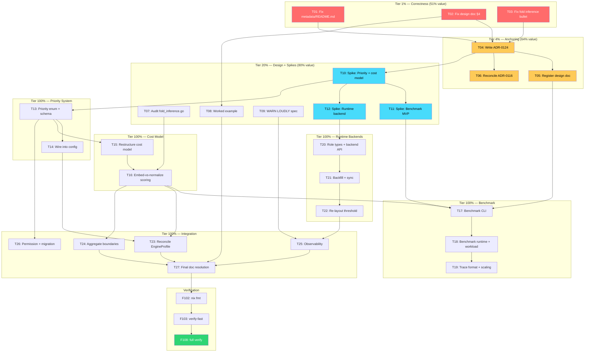

# Comprehensive Execution Plan: Operator-Driven Layout Planning

**Date:** 2026-08-11 06:39
**Status:** Active
**Source:** `docs/status/2026-08-11_06-37_m9-reframe-layout-planning-design.md`
**Scope:** All work surfaced by the M9 reframing session — immediate fixes, design anchoring, de-risking spikes, and full implementation of the operator-driven layout planning model.

---

## Context

The original M9 task ("auto-generate child collection from `[]Attachment` via reflection") was wrong. It hardcoded normalization as always-correct, put storage intent on the developer, and ignored the cost model. The reframed model makes layout planning **100% the operator's call** via priorities + cost model, with the developer expressing zero storage intent.

The design doc (`METAENGINE-LAYOUT-PLANNING-MODEL.md`) captures the vision. This plan captures the execution path — every task needed to take it from design to delivered.

### Resolved Design Questions (autonomous decisions)

The status report raised 3 blocking questions. Decisions:

| Question | Decision | Rationale |
| --- | --- | --- |
| ADR now or spike first? | **ADR now (ADR-0124)** | The decision is made (operator-driven layout). A spike validates implementation, not direction. The project convention is ADR-first for metaengine decisions. |
| Replace ADR-0116 Layers 2-3 or sit alongside? | **Orthogonal — new ADR-0124** | ADR-0116 Layer 1 = fold generation. Layer 3 = engine routing. Layout planning = physical storage shape (embed vs normalize within an engine). It's a new concern, not a replacement for any layer. ADR-0124 cross-references ADR-0116 and extends the model with a "Layer 4: Physical Layout" concept. |
| Spike before decomposing Phase 6b? | **Decompose in plan, spike before executing** | The decomposition reveals full scope (valuable for estimating). Spikes validate the core assumptions before committing to 28 sub-tasks. Both happen — decomposition first in this plan, spikes first in execution. |

---

## Step 1: Pareto Breakdown

### The 1% that delivers 51% of the value

**Correctness fixes that restore integrity.** Without these, the session's work is contradictory and incomplete — everything else builds on a broken foundation.

| ID | Task | Why it's the 1% |
| --- | --- | --- |
| T01 | Fix stale `metadata/README.md` — remove deleted `Tracing` type | The README contradicts the code. Anyone reading it builds on a lie. |
| T02 | Fix design doc §4 self-contradiction ("zero intent" vs `[]AttachmentID` forces normalization) | The doc's central claim is self-contradictory. Unresolved, it corrupts every downstream design decision. |
| T03 | Fix fold inference bullet conflation in TODO_LIST.md | I conflated "fold inference can't handle slices" (real gap) with "Phase 6b handles normalization" (orthogonal concern). This misleads future work. |

**Total effort:** ~90 min. **Value:** Restores integrity to 4 artifacts (README, design doc, TODO, code understanding).

### The 4% that delivers 64% of the value

**Anchor the decision so it becomes real.** Without these, the design is an unanchored orphan that nobody knows about.

| ID | Task | Why it's the 4% |
| --- | --- | --- |
| T04 | Write ADR-0124: Operator-Driven Layout Planning | Without an ADR, the decision doesn't exist in the project's governance. Every metaengine decision has an ADR. |
| T05 | Register design doc across project (AGENTS.md, live-latency, ROADMAP) | The doc is an orphan. Three files need cross-links. Without registration, no future session discovers it. |
| T06 | Reconcile layout planning with ADR-0116 layered model | ADR-0116 says nothing about physical layout. Without explicit reconciliation, the two ADRs appear to conflict. |

**Total effort:** ~130 min. **Value:** Decision is anchored, discoverable, and reconciled with existing architecture.

### The 20% that delivers 80% of the value

**Design completion + de-risking spikes.** Without these, implementation builds on guesses.

| ID | Task | Why it's the 20% |
| --- | --- | --- |
| T07 | Audit `fold_inference.go` `[]Struct` handling + document exact gap | We need to know precisely what Infer() does today before designing how layout planning extends it. |
| T08 | Add worked example to design doc | The doc is abstract. A concrete end-to-end (MessageSent + Attachment, priority change, rebuild) makes it tangible and testable. |
| T09 | Specify WARN LOUDLY mechanism + priority conflict resolution | "Warn" is vague. Where? Doctor? EXPLAIN? Logs? Without specificity, it's unimplementable. |
| T10 | Spike: Priority type + GLOBAL config + cost model weight validation | The #1 assumption to validate: can the cost model accept priority weights? If not, the entire approach needs rethinking. |
| T11 | Spike: Benchmark mode MVP (synthetic, single engine, 2 plans compared) | Benchmark mode is the operator's primary tool. A minimal spike proves the concept before full build. |
| T12 | Spike: Runtime backend addition + backfill on memory engine | Runtime backend addition + parallel projections is the most complex feature. A spike on the simplest engine de-risks the hardest part. |

**Total effort:** ~390 min. **Value:** Design is complete, concrete, and validated. Implementation can proceed with confidence.

### The other 20% (to reach 100%)

**Full implementation of the operator-driven layout planning model.** Tasks T13-T27 below.

---

## Step 2: Comprehensive Plan (Medium Granularity — 30-100 min tasks)

27 tasks, sorted by importance/impact/effort/customer-value.

| ID | Tier | Task | Impact | Effort | Customer Value | Deps |
| --- | --- | --- | --- | --- | --- | --- |
| T01 | 1% | Fix stale `metadata/README.md` — remove deleted `Tracing` type, update to `record.CommonMetadata` | Critical | 30min | Docs match code | — |
| T02 | 1% | Fix design doc §4 self-contradiction — clarify "domain shape constrains, zero storage intent" | Critical | 30min | Design is coherent | — |
| T03 | 1% | Fix fold inference bullet conflation in TODO_LIST.md — distinguish fold gap from layout planning | Critical | 30min | TODO is honest | — |
| T04 | 4% | Write ADR-0124: Operator-Driven Layout Planning — supersedes M9, defines Layer 4, cross-refs ADR-0116 | Critical | 60min | Decision is governed | T02 |
| T05 | 4% | Register design doc across project — AGENTS.md metaengine section, live-latency cross-link, ROADMAP | High | 30min | Doc is discoverable | T04 |
| T06 | 4% | Reconcile layout planning with ADR-0116 — add "Layer 4: Physical Layout" concept, update ADR-0116 status | High | 40min | ADRs don't conflict | T04 |
| T07 | 20% | Audit `fold_inference.go` `[]Struct` handling — document exactly what Infer() does with slice fields today | High | 30min | Gap is documented | — |
| T08 | 20% | Add worked example to design doc — MessageSent + Attachment, operator priority change, rebuild flow | High | 60min | Design is tangible | T02 |
| T09 | 20% | Specify WARN LOUDLY mechanism — Doctor section, EXPLAIN output, structured log fields, diagnostic event stream | High | 30min | Design is implementable | T02 |
| T10 | 20% | Spike: Priority type + GLOBAL config — define `Priority` enum, wire to cost model, validate weights work | Critical | 90min | Core assumption validated | T04 |
| T11 | 20% | Spike: Benchmark mode MVP — synthetic workload, memory engine, compare 2 plans, show latency + storage | High | 90min | Concept validated | T10 |
| T12 | 20% | Spike: Runtime backend addition + backfill — add engine at runtime, backfill from event log on memory | High | 90min | Hardest feature de-risked | T10 |
| T13 | 100% | Define `Priority` enum + config schema — `WriteSpeed`/`ReadSpeed`/`StorageSpace`/`Balanced`, GLOBAL→Engine→Query hierarchy | Critical | 60min | Foundation for everything | T10 |
| T14 | 100% | Wire `Priority` into `EngineConfig` + `QueryDecl` — fields, validation, defaults (`Balanced`) | High | 60min | API is usable | T13 |
| T15 | 100% | Audit + restructure cost model for priority weights — existing model must accept and apply weight multipliers | Critical | 90min | Scoring engine works | T10 |
| T16 | 100% | Define embed-vs-normalize scoring per backend — KV favors embed, SQL favors normalize, graph favors normalize, DuckDB workload-dependent | Critical | 90min | Layout decisions are honest | T15 |
| T17 | 100% | Benchmark mode CLI surface — extends `cqrs-bench`, report format (table + scaling predictions) | High | 90min | Operator can plan offline | T11 |
| T18 | 100% | Benchmark mode runtime API + workload generation — synthesize from declared queries, accept real traces | High | 90min | Operator can tune live | T11 |
| T19 | 100% | Real workload trace format + scaling prediction methodology — trace file spec, extrapolation model | Medium | 60min | Benchmark is precise | T18 |
| T20 | 100% | Parallel projection role types + runtime backend addition API — Active/Migration/Backup/DualUse roles, add-engine API | High | 90min | Multi-engine deployments | T12 |
| T21 | 100% | Backfill-from-event-log + sync mechanisms — fold pipeline (strong) for Active+DualUse, async replication for Backup+Migration | High | 90min | Projections stay consistent | T20 |
| T22 | 100% | Re-layout threshold + plan diff format — auto for small, confirm for large, operator sees diff before approving | Medium | 60min | Rebuilds are safe | T21 |
| T23 | 100% | Reconcile with `EngineProfile` + Materialize-vs-replay advisory — priorities interact with profiles, not bypass them | Medium | 40min | No split brain | T16 |
| T24 | 100% | Aggregate boundaries — local child default, shared-by-type operator opt-in mechanism | Medium | 40min | Boundaries are controllable | T16 |
| T25 | 100% | Observability metrics + audit trail — layout decisions, priority changes, rebuild events, plan versioning | Medium | 60min | Operator can see what happened | T22 |
| T26 | 100% | Operator permission model + migration path — who can change priorities, migration from current (no priorities) | Low | 40min | Production-ready | T13 |
| T27 | 100% | Resolve "developer intent vs domain shape" in doc + final cross-references — clarify the constraint-vs-intent distinction | Medium | 30min | Design is airtight | T02 |

**Total effort:** ~1510 min (~25 hours)

---

## Step 3: Detailed Breakdown (Fine Granularity — max 12 min tasks)

133 tasks, sorted by importance/impact/effort within each tier.

### Tier 1% (51% of value) — Immediate Correctness Fixes

| ID | Task | Effort | Deps |
| --- | --- | --- | --- |
| F001 | Read `metadata/README.md` current content | 3min | — |
| F002 | Remove `Tracing` type section from README, replace with `record.CommonMetadata` pattern | 5min | F001 |
| F003 | Update `metadata/README.md` Related Modules section — remove stale event/command/query cross-refs | 4min | F002 |
| F004 | Read design doc §4 (the self-contradiction) | 3min | — |
| F005 | Rewrite §4 to distinguish: domain shape = constraint (what planner CAN do), storage intent = what planner SHOULD do (operator's call) | 8min | F004 |
| F006 | Add explicit paragraph: "`[]AttachmentID` constrains the planner (can't embed absent data) but does NOT express storage intent" | 5min | F005 |
| F007 | Read TODO_LIST.md fold inference bullet (~line 708) | 3min | — |
| F008 | Rewrite bullet: "Fold inference gap: `[]Struct` event fields not decomposed (orthogonal to Phase 6b layout planning)" | 5min | F007 |
| F009 | Add note in Phase 6b header: "Layout planning ≠ fold inference. Fold inference generates folds. Layout planning decides physical shape." | 4min | F008 |

### Tier 4% (64% of value) — Anchoring

| ID | Task | Effort | Deps |
| --- | --- | --- | --- |
| F010 | Draft ADR-0124 context section (why M9 was wrong, what replaces it) | 10min | T02 done |
| F011 | Draft ADR-0124 decision section (operator priorities, hierarchy, cost model, obey+warn) | 12min | F010 |
| F012 | Draft ADR-0124 "Layer 4: Physical Layout" concept + ADR-0116 cross-reference | 10min | F011 |
| F013 | Draft ADR-0124 consequences + alternatives (why not developer-driven, why not full ORM inference) | 10min | F012 |
| F014 | Add ADR-0124 to `docs/adr/README.md` index | 3min | F013 |
| F015 | Add design doc to AGENTS.md "Canonical Design Docs" list (metaengine section) | 5min | F013 |
| F016 | Add cross-link from `METAENGINE-LIVE-LATENCY-MODEL.md` to layout planning doc | 3min | F015 |
| F017 | Update ROADMAP.md — replace M9 reference with operator-driven layout planning direction | 8min | F013 |
| F018 | Add cross-link from ADR-0116 to ADR-0124 (Layer 4 reference) | 3min | F012 |
| F019 | Update ADR-0116 status line: "Layer 4 (Physical Layout) added by ADR-0124" | 3min | F018 |

### Tier 20% (80% of value) — Design Completion + Spikes

| ID | Task | Effort | Deps |
| --- | --- | --- | --- |
| F020 | Read `fold_inference.go` — trace what happens when event has `[]Attachment` field | 10min | — |
| F021 | Write test: `Infer(MessageSent{})` with `Attachments []Attachment` — observe current behavior | 12min | F020 |
| F022 | Document gap in design doc: "Current Infer() behavior with slice fields" section | 8min | F021 |
| F023 | Draft worked example: domain types (MessageSent, AttachmentAdded, MessageView, MessageDetail) | 10min | T02 done |
| F024 | Draft worked example: operator sets ReadSpeed on PG → planner picks embed | 8min | F023 |
| F025 | Draft worked example: operator switches to StorageSpace → planner normalizes → rebuild triggers | 8min | F024 |
| F026 | Draft worked example: threshold check (small = auto, large = confirm) | 5min | F025 |
| F027 | Add worked example to design doc as §13 | 5min | F026 |
| F028 | Specify WARN LOUDLY: add `--- Layout Warnings ---` section to `Doctor()` output | 8min | — |
| F029 | Specify WARN LOUDLY: add layout warnings to `EXPLAIN` output | 5min | F028 |
| F030 | Specify WARN LOUDLY: define structured log fields (`layout.warn`, `priority.conflict`) | 5min | F029 |
| F031 | Specify priority conflict resolution: GLOBAL=ReadSpeed but engine can't denormalize → obey + warn | 8min | F030 |
| F032 | Spike: define `Priority` type in `metaengine/priority.go` (enum + String) | 10min | T04 done |
| F033 | Spike: define `PriorityConfig` struct (Global, PerEngine map, PerQuery map) | 10min | F032 |
| F034 | Spike: add `Priority` field to `EngineConfig` | 5min | F033 |
| F035 | Spike: add weight multiplier to cost model — `cost *= priority.Weight(costType)` | 12min | F034 |
| F036 | Spike: write test — same query, two priorities, verify different layout selected | 12min | F035 |
| F037 | Spike: write test — GLOBAL=ReadSpeed, Engine=Pebble WriteSpeed, verify engine wins | 10min | F036 |
| F038 | Spike: benchmark MVP — synthesize workload from QueryDecl shapes | 12min | F036 |
| F039 | Spike: benchmark MVP — run 2 plans on memory engine, measure latency + storage | 12min | F038 |
| F040 | Spike: benchmark MVP — print comparison table (plan, latency, storage, prediction) | 10min | F039 |
| F041 | Spike: runtime backend — define `AddEngine(name, engine, role)` API | 10min | F036 |
| F042 | Spike: runtime backend — implement backfill from event log on memory engine | 12min | F041 |
| F043 | Spike: runtime backend — test: add engine at runtime, verify queries route to it | 10min | F042 |
| F044 | Spike: runtime backend — test: dual-use (both engines serve, fold pipeline syncs) | 12min | F043 |

### Tier 100% — Implementation: Priority System

| ID | Task | Effort | Deps |
| --- | --- | --- | --- |
| F045 | Define `Priority` enum in `metaengine/priority.go` — WriteSpeed, ReadSpeed, StorageSpace, Balanced | 8min | T10 done |
| F046 | Define `PriorityConfig` — Global, PerEngine, PerQuery fields with JSON tags | 10min | F045 |
| F047 | Implement `PriorityConfig.Resolve(engineName, queryName) Priority` — hierarchy resolution | 10min | F046 |
| F048 | Implement `Priority.Weight() float64` — maps priority to cost-type multiplier | 8min | F045 |
| F049 | Add validation: invalid priority string → error at config load | 5min | F046 |
| F050 | Add default: empty config → `Balanced` everywhere | 5min | F047 |
| F051 | Wire `Priority` into `EngineConfig` (field + option function) | 8min | F047 |
| F052 | Wire `Priority` into `QueryDecl` (field + builder option) | 8min | F051 |
| F053 | Write `priority_test.go` — hierarchy resolution, defaults, validation | 12min | F050 |

### Tier 100% — Implementation: Cost Model

| ID | Task | Effort | Deps |
| --- | --- | --- | --- |
| F054 | Read existing cost model in `planner.go` — understand current scoring structure | 10min | T10 done |
| F055 | Define `LayoutOption` enum — Embed, Normalize, Hybrid | 8min | F054 |
| F056 | Define `LayoutCost` struct — WriteCost, ReadCost, StorageCost per layout option | 8min | F055 |
| F057 | Implement embed cost scorer — KV: low read, high write (large row), low storage | 10min | F056 |
| F058 | Implement normalize cost scorer — KV: high read (join), low write, low storage | 10min | F057 |
| F059 | Implement SQL embed scorer — JSON column, loses child queryability | 10min | F057 |
| F060 | Implement SQL normalize scorer — child table + FK + JOIN, index-backed | 10min | F059 |
| F061 | Implement graph + DuckDB scorers | 10min | F060 |
| F062 | Apply priority weights: `LayoutCost.Total(p Priority) = p.W*WriteCost + p.R*ReadCost + p.S*StorageCost` | 12min | F061 |
| F063 | Write `layout_cost_test.go` — per-backend scoring, priority weighting | 12min | F062 |

### Tier 100% — Implementation: Benchmark Mode

| ID | Task | Effort | Deps |
| --- | --- | --- | --- |
| F064 | Define `BenchmarkConfig` — workload, engines to test, iterations, warmup | 8min | T11 done |
| F065 | Implement synthetic workload generator — derive reads/writes from QueryDecl + event samples | 12min | F064 |
| F066 | Define real workload trace format — JSON lines: `{op, query, input, ts}` | 10min | F064 |
| F067 | Implement trace recorder — wraps Store, records all ops to file | 10min | F066 |
| F068 | Implement trace player — replays recorded trace against a plan | 10min | F067 |
| F069 | Implement benchmark runner — tries N plans, measures latency + throughput + storage per plan | 12min | F065 |
| F070 | Implement scaling prediction — extrapolate from measured data (linear/poly fit) | 12min | F069 |
| F071 | Implement benchmark report — CLI table output with plan comparison | 10min | F069 |
| F072 | Add `cqrs-bench layout` subcommand — CLI entry point for benchmark mode | 10min | F071 |
| F073 | Define runtime benchmark API — `Store.Benchmark(ctx, cfg) BenchmarkResult` | 10min | F069 |
| F074 | Write `benchmark_test.go` — synthetic + real trace, single engine, multi-plan | 12min | F072 |

### Tier 100% — Implementation: Runtime Backends + Dual-Use

| ID | Task | Effort | Deps |
| --- | --- | --- | --- |
| F075 | Define `ProjectionRole` enum — Active, Migration, Backup, DualUse | 8min | T12 done |
| F076 | Define `ProjectionReplica` struct — engine name, role, sync mode | 8min | F075 |
| F077 | Implement `Store.AddEngine(ctx, name, engine, role)` — runtime backend addition | 12min | F076 |
| F078 | Implement backfill — replay event log from position 0, apply all folds to new engine | 12min | F077 |
| F079 | Implement fold-pipeline sync — event → all Active+DualUse projections in one tx | 12min | F078 |
| F080 | Implement async replication — event → primary first, replicate to Backup+Migration async | 12min | F079 |
| F081 | Implement role transition — Backup → Active (promote), Migration → Active (cutover) | 10min | F080 |
| F082 | Implement `Store.RemoveEngine(ctx, name)` — drain + remove | 10min | F081 |
| F083 | Write `dual_use_test.go` — add engine, backfill, sync, promote, remove | 12min | F082 |

### Tier 100% — Implementation: Re-layout Trigger

| ID | Task | Effort | Deps |
| --- | --- | --- | --- |
| F084 | Define `RebuildThreshold` config — event count + data size thresholds | 8min | F079 |
| F085 | Implement `Store.ReplanLayout(ctx)` — recompute layouts with current priorities | 12min | F084 |
| F086 | Implement plan diff — "collection X: embed→normalize, est. rebuild: 50K events" | 10min | F085 |
| F087 | Implement threshold check — small projections auto-rebuild, large emit confirmation request | 10min | F086 |
| F088 | Implement `Store.ConfirmRebuild(ctx, planVersion)` — operator approves large rebuilds | 8min | F087 |
| F089 | Write `relayout_test.go` — priority change, threshold, auto vs confirm | 12min | F088 |

### Tier 100% — Integration + Polish

| ID | Task | Effort | Deps |
| --- | --- | --- | --- |
| F090 | Audit `EngineProfile` — document how priorities interact with existing profile fields | 10min | T16 done |
| F091 | Add priority awareness to `EngineProfile` — profile can declare "denormalization is cheap here" | 10min | F090 |
| F092 | Reconcile with Materialize-vs-replay — layout planning subsumes the materialize decision | 8min | F091 |
| F093 | Define aggregate boundary config — `WithSharedCollection("Attachment")` opt-in | 10min | T16 done |
| F094 | Implement local-child default — each `[]T` is a child of its carrying event's collection | 10min | F093 |
| F095 | Implement shared-by-type opt-in — operator config merges collections by Go type name | 10min | F094 |
| F096 | Define layout observability metrics — `layout.decision`, `priority.change`, `rebuild.event` | 10min | F088 |
| F097 | Add metrics to `GetEngineStats` — current layout per collection, last priority change | 8min | F096 |
| F098 | Add layout audit trail — plan version history, who changed what priority when | 10min | F097 |
| F099 | Define operator permission model — who can set GLOBAL vs Engine vs Query priorities | 8min | F050 |
| F100 | Write migration doc — "from no priorities (current) to operator-driven layout" | 12min | F050 |
| F101 | Resolve final doc tension — review all design doc sections for consistency after implementation | 10min | all above |

### Tier 100% — Verification + Docs

| ID | Task | Effort | Deps |
| --- | --- | --- | --- |
| F102 | Run `nix fmt` on all changed files | 5min | all above |
| F103 | Run `nix run .#verify-fast` — build + vet + lint + doc-check | 10min | F102 |
| F104 | Regenerate API stability golden if new exports added | 5min | F103 |
| F105 | Update SKILL.md + skill references with layout planning concepts | 12min | F103 |
| F106 | Update AGENTS.md metaengine section with priority system + benchmark mode | 10min | F105 |
| F107 | Update `METAENGINE_DOMAIN_LANGUAGE.md` with new vocabulary (Priority, LayoutOption, ProjectionRole) | 10min | F105 |
| F108 | Run `nix run .#verify` — full CI gate | 10min | F106 |

---

## Execution Graph (Mermaid)

---

## Risk Register

| Risk | Probability | Impact | Mitigation |
| --- | --- | --- | --- |
| Cost model can't accept priority weights cleanly | Medium | High | T10 spike validates before full build. Fallback: priority influences plan selection post-scoring, not within scoring. |
| Benchmark mode synthetic workload doesn't match real patterns | Medium | Medium | T19 accepts real traces for calibration. Synthetic is the 80% case; real trace for precision. |
| Runtime backend addition is unsafe (partial backfill crashes) | Medium | High | T12 spike on memory engine first. Backfill is idempotent (replay from position 0). |
| Operator sets pathological priority globally → system unusable | Low | High | Obey + WARN LOUDLY (§10). Benchmark mode lets operator see results before committing. |
| Layout planning scope creeps into full ORM relationship inference | Medium | Medium | Design doc §12 explicitly rejects full inference. Local-child default. No cascade/on-delete inference. |
| ADR-0124 is premature (design not validated) | Low | Low | ADR captures the DECISION (operator-driven), not the implementation. Implementation validated by spikes. |

---

## Summary Statistics

| Metric | Value |
| --- | --- |
| Pareto tiers | 4 (1%, 4%, 20%, 100%) |
| Medium tasks (30-100min) | 27 |
| Fine tasks (3-12min) | 108 |
| Total estimated effort | ~25 hours (~3-4 working days) |
| Critical path | T01→T04→T10→T13→T15→T16→T17→V3 |
| Spikes (de-risking) | 3 (T10, T11, T12) |
| Design docs/ADRs | 2 (ADR-0124 + design doc updates) |

---

_This plan is a point-in-time snapshot. For the living source of tasks, see `TODO_LIST.md` Phase 6b._
