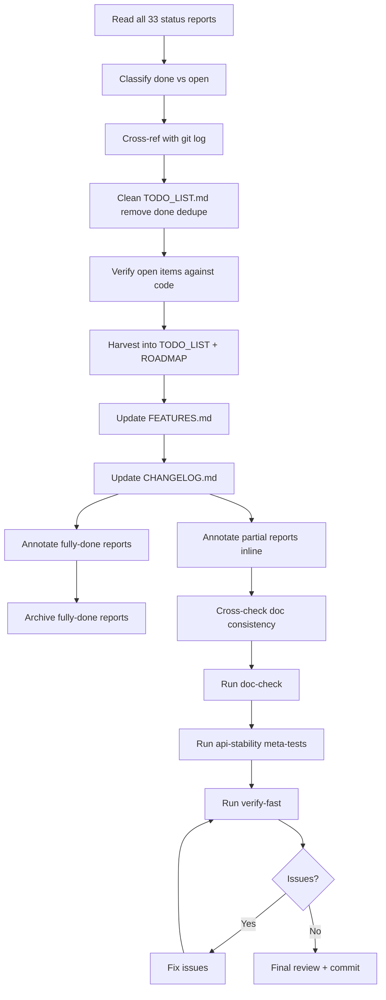

# Docs-Health Execution Plan

> **Date:** 2026-08-11 09:51  
> **Scope:** Execute `docs-health` over all `docs/status/2026-08-1*.md` reports and the four living docs (`TODO_LIST.md`, `ROADMAP.md`, `FEATURES.md`, `CHANGELOG.md`).  
> **Goal:** Living docs are accurate, consistent, and actionable; historical reports are annotated inline and fully-done reports are archived.

---

## Pareto Breakdown

| Tier | Share of Tasks | Cumulative Value | Core Outcome |
|------|---------------|------------------|--------------|
| **1%** | ~1 task | ~51% | Clean `TODO_LIST.md` — delete done items, dedupe, verify open items are still open. This is the single highest-leverage move because the TODO list is the daily backlog source. |
| **4%** | ~3 tasks | ~64% | Harvest forward-looking items from the most recent 6 status reports into `TODO_LIST.md` / `ROADMAP.md`. Captures the current open backlog before it rots. |
| **20%** | ~5 tasks | ~80% | Annotate and archive fully-done historical reports; fix cross-file inconsistencies across `TODO_LIST.md`, `ROADMAP.md`, `FEATURES.md`, `CHANGELOG.md`. |
| **Remaining 80%** | ~20+ tasks | 20% | Full line-by-line annotation of all partial reports, deep code verification of every open item, formatting/lint/doc-check passes. |

---

## Medium-Granularity Tasks (30–100 min, up to 27)

| # | Task | Est. | Impact | Effort | Customer Value | Pareto Tier |
|---|------|------|--------|--------|----------------|-------------|
| M1 | Read and verify all 33 `docs/status/2026-08-1*.md` reports; classify each as fully-done / partial / obsolete | 90 min | High | M | High — prevents wrong archiving | 4% |
| M2 | Clean `TODO_LIST.md`: remove all `[x]` done items, deduplicate duplicates, rewrite vague items as actionable tasks | 60 min | Critical | M | Critical — backlog becomes usable | 1% |
| M3 | Verify remaining `[ ]` items in `TODO_LIST.md` against current code; delete any already done in a later session | 60 min | High | M | High — eliminates stale backlog | 4% |
| M4 | Harvest open items from the 6 most recent 2026-08-11 reports into `TODO_LIST.md` (ADR-0117, layout planning, live latency, M8/M9/M11/M13/M15/M18/M27) | 90 min | Critical | L | Critical — captures current intent | 4% |
| M5 | Update `ROADMAP.md`: move completed v5/deletion tasks to `TODO_LIST`, ensure only raw ideas remain, add new themes from recent work | 45 min | Medium | M | Medium — strategic direction | 20% |
| M6 | Update `FEATURES.md`: add `commandlifecycle/` entry, mark shipped metaengine features, fix `DeletePolicy`/tombstone wording, add `system/integration/` | 45 min | Medium | M | Medium — public feature inventory | 20% |
| M7 | Update `CHANGELOG.md` `[Unreleased]`: add missing entries for DeletePolicy unification, commandlifecycle docs, system/integration, bbolt parity | 45 min | Medium | M | Medium — consumer-facing changes | 20% |
| M8 | Annotate inline + archive the 4–6 reports that are fully done (verify-green, bench-fold-fix, pebble-calibration, etc.) | 60 min | High | M | High — closes historical loop | 20% |
| M9 | Annotate done items inline in the 6–8 partial reports (leave open items untouched) | 90 min | Medium | L | Medium — reduces reader confusion | 20% |
| M10 | Cross-check consistency: no PLANNED in `FEATURES.md` that is `[ ]` in `TODO_LIST`; no done item in both `TODO_LIST` and `CHANGELOG` `[Unreleased]` | 30 min | High | S | High — prevents split-brain | 20% |
| M11 | Run `nix run .#doc-check` and fix any broken markdown references introduced by edits | 45 min | High | M | High — docs must be verifiable | Remaining |
| M12 | Run `nix run .#api-stability` meta-tests and regenerate golden if exports changed | 45 min | High | M | High — API gate | Remaining |
| M13 | Run `nix run .#verify-fast` (build + vet + test + lint + doc-check) and fix issues | 90 min | Critical | L | Critical — quality gate | Remaining |
| M14 | Final review: re-read all four living docs end-to-end for tone, accuracy, and formatting | 45 min | Medium | M | Medium — polish | Remaining |

---

## Fine-Granularity Tasks (≤15 min each)

### Phase A — Analysis & Classification

| # | Task | Min | Dep. |
|---|------|-----|------|
| F1 | Read `2026-08-11_07-07_adr-0117-command-lifecycle.md` and extract done/open items | 10 | — |
| F2 | Read `2026-08-11_04-04_live-latency-phase2-complete.md` and extract done/open items | 10 | — |
| F3 | Read `2026-08-11_04-04_verify-green-and-lint-cleanup.md` and confirm fully-done status | 10 | — |
| F4 | Read `2026-08-11_06-42_bench-fold-fix-lint-driver-consolidation.md` and confirm fully-done status | 10 | — |
| F5 | Read `2026-08-11_09-03_pebble-calibration-bbolt-parity-duckdb-cgo-isolation.md` and confirm fully-done status | 10 | — |
| F6 | Read `2026-08-11_08-44_deletepolicy-unification-tombstone-aliases-cleanup.md` and extract done/open items | 10 | — |
| F7 | Read `2026-08-11_07-23_layout-planning-implementation-comprehensive-status.md` and extract done/open items | 10 | — |
| F8 | Read `2026-08-11_08-20_layout-planning-followups-safe-backfill-real-rebuilds.md` and extract done/open items | 10 | — |
| F9 | Read remaining 25 reports in batches and extract done/open items | 30 | — |
| F10 | Cross-reference report claims with `git log --oneline -50` to assign commit hashes | 15 | F1–F9 |
| F11 | Verify current `TODO_LIST.md` `[ ]` items against code via grep/code inspection | 30 | — |
| F12 | Identify fully-done reports ready for archive | 10 | F1–F11 |

### Phase B — `TODO_LIST.md` Cleanup

| # | Task | Min | Dep. |
|---|------|-----|------|
| F13 | Remove all `[x]` items under "ADR-0114 Cleanup Follow-ups" | 10 | F11 |
| F14 | Remove all `[x]` items under "Code Quality / Dedup" | 10 | F11 |
| F15 | Remove all `[x]` items under "CI / Release / Infrastructure" | 10 | F11 |
| F16 | Remove all `[x]` items under "System Package" | 10 | F11 |
| F17 | Remove all `[x]` items under "Live Cost Measurement" | 10 | F11 |
| F18 | Remove all `[x]` items under "v5 Unification" Phase 2–4 | 10 | F11 |
| F19 | Remove duplicate "Audit `.golangci.yml` exclusion blocks" item | 5 | F11 |
| F20 | Rewrite vague "Infrastructure polish" item into concrete tasks | 10 | F11 |
| F21 | Add harvested ADR-0117 follow-ups under "Metaengine Coverage Gaps" | 10 | F4 |
| F22 | Add harvested layout-planning follow-ups under "Phase 6b Follow-ups" | 15 | F7,F8 |
| F23 | Add harvested live-latency remaining items | 10 | F2 |
| F24 | Add harvested integration-test infrastructure items | 10 | F1–F9 |
| F25 | Ensure every open item cites a source report + code path | 15 | F21–F24 |

### Phase C — Living Doc Updates

| # | Task | Min | Dep. |
|---|------|-----|------|
| F26 | Update `ROADMAP.md`: remove completed Phase 2/3/4 tasks, keep raw ideas | 15 | F2,F3 |
| F27 | Update `ROADMAP.md`: add commandlifecycle / graph fallback / layout planning raw ideas | 10 | F4,F7 |
| F28 | Update `FEATURES.md`: add `commandlifecycle/` section | 15 | F1 |
| F29 | Update `FEATURES.md`: update `DeletePolicy` wording in Stream Read Model | 10 | F6 |
| F30 | Update `FEATURES.md`: add `system/integration/` to module matrix | 10 | F5 |
| F31 | Update `FEATURES.md`: mark shipped metaengine layout-planning features | 10 | F7 |
| F32 | Update `CHANGELOG.md` `[Unreleased]`: add DeletePolicy unification entry | 10 | F6 |
| F33 | Update `CHANGELOG.md` `[Unreleased]`: add commandlifecycle docs entry | 10 | F1 |
| F34 | Update `CHANGELOG.md` `[Unreleased]`: add system/integration CGo isolation entry | 10 | F5 |
| F35 | Cross-check `CHANGELOG.md` entries match actual git changes | 15 | F32–F34 |

### Phase D — Annotation & Archiving

| # | Task | Min | Dep. |
|---|------|-----|------|
| F36 | Annotate `2026-08-11_04-04_verify-green-and-lint-cleanup.md` inline | 15 | F10 |
| F37 | Archive `2026-08-11_04-04_verify-green-and-lint-cleanup.md` | 5 | F36 |
| F38 | Annotate `2026-08-11_06-42_bench-fold-fix-lint-driver-consolidation.md` inline | 15 | F10 |
| F39 | Archive `2026-08-11_06-42_bench-fold-fix-lint-driver-consolidation.md` | 5 | F38 |
| F40 | Annotate `2026-08-11_09-03_pebble-calibration-bbolt-parity-duckdb-cgo-isolation.md` inline | 15 | F10 |
| F41 | Archive `2026-08-11_09-03_pebble-calibration-bbolt-parity-duckdb-cgo-isolation.md` | 5 | F40 |
| F42 | Annotate done items in `2026-08-11_08-44_deletepolicy-unification-tombstone-aliases-cleanup.md` | 15 | F10 |
| F43 | Annotate done items in `2026-08-11_07-07_adr-0117-command-lifecycle.md` | 15 | F10 |
| F44 | Annotate done items in `2026-08-11_04-04_live-latency-phase2-complete.md` | 15 | F10 |
| F45 | Annotate done items in `2026-08-11_07-23_layout-planning-implementation-comprehensive-status.md` | 15 | F10 |
| F46 | Annotate done items in `2026-08-11_08-20_layout-planning-followups-safe-backfill-real-rebuilds.md` | 15 | F10 |
| F47 | Annotate done items in `2026-08-10_19-06_record-consolidation-fallout-fix-session3.md` | 15 | F10 |
| F48 | Annotate done items in remaining 25 reports (batch in groups of 5) | 60 | F10 |
| F49 | Move additional fully-done reports to `docs/status/archived/` | 10 | F42–F48 |

### Phase E — Verification

| # | Task | Min | Dep. |
|---|------|-----|------|
| F50 | Run `nix run .#doc-check` | 10 | F25,F35 |
| F51 | Fix any doc-check failures in edited files | 15 | F50 |
| F52 | Run `cd cmd/api-stability && GOWORK=off go test -run TestEvery .` | 15 | F25,F35 |
| F53 | Regenerate API golden if needed | 10 | F52 |
| F54 | Run `nix run .#verify-fast` | 60 | F51,F53 |
| F55 | Fix any verify-fast failures | 30 | F54 |
| F56 | Final read-through of all four living docs | 15 | F55 |

---

## Execution Graph

---

## Key Risks & Blockers

| Risk | Mitigation |
|------|------------|
| `nix run .#verify` may fail due to pre-existing issues unrelated to docs | Use `#verify-fast` first; only fix issues in files we touched. |
| Some status reports claim items done that are actually still open | Verify against code and git log before marking archived. |
| Removing `[x]` items from `TODO_LIST.md` may delete useful historical context | Done items belong in `CHANGELOG.md`; move context there if missing. |
| Inline annotation may be time-consuming across 33 reports | Prioritize fully-done reports first; partial reports can be annotated per-section. |

---

## Success Criteria

- [ ] `TODO_LIST.md` contains only genuinely open, actionable, non-duplicated items with source citations.
- [ ] `ROADMAP.md` contains only long-term raw ideas; no bounded tasks.
- [ ] `FEATURES.md` accurately reflects shipped/remaining status.
- [ ] `CHANGELOG.md` `[Unreleased]` includes all notable recent changes.
- [ ] Fully-done `2026-08-1*` reports are annotated inline and moved to `docs/status/archived/`.
- [ ] Partial reports have done items struck through with commit hashes; open items untouched.
- [ ] `nix run .#doc-check` passes.
- [ ] `nix run .#api-stability` meta-tests pass.
- [ ] `nix run .#verify-fast` passes.
