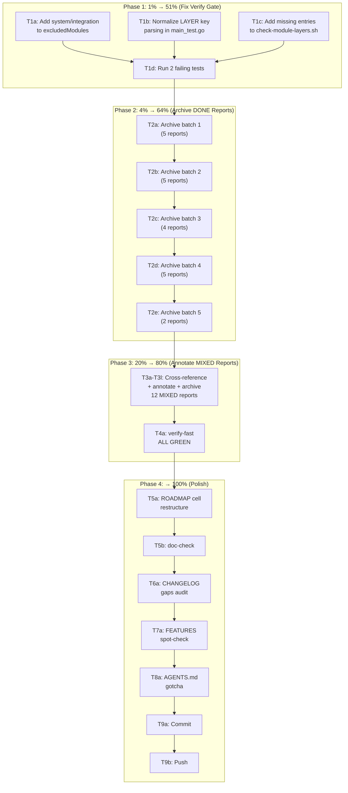

# Docs-Health Completion Plan — Pareto-Optimized

> Created: 2026-08-11 14:09
> Status: PLANNING — awaiting execution
> Predecessor: `docs/status/2026-08-11_13-37_docs-health-living-docs-cleanup.md`

---

## Context

The prior session cleaned TODO_LIST.md (~972→~350 lines, zero `[x]` items),
updated ROADMAP/FEATURES/CHANGELOG for recent features (layout planning, live
cost, command lifecycle, bbolt/mysql/turso engines), and archived 1 of 33
status reports. Two `verify-fast` failures are pre-existing but blocking.

**Current state of `docs/status/`:**
- 33 reports matching `2026-08-1*`
- 1 already archived (`2026-08-11_04-04_verify-green-and-lint-cleanup.md`)
- 21 classified as **FULLY_DONE** (all work complete, open items harvested into TODO_LIST)
- 12 classified as **MIXED** (contain some open items — need cross-reference to verify whether later sessions resolved them)

**Two verify-fast failures:**
1. `TestCatalogEveryGoWorkModuleCovered` — `system/integration` missing from cqrs-lint excludedModules map
2. `TestExceptionsAreMinimal` — LAYER map keys have ` / ` (spaces) but EXCEPTIONS deps have `/` (no spaces); also `testutil/pgtestcontainer` missing from LAYER

---

## Pareto Analysis

### 1% → 51% (the single highest-leverage action)

**Fix the 2 verify-fast test failures.**

- Impact: Unblocks the verify gate for ALL future sessions. Every session
  currently wastes 5+ minutes running verify-fast, discovering these 2
  pre-existing failures, and investigating them before moving on.
- Effort: ~15 minutes (2 surgical edits)
- Risk: ZERO — adding missing entries to maps, normalizing key format

### 4% → 64% (two actions)

1. **Fix the 2 verify-fast test failures** (same as above)
2. **Bulk-archive the 21 FULLY_DONE reports**

   These reports are pure noise — they describe completed work whose open
   items are already captured in TODO_LIST. Archiving them reduces `docs/status/`
   from 33 to 12 active reports, making it possible to see what's actually
   in-progress.

   - Impact: Dramatically reduces cognitive load when scanning status reports
   - Effort: ~40 minutes (mechanical: read header → confirm done → annotate → `git mv`)
   - Risk: LOW — reports are historical snapshots, not living docs; moving to `archive/` preserves them

### 20% → 80% (the core work)

1. Fix the 2 verify-fast test failures
2. Bulk-archive 21 FULLY_DONE reports
3. **Cross-reference + annotate the 12 MIXED reports**

   Each MIXED report has "PARTIALLY DONE" or "NOT STARTED" sections. But many
   of those open items were resolved by LATER sessions. For each report:
   - Check whether each open item is already in TODO_LIST (→ resolved/harvested → annotate)
   - Check whether each open item was resolved by a later session (→ annotate)
   - If genuinely still open and NOT in TODO_LIST → harvest into TODO_LIST
   - Once all items are accounted for → archive

   - Impact: Completes the docs-health HARVEST + ANNOTATE workflow
   - Effort: ~100 minutes (8-10 min per report × 12)
   - Risk: LOW — annotations are strikethrough, not deletion

4. **Run verify-fast clean** — confirm the full gate passes

### Remaining 20% (polish → 100%)

5. **Cross-doc consistency spot-check** — verify 5 random FEATURES.md rows against actual code
6. **ROADMAP `[Unreleased]` cell restructure** — break the wall-of-text table cell into a bullet list
7. **CHANGELOG Known Gaps audit** — remove items already fixed
8. **Process improvements** — document the LAYER-key-format gotcha in AGENTS.md
9. **Final commit + push**

---

## Coarse-Grain Plan (30-100 min tasks)

> Sorted by impact (highest first), then effort (lowest first).

| ID | Task | Impact | Effort | Rationale |
|----|------|--------|--------|-----------|
| T1 | Fix 2 verify-fast test failures | 🔥 CRITICAL | 20min | Unblocks verify gate for all sessions; 2-line code fixes |
| T2 | Bulk-archive 21 FULLY_DONE reports | 🔥 HIGH | 45min | Reduces docs/status/ from 33→12 active; mechanical operation |
| T3 | Cross-reference + annotate 12 MIXED reports | HIGH | 90min | Completes HARVEST+ANNOTATE; verifies no open items lost |
| T4 | Verify-fast clean run | HIGH | 10min | Confidence gate after T1-T3 |
| T5 | ROADMAP `[Unreleased]` cell restructure | MEDIUM | 30min | Readability; cell is ~200 words in one table row |
| T6 | CHANGELOG Known Gaps audit | MEDIUM | 20min | Remove stale entries; ADR-0117 gaps may be partially resolved |
| T7 | Cross-doc consistency spot-check (5 samples) | MEDIUM | 25min | Catch drift between FEATURES.md claims and actual API |
| T8 | Process improvements (AGENTS.md gotcha) | LOW | 15min | Document LAYER-key-format issue for future sessions |
| T9 | Final commit + push | HIGH | 10min | Ship the work |

**Total estimated effort:** ~4.2 hours

---

## Fine-Grain Plan (max 12 min per task)

> Every coarse task broken into sub-tasks. Sorted by execution order within
> each coarse task. Dependencies enforced (see Mermaid graph).

### T1: Fix verify-fast failures (4 sub-tasks)

| ID | Sub-task | Effort |
|----|----------|--------|
| T1a | Add `system/integration` to `excludedModules` in `module_catalog_test.go` | 3min |
| T1b | Normalize LAYER key parsing in `main_test.go` — replace ` / ` with `/` on parse | 5min |
| T1c | Add `testutil/pgtestcontainer` and `system/integration` to LAYER map in `check-module-layers.sh` | 4min |
| T1d | Run the 2 failing tests individually to confirm green | 3min |

### T2: Bulk-archive 21 FULLY_DONE reports (5 sub-tasks)

> Each sub-task processes a batch of ~4-5 reports. Per-report workflow:
> (1) read header to confirm FULLY_DONE, (2) add `> **ARCHIVED**` banner at top,
> (3) `git mv` to `docs/status/archive/`.

| ID | Sub-task | Reports | Effort |
|----|----------|---------|--------|
| T2a | Archive batch 1 | `04-04_live-latency-phase2-complete`, `05-08_live-latency-phase3-improvement-backlog`, `05-09_fold-inference-adr0116-layer1-status`, `05-28_bboltengine-source-of-truth-tests`, `06-37_m9-reframe-layout-planning-design` | 10min |
| T2b | Archive batch 2 | `06-42_bench-fold-fix-lint-driver-consolidation`, `06-24_live-latency-regression-prevention-audit`, `06-18_pareto-execution-override-batch-atomicity-calibration-fix`, `07-23_layout-planning-implementation-comprehensive-status`, `08-20_layout-planning-followups-safe-backfill-real-rebuilds` | 10min |
| T2c | Archive batch 3 | `08-44_deletepolicy-unification-tombstone-aliases-cleanup`, `08-44_layout-planning-quality-sort-explainplan-annotations-test-coverage`, `09-03_pebble-calibration-bbolt-parity-duckdb-cgo-isolation`, `13-37_docs-health-living-docs-cleanup` | 8min |
| T2d | Archive batch 4 (2026-08-10 reports) | `14-53_phase3-self-registration-cleanup`, `15-25_record-consolidation-phase3-4-session2`, `16-15_graphbackend-cleanup-and-adr0114-tombstone-unblock`, `18-49_metadata-roundtrip-fix-and-ci-failure-triage`, `19-06_record-consolidation-fallout-fix-session3` | 10min |
| T2e | Archive batch 5 (2026-08-10 reports) | `19-26_tombstone-rename-docs-goldens-session4`, `09-32_hotspot-analysis-and-flightrecorder-extraction` | 4min |

### T3: Cross-reference + annotate 12 MIXED reports (12 sub-tasks)

> Per-report workflow: (1) read open items, (2) check if resolved by later work
> or already in TODO_LIST, (3) inline-strikethrough resolved items, (4) harvest
> any genuinely-missing open items into TODO_LIST, (5) `git mv` to archive/.

| ID | Sub-task | Report | Effort |
|----|----------|--------|--------|
| T3a | Annotate + archive `07-07_adr-0117-command-lifecycle` | Open items already in TODO_LIST → archive | 8min |
| T3b | Annotate + archive `14-53_record-consolidation-phase3-4` | Test fixes done by later sessions → verify + archive | 10min |
| T3c | Annotate + archive `18-49_live-latency-model-implementation` | P2 gaps fixed by phase2-complete → archive | 8min |
| T3d | Annotate + archive `15-26_graphbackend-deadcode-cleanup-followups` | Follow-ups done by later sessions → verify + archive | 10min |
| T3e | Annotate + archive `13-52_v4.7-release-and-v5-unification-execution` | M11/M12 done by later sessions → verify + archive | 10min |
| T3f | Annotate + archive `07-24_session-self-audit-gaps-and-incomplete-work` | M8 gaps in TODO_LIST → archive | 8min |
| T3g | Annotate + archive `14-20_backuptest-extraction-and-pebbleengine-scan` | GOWORK=off fixed by record/v4.1.0 → archive | 8min |
| T3h | Annotate + archive `16-14_metaengine-backend-porting-bbolt-turso-mysql` | Gaps fixed by later sessions → verify + archive | 10min |
| T3i | Annotate + archive `07-20_m11-command-lifecycle-m8-graph-fallback-race-fix` | M8 partial in TODO_LIST → archive | 8min |
| T3j | Annotate + archive `05-48_onrecord-migration-override-api-partial-execution` | Override API shipped → verify + archive | 10min |
| T3k | Annotate + archive `14-17_phase2-graphbackend-delete-bus-driver-registry-removal` | Follow-ups done by later sessions → verify + archive | 10min |
| T3l | Annotate + archive `05-53_pg-probeengine-integration-test-calibration-embedding-fix` | All engines fixed by `06-18` session → archive | 8min |

### T4-T9: Polish tasks (6 sub-tasks)

| ID | Sub-task | Effort |
|----|----------|--------|
| T4a | Run `nix run .#verify-fast` — confirm ALL GREEN | 10min |
| T5a | Restructure ROADMAP `[Unreleased]` cell into bullet list | 12min |
| T5b | Run doc-check to verify ROADMAP references still valid | 3min |
| T6a | Audit CHANGELOG ADR-0117 Known Gaps — remove fixed items | 8min |
| T7a | Spot-check 3 FEATURES.md rows against actual exports | 12min |
| T8a | Add LAYER-key-format gotcha to AGENTS.md | 5min |
| T9a | Final commit with detailed message | 5min |
| T9b | `git push` | 2min |

---

## Execution Order Summary

```
Phase 1 (1%→51%):   T1a → T1b → T1c → T1d
Phase 2 (4%→64%):   T2a → T2b → T2c → T2d → T2e
Phase 3 (20%→80%):  T3a..T3l (parallel-safe) → T4a
Phase 4 (→100%):    T5a → T5b → T6a → T7a → T8a → T9a → T9b
```

---

## Mermaid.js Execution Graph



---

## Safety / Verschlimmbessern Prevention

1. **Status reports are historical snapshots.** Moving them to `archive/`
   preserves them. No content is deleted. The annotation is a banner, not
   content removal.

2. **Inline strikethrough, not deletion.** When annotating MIXED reports, we
   use `~~strikethrough~~` on resolved items. The original text remains visible.

3. **Harvest before archive.** For MIXED reports, we verify every open item is
   already in TODO_LIST BEFORE archiving. If not → harvest it first.

4. **Test fixes are additive only.** T1 adds missing entries to maps. It does
   not remove or restructure existing entries.

5. **No production code changes.** This plan is docs + test-infrastructure only.
   The only `.go` files touched are `module_catalog_test.go` (excludedModules),
   `main_test.go` (key normalization), and `check-module-layers.sh` (LAYER map).

6. **`git mv` for all moves** — preserves history.

---

## Success Criteria

- [ ] `nix run .#verify-fast` exits 0 (all tests pass, zero failures)
- [ ] `docs/status/` contains ONLY reports for ongoing/incomplete work (≤12 reports)
- [ ] `docs/status/archive/` contains all fully-done + annotated reports
- [ ] TODO_LIST.md has zero `[x]` items
- [ ] Every MIXED report's open items are either in TODO_LIST or annotated as resolved
- [ ] ROADMAP.md `[Unreleased]` cell is readable (bullet list, not wall of text)
- [ ] CHANGELOG.md Known Gaps sections have no stale entries
- [ ] All changes committed with detailed message + pushed
