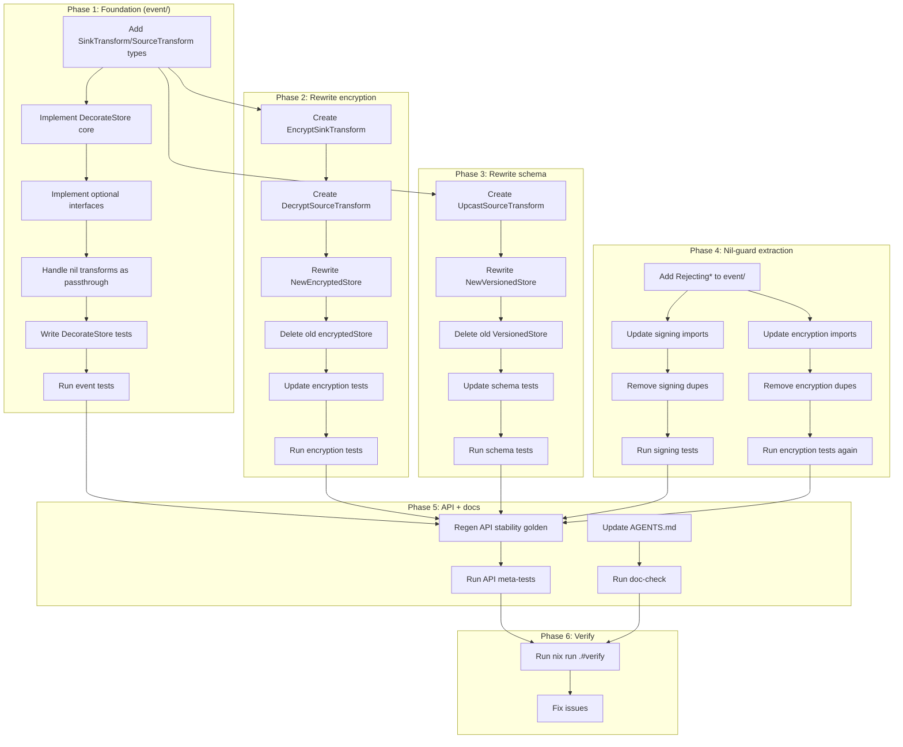

# Store Middleware Simplification

> **Goal:** Eliminate 3x duplicated store-wrapper boilerplate (~440 lines) by adding simple transform types + one `DecorateStore` helper to `event/`. Replace per-concern wrapper structs with transform functions.

## Problem

Three independent wrappers each reimplement the entire `event.Store` interface (+ optional `Journal`/`SeekableJournal`/`BackwardsSource`/`io.Closer`) with delegation boilerplate:

| Wrapper | File | Lines | What it does |
|---------|------|-------|-------------|
| `encryptedStore` | `encryption/store.go` | 241 | Encrypts on write, decrypts on read |
| `VersionedStore` | `schema/versioned_source.go` | 99 | Upcasts events on read |
| `CachedEventStore` | `system/cache.go` | 102 | Caches `Load` results (read-through) |
| **Total** | | **442** | |

Plus ~62 lines of duplicated nil-guard helpers across `encryption/middleware.go` and `signing/middleware.go`.

### Root cause

The interfaces are already correct and compositional:

```
EventSink (Save, AppendBatch)          ← write side
EventSource (Load, LoadFromVersion, …)  ← read side
Store = EventSink + EventSource         ← composite
```

But optional interfaces break composition:

```
Journal         { ReadAll }              ← NOT part of EventSource
SeekableJournal { ReadAll, ReadFrom }    ← NOT part of EventSource
BackwardsSource { EventSource + LoadBackwards }  ← extends, but adds method
```

Middleware wrapping `EventSource` can't intercept `ReadAll`/`ReadFrom`/`LoadBackwards` because they're on separate interfaces. So each wrapper manually reimplements all optional interfaces.

### Also: duplicated nil-guard helpers

`encryption/middleware.go` has unexported `rejectingPublishMiddleware` + `rejectingHandlerMiddleware`.
`signing/middleware.go` has exported `RejectingPublishMiddleware` + `RejectingHandlerMiddleware`.
Identical bodies — both create middleware that rejects with `errorfamily.NewRejection`.

## Solution

### 1. Simple transform types in `event/`

```go
// event/store_middleware.go

// SinkTransform is applied to events before persistence (write side).
type SinkTransform func([]Event) ([]Event, error)

// SourceTransform is applied to events after loading (read side).
type SourceTransform func([]Event) ([]Event, error)
```

### 2. One `DecorateStore` helper in `event/`

```go
// DecorateStore wraps a Store with write/read transforms.
// Preserves optional interfaces (Journal, SeekableJournal, BackwardsSource,
// io.Closer) by delegating to the inner store and applying the source
// transform to all read paths.
func DecorateStore(store Store, sinkT SinkTransform, sourceT SourceTransform) Store
```

`DecorateStore` is the ONE place that implements all interface methods (including optional ones). It applies `sinkT` before every write and `sourceT` after every read — including `ReadAll`, `ReadFrom`, `LoadBackwards`. ~60 lines total, replaces 440.

Nil transforms are pass-through (no allocation, no wrapping). Consumers who only need read-side or write-side pass `nil` for the other.

### 3. Concerns provide transform functions, not wrapper structs

```go
// encryption — replaces 241-line encryptedStore
func EncryptSinkTransform(cipher Encrypter, opts ...MiddlewareOption) event.SinkTransform
func DecryptSourceTransform(decipher Decrypter) event.SourceTransform

// schema — replaces 99-line VersionedStore
func UpcastSourceTransform(upcasters ...Upcaster) event.SourceTransform

// system/cache — STAYS AS-IS (caching needs interception, not transformation)
// CachedEventStore is the one case where pure transform is insufficient
// because it must skip the inner call on cache hit.
```

### 4. Backward compatibility

`NewEncryptedStore` and `NewVersionedStore` become thin wrappers calling `DecorateStore`:

```go
func NewEncryptedStore(inner event.Store, cipher EncrypterDecrypter, opts ...MiddlewareOption) (event.Store, error) {
    return event.DecorateStore(inner,
        EncryptSinkTransform(cipher, opts...),
        DecryptSourceTransform(cipher),
    ), nil
}
```

Since `encryptedStore` is unexported, changing the return type to `event.Store` is not a breaking change for external consumers.

### 5. Nil-guard helpers in `event/`

```go
// event/middleware.go (new file or addition to bus.go)
func RejectingPublishMiddleware(code, msg string) PublishMiddleware
func RejectingMiddleware(code, msg string) Middleware
```

Both `encryption` and `signing` import these instead of maintaining their own copies.

## What stays the same

- `EventSink`, `EventSource`, `Store` interfaces — unchanged
- `Journal`, `SeekableJournal`, `BackwardsSource` — unchanged
- `PublishMiddleware` / `Middleware` (bus-level) — unchanged
- `dispatcher.Dispatcher[H, M]` — unchanged
- `middleware/` generic adapters — unchanged
- `CachedEventStore` — stays as a separate wrapper (caching ≠ transform)
- All command/query middleware — unchanged

## What NOT to do (anti-verschlimmbessern)

- **Don't restructure the optional interfaces** — `Journal`/`SeekableJournal`/`BackwardsSource` are correct as separate interfaces. Merging them into `EventSource` would be a massive breaking change for no benefit.
- **Don't add `SinkMiddleware`/`SourceMiddleware` as interface-wrapping types** — they can't intercept optional interface methods, which is the whole problem. Transforms are simpler and sufficient.
- **Don't delete `CachedEventStore`** — caching needs to intercept the call (check cache before hitting inner store), not just transform the result. It's the one exception.
- **Don't change the bus middleware** — `PublishMiddleware`/`Middleware` split is justified (producer/consumer boundary).
- **Don't touch command/query middleware** — they're clean, single-pipeline, no issues.

## Pareto breakdown

### 1% that delivers 51%

Add `SinkTransform`/`SourceTransform` types + `DecorateStore` to `event/`. Rewrite `encryption/store.go` (241 lines → ~30 lines of transform functions). This eliminates the biggest wrapper and establishes the pattern.

### 4% that delivers 64%

Also rewrite `schema/versioned_source.go` (99 lines → ~20 lines). Second biggest wrapper, trivial to convert since it only transforms on read.

### 20% that delivers 80%

Extract nil-guard helpers to `event/`. Update `signing` to use shared helpers. Update all affected tests. Regenerate API stability golden.

### Remaining 20% (to 100%)

Doc updates (AGENTS.md, skill references). Doc-check. Full verify (`nix run .#verify`). Fix any edge cases.

## Comprehensive task list (sorted by impact/effort)

| # | Task | Impact | Effort | Customer Value |
|---|------|--------|--------|---------------|
| 1 | Add `SinkTransform`/`SourceTransform` types to `event/` | Critical | Low | Enables everything |
| 2 | Implement `DecorateStore` (core Store methods) | Critical | Medium | Central decoration |
| 3 | Implement `DecorateStore` optional interfaces (Journal, Seekable, Backwards, Closer) | Critical | Medium | Full coverage |
| 4 | Write `DecorateStore` tests | High | Medium | Safety net |
| 5 | Create `encryption.EncryptSinkTransform` + `DecryptSourceTransform` | Critical | Low | Replaces 241 lines |
| 6 | Rewrite `encryption.NewEncryptedStore` to use `DecorateStore` | High | Low | Backward compat |
| 7 | Update encryption store tests | High | Medium | Verify behavior |
| 8 | Create `schema.UpcastSourceTransform` | High | Low | Replaces 99 lines |
| 9 | Rewrite `schema.NewVersionedStore` to use `DecorateStore` | Medium | Low | Backward compat |
| 10 | Update schema tests | Medium | Low | Verify behavior |
| 11 | Add `RejectingPublishMiddleware` + `RejectingMiddleware` to `event/` | Medium | Low | DRY |
| 12 | Update `signing` to use `event` nil-guard helpers | Medium | Low | DRY |
| 13 | Update `encryption` to use `event` nil-guard helpers | Medium | Low | DRY |
| 14 | Run encryption tests | High | Low | Verify |
| 15 | Run schema tests | High | Low | Verify |
| 16 | Run signing tests | High | Low | Verify |
| 17 | Run event tests | High | Low | Verify |
| 18 | Regenerate API stability golden | High | Low | CI gate |
| 19 | Update AGENTS.md (internal contracts) | Low | Low | Doc accuracy |
| 20 | Run doc-check | Medium | Low | CI gate |
| 21 | Run `nix run .#verify` | Critical | Medium | Full gate |
| 22 | Fix any issues from verify | Variable | Variable | Green gate |

## Detailed task breakdown (each max 12 min)

| # | Task | Est | Depends on |
|---|------|-----|-----------|
| 1 | Add `SinkTransform`/`SourceTransform` type defs to `event/store_middleware.go` | 3 min | — |
| 2 | Add `DecorateStore` constructor + `decoratedStore` struct | 5 min | 1 |
| 3 | Implement `decoratedStore.Save` + `AppendBatch` (apply sinkT) | 5 min | 2 |
| 4 | Implement `decoratedStore.Load` + `LoadFromVersion` + `LoadToVersion` + `LoadToTimestamp` (apply sourceT) | 8 min | 2 |
| 5 | Implement `decoratedStore.ReadAll` (Journal, apply sourceT) | 5 min | 2 |
| 6 | Implement `decoratedStore.ReadFrom` (SeekableJournal, apply sourceT) | 5 min | 2 |
| 7 | Implement `decoratedStore.LoadBackwards` (BackwardsSource, apply sourceT) | 5 min | 2 |
| 8 | Implement `decoratedStore.Close` (io.Closer, delegate) | 3 min | 2 |
| 9 | Handle nil sinkT/sourceT as pass-through (no alloc) | 5 min | 2 |
| 10 | Write `TestDecorateStore_PassThrough` (nil transforms = identity) | 8 min | 9 |
| 11 | Write `TestDecorateStore_SinkTransform` (write transform applied) | 8 min | 9 |
| 12 | Write `TestDecorateStore_SourceTransform` (read transform applied) | 8 min | 9 |
| 13 | Write `TestDecorateStore_OptionalInterfaces` (Journal/Seekable/Backwards) | 10 min | 9 |
| 14 | Write `TestDecorateStore_NilInner` (constructor nil guard) | 5 min | 2 |
| 15 | Run event tests: `cd event && GOWORK=off go test ./... -count=1` | 3 min | 1-14 |
| 16 | Create `encryption.EncryptSinkTransform` func | 8 min | 1 |
| 17 | Create `encryption.DecryptSourceTransform` func | 8 min | 1 |
| 18 | Rewrite `NewEncryptedStore` to call `event.DecorateStore` | 5 min | 16, 17 |
| 19 | Delete old `encryptedStore` struct + methods from `store.go` | 5 min | 18 |
| 20 | Update `encryption/store_test.go` — adapt to new return type | 10 min | 18 |
| 21 | Run encryption tests: `cd encryption && GOWORK=off go test ./... -count=1` | 3 min | 20 |
| 22 | Create `schema.UpcastSourceTransform` func | 8 min | 1 |
| 23 | Rewrite `NewVersionedStore` to call `event.DecorateStore` | 5 min | 22 |
| 24 | Delete old `VersionedStore` struct from `versioned_source.go` | 3 min | 23 |
| 25 | Update schema tests | 8 min | 23 |
| 26 | Run schema tests: `cd schema && GOWORK=off go test ./... -count=1` | 3 min | 25 |
| 27 | Add `RejectingPublishMiddleware` to `event/middleware.go` | 5 min | — |
| 28 | Add `RejectingMiddleware` to `event/middleware.go` | 5 min | — |
| 29 | Update `signing/middleware.go` — import from `event/` | 5 min | 27, 28 |
| 30 | Remove `RejectingPublishMiddleware`/`RejectingHandlerMiddleware` from signing | 5 min | 29 |
| 31 | Update `encryption/middleware.go` — import from `event/` | 5 min | 27, 28 |
| 32 | Remove `rejectingPublishMiddleware`/`rejectingHandlerMiddleware` from encryption | 5 min | 31 |
| 33 | Run signing tests: `cd signing && GOWORK=off go test ./... -count=1` | 3 min | 30 |
| 34 | Run encryption tests again (after nil-guard change): `cd encryption && GOWORK=off go test ./... -count=1` | 3 min | 32 |
| 35 | Run event tests again (after nil-guard addition): `cd event && GOWORK=off go test ./... -count=1` | 3 min | 28 |
| 36 | Regenerate API stability: `cd cmd/api-stability && GOWORK=off go run main.go -update` | 5 min | all |
| 37 | Run API stability meta-tests: `cd cmd/api-stability && GOWORK=off go test -run TestEvery .` | 3 min | 36 |
| 38 | Update AGENTS.md internal contracts if needed | 5 min | all |
| 39 | Run doc-check: `cd cmd/doc-check && GOWORK=off go run . ../../SKILL.md ../../.agents/skills/go-cqrs-lite/references/*.md ../../AGENTS.md` | 3 min | 38 |
| 40 | Run full verify: `nix run .#verify` | 10 min | all |
| 41 | Fix any issues from verify | Variable | — | 40 |

## Execution graph



## Expected outcome

| Metric | Before | After | Delta |
|--------|--------|-------|-------|
| `encryption/store.go` | 241 lines | ~30 lines (2 transform funcs) | -211 |
| `schema/versioned_source.go` | 99 lines | ~20 lines (1 transform func) | -79 |
| `system/cache.go` | 102 lines | 102 lines (unchanged) | 0 |
| `event/store_middleware.go` | 0 lines (new) | ~60 lines | +60 |
| `event/middleware.go` nil-guards | 0 lines (new) | ~15 lines | +15 |
| Duplicated nil-guard helpers | ~62 lines | 0 lines | -62 |
| **Total** | **504 lines** | **~227 lines** | **-277 lines** |

Net reduction: **277 lines**. One central `DecorateStore` replaces 3 independent wrappers. Concerns provide transform functions, not wrapper structs.
