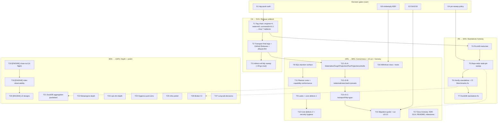

# SUPERB Pareto Execution Plan — Release Unblock → Standalone Honesty → v5 Cut → Defect Sweep

**Date:** 2026-08-15 21:03 CEST
**Author:** docs-health/pareto-planning session (post-annotation-pass)
**Status:** PLAN — awaiting execution; decision gates G1–G6 need the user
**Sources:** `TODO_LIST.md` (45 open items, 2026-08-15 state), `docs/status/2026-08-15_19-50_layout-roles-implementation-session.md` (engine session, 50 follow-ups, in flight), `ROADMAP.md` Open Questions #1–6, `docs/reviews/2026-08-14_14-25_brutal-self-review.md` (resolved verdicts), `gh run list` (CI Benchmarks RED ×3).

---

## Context (why this plan looks like this)

1. **The verify gate is GREEN (3× since `5f2198189`)** — 239 packages, lint 76/76, all auxiliary gates wired in. Code quality is not the bottleneck anymore.
2. **Consumers are running broken published code.** The `JournalReadFrom` re-delivery fix (SQL engines double-process events on resume), engine driver self-registration, and the watermill handler-independence fix all exist ONLY in the workspace behind **6 temporary `replace` directives in `system/go.mod` + 1 in `cmd/cqrs-bench/go.mod`**. Tagging is authorized-blocking (never tag/push without explicit instruction).
3. **The workspace masks standalone breakage by design.** `#verify` resolves local modules; CI runs GOWORK=off per-module — and the CI **Benchmarks job is RED (3 consecutive failures)** with a blind window of unknown length. Two skew classes (benchkit SQLITE_BUSY, command/v4.6.0 commandtest) already burned sessions.
4. **The v5 chimera persists.** Phases 1–7 shipped; Phase 8 (delete `stack/`, `RelationalProjection`, `storage/view`, `GraphProjection`, transport/*, compat shells; migration guide; cut v5.0.0) is the brutal review's #4 "REALLY BAD" and the biggest structural debt.
5. **Metaengine is the strategic future and actively evolving.** A concurrent session shipped layout-roles v1 (roles, shadow replication, promote, traces, shared collections, per-fold locks) TODAY — its tree is mid-verification (their items are owned by them, marked [ENGINE] below; do not duplicate).
6. **The brutal review's verified defect backlog** (SQL allowlists, resource leaks, core defects, planner cost model, strong types, security hygiene) is routed in TODO_LIST "Correctness Defect Sweep" — trust-critical for a library whose product IS correctness.

**Rule:** TODO_LIST.md is the living source; this plan is a point-in-time snapshot. New findings go to TODO_LIST, not here.

---

## Decision gates (user answers that unblock work — ask ONCE, early)

| Gate   | Question (ROADMAP OQ)                                                                                                                                 | Unblocks                        |
| ------ | ----------------------------------------------------------------------------------------------------------------------------------------------------- | ------------------------------- |
| **G1** | Tag + push authorization: engine v4.0.2+ ×4, watermill v4.5.0, command/v4.6.1 now, or batched with transport v4.x? Is pushing tags+master authorized? | T1, T2, T3, T15 (v5.0.0)        |
| **G2** | Go 1.26.6 repo-wide adoption or hold at 1.26.5?                                                                                                       | T25 (toolchain alignment)       |
| **G3** | SA1019 exclusion permanence (keep scoped exclusion vs migrate kvstore tests)?                                                                         | T15.4                           |
| **G4** | Stale-pin sweep policy: mechanical repo-wide bumps to latest tags allowed?                                                                            | T5, T4 (fail-on-staleness mode) |
| **G5** | Vulncheck placement (into `#verify`, CI, or manual pre-tag)?                                                                                          | T25                             |
| **G6** | Tracing JSON `omitempty` standardization (breaking change, needs ADR)?                                                                                | T16 (json/v1 fallback tests)    |

---

## Pareto Breakdown

### The 1% that delivers 51% — G1 + the tag chain (T1)

One human decision plus ~2 hours of mechanical, already-scripted execution
(`scripts/tag-release.sh`). Everything else this repo produced for two weeks
is invisible to consumers until this happens: the re-delivery fix consumers
actively suffer from, driver self-registration (GOWORK=off `unknown driver`
errors), handler independence, and the v5 cut prerequisite (transport final
tags). It also retires the 7 temporary replaces and unblocks the ~49-file
indirect-ref cleanup. **Nothing else on the list ships customer value until
G1 is answered.**

### The 4% that delivers 64% — + standalone-build honesty (T4, T5, T6, T7)

Tags are the input; honest pins are the consumers. The pin-drift meta-test
(fail when a sibling require is older than the latest tag), the repo-wide
stale-pin sweep, a standalone CI signal (`#verify-standalone` + fix the RED
Benchmarks job + leaf-module CI leg), and the DuckDB standalone fix make the
"workspace masks standalone breakage" class structurally impossible instead
of discovered-by-broken-CI. Compounds with T1: every future release becomes
gate-enforced instead of archaeology.

### The 20% that delivers 80% — + correctness + the v5 cut + honesty (T8–T17)

- **Correctness Defect Sweep (T8–T11):** SQL injection surface, resource
  leaks, core defects, planner cost honesty, capability conformance (stop
  engines declaring what they don't implement), security hygiene. A library
  lives and dies on this.
- **v5 Phase 8 (T12–T15):** delete the chimera — both composition roots,
  deprecated shells, transport modules; migration guide; cut v5.0.0.
- **WithActor hardening (T16):** consumer-facing docs + the test-gap batch
  for the newest shipped API.
- **Docs honesty (T17):** ADR-0114 one-truth reconciliation, README honesty,
  SESSION_MILESTONES, module counts, reference recipe gaps.

### The other 80% (to 100%) — depth, polish, and the engine session's lane

Metaengine depth (T21, T22): DuckDB aggregation pushdown, seq-carrying reads,
ReplanLayout convergence, calibrations, multi-engine test, Dgraph hardening.
cqrs-lint depth (T23). Infrastructure polish + hygiene quick-wins (T24, T25).
Broker CI wiring (T26). Long-tail decisions (T27). The engine session's own
close-out + v2 roadmap (T18–T20) — **owned by the concurrent session; this
plan tracks, never duplicates.**

---

## Medium-granularity plan (30–100 min per task, ALL TODOs, sorted by impact)

Impact: 🔥 critical / high / medium. Value: customer-facing (C) / trust (T) / dev-experience (D).

| #   | Task                                                                                                                                                                                                                                    | Tier    | Impact | Effort | Value | Depends             | Owner          |
| --- | --------------------------------------------------------------------------------------------------------------------------------------------------------------------------------------------------------------------------------------- | ------- | ------ | ------ | ----- | ------------------- | -------------- |
| T1  | Tag chain: pre-tag checklist → tag engines ×4 v4.0.2+, watermill v4.5.0, command/v4.6.1 → push → drop 7 replaces → standalone re-verify                                                                                                 | **1%**  | 🔥     | 100m   | C     | G1                  | this           |
| T2  | Transport final v4.x patch tags + GitHub Releases (9 modules) + pkg.go.dev triggers                                                                                                                                                     | 1%      | 🔥     | 60m    | C     | T1, G1              | this           |
| T3  | Indirect-ref tidy sweep (~49 go.mod) + verify zero stale shim refs                                                                                                                                                                      | 4%      | high   | 90m    | C+D   | T1                  | this           |
| T4  | Pin-drift meta-test (sibling require vs latest tag; fail on staleness)                                                                                                                                                                  | **4%**  | 🔥     | 90m    | T     | T1 (tags exist), G4 | this           |
| T5  | Repo-wide stale-pin sweep (~50 go.mod, mechanical, gate-verified)                                                                                                                                                                       | 4%      | 🔥     | 90m    | T     | G4, T4              | this           |
| T6  | Standalone CI signal: size Benchmarks red window, fix failures, `#verify-standalone` app, leaf-module CI leg                                                                                                                            | 4%      | 🔥     | 100m   | T     | T5                  | this           |
| T7  | `system/integration` DuckDB standalone failure (replace or driver guard)                                                                                                                                                                | 4%      | high   | 30m    | T     | —                   | this           |
| T8  | SQL injection surface: FilterOp/column allowlists, ORDER BY quoting, DSN redaction (turso)                                                                                                                                              | **20%** | 🔥     | 90m    | T     | —                   | this           |
| T9  | Resource leaks (sqlite/turso Close) + core defects 1 (singleflight ctx, per-handler middleware, audit RequestIDs, Pagination underflow)                                                                                                 | 20%     | 🔥     | 100m   | T     | —                   | this           |
| T10 | Core defects 2 (kv.Cache shared *T, TypedQueryStore codec, ErrBinaryNotFound) + security hygiene (SECURITY.md, release.yml vulncheck, iroh pin)                                                                                         | 20%     | high   | 90m    | T     | —                   | this           |
| T11 | Planner cost model (branching^depth, volume default, selectivity) + capability conformance test + fix 6 over-declaring engines                                                                                                          | 20%     | 🔥     | 100m   | T     | —                   | this           |
| T12 | v5 batch A: delete Materialize, GraphProjection, RunProjections, ADR-0126 compat shells                                                                                                                                                 | 20%     | high   | 90m    | C     | T2 (transport tags) | this           |
| T13 | v5 batch B: delete storage/relational + storage/view, stack.Bundle + 8 presets + stack/                                                                                                                                                 | 20%     | high   | 100m   | C     | T12                 | this           |
| T14 | v5 batch C: delete transport/http + grpc + registry sweeps (go.work/flake/api-stability/AGENTS/FEATURES)                                                                                                                                | 20%     | high   | 60m    | C     | T2                  | this           |
| T15 | v5 migration guide + SA1019 decision + CHANGELOG/README/SKILL + cut v5.0.0                                                                                                                                                              | 20%     | 🔥     | 100m   | C     | T12–T14, G3, G1     | this           |
| T16 | WithActor hardening: skill docs (core.md/modules.md) + golden/CBOR/SQL/pebble/wire tests + e2e propagation + ecosystem (scenario, scheduling, deriver, ctx middleware, Validate)                                                        | 20%     | high   | 100m   | C     | G6 (json tests)     | this           |
| T17 | Docs honesty: ADR-0114 one truth, README table rewrite + dedupe dup TODO, SESSION_MILESTONES, integration/README, recipes gaps, README go-codec mention                                                                                 | 20%     | high   | 90m    | C     | —                   | this           |
| T18 | [ENGINE] Close-out: derefStructType panic, race baselines, fmt/lint, golden regen, TODO/CHANGELOG/ADR/recipes updates, gates, dependent-module retests                                                                                  | 20%     | 🔥     | 100m   | T     | —                   | engine session |
| T19 | [ENGINE] Roles observability: Doctor Replication section, EXPLAIN shadows, role column, tunables, lag EWMA, DemoteEngine, sqlite/PG replication tests                                                                                   | 80%     | high   | 100m   | C     | T18                 | engine session |
| T20 | [ENGINE] v2 designs: durable replication queue, cross-process transport, trace pacing + cqrs-bench trace CLI, benchkit replay, SharedCollection materialization                                                                         | 80%     | medium | 100m   | C     | T19                 | engine session |
| T21 | DuckDB aggregation pushdown: AggregateReader + GROUP BY pushdown + CounterGet offload + before/after bench                                                                                                                              | 80%     | high   | 100m   | C     | —                   | this           |
| T22 | Metaengine depth: seq-carrying reads, ReplanLayout convergence, DuckDB tie + Row calibrations, two-backend test, Dgraph hardening                                                                                                       | 80%     | medium | 4×100m | C     | —                   | this           |
| T23 | cqrs-lint: E005 + taskmanager golden, per-module regression tests (F004–B030), wishlist (--doctor --fix et al.), exclusion audit                                                                                                        | 80%     | medium | 100m   | D     | —                   | this           |
| T24 | Hygiene quick-wins: doc-check tripwire, quickstart CI, junk + stash deletion, heap-contract enforcement, fmt-vs-gci fix, benchkit wall-clock audit, duckdb split, art-dupl hygiene, check-coverage hardening, backuptest wire-or-delete | 80%     | medium | 100m   | D     | —                   | this           |
| T25 | Infra polish: devShell tools, #check-lint-config, #verify-ci, #sweep wiring, register.go consolidation ×7, macOS ephemeral-pg                                                                                                           | 80%     | medium | 100m   | D     | G2, G5              | this           |
| T26 | Broker CI: #integration-redis app + CI wiring + broker-edge tests (redelivery, rebalance, size limits)                                                                                                                                  | 80%     | medium | 90m    | T     | —                   | this           |
| T27 | Long-tail decisions: per-module CHANGELOG policy, DecorateJournal, brandedString, one-bench-system consolidation, ROADMAP OQ triage                                                                                                     | 80%     | low    | 100m   | D     | —                   | this           |

---

## Fine-granularity plan (≤12 min per task, sorted by tier then impact)

### Tier 1% — release unblock (T1–T3)

| ID    | Fine task                                                                                  | Min |
| ----- | ------------------------------------------------------------------------------------------ | --- |
| F1.1  | Ask G1 (tag+push authorization, standalone vs batched) — decision gate                     | 2   |
| F1.2  | Baseline: confirm clean-enough tree, full `#verify` GREEN, capture log                     | 12  |
| F1.3  | Pre-tag: `nix run .#vulncheck` (per-module standalone)                                     | 12  |
| F1.4  | Pre-tag: `#check-arch` + review budget output                                              | 5   |
| F1.5  | Pre-tag: GOWORK=off `go test ./...` on each engine module + test subpackages               | 12  |
| F1.6  | Tag sqliteengine/badgerengine/pebbleengine/pgengine v4.0.2 (tag-release.sh dry-run → real) | 12  |
| F1.7  | Tag watermill/v4.5.0 + command/v4.6.1                                                      | 8   |
| F1.8  | Push tags+master; verify proxy serves (scratch dir, `GOPROXY=off go get`)                  | 12  |
| F1.9  | Remove 6 system + 1 cqrs-bench replaces; `go mod tidy`; standalone re-verify               | 12  |
| F1.10 | Update TODO_LIST Release section (mark done, keep transport item)                          | 5   |
| F2.1  | Tag transport/http final v4.x (deprecation notice in README)                               | 10  |
| F2.2  | Tag transport/grpc final v4.x                                                              | 10  |
| F2.3  | `gh release create` ×9 with curated notes                                                  | 12  |
| F2.4  | pkg.go.dev fetch triggers; verify docs render                                              | 8   |
| F3.1  | `go get -u` sweep over ~49 consumer go.mod files                                           | 12  |
| F3.2  | Fix tidy stragglers + GOWORK=off build spot-checks                                         | 12  |
| F3.3  | Verify zero `go-cqrs-lite/{codec,retry,idempotency,flightrecorder}` indirect refs          | 8   |

### Tier 4% — standalone honesty (T4–T7)

| ID   | Fine task                                                                          | Min |
| ---- | ---------------------------------------------------------------------------------- | --- |
| F4.1 | Meta-test skeleton: `TestSiblingPinsAreCurrent` in cmd/api-stability               | 12  |
| F4.2 | Implement latest-tag lookup (`git tag -l` sort -V) vs require comparison           | 12  |
| F4.3 | Exemption list (new/untagged modules) + clear failure output                       | 12  |
| F4.4 | Wire into suite; green run                                                         | 8   |
| F5.1 | Ask G4 (sweep policy) — decision gate                                              | 2   |
| F5.2 | Mechanical bump sweep batch 1 (~17 go.mod) + tidy                                  | 12  |
| F5.3 | Sweep batch 2 (~17) + tidy                                                         | 12  |
| F5.4 | Sweep batch 3 (~16) + tidy                                                         | 12  |
| F5.5 | Full verify + standalone spot-checks (benchkit, system, integration)               | 12  |
| F6.1 | `gh run list`/`gh run view`: size the Benchmarks red window                        | 5   |
| F6.2 | Fix benchkit standalone failures (post-sweep should be green; else root-cause)     | 12  |
| F6.3 | Add `#verify-standalone` nix app (GOWORK=off per module)                           | 12  |
| F6.4 | Add CI leaf-module standalone leg (integration/, examples/, benchkit/)             | 12  |
| F6.5 | Re-run CI; confirm Benchmarks green                                                | 12  |
| F7.1 | Reproduce DuckDB standalone failure; add duckdbengine replace or driver-name guard | 12  |
| F7.2 | Standalone green confirmation                                                      | 5   |

### Tier 20% — correctness, v5 cut, hardening (T8–T17)

| ID    | Fine task                                                                                                                            | Min |
| ----- | ------------------------------------------------------------------------------------------------------------------------------------ | --- |
| F8.1  | Column allowlist in `storage/sql/where.go`                                                                                           | 12  |
| F8.2  | FilterOp strict validation                                                                                                           | 12  |
| F8.3  | Quote ORDER BY columns (`storage/view/query.go:137`)                                                                                 | 12  |
| F8.4  | Injection regression tests (malicious identifiers/filters)                                                                           | 12  |
| F8.5  | Redact DSNs from `tursoengine/register.go` errors                                                                                    | 8   |
| F8.6  | DSN-redaction tests                                                                                                                  | 8   |
| F9.1  | sqlite/turso self-opened `*sql.DB` Close() ownership fix                                                                             | 12  |
| F9.2  | Close-propsagation regression tests                                                                                                  | 12  |
| F9.3  | singleflight leader-ctx capture fix (`decider/load.go`)                                                                              | 12  |
| F9.4  | Per-handler command middleware (`memory_bus.go`)                                                                                     | 12  |
| F9.5  | Real RequestIDs in query audit (`audit.go`)                                                                                          | 10  |
| F9.6  | `Pagination.Offset()` underflow guard                                                                                                | 8   |
| F9.7  | Tests for F9.3–F9.6                                                                                                                  | 12  |
| F10.1 | `kv.Cache` shared `*T` copy-on-write fix                                                                                             | 12  |
| F10.2 | TypedQueryStore codec respect (`query/typed.go`)                                                                                     | 12  |
| F10.3 | `event.ErrBinaryNotFound`: document or delete                                                                                        | 8   |
| F10.4 | SECURITY.md v-table refresh                                                                                                          | 12  |
| F10.5 | release.yml govulncheck fail-loud + drop iroh fork pin                                                                               | 12  |
| F11.1 | Planner graph cost `branching^depth`                                                                                                 | 12  |
| F11.2 | Planner volume without silent default                                                                                                | 10  |
| F11.3 | Planner filter selectivity                                                                                                           | 12  |
| F11.4 | Capability conformance test (Supports vs implemented interfaces)                                                                     | 12  |
| F11.5 | Fix the 6 over-declaring engines; honest DEGRADED diagnostics                                                                        | 12  |
| F12.1 | Delete `stack.Materialize` + importers                                                                                               | 12  |
| F12.2 | Delete `graph.GraphProjection`                                                                                                       | 10  |
| F12.3 | Delete `stack.RunProjections`                                                                                                        | 10  |
| F12.4 | Delete ADR-0126 compat shells + compat alias tests                                                                                   | 12  |
| F12.5 | Golden regen + `#verify-fast`                                                                                                        | 12  |
| F13.1 | Delete `storage/relational` + `storage/view`                                                                                         | 12  |
| F13.2 | Delete `stack/` module + 8 presets                                                                                                   | 12  |
| F13.3 | Fix remaining importers (system, examples, docs)                                                                                     | 12  |
| F13.4 | go.work + flake testModules + api-stability list sweeps                                                                              | 12  |
| F14.1 | Delete `transport/http` + `transport/grpc`                                                                                           | 12  |
| F14.2 | Sweep AGENTS/FEATURES/SKILL references                                                                                               | 12  |
| F14.3 | Golden regen + verify                                                                                                                | 12  |
| F15.1 | Migration guide: stack presets → `system.System`                                                                                     | 12  |
| F15.2 | Migration guide: v1 tiers → v5                                                                                                       | 12  |
| F15.3 | Migration guide: transport → watermill/go-sse; relational → metaengine                                                               | 12  |
| F15.4 | Ask G3 (SA1019) + apply decision                                                                                                     | 8   |
| F15.5 | CHANGELOG/README/SKILL v5 updates                                                                                                    | 12  |
| F15.6 | Ask G1-v5 + full verify + tag v5.0.0 wave                                                                                            | 12  |
| F16.1 | `core.md` WithActor options section                                                                                                  | 10  |
| F16.2 | `modules.md` Tracing fields                                                                                                          | 8   |
| F16.3 | Golden JSON: full event + command with ActorID                                                                                       | 12  |
| F16.4 | CBOR roundtrip + SQL MarshalMetadata scan tests                                                                                      | 12  |
| F16.5 | pebble/bbolt encode/decode + watermill wire preservation                                                                             | 12  |
| F16.6 | e2e decider (cmd→events) + projection (events→read) ActorID propagation                                                              | 12  |
| F16.7 | Scenario DSL actor + scheduling/deriver/commandlifecycle propagation + ctx middleware + `Validate()`                                 | 12  |
| F17.1 | ADR-0114: decide one truth (land DeletePolicy or rewrite 5 docs)                                                                     | 12  |
| F17.2 | Apply the one truth across FEATURES/CHANGELOG/AGENTS/guide/DOMAIN_LANGUAGE                                                           | 12  |
| F17.3 | README feature-table rewrite (lead with what consumers import)                                                                       | 12  |
| F17.4 | Dedupe TODO_LIST duplicate README-honesty items (lines ~401 vs ~408)                                                                 | 5   |
| F17.5 | SESSION_MILESTONES revive-or-retire + module-count sweep (82)                                                                        | 12  |
| F17.6 | integration/README suite enumeration + recipes gaps (drain pattern, WithoutViewAutoMigrate, Increment FAQ) + README go-codec mention | 12  |

### Tier 80% — depth, polish, engine lane (T18–T27)

| ID     | Fine task                                                                                                    | Min |
| ------ | ------------------------------------------------------------------------------------------------------------ | --- |
| F18.1  | [ENGINE] Fix `derefStructType`/`sharedTypesInResult` Elem() panic                                            | 12  |
| F18.2  | [ENGINE] metaengine `-race -count=1` GREEN baseline                                                          | 12  |
| F18.3  | [ENGINE] fold-lock + replicator suites `-race -count=3`                                                      | 12  |
| F18.4  | [ENGINE] fmt + lint on new files                                                                             | 12  |
| F18.5  | [ENGINE] api-stability golden regen + meta-tests                                                             | 12  |
| F18.6  | [ENGINE] TODO/CHANGELOG/ADR-0124/recipes + v5-plan T29–T35 status updates                                    | 12  |
| F18.7  | [ENGINE] check-coverage + check-duplication + `#verify-fast` exclusive                                       | 12  |
| F18.8  | [ENGINE] system + projectionadapter + pebbleengine retests; doctor section/store.go size/gosec/golden checks | 12  |
| F19.1  | [ENGINE] Doctor `--- Replication ---` section                                                                | 12  |
| F19.2  | [ENGINE] EXPLAIN shadow annotation + role column in GetEngineStats                                           | 12  |
| F19.3  | [ENGINE] Tunables: replicationOpTimeout/buffer options (ask their G)                                         | 12  |
| F19.4  | [ENGINE] Lag EWMA in ReplicationStatus                                                                       | 12  |
| F19.5  | [ENGINE] DemoteEngine (Active→Backup, unroute sequencing)                                                    | 12  |
| F19.6  | [ENGINE] sqlite concurrent-apply + PG remote-shadow tests                                                    | 12  |
| F20.1  | [ENGINE] Durable replication queue design (§3.5)                                                             | 12  |
| F20.2  | [ENGINE] Cross-process replication transport design                                                          | 12  |
| F20.3  | [ENGINE] Trace pacing mode + result-count capture                                                            | 12  |
| F20.4  | [ENGINE] cqrs-bench `trace` subcommand                                                                       | 12  |
| F20.5  | [ENGINE] benchkit StoreTraceSink replay integration                                                          | 12  |
| F20.6  | [ENGINE] SharedCollection materialization + enforcement designs                                              | 12  |
| F21.1  | `AggregateReader` interface design                                                                           | 12  |
| F21.2  | DuckDB GROUP BY/SUM/AVG pushdown implementation                                                              | 12  |
| F21.3  | Pushdown edge cases (empty, GROUP BY keys, HAVING)                                                           | 12  |
| F21.4  | CounterGet → pushdown; before/after benchmark                                                                | 12  |
| F22.1  | Seq-carrying reads API (`JournalReadAllWithSeq`/`StreamLogEntry{Seq}`)                                       | 12  |
| F22.2  | SQL engines resume on true seqs (index seek)                                                                 | 12  |
| F22.3  | Adapter migration + interleaved-collections perf test                                                        | 12  |
| F22.4  | `ReplanLayout` → `Store.Replan` convergence                                                                  | 12  |
| F22.5  | Convergence fallout: tests + audit trail continuity                                                          | 12  |
| F22.6  | DuckDB Columnar 60s disk calibration (tie-break)                                                             | 12  |
| F22.7  | SQLite Row-layout calibration                                                                                | 12  |
| F22.8  | Postgres Row-layout calibration                                                                              | 12  |
| F22.9  | MySQL Row-layout calibration                                                                                 | 12  |
| F22.10 | Multi-engine two-live-backend integration test                                                               | 12  |
| F22.11 | Dgraph: RunInTx or ADR-why-not + per-test collection isolation                                               | 12  |
| F22.12 | Dgraph: test-all-backends + CI matrix wiring                                                                 | 12  |
| F23.1  | E005 learns `system.RegisterCommand`                                                                         | 12  |
| F23.2  | Regenerate taskmanager golden (kills 10 false positives)                                                     | 8   |
| F23.3  | Per-module regression tests batch 1 (F004, F007, F009)                                                       | 12  |
| F23.4  | Batch 2 (F012, F017, F023–F029, B030)                                                                        | 12  |
| F23.5  | Wishlist: `--doctor --fix`                                                                                   | 12  |
| F23.6  | Wishlist: stale-suppression default + config-disabled in health + C008 profiles                              | 12  |
| F23.7  | `.golangci.yml` exclusion audit (system/cqrs-lint/metaengine)                                                | 12  |
| F24.1  | Doc-check 0-warning CI tripwire                                                                              | 8   |
| F24.2  | `example/metaengine-quickstart` into flake examplePaths/CI                                                   | 8   |
| F24.3  | Delete junk: `t/`, `result/`, `reports/*`, orphaned `stash@{0}`                                              | 10  |
| F24.4  | Heap-measurement contract enforcement (check script or cqrs-lint rule)                                       | 12  |
| F24.5  | nix fmt vs gci tooling-level fix                                                                             | 12  |
| F24.6  | benchkit wall-clock assertions audit (`raceEnabled` @ :821)                                                  | 12  |
| F24.7  | duckdbengine suite split (soak → own budget)                                                                 | 12  |
| F24.8  | art-dupl: accept directives at 9 sites + clean-tree re-pin                                                   | 12  |
| F24.9  | check-coverage hardening (EXPECTED meta-test + date auto-stamp)                                              | 12  |
| F24.10 | storage/backuptest: wire into bbolt/pebble or delete                                                         | 12  |
| F25.1  | devShell tools (dprint, go-licenses, vulnix) — kills `--no-verify`                                           | 12  |
| F25.2  | `#check-lint-config` nix app                                                                                 | 12  |
| F25.3  | `#verify-ci` nix app (GOWORK=off mirror)                                                                     | 12  |
| F25.4  | Wire `#sweep` to pre-commit/cron                                                                             | 10  |
| F25.5  | Engine register.go consolidation (7 modules, batch 1)                                                        | 12  |
| F25.6  | register.go batch 2 + verify                                                                                 | 12  |
| F25.7  | macOS ephemeral-pg verification (G2-dependent toolchain note)                                                | 12  |
| F26.1  | `#integration-redis` nix app (mirror #integration-pg)                                                        | 12  |
| F26.2  | Wire Redis roundtrip into CI                                                                                 | 10  |
| F26.3  | Broker-edge test: redelivery duplicates                                                                      | 12  |
| F26.4  | Broker-edge tests: consumer-group rebalance + size limits                                                    | 12  |
| F27.1  | Per-module CHANGELOG policy decision + document                                                              | 12  |
| F27.2  | `DecorateJournal` for VersionedSeekableJournal                                                               | 12  |
| F27.3  | DecorateJournal tests + ADR-0126 note update                                                                 | 12  |
| F27.4  | brandedString decision (drop or extract)                                                                     | 10  |
| F27.5  | One-bench-system: delete redundant harnesses                                                                 | 12  |
| F27.6  | One-bench-system: CI regression breach-fail                                                                  | 12  |
| F27.7  | ROADMAP OQ triage: present G1–G6 once, record answers                                                        | 12  |

**Totals:** 27 medium tasks · 131 fine tasks · ≈23h fine-grained work (≈2.5 focused days; the 1%+4% tiers alone ≈6h once G1/G4 are answered).

---

## Mermaid execution graph

**Critical path:** G1 → T1 → T2 → {T3, T12→T13→T14→T15} — the v5 cut. Everything else runs parallel after its gate.

---

## Verification protocol (per tier)

- **1%/4%:** every tag verified via `git tag --contains` + scratch-dir `GOPROXY=off go get`; standalone builds green per module; CI Benchmarks job green; pin-drift meta-test merged and green.
- **20%:** `nix run .#verify` after each task batch; golden regen in the same edit; injection/redaction tests prove the fix; v5 cut ends with a full verify + fresh example walkthroughs.
- **80%:** per-task tests + gates; no `#verify` regression; benchmarks where the task is perf-shaped (before/after numbers in CHANGELOG).

## Non-goals / guards

- Never tag, push, or cut without G1 (standing repo policy).
- Do not touch the engine session's in-flight files (metaengine/*, system/go.mod until they land); T18–T20 are theirs.
- No Verschlimmbesserung: deletions in T12–T14 are ADR-0123-sanctioned only; every fix keeps public API stable unless the v5 cut says otherwise.
