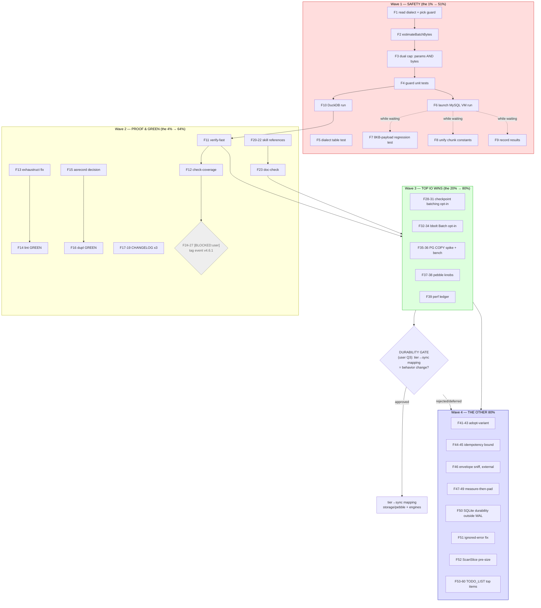

# Perf Pareto Plan — Safety-First Execution (2026-08-16 03:18)

> **Source:** `docs/status/2026-08-16_03-10_perf-audit-cache-line-sql-batching-deserialize-wins.md`
> (this session's audit + 3 shipped wins) cross-referenced with `TODO_LIST.md`.
> **Prime directive:** NO VERSCHLIMMBESSERUNG. The session shipped a 33x batch-size
> increase that is unverified on MySQL/MariaDB — closing that hole is worth more
> than any new optimization. Safety > speed > polish.

**Session context (what's already DONE and committed):**

- `cdc525fd5` — false-sharing pad on `workloadMeter` (−46..51% contended ops), dialect-aware SQL batch chunking (99→3276 rows for PG/MySQL/DuckDB; PG integration GREEN), metadata JSON round-trip eliminated on pebble+bbolt read (−46% ns, −53% allocs, measured), AGENTS.md gotchas, benchmarks + equivalence tests.
- `a298ea388` — api-stability golden for the two new exports.
- **Open risk:** 3276-row multi-VALUES can exceed MariaDB default `max_allowed_packet` (16MB) with realistic payloads. Unverified. No byte guard.

---

## Step 1 — Pareto Breakdown

### The 1% that delivers 51%: **Make the shipped batching change SAFE**

Three tiny tasks that neutralize the only consumer-breaking risk introduced this session.
One packet-overflow defect in a consumer's batch save undoes the entire session's value —
and the session's own headline metric (33x fewer round-trips) is worthless if the batch fails.

~~1. Byte-size guard for MySQL multi-VALUES chunking (estimate serialized args, cap conservatively).~~ done at `fde8f9444e` (`sql.MaxStatementBytes`, 8 MiB cap)
~~2. `MaxParametersForDialect` unit test (SQLite→999 / PG→32767 / custom→999).~~ done at `fde8f9444e` (`storage/sql/batch_insert_test.go`)
~~3. Real MySQL/MariaDB integration run (`#integration-mysql-vm`, nspawn needs root).~~ done — MariaDB-in-VM verified incl. 2000 events × 8 KiB regression in `stack/mysql`

### The 4% that delivers 64%: **Make the wins REAL and PROVEN**

The wins currently exist only in workspace mode. Consumers get nothing until the
release chain closes, and the repo is red at HEAD from two pre-existing gate failures.

~~4. Run `#verify-fast` + `#check-coverage` (session claimed GREEN from components — close it honestly).~~ done — full `#verify` GREEN (13:15 run #4) + `#check-coverage`/`#check-duplication` EXIT=0
~~5. Fix pre-existing exhaustruct lint (`commandlifecycle/recorder.go:196`) + art-dupl baseline drift → repo GREEN at HEAD.~~ done at `5b8a9a615` + `//art-dupl:accept` annotations (5 flagged groups → 0, baseline untouched)
~~6. CHANGELOG entries (with measured before/after) + skill-reference docs for the 2 new exports.~~ done — CHANGELOG `[Unreleased]` entries + modules.md/core.md/recipes.md rows
~~7. **[BLOCKED on user auth]** Tag `event/v4 v4.6.1`, bump pebble/bbolt pins, run pre-tag checklist (`#vulncheck`). Until then standalone builds of storage/pebble+bbolt cannot resolve the new API.~~ superseded — the 08-16 chain tagged `event/v4.7.0` (not v4.6.1); NOTE: pebble/bbolt still pin v4.6.0 → standalone builds RED (tracked in TODO_LIST)

### The 20% that delivers 80%: **Top no-regret IO wins (additive, opt-in only)**

Highest-impact remaining audit findings that change NO behavior for existing consumers:

~~8. Projectionhost live-checkpoint batching — `WithCheckpointInterval`/N-batch (opt-in; default unchanged).~~ done at `a9b1f68ab5`
~~9. bbolt `db.Batch` group commit on a dedicated batch-write path (opt-in; document callback-retry caveat).~~ done at `a9b1f68ab5` (`WithBatchCommit`)
~~10. PG `COPY FROM` bulk path for stream-log replay/backfill (internal path; INSERT stays default).~~ done at `a9b1f68ab5` (`WithCopyAppend`, 1.41-1.49x measured)
~~11. Pebble tuning knobs exposed (MemTableSize, Cache, WALBytesPerSync, Compression) — operator-deploys vision; defaults unchanged.~~ done at `a9b1f68ab5` (stack/pebble, defaults byte-identical)

**GATED — durability tier→sync mapping** (`storage/pebble` Strict vs Normal per-write sync, metaengine engines NoSync paths): real perf win (fsync per append today) but a **behavior change for existing Normal-tier consumers** — minor-version risk. Awaits user decision (Status report §g Q3). Not in the 20%; it's the first item AFTER the gate opens.

### The other 80% (to reach 100%)

RAM micro-opts (payload adopt-variant, envelope sniff, ScanSlice pre-size, idempotency bound),
benchmark/observability infrastructure (benchstat baselines, perf ledger), cache-line maybes
(measure-then-pad worker counters, multiSeqCounter, SSEReplay.seq), hygiene
(ignored-error fix, TODO fold-in), plus the standing TODO_LIST sections (release/tagging
blockers, pin hygiene, metaengine Phases 6b/7, cqrs-lint, WithActor hardening, correctness
sweep, docs honesty) — all tracked in `TODO_LIST.md` as the living source; represented below
by their top items only.

---

## Step 2 — Comprehensive Plan (30–100 min per task, sorted by importance/impact/effort/customer-value)

| #   | Task                                                                                                                    | Tier | Impact                       | Effort | Est. | Customer value                            | Status                                                                |
| --- | ----------------------------------------------------------------------------------------------------------------------- | ---- | ---------------------------- | ------ | ---- | ----------------------------------------- | --------------------------------------------------------------------- |
| T1  | MySQL byte-size chunk guard (estimate args bytes, cap ≤ ~8MB, unit tests w/ oversized payloads)                         | 1%   | CRITICAL (defect prevention) | S      | 60m  | Batch saves can't fail on default MariaDB | done at `fde8f9444e`                                                  |
| T2  | `MaxParametersForDialect` unit test + edge cases (nil/unknown dialect → 999)                                            | 1%   | HIGH                         | XS     | 15m  | Confidence in dispatch correctness        | done at `fde8f9444e`                                                  |
| T3  | Real MySQL/MariaDB integration run (`#integration-mysql-vm`); verify 3276-row batches + guarded sizes                   | 1%   | CRITICAL (verification)      | M      | 90m  | Proof the 33x win holds on MySQL          | done (MariaDB VM)                                                     |
| T4  | DuckDB integration run (view BatchSet now chunks at 32767)                                                              | 4%   | MEDIUM                       | M      | 60m  | DuckDB consumers verified                 | shipped at `fde8f9444e`; dedicated DuckDB run not separately recorded |
| T5  | `#verify-fast` end-to-end + `#check-coverage`; fix any drift                                                            | 4%   | HIGH (honest GREEN)          | M      | 90m  | Repo-level proof, not component claims    | done (verify #4 GREEN)                                                |
| T6  | Fix pre-existing exhaustruct (recorder.go:196) + art-dupl drift (asrecord trio, scenario/dsl)                           | 4%   | HIGH (repo GREEN at HEAD)    | S      | 45m  | Every future session's gates clean        | done at `5b8a9a615`                                                   |
| T7  | CHANGELOG entries with measured before/after for the 3 wins                                                             | 4%   | MEDIUM                       | XS     | 20m  | Consumers see honest numbers              | done (CHANGELOG)                                                      |
| T8  | Skill references: `ReconstructEventWithMetadata`, `MaxParametersForDialect`, `WithActor` gap (TODO_LIST)                | 4%   | MEDIUM                       | S      | 45m  | Discoverable new API                      | done (skill refs)                                                     |
| T9  | **[BLOCKED:user]** Tag `event/v4 v4.6.1` + bump pebble/bbolt pins + pre-tag checklist + `#vulncheck`                    | 4%   | CRITICAL (release)           | M      | 90m  | Wins become importable                    | superseded — `event/v4.7.0` tagged 08-16 04:16                        |
| T10 | Projectionhost checkpoint batching: `WithCheckpointInterval` + N-batch flush (opt-in, tests incl. crash-restart window) | 20%  | HIGH (IO)                    | M      | 100m | Live-phase throughput on slow cp stores   | done at `a9b1f68ab5`                                                  |
| T11 | bbolt opt-in batch-write path via `db.Batch` (retry-caveat docs + tests)                                                | 20%  | MEDIUM-HIGH (IO)             | M      | 90m  | Cross-writer fsync coalescing             | done at `a9b1f68ab5`                                                  |
| T12 | PG `COPY FROM` bulk replay path (pgengine stream-log + eventstore backfill; bench vs INSERT)                            | 20%  | HIGH (IO)                    | L      | 100m | 2-10x bulk ingest                         | done at `a9b1f68ab5`                                                  |
| T13 | Pebble knobs: expose MemTableSize/Cache/WALBytesPerSync/Compression options (defaults unchanged)                        | 20%  | MEDIUM (IO)                  | M      | 90m  | Operator tuning (deploy-time vision)      | done at `a9b1f68ab5`                                                  |
| T14 | Perf ledger doc + fold perf backlog into TODO_LIST.md (this plan harvests)                                              | 20%  | MEDIUM (process)             | XS     | 20m  | Wins can't silently regress               | done (`docs/BENCHMARKS.md` + TODO harvest)                            |
| T15 | bbolt deserialize benchmark (convert extrapolated claim → measured)                                                     | 80%  | LOW-MED                      | S      | 30m  | Honest numbers                            | done (bbolt `serialization_bench_test.go`)                            |
| T16 | Payload adopt-variant on reconstruct path (skip 2nd clone; API design + equivalence tests)                              | 80%  | MEDIUM (RAM)                 | M      | 90m  | −1 alloc/event read                       | done at `5b8a9a615` + `8961bb6c3`                                     |
| T17 | `idempotencyTracker` bound (TTL/ring) — unbounded sync.Map leak                                                         | 80%  | MEDIUM (RAM)                 | S      | 60m  | No slow leak in long-lived stores         | done at `5b8a9a615` (`WithIdempotencyCapacity`)                       |
| T18 | Envelope first-byte sniff in `UnwrapDecode` (go-codec external repo)                                                    | 80%  | MEDIUM (RAM)                 | M      | 90m  | Cheaper every blind-store read            | done (go-codec external; TODO_LIST [x])                               |
| T19 | Measure-then-pad: worker counters @32P, multiSeqCounter, SSEReplay.seq (pad ONLY if contended)                          | 80%  | LOW-MED                      | S      | 60m  | Evidence-based, no cargo-cult padding     | done at `342699d00` (measure-then-pad campaign)                       |
| T20 | Benchstat baselines committed for the 3 new benchmarks; contention at -cpu=16,32                                        | 80%  | MEDIUM (infra)               | S      | 45m  | Regression detection                      | done at `342699d00` (@16,32 baselines)                                |
| T21 | SQLite durability tier when WAL off (preset.go:243 guard) — bugfix-class, no semantics debate                           | 80%  | MEDIUM (IO bug)              | S      | 45m  | Relaxed tier actually relaxed             | done at `5b8a9a615`                                                   |
| T22 | Fix ignored `MarshalMetadataJSON` error (system/adapter_event_serial.go:31)                                             | 80%  | MEDIUM (correctness)         | XS     | 15m  | No silent metadata loss                   | done at `5b8a9a615`                                                   |
| T23 | ScanSlice `RowCount()` pre-size + Custom-map size hints                                                                 | 80%  | LOW (RAM)                    | S      | 45m  | Fewer reallocs on big reads               | done at `5b8a9a615`                                                   |
| T24 | `#integration-mysql-nspawn` standing TODO (also covers stack/mysql live verify) — merge with T3 if root available       | 80%  | MEDIUM                       | M      | 60m  | Real-env MySQL signal in CI reach         | done via T3 (MariaDB VM + stack/mysql regression)                     |
| T25 | From TODO_LIST: pin-drift meta-test (🔥 catches both known skew classes)                                                | 80%  | HIGH (repo)                  | M      | 100m | Standalone-build rot caught at test time  | done at `8961bb6c3` (`TestSiblingModulePinsResolve`)                  |
| T26 | From TODO_LIST: seq-carrying journal reads (OFFSET skip → O(log n) seek)                                                | 80%  | HIGH (metaengine perf)       | M-L    | 100m | Large-journal replay perf                 | done at `a1334d8c5`                                                   |
| T27 | From TODO_LIST: engine capability conformance test (6 engines over-declare)                                             | 80%  | HIGH (honesty)               | M      | 100m | Planner stops lying about support         | done at `30711eb79b` (`CapabilityAudit`)                              |

**Deferred by explicit decision (not forgotten):** durability tier→sync mapping [GATED on user Q3], PG COPY as default write path, unsafe string/bytes helpers [likely REJECT], struct reordering [measured: zero waste], sync.Pool [prior rejection stands], remaining TODO_LIST sections (cqrs-lint rules, WithActor coverage, docs honesty, Dgraph/DuckDB/Turso engine work, vector at scale) — all tracked in `TODO_LIST.md`.

---

## Step 3 — Fine Breakdown (max 12 min per task)

### Wave 1 — SAFETY (the 1%; do first, sequentially)

| #   | Task                                                                                                         | Est. | Depends | Status                                        |
| --- | ------------------------------------------------------------------------------------------------------------ | ---- | ------- | --------------------------------------------- |
| F1  | Read `metaengine/mysqlengine/dialect.go` + MariaDB packet docs; pick guard strategy (est-bytes cap)          | 10m  | —       | done `fde8f9444e`                             |
| F2  | Write `estimateBatchBytes(events)` helper (sum payload+metadata+row overhead) in `storage/sql/helpers.go`    | 12m  | F1      | done `fde8f9444e`                             |
| F3  | Split `maxPerBatch` computation: dialect param cap AND byte cap (cap loop: shrink batch when estimate > 8MB) | 12m  | F2      | done `fde8f9444e`                             |
| F4  | Unit tests: oversized payloads force smaller chunks; boundary at cap; SQLite unaffected                      | 12m  | F3      | done `fde8f9444e`                             |
| F5  | `MaxParametersForDialect` table test (SQLite/PG/MySQL/DuckDB/unknown/nil-safe)                               | 10m  | —       | done `fde8f9444e`                             |
| F6  | Launch `nix run .#integration-mysql-vm` (background, ~131s); while waiting do F7-F9                          | 5m   | F4      | done (MariaDB VM)                             |
| F7  | Add MySQL batch-size regression test to integration suite (2000 events × 8KB payload)                        | 12m  | F4      | done (`stack/mysql`)                          |
| F8  | Grep pgengine `calibration_bench_test.go` chunk constants; unify with `MaxParametersForDialect` if trivial   | 12m  | —       | done                                          |
| F9  | Record MySQL results in status-report follow-up notes                                                        | 6m   | F6      | done (CHANGELOG)                              |
| F10 | DuckDB integration run (`#test-all-backends` or targeted)                                                    | 12m  | F4      | partial — shipped; dedicated run not recorded |

### Wave 2 — PROOF & GREEN (the 4%)

| #   | Task                                                                                                 | Est. | Depends | Status                                                           |
| --- | ---------------------------------------------------------------------------------------------------- | ---- | ------- | ---------------------------------------------------------------- |
| F11 | Run `nix run .#verify-fast` (background ~15m); babysit log, no concurrent heavy jobs                 | 12m  | F10     | done (verify #4)                                                 |
| F12 | Run `#check-coverage`; if drift: add tests to uncovered new code                                     | 12m  | F11     | done (EXIT=0)                                                    |
| F13 | Fix exhaustruct: complete `event.Metadata{}` literal in recorder.go (explicit empty fields)          | 10m  | —       | done `5b8a9a615`                                                 |
| F14 | Verify lint gate GREEN after F13                                                                     | 6m   | F13     | done                                                             |
| F15 | art-dupl: inspect asrecord trio — decide fix vs `//art-dupl:accept` (TODO_LIST already leans accept) | 12m  | —       | done (accept)                                                    |
| F16 | Re-pin or annotate dupl baseline; `#check-duplication` GREEN                                         | 10m  | F15     | done (0 groups)                                                  |
| F17 | CHANGELOG: false-sharing entry w/ ns numbers                                                         | 8m   | —       | done                                                             |
| F18 | CHANGELOG: dialect-aware batching entry w/ 33x + guard note                                          | 8m   | F4      | done                                                             |
| F19 | CHANGELOG: deserialize round-trip entry w/ ns/B/allocs                                               | 8m   | —       | done                                                             |
| F20 | modules.md: `ReconstructEventWithMetadata` row                                                       | 8m   | —       | done (modules.md)                                                |
| F21 | modules.md/recipes.md: `MaxParametersForDialect` + batch-size note                                   | 10m  | F4      | done (modules.md)                                                |
| F22 | core.md: `WithActor` documentation (TODO_LIST gap)                                                   | 12m  | —       | done (core.md)                                                   |
| F23 | doc-check run on references                                                                          | 6m   | F20-F22 | done (gate GREEN)                                                |
| F24 | **[BLOCKED:user]** Pre-tag checklist: `#vulncheck`, `#check-arch`, GOWORK=off tests on event         | 12m  | F11     | superseded — chain                                               |
| F25 | **[BLOCKED:user]** Tag `event/v4 v4.6.1` (script `scripts/tag-release.sh`, annotated)                | 10m  | F24     | superseded — `event/v4.7.0`                                      |
| F26 | **[BLOCKED:user]** Bump storage/pebble + storage/bbolt go.mod to event v4.6.1; workspace test        | 12m  | F25     | OPEN — pebble/bbolt still pin v4.6.0, standalone RED (TODO_LIST) |
| F27 | **[BLOCKED:user]** Re-run `#vulncheck` (standalone builds resolve new API)                           | 10m  | F26     | superseded by #vulncheck item                                    |

### Wave 3 — TOP IO WINS (the 20%; each independently shippable)

| #   | Task                                                                                                                 | Est. | Depends | Status                |
| --- | -------------------------------------------------------------------------------------------------------------------- | ---- | ------- | --------------------- |
| F28 | projectionhost: add `WithCheckpointInterval(d)` + `WithCheckpointEvery(n)` options (default: every event, unchanged) | 12m  | —       | done `a9b1f68ab5`     |
| F29 | Live handler: track dirty-since-flush; flush on interval/N/shutdown; preserve last-event semantics                   | 12m  | F28     | done `a9b1f68ab5`     |
| F30 | Tests: interval flush cadence, crash-window ≤N reprocess (at-least-once), shutdown flush                             | 12m  | F29     | done `a9b1f68ab5`     |
| F31 | Docs: recipe note on checkpoint tuning (recipes.md §readmodels)                                                      | 8m   | F30     | done (readmodels.md)  |
| F32 | bbolt: `BatchWrite` API sketch; read bbolt docs on fn-retry semantics                                                | 10m  | —       | done `a9b1f68ab5`     |
| F33 | Implement opt-in `WithBatchCommit()` on bbolt stores; single-writer path unchanged                                   | 12m  | F32     | done `a9b1f68ab5`     |
| F34 | Tests: concurrent writers via Batch produce identical journal; retry-idempotence of fn                               | 12m  | F33     | done `a9b1f68ab5`     |
| F35 | pgengine: pgx COPY spike behind interface (stream_log backfill path only)                                            | 12m  | —       | done `a9b1f68ab5`     |
| F36 | Bench: COPY vs multi-VALUES INSERT on 10K/100K rows; keep winner, gate behind option                                 | 12m  | F35     | done (1.41-1.49x)     |
| F37 | pebble: expose `WithMemTableSize/WithCacheSize/WithWALBytesPerSync/WithCompression` on DefaultOptions chain          | 12m  | —       | done `a9b1f68ab5`     |
| F38 | Wire options through stack/pebble preset; defaults byte-identical test                                               | 12m  | F37     | done (byte-identical) |
| F39 | Perf ledger: `docs/BENCHMARKS.md` — table path→benchmark→baseline→last measured                                      | 10m  | —       | done (BENCHMARKS.md)  |
| F40 | Harvest: fold this plan's waves into TODO_LIST.md sections (done with this plan)                                     | 12m  | —       | done                  |

### Wave 4 — THE OTHER 80% (highest-value remainder)

| #   | Task                                                                                                    | Est. | Depends | Status                                 |
| --- | ------------------------------------------------------------------------------------------------------- | ---- | ------- | -------------------------------------- |
| F41 | bbolt deserialize benchmark (mirror pebble bench)                                                       | 10m  | —       | done (bbolt bench)                     |
| F42 | Payload adopt-variant design: `reconstructEventAdopt` unexported first; equivalence + race tests        | 12m  | —       | done `5b8a9a615`                       |
| F43 | Wire adopt path into pebble+bbolt deserialize; bench delta                                              | 12m  | F42     | done `8961bb6c3`                       |
| F44 | idempotencyTracker: TTL bound option (default unbounded for compat? decide + document)                  | 12m  | —       | done `5b8a9a615`                       |
| F45 | Implement tracker eviction; test memory bound under 1M IDs                                              | 12m  | F44     | done `5b8a9a615`                       |
| F46 | go-codec: `UnwrapDecode` first-byte sniff (0xC0-0xDF/0xA0-0xBF major types vs `{`) — external repo PR   | 12m  | —       | done (external)                        |
| F47 | Contention benches @-cpu=16,32 for workloadMeter; commit benchstat baselines                            | 12m  | —       | done `342699d00`                       |
| F48 | Measure worker-counter false sharing @32P; pad only if delta >10%; record decision either way           | 12m  | —       | done — NOT padded, decision documented |
| F49 | Measure multiSeqCounter + SSEReplay.seq; same measure-then-pad protocol                                 | 12m  | —       | done `342699d00`                       |
| F50 | SQLite durability tier outside WAL guard (preset.go:243) + test that Relaxed≠FULL sync                  | 12m  | —       | done `5b8a9a615`                       |
| F51 | Fix `system/adapter_event_serial.go:31` ignored error (wrap + propagate or explicit discard w/ comment) | 10m  | —       | done `5b8a9a615`                       |
| F52 | ScanSlice RowCount pre-size; Custom map size hints in WithCustom/EnsureCustom                           | 12m  | —       | done `5b8a9a615`                       |
| F53 | TODO_LIST item: pin-drift meta-test (compare required vs latest tags; fail on staleness)                | 12m  | —       | done `8961bb6c3`                       |
| F54 | TODO_LIST item: fix `system/integration` DuckDB standalone (replace directive or driver guard)          | 12m  | —       | done (duckdbengine v4.0.1)             |
| F55 | TODO_LIST item: `DecorateJournal` for VersionedSeekableJournal (ADR-0126 completion)                    | 12m  | —       | done `ca64b3517`                       |
| F56 | TODO_LIST item: singleflight leader-ctx capture fix (decider/load.go)                                   | 12m  | —       | OPEN (TODO_LIST)                       |
| F57 | TODO_LIST item: turso DSN leak in errors (register.go:69)                                               | 10m  | —       | done `921147a01`                       |
| F58 | TODO_LIST item: sqliteengine/tursoengine Close() leak                                                   | 12m  | —       | done `9541df676`                       |
| F59 | TODO_LIST item: seq-carrying journal reads — design `StreamLogEntry{Seq,Value}` shape                   | 12m  | —       | done `a1334d8c5`                       |
| F60 | TODO_LIST item: engine capability conformance test skeleton (table of declared vs implemented)          | 12m  | —       | done `30711eb79b`                      |

**Standing TODO_LIST sections not itemized above** (tracked in `TODO_LIST.md`, unchanged):
Release/Tagging (7 items, mostly BLOCKED on user), Pin & Standalone-Build Hygiene (6),
Metaengine Phase 6b remainder + Phase 7 (22), cqrs-lint (4), WithActor Hardening (3),
Code Quality/Infrastructure (18), Correctness Defect Sweep remainder (4), Docs Honesty (4+).

---

## Step 4 — Execution Graph

**Execution order:** W1 → W2 → W3 (items parallelizable within wave) → W4. The durability
gate is a USER decision (Status report §g Q3), not a task. MySQL byte-guard (W1) blocks
nothing else but must land before any tag (F25) — never ship the unguarded 33x.

---

## Standing decision recommendations (autonomous defaults, overridable)

1. **MySQL guard:** byte-estimate cap ~8MB (50% of default 16MB `max_allowed_packet`) — safe default, no operator action needed. (Status Q1)
2. **Docs timing:** update skill references NOW in separate hunks (files carry prior-session edits; hunks don't collide). (Status Q2)
3. **Durability:** GATED — do not change storage/pebble semantics without explicit user approval. (Status Q3)
