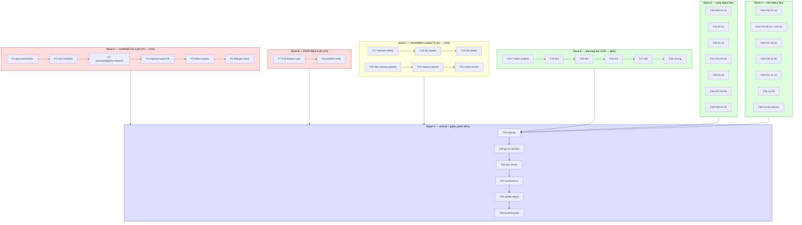

# SUPERB Docs-Health Execution Plan — Annotate, Archive, Living-Docs Truth (2026-08-16 13:40)

> **Source:** the docs-health AUDIT run in flight this session
> ([status](../status/2026-08-16_13-36_docs-health-audit-in-flight.md)).
> All 17 dated `2026-08-16*` files + 5 living docs were read; HARVEST/VERIFY
> completed; TODO_LIST.md already updated (7 edits). This plan covers the
> REMAINDER: living-doc truth (CHANGELOG/FEATURES/ROADMAP/AGENTS), inline
> annotation of every numbered item in the dated `.md` files, archiving of
> fully-resolved files, gates, and the health report.
>
> **Format note:** written as `.md` per the user's explicit instruction
> (pareto-planning skill default is styled HTML — user override honored).
>
> **Prime directive:** NO VERSCHLIMMBESSERUNG. Historical files are annotated
> NON-DESTRUCTIVELY (strikethrough + `done at` hashes; never rewrite, never
> renumber). Living docs are corrected in place. `.md` files only — the 08:19
> **HTML** report gets no inline strikethrough (leave or appendix-pointer at
> most); the benchmark evidence doc has no numbered action items (leave alone).
>
> **Concurrent-session guard:** `metaengine/{memory_stream_log.go M,
> seq_seek.go ??}` is a foreign in-flight F59 implementation. Never stage,
> revert, or "fix" it. All commits in this plan stage ONLY the docs files this
> plan touches.

---

## Step 1 — Pareto Breakdown

### Verified current state (facts, checked against code/git this session)

- 20+ tags live on the proxy from the 2026-08-16 chain; **3 broken releases
  retracted** (command/v4.7.0, query/v4.6.0, storage/v4.7.0) — CHANGELOG has
  entries ONLY for the storage pair. The other two retracts + the entire
  20-tag chain: **zero entries**.
- FEATURES.md: 0 hits for 13 shipped wave-3/4 features.
- ROADMAP.md: header still says "v4.7.0 tagged (2026-08-10)"; Open Q1
  (tag authorization) superseded by the executed chain; Open Q2 (Go 1.26.6)
  resolved by `ea8fa5072`.
- 16 dated `.md` files with numbered items (f-lists of 10-50 items; the
  03-18 planning doc carries T1-T27 + F1-F60 = 87 verdicts owed). Four files
  already carry partial resolution blocks (01-33 §h/§i/§j; 03-44 §h; 11-33
  iroh RESOLVED; 12-39 top RESOLVED) — those reduce the remaining work.
- `docs/status/archived/` exists (established convention, ~460 files in
  docs/status/).

### The 1% that delivers 51%: **Consumer-facing truth in the living docs**

The living docs are read 100x more than any status report. Today they lie:

1. CHANGELOG `[2026-08-16 module releases]` section — 20 tags + 2 missing
   retract entries.
2. FEATURES.md wave-3/4 rows (13 verified-shipped features).

One consumer reading CHANGELOG today learns nothing about the biggest release
day in the project's history — and nothing that v4.7.0/v4.6.0 are poisoned.

### The 4% that delivers 64%: **Stop future sessions from re-asking answered questions**

3. ROADMAP Open Questions truth (Q1 rewritten, Q2 deleted, header refreshed).
4. AGENTS.md +2 gotchas (`file::memory:` per-connection DBs; local-path
   `replace` → `go.work use`) — both incidents already repeated once.

### The 20% that delivers 80%: **ANNOTATE every numbered item (the explicit ask)**

5. The 03-18 planning doc (87 verdicts — the document every later session
   opened to know what to do).
6. The 15 status `.md` files' f-lists/e.4 tables/g sections — every item gets
   `done at`/`Won't implement`/untouched-open.

### The other 80% (to reach 100%)

7. ARCHIVE fully-resolved `.md` files (`git mv` → `docs/status/archived/`).
8. doc-check gate + cross-file consistency sweep.
9. Health report (Accuracy + Fitness, inline — never a file).
10. Detailed commit(s) + push.

---

## Step 2 — Comprehensive Plan (30-100 min tasks, sorted)

| #   | Task                                                                                         | Tier | Impact                    | Effort | Est. | Customer value                           |
| --- | -------------------------------------------------------------------------------------------- | ---- | ------------------------- | ------ | ---- | ---------------------------------------- |
| M1  | CHANGELOG: `[2026-08-16 module releases]` combined section (20 tags, per-module Added/Fixed) | 1%   | CRITICAL (consumer truth) | S      | 45m  | Consumers see the release day + retracts |
| M2  | CHANGELOG: retract entries for command/v4.7.0 + query/v4.6.0 (verify storage pair complete)  | 1%   | CRITICAL (upgrade safety) | S      | 30m  | Nobody pins a poisoned version knowingly |
| M3  | FEATURES.md: 13 wave-3/4 rows + status verify (grep each symbol)                             | 1%   | HIGH                      | M      | 90m  | Honest feature inventory                 |
| M4  | ROADMAP: header release-history row + Open Q1 rewrite + Q2 delete                            | 4%   | HIGH (misdirection stop)  | S      | 30m  | Future sessions stop re-asking           |
| M5  | AGENTS.md: +2 gotchas + claim/ count verify (82 go.mod ✓)                                    | 4%   | MEDIUM                    | S      | 30m  | Incident classes can't recur silently    |
| M6  | ANNOTATE 03-18 planning doc: T-table + F1-F60 verdicts                                       | 20%  | HIGH (explicit ask)       | M      | 100m | The plan reads as history, not todo      |
| M7  | ANNOTATE 01-33 + 02-11 (f.30 + next-4; partial §h/§i/§j exist)                               | 20%  | HIGH                      | S      | 60m  | Reader sees closure per item             |
| M8  | ANNOTATE 02-16 + 03-10 (f.25 + f.50)                                                         | 20%  | HIGH                      | M      | 90m  | —                                        |
| M9  | ANNOTATE 03-44 + 04-00 (f.10 + f.50; §h exists on 03-44)                                     | 20%  | HIGH                      | M      | 90m  | —                                        |
| M10 | ANNOTATE 04-24 (e.4 50-row table + §g)                                                       | 20%  | HIGH                      | M      | 90m  | —                                        |
| M11 | ANNOTATE 07-12 (f.50 + §g 3 questions)                                                       | 20%  | HIGH                      | M      | 90m  | —                                        |
| M12 | ANNOTATE 09-13 + 11-33 (f.22 + f.30; fix 09-13 stale iroh claim inline)                      | 20%  | HIGH                      | M      | 90m  | Stale "green" claims corrected in place  |
| M13 | ANNOTATE 10-51 + 11-00 (f.50 each)                                                           | 20%  | HIGH                      | L      | 100m | —                                        |
| M14 | ANNOTATE 12-39 remainder + 13-15 minimal (current-state)                                     | 20%  | MEDIUM                    | S      | 45m  | —                                        |
| M15 | Classify (ANNOTATE/ARCHIVE/SKIP/LEAVE) + `git mv` fully-resolved                             | 80%  | MEDIUM                    | S      | 30m  | docs/status/ stays navigable             |
| M16 | doc-check gate + fix any breakage                                                            | 80%  | HIGH (verify)             | S      | 30m  | GREEN proof, not component claims        |
| M17 | Cross-file consistency sweep (TODO↔CHANGELOG dup, links, statuses)                           | 80%  | MEDIUM                    | S      | 30m  | No split brains                          |
| M18 | Health report inline (Accuracy + Fitness, visible math)                                      | 80%  | MEDIUM                    | XS     | 15m  | Honest audit verdict                     |
| M19 | git status + detailed commit(s) + push                                                       | —    | REQUIRED                  | XS     | 15m  | Work lands                               |

**Deferred by explicit decision (not forgotten):** annotating the 08:19 HTML
report (not `.md` — leave, at most an appendix pointer if a reader hook
exists); the benchmark evidence doc (results, not action items — LEAVE ALONE);
any TODO_LIST rewrite beyond the 7 edits already shipped this session.

---

## Step 3 — Fine Breakdown (max 12 min each, sorted by wave then value)

### Wave A — CHANGELOG truth (the 1%)

| #  | Task                                                                 | Est. | Depends |
| -- | -------------------------------------------------------------------- | ---- | ------- |
| F1 | Enumerate exact tag list + dates (`git tag -l --sort=-creatordate`)  | 6m   | —       |
| F2 | Draft per-module Added entries (id/record/metadata/schema/event…)    | 12m  | F1      |
| F3 | Draft per-module entries (query/command/middleware incl. retracts)   | 12m  | F2      |
| F4 | Draft engine + watermill + metaengine entries                        | 12m  | F3      |
| F5 | Retract entries: command v4.7.0, query v4.6.0 (storage pair: verify) | 10m  | F4      |
| F6 | Cross-check no `[Unreleased]` duplication of cut sections            | 6m   | F5      |

### Wave B — FEATURES truth (the 1%)

| #   | Task                                                             | Est. | Depends |
| --- | ---------------------------------------------------------------- | ---- | ------- |
| F7  | bbolt rows: WithBatchCommit, OpenWithOptions/NewBackendWith      | 8m   | —       |
| F8  | pgengine rows: WithCopyAppend, batched StreamAppend              | 8m   | —       |
| F9  | stack/pebble knobs row (4 options, defaults pinned)              | 6m   | —       |
| F10 | projectionhost checkpoint-batching row                           | 8m   | —       |
| F11 | storage keyset-pagination row (~285x drain)                      | 10m  | —       |
| F12 | storage/sql byte-cap chunking row (MaxStatementBytes etc.)       | 8m   | —       |
| F13 | event rows: DecorateJournal (+sentinel), AdoptedPayload          | 10m  | —       |
| F14 | metaengine rows: CapabilityAudit/Doctor, WithIdempotencyCapacity | 10m  | —       |
| F15 | api-stability pin-drift + OpenSQLiteInMemory fix rows            | 8m   | —       |
| F16 | Grep-verify every new row's symbols exist in code                | 10m  | F7-F15  |

### Wave C — ROADMAP + AGENTS (the 4%)

| #   | Task                                                                  | Est. | Depends |
| --- | --------------------------------------------------------------------- | ---- | ------- |
| F17 | ROADMAP header: add 2026-08-16 chain to Release History               | 10m  | —       |
| F18 | ROADMAP Open Q1 rewrite (chain executed; what remains = wave-4 batch) | 10m  | —       |
| F19 | ROADMAP Open Q2 delete (resolved `ea8fa5072`); renumber check         | 4m   | —       |
| F20 | AGENTS gotcha: modernc `file::memory:` per-connection databases       | 6m   | —       |
| F21 | AGENTS gotcha: local-path `replace` → `go.work use`, never go.mod     | 6m   | —       |
| F22 | AGENTS: verify counts + referenced paths still resolve                | 6m   | F20-F21 |

### Wave D — ANNOTATE the planning doc (the 20%)

| #   | Task                                                            | Est. | Depends |
| --- | --------------------------------------------------------------- | ---- | ------- |
| F23 | 03-18 T1-T27 table: Status verdicts (Pattern B column)          | 12m  | —       |
| F24 | 03-18 Wave-1 F1-F10 verdicts                                    | 10m  | F23     |
| F25 | 03-18 Wave-2 F11-F27 verdicts (F24-F27 blocked:user → resolved) | 10m  | F24     |
| F26 | 03-18 Wave-3 F28-F40 verdicts                                   | 10m  | F25     |
| F27 | 03-18 Wave-4 F41-F60 verdicts                                   | 12m  | F26     |
| F28 | 03-18 standing-recommendations verdicts + closing note          | 6m   | F27     |

### Wave E — ANNOTATE early status files (the 20%)

| #   | Task                                                                  | Est. | Depends |
| --- | --------------------------------------------------------------------- | ---- | ------- |
| F29 | 01-33: f.1-f.15 verdicts (cross-ref §h/§i/§j, don't re-mark)          | 12m  | —       |
| F30 | 01-33: f.16-f.30 verdicts                                             | 12m  | F29     |
| F31 | 02-11: NEXT STEPS 1-4 verdicts                                        | 8m   | —       |
| F32 | 02-16: f.1-f.25 verdicts (tag chain = executed; plan wrongness noted) | 12m  | —       |
| F33 | 03-10: f.1-f.25 verdicts (P0/P1)                                      | 12m  | —       |
| F34 | 03-10: f.26-f.50 verdicts (P2/P3/P4)                                  | 12m  | F33     |
| F35 | 03-44: f.1-f.10 verdicts (§h already resolves Q-blockers)             | 8m   | —       |
| F36 | 04-00: f.1-f.25 verdicts                                              | 12m  | —       |
| F37 | 04-00: f.26-f.50 + §g verdicts                                        | 12m  | F36     |
| F38 | 04-24: e.4 rows 1-25 verdicts                                         | 12m  | —       |
| F39 | 04-24: e.4 rows 26-50 + §g verdicts                                   | 12m  | F38     |

### Wave F — ANNOTATE late status files (the 20%)

| #   | Task                                                                 | Est. | Depends |
| --- | -------------------------------------------------------------------- | ---- | ------- |
| F40 | 07-12: f.1-f.16 verdicts                                             | 12m  | —       |
| F41 | 07-12: f.17-f.33 verdicts                                            | 12m  | F40     |
| F42 | 07-12: f.34-f.50 verdicts                                            | 12m  | F41     |
| F43 | 09-13: f.1-f.22 verdicts                                             | 12m  | —       |
| F44 | 09-13: stale "10 engines green" claim — inline correction (iroh RED) | 6m   | F43     |
| F45 | 10-51: f.1-f.17 verdicts                                             | 12m  | —       |
| F46 | 10-51: f.18-f.34 verdicts                                            | 12m  | F45     |
| F47 | 10-51: f.35-f.50 + §g verdicts                                       | 12m  | F46     |
| F48 | 11-00: f.1-f.17 verdicts                                             | 12m  | —       |
| F49 | 11-00: f.18-f.33 + §g verdicts                                       | 12m  | F48     |
| F50 | 11-33: f.1-f.15 verdicts (P0/P1; iroh already RESOLVED-marked)       | 12m  | —       |
| F51 | 11-33: f.16-f.30 + §g verdicts                                       | 12m  | F50     |
| F52 | 12-39: f.1-f.24 verdicts (top RESOLVED block exists)                 | 12m  | —       |
| F53 | 13-15: minimal — verify current; annotate only if a claim went stale | 6m   | —       |

### Wave G — Archive + gates + report (the other 80%)

| #   | Task                                                                | Est. | Depends |
| --- | ------------------------------------------------------------------- | ---- | ------- |
| F54 | Classify all 16 `.md` files: ANNOTATE/ARCHIVE/SKIP/LEAVE            | 8m   | F23-F53 |
| F55 | `git mv` fully-resolved files → `docs/status/archived/`             | 6m   | F54     |
| F56 | doc-check run (`cmd/doc-check`); fix any breakage                   | 12m  | F55     |
| F57 | Cross-file consistency: TODO↔CHANGELOG dup, links, status conflicts | 12m  | F56     |
| F58 | Health report inline (Accuracy + Fitness, visible math, no file)    | 10m  | F57     |
| F59 | git status + detailed commit(s) + push                              | 12m  | F58     |

**Total: 59 fine tasks ≈ 9.5 h focused work.**

---

## Step 4 — Execution Graph

**Execution order:** A → B → C (living docs first: the lies with the largest
audience), then D → E/F (annotation volume; E and F files are independent —
parallelizable), then G. Never stage `metaengine/*` (foreign WIP).

---

## Standing decision defaults (overridable)

1. **Archive threshold** = skill default: only files where EVERY numbered item
   resolves get `git mv`'d to `docs/status/archived/`. Files with genuinely
   open items stay in place (absence of a marker IS the open signal).
2. **CHANGELOG shape** = one combined `## [2026-08-16 module releases]`
   section (2026-08-13 precedent), retracts inline per module.
3. **08:19 HTML report** = leave untouched (not `.md`). The 09:13 report
   already supersedes its wave-4 content.
4. **Benchmark evidence doc** = leave alone (results, not action items).
5. **Open items found during annotation** route to TODO_LIST.md (already
   harvested this session) — the annotation marks open items untouched, it
   never re-opens settled work.

## Git workflow (this plan's execution)

1. Commit 1 (pre-existing pending work, mine only): TODO_LIST.md harvest
   - 13:36 status report.
2. Commit 2: this plan file.
3. During execution: one commit per Wave (A-F) + final commit for G, each
   with detailed messages; NEVER `git add -A` while foreign WIP exists —
   stage explicit paths only.
4. Push after the final wave commit (user-authorized in the plan directive).
