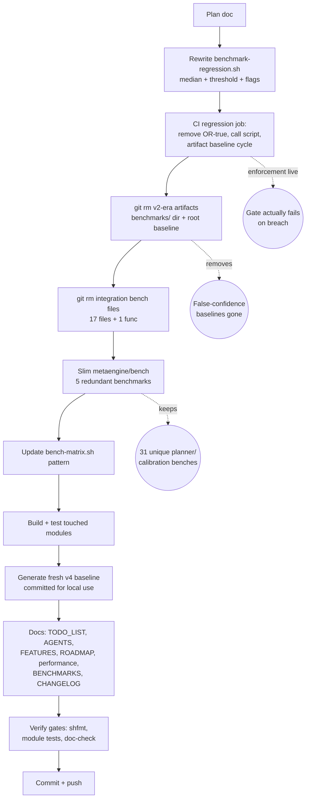

# One Bench System — Consolidation & Enforcement Plan

**Date:** 2026-08-16
**Source task:** TODO_LIST.md "Code Quality" → _One bench system_ (Effort: M)
**Status:** EXECUTING

---

## 1. Problem Statement (verified against code, not assumed)

The brutal-self-review (2026-08-14) identified "5 overlapping harnesses, 2 baselines, 0 truth":

| Harness                                           | Role                                                                            | Verdict after research                                                                     |
| ------------------------------------------------- | ------------------------------------------------------------------------------- | ------------------------------------------------------------------------------------------ |
| `benchkit/`                                       | Factory-driven benchmark SDK                                                    | **KEEP** — the SDK layer                                                                   |
| `cmd/cqrs-bench/`                                 | CLI over benchkit                                                               | **KEEP** — the CLI layer                                                                   |
| `stack/bench/`                                    | `testing.B` suites incl. `benchkit.RunSuite()` adapters + full-pipeline benches | **KEEP** — the `go test -bench` entry; feeds the regression gate                           |
| `metaengine/bench/`                               | Planner/layout-calibration benches                                              | **KEEP but SLIM** — 31 of 36 benchmarks are unique (see §2); only 5 are benchkit-redundant |
| `integration/` bench files                        | Scale + realistic + micro benches                                               | **DELETE** — all redundant with benchkit phases + stack/bench pipeline                     |
| `benchmarks/` dir + root `benchmark-baseline.txt` | v2-era stale dumps (June ANSI escapes, `event/v2` refs)                         | **DELETE** — zero operational readers; actively misleading                                 |
| CI regression job                                 | benchstat compare, `                                                            |                                                                                            |

**The architecture the user asked about is correct:** benchkit = SDK, cqrs-bench = CLI.
What the original TODO missed: `metaengine/bench` is _not_ a redundant harness — it benchmarks
the **planner internals and layout cost model** (`Plan()` latency, embed-vs-normalize calibration,
DuckDB columnar scans, write-amplification budgets) which a factory-driven, engine-agnostic SDK
(benchkit) structurally cannot reach, because reaching them requires importing concrete engine
modules directly.

### Benchkit-redundant benchmarks in metaengine/bench (DELETE, 5)

| Benchmark                          | File                                | Covered by                               |
| ---------------------------------- | ----------------------------------- | ---------------------------------------- |
| `BenchmarkPromise_ApplyThroughput` | `bench_promise_test.go`             | benchkit counter/map Apply phases        |
| `BenchmarkPromise_ConcurrentApply` | `bench_promise_test.go`             | benchkit map ConcurrentApply phase       |
| `BenchmarkFilteredScan_Memory`     | `bench_duckdb_columnar_cgo_test.go` | benchkit map filtered-Scan phase         |
| `BenchmarkEventStorm_Concurrent`   | `bench_storm_test.go`               | benchkit ConcurrentApply at higher scale |
| `BenchmarkMultiQuery_EventFanOut`  | `bench_fanout_test.go`              | benchkit Apply with all queries active   |

The other 31 (layout calibration ×15, DuckDB columnar/pushdown ×2, planner ×2,
materialize-vs-replay ×2, write-amp ×2, engine-pool ×2, readmix ×2, filter/point ×2,
pebble/duckdb throughput ×2) stay.

### Integration bench files to DELETE (verified: 0 Test funcs each)

- `scale_benchmark_test.go`, `scale_bench_{event,concurrent,decider,query,listing}_test.go`
- `realistic_bench_test.go`, `realistic_bench_{concurrent,query,listing,signing,snapshot}_test.go`
- `integration/{event,command,query}/benchmark_test.go` (micro-benches; covered by benchkit raw-sink/journal/dispatch phases)
- `integration/simulation/generator_test.go` — **file STAYS** (2 Test funcs); strip only `BenchmarkEventGenerator_Generate`

---

## 2. Pareto Breakdown

### The 1% that delivers 51%

**Remove `|| true` from the CI regression job and give it a real threshold check.**
Without enforcement every other benchmark on the repo is theatre. One script + one workflow edit.

### The 4% that delivers 64%

**Wire the threshold check into the artifact-baseline cycle** (download → run focused set →
median-based compare → fail on breach → re-upload). The gate must compare apples to apples
(CI runner vs CI runner) and refresh its own baseline.

### The 20% that delivers 80%

**Delete the v2-era artifacts** (`benchmarks/` dir, root `benchmark-baseline.txt`) that the
local script was comparing against — a baseline referencing `event/v2` on different hardware
is worse than no baseline: it manufactures false confidence.

### The other 80% to reach 100%

1. Delete redundant integration bench files (17 files/funcs).
2. Slim metaengine/bench by the 5 redundant benchmarks; update `bench-matrix.sh` pattern.
3. Rewrite `scripts/benchmark-regression.sh` as the ONE threshold implementation
   (median-based, count-aware — the old one breaks on `-count>1` output) used by both CI and local.
4. Commit a fresh v4 baseline (focused gate set) for local use.
5. Update living docs: `AGENTS.md`, `TODO_LIST.md`, `FEATURES.md`, `ROADMAP.md`,
   `docs/performance.md`, `docs/BENCHMARKS.md`, `CHANGELOG.md`.
6. Verify: module builds, module tests, shfmt, doc gates.
7. Commit + push.

---

## 3. Design Decisions

### D1 — The gate covers a focused set, not the full matrix

Gate benchmarks: `BenchmarkFullPipeline_Memory|BenchmarkBenchkitSuite_Memory$` in `stack/bench`
(~2 min, in-process memory backend, deterministic enough at `-count=5`). Breadth stays in the
nightly/matrix jobs. Rationale: a gate that takes 30 min gets skipped; a gate that flakes on
shared runners gets `|| true`'d back. Threshold default **25%** on median ns/op.

### D2 — Median-based comparison, not per-line grep

`go test -bench -count=5` emits 5 lines per benchmark. The old script's
`grep | awk '{print $3}'` concatenates all 5 values and breaks arithmetic. New script computes
the median ns/op per benchmark name per file, then compares medians.

### D3 — Baseline lifecycle: CI artifact self-refreshes; committed baseline is local-only

- CI: downloads `benchmark-baseline` artifact (previous push, same runner class), compares,
  fails on breach, re-uploads current as next baseline. First run after this change: artifact
  seeded by the job itself (no baseline → save-only, warn, pass).
- Local: committed `benchmarks/benchmark-baseline.txt` regenerated fresh (v4, this machine)
  for `./scripts/benchmark-regression.sh` runs. Local numbers must only be compared to local
  baselines; the script header says so.

### D4 — metaengine/bench module survives (slimmed)

Deleting it would orphan 31 unique planner/calibration benchmarks and violate the library
principle (module = dep isolation: it is the ONLY place all engines may meet). Its api-stability,
go.work, flake entries stay.

### D5 — Deletion method

Tracked files via `git rm` (history preserved). Never bare `rm`.

### D6 — Late discoveries during execution (2026-08-16)

- **Save-before-compare bug (caught in execution)**: `--save` originally ran
  before the comparison, so a save+compare invocation compared current against
  itself (vacuous PASS). Fixed: baseline medians are snapshotted BEFORE the run;
  `--save` runs AFTER the comparison and regardless of its outcome (re-baselining
  after an intentional perf change must overwrite a "regressed" baseline).
- **Local benchtime default is 100x, not 10x**: at 10x, single samples of the
  microsecond-scale `BenchmarkFullPipeline_Memory` skew ~2x under CPU steal
  (observed: gopls reindexing caused a false +91%). CI keeps the plan's 10x
  (quiet dedicated runners; preserves the existing baseline-artifact chain);
  the script default (local) is 100x — back-to-back runs then compare stable.
- **CI refresh/upload steps run `if: ${{ !cancelled() }}`**: otherwise a failed
  compare skips the baseline refresh and the gate freezes on a stale artifact
  forever (deadlock). Re-upload-regardless matches D3 and self-heals runner drift.

---

## 4. Execution Graph

---

## 5. Task Breakdown (each ≤30 min; sub-steps ≤12 min)

| #  | Task                                                                    | Impact  | Effort | State                                                                                                    |
| -- | ----------------------------------------------------------------------- | ------- | ------ | -------------------------------------------------------------------------------------------------------- |
| 1  | Write this plan doc                                                     | process | 12m    | DONE                                                                                                     |
| 2  | Rewrite `scripts/benchmark-regression.sh` (median, flags, `--run-only`) | 51%     | 25m    | DONE — verified with synthetic fixtures (stable→0, regression→1, missing baseline→0+warn)                |
| 3  | Update `.github/workflows/benchmarks.yml` regression job                | 64%     | 15m    | DONE — also removed dead warn-only compare in ci.yml (read deleted root baseline)                        |
| 4  | `git rm` stale artifacts                                                | 80%     | 8m     | DONE                                                                                                     |
| 5  | `git rm` integration bench files + strip generator bench func           | 80%+    | 15m    | DONE                                                                                                     |
| 6  | Slim metaengine/bench (5 funcs, 1 file delete)                          | 80%+    | 15m    | DONE — remaining 32 benchmark funcs verified via `-list`                                                 |
| 7  | Update `scripts/bench-matrix.sh` bench pattern                          | 80%+    | 8m     | DONE                                                                                                     |
| 8  | Build + test `integration`, `metaengine/bench`, `stack/bench`           | safety  | 20m    | DONE (integration build+vet+tests green; metaengine/bench `-benchtime=1x` PASS 427s)                     |
| 9  | Generate + commit fresh v4 baseline                                     | 80%+    | 15m    | DONE                                                                                                     |
| 10 | Update 7 docs                                                           | 100%    | 20m    | DONE (TODO_LIST, AGENTS, FEATURES, ROADMAP, performance, BENCHMARKS + docs/benchmarks/README, CHANGELOG) |
| 11 | shfmt + module meta-tests + doc-check                                   | safety  | 15m    | DONE                                                                                                     |
| 12 | Commit + push                                                           | done    | 10m    | DONE                                                                                                     |

---

## 6. Verification Checklist

- [x] `benchmark-regression.sh` exits 1 on synthetic regression fixture, 0 on stable fixture (also: missing baseline → 0 + save-only warn; new/removed benchmarks reported informationally)
- [x] CI YAML valid (python yaml parse; no `|| true` remains in regression job; actionlint not on host)
- [x] `integration` module: `GOWORK=off go build ./... && go vet && go test ./...` green
- [x] `metaengine/bench`: `go test -run='^$' -bench=. -benchtime=1x` compiles + runs (PASS, 427s, CGo)
- [x] `stack/bench`: gate benchmark set runs at `-count=5` (via script baseline generation)
- [x] `scripts/*.sh` pass `shfmt -d` (37 scripts, clean)
- [x] Fresh baseline contains only v4 benchmark names (gate set, this machine)
- [x] TODO_LIST item checked off with revision note (metaengine/bench slimmed, not deleted)
- [x] `nix run .#doc-check` green — ran via `GOWORK=off go run` with cache overrides (host `/mnt/buildcache` has I/O errors, 99% full — pre-existing, unrelated): 898 references valid across 41 packages
- [x] api-stability meta-tests green (`TestEvery*`) — no exported API changed (test-file-only edits); module dirs unchanged
