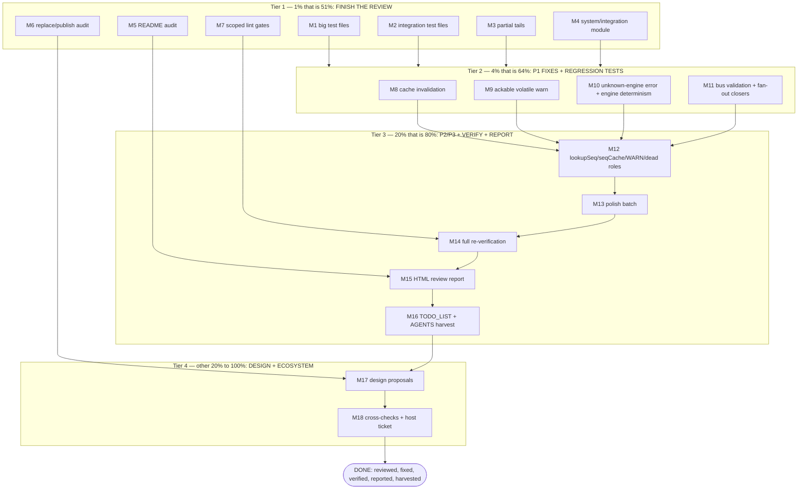

# SUPERB Plan — Finish system/v4 Review, Fix, Verify, Report

**Date:** 2026-08-16 18:30
**Input:** mid-flight status report `docs/status/2026-08-16_18-25_system-v4-review-midflight.md` (verified findings: 5×P1, 14×P2, 11×P3; review 75% done)
**Repo:** `go-cqrs-lite` · module `system/v4` · baseline GREEN (build+vet+race via `$HOME` fallback caches; `/mnt/buildcache` broken)
**Decisions encoded (defaults, revisable):** (1) apply safe non-breaking fixes now; design-level items routed as proposal TODOs. (2) fan-out-bus closers + bus validation + determinism = fix now; named-bus API + Count-by-name = routed (cross-module). (3) session gate = scoped build+vet+race; `nix run .#verify` routed behind host buildcache repair.

---

## Pareto Breakdown

### The 1% that is 51% — FINISH THE REVIEW
The review is the foundation: no fix or report is credible with 9 test files unread and docs/dep hygiene unaudited. Finishing it converts "findings ledger" into "complete audit" and unblocks every other tier.

### The 4% that is 64% — THE 5 P1 CORRECTNESS FIXES + REGRESSION TESTS
Stale `CachedEventStore` (data correctness on every cached deployment), unackable volatile warning (documented feature that cannot work), unknown-engine silent skip (projections silently absent), nondeterministic bus/engine wiring (per-boot randomness), unclosed fan-out buses (leak). These make the module work as documented.

### The 20% that is 80% — P2 HONESTY FIXES + FULL RE-VERIFICATION + REPORT + HARVEST
lookupSeq error propagation (no silent duplicate replay), seqCache bound, WARN surfacing, dead-role conditions, lock discipline, doc lies, test nits; then full gates, HTML review report, TODO_LIST harvest. This closes the loop: system improved AND the audit recorded AND follow-ups routed.

### The other 20% to 100% — DESIGN DECISIONS + ECOSYSTEM
Count-by-name dispatch (needs metaengine), named-bus API, reserved-config honesty (Mode/Subscribe/Collections/Cache.Engine), Durability wiring, backend-contract docs, dep diet, stack.Bundle cross-check, metaengine drift, go-appkit cross-ref, host buildcache repair.

---

## Comprehensive Plan — medium granularity (30–100 min each)

| # | Tier | Task | Est. | Impact | Files |
|---|------|------|------|--------|-------|
| M1 | 1% | Read remaining big test files (hardening 725L, scream_plan 594L, extended 483L) | 90m | unblocks all | 3 test files |
| M2 | 1% | Read remaining integration test files (lifecycle 367L, sqlite 324L, snapshot_e2e 286L, shutdown 175L, postgres 134L, badger 112L) | 90m | unblocks all | 6 test files |
| M3 | 1% | Finish 5 partial test-file tails (drain, evolutions, projection, auto_projection, typed_decoder) | 40m | coverage honesty | 5 test files |
| M4 | 1% | Review `system/integration/` sub-module (doc.go, duckdb_test.go, go.mod) | 30m | scope complete | integration/ |
| M5 | 1% | README audit: claims vs verified behavior; list false claims | 40m | doc honesty | README.md |
| M6 | 1% | Replace-directive publish audit: what nix/CI builds vs local replaces; metaengine v4.10-local vs v4.11 published drift | 60m | supply-chain truth | go.mod, flake.nix |
| M7 | 1% | Scoped gates: cqrs-lint (from system/), golangci-lint, coverage | 60m | lint truth | system/ |
| M8 | 4% | FIX P1-1: CachedEventStore write invalidation (Save/AppendBatch invalidate + re-fetch) + regression test (write-then-load freshness) | 60m | data correctness | cache.go, cache_test.go (new) |
| M9 | 4% | FIX P1-5: ackable volatile-source-of-truth (rule key `volatile-source-of-truth:<role>` + `isAcknowledged`) + regression test (ack silences warning) | 45m | documented feature works | scream_store.go, test |
| M10 | 4% | FIX P2-7/P2-8: error on unknown projection-engine reference + sorted engine creation (map keys → deterministic order) + regression tests | 60m | no silent projection loss; deterministic shutdown | constructor.go, test |
| M11 | 4% | FIX P1-3/P1-4: validate ALL bus drivers at construction + deterministic bus selection (sorted, refuse ambiguous multi-driver maps) + register fan-out bus closers + regression tests | 90m | per-boot determinism; no leak | bus.go, constructor.go, test |
| M12 | 20% | FIX P2: lookupSeq/lookupSeqToken error propagation; seqCache bound (otter MaximumSize); WARN plan-diagnostics surfaced on System (field + accessor); remove dead RoleCommands/RoleQueries conditions | 90m | no silent replay; bounded memory; visible warnings | adapter_event_journal.go, scream_plan.go/constructor.go, constructor.go |
| M13 | 20% | FIX P3 batch: introspection RLock + ctx docs, reifyTo error propagation, doc duplications (config_loader engines block, ShutdownOrder sentence), test nits (discarded errors, dead system, lying comments), buildCRUDQuery consolidation, SnapshotAdapter shared key helper | 100m | polish + honesty | 8 files |
| M14 | 20% | Full re-verification: build + vet + race `-count=3` on touched packages; scoped `nix fmt` check; before/after findings ledger | 60m | stale-GREEN prevention | system/ |
| M15 | 20% | HTML review report (stat cards, issue cards, badge tables, fixed-on-spot ledger) | 90m | deliverable | docs/reviews/2026-08-16_full-code-review-system.html |
| M16 | 20% | TODO_LIST.md harvest (routed design TODOs + debt) + AGENTS.md system-section update + status-report annotate pointer | 60m | forward-looking work lives in living docs | TODO_LIST.md, AGENTS.md |
| M17 | 80→100% | Routed design decisions documented as proposals: Count-by-name (metaengine named dispatch), named-bus API, reserved-config honesty (Mode/Subscribe/Collections/Cache.Engine → implement-or-deprecate table), Durability → DriverConfig wiring, EventAdapter backend contract | 100m | decisions ready for Lars | docs/adr or TODO proposals |
| M18 | 80→100% | Ecosystem cross-checks: stack.Bundle shares the ack/WARN bugs? dep-diet evaluation (engine blank-imports → integration module), go-appkit AGENTS cross-ref, host buildcache repair ticket | 60m | blast-radius truth | stack/, docs, host |

**Sorted by importance/impact/effort/customer-value:** M8 > M9 > M10 > M11 > M1 > M2 > M12 > M14 > M15 > M3 > M4 > M5 > M16 > M6 > M13 > M7 > M17 > M18

---

## Fine Breakdown — max 12 min each

| # | Parent | Task | Est. |
|---|---------|------|------|
| F1 | M1 | system_hardening_test.go lines 1–250 | 10m |
| F2 | M1 | system_hardening_test.go lines 250–500 | 10m |
| F3 | M1 | system_hardening_test.go lines 500–725 | 10m |
| F4 | M1 | scream_plan_test.go lines 1–300 | 10m |
| F5 | M1 | scream_plan_test.go lines 300–594 | 10m |
| F6 | M1 | system_extended_test.go lines 1–250 | 10m |
| F7 | M1 | system_extended_test.go lines 250–483 | 10m |
| F8 | M2 | integration_lifecycle_test.go full | 12m |
| F9 | M2 | system_sqlite_test.go lines 1–170 | 10m |
| F10 | M2 | system_sqlite_test.go lines 170–324 | 10m |
| F11 | M2 | snapshot_e2e_test.go full | 12m |
| F12 | M2 | integration_shutdown_test.go full | 8m |
| F13 | M2 | integration_postgres_test.go full | 8m |
| F14 | M2 | integration_badger_test.go full | 8m |
| F15 | M3 | lifecycle_drain_test.go tail (200+) | 5m |
| F16 | M3 | evolutions_test.go tail (200+) | 6m |
| F17 | M3 | system_projection_test.go tail (200+) | 8m |
| F18 | M3 | system_auto_projection_test.go tail (200+) | 6m |
| F19 | M3 | system_typed_decoder_test.go tail (200+) | 6m |
| F20 | M4 | integration/doc.go + go.mod | 6m |
| F21 | M4 | integration/duckdb_test.go | 8m |
| F22 | M5 | README claims inventory (grep verbs: "supports/enables/always") | 12m |
| F23 | M5 | README false-claim cross-check vs findings ledger | 12m |
| F24 | M6 | map 6 replaces → what they shadow (versions, deltas) | 12m |
| F25 | M6 | flake mkPreparedSource path: which versions get published | 12m |
| F26 | M6 | metaengine local drift vs v4.11.0 (CHANGELOG diff) | 10m |
| F27 | M7 | cqrs-lint from system/ | 6m |
| F28 | M7 | golangci-lint scoped system/ | 12m |
| F29 | M7 | coverage run + compare vs repo threshold | 10m |
| F30 | M8 | cache.go: invalidate keys in Save + AppendBatch | 10m |
| F31 | M8 | decide invalidation strategy (ref-key delete vs version-tag) — delete key on write | 6m |
| F32 | M8 | regression test: save→load→append→load returns fresh | 12m |
| F33 | M8 | regression test: cache hit still avoids store round-trip (counter fixture) | 10m |
| F34 | M9 | scream_store.go: rule key suffix + ack check wiring | 8m |
| F35 | M9 | keep un-acked message identical (no behavior change for non-ackers) | 4m |
| F36 | M9 | regression test: acked role → no WARN; un-acked → WARN | 12m |
| F37 | M10 | constructor.go: collect unresolved engine names → ErrUnknownEngine | 10m |
| F38 | M10 | constructor.go: sort engine map keys before creation loop | 6m |
| F39 | M10 | test: typo'd projection engine name → New error | 10m |
| F40 | M10 | test: EngineNames()/ShutdownOrder deterministic under map seed variation | 10m |
| F41 | M11 | bus.go: validate every entry; deterministic pick (sorted names; default when map empty) | 12m |
| F42 | M11 | constructor.go: register each fan-out bus io.Closer | 8m |
| F43 | M11 | test: all-invalid drivers error even when first iterated is valid | 10m |
| F44 | M11 | test: fan-out buses closed on Close() | 10m |
| F45 | M12 | lookupSeq/lookupSeqToken: propagate errors (wrap, return) | 10m |
| F46 | M12 | seqCache → otter with MaximumSize (e.g. 4096, doc choice) | 12m |
| F47 | M12 | System field + accessor for plan WARN diagnostics; populate in New() | 10m |
| F48 | M12 | remove dead RoleCommands/RoleQueries conditions (SOT-loop dead code) | 6m |
| F49 | M12 | tests: lookupSeq error path, WARN surfacing, roles no-op regression docs | 12m |
| F50 | M13 | introspection.go: RLock read paths; Snapshot ctx/error doc | 10m |
| F51 | M13 | evolutions.go reifyTo: error propagation via fold signature or loud failure | 12m |
| F52 | M13 | config_loader.go: dedupe engines doc block | 4m |
| F53 | M13 | introspection_extended.go: dedupe ShutdownOrder sentence | 3m |
| F54 | M13 | test nits: `_ =` on Apply, `sys, _ :=`, dead first system, "full pipeline" comment | 12m |
| F55 | M13 | merge buildCRUDQuery/WithOptions (opts slice param) | 10m |
| F56 | M13 | SnapshotAdapter: reuse id.StreamRef key helper in Save | 6m |
| F57 | M14 | gate: build+vet+race -count=3 system/ | 12m |
| F58 | M14 | gate: scoped nix fmt check (or gofumpt diff if nix blocked) | 8m |
| F59 | M14 | findings ledger before/after table update | 10m |
| F60 | M15 | report skeleton + stat cards from ledger | 12m |
| F61 | M15 | issue cards: 5×P1, 14×P2, 11×P3 with file:line | 12m |
| F62 | M15 | fixed-on-spot ledger + verification section; self-containment check | 10m |
| F63 | M16 | TODO_LIST.md: add routed items with impact/effort | 12m |
| F64 | M16 | AGENTS.md: system/v4 section (findings summary + gotchas) | 10m |
| F65 | M17 | proposal: Count-by-name (metaengine byInputType→byName dispatch) | 12m |
| F66 | M17 | proposal: named-bus API (bind by name, close on shutdown) | 12m |
| F67 | M17 | reserved-config honesty table (implement/deprecate per field) | 10m |
| F68 | M17 | Durability wiring proposal (per-engine pragma mapping) | 10m |
| F69 | M17 | EventAdapter backend contract doc (Atomic\|Tx\|racy) | 8m |
| F70 | M18 | stack.Bundle: ack/WARN-drop same bugs? read-only cross-check | 12m |
| F71 | M18 | dep-diet evaluation note (blank-imports → integration module) | 8m |
| F72 | M18 | go-appkit AGENTS cross-ref (system/v4 not adopted — reasons) | 6m |
| F73 | M18 | host buildcache repair ticket (ops) | 5m |

**Total:** 73 fine tasks ≈ 11.5h across 18 medium tasks.

---

## Execution Graph (mermaid)

---

## Anti-Verschl limmbesser Guards

- **Published module:** no exported-signature changes. All fixes internal or additive (new accessor = additive). If a fix would need a signature change → routed proposal, not a fix.
- **No behavior inventions:** ack key format follows the already-documented `rule:target` convention (config_loader.go:33-34). Cache invalidation = delete-on-write (simplest correct), not version tags.
- **Each fix lands with its regression test in the same change; gates re-run before the report claims GREEN.**
- **Not fixing by default:** GetCount dispatch, multi-bus contract, role wiring, Mode/Subscribe/Collections semantics, Durability mechanism — these change contracts and get proposals instead.
- **record/ daemon changes untouched** (not authored by this session).
