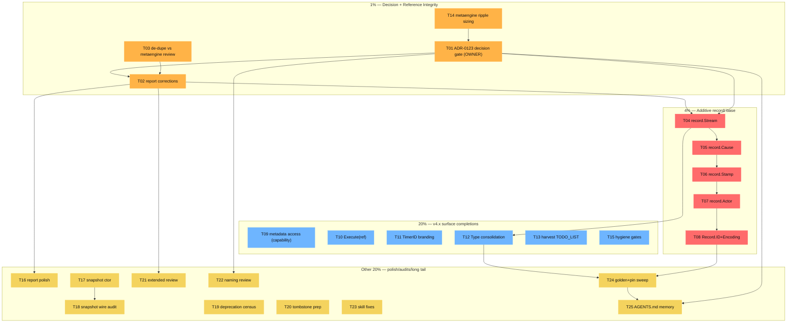

# Core Data Model → v5 Execution Plan (Pareto)

**Date:** 2026-08-22 03:52 CEST
**Trigger:** Follow-up to `docs/reviews/2026-08-22_core-data-model-review.html` (commit `11008dbc7`) and session status report `docs/status/2026-08-22_03-51_core-data-model-review-session.md` (`393c23b91`).
**Customers:** (a) the library owner (v5 unification, ADR-0123), (b) module consumers (API stability, honest types), (c) future agent sessions (accurate reference docs).

---

## 1. Context — why this plan exists

The data model review found 12 problems (2 critical, 4 high, 4 medium, 2 low) in the core type system. Root causes: a v4→v5 migration caught mid-stride, "zero-dep" misread as "stringly", presence encoded in zero values, and under-specified contracts. The review proposed a redesign (struct `Stream`, `Cause`, `Stamp`, `Actor` mirrors, `Record.ID/Encoding`).

**Two corrections discovered during self-review (status report §d):**

1. The review's roadmap Step 2 (`Command.Metadata()` interface growth) was labeled "zero consumer breakage" — **wrong**. Hand-rolled implementations of the `Command` interface in consumer code break; only embedders of `*BasicCommand` are safe. This is a LIBRARY — external implementors exist by design.
2. The review's `record.Stream` struct proposal **contradicts the recorded ADR-0123 Phase 8 decision**: TODO_LIST.md §"v5 Unification (Phase 8)" and `record/record.go:100-104` record that at v5 `NewStreamRef(streamType, entityID string) (StreamRef, error)` becomes a **validating constructor on the string type** — the string type survives. The review proposed deleting the string type. The review never cited or argued against the recorded plan.

**Verified during planning research (2026-08-22):**
- TODO_LIST.md v5 section confirms: "Breaking `record.NewStreamRef` validation … change to `NewStreamRef(streamType, entityID string) (StreamRef, error)` rejecting an empty entityID at construction". v4 already shipped `StreamRef.Validate()` + `ErrInvalidStreamRef` as the bridge.
- TODO_LIST has ZERO overlap with the review's new items (TimerID branding, `Cause`, `Stamp`, `Metadata()` interface, Type consolidation) — all are new work.
- ADRs to read before executing: 0111 (Record extraction), 0114 (tombstone→domain events), 0123 (v5 unification), plus `docs/adr/2026-08-17_system-v4-review-proposals.md`.

**Verschlimmbesserung guardrails (non-negotiable):**
- Additive-first in v4.x; every deletion rides the v5 cut with its recorded deprecation wave.
- Every code change: module tests → api-stability golden regen → `nix run .#verify-fast` (full `#verify` before tagging).
- Interface changes to exported interfaces = breaking for consumers → decision gate, never "just add a method".
- Codec/store-critical methods landing in tagged modules require the consumer-pin sweep in the same wave (AGENTS.md MarshalBinary lesson).
- Never run integration suites concurrently with `#verify`.

---

## 2. Pareto Breakdown

### The 1% that delivers 51%

**Decision + reference integrity.** The published review is now the reference for all data-model work, and it contains a wrong breaking-change claim + an uncited contradiction with recorded direction. The ADR decision itself gates the entire record/* PR series (T04–T08). Fix the reference, make the decision, and half the roadmap unblocks without risk of wrong work.

→ T01 (ADR decision gate), T02 (report corrections), T03 (de-dupe vs prior metaengine review).

### The 4% that delivers 64% (1% + next 3%)

**The additive `record/` base layer.** Four PRs (Stream, Cause, Stamp, Actor, Record.ID/Encoding) that every other fix composes on. All additive, zero consumer breakage, independently shippable. This is the foundation the v5 cut will later delete the old generation ON TOP of.

→ T04, T05, T06, T07, T08.

### The 20% that delivers 80% (4% + next 16%)

**v4.x-safe surface completions + hygiene.** Interface contracts done right (capability interface now, growth at v5), uniform `Execute(ref)` signatures, branded scheduling IDs, Type consolidation, harvest into the living TODO_LIST, metaengine ripple sizing, verify-gate closure.

→ T09, T10, T11, T12, T13, T14, T15.

### The other 20% (→ 100%)

**Polish, audits, and the long tail:** report polish, snapshot constructor + wire migration, deprecation census, tombstone v5 prep, extended review of storage/system/stack, naming review, upstream skill fixes, golden/pin sweep after code lands, memory update.

→ T16–T25.

---

## 3. Level 1 Plan — 25 tasks, 30–100 min each

Sorted within tiers by impact ÷ effort, customer value first. Effort: XS≤15, S≤30, M≤60, L≤100 min.

### Tier 1% — Decision + Reference Integrity (unblocks everything)

| ID | Task | Impact | Effort | Est | Depends | Customer value |
|----|------|--------|--------|-----|---------|----------------|
| T01 | ADR-0123 × review decision gate: memo (struct `record.Stream` vs recorded validating-constructor), owner decision, amend ADR-0123 or record counter-ADR | 🔥🔥🔥 | M | 60 | — | Prevents building the wrong foundation; recorded direction stays honest |
| T02 | Correct published review: reclassify Step 2 as breaking, fix dual-Version proposal, add ADR-conflict callout | 🔥🔥🔥 | S | 45 | T01, T03 | Reference doc stops poisoning downstream work |
| T03 | Read 2026-08-01 metaengine review; de-dupe + cross-link findings | 🔥🔥 | S | 30 | — | No split-brain between the two data-model reviews |

### Tier 4% — Additive record/ Base (the foundation)

| ID | Task | Impact | Effort | Est | Depends | Customer value |
|----|------|--------|--------|-----|---------|----------------|
| T04 | PR: `record.Stream` (per T01) + `Validate` + populate in all three `AsRecord` bridges | 🔥🔥🔥 | L | 90 | T01, T14 | Kills P1 root cause (three identity shapes → two, on the way to one) |
| T05 | PR: `record.Cause{Kind,ID}` + `CommonMetadata.Cause` + event bridge (one causation home) | 🔥🔥🔥 | L | 90 | T04 | Kills P4 precedence rules |
| T06 | PR: `record.Stamp{at,known}` + replace 3 zero-time timestamps | 🔥🔥 | M | 60 | T04 | Kills P7 ambiguity |
| T07 | PR: structural `record.Actor{Kind,Raw}` mirror; bridges stop stringifying the union | 🔥🔥 | M | 60 | T04 | Kills P3 actor parse-tax |
| T08 | PR: `Record.ID` + `Record.Encoding`; `AsRecord` stops dropping identity/codec | 🔥🔥🔥 | M | 60 | T04 | Kills P5; self-describing payloads survive the bridge |

### Tier 20% — v4.x-Safe Surface Completions + Hygiene

| ID | Task | Impact | Effort | Est | Depends | Customer value |
|----|------|--------|--------|-----|---------|----------------|
| T09 | Command/Query metadata access: implementor survey → capability interface now + v5 interface growth decision | 🔥🔥🔥 | L | 90 | — | Kills P6 duck-typing without breaking consumers |
| T10 | PR: `Decider.Execute(ctx, ref, …)` additive variants; deprecate `(streamID, streamType)` pairs | 🔥🔥 | M | 60 | — | One identity convention across the hot path |
| T11 | PR: brand `scheduling.TimerID` (`id.Of`) + `Timer.Actor id.ActorID` + `#check-arch` | 🔥🔥 | L | 90 | — | Kills P11; Tier-1→Tier-0 dep is legal |
| T12 | PR: `record.Type` consolidation + per-module aliases; collapse triplicated ParseType/IsZero | 🔥 | M | 60 | T04 | Kills P12 drift risk |
| T13 | HARVEST this plan into TODO_LIST.md (new section; no duplicates confirmed) | 🔥🔥 | S | 30 | — | Living source of truth gets the work |
| T14 | Metaengine ripple sizing: `rg record.Record/StreamRef metaengine/` + enginetest/adttest goldens | 🔥🔥 | S | 30 | — | De-risks T04 before it ships |
| T15 | Hygiene: `nix run .#verify-fast` (close gate gap on doc commits) + treefmt `.html` coverage check | 🔥 | S | 30 | — | CI `--fail-on-change` gate risk eliminated |

### Tier Other-20% — Polish, Audits, Long Tail (→100%)

| ID | Task | Impact | Effort | Est | Depends | Customer value |
|----|------|--------|--------|-----|---------|----------------|
| T16 | Report polish: anchor-integrity check, CSS template diff, related-reviews + next-skills sections | 🔥 | S | 30 | T02 | Report fully skill-compliant |
| T17 | PR: `snapshot.NewSnapshot` constructor + codec stamp (envelope style, ADR-0044) | 🔥🔥 | L | 90 | — | Kills P10; snapshots become self-describing |
| T18 | Snapshot wire-tag migration audit across pebble/bbolt/sql/memory stores | 🔥 | M | 60 | T17 | No silent on-disk breakage at v5 |
| T19 | Deprecation census artifact: 36 Aggregate aliases + wire tags + stale error codes → v5 sweep checklist | 🔥 | M | 60 | — | P8 executed safely, nothing missed |
| T20 | Tombstone v5 deletion prep: verify migration doc + `listing.StatusMiddleware` bridge coverage | 🔥 | S | 45 | — | P9 resolves by deletion, prepared |
| T21 | Extended data-model review: storage/*, system/, stack/, watermill/, middleware/ | 🔥🔥 | L | 100 | T02 | Same rigor for the rest of the model |
| T22 | Naming review of proposed vocabulary (Stream / StreamRef / StreamID trio) | 🔥 | S | 45 | T01 | No new naming smell while fixing old ones |
| T23 | Upstream skill fixes: docs/reviews↔brainstorming divergence; read-prior-reports + copy-template steps | 💧 | S | 30 | — | Future sessions don't repeat this session's mistakes |
| T24 | After T04–T12 land: api-stability golden regen + doc-check skill refs + consumer-pin sweep (GOWORK=off) | 🔥🔥🔥 | M | 60 | T04–T12 | MarshalBinary-class failures impossible |
| T25 | AGENTS.md memory update: decision outcome + new data-model conventions | 🔥 | S | 30 | T01 | Future sessions start informed |

**Totals:** 25 tasks, ≈ 21.7 h. Critical path: T03+T14 → T01 → T02 → T04 → T05 → T08 → T24.

---

## 4. Level 2 Breakdown — 93 subtasks, ≤12 min each

Grouped by parent. IDs: `T##·a…`. Est = minutes.

### T01 — ADR decision gate (5 × 12 = 60)
| ID | Subtask | Est |
|----|---------|-----|
| T01·a | Extract exact ADR-0123 Phase 8 text + all `record.NewStreamRef`/`Split` call sites | 12 |
| T01·b | Write decision memo: Option A struct `record.Stream` vs Option B recorded validating-constructor; recommend A, list migration deltas both ways | 12 |
| T01·c | OWNER CHECKPOINT — present memo, get decision (blocks T04) | 12 |
| T01·d | Amend ADR-0123 Phase 8 (or add counter-ADR) recording outcome + rationale | 12 |
| T01·e | Update review report roadmap section to match decided direction | 12 |

### T02 — Report corrections (4 subtasks = 45)
| ID | Subtask | Est |
|----|---------|-----|
| T02·a | Reclassify roadmap Step 2: `Command.Metadata()` = breaking for hand-rolled impls; v5-or-capability path | 12 |
| T02·b | Replace transitional dual-Version proposal with "keep int64 + validate; swap at v5" | 12 |
| T02·c | Add ADR-0123-conflict callout in Decision Log (or "resolved by T01" note) | 12 |
| T02·d | Re-validate HTML (div balance, anchors), commit | 9 |

### T03 — De-dupe vs metaengine review (3 = 30)
| ID | Subtask | Est |
|----|---------|-----|
| T03·a | Read `2026-08-01_metaengine-data-model.html` end-to-end | 12 |
| T03·b | List overlaps with P5; add cross-links in both files | 12 |
| T03·c | Commit | 6 |

### T04 — record.Stream PR (7 = 84)
| ID | Subtask | Est |
|----|---------|-----|
| T04·a | Define `record.Stream` + `Validate` + `IsZero` + table tests | 12 |
| T04·b | Implement decided shape (struct fields or validating ctor per T01) | 12 |
| T04·c | `event.AsRecord` populates Stream; test round-trip | 12 |
| T04·d | `command.AsRecord` + `query.AsRecord` populate Stream; tests | 12 |
| T04·e | Regen api-stability golden (`cmd/api-stability --update`) | 12 |
| T04·f | `#verify-fast` + `cd record && GOWORK=off go test` | 12 |
| T04·g | CHANGELOG `[Unreleased]` + skill references update + doc-check | 12 |

### T05 — record.Cause PR (6 = 72)
| ID | Subtask | Est |
|----|---------|-----|
| T05·a | Define `CauseKind` iota + `Cause` + tests (zero value = none) | 12 |
| T05·b | Add `CommonMetadata.Cause`; deprecate `CausationID string` field | 12 |
| T05·c | Event bridge: `Causation.CommandID`/`Tracing.CausationID` → `Cause` mapping + tests | 12 |
| T05·d | Command/query bridges: `Tracing.CausationID` → `Cause{CauseCommand,…}` | 12 |
| T05·e | Golden regen + `#verify-fast` | 12 |
| T05·f | CHANGELOG + doc-check | 12 |

### T06 — record.Stamp PR (4 = 48)
| ID | Subtask | Est |
|----|---------|-----|
| T06·a | Define `Stamp{at,known}` + `NewStamp` + tests | 12 |
| T06·b | Swap `ClientCreatedAt/ServerReceivedAt/ServerStoredAt` → `Created/Received/Stored Stamp` (deprecate old) | 12 |
| T06·c | Bridges populate stamps; `AsRecord` sets `Received` when store-stamped | 12 |
| T06·d | Golden + `#verify-fast` + CHANGELOG | 12 |

### T07 — record.Actor mirror PR (4 = 48)
| ID | Subtask | Est |
|----|---------|-----|
| T07·a | Define `record.Actor{Kind,Raw}` + kind consts + tests | 12 |
| T07·b | Swap `CommonMetadata.ActorID string` → `Actor` (deprecate old) | 12 |
| T07·c | Bridges: `ActorString(tracing)` → structural actor; keep wire form only at serialization edge | 12 |
| T07·d | Golden + `#verify-fast` + CHANGELOG | 12 |

### T08 — Record.ID+Encoding PR (4 = 48)
| ID | Subtask | Est |
|----|---------|-----|
| T08·a | Add `Record.ID string` + `Record.Encoding uint8` fields | 12 |
| T08·b | `event.AsRecord` fills ID + `evt.Encoding()`; test mixed JSON+CBOR survives | 12 |
| T08·c | command/query `AsRecord` fill ID | 12 |
| T08·d | Golden + `#verify-fast` + CHANGELOG | 12 |

### T09 — Metadata access (5 = 72)
| ID | Subtask | Est |
|----|---------|-----|
| T09·a | Survey implementors: internal + examples, embedding vs hand-rolled | 12 |
| T09·b | Mini-decision memo: capability interface (v4.x) vs direct growth (v5); record in ADR addendum | 12 |
| T09·c | Implement `MetadataCarrier`-style capability + adopt in query/audit middleware | 12 |
| T09·d | Deprecate the two inline duck-typed interfaces in `query/audit.go:86,114` | 12 |
| T09·e | Tests + golden + `#verify-fast` | 12 |

### T10 — Execute(ref) variants (4 = 48)
| ID | Subtask | Est |
|----|---------|-----|
| T10·a | Add `ExecuteRef`/`LoadRef(ctx, ref, …)`; pair forms delegate | 12 |
| T10·b | Mark pair forms `Deprecated: removed in v5` | 12 |
| T10·c | Migrate internal callers (scenario/, examples) to ref forms | 12 |
| T10·d | Tests + golden + `#verify-fast` | 12 |

### T11 — Timer branding (5 = 72)
| ID | Subtask | Est |
|----|---------|-----|
| T11·a | Add `TimerMarker` phantom + `TimerID = id.Of[TimerMarker]` in scheduling | 12 |
| T11·b | `Timer.Actor string` → `id.ActorID` + JSON round-trip (PrefixedString wire form) | 12 |
| T11·c | `go.mod` add `id/v4` dep; run `nix run .#check-arch` (Tier-1→Tier-0 legal) | 12 |
| T11·d | Fix sqlstore/memory store signatures + tests | 12 |
| T11·e | Golden + `#verify-fast` + CHANGELOG | 12 |

### T12 — Type consolidation (4 = 48)
| ID | Subtask | Est |
|----|---------|-----|
| T12·a | Define `record.Type` + shared `ParseType`/`IsZero` (parametrized error) + tests | 12 |
| T12·b | Alias `type Type = record.Type` in event/command/query | 12 |
| T12·c | Deprecate local ParseType duplicates (keep thin wrappers) | 12 |
| T12·d | Golden + `#verify-fast` | 12 |

### T13 — Harvest (2 = 24)
| ID | Subtask | Est |
|----|---------|-----|
| T13·a | Add "Core Data Model v4.x/v5" section to TODO_LIST.md from this plan; status markers | 12 |
| T13·b | Cross-check against existing sections for duplicates; commit | 12 |

### T14 — Metaengine ripple (2 = 24)
| ID | Subtask | Est |
|----|---------|-----|
| T14·a | `rg -l "record\.(Record|StreamRef|NewStreamRef)" metaengine/ metaengine/enginetest/ metaengine/adttest/` + read hits | 12 |
| T14·b | Write ripple summary (files, goldens, hazard level) into this plan's appendix | 12 |

### T15 — Hygiene (3 = 30)
| ID | Subtask | Est |
|----|---------|-----|
| T15·a | Run `nix run .#verify-fast`; capture result in this plan | 12 |
| T15·b | Check treefmt config for `.html` coverage; note CI-gate exposure | 12 |
| T15·c | If gap: add formatter or `.gitattributes`/ignore; commit | 6 |

### T16 — Report polish (3 = 30)
| ID | Subtask | Est |
|----|---------|-----|
| T16·a | Anchor-integrity script run (TOC ↔ section ids) | 12 |
| T16·b | CSS diff vs kit template; reconcile drift | 12 |
| T16·c | Add "Related reviews" + "Next skills" sections; commit | 6 |

### T17 — Snapshot constructor (5 = 72)
| ID | Subtask | Est |
|----|---------|-----|
| T17·a | Design invariants (non-nil State, Version≥1, encoding stamp) + write as comment spec | 12 |
| T17·b | Implement `NewSnapshot(ref, version, state, enc)` + `Validate` | 12 |
| T17·c | Add encoding stamp field (envelope pattern, ADR-0044 style) | 12 |
| T17·d | Stores compile + snapshot tests | 12 |
| T17·e | Golden + `#verify-fast` + CHANGELOG | 12 |

### T18 — Snapshot wire audit (3 = 36)
| ID | Subtask | Est |
|----|---------|-----|
| T18·a | Enumerate wire consumers: pebble/bbolt/sql/memory snapshot stores | 12 |
| T18·b | Document tag-rename risk per backend; decision: keep old tags until v5 | 12 |
| T18·c | Write migration note into TODO_LIST v5 section | 12 |

### T19 — Deprecation census (3 = 60)
| ID | Subtask | Est |
|----|---------|-----|
| T19·a | `rg "Deprecated: use" id/ command/ event/ query/ listing/ snapshot/` → alias table | 12 |
| T19·b | Wire-tag + error-code census (`aggregateId`, `nil_aggregate_id`, …) | 12 |
| T19·c | Emit `docs/planning/v5-deprecation-sweep.md` checklist | 12 |

### T20 — Tombstone prep (3 = 45)
| ID | Subtask | Est |
|----|---------|-----|
| T20·a | Verify `docs/migration/tombstone-to-domain-events.md` exists + is accurate | 12 |
| T20·b | Check `listing.StatusMiddleware` + `OnTombstone` bridge tests coverage | 12 |
| T20·c | List v5 deletion pre-reqs into TODO_LIST v5 section | 12 |

### T21 — Extended review (4 = 100)

> **DONE 2026-08-22** — findings in
> `docs/reviews/2026-08-22_extended-data-model-review.md` (15 findings,
> capability matrix, follow-ups extracted into TODO_LIST).

| ID | Subtask | Est |
|----|---------|-----|
| T21·a | Review storage/* type shapes (stores, dialects, migrations) | 25 |
| T21·b | Review system/ + stack/ config/deployment types | 25 |
| T21·c | Review watermill/ + middleware/ envelope/middleware types | 25 |
| T21·d | Append findings appendix (new review file, cross-linked) | 25 |

### T22 — Naming review (3 = 45)
| ID | Subtask | Est |
|----|---------|-----|
| T22·a | Run naming-smell pass on Stream/StreamRef/StreamID/Cause/Stamp vocabulary | 12 |
| T22·b | Decide final trio naming (e.g. Stream vs StreamRef vs StreamID roles) | 12 |
| T22·c | Record naming table in ADR addendum / plan appendix | 12 |

### T23 — Upstream skill fixes (2 = 24)
| ID | Subtask | Est |
|----|---------|-----|
| T23·a | Fix `docs/reviews` ↔ `docs/brainstorming` divergence in data-model-review skill docs | 12 |
| T23·b | Add "read prior reports in the series" + "copy the template, never transcribe" steps | 12 |

### T24 — Post-landing sweep (3 = 60)
| ID | Subtask | Est |
|----|---------|-----|
| T24·a | api-stability golden regen + meta-tests (`TestEvery*`) | 12 |
| T24·b | doc-check over SKILL.md + references + AGENTS.md | 12 |
| T24·c | Consumer-pin sweep: bump `id/v4`/`record/v4` consumers, GOWORK=off build matrix | 12 |

### T25 — Memory update (2 = 24)
| ID | Subtask | Est |
|----|---------|-----|
| T25·a | AGENTS.md: record T01 outcome + new data-model conventions section | 12 |
| T25·b | Commit | 12 |

---

## 5. Execution Graph

Legend: amber = decision/reference tier, red = foundation PRs, blue = surface completions, yellow = long tail. `T01` is the owner checkpoint — everything in the red tier waits on it.

---

## 6. Definition of Done (per tier)

- **Tier 1%:** ADR-0123 amended (or counter-ADR recorded); report contains zero known-false claims; both reviews cross-linked.
- **Tier 4%:** all five PRs merged with golden regen + `#verify-fast` green + CHANGELOG entries; old fields carry `Deprecated: removed in v5` markers.
- **Tier 20%:** TODO_LIST carries the work; capability interface shipped with zero consumer breakage; `#check-arch` green with new scheduling dep.
- **Other 20%:** census/audit docs exist; skill fixes pushed upstream; AGENTS.md reflects the decided model.

## 7. Explicitly OUT of scope

- Executing the v5 deletion wave itself (tracked in TODO_LIST §v5 Unification — this plan only prepares it).
- Any change to published module tags; all PRs land in `[Unreleased]` until the v5 train.
- Re-litigating declined decisions (TODO_LIST §Declined).

---

*Point-in-time plan. Living state belongs in TODO_LIST.md (T13 harvest). Annotate, never rewrite.*

---

## Appendix A — T14 Metaengine Ripple Sizing (2026-08-22)

Sweep: `rg "record\.(Record|StreamRef|NewStreamRef)" metaengine/` → 98 files (89 test-only). Production files examined directly.

### Verdict: v4.x additive changes (T04–T08) are LOW hazard in metaengine

| Surface | Files | Effect of additive Record/CommonMetadata fields |
|---|---|---|
| `record.Record` literals | `store.go:373`, `runtime_backend.go:239,351`, `demote.go:318`, `enginetest/record_stamp.go:51` | **All keyed.** Zero positional literals anywhere in metaengine → adding fields compiles clean. |
| Record-field stamp map | `metaengine/record_stamp.go` (`recordFieldGetters`) | Name-matched (`StreamID`, `StreamType`, `Version`, `CorrelationID`, `CausationID`, `ActorID`, `SchemaVersion`). New fields (`Stream`, `Cause`, `Received`, `Actor`, `ID`, `Encoding`) have no getters → safe no-op; stamps only appear if a getter is added. |
| Field access | `record_fold.go`, `fold.go`, `types.go`, `auto_fold.go`, `auto_naming.go`, `infer_composite.go`, `replicator.go`, `override.go`, `query.go`, `projectionadapter/typed_decoder.go`, `projectionadapter/adapter.go` | Read existing fields only; none construct CommonMetadata positionally. |
| Serialization | none | No production path JSON-serializes `record.Record` (watermill/middleware/projectionadapter checked) → new fields cannot leak onto wires. |
| Snapshot goldens | none | No `go-snaps` usage in metaengine — the only golden that changes is the api-stability one (T04·e regen). |

### v5-cut ripple (old fields deleted / constructor changes) — the REAL exposure

1. `record_stamp.go`: 7 getters + `recordStamp` tests reference deleted fields directly — must be rewritten to the new model in the same v5 change (M-effort, contained to one file + `enginetest/record_stamp.go` harness + per-engine runners of `RunRecordStampTest`).
2. `record.NewStreamRef` validating-constructor migration (if Option B stands): **exactly 3 production call sites** — `event/asrecord.go:64`, `command/asrecord.go:45`, `query/asrecord.go:48` — plus the exported test harness `metaengine/enginetest/record_stamp.go:54` and a handful of internal tests (`soak_record_test.go:84`, `adapter_record_test.go:107`, `record_fold_test.go:36,87`, `auto_naming_test.go:71,91,111`). Tiny blast radius.
3. Zero production `.Split()` callers (verified by sweep + 2026-08-16 defect-sweep status §).
4. Zero production `StreamRef.Validate()` callers today — the v4 bridge shipped unused internally; T04 should adopt it in the `AsRecord` bridges (validating what we populate) so it earns its keep.

### Guidance extracted for T04–T08

- Populate new fields in `AsRecord` bridges; **do not touch `record_stamp.go` in v4.x** (its getters keep working; extend only if we choose to expose new stamps — defer that decision to v5).
- Adopt `Validate()` in bridges per above (closes TODO_LIST item "Validate() call-site adoption sweep" in the same wave).
- `enginetest/record_stamp.go` is the one cross-module file that pins Record's literal shape — extend it in T04 (Stream) and T08 (ID/Encoding) so engines prove the new fields flow.

---

## Appendix B — T01 Decision Memo: `record.StreamRef` at v5 (struct vs validating constructor)

**Status: DECIDED 2026-08-22 (owner) — Option B, validating constructor stands.** The recorded plan is confirmed; T04 implements validated `StreamRef` population in the bridges (no struct type). Review Step 6 is amended by T02; P1 convergence rides T04+T10+T22. Memo retained below for provenance.

### B.1 The recorded decision (exact text)

`record/record.go:100-104` (NOTE on `NewStreamRef`):

> NOTE — v5 breaking change (ADR-0123 Phase 8): at v5 this constructor becomes NewStreamRef(streamType, entityID string) (StreamRef, error) and returns ErrInvalidStreamRef for an empty entityID at construction. Call [StreamRef.Validate] now to catch malformed refs before the cut; empty streamType stays legal. Not deprecated — the constructor survives v5.

`TODO_LIST.md` §v5 Unification, item "Breaking `record.NewStreamRef` validation":

> v4 kept the constructor non-breaking and added `StreamRef.Validate()` + `ErrInvalidStreamRef` (2026-08-16); `Split()` accepts the empty-streamType form that command/query asrecord produces. At v5, change to `NewStreamRef(streamType, entityID string) (StreamRef, error)` rejecting an empty entityID at construction (empty streamType stays legal) and migrate the call sites. Note: `id.NewStreamRef` is a separate, unrelated function.

Note: ADR-0123 itself never names `NewStreamRef`; the decision was recorded in TODO_LIST Phase 8 + the record.go NOTE citing it. The v4 bridge (`Validate`, `ErrInvalidStreamRef`, empty-type `Split`) is already **shipped and tagged**.

### B.2 The review's counter-proposal

`docs/reviews/2026-08-22_core-data-model-review.html` roadmap Step 6: delete the string type; `record.Stream{Type, EntityID string}` struct + validating constructor becomes the identity primitive; `Record.StreamID StreamRef` + `Record.StreamType string` collapse into `Record.Stream`.

### B.3 What the T03/T14 research adds (facts both options must absorb)

1. **Three shapes have distinct, entrenched roles** — this is not one type used three ways:
   - `id.StreamRef{Type StreamType, ID StreamID}` (struct, `:` key) — the **storage layer's** ref: pebble EventStore locks/reads, snapshot stores, commandlifecycle Recorder, `system/snapshot_adapter` all take it as the parameter type.
   - `record.StreamRef` (string, `Type/ID`) — the **Record interchange** form: the three `AsRecord` bridges produce it; metaengine stamps `string(r.StreamID)` into query results.
   - `(streamID, streamType)` pairs — the **decider public API** surface (T10's target).
2. `record.NewStreamRef` has **exactly 3 production call sites** (the three AsRecord bridges) + 1 exported test harness (`enginetest/record_stamp.go:54`). Zero production `.Split()` callers. Zero production `.Validate()` callers.
3. `record/` is zero-dep by design (ADR-0111) — a struct's fields would stay plain strings; branding them would import `id/` and break the tier invariant.
4. The two string serializations (`:` vs `/`) of the same concept already coexist across layers; neither option unifies them by itself.

### B.4 Option A — struct `record.Stream` (the review)

| Buys | Costs |
|---|---|
| Separator-invalid states unrepresentable in memory | Does **not** reduce shape count: `id.StreamRef` remains (storage layer); `record.Stream{Type, EntityID string}` is a third struct with stringly fields — no type safety gain over a validated string |
| Field access without parsing (irrelevant: zero production Split callers) | Every key/sort/stamp use pays `.String()` allocation on hot paths (journal keys, metaengine stamping — today `string(r.StreamID)` is free) |
| Matches `id.StreamRef`'s shape conceptually | Contradicts a recorded decision whose v4 bridge already shipped + is documented in three status reports |
| | The "one shape" endgame requires ALSO deleting `id.StreamRef` and re-plumbing pebble/snapshot/commandlifecycle/system signatures at v5 — a Phase 8 scope explosion |

### B.5 Option B — recorded plan (string survives, validating constructor at v5)

| Buys | Costs |
|---|---|
| Honors the shipped bridge; migration path already documented (3 call sites) | String type keeps parse tax at boundaries (Parse/Validate — already built) |
| Zero-dep, zero-hot-path-cost; comparable/sortable/indexable as-is | Does not by itself collapse the three shapes (neither does A) |
| Invalid construction impossible from v5 (empty entityID rejected at ctor) — delivers the review's actual safety goal | Externally sourced strings (DB reads, consumer input) still need runtime validation — but structs parsed from bad input need the same |
| P1 convergence remains achievable: T04 validated population in bridges + T10 `Execute(ref)` convention + T22 trio-naming decision (incl. possible `id.StreamRef` deprecation) | The struct's in-memory separator guarantee is forgone (low value: 0 production Split callers) |

### B.6 Recommendation

**Option B — keep the recorded plan.** The review's underlying goals (validated construction, identity convergence) are fully deliverable without the struct: the v5 validating constructor delivers construction safety; T04/T10/T22 deliver convention convergence. Option A's structural elegance does not survive contact with the facts: it adds a third struct shape rather than removing one, taxes the hottest paths, and would require re-litigating the storage layer's ref plumbing to reach the "one shape" endgame. The review's Step 6 should be amended to Option B semantics (T02), with P1's resolution riding T04+T10+T22 instead of a type swap.

**If the owner prefers A anyway:** T04 then implements `record.Stream{Type, EntityID string}` + `NewStream` validating constructor + `String()`; TODO_LIST Phase 8 gains the `id.StreamRef` endgame decision; T22 becomes mandatory before T04 ships.
## Appendix C — T09 Decision Memo: Metadata Access on Command/Query (capability interface now vs interface growth at v5)

**Status: DECIDED 2026-08-22 (owner, "Table view comparison") — capability interface ships in v4.x; growing the core `Command`/`Query` interfaces rides the v5 cut.** Recorded in TODO_LIST §Core Data Model. This memo is the comparison table backing that decision.

### C.1 The problem (review P6)

`query/audit.go` middlewared metadata off dispatched queries via two inline duck-typed interfaces (`type metadatable interface{ Metadata() Metadata }`, declared twice, lines 86 and 114) plus one inline `interface{ Payload() []byte }` assertion. Inline duck types are invisible to implementors, unnameable in consumer code, and drift silently. The obvious fix — add `Metadata()` to the exported `Command`/`Query` interfaces — is NOT free.

### C.2 Why "just add the method" is breaking

This is a LIBRARY. Consumers hand-roll `Command`/`Query` implementations by design (only `Type()`, `StreamID()`, `ID()` are required today). Adding a method to an exported interface breaks compilation of every hand-rolled implementation that does not add it. Embedders of `*BasicCommand`/`*BasicQuery` inherit the method for free; hand-rollers do not. The original review's "zero consumer breakage" claim for this step was wrong (corrected in T02).

### C.3 Comparison

| Axis | A. Capability interface (v4.x) | B. Grow core interfaces (v5) |
|---|---|---|
| Consumer breakage in v4.x | **None** — purely additive export | Breaks every hand-rolled Command/Query impl |
| Hand-rolled impls can opt in | Yes — add `Metadata()` method | Forced — no method, no compile |
| Discoverability | Capability type is exported and documented (`MetadataCarrier`) | Method is part of the core contract |
| Middleware code | Type-asserts to the named capability (no inline duck types) | Direct method call |
| Static enforcement for embedders | Compile-time `var _ MetadataCarrier = (*BasicQuery)(nil)` | Same via interface satisfaction |
| Cost for non-carriers | Assertion fails, falls back — same as today | N/A |
| Semantic clarity | "may carry" — capability is optional by design | "must carry" — every query owes metadata |
| When | Ships now (T09) | v5 cut, together with the rest of the interface redesign |

### C.4 Decision and shape

Ship **A now**: `query.MetadataCarrier`, `query.PayloadCarrier`, `command.MetadataCarrier`; adopt in `query/audit.go` (replaces all three inline assertions); compile-time conformance asserts on `*BasicQuery`/`*BasicCommand`. Revisit **B at v5** when the breaking window is open — the capability types then either fold into the core interfaces or remain as the optional-capability pattern, decided by the v5 interface review.

### C.5 Survey basis (T09·a)

Production duck-typing sites: exactly `query/audit.go:86,101,114` (this file only — middleware/, commandlifecycle/ use concrete or already-named provider types). `*BasicCommand` and `*BasicQuery` already implement `Metadata()`.

> **Post-T09 note (2026-08-22):** the line refs above describe the pre-T09 layout. T09·d removed the inline duck-typed interfaces; `query/audit.go` now type-asserts the exported `query.MetadataCarrier`/`query.PayloadCarrier` capabilities (~lines 87/100/113).
