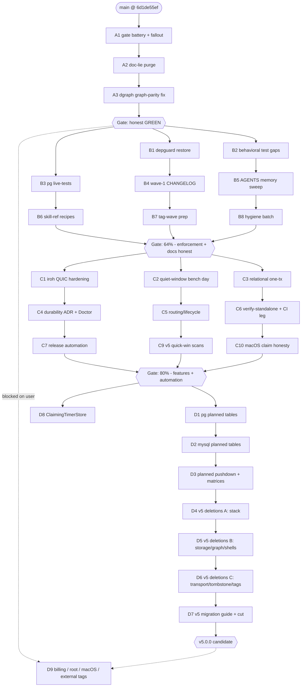

# Pareto Plan: v4 Closeout & v5 Train

**Created:** 2026-08-29 20:33 CEST · **Baseline:** `6d1de55ef` (post TODO-wave-2 + hygiene)
**Sources:** `TODO_LIST.md` (44 open items) + status report `docs/status/2026-08-29_20-23_todo-execution-session-2_status.md` (§b partial, §c not-started, §d fucked-up, §f next-50)
**Grain:** Phase 0–3 medium tasks (30–100 min, 27 tasks) → fine tasks (≤12 min, ~120) → all 44 open TODO lines covered (§6 coverage map).

## 0. Guardrails (the VERSCHLIMMBESSERN clause)

1. Every task ends **green**: build + vet + tests for touched modules; `nix fmt`, `check-changelog-symbols`, `check-duplication`, `check-coverage`, `check-arch` before any "done" claim.
2. No mega-commits: one commit per task (wave-2's 79-file commit was a flagged failure — do not repeat).
3. No behavior flip without a consumer-impact note (CHANGELOG "semantic changes" block + README/godoc same commit).
4. Env facts: `/mnt/buildcache` broken → every go command needs `GOCACHE=/tmp/gocache-verify GOMODCACHE=/tmp/gomod-verify GOPATH=/tmp/gopath-verify GOTOOLCHAIN=auto`; golangci LSP diagnostics are noise, CLI is authoritative. Never run integration suites concurrently with `#verify`.
5. Live-DB tasks (PG, MariaDB, Dgraph) use the ephemeral nix apps; quiet window required for anything with timing asserts; check `uptime` before benches.

## 1. Pareto Breakdown

### The 1% that delivers ~51% — "trustworthy GREEN again"
Three items. Everything else in this plan is worth little if `main` cannot prove it is green and honest.

| ID | What | Why it is the spine |
|----|------|---------------------|
| A1 | Run the unrun gate battery (`check-duplication`, `check-coverage`, `check-arch`, full `#verify`) and fix all fallout | Two waves of changes have never met the duplication/coverage/arch gates; CI will surface them eventually — on its schedule, as a surprise |
| A2 | Kill the doc lies: `Start` godoc still says "re-calling Start on a **fresh Host**" (false since the rebuild change); projectionhost README/doc.go likely still describe the OLD DLQ admission + Reset order | Docs that contradict code destroy the trust the whole SDK sells |
| A3 | Root-cause + fix dgraph graph-parity (`GraphDepthBound`, `GraphDepth3Diamond`) — the only failing tests in the engine matrix | "All tests pass" must be a true sentence; proven pre-existing, but it blocks honest GREEN claims |

### The 4% that delivers ~64% — adds "behavioral completeness + release readiness"
Add: **B1** depguard restored (dependency-budget enforcement back on), **B2** dgraph/DB behavioral test gaps closed, **B3** pg live-tests (VectorCounter + projectionhost PG suites), **B4** wave-1 CHANGELOG backfill (completes the changelog-honesty policy), **B5** AGENTS.md memory sweep, **B6** skill-ref recipes, **B7** tag-wave prep (pins, vulncheck, GOWORK=off matrix, quic replace strip), **B8** hygiene batch (ErrWorkerFailed sentinel, WorkerState reset doc, `t/tasks.buf`, TODO checkbox reconciliation).

### The 20% that delivers ~80% — adds "feature completion + release automation"
Add: **C1** iroh QUIC test hardening, **C2** ReadCosts calibration (badger/bbolt/pebble) + Turso CTE probe, **C3** storage/relational one-tx-per-event, **C4** durability-tier ADR + Doctor surface check, **C5** metaengine routing/lifecycle follow-ups, **C6** `#verify-standalone` app + CI GOWORK=off leg, **C7** release automation (GitHub Releases script, retract-and-republish + pre-tag docs, replace-drop sweep, indirect-dep consolidation), **C9** v5 quick-win scans, **C10** macOS ephemeral-PG claim honesty.

### The remaining 80% → 100% — "the v5 train + big features"
**D1–D3** planned-table appliers (pg, mysql, pushdown), **D4–D6** v5 deletion waves (ADR-0123/0126/0127, tombstone completion, `NewStreamRef` validation, snapshot wire tags, extended-review items E1/E7/E8/E11/E13/E15), **D7** full v5 migration guide + cut checklist, **D8** ClaimingTimerStore, **D9** user-blocked items (billing, root, macOS hardware, external-repo tags, judgment ratifications).

## 2. Medium-Granularity Plan (30–100 min, 27 tasks, ALL open TODOs)

| ID | Task | Covers (TODO_LIST lines) | Effort | Impact | Sorted tier |
|----|------|--------------------------|--------|--------|-------------|
| A1 | Gate battery: run `check-duplication`/`check-coverage`/`check-arch`/`#verify`, fix all fallout (expected: new-code clones, pg VectorCount coverage dip) | — (verification debt, report §c) | 60m | 🔥 critical | 1% |
| A2 | Doc-lie purge: `Start` godoc, projectionhost README/doc.go DLQ+Reset+Start claims, doc-check | report §d.7 | 30m | 🔥 critical | 1% |
| A3 | dgraph graph-parity root cause + fix (depth semantics of `@recurse` vs `extractNeighborIDs`), matrix green on ephemeral Dgraph | L32 remainder | 90m | 🔥 critical | 1% |
| B1 | Depguard: restore settings from `38afb6d2e^` at current nesting, indentation-tolerant awk, remove from disable, triage surfaced violations | L255 | 60m | high | 4% |
| B2 | Behavioral test gaps: in-tx read-your-writes test, caller-retry-after-abort test (dgraph), DESC twin-column sort test (MariaDB live) | report §b | 60m | high | 4% |
| B3 | PG live-tests: `VectorCount`/`VectorCollections` + projectionhost `pg_integration`/`pg_testcontainer` suites vs ephemeral PG; fix fallout | report §b.6 | 45m | high | 4% |
| B4 | Wave-1 CHANGELOG backfill (18 module fixes from `ce98b2dda`) + symbols gate | report §b.3 | 45m | high | 4% |
| B5 | AGENTS.md memory sweep (quic replace, depguard state, TEST_ARGS, twin columns, readTx routing, /tmp-cache redirect) + TODO reconciliation + close stale entries (L66 fold done, L49 tail done, L437 conventions already recorded — verify + close) | L66, L49, L437 | 30m | high | 4% |
| B6 | Skill refs: RunInTx recipe, VectorCounter recipe, KeysetPositionQueryChecked migration note, projectionhost contracts in advanced.md | report §b.5 | 30m | med-high | 4% |
| B7 | Tag-wave prep: consumer pin-bump sweep for all changed modules, `#vulncheck`, GOWORK=off build matrix, quic `replace=>../` strip dry-run, pre-tag checklist docs | L115/L167/L193/L433 prep | 60m | high | 4% |
| B8 | Hygiene batch: `ErrWorkerFailed` sentinel, WorkerState counter-reset doc, boundedMap approximation comment, catalog multi-embed conflict note, `t/tasks.buf` investigation, T24 checkbox reconciliation | report §d.9/§e | 30m | med | 4% |
| C1 | iroh QUIC test hardening: normalizeAny tables, dedup.Ring >10K eviction, pooled eviction error-injection + 1K stress, framing dedup, `WithStreamPooling` README row | L38 | 90m | med-high | 20% |
| C2 | Quiet-window bench day: ReadCosts calibration for badger/bbolt/pebble (delete SA1019 exclusion after), Turso CTE-probe test, calibration-vs-baseline run | L36, L234, L198 | 90m | med-high | 20% |
| C3 | storage/relational one-tx-per-event projection writes + tests | L55 | 90m | med | 20% |
| C4 | Durability-tier mapping ADR + verify Doctor/Introspection surface effective tiers for every engine | L78 remainder | 45m | med | 20% |
| C5 | metaengine routing/lifecycle: Calibration setter race, CheckRouting plan-version signature, strict-argmin/hysteresis deadband, over-declared Supports diagnostic | L596 | 90m | med | 20% |
| C6 | `#verify-standalone` nix app (GOWORK=off per module) + CI leg for leaf modules | L211, L216 | 60m | med-high | 20% |
| C7 | Release automation: GitHub-Releases creation script for accumulated tags, retract-and-republish + pre-tag checklist into CONTRIBUTING, replace-drop sweep, indirect-dep consolidation | L167, L173, L177, L186, L188 | 100m | med-high | 20% |
| C9 | v5 quick-win scans: `BuildWhereClause` consumer scan, snapshot wire-tag rename design note, transport deprecated-consumer scan, E1/E7/E8/E11/E13/E15 design notes | L327 prep, L376 prep, L347 prep, L427 prep | 30m | med | 20% |
| C10 | macOS ephemeral-PG: verify claim or mark script honestly unsupported (no hardware → document limitation + CI matrix note) | L266 | 30m | low | 20% |
| D1 | T40a: pgengine planned tables (CREATE TABLE from `ColumnType`, typed writes, reads, information_schema `ALTER ADD COLUMN` evolution) | L24 | 100m | high (v5) | 80% |
| D2 | T40b: mysqlengine planned tables (MariaDB + MySQL dialects) | L24 | 100m | high (v5) | 80% |
| D3 | T40c: planned filter/sort pushdown + live pg/MariaDB matrices | L24 | 100m | high (v5) | 80% |
| D4 | v5 deletion wave A: `stack.Materialize`, `stack.Bundle`+8 presets, `stack.RunProjections` | L308, L316, L319 | 100m | high (v5) | 80% |
| D5 | v5 deletion wave B: `storage` view+relational tiers, `graph.GraphProjection`, `BuildWhereClause`, ADR-0126 compat shells | L310, L313, L322, L327 | 100m | high (v5) | 80% |
| D6 | v5 deletion wave C: transport/http+grpc modules, tombstone metadata API, `NewStreamRef` validation, snapshot wire tags, extended-review E-items | L347, L355, L331, L376, L427 | 100m | high (v5) | 80% |
| D7 | v5 migration guide (full, from V5-OUTLINE) + cut-v5.0.0 checklist (tags, CHANGELOG, README, SKILL.md) + post-landing sweep | L396, L404, L433 | 90m | high (v5) | 80% |
| D8 | ClaimingTimerStore (SKIP LOCKED) + multi-instance scheduling tests | L605 follow-up | 90m | med | 80% |
| D9 | BLOCKED on user/environment: Actions billing → tag wave + transport final tags; MySQL nspawn (root); go-codec F46 (external); dead tags; iroh P99 ratification; macOS hardware | L115, L144, L153, L162, L182, L238, L266, L283 | — | high | gated |

## 3. Fine-Granularity Breakdown (≤12 min each)

| ID | Task (≤12 min) | Parent |
|----|----------------|--------|
| A1.1 | Run `check-duplication`; triage report vs `.art-dupl-baseline.json` | A1 |
| A1.2 | Annotate intentional clones (`//art-dupl:accept`) or extract shared helpers | A1 |
| A1.3 | Run `check-coverage`; identify modules under threshold | A1 |
| A1.4 | Write missing floor tests (pg VectorCount stub-live, boundedMap branch edges) | A1 |
| A1.5 | Run `check-arch`; fix any layer/budget breach | A1 |
| A1.6 | Kick off full `#verify` (quiet window, nothing parallel); triage log | A1 |
| A1.7 | Fix verify fallout; re-run to green; commit | A1 |
| A2.1 | Fix `Start` godoc ("fresh Host" → Stop→Start rebuild works) | A2 |
| A2.2 | Grep projectionhost README/doc.go for DLQ-park/Reset-order claims; fix | A2 |
| A2.3 | doc-check over skill refs; commit | A2 |
| A3.1 | Reproduce divergence in a live ephemeral-Dgraph session; dump DQL response for depth-2 recurse | A3 |
| A3.2 | Compare memory `GraphNeighbors` depth semantics vs dgraph response shape | A3 |
| A3.3 | Fix DQL (`@recurse` depth/projection) or `extractNeighborIDs` descent | A3 |
| A3.4 | Run matrix subtests green on ephemeral Dgraph | A3 |
| A3.5 | Full dgraphengine suite green; commit | A3 |
| B1.1 | Extract old depguard block from `git show 38afb6d2e^:.golangci.yml` | B1 |
| B1.2 | Re-add under current `linters.settings` nesting; drop depguard from `disable` | B1 |
| B1.3 | Make `check-depguard.sh` awk indentation-tolerant (relative-indent allow capture) | B1 |
| B1.4 | Run golangci over modules; collect depguard violations | B1 |
| B1.5 | Fix/allow-list violations; commit with gate green | B1 |
| B2.1 | dgraph: in-tx read-your-writes test (MapSet→MapGet inside fn) | B2 |
| B2.2 | dgraph: caller-retry-after-abort test (abort injected, second RunInTx succeeds) | B2 |
| B2.3 | MariaDB: DESC-order twin-column sort + keyset pagination live test | B2 |
| B2.4 | Run both engine suites against live DBs; commit | B2 |
| B3.1 | Start ephemeral PG; run `pg_integration` projectionhost suites | B3 |
| B3.2 | Add pg `VectorCount`/`VectorCollections` integration tests | B3 |
| B3.3 | Fix fallout; coverage re-check; commit | B3 |
| B4.1 | Draft wave-1 Added/Changed/Fixed sections from `ce98b2dda` diff (18 modules) | B4 |
| B4.2 | Write sections into `[Unreleased]`; cite only golden-backed symbols | B4 |
| B4.3 | Run `check-changelog-symbols`; fix fictions | B4 |
| B4.4 | doc-check; commit | B4 |
| B5.1 | AGENTS.md: quic sibling-replace pending-strip gotcha | B5 |
| B5.2 | AGENTS.md: depguard-disabled state + check-depguard SKIP mode | B5 |
| B5.3 | AGENTS.md: TEST_ARGS passthrough, twin-column layout, dgraph readTx routing | B5 |
| B5.4 | Verify L437 conventions already recorded → close entry; reconcile T24 checkbox; close stale L66 | B5 |
| B5.5 | Commit docs | B5 |
| B6.1 | recipes.md: RunInTx (dgraph) recipe | B6 |
| B6.2 | recipes.md: VectorCounter/Doctor vector-sizes recipe | B6 |
| B6.3 | faq.md: KeysetPositionQueryChecked migration note | B6 |
| B6.4 | advanced.md: projectionhost Stop→Reset→Start + DLQ-family contracts; doc-check; commit | B6 |
| B7.1 | Enumerate changed modules since last tags; `grep` consumer pins | B7 |
| B7.2 | `go mod edit -require` pin bumps across dependents | B7 |
| B7.3 | GOWORK=off build matrix over swept modules | B7 |
| B7.4 | `#vulncheck`; triage | B7 |
| B7.5 | Dry-run tag-release.sh (verify quic replace strip works); do NOT push | B7 |
| B7.6 | Refresh cqrs-lint taskmanager golden if version set changes; commit | B7 |
| B8.1 | `ErrWorkerFailed` sentinel + staleness rewire (additive, golden regen) | B8 |
| B8.2 | WorkerState counter-reset doc (Start-after-Stop) | B8 |
| B8.3 | boundedMap stale-approximation comment; catalog multi-embed conflict note | B8 |
| B8.4 | Investigate `t/tasks.buf` origin (lsof/strings/git log timestamps) | B8 |
| B8.5 | TODO_LIST: close L49 checkbox properly; commit | B8 |
| C1.1 | quic: `normalizeAny` table tests | C1 |
| C1.2 | dedup.Ring >10K eviction regression test | C1 |
| C1.3 | Pooled eviction error-injection test | C1 |
| C1.4 | 1K-op pooled stress test | C1 |
| C1.5 | Loopback/quic framing-constant dedup + `WithStreamPooling` README row | C1 |
| C1.6 | quic suite run (CGo env); commit | C1 |
| C2.1 | Quiet-window check (`uptime`); run badger calibration bench | C2 |
| C2.2 | bbolt + pebble calibration benches; record numbers | C2 |
| C2.3 | Set 4-field ReadCosts; delete SA1019 exclusion; regression run ×3 | C2 |
| C2.4 | Turso CTE-probe test (mirror sqliteengine probe) | C2 |
| C2.5 | Calibration-vs-baseline run (L198); update BENCHMARKS.md; commit | C2 |
| C3.1 | Read relational projection write path; design one-tx batching | C3 |
| C3.2 | Implement batched tx writer | C3 |
| C3.3 | Rollback-atomicity test (mid-batch failure leaves no partial rows) | C3 |
| C3.4 | Perf snapshot (before/after) into BENCHMARKS.md | C3 |
| C3.5 | Suite green; commit | C3 |
| C4.1 | Write durability-tier mapping ADR (per-engine tier→setting table) | C4 |
| C4.2 | Audit DurabilityReporter coverage per engine; fill gaps | C4 |
| C4.3 | Doctor/Introspection surface effective tiers (verify + fix) | C4 |
| C4.4 | Link ADR from CONTRIBUTING release docs; commit | C4 |
| C5.1 | Calibration setters: atomize or document Plan→Calibrate→Probe ordering + race test | C5 |
| C5.2 | CheckRouting cache: include plan version + live NsForRead | C5 |
| C5.3 | Hysteresis: gate assignments, not just suggestions; oscillation test | C5 |
| C5.4 | Over-declared Supports: plan-time diagnostic + routing penalty | C5 |
| C5.5 | Routing suite green; commit | C5 |
| C6.1 | `#verify-standalone` app: GOWORK=off per-module build+test loop | C6 |
| C6.2 | Wire into flake apps; smoke-run | C6 |
| C6.3 | CI leg for leaf modules; commit | C6 |
| C7.1 | Script: create GitHub Releases for accumulated tags (gh CLI, changelog extract) | C7 |
| C7.2 | CONTRIBUTING: retract-and-republish pattern | C7 |
| C7.3 | CONTRIBUTING: pre-tag checklist (vulncheck, pin sweep, matrix) | C7 |
| C7.4 | Replace-drop sweep post-tag (system ×6, others per grep) | C7 |
| C7.5 | Consolidate indirect dep references; commit | C7 |
| C9.1 | `BuildWhereClause` consumer scan → v5 deletion note | C9 |
| C9.2 | Snapshot wire-tag rename design note (T18 audit follow-through) | C9 |
| C9.3 | transport deprecated-consumer scan → ADR-0127 readiness | C9 |
| C9.4 | E-item design notes (E1 Encoding, E7 RetryConfig, E8 Kind, E11 Encode error, E13 phantom param, E15 signatures) | C9 |
| C9.5 | Commit notes into V5-OUTLINE; commit | C9 |
| C10.1 | ephemeral-pg.sh: verify macOS claim vs script reality | C10 |
| C10.2 | Document limitation/CI matrix note; commit | C10 |
| D1.1 | pg: CREATE TABLE from LayoutPlan.ColumnType (typed DDL) | D1 |
| D1.2 | Planned typed write path (INSERT ON CONFLICT, no name heuristics) | D1 |
| D1.3 | Planned point read + scan paths | D1 |
| D1.4 | information_schema column introspection + ALTER ADD COLUMN evolution | D1 |
| D1.5 | Layout conflict guard (PlansColumnCompatible) | D1 |
| D1.6 | Live pg matrix (vs sqlite parity) | D1 |
| D1.7 | Mis-type regression test (result-type change evolves, never drops) | D1 |
| D2.1 | mysql: CREATE TABLE typed DDL (MariaDB + MySQL dialects) | D2 |
| D2.2 | Planned typed write path | D2 |
| D2.3 | Planned reads + json_extract fallback | D2 |
| D2.4 | information_schema evolution (MariaDB IF NOT EXISTS vs MySQL) | D2 |
| D2.5 | Layout conflict guard | D2 |
| D2.6 | Live MariaDB matrix | D2 |
| D2.7 | Mis-type regression test | D2 |
| D3.1 | Planned filter pushdown (pg: typed columns; mysql: gc columns) | D3 |
| D3.2 | Planned sort/cursor pushdown | D3 |
| D3.3 | EXPLAIN index-usage proofs | D3 |
| D3.4 | Cross-engine parity vs sqlite planned fixtures | D3 |
| D3.5 | Injection adversarial tests for planned identifiers | D3 |
| D3.6 | Live matrices green; commit | D3 |
| D4.1 | Delete `stack.Materialize` + fix consumers | D4 |
| D4.2 | Delete `stack.Bundle` + presets (8 modules) | D4 |
| D4.3 | Delete `stack.RunProjections`; rebalance testModules/api list | D4 |
| D4.4 | GOWORK=off matrix + doc sweep | D4 |
| D4.5 | Commit per deletion cluster | D4 |
| D5.1 | Delete storage view + relational tiers | D5 |
| D5.2 | Delete graph.GraphProjection (graphadapter keeps driver/sink) | D5 |
| D5.3 | Delete BuildWhereClause (post C9.1 scan) | D5 |
| D5.4 | Delete ADR-0126 shells (schema/signing/encryption/metadata) | D5 |
| D5.5 | Golden + refs sweep; commit | D5 |
| D6.1 | Delete transport/http + grpc modules | D6 |
| D6.2 | Delete tombstone metadata API (listing bridge stays) | D6 |
| D6.3 | `NewStreamRef` breaking validation | D6 |
| D6.4 | Snapshot wire-tag renames | D6 |
| D6.5 | E-items (E1/E7/E8/E11/E13/E15); commit | D6 |
| D7.1 | Expand V5-OUTLINE to full guide per section | D7 |
| D7.2 | Cut checklist: tag order, CHANGELOG split, README/SKILL.md | D7 |
| D7.3 | Post-landing sweep: meta-tests, doc-check, record/v4 consumer pins | D7 |
| D7.4 | Dry-run cut on worktree | D7 |
| D7.5 | Execute cut (or hand off checklist); commit | D7 |
| D8.1 | Design ClaimingTimerStore (SKIP LOCKED schema + claim lease) | D8 |
| D8.2 | Implement SQLTimerStore claim path | D8 |
| D8.3 | Two-Scheduler no-double-fire test (real DB) | D8 |
| D8.4 | Lease-expiry re-dispatch test | D8 |
| D8.5 | Docs + recipes; commit | D8 |

## 4. Execution Graph

## 5. Sorted Execution Order

1% → A1, A2, A3 · 4% → B1, B2, B3, B4, B5, B6, B7, B8 · 20% → C1, C2, C3, C4, C5, C6, C7, C9, C10 · rest → D1–D8 · gated → D9.
Within each tier: smaller effort first at equal impact; live-DB tasks (A3, B2, B3, C2, D2/D3) batched per booted server to amortize startup.

## 6. Coverage Map (every open TODO_LIST line → task)

| TODO line(s) | Task(s) |
|---|---|
| L24 (T40 planned tables) | D1, D2, D3 |
| L32 (dgraph gaps) | A3 (parity), B2 (behavioral) |
| L36 (ReadCosts) | C2 |
| L38 (iroh QUIC) | C1 |
| L49 (injection tail) | B8.5 (closure), A1 (gates) |
| L55 (relational one-tx) | C3 |
| L66 (CHANGELOG fold — stale) | B5.4 |
| L78 (release docs remainder) | C4, C7 |
| L94 (/mnt/buildcache) | standing env constraint (§0.4), B5 records |
| L115/L182 (tag waves, BLOCKED) | B7 (prep), D9 (gated) |
| L144/L153/L162 (dead tags, F46, P99) | D9 |
| L167/L173/L177/L186/L188/L193 | C7, B7 |
| L198 (calibration vs baseline) | C2 |
| L211/L216 (verify-standalone, CI leg) | C6 |
| L234 (Turso CTE) | C2 |
| L238 (nspawn, BLOCKED root) | D9 |
| L255 (golangci audit + depguard) | B1 |
| L266 (macOS PG) | C10 |
| L283 (Actions billing, BLOCKED) | D9 |
| L308–L331 (v5 deletions A/B) | D4, D5 |
| L347/L355/L376 (transport, tombstone, wire tags) | D6 |
| L327 (BuildWhereClause) | C9.1 → D5.3 |
| L331 (NewStreamRef) | D6.3 |
| L396/L404 (migration guide, cut) | D7 |
| L427 (E-items) | C9.4 → D6.5 |
| L433 (post-landing sweep) | D7.3 |
| L437 (AGENTS data-model memory) | B5.4 (verify + close) |
| L596 (routing/lifecycle) | C5 |
| report §d.7/§d.9/§e (doc lies, sentinel, counters) | A2, B8, B2, B3 |

**Blocked items (D9)** require user/environment input: GitHub Actions billing, root for nspawn, macOS hardware, external-repo tags (go-codec F46), judgment ratifications (dead tags strategy, iroh P99).
