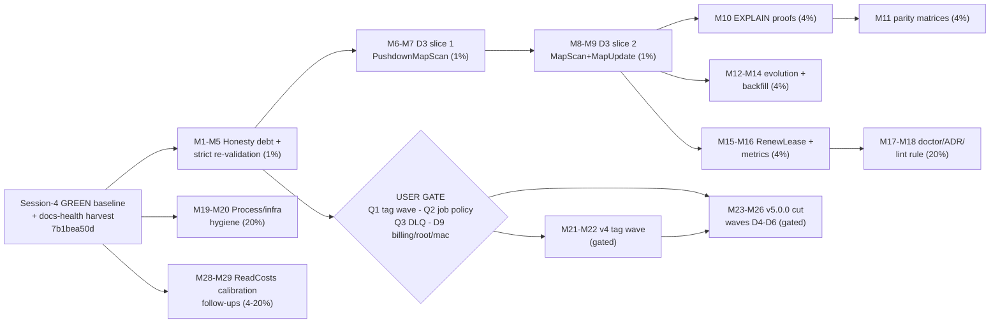

# Pareto Master Plan — Session 5: D3 Pushdown & the v5 Train (2026-08-30 19:18)

> **Point-in-time snapshot.** The living backlog is [`TODO_LIST.md`](../../TODO_LIST.md)
> (§ "Session-4/5 Forward Ledger", harvested 2026-08-30 in `70917c96b`); this plan is
> the execution breakdown of that backlog into two granularities. Companion snapshot
> with full visual treatment:
> [`2026-08-30_15_04-pareto-session5-execution-plan.html`](2026-08-30_15_04-pareto-session5-execution-plan.html).

## 1. Context — where we are

- **Baseline:** session 4 closed GREEN (`nix run .#verify` EXIT=0: build, vet, test, race,
  lint 76/76, check-arch, check-depguard, check-duplication 0-new, check-coverage,
  api-stability, doc-check). Session-4 retro:
  `docs/status/2026-08-30_14-57_session-4-retrospective-and-status.md` (§a–g).
- **Already landed on top (2026-08-30 afternoon):** docs-health harvest
  (`70917c96b` TODO_LIST, `93b1cb40e` CHANGELOG entries for ClaimingTimerStore /
  ApplyLayoutPlan / ErrWorkerFailed, changelog symbol gate 127 citations green) and the
  concurrent ReadCosts-calibration wave (`7b1bea50d`, incl. FEATURES.md rows for
  calibration + the previously-deferred FEATURES debt un-blocked).
- **The one big engineering gap:** planned tables route only `MapSet/MapGet/MapDelete`.
  `PushdownMapScan`/`MapScan`/`MapUpdate` still hit `meta_map` — the documented
  **planned/meta_map visibility split**. Everything else is proof, evolution, hygiene,
  and semver-gated v5 work.
- **All 50 retrospective items (§f 1–50) + §g questions are covered below. Nothing dropped.**
  Additionally covers the concurrent session's calibration harvest (11 items from
  `docs/status/2026-08-30_16-13_readcosts-calibration-and-iroh-quic-hardening.md`, added
  to TODO_LIST at ~19:40) as WS-M / M28–M29.

## 2. Environment (EVERY go/nix command)

```bash
export GOCACHE=/home/lars/projects/.gocache-disk GOMODCACHE=/tmp/gomod-verify \
       GOPATH=/tmp/gopath-verify GOTOOLCHAIN=auto \
       GOLANGCI_LINT_CACHE=/home/lars/projects/.golangci-disk \
       GOTMPDIR=/home/lars/projects/.gotmp TMPDIR=/home/lars/projects/.gotmp
```

Reason: `/mnt/buildcache` is broken and `/tmp` is a shared tmpfs where ENOSPC corrupts
caches into phantom lint errors. Live DBs: ephemeral PG (`nix run .#integration-pg`),
userspace MariaDB at `127.0.0.1:33061` (`cqrs:cqrs@tcp(127.0.0.1:33061)/cqrs_test?parseTime=true`),
ephemeral Dgraph (`nix run .#integration-dgraph`).

## 3. Guardrails (session-4 lessons, non-negotiable)

1. **Per-task gates**: every code commit ends with the gates its diff can affect
   (api golden + lint + check-duplication for code; doc-check for skill docs) — never one
   mega-verify at session end. Golden regen happens in the SAME edit as API changes.
2. **Background jobs**: `> file 2>&1`, poll on a timer, never pipe through `tail`,
   auto-kill via `timeout -k`.
3. **Strict-mode honesty**: live-DB validation runs under `GOWORK=off` + live DSN, or the
   ledger says otherwise.
4. **Read local conventions before writing tests** (serial-phase notes in
   `dgraphengine/graph_ext_test.go`, fixture helpers, ID constructors); heap-measuring
   tests never `t.Parallel()`.
5. **Failing test before root-cause claim**; re-verify stale audit claims before executing.
6. Never push without explicit user instruction (this session: explicitly instructed).
7. Concurrent sessions are active — `git status` before every edit; never touch files
   with foreign uncommitted changes.

## 4. Pareto breakdown

| Tier            | Tasks (medium) | Share of tasks | Cumulative value | Rationale                                                                                                                                                                                                                                                                                      |
| --------------- | -------------- | -------------- | ---------------- | ---------------------------------------------------------------------------------------------------------------------------------------------------------------------------------------------------------------------------------------------------------------------------------------------- |
| **1%**          | M1–M9          | 31%            | **~51%**         | Honesty debt close-out + strict-mode re-validation + the two D3 slices that make planned tables real for reads/updates (kills the visibility split). Nothing else in the repo changes consumer-perceived capability more per hour.                                                             |
| **4%**          | M10–M16, M28   | 31%            | **~64%**         | Prove the pushdown (EXPLAIN index proofs, cross-engine parity) and complete the planned-table story (reflection-derived layout, schema evolution, backfill) + make ClaimingTimerStore production-grade (RenewLease, metrics) + reconcile the calibration model with real-profile routing pins. |
| **20%**         | M17–M20, M29   | 17%            | **~80%**         | Observability (Doctor planned-table surfacing), the planned-vs-generated-columns decision record, the lint rule steering consumers to the plan path, process/infra hygiene that prevents a session-4 repeat, and calibration infrastructure (protocol, drift job, sqliteengine profile).       |
| **Rest → 100%** | M21–M27        | 24%            | **→ 100%**       | Semver-gated v4 tag wave, the v5.0.0 deletion waves (D4–D6), wire-tag rename, error-code rename — all staged, all waiting on the user's §g answers (Q1/Q2/Q3, D9).                                                                                                                             |

## 5. Execution graph



## 6. Layer 1 — Comprehensive plan (27 tasks, 30–100 min each)

Sorted by importance/impact/effort/customer-value. "Src" cites the retrospective item.

| #   | Task (medium granularity)                                                                                                                                                                                                                                                                        | Est  | Tier | Value | Eff | Depends | Src                           |
| --- | ------------------------------------------------------------------------------------------------------------------------------------------------------------------------------------------------------------------------------------------------------------------------------------------------ | ---- | ---- | ----- | --- | ------- | ----------------------------- |
| M1  | Honesty-debt docs close-out: FEATURES.md rows (claiming timers, planned tables, ErrWorkerFailed — unblocked by `7b1bea50d`) + recipes 2.26/2.27 + modules.md planned-capability rows + doc-check                                                                                                 | 75m  | 1%   | H     | M   | —       | §f 5,7,8                      |
| M2  | Strict-mode re-validation: pgengine planned tests under GOWORK=off + live DSN; one full strict 7-module PG loop; record ledger entries (closes b.4)                                                                                                                                              | 40m  | 1%   | H     | M   | —       | §b4, §f 3,12                  |
| M3  | Run `nix run .#load-sweep` before the next `#verify` (C5 touched timing paths); record results                                                                                                                                                                                                   | 40m  | 1%   | H     | S   | —       | §f 11                         |
| M4  | Mis-type error classification: decide Rejection-vs-Infrastructure for extracted-column type conflicts, implement, test                                                                                                                                                                           | 45m  | 1%   | H     | M   | —       | §f 10                         |
| M5  | Routing decisions batch: counters (CounterIncrement/Get), graph/aggregates on planned collections (document-or-route), pgengine README layout story, adttest timer-store slot                                                                                                                    | 60m  | 1%   | M     | M   | —       | §f 9,13,14,15                 |
| M6  | D3 slice 1 (pg): filter→native-column design; PushdownMapScan filters/sort/keyset; planless fallback; live PG tests                                                                                                                                                                              | 100m | 1%   | H     | L   | M2      | §f 1                          |
| M7  | D3 slice 1 (mysql): port filters/sort/keyset (backticks, DESC twin lessons); live MariaDB parity; slice gates + commit                                                                                                                                                                           | 60m  | 1%   | H     | M   | M6      | §f 1                          |
| M8  | D3 slice 2 (pg): MapScan + MapUpdate planned branches; visibility-split parity tests                                                                                                                                                                                                             | 60m  | 1%   | H     | M   | M7      | §f 2                          |
| M9  | D3 slice 2 (mysql): port both branches; live tests; gates + commit + faq update                                                                                                                                                                                                                  | 60m  | 1%   | H     | M   | M8      | §f 2                          |
| M10 | D3 slice 3: EXPLAIN index-usage proofs — pg `EXPLAIN (FORMAT JSON)` + mysql EXPLAIN; assert index not seq-scan; wire into suite                                                                                                                                                                  | 75m  | 4%   | H     | M   | M9      | §f 16                         |
| M11 | D3 slice 4: cross-engine parity matrices via adttest (sqlite vs pg vs mysql fixtures)                                                                                                                                                                                                            | 60m  | 4%   | M     | M   | M9      | §f 17                         |
| M12 | `LayoutPlanFromType` pg+mysql: reflection-derived column types replacing name heuristics                                                                                                                                                                                                         | 75m  | 4%   | M     | M   | —       | §f 18                         |
| M13 | information_schema column evolution: reader + idempotent ALTER ADD COLUMN, pg then mysql                                                                                                                                                                                                         | 75m  | 4%   | M     | M   | M12     | §f 19                         |
| M14 | Opt-in backfill helper (meta_map → planned copy) + tests + gates                                                                                                                                                                                                                                 | 45m  | 4%   | M     | M   | M9      | §f 20                         |
| M15 | `RenewLease(ctx, id, extend)`: API design, pg + sqlite implementations, handler-outlives-lease tests                                                                                                                                                                                             | 75m  | 4%   | H     | M   | —       | §f 21                         |
| M16 | Claiming metrics hooks (claimed/expired/reclaimed) on the scheduling metrics surface + tests                                                                                                                                                                                                     | 45m  | 4%   | M     | M   | M15     | §f 22                         |
| M17 | Doctor/Introspection: planned-table registration + per-collection row counts                                                                                                                                                                                                                     | 45m  | 20%  | M     | M   | M9      | §f 23                         |
| M18 | ADR addendum planned-vs-generated columns (gcn_) + cqrs-lint rule (ApplyLayout on LayoutPlanApplier engines → prefer plan) + golden                                                                                                                                                              | 60m  | 20%  | M     | M   | —       | §f 24,25                      |
| M19 | Process rules into AGENTS.md (per-task gates, background jobs) + LSP GOLANGCI_LINT_CACHE fix + tasks.buf/trash hygiene                                                                                                                                                                           | 45m  | 20%  | H     | S   | —       | §f 41,42,48,49                |
| M20 | Script hardening: dgraph health-endpoint wait, `-shuffle=on` evaluation, SOAK_SKIP doc, PG_MODULES override, batch-release `--dry-run`                                                                                                                                                           | 90m  | 20%  | M     | M   | —       | §f 43–47                      |
| M28 | ReadCosts calibration reconciliation (added ~19:40 from the concurrent 16-13 harvest): ReadAggregate model decision (CounterGet vs SQL SUM) + constant/comment/AGENTS alignment + real-profile routing regression test + `TestEveryEngineSetsReadCosts` meta-test + dedup↔quic capacity constant | 60m  | 4%   | M     | M   | —       | 16-13 §c1,§b2,§b6,§f38        |
| M29 | Calibration infrastructure (same harvest): sqliteengine ReadCosts benches + profile, bench protocol + baseline doc + bbolt re-run, CI calibration-drift job, engine README cost tables, iroh replicated cost honesty, iroh QUIC CGo suite execution                                              | 100m | 20%  | M     | L   | —       | 16-13 §b1,§b3–b5,§c6,§f7,§f10 |
| M21 | **[GATE Q1]** v4 tag wave core: confirm dry-runs, cut+push dgraphengine v4.2.0 / sqliteengine v4.3.0 / projectionhost v4.5.0, post-tag verify                                                                                                                                                    | 60m  | gate | H     | M   | Q1      | §f 34                         |
| M22 | **[GATE Q1]** v4 tag wave extended: dry-runs (pgengine, mysqlengine, scheduling/sqlstore, metaengine), pin pre-bumps, interleaved cut→push, replace-strip, GH releases, GOWORK=off matrix, taskmanager golden                                                                                    | 100m | gate | H     | L   | M21     | §f 35–38                      |
| M23 | **[GATE Q2+Q3]** D4 wave A: re-verify consumer scans; delete stack presets + Bundle + Materialize + RunProjections; golden + V5 guide + gates                                                                                                                                                    | 90m  | gate | M     | L   | Q2,Q3   | §f 27                         |
| M24 | D5 wave B: delete storage view+relational, GraphProjection, BuildWhereClause, ADR-0126 shells; golden + gates                                                                                                                                                                                    | 90m  | gate | M     | L   | M23     | §f 28                         |
| M25 | D6 wave C: delete transport/http+grpc, tombstone metadata API; NewStreamRef strictness; wire-tag renames + legacy-reader removal; golden + gates                                                                                                                                                 | 100m | gate | H     | XL  | M24     | §f 29                         |
| M26 | Error-code rename aggregate__→stream__ + dashboards note; wire-tag SQL ALTER migrations; v5 CHANGELOG assembly; post-cut `Deprecated:` sweep                                                                                                                                                     | 100m | gate | M     | L   | M25     | §f 30–33                      |
| M27 | **[USER]** Ratify Q1 (tag wave), Q2 (unattended-job policy), Q3 (DLQ semantics); D9 (billing/root/macOS/external tags)                                                                                                                                                                           | —    | gate | H     | —   | —       | §g 1–3                        |

**Effort totals:** ungated M1–M20, M28–M29 ≈ **23 h**; gated M21–M26 ≈ **9 h** (+ user decisions).

## 6b. WS-M — calibration follow-ups fine tasks (from the 16-13 harvest)

| #   | Task                                                                                                        | Est | Dep |
| --- | ----------------------------------------------------------------------------------------------------------- | --- | --- |
| m1  | ReadAggregate model decision doc: CounterGet-everywhere vs SQL SUM as intentional — pick one, record it     | 12m | —   |
| m2  | Align pg/mysql/duckdb `NsPerAggregate` constants + bench comments + AGENTS wording to the decision          | 12m | m1  |
| m3  | sqliteengine point-lookup (PK Get) calibration bench                                                        | 12m | —   |
| m4  | sqliteengine filtered-scan + SQL-SUM-aggregate + full-scan benches                                          | 12m | m3  |
| m5  | sqliteengine 4-field `ReadCosts` profile + tests                                                            | 12m | m4  |
| m6  | Multi-engine routing regression test with REAL badger/bbolt/pebble `Profile()`s                             | 12m | —   |
| m7  | Execute the iroh QUIC CGo suite (Rust toolchain, Linux); convert inspection-only pins to execution-verified | 12m | —   |
| m8  | Calibration bench protocol doc (discard-warmup, `-count=5` medians, ambient load + commit recorded)         | 12m | —   |
| m9  | `docs/benchmarks/calibration-2026-08-30.md` with raw runs + bbolt FilteredScan re-run (cold-outlier fix)    | 12m | m8  |
| m10 | CI calibration-drift job (scheduled benches, warn >25% vs shipped constants)                                | 12m | m9  |
| m11 | `TestEveryEngineSetsReadCosts` meta-test (expected-RED for sqlite until m5)                                 | 12m | m5  |
| m12 | dedup↔quic capacity coupling: named constant or meta-test for `NewRing(10000)`                              | 8m  | —   |
| m13 | Engine README per-pattern cost tables (badger/bbolt/pebble)                                                 | 12m | m2  |
| m14 | iroh replicated `Profile()` cost-honesty note (replication overhead)                                        | 8m  | —   |

## 7. Layer 2 — Fine plan (109 tasks, ≤12 min each)

The ≤12-min breakdown. ✅ = already done while planning (evidence cited). Source of truth
for open items remains `TODO_LIST.md`.

### WS-A — Honesty debt (1%)

| #   | Task                                                                                          | Est | Dep     |
| --- | --------------------------------------------------------------------------------------------- | --- | ------- |
| A1  | Start ephemeral PG; run pgengine planned tests GOWORK=off + live DSN (closes b.4)             | 10m | —       |
| A2  | Record b.4 closure in TODO_LIST + ledger                                                      | 5m  | A1      |
| A3  | ~~CHANGELOG: ClaimingTimerStore~~ ✅ `93b1cb40e`                                              | 10m | —       |
| A4  | ~~CHANGELOG: ApplyLayoutPlan pg~~ ✅ `93b1cb40e`                                              | 10m | —       |
| A5  | ~~CHANGELOG: ApplyLayoutPlan mysql + routing~~ ✅ `93b1cb40e`                                 | 10m | —       |
| A6  | ~~CHANGELOG: ErrWorkerFailed~~ ✅ `93b1cb40e`                                                 | 5m  | —       |
| A7  | ~~Changelog symbol gate~~ ✅ EXIT=0, 127 citations                                            | 8m  | A3–A6   |
| A8  | FEATURES.md rows: claiming timers, planned tables, ErrWorkerFailed (unblocked by `7b1bea50d`) | 12m | —       |
| A9  | ~~TODO_LIST: add session-4 follow-ups~~ ✅ `70917c96b` (forward-ledger section)               | 10m | —       |
| A10 | Recipe 2.26 ClaimingTimerStore (two-Scheduler, lease sizing)                                  | 12m | A3      |
| A11 | Recipe 2.27 planned tables (LayoutPlanApplier, no-backfill)                                   | 12m | A4–A5   |
| A12 | modules.md rows: planned capability per engine                                                | 10m | A11     |
| A13 | doc-check on skill docs (zero-warning)                                                        | 8m  | A10–A12 |
| A14 | pgengine README: ApplyLayout vs ApplyLayoutPlan guidance                                      | 10m | —       |
| A15 | Mis-type classification: decide + implement + test                                            | 12m | —       |
| A16 | Counter routing decision doc (planned collections)                                            | 10m | —       |
| A17 | Graph/aggregate routing decision doc                                                          | 10m | —       |
| A18 | adttest/enginetest timer-store slot: add or document why not                                  | 12m | —       |
| A19 | `nix run .#load-sweep` (background + poll)                                                    | 12m | —       |
| A20 | Strict 7-module PG loop re-run + record                                                       | 12m | A1      |

### WS-B — D3 slice 1: PushdownMapScan (1%)

| #   | Task                                                | Est | Dep    |
| --- | --------------------------------------------------- | --- | ------ |
| B1  | Read pgengine scan path + planFor seam              | 10m | —      |
| B2  | Design filter→native-column SQL mapping             | 12m | B1     |
| B3  | Planned branch: filters (pg)                        | 12m | B2     |
| B4  | Planned branch: sort (pg)                           | 10m | B3     |
| B5  | Planned branch: keyset cursor (pg)                  | 12m | B4     |
| B6  | Fallback policy: planless collections keep meta_map | 10m | B3     |
| B7  | Live PG tests: filter/sort/keyset                   | 12m | B5,B6  |
| B8  | mysql port: filters                                 | 12m | B3     |
| B9  | mysql port: sort + keyset                           | 12m | B4,B8  |
| B10 | Live MariaDB parity tests                           | 12m | B9     |
| B11 | Slice gates + commit                                | 10m | B7,B10 |

### WS-C — D3 slice 2: MapScan + MapUpdate (1%)

| #  | Task                                  | Est | Dep   |
| -- | ------------------------------------- | --- | ----- |
| C1 | MapScan planned branch (pg)           | 12m | B11   |
| C2 | MapUpdate planned branch (pg)         | 12m | C1    |
| C3 | Live PG visibility-split parity tests | 12m | C2    |
| C4 | mysql MapScan port                    | 10m | C1    |
| C5 | mysql MapUpdate port                  | 12m | C2    |
| C6 | Live MariaDB parity tests             | 12m | C4,C5 |
| C7 | Slice gates + commit + faq update     | 10m | C6    |

### WS-D — EXPLAIN proofs (4%)

| #  | Task                              | Est | Dep |
| -- | --------------------------------- | --- | --- |
| D1 | pg EXPLAIN (FORMAT JSON) harness  | 12m | C7  |
| D2 | pg: assert index, no seq scan     | 12m | D1  |
| D3 | mysql EXPLAIN harness + assertion | 12m | D2  |
| D4 | Wire into suite + gates + commit  | 10m | D3  |

### WS-E — Parity matrices (4%)

| #  | Task                             | Est | Dep |
| -- | -------------------------------- | --- | --- |
| E1 | adttest planned-collection hooks | 12m | C7  |
| E2 | sqlite vs pg fixtures            | 12m | E1  |
| E3 | mysql fixtures + run matrix      | 12m | E2  |
| E4 | Gates + commit                   | 8m  | E3  |

### WS-F — Evolution + backfill (4%)

| #  | Task                                              | Est | Dep   |
| -- | ------------------------------------------------- | --- | ----- |
| F1 | Design LayoutPlanFromType (reflection→ColumnType) | 12m | —     |
| F2 | Implement (pg) + tests                            | 12m | F1    |
| F3 | Implement (mysql) + tests                         | 12m | F2    |
| F4 | information_schema reader (pg)                    | 12m | F2    |
| F5 | Idempotent ALTER ADD COLUMN (pg)                  | 12m | F4    |
| F6 | mysql port + live tests                           | 12m | F5    |
| F7 | Backfill helper design                            | 10m | —     |
| F8 | Backfill impl + tests + gates                     | 12m | F7,C7 |

### WS-G — D8 extensions (4%)

| #  | Task                                      | Est | Dep |
| -- | ----------------------------------------- | --- | --- |
| G1 | RenewLease API design                     | 10m | —   |
| G2 | RenewLease pg                             | 12m | G1  |
| G3 | RenewLease sqlite                         | 12m | G2  |
| G4 | Handler-outlives-lease tests              | 12m | G3  |
| G5 | Metrics hooks (claimed/expired/reclaimed) | 12m | G4  |
| G6 | Metrics tests + gates + commit            | 10m | G5  |

### WS-H — Observability + lint (20%)

| #  | Task                                     | Est | Dep |
| -- | ---------------------------------------- | --- | --- |
| H1 | Doctor: planned-table registration       | 12m | C7  |
| H2 | Doctor: row counts                       | 10m | H1  |
| H3 | ADR: planned vs generated columns        | 12m | —   |
| H4 | cqrs-lint rule: prefer LayoutPlanApplier | 12m | —   |
| H5 | Rule tests + golden + commit             | 10m | H4  |

### WS-I — Process + infra hygiene (20%)

| #   | Task                                       | Est | Dep |
| --- | ------------------------------------------ | --- | --- |
| I1  | AGENTS.md: per-task gate rule              | 10m | —   |
| I2  | AGENTS.md: background-job rule             | 8m  | —   |
| I3  | LSP GOLANGCI_LINT_CACHE fix                | 10m | —   |
| I4  | Dgraph health-endpoint wait + timeout      | 12m | —   |
| I5  | Evaluate `-shuffle=on` dgraph/mysql suites | 12m | —   |
| I6  | Document SOAK_SKIP_* × dgraph discrepancy  | 10m | —   |
| I7  | ephemeral-pg.sh PG_MODULES override        | 10m | —   |
| I8  | batch-release.sh --dry-run                 | 10m | —   |
| I9  | Retire/wire t/tasks.buf                    | 8m  | —   |
| I10 | Sweep .trash-* + a3-*.log scratch          | 8m  | —   |

### WS-J — v4 tag wave (gated on Q1)

| #   | Task                                              | Est | Dep |
| --- | ------------------------------------------------- | --- | --- |
| J1  | **[USER Q1]** go/no-go + membership               | —   | —   |
| J2  | Confirm 3 dry-runs green                          | 10m | J1  |
| J3  | Cut+push dgraphengine v4.2.0                      | 12m | J2  |
| J4  | Cut+push sqliteengine v4.3.0                      | 12m | J3  |
| J5  | Cut+push projectionhost v4.5.0                    | 12m | J4  |
| J6  | Dry-run extended wave (4 modules)                 | 12m | J1  |
| J7  | Pre-bump dependent pins                           | 12m | J6  |
| J8  | Cut+push extended wave (interleaved)              | 12m | J7  |
| J9  | Replace-strip sweep (quic/iroh pending)           | 10m | J8  |
| J10 | create-github-releases.sh per tag                 | 12m | J8  |
| J11 | Post-wave GOWORK=off matrix                       | 12m | J8  |
| J12 | cqrs-lint taskmanager golden (V006)               | 10m | J8  |
| J13 | Indirect-dep consolidation + storage-tag decision | 10m | J11 |

### WS-K — v5.0.0 cut waves (gated on Q2+Q3)

| #   | Task                                          | Est | Dep |
| --- | --------------------------------------------- | --- | --- |
| K1  | **[USER Q2+Q3]** ratify policies              | —   | —   |
| K2  | D4: re-verify wave-A consumer scans           | 12m | K1  |
| K3  | D4: delete stack presets + Bundle             | 12m | K2  |
| K4  | D4: delete Materialize + RunProjections       | 12m | K3  |
| K5  | D4: golden + guide + gates + commit           | 12m | K4  |
| K6  | D5: delete view + relational tiers            | 12m | K5  |
| K7  | D5: delete GraphProjection + BuildWhereClause | 12m | K6  |
| K8  | D5: delete ADR-0126 shells                    | 12m | K7  |
| K9  | D5: golden + guide + gates + commit           | 12m | K8  |
| K10 | D6: delete transport/http + grpc              | 12m | K9  |
| K11 | D6: delete tombstone metadata API             | 12m | K10 |
| K12 | D6: NewStreamRef + wire-tag renames           | 12m | K11 |
| K13 | D6: golden + guide + gates + commit           | 12m | K12 |
| K14 | Error-code rename aggregate__→stream__        | 12m | K13 |
| K15 | Wire-tag release + decode-only fallback       | 12m | K13 |
| K16 | Wire-tag SQL ALTER migrations                 | 12m | K15 |
| K17 | v5 CHANGELOG assembly                         | 12m | K16 |
| K18 | Post-cut Deprecated: sweep                    | 10m | K17 |

### WS-L — User-blocked

| #  | Task                                                       | Est | Dep |
| -- | ---------------------------------------------------------- | --- | --- |
| L1 | **[USER Q2]** unattended long-job policy                   | —   | —   |
| L2 | **[USER Q3]** DLQ semantics (blocks projectionhost polish) | —   | —   |
| L3 | **[BLOCKED D9]** billing / root / macOS hw / external tags | —   | —   |

## 8. User gates (answers requested — nothing below runs without them)

1. **Q1 — tag wave go/no-go (WS-J):** cut and PUSH the prepared v4 wave? Members: the three
   dry-run-proven modules (dgraphengine v4.2.0, sqliteengine v4.3.0, projectionhost v4.5.0),
   optionally extended by pgengine, mysqlengine, scheduling/sqlstore, metaengine after their
   dry-runs. Pushing is the hard gate only the user can authorize.
2. **Q2 — unattended long-job policy:** poll-and-report cadence + auto-kill bound, a
   never-run-longer-than-X rule, or a watchdog script. Open since session 3.
3. **Q3 — DLQ semantics:** keep fail-loudly as the only mode, or add opt-in
   "park-everything-never-fail-the-worker"? Changes projectionhost's public contract.
4. **D9 — external blockers:** GitHub Actions billing, root (mysql-nspawn), macOS hardware,
   external tag creation.

## 9. Critical path & verification

- **Path:** A → B → C → D → E and C → F/G → H; I runs parallel from the start;
  J/K wait on the §g answers.
- **Per-task gates:** code → module lint + `go vet` + targeted tests (+ api golden when
  exports change + art-dupl annotations for intentional clones); docs → doc-check; sessions
  end with `nix run .#verify` only after `nix run .#load-sweep` (M3) is green.
- **Done means:** gates green per task, ledger updated (TODO_LIST closed in the same change),
  no stale GREEN claims.
