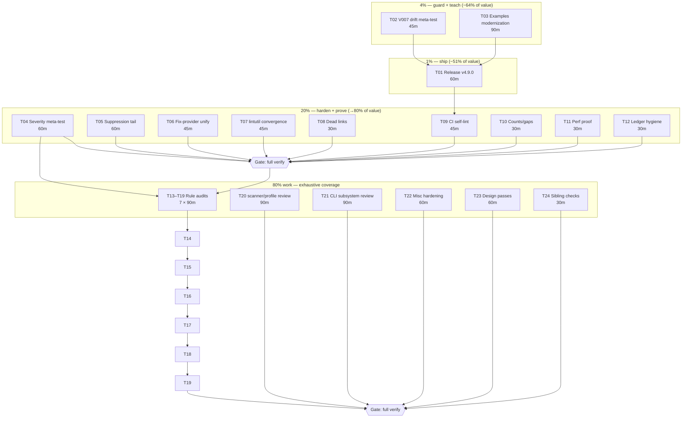

# Pareto Execution Plan — cqrs-lint v5-Hardening Wave

**Created:** 2026-09-06 00:31 CEST · **Scope:** all 50 open items from the
cqrs-lint deep review (`docs/status/archived/2026-09-06_00-19_cqrs-lint-deep-review-v5-migration-rule.md`)

- `TODO_LIST.md § cqrs-lint` · **Baseline:** `nix run .#verify` EXIT 0

## Context

The previous session shipped V007 (`v5-removed-api-usage`, rule #204), fixed
five linter bugs (suppression fail-open, stale false-positives, auto-fix
wrong-occurrence, A014 alias-blindness, index panic), and rescued the repo's
own verify gate from a 366-file gci failure. Everything lives on **master,
unreleased** — consumers have none of it yet. This plan sequences the follow-up
work by the Pareto principle so the next ~26 hours of effort deliver maximum
consumer value first, internal quality second, and exhaustive audits last.

**Decision gates (need user input, marked ⛔):** release timing (Q1), V007
severity policy (Q2), examples policy (Q3). Plans below assume the default
answers: cut release now · keep warning severity · keep examples suppressed
but modernize their code anyway.

## Pareto Breakdown

| Tier         | Deliverable                                                                                                                                                    | Why it carries the value                                                                                                                                                       |
| ------------ | -------------------------------------------------------------------------------------------------------------------------------------------------------------- | ------------------------------------------------------------------------------------------------------------------------------------------------------------------------------ |
| **1%**       | **Ship it**: cut `cmd/cqrs-lint` v4.9.0 and push the tag                                                                                                       | 100% of last session's customer value (V007 + 5 bug fixes) is stranded on master until a tag exists. Small effort, huge unlock.                                                |
| **4%**       | **Guard + teach**: V007 drift meta-test; examples off dead APIs                                                                                                | The meta-test makes silent rule rot impossible (the repo's recurring failure class); examples teach `stack.NewMaterialize`, which dies at v5 — every new consumer copies them. |
| **20%**      | **Harden + prove**: severity meta-test, suppression tail, fix-provider unification, lintutil convergence, dead links, CI self-lint, perf proof, ledger hygiene | Kills whole bug _classes_ (metadata split-brains across 204 rules, suppression edge cases, fix correctness) and makes the linter continuously self-checked in CI.              |
| **80% work** | 7 rule-implementation audit batches, 3 subsystem reviews, design passes, misc hardening                                                                        | Exhaustive coverage — real but incremental; nothing here blocks consumers.                                                                                                     |

## Medium Plan (30–100 min tasks, all 50 items included)

| #   | Task                                                                                                                           | Tier     | Effort | Impact | Cust. value | Depends on    |
| --- | ------------------------------------------------------------------------------------------------------------------------------ | -------- | ------ | ------ | ----------- | ------------- |
| T01 | Cut + push `cmd/cqrs-lint` v4.9.0 (pins, standalone matrix, tag, install check) ⛔Q1 default: now                              | 1%       | 60m    | H      | H           | T02 — **DONE at `dece8ccab` + tag `cmd/cqrs-lint/v4.9.0` (deviation: F011's CHANGELOG stamp landed BEFORE the tag so the tag carries it)** |
| T02 | V007 drift meta-test: repo `Deprecated:` markers ↔ tables, + negative tests (`stack/bench` etc.)                               | 4%       | 45m    | H      | M           | — **DONE at `1e12d7e8d` (attribution shredded by daemon commits 5c246ea56/eae55e0f8/7711bf0b6)** |
| T03 | Examples modernization: `getting-started` off `stack.NewMaterialize`; survey other 3 ⛔Q3 default: keep suppression            | 4%       | 90m    | H      | H           | — **DONE at `dece8ccab` (+ daemon f03ebaaa6/e3105d91b)** |
| T04 | Severity/confidence-vs-catalog meta-test (constructor-body parser + allowlist) + fix mismatches found                          | 20%      | 60m    | H      | M           | — **DONE at `fbb10c0bb` (14 split-brains fixed)** |
| T05 | Suppression parser robustness tail: 2 directives/line, space normalization, `/* */` model, unmatched-end warn                  | 20%      | 60m    | M      | M           | — **DONE at `ebfb5bc17` (inverted test assertion fixed in `0e74e2296`)** |
| T06 | Fix-provider unification: single edit spec, Metadata-only CanHandle, `--fix` E2E pipeline test                                 | 20%      | 45m    | M      | M           | — **DONE (provider layer; the E2E half is BLOCKED-ON-UPSTREAM go-finding pipeline — see F031)** |
| T07 | lintutil convergence: dot-import semantics, dead exports, `/v10+` suffix, path-based denylist                                  | 20%      | 45m    | M      | L           | — **DONE at `0e74e2296`** |
| T08 | Dead links: `RULES.md` stub with anchors + V007 DocURLs → ADR anchors (SARIF help URIs)                                        | 20%      | 30m    | M      | M           | — **FAILED first pass — generator quoting bug, no artifact produced (status 2026-09-06 02:40 §b1); still open** |
| T09 | CI: self-lint gate + examples lint matrix + required-check wiring + V007 demo capture                                          | 20%      | 45m    | M      | M           | T01           |
| T10 | Rule-ID gap documentation (A028, A031, P002–P005, S004, D004) + `rules --json` V007 metadata check                             | 20%      | 30m    | L      | L           | —             |
| T11 | V007 runtime overhead measurement + record in `docs/benchmarks/`                                                               | 20%      | 30m    | L      | L           | —             |
| T12 | Ledger hygiene: TODO_LIST `---` artifact, AGENTS mid-gate-mutation prohibition + verify-log convention                         | 20%      | 30m    | L      | L           | —             |
| T13 | Rule audit batch 1: correctness C001–C014 (logic, emitted metadata, FP check)                                                  | 80% work | 90m    | M      | M           | T04           |
| T14 | Rule audit batch 2: correctness C015–C042                                                                                      | 80% work | 90m    | M      | M           | T13           |
| T15 | Rule audit batch 3: api A001–A018                                                                                              | 80% work | 90m    | M      | M           | T13           |
| T16 | Rule audit batch 4: api A019–A034 + boilerplate B001–B015                                                                      | 80% work | 90m    | M      | M           | T15           |
| T17 | Rule audit batch 5: boilerplate B016–B031 + performance P001–P013                                                              | 80% work | 90m    | M      | M           | T16           |
| T18 | Rule audit batch 6: consistency D001–D019 + architecture E001–E017                                                             | 80% work | 90m    | M      | M           | T18 batch seq |
| T19 | Rule audit batch 7: security S + testing T + version V + adoption F                                                            | 80% work | 90m    | M      | M           | T18           |
| T20 | Subsystem review: `scanner*.go` + `feature_profile*.go` (per-module profile machinery)                                         | 80% work | 90m    | M      | L           | —             |
| T21 | Subsystem review: `doctor*.go` + `scorecard*.go` + `output*.go` + `explain.go`; scorecard deprecated panel; health policy test | 80% work | 90m    | M      | M           | T21 seq       |
| T22 | Misc hardening: `-shuffle=on` eval, `-race -count=3` on suppression/fix, ruletest alias helper, preset V007 pins               | 80% work | 60m    | L      | L           | T04           |
| T23 | Design passes ⛔Q2: `v5-ready` preset/severity escalation design, dot-import detection design, typed-info integration design   | 80% work | 60m    | M      | M           | —             |
| T24 | Sibling-repo replacement check (go-sse/cqrs-htmx links), docserver-CSS drift root cause → dep-bump checklist                   | 80% work | 30m    | L      | L           | —             |

**Total: 24 tasks ≈ 31 h.** All 50 inventory items map into these tasks; none
dropped.

## Fine Plan (≤12 min tasks)

| ID   | Task                                                                                                  | Min | Parent |
| ---- | ----------------------------------------------------------------------------------------------------- | --- | ------ |
| F001 | Extract marker→symbol parser: walk `// Deprecated:` ADR-tagged markers, capture following declaration | 12  | T02    |
| F002 | Map declarations to (module, exported symbol); diff vs `deprecatedV5Symbols/Modules` tables           | 12  | T02    |
| F003 | Encode allowlist file for intentionally-uncovered markers; fail meta-test otherwise                   | 12  | T02    |
| F004 | Negative tests: `stack/bench`, `stack/memory` subpackages, stack-root survivors don't fire            | 12  | T02    |
| F005 | Run meta-test in suite; document coverage contract in `v007.go` doc comment                           | 12  | T02    |
| F006 | Check `const version` vs latest tag (`TestVersionMatchesLatestTag`); bump if needed                   | 12  | T01    |
| F007 | Sweep `cmd/cqrs-lint` sibling pins; `go mod tidy`; commit pins                                        | 12  | T01    |
| F008 | `GOWORK=off` standalone build + `go test -run ZZNONE` matrix for the module                           | 12  | T01    |
| F009 | `scripts/tag-release.sh` cut v4.9.0 (annotated); post-bump assert + clean install check               | 12  | T01    |
| F010 | Push tag; `go install …/cmd/cqrs-lint/v4@latest`; verify `--version` + 204 rules                      | 12  | T01    |
| F011 | Stamp CHANGELOG release section for v4.9.0; changelog-symbols gate                                    | 12  | T01 — **DONE early (before the tag, deliberate reorder)** |
| F012 | Survey all 4 examples for v5-removed usage; write inventory into plan appendix                        | 12  | T03    |
| F013 | `getting-started`: design smallest honest rewrite off `Materialize` (metaengine auto-projection)      | 12  | T03    |
| F014 | Implement rewrite part 1: imports, store wiring, bundle→system swap                                   | 12  | T03    |
| F015 | Implement rewrite part 2: read path + tests green                                                     | 12  | T03    |
| F016 | Update example README + skill references; full example test run                                       | 12  | T03    |
| F017 | Document examples self-lint policy decision in AGENTS (⛔Q3 default: keep suppression)                | 12  | T03    |
| F018 | Lint all 4 examples; capture before/after finding counts                                              | 12  | T03    |
| F019 | Constructor-span locator: `go/parser`-based `NewXXXDetector` body extraction                          | 12  | T04    |
| F020 | Severity/confidence literal extraction within spans; map to catalog IDs                               | 12  | T04    |
| F021 | Allowlist encoding for intentionally conditional severities                                           | 12  | T04    |
| F022 | Fix mismatches the test finds (if any); rerun suite                                                   | 12  | T04    |
| F023 | Add meta-test to `meta_test.go`; note in README                                                       | 12  | T04    |
| F024 | Parse ALL directives on one line (second `ignore(...)` currently swallowed) + tests                   | 12  | T05    |
| F025 | Normalize multi-space `//  cqrs-lint:` prefix + tests                                                 | 12  | T05    |
| F026 | Model `/* */` block comments so directives inside are not honored + tests                             | 12  | T05    |
| F027 | Warn on unmatched `ignore-end` / unterminated `ignore-start` under `--fail-on-stale` + tests          | 12  | T05    |
| F028 | Update suppression docs in `main.go` long-help + README                                               | 12  | T05    |
| F029 | Unify edit spec: `HasCodeChange` consults Metadata; `CanHandle` accepts either source                 | 12  | T06    |
| F030 | Metadata-only round-trip test                                                                         | 12  | T06    |
| F031 | E2E: `cqrs-lint --fix` on temp fixture; assert correct occurrence edited                              | 12  | T06 — **BLOCKED-ON-UPSTREAM: --fix writes nothing through go-finding/pipeline@v1.6.0; provider unit-proven (status 2026-09-06 02:40 §b2)** |
| F032 | Converge dot-import semantics (drop branch or return `(path, dotted)`); update call sites             | 12  | T07    |
| F033 | Unexport/remove `ImportQualifierMap`, `SelectorIdent`; fix tests                                      | 12  | T07    |
| F034 | `lastSegment`: strip `/v10`+ suffixes; test                                                           | 12  | T07    |
| F035 | Denylist: match import paths instead of bare qualifier names; test                                    | 12  | T07    |
| F036 | `RULES.md` stub with anchors for all 204 catalog entries (generated from catalog)                     | 12  | T08    |
| F037 | V007 DocURL → ADR-0114/0123/0126 anchors; script-audit all DocURLs resolve                            | 12  | T08    |
| F038 | CI job: cqrs-lint self-lint (exit-code policy: errors block, warnings report)                         | 12  | T09    |
| F039 | CI job: examples lint matrix                                                                          | 12  | T09    |
| F040 | Ensure `check-lint-config` is a required check                                                        | 12  | T09    |
| F041 | Capture V007 demo output into docs for release notes                                                  | 12  | T09    |
| F042 | Rule-ID gap documentation in README (A028, A031, P002–P005, S004, D004)                               | 12  | T10    |
| F043 | Verify `rules --json` emits V007 metadata for editor consumers                                        | 12  | T10    |
| F044 | Benchmark self-lint wall time with/without V007; record in `docs/benchmarks/`                         | 12  | T11    |
| F045 | Fix TODO_LIST double-`---` artifact from session insertion                                            | 12  | T12    |
| F046 | AGENTS: add mid-gate tree-mutation prohibition + verify-log convention                                | 12  | T12    |
| F047 | Audit C001–C007: read detectors, check emitted severity/confidence vs catalog, note FPs               | 12  | T13    |
| F048 | Audit C008–C014 same checklist                                                                        | 12  | T13    |
| F049 | Fix mechanical findings from C001–C014 pass; run correctness tests                                    | 12  | T13    |
| F050 | Audit C015–C021                                                                                       | 12  | T14    |
| F051 | Audit C022–C028                                                                                       | 12  | T14    |
| F052 | Audit C029–C035                                                                                       | 12  | T14    |
| F053 | Audit C036–C042; fix mechanical findings; tests                                                       | 12  | T14    |
| F054 | Audit A001–A009                                                                                       | 12  | T15    |
| F055 | Audit A010–A018; fix mechanical findings; tests                                                       | 12  | T15    |
| F056 | Audit A019–A027                                                                                       | 12  | T16    |
| F057 | Audit A029–A034                                                                                       | 12  | T16    |
| F058 | Audit B001–B015; fix mechanical findings; tests                                                       | 12  | T16    |
| F059 | Audit B016–B024                                                                                       | 12  | T17    |
| F060 | Audit B025–B031                                                                                       | 12  | T17    |
| F061 | Audit P001–P013; fix mechanical findings; tests                                                       | 12  | T17    |
| F062 | Audit D001–D010                                                                                       | 12  | T18    |
| F063 | Audit D011–D019; fix mechanical findings; tests                                                       | 12  | T18    |
| F064 | Audit E001–E009                                                                                       | 12  | T18    |
| F065 | Audit E010–E017; fix mechanical findings; tests                                                       | 12  | T18    |
| F066 | Audit S001–S011                                                                                       | 12  | T19    |
| F067 | Audit T001–T008 + V001–V006                                                                           | 12  | T19    |
| F068 | Audit F001–F015; fix mechanical findings; tests                                                       | 12  | T19    |
| F069 | Audit F016–F030; fix mechanical findings; tests                                                       | 12  | T19    |
| F070 | Review `scanner.go` + `scanner_calls*.go` (AST harvest correctness)                                   | 12  | T20    |
| F071 | Review `scanner_folds.go` + `scanner_resolve.go`                                                      | 12  | T20    |
| F072 | Review `scanner_adapters.go` + `fold_helpers.go` + `type_helpers.go`                                  | 12  | T20    |
| F073 | Review `feature_profile.go` (587 lines — split candidate)                                             | 12  | T20    |
| F074 | Review `feature_detect*.go`; log findings; fix mechanical issues; tests                               | 12  | T20    |
| F075 | Review `loader.go` + `registry.go` + `upcaster.go`                                                    | 12  | T20    |
| F076 | Review `module_catalog*.go` + `module_detect.go`                                                      | 12  | T20    |
| F077 | Review `doctor.go` + `doctor_audit.go` + `doctor_profile.go` + `doctor_suppressions.go`               | 12  | T21    |
| F078 | Review `health.go` + score computation paths                                                          | 12  | T21    |
| F079 | Review `scorecard*.go` (4 files)                                                                      | 12  | T21    |
| F080 | Review `output.go` + `output_grouping.go` + `diagnostics.go`                                          | 12  | T21    |
| F081 | Review `explain.go` + `commands.go` + `config_loader.go` + `init.go` + `aggregate.go`                 | 12  | T21    |
| F082 | Scorecard: add deprecated-module usage panel (F030/V007 data) — design + implement                    | 12  | T21    |
| F083 | Health policy test: confirm/document V007 deduction behavior                                          | 12  | T21    |
| F084 | Fix mechanical findings from T21 reviews; run CLI tests                                               | 12  | T21    |
| F085 | `-shuffle=on` evaluation run on cqrs-lint suite; record verdict                                       | 12  | T22    |
| F086 | `-race -count=3` on suppression + fix packages                                                        | 12  | T22    |
| F087 | ruletest: alias-import fixture helper                                                                 | 12  | T22    |
| F088 | Presets: encode V007/F030 on/off policy in preset definitions                                         | 12  | T22    |
| F089 | `v5-ready` preset design doc (⛔Q2 severity escalation mechanism)                                     | 12  | T23    |
| F090 | Dot-import detection design (V007 scope extension)                                                    | 12  | T23    |
| F091 | Typed-info (`packages.Types`) integration design for name-heuristic FPs (C008/C035 class)             | 12  | T23    |
| F092 | Verify go-sse / cqrs-htmx replacement links in F030 findings are current                              | 12  | T24    |
| F093 | Docserver CSS drift root cause (templ-components bump) → dep-bump checklist entry in CONTRIBUTING     | 12  | T24    |
| F094 | Full `nix run .#verify` green gate after waves 1–3 (T01–T12)                                          | 12  | gate   |
| F095 | Full `nix run .#verify` green gate after audit waves (T13–T24)                                        | 12  | gate   |
| F096 | Update plan file: check off completed tasks, annotate deviations                                      | 12  | gate   |

**Total fine: 96 micro-tasks × ≤12 min ≈ 19 h pure execution + gate runs.**
Every one of the 50 inventory items is covered by at least one fine task.

## Execution Graph

**Sequencing rationale:** guard (T02) and teach (T03) before shipping (T01) so
the tag carries its own protection; hardening runs after the release is safe to
parallelize; the audit marathon runs only behind a green gate so findings are
fixed against a known-good baseline.

## Standing rules for execution

1. Never mutate the working tree while a gate run is in flight (session lesson).
2. Each task ends with the gates its diff can affect — per-module lint/test at
   minimum; full `#verify` only at the two marked gates.
3. Commit per logical task with a detailed message BEFORE the daemon shreds it.
4. ⛔ decision gates T01 (timing), F017 (examples), F089 (severity) fall back to
   the stated defaults if no user input is available.
