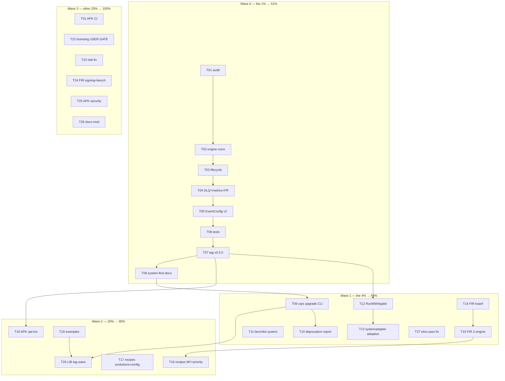

# SUPERB — Full-Adoption System On-Ramp

**Date:** 2026-09-07 17:25 · **Author:** session (adoption analysis) · **Status:** PLAN v2 (revised same day after critical self-review) · **No code changed**

**Questions answered:**

1. How can we make go-cqrs-lite easier to use FULLY and with the latest features?
2. What is go-appkit doing — and NOT yet doing?

---

## 1. Research Findings (verified 2026-09-07, from source not docs)

### 1.1 The adoption landscape (from the 2026-09-07 who-uses audit)

Real metaengine/system adoption is **1 app + 1 unused facade**:

| Surface                         | Reality                                                                                                                                                                                                                                                      |
| ------------------------------- | ------------------------------------------------------------------------------------------------------------------------------------------------------------------------------------------------------------------------------------------------------------ |
| `file-and-image-renamer` (FIR)  | ONLY app on `system.New` + `DomainConfig`/`DeploymentConfig` (Engines, Instances, Roles, Pragmas). Deep metaengine: Store, Plan, LayoutPlan, FilterSpec/SortSpec, TypedReader, StreamLogBackend, SnapshotBackend, aggregates. Pins at master HEAD (current). |
| `cqrs-htmx/systemadapter`       | Declarative facade (`OnRecordTyped`, `Fold`, `QueryDecl`, `FilterEq`, `SortOnField`) + `examples/system-demo` — **zero external consumers**.                                                                                                                 |
| ~20 apps "consuming" metaengine | who-uses artifacts: go.work `use`-entry pollution + `// indirect` mislabels. They import only cqrs-htmx root (command/event/query) — metaengine never enters their build.                                                                                    |
| `go-appkit/cqrs` v0.4.0         | Wraps **`stack/sqlite.Bundle` + `projectionhost`** — the composition layer that is **deprecated and removed at v5 (ADR-0123)**.                                                                                                                              |

### 1.2 What go-appkit IS doing (well — keep and port)

- Lifecycle-managed `EventService`: construction-failure close, idempotent Shutdown, drain ordering.
- Read-your-writes **staleness guards** (`CheckStaleness`/`CheckProjectionStaleness`) wired to `ReadyCheck`.
- **DLQ** with admin surface (SQLite-default store, replay, projection reset).
- Backend-agnostic `Metrics` + `NewOTelProjectionMetrics` (cardinality-tested).
- **One shared flight recorder** for HTTP + projections (`go-flightrecorder` migration done; `FlightRecorderTrigger` passthrough).
- Process discipline: fresh-consumer **proxy smoke tests** per tag wave; pins at latest tags; deep-dive audits against source; `cqrs-lint` 4.8.1 adopted; demand-driven (YAGNI) wrapper surface; `docs-mod` auto-documentation via `catalog/v4`.

### 1.3 What go-appkit is NOT yet doing (the gaps)

| #  | Gap                                                                                                           | Consequence                                                                                                            |
| -- | ------------------------------------------------------------------------------------------------------------- | ---------------------------------------------------------------------------------------------------------------------- |
| G1 | **Not on `system/`** — pins `stack/v4` + `stack/sqlite/v4` v4.3.0                                             | **v5 cliff**: EventService dies at v5; every downstream consumer (cqrs-htmx ADR-001 adoption) inherits it.             |
| G2 | No metaengine read models (`TypedReader`, planned tables, materialized views)                                 | Consumers can't reach the strategic layer through the wrapper.                                                         |
| G3 | No operator **config-file loading** (system `DeploymentConfig` is koanf-tagged; appkit has its own config)    | The "operator declares at deployment" story is bypassed.                                                               |
| G4 | No CI pipeline at all; licensing decision blocks pkg.go.dev (USER GATE, their P2)                             | Invisible godoc = adoption cost for a framework courting consumers.                                                    |
| G5 | Security/reliability batteries for events (signing, encryption, scheduling) routed as demand-gated, not built | Full-usage story incomplete (correctly YAGNI — needs a trigger, which this plan supplies via the system default path). |
| G6 | No system-aware benchmarking (library-side gap: benchkit targets `*stack.Bundle` only)                        | Performance work can't target the strategic layer.                                                                     |

### 1.4 Library-side friction (go-cqrs-lite itself)

- **Version matrix**: ~20 pins per consumer across 82 modules; lockstep sweeps are manual (the documented 4-mechanics tag-wave dance).
- **No upgrade tooling**: consumers discover deprecated APIs only if they run `cqrs-lint` manually.
- **Docs lead with the old story**: skill quickstart still shows stack presets prominently; `system` recipes thin (config loader, materialized views, priority, evolutions, live latency have no verified copy-paste recipes).

---

## 2. Pareto Breakdown

### The 1% that delivers 51% — **go-appkit/cqrs v0.5.0 on `system.New`**

One module rewrite that moves the whole ecosystem: appkit is the leverage point (cqrs-htmx already adopted it; ~20 apps ride behind it). Same lifecycle surface (health/readiness/DLQ/metrics/flight recorder/drain), new engine room (`system.New` + `DomainConfig`/`DeploymentConfig` + sqliteengine). Converts "1 app uses system" into "the default on-ramp uses system" and defuses the v5 cliff for everyone downstream. Plus: **docs lead with system** (the other on-ramp).

### The 4% that delivers 64% — **friction killers**

1. `cqrs upgrade` — lockstep pin bump + deprecated-API report for any consumer go.mod (kills the manual sweep dance).
2. benchkit harness over `*system.System` (performance targets the strategic layer).
3. cqrs-htmx: `RunWithAppkit` fold-in (already pending) + first real `systemadapter` consumer.

### The 20% that delivers 80% — **full-feature enablement**

Above + verified recipes (materialized views, priority routing, evolutions, live-latency/auto-replan, koanf config file) + FIR dogfooding 2-engine routing and operator config files + appkit EventConfig opt-ins (signing/encryption/scheduling — demand now exists: the system default path).

### The other 20% to reach 100% — **hygiene & gates**

appkit CI, licensing decision → pkg.go.dev visibility (USER GATE), appkit security module W2 (their plan), otel ForceFlush upstream fix (verify-before-filing), FIR signing + benchmark regression gate, catalog docs-mod refresh.

---

## 3. Comprehensive Plan — tasks 30–100 min

Sorted by importance/impact/effort/customer-value. Owner tags: `[APK]` go-appkit, `[LIB]` go-cqrs-lite, `[HTMX]` cqrs-htmx, `[FIR]` file-and-image-renamer.

| ID  | Task                                                                                                                                                                                                                                                                       | Owner | Impact | Effort | Customer value                     | Wave |
| --- | -------------------------------------------------------------------------------------------------------------------------------------------------------------------------------------------------------------------------------------------------------------------------- | ----- | ------ | ------ | ---------------------------------- | ---- |
| T01 | Audit EventService surface vs `system.System`: map every field (StackOptions→DeploymentConfig, Bundle() callers, staleness, DLQ, metrics, FR); write migration decision note                                                                                               | APK   | 10     | 90m    | unblocks v5 survival               | W0   |
| T02 | EventService v2 engine room: `system.New` + sqliteengine driver registration + Instances (RoleSourceOfTruth+RoleProjections single engine)                                                                                                                                 | APK   | 10     | 100m   | v5-proof default on-ramp           | W0   |
| T03 | Port lifecycle: construction-failure close, idempotent Shutdown, drain ordering, ReadyCheck staleness guards onto System                                                                                                                                                   | APK   | 9      | 100m   | zero-regression lifecycle          | W0   |
| T04 | Port DLQ (commandlifecycle/projections via system.WithCommandLifecycle) + OTel metrics + shared flight recorder + trigger passthrough                                                                                                                                      | APK   | 9      | 100m   | feature parity                     | W0   |
| T05 | EventConfig v2: SQLitePath→Driver/DSN/Pragmas; koanf operator config-file passthrough; deprecation shims where cheap                                                                                                                                                       | APK   | 8      | 60m    | operator story lands               | W0   |
| T06 | Test hardening: -race suite, construction-failure, DLQ admin, drain order, staleness; fresh-consumer proxy smoke from clean /tmp module                                                                                                                                    | APK   | 9      | 100m   | trust                              | W0   |
| T07 | Tag appkit cqrs v0.5.0 (BREAKING) + CHANGELOG + proxy verify + notify cqrs-htmx                                                                                                                                                                                            | APK   | 8      | 45m    | releasable                         | W0   |
| T08 | Skill/docs: getting-started leads with system + appkit EventService v2 pattern; FAQ entry "which composition layer?"                                                                                                                                                       | LIB   | 9      | 60m    | discoverability                    | W0   |
| T09 | `cqrs upgrade` CLI: parse consumer go.mod, list go-cqrs-lite pins, lockstep bump to latest tags, `--dry-run`, GOWORK=off build check                                                                                                                                       | LIB   | 9      | 100m   | kills sweep dance                  | W1   |
| T10 | `cqrs upgrade`: deprecated-API report by reusing cqrs-lint V007 engine (in-process, not shell-out)                                                                                                                                                                         | LIB   | 8      | 60m    | v5 readiness                       | W1   |
| T11 | benchkit system harness: `Factory[*system.System]` + write/read/read-model phases + report parity                                                                                                                                                                          | LIB   | 7      | 100m   | perf on strategic layer            | W1   |
| T12 | cqrs-htmx: `RunWithAppkit` fold-in (pending since appkit v0.3.0 train)                                                                                                                                                                                                     | HTMX  | 8      | 100m   | integration completes              | W1   |
| T13 | cqrs-htmx: route root `setup` through systemadapter (first real consumer of the facade)                                                                                                                                                                                    | HTMX  | 7      | 100m   | facade validated                   | W1   |
| T14 | FIR: operator config file (koanf) replacing compiled-in DeploymentConfig                                                                                                                                                                                                   | FIR   | 6      | 60m    | flagship dogfood                   | W1   |
| T15 | FIR: second engine role (pebbleengine projections) + priority routing + live-latency probe dogfood                                                                                                                                                                         | FIR   | 7      | 100m   | 2-engine routing proven            | W1   |
| T16 | Verified recipes: materialized views + priority (global/perEngine/perQuery) with runnable snippets in recipes.md                                                                                                                                                           | LIB   | 7      | 100m   | full-feature usage                 | W2   |
| T17 | Verified recipes: Evolutions + schema upcasters through system + operator config-file loading                                                                                                                                                                              | LIB   | 7      | 100m   | full-feature usage                 | W2   |
| T18 | APK EventConfig opt-ins: signing, encryption, scheduling batteries (demand-gate satisfied by system path)                                                                                                                                                                  | APK   | 6      | 100m   | security on-ramp                   | W2   |
| T19 | example/metaengine-quickstart + system README: config-file example + 2-engine example                                                                                                                                                                                      | LIB   | 6      | 45m    | copy-paste surface                 | W2   |
| T20 | Tag wave LIB (cqrs upgrade tooling, benchkit, recipes) — per CONTRIBUTING release process                                                                                                                                                                                  | LIB   | 6      | 60m    | shippable                          | W2   |
| T21 | APK CI pipeline (build+vet+test+race per module, GOWORK=off; none exists today)                                                                                                                                                                                            | APK   | 6      | 100m   | trust at scale                     | W3   |
| T22 | APK licensing decision → LICENSE files effective at next tags → pkg.go.dev re-verify (USER GATE)                                                                                                                                                                           | APK   | 7      | 45m    | visible godoc                      | W3   |
| T23 | LIB otel `Provider.Shutdown` ForceFlush fix: verify upstream state, then fix + regression test (verify-before-filing if external)                                                                                                                                          | LIB   | 5      | 60m    | no silent span loss                | W3   |
| T24 | FIR: event signing adoption (audit-trail tamper evidence) + bench regression gate in its CI                                                                                                                                                                                | FIR   | 5      | 100m   | flagship depth                     | W3   |
| T25 | APK security module W2 (per their batteries spec — port from CV inventory)                                                                                                                                                                                                 | APK   | 6      | 100m×3 | consumer demand                    | W3   |
| T26 | APK docs-mod: refresh catalog wiring for system-based services                                                                                                                                                                                                             | APK   | 4      | 45m    | auto-docs current                  | W3   |
| T27 | project-dependency-graph: fix who-uses miscounts — (a) go.work `use` entries counted as direct requires, (b) `// indirect` comments ignored; regression fixtures + re-audit                                                                                                | DG    | 8      | 90m    | honest adoption metrics (feeds §7) | W1   |
| T28 | FIR adoption depth: cqrs-lint gate in its CI + scenario/Ginkgo BDD for rename rules + catalog event-doc generation                                                                                                                                                         | FIR   | 5      | 100m   | flagship quality depth             | W3   |
| T29 | APK: Command/Query facade on EventService v2 — RegisterDecider/RegisterCommand/RegisterQuery/Execute passthroughs, default dispatcher middleware chain (retry, recovery, validation, idempotency/sqlstore, OTel tracing, circuit breaker), staleness-gated query answering | APK   | 9      | 100m   | closes the verified C/Q gap        | W0   |

IDs reflect drafting order; rows are placed by wave (the importance sort). Owners: `DG` = project-dependency-graph repo. **Effort per wave:** W0 ≈ 12.7 h (incl. T27, T29) · W1 ≈ 12 h (incl. T27) · W2 ≈ 6.75 h · W3 ≈ 13 h (incl. T28) · **total ≈ 45 h.** All tasks within the 30–100 min band.

### 3.1 Adjacent work — explicitly routed, NOT in this plan

"All TODOs" honored by explicit routing (each has an owner and a home; none silently dropped):

| Item                                                             | Home                          | Why not here                           |
| ---------------------------------------------------------------- | ----------------------------- | -------------------------------------- |
| APK logging posture decision (P2, data exists)                   | go-appkit TODO_LIST           | core-framework work, not cqrs adoption |
| APK Go toolchain bump past 1.26.7                                | go-appkit TODO_LIST           | gated on nixpkgs                       |
| APK W1 leftovers (G2 metrics, F5 buildinfo, E1 testkit)          | go-appkit TODO_LIST           | core batteries, demand-gated           |
| APK W3–W5 batteries (httpx, worker, sqlite, polite, realtime C2) | batteries spec doc            | framework scope, own waves             |
| cordis bridge, PapDashboard reverse adoption, TLS                | go-appkit TODO_LIST P3        | trigger-gated, researched NO-WORK-NOW  |
| who-uses **reporting** UX beyond the 2 miscount bugs             | dependency-graph repo roadmap | only correctness bugs block §7         |
| v5 removal execution (ADR-0123 surfaces)                         | go-cqrs-lite v5 milestone     | this plan is the _preparation_ for it  |

---

## 4. Micro-Plan — every task ≤ 12 min

| Micro   | Belongs | Step (≤12m each)                                                                                                                                            |
| ------- | ------- | ----------------------------------------------------------------------------------------------------------------------------------------------------------- |
| M01.1   | T01     | List EventConfig fields + EventService exported methods inventory                                                                                           |
| M01.2   | T01     | Map each to system equivalent (DeploymentConfig/instances/WithCommandLifecycle) in a table                                                                  |
| M01.3   | T01     | Identify Bundle() external callers (appkit example, docs, integration module)                                                                               |
| M01.4   | T01     | Write migration decision note (keep/drop/shim per field) in docs/planning                                                                                   |
| M02.1   | T02     | Add system/v4 + sqliteengine/v4 requires to appkit cqrs go.mod                                                                                              |
| M02.2   | T02     | Draft EventService v2 struct: hold `*system.System` + host handles                                                                                          |
| M02.3   | T02     | Wire system.New with single-engine DeploymentConfig (sqlite driver, pragmas)                                                                                |
| M02.4   | T02     | Expose System() accessor + deprecation note on Bundle()                                                                                                     |
| M02.5   | T02     | Compile + gofumpt + fix depguard allow-list entries                                                                                                         |
| M02.6   | T02     | Blank-import sqliteengine registration (engines self-register via init() — gotcha #19; a missing blank import means "unknown driver: sqlite" at system.New) |
| M03.1   | T03     | Port construction-failure close semantics (close-on-error ordering)                                                                                         |
| M03.2   | T03     | Port idempotent Shutdown + drain ordering via ShutdownDependencies                                                                                          |
| M03.3   | T03     | Port staleness guards onto system projection host checkpoint API                                                                                            |
| M03.4   | T03     | Wire ReadyCheck adapter                                                                                                                                     |
| M03.5   | T03     | -race test for shutdown idempotency                                                                                                                         |
| M04.1   | T04     | DLQ via system.WithCommandLifecycle + commandlifecycle/projections store                                                                                    |
| M04.2   | T04     | Port DLQ admin surface (replay/reset/list)                                                                                                                  |
| M04.3   | T04     | Port OTelProjectionMetrics onto host metrics hooks                                                                                                          |
| M04.4   | T04     | Flight recorder passthrough + trigger test                                                                                                                  |
| M04.5   | T04     | DLQ threshold + poison-event -race test                                                                                                                     |
| M05.1   | T05     | EventConfig v2 fields: Driver, DSN, Pragmas, ConfigPath                                                                                                     |
| M05.2   | T05     | koanf load passthrough (system config_loader) + precedence test                                                                                             |
| M05.3   | T05     | SQLitePath back-compat shim + deprecation marker                                                                                                            |
| M06.1   | T06     | Port existing test suite skeleton to v2 fixtures                                                                                                            |
| M06.2   | T06     | Construction-failure + CloseOnConstructionFailure tests                                                                                                     |
| M06.3   | T06     | Staleness + readiness tests                                                                                                                                 |
| M06.4   | T06     | DLQ admin + metrics cardinality tests                                                                                                                       |
| M06.5   | T06     | Full -race suite green                                                                                                                                      |
| M06.6   | T06     | Fresh-consumer proxy smoke (clean /tmp module → go get → build)                                                                                             |
| M07.1   | T07     | CHANGELOG entry (BREAKING, migration notes)                                                                                                                 |
| M07.2   | T07     | Tag v0.5.0 per their release process + proxy re-verify                                                                                                      |
| M07.3   | T07     | Note in cqrs-htmx TODO (fold-in unblocked)                                                                                                                  |
| M08.1   | T08     | Rewrite skill getting-started lead section on system                                                                                                        |
| M08.2   | T08     | Add appkit EventService v2 recipe to recipes.md                                                                                                             |
| M08.3   | T08     | FAQ: "stack vs system — which layer?" answer                                                                                                                |
| M08.4   | T08     | Run doc-check gate                                                                                                                                          |
| M09.1   | T09     | Scaffold `cmd/cqrs-upgrade` module (path + /v4 suffix per tag rule)                                                                                         |
| M09.2   | T09     | Parse target go.mod: collect go-cqrs-lite/* requires                                                                                                        |
| M09.3   | T09     | Latest-tag resolution: `go list -m -versions` per module                                                                                                    |
| M09.4   | T09     | Apply `go mod edit -require` sweep + `go mod tidy`                                                                                                          |
| M09.5   | T09     | GOWORK=off build+vet verification step                                                                                                                      |
| M09.6   | T09     | `--dry-run` mode + output table                                                                                                                             |
| M09.7   | T09     | Smoke test on a /tmp copy of a real consumer go.mod                                                                                                         |
| M10.1   | T10     | Wire cqrs-lint V007 analyzer as library call                                                                                                                |
| M10.2   | T10     | Merge deprecation report into upgrade output                                                                                                                |
| M10.3   | T10     | Test on consumer fixture with known deprecated imports                                                                                                      |
| M11.1   | T11     | Design SystemFactory type + Config in benchkit                                                                                                              |
| M11.2   | T11     | Port write-phase workload to system adapters                                                                                                                |
| M11.3   | T11     | Port read + read-model phases                                                                                                                               |
| M11.4   | T11     | Report parity + Compare() support                                                                                                                           |
| M11.5   | T11     | Bench smoke + README section                                                                                                                                |
| M12.1   | T12     | cqrs-htmx: audit setup surface vs appkit Service lifecycle                                                                                                  |
| M12.2   | T12     | Implement RunWithAppkit fold-in                                                                                                                             |
| M12.3   | T12     | Port their example to appkit-hosted variant                                                                                                                 |
| M12.4   | T12     | -race + integration test green                                                                                                                              |
| M13.1   | T13     | cqrs-htmx: route setup internals through systemadapter                                                                                                      |
| M13.2   | T13     | Keep public API stable; add system-based opt-in constructor                                                                                                 |
| M13.3   | T13     | Example + docs update                                                                                                                                       |
| M13.4   | T13     | Proxy smoke + tag                                                                                                                                           |
| M14.1   | T14     | FIR: extract DeploymentConfig into YAML + koanf load                                                                                                        |
| M14.2   | T14     | Config precedence test (file > defaults)                                                                                                                    |
| M14.3   | T14     | README operator section                                                                                                                                     |
| M15.1   | T15     | FIR: add pebbleengine require + Instances second role                                                                                                       |
| M15.2   | T15     | Priority config (perQuery routing)                                                                                                                          |
| M15.3   | T15     | Enable ProbeEngine/auto-replan + hysteresis                                                                                                                 |
| M15.4   | T15     | Routing verification test (query lands on projections engine)                                                                                               |
| M15.5   | T15     | Doctor/EXPLAIN snapshot in docs                                                                                                                             |
| M16.1   | T16     | Write + verify materialized-views recipe against a real system deployment                                                                                   |
| M16.2   | T16     | Write + verify priority-routing recipe                                                                                                                      |
| M16.3   | T16     | doc-check + link into modules.md                                                                                                                            |
| M17.1   | T17     | Write + verify Evolutions recipe                                                                                                                            |
| M17.2   | T17     | Write + verify upcaster recipe (schema + DecorateJournal)                                                                                                   |
| M17.3   | T17     | Write + verify operator config-file recipe                                                                                                                  |
| M17.4   | T17     | doc-check gate                                                                                                                                              |
| M18.1   | T18     | APK: signing opt-in (EventConfig.Signing) + test                                                                                                            |
| M18.2   | T18     | APK: encryption opt-in (EnvelopeVersionV2) + test                                                                                                           |
| M18.3   | T18     | APK: scheduling battery (TimerStore wiring) + test                                                                                                          |
| M18.4   | T18     | README config-table rows                                                                                                                                    |
| M19.1   | T19     | Update example/metaengine-quickstart (config file)                                                                                                          |
| M19.2   | T19     | system README 2-engine example                                                                                                                              |
| M19.3   | T19     | doc-check + api-stability golden if exports changed                                                                                                         |
| M20.1   | T20     | Pre-tag pin sweep (T09 tooling on own repo fixtures)                                                                                                        |
| M20.2   | T20     | Tag wave per CONTRIBUTING (interleave cut→push→next)                                                                                                        |
| M20.3   | T20     | Post-wave GOWORK=off build matrix + cqrs-lint golden refresh                                                                                                |
| M21.1   | T21     | APK CI: per-module build+vet+test+race matrix job                                                                                                           |
| M21.2   | T21     | CI: fresh-consumer proxy smoke job                                                                                                                          |
| M21.3   | T21     | CI: cqrs-lint job (arg-form note: `.` not `./...`)                                                                                                          |
| M22.1   | T22     | USER GATE: licensing decision record                                                                                                                        |
| M22.2   | T22     | Next tag wave carries LICENSEs → pkg.go.dev re-crawl check                                                                                                  |
| M23.1   | T23     | Verify current otel Shutdown behavior + existing fix state                                                                                                  |
| M23.2   | T23     | Fix ForceFlush ordering + regression test                                                                                                                   |
| M23.3   | T23     | Tag otel; notify appkit TODO closure                                                                                                                        |
| M24.1   | T24     | FIR: signing middleware adoption + tamper test                                                                                                              |
| M24.2   | T24     | FIR: bench regression gate (median ns/op, 25% threshold)                                                                                                    |
| M25.1–3 | T25     | APK security module per their W2 spec (staged separately)                                                                                                   |
| M26.1   | T26     | APK docs-mod catalog wiring refresh for v2 services                                                                                                         |
| M26.2   | T26     | docs smoke + example regeneration                                                                                                                           |
| M27.1   | T27     | Reproduce go.work-as-direct on a fixture workspace; pin expected output                                                                                     |
| M27.2   | T27     | Classify workspace `use` entries as non-dependencies in module discovery                                                                                    |
| M27.3   | T27     | Parse `// indirect` comments into dependency classification                                                                                                 |
| M27.4   | T27     | Regression fixtures: go.work consumer + indirect-only consumer                                                                                              |
| M27.5   | T27     | Re-run `who-uses go-cqrs-lite` and diff against the manual 2026-09-07 audit                                                                                 |
| M28.1   | T28     | FIR CI: cqrs-lint job (`.` arg form, not `./...`)                                                                                                           |
| M28.2   | T28     | scenario Given/When/Then suite for rename rules                                                                                                             |
| M28.3   | T28     | catalog Registry wiring + event-doc generation                                                                                                              |
| M28.4   | T28     | Link generated docs from FIR README; doc-check                                                                                                              |
| M29.1   | T29     | Expose RegisterDecider/RegisterCommand/RegisterQuery/Execute on System() accessor                                                                           |
| M29.2   | T29     | Default dispatcher middleware chain builder + consumer override hook                                                                                        |
| M29.3   | T29     | Idempotency/sqlstore wiring + staleness-gated query answering (reuse CheckStaleness)                                                                        |
| M29.4   | T29     | C/Q lifecycle: drain in-flight commands on Shutdown; -race test                                                                                             |

---

## 5. Execution Graph

Order within waves: G1 (v5 cliff) first — it is the only time-boxed risk (v5 removes stack). Everything else composes behind it. Edge fix from v1: recipes (T16) are _proven by_ FIR's 2-engine dogfood (T15), not the reverse. The micro-task table inherits this sort: wave order first, then task-ID order inside each wave.

## 6. Guardrails (no VERSCHLIMMBESSER)

1. **appkit keeps its YAGNI discipline**: the only justified breaking change is the v5-survival migration (stack removal is scheduled, not speculative). Opt-ins (T18) stay opt-in.
2. **No API removal on the library side in this plan** — deprecated v4 surfaces stay until v5 per existing ADRs.
3. Every tag follows the existing release processes (LIB: CONTRIBUTING + tag-release.sh mechanics; APK: fresh-consumer proxy smoke).
4. Licensing (T22) and any external issue filing (T23) are USER-GATED / verify-before-filing.
5. Cross-repo waves respect each repo's concurrent-session ownership rules (git status check before editing).
6. FIR stays the flagship: every new system feature gets its first real consumer there before general recipes ship.
7. Engine self-registration is a blank-import contract (`metaengine/*engine/register.go`, gotcha #19): any new engine require in appkit/FIR go.mod files MUST ship with the blank import or `system.New` fails at runtime with "unknown driver" — never hand-write Store wrappers (ADR-0126), compose via system's adapters.
8. Concurrent sessions own foreign dirty files (e.g. `metaengine/tursoengine/matview_bench_test.go` at plan time): this plan's commits stage only files its tasks author.
9. C/Q integration (T29) rides the SAME system migration as T02 — it must never be built on `stack.Bundle` sinks/sources (deprecated v5) even though Bundle exposes CommandSink/QuerySink today.

## 7. Success Criteria

- `go-appkit/cqrs` v0.5.0 on system — proxy-verified; cqrs-htmx fold-in merged.
- A new consumer reaches "full stack with latest features" via: appkit EventService + operator YAML + `cqrs upgrade` + copy-paste recipes — no manual pin sweeps, no stack imports.
- metaengine/system production consumers: 1 → ≥4 (FIR, cqrs-htmx setup path, ≥2 apps via appkit).
- who-uses output matches a manual source-level audit (T27 regression fixtures pin this) — adoption numbers are honest before being used to steer waves.
