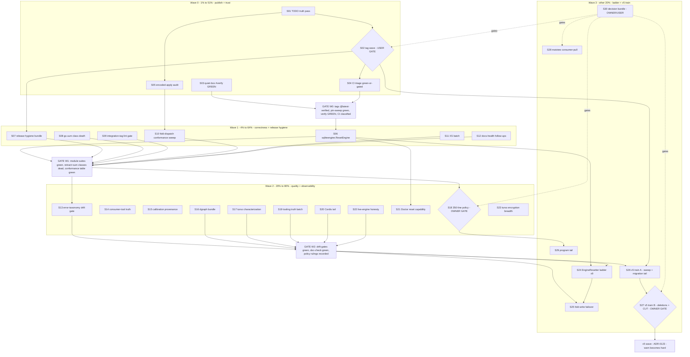

# SUPERB — Publish, Reset & v5 Train: Pareto Execution Plan v2 (post-5th-audit)

> **When:** 2026-09-11 04:41 CEST · **Input:** the TODO_LIST rebuilt by the 5th docs-health audit (2026-09-11, [`docs/status/2026-09-11_04-35_docs-health-fifth-pass-full-audit.md`](../status/2026-09-11_04-35_docs-health-fifth-pass-full-audit.md)) + the 97 open checkboxes verified during planning.
> **Goal:** publish the 3-day `[Unreleased]` window, restore gate+CI trust, close the proven correctness classes, and stage the v5 train — without breaking a single v4 consumer.
> **Guardrail:** No Verschlimmbesserung. Every behavior change is warn-first in v4.x, hard at v5 (ADR-0123 train). Every task ends at a verify gate. BLOCKED/user-gated items are planned but never executed without the gate lifting.

## 0. Planning-time truth pass (executed BEFORE this plan was written)

Six TODO premises verified STALE against the repo and deleted in the same edit (evidence: `git tag -l`, `.github/workflows/`):

| Deleted TODO row | Reality (verified) |
| --- | --- |
| 🔥 iroh standalone pin repair | `metaengine/irohengine/v4.2.0` tagged 2026-09-08 (P02); `loopback/go.mod` pins v4.2.0 |
| Cut `stack/sqlite/v4.3.1` | tag exists (P03, 2026-09-08) |
| Wire `check-csp` into CI + eventcatalog placement | `check-csp` job in ci.yml:618; eventcatalog = nightly sentinel job (P17, 2026-09-09) |
| actionlint CI step + shellcheck | `lint-scripts` job (actionlint + shellcheck) in ci.yml:634-645 |
| "Days-since-green" metric/alert | sentinel.yml `green-recency` job (≥3d alarm), 2026-09-09 |
| First post-push CI run triage | superseded by the newer, more specific CI-triage 🔥 item |

Also merged: "Fresh-GOMODCACHE go.sum check" + "verify-ci go mod download assertion" → one 🔥 item (same defect class).

**Decisions baked in (autonomous defaults, all reversible):**
| Question | Default | Why |
|---|---|---|
| The audit's 3 open rulings (archive rule, CHANGELOG path repoints, HTML/txt exemption) | Do not block any task below; answers fold in when given | All three are process-policy, not code |
| BLOCKED items (upstream/user/owner gates) | Planned in S30, never auto-executed | The never-push-without-approval rule holds |
| Behavior changes (code guard defaults, skip-vs-fail) | Warn-first v4, hard v5; decisions default to the honest-loudly option | ADR-0123 precedent + the silent-coverage-loss lesson |
| Stale TODO found mid-execution | Verify → delete in the same edit; note in CHANGELOG only if consumer-visible | The 02-05 proven class; this plan's §0 is the precedent |

---

## 1. Pareto Breakdown

### The 1% that delivers 51% — PUBLISH + TRUST (~3.5 h)

Consumers cannot see ANY of the 2026-09-09..11 work (Cordis reset/coeffect/deactivation, E018, watermill #21 causation fix, dgraph contention fix, ClaimMetrics, retracts tooling) until tags move; go-localsync runs a documented workaround waiting on `watermill/v4.7.0`. Meanwhile the local gate has not had a composed GREEN since 09-09 and CI master is 30+ runs red — every future claim inherits that doubt. And one correctness class (record-context on fold-dispatch paths) has already produced one real bug (Demote); the encoded-apply sibling is unaudited.

1. **S01** — remaining stale-premise verification + TODO truth pass (30 min)
2. **S02** — 🔥 the next v4 tag wave: cut → push → `@latest` acceptance → pin sweep → GitHub Releases (100 min + wave mechanics) *[gated: user authorization]*
3. **S03** — quiet-box exclusive `nix run .#verify` composed GREEN (60 min)
4. **S04** — 🔥 CI triage: drive every non-billing-red leg to green-or-explicitly-gated (100 min)
5. **S05** — 🔥 encoded-apply record-context audit (`metaengine/encoded.go:49`) — the proven bug class (45 min)

### The 4% that delivers 64% — CORRECTNESS + RELEASE HYGIENE (~7 h)

6. **S06** — 🔥 `sqliteengine.ResetEngine` — one-call revert on the production-default engine (100 min)
7. **S07** — release-hygiene bundle: tag `cmd/cqrs-lint` v4.10.2 (buildinfo) + `check-retracts-shipped.sh` + `--audit --baseline` + smoke-probes/Test-5 (100 min)
8. **S08** — 🔥 kill the missing-go.sum-hash class in CI (`go mod download` no-diff + standalone-vet meta-test) (90 min)
9. **S09** — integration-tag lint as a first-class gate (`lint-module` tag arg + CI leg) (60 min)
10. **S10** — entry-point fold-dispatch conformance sweep (one table test, every dispatch path) (100 min)
11. **S11** — XS batch: ClaimMetrics docs tail · watermill shutdown-noise · quickstart smoke · `doWrite` narrowing · `go mod tidy` integration/ (60 min)
12. **S12** — docs-health follow-ups: ROADMAP raw-ideas write-back · banner proofread · cec9248da work record · freshness-sweep checklist · rule recount · drop-ledger convention (45 min)

### The 20% that delivers 80% — QUALITY + OBSERVABILITY (~10 h)

13. **S13** — error-taxonomy: verify ALL module tables + build the drift gate (75 min)
14. **S14** — consumer-tool truth: cqrs-upgrade hardening (flags-after-positional, `--json` deprecations, example v5 scan) + V007 decider pair-form split brain + cqrs-lint cheap-fix/test-gap tail (100 min)
15. **S15** — calibration provenance + quiet-window re-runs (SearchQuery count=5, dgraph re-anchor, titled baseline re-pin) + script-side load gate (100 min)
16. **S16** — dgraph bundle: `dgraph.type` conflict-domain docs · `isContentionError` unit pin · MySQL live shuffle verify · `-race` the retry code · otel contention counter (dep review first) (100 min)
17. **S17** — turso characterization: `ivm_repro_test.go` (`-tags ivmrepro`) · single-source version citation + flip runbook · defect-A onset bisect + scalar-at-scale pin (100 min)
18. **S18** — 🔥 350-line policy decision (full split vs ratchet vs exemptions) + first code-file split waves (100 min ×N) *[gated: owner policy]*
19. **S19** — tooling truth batch: check-coverage wrapper env fix + run · per-finding lint attribution · tripwire mutation fixture · pre-commit gates remainder (90 min)
20. **S20** — Cordis tail: E018 fold-case coverage · goleak for metaengine+projectionhost · `[Unreleased]`-position tripwire (75 min)
21. **S21** — reset capability surfaced in `Doctor`/`GetEngineStats` (45 min)
22. **S22** — live-engine honesty: skip-vs-fail policy · composite-runner shuffle evals *[gated OQ 9]* · seed log · ~10-run CI watch (75 min)
23. **S23** — turso encryption breadth: README reachability docs · `file:` DSN round-trip · second ADT · matview-serves-on-encrypted · cipher-size pin (100 min)

### The other 20% → 100% — ENGINES LADDER + V5 TRAIN + PROGRAM TAIL (~20 h+)

24. **S24** — EngineResetter ladder: pebble, bbolt, badger, pg, mysql, turso, duckdb, dgraph, iroh (100 min ×N, multi-session)
25. **S25** — fold-write failover for quarantined engines (shadow-replication or write-reroute + catch-up; ADR first) (100 min ×N)
26. **S26** — v5 train phase A: sweep §4 remainder (watermill keys, SQL columns, benchkit key, bbolt tags, pebble slog) + v6 markers + T18 migration tail + V5-MIGRATION-GUIDE expansion (100 min ×N)
27. **S27** — v5 train phase B: the deletions (Materialize, view/relational, GraphProjection, Bundle+presets, compat shells, BuildWhereClause, transports, tombstone API) + `NewStreamRef` validation + E-items + **cut v5.0.0** (100 min ×N) *[the cut itself is owner-gated]*
28. **S28** — matview consumer-pull surface: routing integration (declarative aggregate shape, scalar-only first cut) + v2 features + grouped-spec code guard default (100 min ×N, routed per consumer ask)
29. **S29** — program tail: loose cqrs-lint heuristic gates (one rule per PR) · calibration-drift gate redesign · turso/badger contention backport · ephemeral passthrough unification · `batch-release.sh` audit · T23 skill pass (100 min ×N)
30. **S30** — the decision/gated bundle (owner or user, no code until lifted): turso upstream filing + ×3 issues · DSN strict-vs-lenient · sync/embedded · dgraph one-RPC Q1 · CapabilityGaps→Doctor · Doctor-JSON ruling · Q3 severity · daemon Q2 · F040 branch protection · dead-path OQ 11 · ratify iroh P99 · macOS PG · nspawn · CV bump · archived/ yearly shard · the audit's 3 process rulings (decision meeting)

---

## 2. Comprehensive Plan — 30 medium tasks (30–100 min each)

Sorted by wave → impact → effort. **Imp** = impact (H/M/L), **CV** = customer value.

### Wave 0 — 1% → 51% (publish + trust)

| ID | Task | Imp | Effort | CV | Depends |
|---|---|---|---|---|---|
| S01 | Remaining stale-premise verification (verify-BLOCKED item re-check, pre-commit gates remainder audit, any TODO older than 7 days) + truth cleanup | H | 30min | Every later task stands on honest ground | §0 done |
| S02 | 🔥 **Tag wave**: cut/push the `[Unreleased]` window (metaengine+adapters, system, watermill **v4.7.0**, scheduling/sqlstore, cmd/cqrs-lint v4.10.2, engines incl. dgraphengine contention fix; strip `storage/go.mod` + matview sibling replaces at cut) → `@latest` acceptance per module → `pin-sweep.sh --check` → GitHub Releases for outstanding tags → indirect-dep consolidation check | H | 100min+wave | Consumers finally see 3 days of shipped work; go-localsync unblocked | **user authorization** |
| S03 | Quiet-box exclusive `#verify` composed GREEN (last was 09-09; closes the BLOCKED verify item + gates S02 pre-tag) | H | 60min | Trust in the gate restored | idle box |
| S04 | 🔥 **CI triage to green-or-gated**: shellcheck SC2086 disable directive (test-tag-release.sh), Minimum Coverage (wrapper env), verify-fast leg, go.work sync + Nix Flake Check + CGo + Security Scan (re-triage on a fresh run), ephemeral dgraph/pg/redis legs (suspect FlakeHub-fatal), benchmarks.yml matview gate dry-run, first nightly dogfood watch | H | 100min+ | Red master stops normalizing drift | S02 (fresh runs) |
| S05 | 🔥 **Encoded-apply record-context audit** (`metaengine/encoded.go:49`): carry real record context if the API allows, else document + advisory-count the synthetic feed (the Demote-mirror bug class) | H | 45min | No fold sees silently-empty context | — |

### Wave 1 — 4% → 64% (correctness + release hygiene)

| ID | Task | Imp | Effort | CV | Depends |
|---|---|---|---|---|---|
| S06 | 🔥 `sqliteengine.ResetEngine`: 8 `meta_*` tables + planned tables + matviews + `multiSeq`, `EngineResetter` + tests | H | 100min | One-call revert works on the default engine | ADR-0136 |
| S07 | Release hygiene: tag `cmd/cqrs-lint` v4.10.2 (buildinfo ships; verify installed binary prints the tag) · `check-retracts-shipped.sh` (master retracts vs newest tags) · `tag-release.sh --audit --baseline` (24 dead-path violations baselined, NEW ones gate CI) · `scripts/smoke-probes.txt` + strengthen test-tag-release Test 5 | H | 100min | The v4.8.0/retract and poisoned-tag classes die structurally | S02 |
| S08 | 🔥 go.sum class death: `#verify-ci` per-module `go mod download` + no-diff (or `check-modsums` app) + `TestEveryModulePassesStandaloneVet` meta-test; root-cause tidy-under-warm-cache | H | 90min | Standalone builds stop rotting between waves | — |
| S09 | Integration-tag lint gate: `lint-module` optional tag arg + CI leg for modules with `*_integration_test.go` (the 10-day-invisible gocognit class) | M | 60min | Lint truth on the integration surface | — |
| S10 | Entry-point fold-dispatch conformance sweep: ONE table test walking Apply/ApplyBatch/ApplyRecord/Backfill/replayShadows/Verify/DemoteEngine×2/encoded-apply/live-replicator — record context + advisory counting asserted per path | H | 100min | The whack-a-mole bug class becomes one table | S05 |
| S11 | XS batch: ClaimMetrics docs tail (README claiming docs + JSON marshal pin + PG/MySQL snapshot test) · watermill shutdown-noise log · `example/metaengine-quickstart` smoke test · `doWrite` response-narrowing review · `go mod tidy` integration/ | M | 60min | Public surface fully documented + pinned | — |
| S12 | Docs-health follow-ups: ROADMAP Raw-Ideas write-back (the banner-noted brainstorm fuel) · 25-banner proofread · `cec9248da` orphaned-work record · ROADMAP-history freshness sweep into the pass checklist · rule-catalog recount pin · drop-ledger convention | M | 45min | The audit's own tail closes | — |

### Wave 2 — 20% → 80% (quality + observability)

| ID | Task | Imp | Effort | CV | Depends |
|---|---|---|---|---|---|
| S13 | error-taxonomy: depth-verify middleware/graph/relational/projectionhost/grpc tables vs source + build the drift gate (extract `errorfamily.*` codes per module, diff vs doc) | M | 75min | The watermill-lie class becomes mechanically impossible | — |
| S14 | Consumer-tool truth: cqrs-upgrade flags-after-positional guard + `--json` always-emits-deprecations + mechanized example v5-clean scan · V007 decider pair-form split brain + Deprecated↔table golden · cqrs-lint cheap-fix tail (doc.go drift, f001 dead branch, f030 nit, scan_in ref) + test gaps (B008/B015/D016/F018/F020/S001 allowlist) | M | 100min | The v5-readiness tooling stops lying by omission | — |
| S15 | Calibration provenance: script-side load gate + provenance line (store path, binary version, uptime) per baseline entry · quiet-window count=5 SearchQuery re-run · re-anchor all dgraph constants in one window · titled `benchmark-baseline.txt` re-pin | M | 100min | Measurement records stop carrying unverified claims | quiet box |
| S16 | Dgraph bundle: `dgraph.type` shared-conflict-domain docs (gotchas + README) · `isContentionError` unit pin · `ensureEdgeSchema` in-tx Alter pin · MySQL VM/nspawn live shuffle verify · `-race` live run of retry code · test-modernize sweep (b.Loop, atomic) · otel contention counter (check-arch review FIRST) | M | 100min | Contention behavior documented + observable | — |
| S17 | Turso characterization: `ivm_repro_test.go` behind `-tags ivmrepro` (all three defects) · single-source "verified through vX" constant + doc-check assertion + canonical flip runbook · defect-A onset bisect + scalar-at-scale exactness pin + pre.10 anomaly write-up | M | 100min | Upstream filing becomes one command + bulletproof | — |
| S18 | 🔥 350-line policy ruling (full split vs ratchet vs harness exemptions) → then split waves by size (typed_reader done; enginetest/adttest harness exemption decision, metaengine/store 935, execute 778, engines 725/722/663, suppression/parser 540, explain 516, b022_b025 495, a020_~357 …) | H | 100min×N | The gate stops being permanently red | **owner policy** |
| S19 | Tooling truth: `check-coverage.sh` env fix + run for the 09-07..11 waves · per-finding lint attribution (09-06 worktree diff) · `aggregate_*` tripwire permanent mutation fixture · pre-commit gates remainder (module-layers, version-drift, replace-directives) | M | 90min | Every gate either gates or is deleted | — |
| S20 | Cordis tail: E018 fold-case coverage (scanner position info) · goleak for metaengine + projectionhost · `[Unreleased]`-position tripwire in verify-docs.sh | M | 75min | Shipped Cordis surface fully pinned | — |
| S21 | Reset capability in `Doctor`/`GetEngineStats` ("resettable: yes/no") so operators see it before calling Reset | M | 45min | ADR-0136 ladder visible | S06 |
| S22 | Live-engine honesty: skip-vs-fail policy (OQ 10) implemented for `newDgraphEngineOrSkip` · shuffle evals for the composite runners (gated OQ 9) · seed-persistence log · watch ~10 shuffled dgraph/redis CI runs | M | 75min | Coverage never silently vanishes again | — |
| S23 | Turso encryption breadth: README reachability gap (direct `New()` only) · `file:` DSN round-trip · second-ADT round-trip · matview-serves-on-encrypted · cipher-size hint exact-text pin | M | 100min | Encryption feature honestly documented | — |

### Wave 3 — other 20% → 100% (ladder + v5 train + tail)

| ID | Task | Imp | Effort | CV | Depends |
|---|---|---|---|---|---|
| S24 | EngineResetter ladder: pebble (delete-range), bbolt (bucket drop), badger (prefix drop), pg/mysql (TRUNCATE cascade), turso, duckdb, dgraph (drop-all edge), iroh — each with `RunRestartSafetyTest`-style pin | M | 100min×N | One-call revert everywhere | S06 |
| S25 | Fold-write failover ADR + implementation (shadow-replication vs write-reroute + catch-up for quarantined engines) | M | 100min×N | ADR-0137 story completes | S24 (design can start earlier) |
| S26 | v5 train A: sweep §4 remainder (watermill keys dual-read, SQL column renames + migrations, benchkit key re-golden, bbolt CBOR tags, pebble slog keys, consumer grep) · v6 deletion markers · T18 migration tail (live MySQL/DuckDB runs, corruption + mid-failure + concurrent-init tests) · V5-MIGRATION-GUIDE expansion | H | 100min×N | v5 migration de-risked | S02 (waves land first) |
| S27 | v5 train B: delete Materialize/view+Relational/GraphProjection/Bundle+8 presets/compat shells/BuildWhereClause/transports/tombstone API · `NewStreamRef` validation + call-site migration · E1/E7/E8/E11/E13/E15 + E3/E6/E9/E10/E14 · **cut v5.0.0** (tag all, CHANGELOG/README/SKILL/examples, full verify) | H | 100min×N | The unification ships | S26 · **cut owner-gated** |
| S28 | Matview consumer-pull: routing integration (declarative `AggregateOn` seam; scalar-covered = O(1), grouped stays O(N) until defect A fixed) · v2 surface per consumer ask · grouped-spec code-guard default decision | M | 100min×N | Routing earns the matview win honestly | upstream fix for grouped |
| S29 | Program tail: loose heuristic gates one-rule-per-PR (V/T/E/A/F substring gates, B018 casing, A015/A016/A017/A019, F006/F009/F010, V002/V003/V006 scope) · calibration-drift gate redesign (persisted CI baseline artifact, TMPDIR CoW refusal) · turso/badger contention-retry backport · ephemeral passthrough unification · `batch-release.sh` consistency audit · T23 skill-maintenance pass | M | 100min×N | Long-tail decay stops compounding | S18 (policy frees waves) |
| S30 | Decision/gated bundle — no code until lifted: turso defects A+B filing (draft ready) + upstream ×3 · DSN strict-vs-lenient · sync/embedded-replica · dgraph one-RPC Q1 · CapabilityGaps→Doctor Q2 · Doctor-JSON pre-merge · Q3 severity-in-minor · daemon Q2 golangci exclusion · F040 branch protection · dead-path OQ 11 · ratify iroh P99 bound · macOS PG runner · nspawn (root) · CV consumer bump · archived/ yearly shard · audit §g rulings ×3 | H | decision | Every remaining "I cannot decide this" in one list | owner/user |

---

## 3. Micro Breakdown — every task ≤ 12 min

### Wave 0 micro (22 tasks)

| ID | Micro-task | Min |
|---|---|---|
| S01.1 | Grep all open TODO rows for dates ≥7 days old; list candidates | 6 |
| S01.2 | For each candidate: grep code/tags for the shipped evidence | 12 |
| S01.3 | Delete verified-stale rows; annotate ambiguous ones with findings | 10 |
| S01.4 | Re-run `bash scripts/check-doc-links.sh` + commit | 4 |
| S02.1 | Enumerate wave order from CONTRIBUTING pre-tag checklist (dependency-ordered list) | 10 |
| S02.2 | `tag-release.sh` cut leg 1 (leaf modules); watch standalone-build gate | 12 |
| S02.3 | Cut legs 2..N (engines after metaengine pin bump; strip storage replaces) | 12×5 |
| S02.4 | Cut `watermill/v4.7.0` explicitly; `--smoke` it (golden causation keys) | 10 |
| S02.5 | Cut `cmd/cqrs-lint/v4.10.2`; `--smoke`; confirm buildinfo version prints | 10 |
| S02.6 | End-of-wave unpushed-tag audit; push all tags | 8 |
| S02.7 | Clean-dir `go list -m module@latest` acceptance per tagged module | 12 |
| S02.8 | `scripts/pin-sweep.sh --check`; sweep if stale; workspace sync | 12 |
| S02.9 | `create-github-releases.sh` for outstanding tags; spot-check two bodies | 12 |
| S02.10 | Indirect-dep consolidation check (49-file class); tidy stragglers | 10 |
| S02.11 | Verify go-localsync can drop its workaround (notify owner) | 4 |
| S03.1 | Pre-flight: `df -h /tmp /`, load check, TMPDIR redirect | 6 |
| S03.2 | Run `nix run .#verify` exclusively; capture phase log | 12 |
| S03.3 | Triage any red phase; fix-or-ticket each (loop) | 12×N |
| S03.4 | Record the GREEN (date, commit, durations) in TODO + this plan | 6 |
| S04.1 | Fresh `gh run list` + per-job failure classification table | 12 |
| S04.2 | shellcheck SC2086: disable directive with reason on `git $notag` | 6 |
| S04.3 | Minimum Coverage leg: reproduce locally with env chain; fix wrapper | 12 |
| S04.4 | verify-fast / go.work-sync / flake-check / CGo / Security legs: fresh-run triage, fix or annotate gated | 12×3 |
| S04.5 | Ephemeral dgraph/pg/redis legs: bisect FlakeHub-fatal vs real | 12 |
| S04.6 | benchmarks.yml matview gate: dry-run exact CI invocation shape | 10 |
| S04.7 | Watch first nightly upgrade-dogfood run; record outcome | 6 |

### Wave 1 micro (26 tasks)

| ID | Micro-task | Min |
|---|---|---|
| S06.1 | Read sqliteengine schema mgmt (8 meta_* tables, planned tables, matviews, multiSeq) | 10 |
| S06.2 | Implement `ResetEngine`: DELETE FROM meta_*; drop/recreate planned; refresh matviews; reset multiSeq | 12×3 |
| S06.3 | Tests: empty-after-reset, replay-after-reset, partial-failure loudness | 12 |
| S06.4 | Metaengine suite GOWORK=off + `-race`; api golden regen same-edit if exports move | 12 |
| S06.5 | CHANGELOG entry + symbol gate | 8 |
| S07.1 | Cut v4.10.2 via worktree dance; `--smoke`; @latest check | 12 |
| S07.2 | `check-retracts-shipped.sh` draft (master retracts vs newest tag per module) | 12 |
| S07.3 | Wire into `#verify`/CI; test with a deliberately-inert fixture | 12 |
| S07.4 | `--audit --baseline`: record 24 known violations; `--check` gates NEW only | 12 |
| S07.5 | `smoke-probes.txt` (module → probe cmd) + Test 5 no-main-package fixture | 12 |
| S08.1 | Prototype: loop 84 modules × `go mod download` + `git diff --exit-code go.sum` | 12 |
| S08.2 | Fold into `#verify-ci` (or `check-modsums` flake app); time it | 12 |
| S08.3 | `TestEveryModulePassesStandaloneVet` meta-test skeleton | 12 |
| S08.4 | Root-cause tidy-under-warm-cache (repro on one module) | 12 |
| S08.5 | Full `#verify-ci` run green; CHANGELOG (infra) | 10 |
| S09.1 | `lint-module` app: optional tag argument (flake.nix edit) | 12 |
| S09.2 | Enumerate modules shipping `*_integration_test.go` | 6 |
| S09.3 | CI leg: per-module integration-tag lint matrix (or one job looping) | 12 |
| S09.4 | Verify with one seeded finding (mutation proof) | 8 |
| S10.1 | Table skeleton: every dispatch entry point × (record source, advisory counted?) | 12 |
| S10.2 | Wire each path into the table (some need small test hooks) | 12×3 |
| S10.3 | Assert the contract; fix any path that fails (bug found = root-cause fix) | 12 |
| S11.1 | ClaimMetrics: sqlstore README section + JSON marshal pin test | 12 |
| S11.2 | ClaimMetrics: PG/MySQL live-window Metrics() test | 12 |
| S11.3 | Watermill shutdown-noise: suppress ERROR on ctx.Canceled during Close + test | 10 |
| S11.4 | Quickstart smoke test (4 demo sections, build-tag aware) | 12 |
| S11.5 | `doWrite` response-consumer review + narrow; `go mod tidy` integration/ | 10 |
| S12.1 | ROADMAP Raw Ideas: write the banner-noted fuel from the 5 archived reports | 12 |
| S12.2 | Proofread all 25 banners (typo class); fix | 10 |
| S12.3 | cec9248da work record (short reconstructed report, annotated) | 12 |
| S12.4 | Pass checklist: add "refresh ROADMAP Release History row" line | 4 |
| S12.5 | Rule recount: catalog meta-test count vs FEATURES/README; pin or fix | 8 |

### Wave 2 micro (34 tasks)

| ID | Micro-task | Min |
|---|---|---|
| S13.1 | Sweep middleware/graph/relational/projectionhost/grpc tables vs `errorfamily` source | 12×3 |
| S13.2 | Drift-gate script: extract codes per module, diff vs doc tables | 12 |
| S13.3 | Wire into `#verify`; fixture with a planted lie (mutation proof) | 10 |
| S14.1 | cqrs-upgrade: reject flags-after-positional (`fs.Args()[1:]` check) + test | 12 |
| S14.2 | cqrs-upgrade: `--json` always emits `deprecations: []` + wire-contract test | 10 |
| S14.3 | Example v5-clean: per-PR strict scan job OR meta-test vs V007 tables | 12 |
| S14.4 | V007: add decider pair-forms to tables (or policy note) + Deprecated↔table golden | 12 |
| S14.5 | cqrs-lint cheap fixes: adoption/doc.go, f001 dead branch, f030 `/v4`, scan_in ref | 12 |
| S14.6 | cqrs-lint test gaps: B008, B015, D016 boundary, F018/F020, S001 allowlist | 12×2 |
| S15.1 | Load gate: assert load < N (abort loudly) in the calibration bench helpers | 12 |
| S15.2 | Provenance line format + write into baseline doc template | 10 |
| S15.3 | Quiet window: count=5 SearchQuery re-run; supersede table if >5% drift | 12 |
| S15.4 | Re-anchor remaining dgraph constants in the same quiet window | 12 |
| S15.5 | Titled `benchmark-baseline.txt` re-pin (load-noise undo) + commit message says why | 10 |
| S16.1 | `dgraph.type` conflict-domain: gotchas-language-footguns + dgraphengine README | 12 |
| S16.2 | `isContentionError` + `ensureEdgeSchema` in-tx Alter unit pins | 12 |
| S16.3 | MySQL VM (~131s) + nspawn live shuffle verification | 12 |
| S16.4 | `-race` live dgraph run (seeds 42, 7, 1234) | 12 |
| S16.5 | Test-modernize sweep (13× b.Loop, atomic.Uint64) | 10 |
| S16.6 | otel contention counter: check-arch budget review FIRST, then counter + test | 12 |
| S17.1 | `ivm_repro_test.go`: defect A envelope (exists) + B collapse checkpoint | 12 |
| S17.2 | Defect C 24-round COMMIT abort repro behind the tag | 12 |
| S17.3 | Single-source version constant + doc-check assertion + Doctor WARN codegen | 12 |
| S17.4 | Flip runbook: one checklist referenced from guard test, WARN, TODO | 8 |
| S17.5 | Defect-A onset bisect (rows × groups × tx) + envelope widening | 12×2 |
| S17.6 | Scalar-at-scale exactness pin + pre.10 anomaly paragraph in the draft | 12 |
| S18.1 | Policy one-pager: full split vs ratchet vs exemptions, costs, recommendation | 12 |
| S18.2 | Owner ruling recorded → gate change (ratchet = cheapest honest start) | 10 |
| S18.3 | Harness exemption decision (adttest/enginetest are exported harnesses) | 10 |
| S18.4 | Split wave 1: metaengine/store 935 → store_read/store_plan concerns | 12×4 |
| S18.5 | Split waves 2..N by size (execute 778, engines 725/722/663, parser 540…) | 12×N |
| S19.1 | check-coverage wrapper: export env itself or fail loudly; run for 09-07..11 | 12 |
| S19.2 | Per-finding attribution: diff vs 09-06 worktree; record code-fix vs exclusion | 12 |
| S19.3 | Tripwire mutation fixture (testdata planted code + scanner self-assert) | 12 |
| S19.4 | Pre-commit: add module-layers, version-drift, replace-directives (staged-aware) | 12 |
| S20.1 | E018 fold-case: add position info to CollectFoldCaseStrings (scanner work) | 12×2 |
| S20.2 | goleak: metaengine + projectionhost TestMain wraps; run `-race` | 12 |
| S20.3 | verify-docs.sh `[Unreleased]`-position tripwire + self-test | 10 |
| S21.1 | EngineStats/Doctor: resettable capability field/line + tests | 12 |
| S22.1 | Skip-vs-fail: distinguish server-unavailable (skip) vs retry-exhausted (fail) in newDgraphEngineOrSkip | 12 |
| S22.2 | Composite-runner shuffle evals (if OQ 9 = staying): 2-seed protocol each | 12×2 |
| S22.3 | Seed-persistence: ephemeral scripts append seed to a log file | 8 |
| S22.4 | CI watch: ~10 shuffled dgraph/redis runs; record failing seeds | 6 |
| S23.1 | tursoengine README: WithEncryption reachability (direct New only today) | 10 |
| S23.2 | `file:` DSN round-trip test; second-ADT round-trip (Counter/journal) | 12 |
| S23.3 | Matview-serves-on-encrypted-engine test (query, not just construct) | 12 |
| S23.4 | Cipher-size hint exact-text pin | 8 |

### Wave 3 micro (21 representative tasks; S24–S29 are 100min×N programs — each iteration follows the same 12-min loop)

| ID | Micro-task | Min |
|---|---|---|
| S24.x | Per engine: read storage layout → implement Reset → restart-safety-style pin → suite+race (repeat ×9) | 12×N |
| S25.1 | Failover design options one-pager (shadow-replication vs write-reroute) | 12 |
| S25.2 | ADR draft + review gate; implementation waves after | 12×N |
| S26.1 | Sweep §4 census table update (wire-key table doc) | 12 |
| S26.2 | Watermill `aggregate_*` → `stream_*` keys with dual-read + golden | 12×2 |
| S26.3 | SQL column renames + `MigrateSnapshotColumnsToStream` interplay check; migrations | 12×3 |
| S26.4 | benchkit key re-golden; bbolt CBOR tags; pebble slog keys | 12×2 |
| S26.5 | v6 deletion markers (snapshot shims, pebble legacy window) | 8 |
| S26.6 | T18 tail: live MariaDB + DuckDB migration runs; corruption/mid-failure/concurrent-init tests | 12×3 |
| S26.7 | V5-MIGRATION-GUIDE expansion (before/after per tier, operator snippets) | 12×2 |
| S27.1 | Delete waves (one module surface per micro-task; golden regen same-edit each) | 12×N |
| S27.2 | `NewStreamRef` validation + call-site migration | 12×2 |
| S27.3 | E-items (E1/E7/E8/E11/E13/E15 then E3/E6/E9/E10/E14) | 12×N |
| S27.4 | Pre-cut: full verify, api golden, docs/examples sweep | 12×2 |
| S27.5 | **Cut v5.0.0** (owner-gated): tag all, CHANGELOG/README/SKILL, verify | 12×N |
| S28.1 | `AggregateOn(fn, column, group)` declarative seam design in QueryDecl | 12 |
| S28.2 | Routing v1: scalar-covered = O(1) cost; grouped stays O(N) + Doctor note | 12×2 |
| S28.3 | v2 surface items routed per consumer ask (each its own micro-task) | 12×N |
| S29.x | One heuristic rule per PR (FP analysis → tighten → golden) — repeat ×~20 | 12×N |
| S29.y | Calibration-drift redesign: persisted CI artifact + CoW TMPDIR refusal | 12×2 |
| S30.x | Decision meeting: present each gated row with options + recommendation; record rulings | 5×15 |

**Micro totals:** W0 ≈ 4.5 h listed · W1 ≈ 6 h · W2 ≈ 9 h · W3 = programs (12-min loop each) + decisions. W0–W2 ≈ **19.5 h for 80% of the value.**

---

## 4. Execution Graph

## 5. Verification gates (per wave, before declaring done)

1. **Wave 0:** every new tag resolves `@latest` from a clean dir; `pin-sweep --check` green; one exclusive `#verify` EXIT=0 recorded; CI run of the pushed HEAD triaged into green/explicitly-gated; encoded-apply verdict written (fix or documented+advised).
2. **Wave 1:** GOWORK=off suites + `-race` green on touched modules; `check-retracts-shipped` catches a planted inert retract; the go.sum no-diff assertion catches a planted missing hash; conformance table red on a planted context-drop; api golden regen in the SAME edit as any export; CHANGELOG + symbol gate.
3. **Wave 2:** drift gate catches a planted taxonomy lie; calibration entries carry provenance lines; `#lint` 0 on touched modules; doc-check green; the 350-policy ruling recorded verbatim in TODO.
4. **Wave 3:** each engine reset pinned by restart-safety-style test; v5 cut only after full verify + migration-guide review; every deletion wave golden-regen'd same-edit.

## 6. Standing rules for execution

- One micro-task → one verify → one commit (daemon absorbs; commit explicitly at wave gates).
- **Golden regen belongs to the edit, not the gate** (api-stability `--update` in the same tool block as any export change).
- `#verify` runs EXCLUSIVELY — never concurrent with builds, integration suites, or another session's gates.
- Stale-premise check before every task: grep the code/tags BEFORE trusting the TODO text (§0 proved six stale rows in one pass).
- If evidence contradicts this plan: fix the doc first (addendum), then re-decide the dependent task.
- No Verschlimmbesserung: warn-first in v4.x, hard at v5; BLOCKED stays blocked; nothing pushed without the gate that lifts it.
