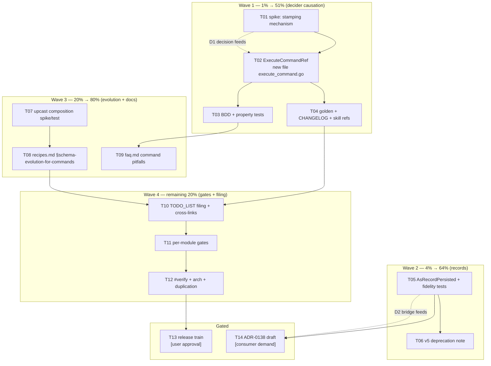

# SUPERB Plan: Command-Side Domain Depth (v4.x, additive-only)

> **Date:** 2026-09-13 11:45
> **Kind:** Prioritized execution plan (Pareto), derived from three session reviews
> **Sources:**
>
> - [`docs/reviews/2026-09-13_command-side-depth-review.md`](../reviews/2026-09-13_command-side-depth-review.md) — the three domain gaps
> - [`docs/reviews/2026-09-13_event-command-duplication-hypothesis-review.md`](../reviews/2026-09-13_event-command-duplication-hypothesis-review.md) — the `AsRecord` seam + v5 list
> - [`docs/reviews/2026-09-13_event-module-split-re-review.md`](../reviews/2026-09-13_event-module-split-re-review.md) — constraint (no event/ split; extract-downward only)
> - Repo state `master` @ 7d4a6d000; every code fact below re-verified this session
>
> **Goal:** Close the command-side domain-depth gaps WITHOUT breaking v4.x: commands become
> first-class in the decider pattern (Gap 1+3), first-class as records (the `AsRecord` wart),
> and lifecycle streams gain verified schema-evolution composition (Gap 2). File the
> gated/strategic remainder into TODO_LIST.
>
> **Explicitly NOT in scope:** ADR-0112 command sourcing (gated on consumer demand),
> v5 port unification, splitting `event/` (decided against), growing core `Command`/`Query`
> interfaces (ADR-0111 g — breaking, v5).

---

## 0. Guardrails — do not verschlimmbessern

| #   | Rule                                                                                                                                                                                               | Why it is in this plan                                                                                                                                     |
| --- | -------------------------------------------------------------------------------------------------------------------------------------------------------------------------------------------------- | ---------------------------------------------------------------------------------------------------------------------------------------------------------- |
| G1  | **Additive-only API.** No signature changes, no interface growth, no removals. New methods on concrete structs (`Repository[State]`), new free functions.                                            | v4.x compatibility; 41 modules direct-require `event/`, `command` has its own consumer base.                                                               |
| G2  | **`decider/decider.go` is 377 lines (baselined over the 350 limit).** New decider code goes in a NEW file `decider/execute_command.go`. Growth of baselined files fails CI (`nix run .#check-file-size`). | Discovered during planning; violating it breaks the build gate.                                                                                            |
| G3  | **API-surface change ⇒ golden regen in the same edit**: `cd cmd/api-stability && GOWORK=off go run -tags "goexperiment.jsonv2" . --update`, then `TestEvery`.                                        | AGENTS.md procedure; a stale golden is the corruption tell.                                                                                                |
| G4  | **CHANGELOG symbols must be real**: every `pkg.Symbol` cited in `[Unreleased]` Added/Changed is gated by `scripts/check-changelog-symbols.sh`.                                                       | Citing a symbol that does not exist (or spelling it wrong) fails `#verify`.                                                                                |
| G5  | **doc-check is zero-warning** — new skill-reference text must pass `cmd/doc-check` with zero output warnings, including zero-total-references failure mode.                                          | Repo policy since 2026-08-15.                                                                                                                              |
| G6  | **No new production dependency for `decider`** — the design uses a local capability interface, NOT an import of `command/` (see D1). Verify with `nix run .#check-arch`.                            | Dependency budgets are enforced; `decider` → `command` would also drag `command`'s dep tree into every decider consumer.                                    |
| G7  | **art-dupl**: the new `command.AsRecordPersisted` is a third lockstep twin — carry `//art-dupl:accept` on its first line, same wording as the existing pair. Re-run until "0 new clone groups".      | `#check-duplication` gate; annotation is iterative (one round unmasks the next).                                                                           |
| G8  | **Per-module isolation tests**: `cd <mod> && GOWORK=off go test ./... -count=1` for every touched module; final `nix run .#verify` runs exclusively (never concurrent with integration suites).     | Workspace hides version mismatches (FM#12).                                                                                                                |
| G9  | **Cache env chain + `-tags "goexperiment.jsonv2"`** on every go command (see `docs/agents/gowork-modes.md`).                                                                                        | Builds silently differ otherwise.                                                                                                                          |
| G10 | **Auto-commit daemon absorbs the tree** — verify `git status` cleanliness before tag waves; expect `chore: auto-commit` noise.                                                                       | Tagging on a dirty tree poisons the release.                                                                                                               |

---

## 1. Design decisions (pre-made; tasks refine, not re-litigate)

### D1 — `ExecuteCommandRef`: local capability constraint, zero new deps

```go
// decider/execute_command.go (NEW FILE — see G2)
package decider

// CausedCommand is the minimal capability ExecuteCommandRef needs: anything
// with a minted identity can stamp causation. *command.BasicCommand,
// *command.PersistedCommand, and consumer-defined command types satisfy it
// structurally — decider does NOT import command/.
type CausedCommand interface{ ID() id.CommandID }

// CommandDecideFunc is DecideFunc that can see the command.
type CommandDecideFunc[State, C any] func(state State, version event.Version, cmd C) ([]event.Event, error)

func (r *Repository[State]) ExecuteCommandRef[C CausedCommand](
	ctx context.Context, ref id.StreamRef, cmd C, decide CommandDecideFunc[State, C],
) error
```

- Implementation delegates to `ExecuteRef` with a wrapped `DecideFunc` that stamps every
  returned event with causation: `metadata.Tracing.CausationID = cmd.ID()` and
  `record.Cause{Kind: record.CauseCommand, ID: cmd.ID().String()}` (the typed cause kind
  already exists — `record/cause.go` — this is its first producer-side consumer).
- Correlation: carried through the existing `ContextEnricher` path — document, don't duplicate.
- **Open mechanism question (resolved by T01):** whether post-hoc stamping of already-built
  immutable events is possible via an existing option/merge helper (`WithCausationID` /
  metadata merge / `reconstruct`), or whether decider rebuilds events with the extra option.
  Fallback design: expose `decider.CausationOptions(cmd) []event.Option` for use inside
  `decide` via `event.New` — still additive, still zero-dep, slightly less automatic.
- Precedent: capability interfaces (`command.MetadataCarrier`) — same ADR-0111(g)-safe move.

### D2 — `command.AsRecordPersisted(*PersistedCommand) record.Record`

- Mirrors `query.AsRecord(*PersistedQuery)` (bridges the PERSISTED form: payload ✓,
  encoding stamp ✓, `receivedAt` → `MetaData` timestamp, `StreamRef` full fidelity,
  `StreamType` populated — today's `BasicCommand` bridge leaves payload empty AND
  `StreamType: ""`).
- Existing `AsRecord(*BasicCommand)` stays (behavior unchanged), gains a v5 deprecation
  note in its doc comment only.
- This is the fix for the second-class-record wart; it also gives ADR-0112 a concrete
  bridge to build on later.

### D3 — Lifecycle upcasting via composition (spike-first)

Hypothesis: `commandlifecycle.NewRecorder(event.DecorateStore(raw, nil, schema.UpcastSourceTransform(u1, u2)))`
upcasts lifecycle event payloads on load — making "command schema evolution" a
composition recipe rather than new code. T07 verifies; if false, T10 files the real
design item instead (no speculative building).

### D4 — Docs parity is part of the deliverable

`faq.md` command mentions sit at 6 vs 51 for events; recipes ~2:1. The plan ships
recipes + pitfalls alongside the code, not after.

---

## 2. Pareto breakdown

| Tier              | Delivers | Content                                                                                                                              |
| ----------------- | -------- | ------------------------------------------------------------------------------------------------------------------------------------ |
| **1% → 51%**      | The fix  | `ExecuteCommandRef` + causation stamping (D1) with tests + docs — closes Gap 1 and Gap 3, the structural second-class-ness             |
| **4% → 64%**      | +13%     | `AsRecordPersisted` (D2) — commands become first-class records; unlocks ADR-0112 later                                                 |
| **20% → 80%**     | +16%     | Upcast-composition spike + recipe (D3), command pitfalls FAQ — closes Gap 2 at recipe level, docs parity                               |
| **Remaining 80%** | +20%     | TODO_LIST filing of gated items, full gate sweep (`#verify`, arch, duplication), review/ROADMAP cross-links, release train, ADR-0138 draft |

---

## 3. Level-1 plan — tasks of 30–100 min (sorted by impact/effort/customer-value)

| ID  | Tier | Task                                                                                                                                                                    | Impact (1-10) | Effort | Customer value                                            | Est |
| --- | ---- | ----------------------------------------------------------------------------------------------------------------------------------------------------------------------- | ------------- | ------ | ---------------------------------------------------------- | --- |
| T01 | 1%   | Spike: event causation-stamping mechanism — survey `WithCausationID`/metadata-merge/`reconstruct`; pick mechanism; record decision in this plan's D1                      | 10            | XS     | Correct D1 design, no rework                               | 30m |
| T02 | 1%   | Implement `CausedCommand` + `CommandDecideFunc` + `ExecuteCommandRef` in NEW `decider/execute_command.go` (G2, G6)                                                        | 10            | M      | Commands first-class in decider; audit spine               | 60m |
| T03 | 1%   | BDD suite (ginkgo, mirrors `event/event_bdd_suite_test.go` pattern) + rapid property tests: causation stamping, correlation carry, zero-events edge                         | 9             | M      | Trust via the repo's own test idiom                        | 60m |
| T04 | 1%   | Golden regen + `TestEvery` (G3); CHANGELOG `[Unreleased]` Added with exact `pkg.Symbol` (G4); skill refs: `recipes.md` causation recipe + `core.md` cheat-sheet row (G5)    | 8             | S      | Discoverability for all consumers                          | 45m |
| T05 | 4%   | Implement `command.AsRecordPersisted` (D2) with `//art-dupl:accept` twin annotation (G7) + fidelity tests: payload, encoding, receivedAt, StreamType                        | 9             | S      | Commands as first-class records (metaengine, ADR-0112 path) | 45m |
| T06 | 4%   | v5 deprecation doc-note on `AsRecord(*BasicCommand)` + golden + CHANGELOG row                                                                                            | 6             | XS     | Migration clarity at v5                                    | 30m |
| T07 | 20%  | Spike→test: upcast composition for lifecycle streams (D3) — write old-format lifecycle events, wrap store with `DecorateStore`+`UpcastSourceTransform`, assert replay       | 8             | M      | Gap 2 closed at composition level                          | 60m |
| T08 | 20%  | `recipes.md` §schema-evolution-for-commands recipe from T07 outcome (or design note if T07 falsifies) + `faq.md` cross-ref                                                | 7             | S      | Copy-paste answer for evolving commands                     | 30m |
| T09 | 20%  | `faq.md` command-pitfalls section: DecideFunc closure trap, missing causation → new API, lifecycle upcasting                                                              | 7             | S      | Closes the 51:6 docs gap where it hurts                     | 30m |
| T10 | rest | File gated items into TODO_LIST (ADR-0112 spike, v5 unification list, cqrs-lint command-rule family) + link this plan + update the two 2026-09-13 review docs             | 6             | XS     | Living source of truth stays authoritative                  | 30m |
| T11 | rest | Gate sweep: per-module `GOWORK=off` tests (decider, command, commandlifecycle, schema) + `doc-check` zero-warning + `nix fmt` (G5, G8, G9)                                | 8             | S      | Nothing regresses                                          | 45m |
| T12 | rest | `nix run .#verify` full run + fallout fixes + `#check-arch` (decider: zero new deps) + `#check-duplication` (G6, G7)                                                      | 8             | M      | CI-green proof                                             | 60m |
| T13 | rest | **[GATED: user approval]** Release train: CHANGELOG cut, tag waves (`decider`, `command`, `commandlifecycle` via `tag-release.sh`), proxy verify (G10)                     | 7             | M      | Consumers actually get it                                  | 60m |
| T14 | rest | **[GATED: consumer demand]** ADR-0138 draft: command sourcing (`CommandAwareFold` shape) — design doc only, no code                                                        | 4             | M      | ADR-0112 unblocked with evidence                            | 60m |

**Sum:** 10.5 h core (T01–T12) + 2 h gated (T13–T14).

## 4. Level-2 breakdown — every task ≤ 12 min (same sort)

| ID    | Parent | Chunk (≤12 min)                                                                                                        | Est |
| ----- | ------ | ---------------------------------------------------------------------------------------------------------------------- | --- |
| T01.1 | T01    | Survey `event/options.go` + `metadata/` for existing causation/merge APIs (`rg "CausationID\|WithCausation" event metadata`) | 12m |
| T01.2 | T01    | Prototype post-hoc stamping on an `ImmutableEvent` in a scratch test (does a merge/rebuild helper exist?)                | 12m |
| T01.3 | T01    | Write chosen mechanism + fallback into this plan's D1 (edit this file)                                                  | 6m  |
| T02.1 | T02    | Create `decider/execute_command.go`: `CausedCommand` + `CommandDecideFunc` + godoc                                      | 12m  |
| T02.2 | T02    | `ExecuteCommandRef` signature + delegation skeleton to `ExecuteRef`                                                      | 12m  |
| T02.3 | T02    | Causation stamping in the wrapped DecideFunc (mechanism from T01)                                                        | 12m  |
| T02.4 | T02    | Parity wiring: OTel span attrs + flight-recorder capture match `ExecuteRef`                                              | 12m  |
| T02.5 | T02    | Example in godoc (`ExampleRepository_ExecuteCommandRef`)                                                                 | 12m  |
| T02.6 | T02    | `cd decider && GOWORK=off go build ./... && go vet ./...` (G9)                                                            | 6m  |
| T03.1 | T03    | BDD `Describe("ExecuteCommandRef")` scaffolding in decider suite style                                                   | 12m  |
| T03.2 | T03    | It: stamps CausationID + Cause{CauseCommand} on every emitted event                                                      | 12m  |
| T03.3 | T03    | It: correlation ID flows via ContextEnricher (pre-existing path preserved)                                               | 12m  |
| T03.4 | T03    | It: zero events / decide error ⇒ nothing persisted, no stamp                                                             | 12m  |
| T03.5 | T03    | Rapid property: stamp present for arbitrary command IDs, absent pre-existing values respected                            | 12m  |
| T03.6 | T03    | Wire suite, run module tests green (G8)                                                                                  | 12m  |
| T04.1 | T04    | `cmd/api-stability --update` + `TestEvery` (G3)                                                                          | 12m  |
| T04.2 | T04    | CHANGELOG `[Unreleased]` Added entries w/ `decider.ExecuteCommandRef` etc. (G4)                                          | 12m  |
| T04.3 | T04    | `recipes.md` §: command-aware decider + causation recipe (compilable, doc-checked)                                       | 12m  |
| T04.4 | T04    | `core.md` cheat-sheet row + §3 convention note ("prefer ExecuteCommandRef when a command drives the decision")           | 12m  |
| T04.5 | T04    | Run `cmd/doc-check` over skill refs (G5)                                                                                  | 6m  |
| T05.1 | T05    | Implement `AsRecordPersisted` with `//art-dupl:accept` first-line annotation (G7)                                        | 12m  |
| T05.2 | T05    | Fidelity unit tests: payload, encoding, receivedAt→MetaData, StreamType populated                                        | 12m  |
| T05.3 | T05    | Nil-input zero-Record + lockstep-vs-twin assertions                                                                      | 12m  |
| T05.4 | T05    | api golden regen for `command` + module test run (G3, G8)                                                                | 12m  |
| T06.1 | T06    | Doc-comment v5 deprecation note on `AsRecord(*BasicCommand)` + CHANGELOG row                                             | 12m  |
| T06.2 | T06    | Golden regen if comment counts as surface; verify no diff else                                                            | 6m  |
| T07.1 | T07    | Spike scaffold: memory store wrapped `DecorateStore(raw, nil, UpcastSourceTransform(u))`                                 | 12m  |
| T07.2 | T07    | Write lifecycle events in OLD payload format via Recorder                                                                | 12m  |
| T07.3 | T07    | Assert upcast replay: projections/loads see NEW payload shape                                                            | 12m  |
| T07.4 | T07    | Edge: zero upcasters ⇒ byte-identical passthrough                                                                        | 12m  |
| T07.5 | T07    | Promote to permanent integration test in `commandlifecycle` (G8)                                                         | 12m  |
| T08.1 | T08    | Write recipe §schema-evolution-for-commands (or falsified-design note)                                                   | 12m  |
| T08.2 | T08    | Cross-ref from `faq.md` + doc-check run (G5)                                                                             | 6m  |
| T09.1 | T09    | Pitfall: DecideFunc-closure trap → `ExecuteCommandRef`                                                                   | 12m  |
| T09.2 | T09    | Pitfall: no causation by default → what you lose, how to stamp                                                           | 12m  |
| T09.3 | T09    | Pitfall: evolving persisted commands → upcast composition; doc-check (G5)                                                | 12m  |
| T10.1 | T10    | TODO_LIST: add 🔥 T01–T09 remainder + gated T13/T14 + plan link (precedent: 2026-09-08 header block)                     | 12m  |
| T10.2 | T10    | Update both 2026-09-13 review docs: "not yet filed" → plan link                                                          | 12m  |
| T10.3 | T10    | ROADMAP: ADR-0112 entry notes the D2 bridge + link plan; link check                                                      | 6m  |
| T11.1 | T11    | `GOWORK=off go test ./... -count=1` in decider, command, commandlifecycle, schema (G8)                                  | 12m  |
| T11.2 | T11    | `nix fmt` + doc-check full set zero-warning (G5)                                                                          | 12m  |
| T11.3 | T11    | Fallout buffer (fix what the above surfaces)                                                                             | 12m  |
| T12.1 | T12    | `nix run .#verify` (exclusive — G8)                                                                                       | 12m  |
| T12.2 | T12    | Fix verify fallout                                                                                                       | 12m  |
| T12.3 | T12    | `#check-arch` (decider: zero new deps — G6) + `#check-duplication` (0 new groups — G7)                                  | 12m  |
| T13.1 | T13    | **[GATED]** CHANGELOG cut per module (decider/command/commandlifecycle)                                                  | 12m  |
| T13.2 | T13    | **[GATED]** Clean-tree check + `tag-release.sh` dry run (G10)                                                            | 12m  |
| T13.3 | T13    | **[GATED]** Tag + push per script; `go get` smoke per module                                                             | 12m  |
| T13.4 | T13    | **[GATED]** Proxy propagation verify (`GOPROXY=proxy.golang.org go list -m ...`)                                         | 12m  |
| T14.1 | T14    | **[GATED]** Survey: what `CommandAwareFold` must look like given `AsRecordPersisted` (D2)                                | 12m  |
| T14.2 | T14    | **[GATED]** Draft ADR-0138 (problem, options, falsifiable consumer-demand gate)                                          | 12m  |
| T14.3 | T14    | **[GATED]** Review vs ADR-0112 text; reconcile                                                                                                                          | 12m  |
| T14.4 | T14    | **[GATED]** File as `docs/adr/0138-*` status: Proposed                                                                    | 12m  |

## 5. Execution graph



## 6. Success criteria & falsifiers

- **Done means:** `ExecuteCommandRef` exists with tests green, `AsRecordPersisted` round-trips
  payload+encoding+StreamType, upcast composition proven or falsified with a written verdict,
  TODO_LIST authoritative, `nix run .#verify` green, zero new decider deps, zero new clone groups.
- **Stop-and-rethink triggers (verschlimmbesserung tripwires):**
  - T01 finds post-hoc stamping impossible AND option-injection design degrades hot-path
    allocation discipline (AGENTS.md #7) → fall back to D1's helper design, do not force it.
  - T07 falsifies composition → do NOT build an upcaster framework; file the design item (T10).
  - Any task starts growing a core interface or touching `event/` structure → stop; that is
    v5 territory per the split re-review and ADR-0111(g).
- **Explicitly preserved:** the event/ no-split decision; every existing public behavior.

## 7. Filing

This plan's executable remainder (post-execution) and gated items live in
[`TODO_LIST.md`](../../TODO_LIST.md) — added by T10.1 with the header-block precedent from
2026-09-08. This file is the point-in-time snapshot.
