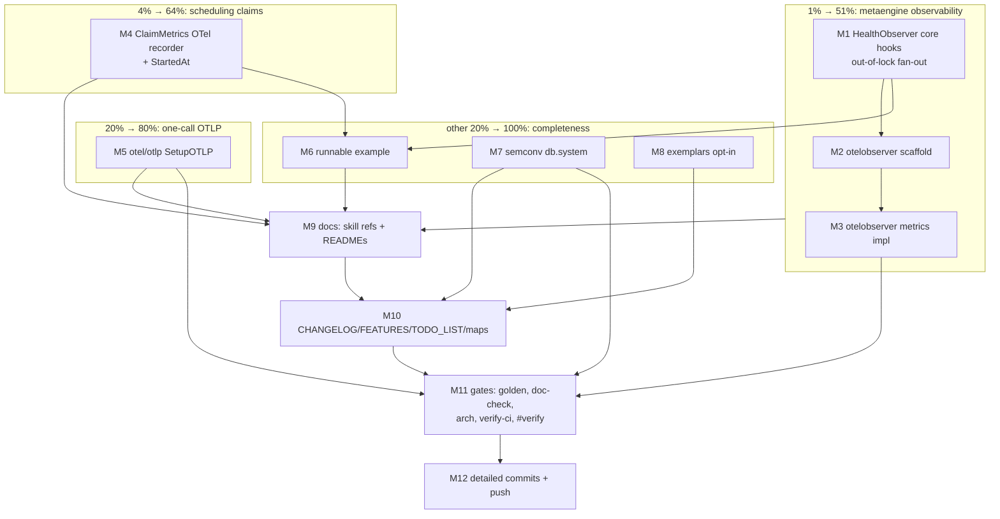

# SUPERB: OTEL-OBSERVABILITY — Close the observability gaps

> Plan created 2026-09-13 14:31 CEST from the session question "How are we doing on OTEL?
> Anything that should be improved?" Evidence-backed review found the shipped OTel surface
> (tracing, metrics, bundles, lint rules F027–F029) solid, but four real gaps + two minor ones.
> This plan closes them without breaking a single existing contract.

## Current state (verified 2026-09-13)

| Area                                        | Status | Evidence |
| ------------------------------------------- | ------ | -------- |
| `otel/` module (setup, views, propagation, logging) | ✅ Production, `v4.4.0` | ForceFlush-on-Shutdown, `WithSpanProcessor` shipped |
| Tracing coverage decider/storage/middleware/transports | ✅ broad | SPAN_NAMING.md, 37/147 storage files instrumented |
| **metaengine** (quarantine, probe, reroute, catch-up) | ❌ **1/299 files** | Only `projectionadapter` touches otel; core is dep-isolated (dedup/+record/ by design) — health transitions emit `slog` only, invisible to metrics/traces |
| **scheduling/sqlstore** claim observability | ⚠️ hooks exist, no OTel wiring | `ClaimMetrics` hooks + built-in `Metrics()` snapshot; TODO_LIST open: recorder, runnable example, process-start baseline |
| One-call OTLP                              | ❌ | `Setup()` = stdout or inject-your-own-exporter; manual assembly for the 90% case |
| Semantic conventions                        | ⚠️ custom attrs (`stream.id`) | No `db.system` — standard APMs can't auto-correlate |
| Exemplars                                   | ❌ off | metrics↔traces not linkable |

## Design decisions (thought through, not improvised)

1. **metaengine core gets typed hooks, not an OTel import.** The planner's dep isolation
   (ADR-0113) is a feature. We mirror the proven `scheduling/sqlstore.ClaimMetrics` pattern:
   a `HealthObserver` struct of func-field callbacks wired via `WithHealthObserver`, fanned
   out by a new Tier-4 module `metaengine/otelobserver` (like `metaengine/projectionadapter`).
2. **Hooks fire OUTSIDE all locks.** `recordEngineFailure` and `ReactivateEngine` mutate under
   `healthMu`; callbacks invoked under that mutex would deadlock the moment an observer calls
   `HealthSnapshot()`. Rule: collect the event under lock, fire after release. Contract
   documented: observers must not call back into the Store.
3. **Event set (v1, transitions only — no hot-path hooks):**
   `OnQuarantined(engine, failures, lastErr)`, `OnReactivated(engine, reason)`,
   `OnProbe(engine, err)`, `OnCatchUp(engine, passes, err)`. Per-query reroute stays slog-only
   (per-call hook in `effectiveQueryLocked` under `s.mu` = deadlock + alloc risk — not worth it).
4. **OTLP via a sibling module** `otel/otlp` that layers ON `otel.Setup`
   (`otlptracehttp` + `otlpmetrichttp`, no gRPC dep). Core `otel/` budget untouched;
   consumers wanting gRPC keep injecting their own exporter (documented).
5. **scheduling recorder lives in `scheduling/sqlstore`** using `otel/` re-exports only
   (contract 4) — mirrors `middleware.OTelMetricsRecorder`.
6. **Exemplars are opt-in** via a new constructor (`NewCQRSViewsWithExemplars`); never a
   silent change to `NewCQRSViews`. Verify-first task: SDK 1.46 exemplar semantics before wiring.

## Pareto breakdown

| Tier | Share | Items | Why |
| ---- | ----- | ----- | --- |
| **1% → 51%** | of effort, half the value | metaengine `HealthObserver` + `metaengine/otelobserver` | The strategic subsystem's operational nervous system: quarantine/probe/catch-up transitions become dashboard-visible. Operators (the ADR-0136/0137 audience) currently fly blind outside `Doctor`. |
| **4% → 64%** | | + `scheduling/sqlstore` OTel recorder + `StartedAt` snapshot field | Closes the oldest open OTel TODO; timer users get claim dashboards in one line. |
| **20% → 80%** | | + `otel/otlp` one-call exporters | Every new consumer's first 30 minutes with real telemetry: one call, real backend. |
| **Other 20% → 100%** | | Runnable scheduler+OTel example, semconv `db.system` attrs, exemplars, docs/meta (CHANGELOG symbol-cited, FEATURES, TODO_LIST, module map, skill refs, api golden, gates, commits, push) | Completeness + keeping every repo gate green. |

## Medium-granularity plan (10–30 min per task)

Sorted by importance / customer-value / impact / effort.

| # | Task | Tier | Impact | Effort | Depends on |
| - | ---- | ---- | ------ | ------ | ---------- |
| M1 | metaengine: `HealthObserver` type + `WithHealthObserver` store option, out-of-lock event fan-out at quarantine/reactivation/probe/catch-up seams + unit tests (incl. re-entrancy safety: callback calls `HealthSnapshot`) | 1% | High | 30m | — |
| M2 | `metaengine/otelobserver` module scaffold: go.mod (deps: metaengine, otel), go.work, flake testModules, api-stability slice, golden regen, TestEvery green | 1% | High | 15m | M1 |
| M3 | `metaengine/otelobserver` impl: `New(meter)` + `Attach(store, meter)`; counters `cqrs.metaengine.quarantine.total{engine}`, `cqrs.metaengine.reactivate.total{engine,reason}`, `cqrs.metaengine.probe.total{engine,outcome}`, `cqrs.metaengine.catchup.total{engine,outcome}` + passes histogram; tests via manual metric reader | 1% | High | 30m | M2 |
| M4 | `scheduling/sqlstore`: `StartedAt time.Time` on `ClaimMetricsSnapshot` (construction-stamped) + `NewClaimMetricsOTel(meter)` recorder wiring ClaimMetrics hooks → counters; unit tests | 4% | Med-High | 25m | — |
| M5 | `otel/otlp` module: scaffold + `SetupOTLP(ctx, OTLPConfig)` over `otel.Setup` (http exporters, insecure/envvar/headers options); tests with httptest collector; README | 20% | Med-High | 30m | — |
| M6 | Runnable example `example/scheduler-otel-status`: ClaimingTimerStore + otelobserver-style wiring + `Metrics()` → `/status` JSON + prom `/metrics` | 20% | Med | 30m | M4 |
| M7 | semconv: `otel.DBSystem(name)` KeyValue helper + apply `db.system` in storage/sql, storage/pebble, storage/bbolt span helpers (no behavior change) | 20% | Med | 20m | — |
| M8 | Exemplars: verify SDK 1.46 semantics; if clean, `NewCQRSViewsWithExemplars()` + test + doc note (reader filter); else document why skipped | 20% | Low-Med | 12m | — |
| M9 | Docs: skill refs (recipes.md §2.x observability, modules.md rows), SPAN_NAMING note, READMEs for both new modules, metaengine README observability section | 20% | Med | 25m | M1–M5 |
| M10 | Meta: CHANGELOG `[Unreleased]` (symbol-cited), FEATURES.md, TODO_LIST.md (close the claim-metrics otel items), module-map.md, AGENTS.md counts (85→87 go.mod) | 20% | Med | 20m | M1–M8 |
| M11 | Gates: api golden regen, doc-check, check-arch, verify-ci, `#verify` (exclusive, last) | 20% | High (gate) | 25m | M1–M10 |
| M12 | Git: per-slice detailed commits + final push (explicitly requested) | 20% | High (delivery) | 10m | M11 |

## Fine-granularity plan (≤12 min per task)

| # | Task | Parent | Est |
| - | ---- | ------ | --- |
| F1.1 | `metaengine/observer.go`: `HealthObserver` struct (4 func fields) + package doc + no-reentry contract doc | M1 | 10m |
| F1.2 | `Store.observer` field + `WithHealthObserver` option + nil-safe `emit*` helpers | M1 | 10m |
| F1.3 | Fire `OnQuarantined`/`OnReactivated` after `healthMu` release in `recordEngineFailure`/`ReactivateEngine` | M1 | 12m |
| F1.4 | Fire `OnProbe` in `reprobeOnce`; `OnCatchUp` in `CatchUpEngine` (pass count) + `catchUpOrReactivate` reason on plain reactivation | M1 | 12m |
| F1.5 | Tests: transitions fire exactly once; nil observer no-op; callback→`HealthSnapshot()` does not deadlock (proves out-of-lock) | M1 | 12m |
| F2.1 | otelobserver scaffold: go.mod, go.work, flake testModules, api-stability slice, `go build`, golden `--update`, `TestEvery` | M2 | 12m |
| F3.1 | Instruments + `New(meter cqrsotel.Meter) (metaengine.HealthObserver, error)` | M3 | 12m |
| F3.2 | `Attach(store, meter)` convenience (observer + wiring doc) | M3 | 10m |
| F3.3 | Tests: manual reader, drive fake engine failures → assert counter values + attribute sets | M3 | 12m |
| F3.4 | README + doc.go for otelobserver | M3 | 8m |
| F4.1 | `StartedAt` field + stamp at construction + test | M4 | 8m |
| F4.2 | `claim_metrics_otel.go`: `NewClaimMetricsOTel` recorder (claimed timers counter, batches, renewed, renew-rejected) | M4 | 12m |
| F4.3 | Recorder tests via manual reader | M4 | 12m |
| F5.1 | otel/otlp scaffold (go.mod, go.work, flake, api-stability slice, golden, TestEvery) | M5 | 12m |
| F5.2 | `OTLPConfig` + `SetupOTLP` impl over `otel.Setup` (trace+metric http exporters, endpoint/insecure/headers/compression) | M5 | 12m |
| F5.3 | Tests: httptest endpoint receives export requests; shutdown flush; option validation | M5 | 12m |
| F5.4 | README with collector quickstart | M5 | 8m |
| F6.1 | Example scaffold (go.mod, main.go skeleton, flake wiring if needed) | M6 | 12m |
| F6.2 | Full wiring: claim store + OTel recorder + `/status` + `/metrics`; `go build` + smoke run | M6 | 12m |
| F7.1 | `otel.DBSystem` helper + storage/sql span sites get `db.system` | M7 | 12m |
| F7.2 | pebble + bbolt span helpers get `db.system`; adjust any span-name golden tests | M7 | 12m |
| F8.1 | Exemplars verify-first spike; implement or document-skip | M8 | 12m |
| F9.1 | recipes.md observability section (observer + otlp + claim recorder snippets) + modules.md rows | M9 | 12m |
| F9.2 | SPAN_NAMING.md note (metrics-only observer, no new spans) + metaengine/README observability para | M9 | 10m |
| F10.1 | CHANGELOG `[Unreleased]` Added entries, every `pkg.Symbol` resolving (check-changelog-symbols gate) | M10 | 10m |
| F10.2 | FEATURES.md rows; TODO_LIST.md close items; module-map; AGENTS counts | M10 | 12m |
| F11.1 | `cmd/api-stability --update` + doc-check green | M11 | 12m |
| F11.2 | `#check-arch` + `#verify-ci` green | M11 | 12m |
| F11.3 | `nix run .#verify` (exclusive window, nothing else running) | M11 | 12m |
| F12.1 | Per-slice commits, detailed messages | M12 | 12m |
| F12.2 | `git push` + confirm remote state | M12 | 5m |

## Execution graph

## Guardrails (do NOT verschlimmbessern)

1. **Zero new deps in `metaengine` core** — hooks are plain func fields; dep isolation stays.
2. **No callback ever invoked while holding `healthMu`/`s.mu`** — proven by test.
3. **No hot-path hooks** — per-query/per-fold paths stay untouched (alloc + deadlock risk).
4. **`NewCQRSViews` behavior unchanged** — exemplars only via new constructor.
5. **Core `otel/` dep budget unchanged** — OTLP exporters live only in `otel/otlp`.
6. **Every exported symbol lands in the api golden in the same edit** (contract: golden regen same-change).
7. **CHANGELOG symbols must resolve** (check-changelog-symbols gate is unforgiving).
8. **All spans/attrs additive** — no renames of existing span names or attributes.
9. `#verify` runs exclusively — nothing concurrent during M11.3.
10. Push only after everything green (explicitly requested by user).

## Definition of done

- [ ] `metaengine.WithHealthObserver` + `otelobserver` module: quarantine/reactivation/probe/catch-up visible as OTel counters
- [ ] `scheduling/sqlstore.NewClaimMetricsOTel` + `ClaimMetricsSnapshot.StartedAt`
- [ ] `otel/otlp.SetupOTLP` one-call wiring with http exporters
- [ ] Runnable example serving `/status` + `/metrics`
- [ ] `db.system` on sql/pebble/bbolt spans; exemplars decision implemented or documented
- [ ] api golden, doc-check, check-arch, verify-ci, `#verify` all green
- [ ] CHANGELOG/FEATURES/TODO_LIST/module map/skill refs updated
- [ ] Detailed commits + push
