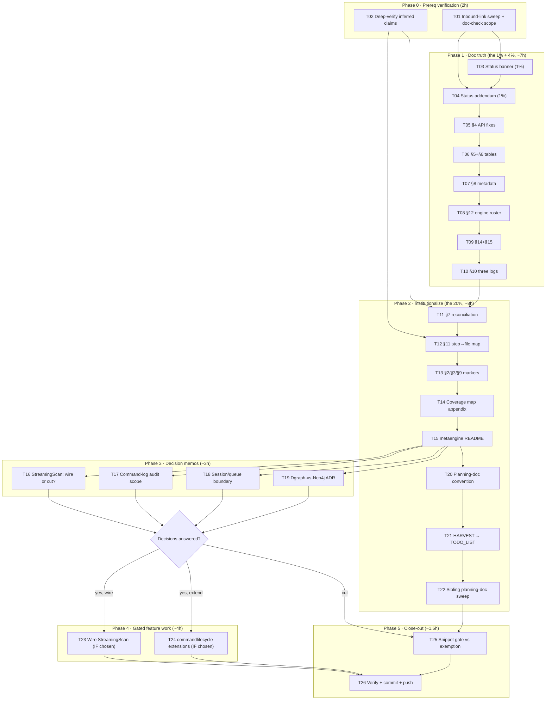

# SUPERB Plan: Event-Query-Model Truth Reconciliation

**Date:** 2026-09-13 16:01 CEST
**Type:** Pareto execution plan
**Basis:** [`docs/status/2026-09-13_12-10_metaengine-event-query-model-doc-audit.md`](../status/2026-09-13_12-10_metaengine-event-query-model-doc-audit.md) + [`docs/status/2026-09-13_15-55_event-query-model-not-shipped-vs-reality.md`](../status/2026-09-13_15-55_event-query-model-not-shipped-vs-reality.md)
**Target:** [`docs/planning/event-query-model.md`](event-query-model.md) (2026-07-23) + its systemic causes

---

## Why this plan exists (context)

`event-query-model.md` declares itself **"THE model. Supersedes all prior meta-engine design docs"** — yet source-level verification shows:

- **5 sections carry factually wrong API examples** (§4 execute API, §5 ADT set, §6 read patterns, §8 metadata fields, §12 engine roster).
- **§10's largest claim (four logs)** is 1/3 shipped: the command log shipped **better than designed** as `commandlifecycle` + command journals (ADR-0117) + metaengine projections; the query log and session log have **zero implementation**.
- **§15 Decision 2 is a ghost**: `StreamingScan` is implemented by 4 engines with **zero production callers**; `Store.Export` does not use it.
- **§12's Neo4j/YAML/Bloom assumptions** are replaced in reality by a `GraphDriver` extension point, Go composition roots, and a Pebble-internal filter policy respectively.

A reader (human or AI) who takes the doc at face value builds on a false model. The fix is not "delete the doc" — the core abstraction (folds-are-the-ADT, per-query projections, cost-based planning) genuinely shipped. The fix is **make every claim either verified true or explicitly marked**.

**Non-goal / guardrail (no verschlimmbessern):** do NOT rewrite the doc destructively. Annotate in place (banner + addendum + corrected examples), keep the original structure, never delete design intent — mark it. Code changes only after the decision memos (T16-T18) are answered. Nothing in Phase 1-2 touches a single `.go` file.

---

## Pareto analysis

### The 1% → 51% (do this first)

| Item | Tasks | Why 51% |
|---|---|---|
| **Status banner + implementation-status addendum** | T03, T04 | One file, ~2h, zero code risk. Converts the doc from "misleading truth-claim" to "navigable, honest design record". Every future reader stops being deceived. Nothing else on the list matters if readers still trust the false claims. |

### The 4% → 64%

| Item | Tasks | Why +13% |
|---|---|---|
| **Fix every factually wrong example** (§4, §5, §6, §8, §12) + **§14/§15 status annotations** + **§10 three-log status** | T05-T10 | After this, every Go snippet in the doc compiles against the real API (or is marked historical), and every decision section says what actually happened. The doc becomes safe to cite section-by-section. |

### The 20% → 80%

| Item | Tasks | Why +16% |
|---|---|---|
| Verification completion + reconciliation notes + coverage map + README truth + decision memos + doc-truth institution (AGENTS.md convention, HARVEST, sibling sweep) | T01, T02, T11-T22 | Closes the *systemic* cause: verified claims (not filename inference), undocumented features listed, the ghost/gap decisions documented for the user, and the convention that prevents the next stale "THE model" doc. |

### The other 20% → 100%

| Item | Tasks | Why the remainder |
|---|---|---|
| Feature execution (wire StreamingScan, extend commandlifecycle), snippet gate, final verify/push | T23-T26 | Blocked on product decisions (the 3 open questions) or feature-sized. Everything after this is net-new capability, not truth repair. |

**Execution order: 1% → 4% → 20% → remaining 20%.** Phases P0/P1 can start immediately; P3 decisions should be answered in parallel (they are memos, not blockers, except T23/T24 which are gated).

---

## Execution graph

---

## Comprehensive plan — medium granularity (26 tasks, 30-100 min each)

Sorted by Pareto tier, then impact (Critical → Low). Effort = planned minutes. "Customer value": consumer = external library user; contributor = internal/AI sessions; all = both.

| # | Task | Tier | Impact | Effort | Customer value | Phase |
|---|------|------|--------|--------|----------------|-------|
| T03 | Status banner + header rewrite on event-query-model.md (what shipped, what didn't, where truth lives) | 1% | Critical | 45 | All | P1 |
| T04 | Implementation-status addendum for all 15 sections (DONE / DIFFERENT / NOT-SHIPPED per section) | 1% | Critical | 90 | All | P1 |
| T05 | §4 fixes: `ExecuteTyped` example, `OnRecord` as canonical (On deprecated v5) | 4% | High | 45 | Consumer | P1 |
| T06 | §5+§6 fixes: ADT table (MultiEntry/Append/EdgeRemoval, 8 enum values) + 11 read patterns | 4% | High | 60 | Consumer | P1 |
| T07 | §8 fixes: real `CommonMetadata` fields; `RangeFilter` → `WithRange`/`FilterOnField` | 4% | High | 45 | Consumer | P1 |
| T08 | §12 fixes: real engine roster (10 engines), Neo4j→Dgraph/CTE, YAML→Go composition, Bloom annotation | 4% | High | 60 | All | P1 |
| T09 | §14+§15 fixes: hot-reload APIs (AddEngine/SwapEngine/Replan/roles) + Decision 1-4 resolutions | 4% | High | 60 | All | P1 |
| T10 | §10 annotation: command log = SHIPPED as commandlifecycle (pointers); query/session logs = NOT SHIPPED | 4% | Critical | 45 | All | P1 |
| T01 | Inbound-link sweep for the doc + check `cmd/doc-check` scan set | Prereq | Critical | 30 | Contributor | P0 |
| T02 | Deep-verify inferred claims: rule_shared_collection vs §7, catchup vs D4, grouped vs D3, §13 rows | Prereq | High | 90 | Contributor | P0 |
| T14 | "Features beyond the doc" coverage-map appendix (25+ undocumented features) | 20% | High | 90 | All | P2 |
| T16 | Decision memo: StreamingScan — wire vs cut (options, costs, ready-to-execute wiring steps) | 20% | High | 45 | Contributor | P3 |
| T17 | Decision memo: command-log audit scope (per-actor projection? payload capture? distinct rejection event?) | 20% | High | 45 | Consumer | P3 |
| T21 | HARVEST: both status reports + this plan → TODO_LIST.md / ROADMAP.md | 20% | High | 45 | Contributor | P2 |
| T11 | §7 reconciliation note vs `rule_shared_collection.go` (from T02 findings) | 20% | Medium | 30 | Contributor | P2 |
| T12 | §11 planner-step→source-file mapping annotation | 20% | Medium | 60 | Contributor | P2 |
| T15 | metaengine README: ProjectionRole docs, On/OnTyped deprecation note, fold-table check | 20% | Medium | 90 | Consumer | P2 |
| T18 | Decision memo: session/queue boundary (identity-model permanent? `queue/` intersection) | 20% | Medium | 30 | Contributor | P3 |
| T19 | Dgraph-vs-Neo4j: check existing ADR; file if missing | 20% | Medium | 60 | All | P3 |
| T20 | Planning-doc status convention → AGENTS.md (+ doc-check marker consideration) | 20% | Medium | 60 | Contributor | P2 |
| T22 | Sibling sweep: `docs/planning/*.md` for the same rot pattern | 20% | Medium | 90 | Contributor | P2 |
| T13 | §2/§3/§9 scope markers (philosophy/scope statements, no code claims) | 20% | Low | 30 | Contributor | P2 |
| T23 | Feature (IF chosen): wire StreamingScan — `Store.Stream` + `Export` integration + tests | Rest | High | 100 | Consumer | P4 |
| T24 | Feature (IF chosen): commandlifecycle extensions + distinct rejection event + tests | Rest | High | 100 | Consumer | P4 |
| T25 | Snippet-compile gate for planning docs OR documented exemption | Rest | Medium | 90 | Contributor | P5 |
| T26 | Final verify (verify-fast + doc-check), commit, push | Rest | Medium | 45 | All | P5 |

**Totals:** 26 tasks · ~31h raw · Critical path (T01→T03→T04→T05..T10→T11→T21→T22→T25→T26) ≈ 13h.

---

## Fine-grained breakdown (115 tasks, ≤12 min each)

Grouped by parent task. Every row is independently executable and verifiable.

### T01 — Inbound-link sweep (4)
| # | Step | Min |
|---|------|-----|
| T01.1 | `rg -l "event-query-model"` repo-wide; record hits | 5 |
| T01.2 | Read `cmd/doc-check/main.go` scan list; is `docs/planning/` covered? | 7 |
| T01.3 | Check skill references + AGENTS.md for links to the doc | 5 |
| T01.4 | Record findings in notes (feeds T20/T22) | 5 |

### T02 — Deep-verify inferred claims (7)
| # | Step | Min |
|---|------|-----|
| T02.1 | Read `rule_shared_collection.go` + test; reconcile vs §7 claim | 12 |
| T02.2 | Read `catchup_state.go`; map to Decision 4 checkpoint claim | 12 |
| T02.3 | Read `typed_reader_grouped.go` + `execute.go` inner; confirm D3 single-collection | 12 |
| T02.4 | Verify §13 rows (IndexSpec/DDL/column-type claims) vs layout code | 12 |
| T02.5 | Verify §11 steps 1-7 each have a real source counterpart | 12 |
| T02.6 | Verify §5 physical-structure claims vs `StorageLayout` enum | 12 |
| T02.7 | Write verification notes (append to a status doc or new notes file) | 12 |

### T03 — Status banner (4)
| # | Step | Min |
|---|------|-----|
| T03.1 | Draft banner text (date, verdict, truth pointers) | 10 |
| T03.2 | Insert after title; original status line kept below | 5 |
| T03.3 | Add pointers: metaengine README, commandlifecycle, 2 status docs | 5 |
| T03.4 | Re-read full top-of-doc for coherence | 5 |

### T04 — Implementation-status addendum (7)
| # | Step | Min |
|---|------|-----|
| T04.1 | §1-§3 rows (philosophy, no code claims) | 10 |
| T04.2 | §4-§6 rows (DONE/DIFFERENT with file refs) | 12 |
| T04.3 | §7-§9 rows | 12 |
| T04.4 | §10 rows (NOT-SHIPPED + shipped-as-commandlifecycle pointer) | 12 |
| T04.5 | §11-§13 rows | 12 |
| T04.6 | §14-§15 rows | 12 |
| T04.7 | Cross-check every row against the two audit docs | 12 |

### T05 — §4 API fixes (4)
| # | Step | Min |
|---|------|-----|
| T05.1 | Rewrite `store.Execute(ctx, ...)` example → `ExecuteTyped[Q,R]` | 12 |
| T05.2 | Add OnRecord-canonical note (`On`/`OnTyped` deprecated, v5 removal) | 10 |
| T05.3 | Fix "How Queries Are Called" block consistently | 12 |
| T05.4 | Re-verify block against `query.go`/`execute.go` signatures | 10 |

### T06 — §5+§6 fixes (5)
| # | Step | Min |
|---|------|-----|
| T06.1 | §5: add MultiEntry/Append/EdgeRemoval rows to the mapping | 12 |
| T06.2 | §5: align table with 8-value ADT enum | 10 |
| T06.3 | §6: expand read patterns to the shipped 11 | 12 |
| T06.4 | §6: note input-shape → pattern inference touches Cursor/FilterOnField | 10 |
| T06.5 | Re-read both sections end-to-end | 10 |

### T07 — §8 metadata fixes (4)
| # | Step | Min |
|---|------|-----|
| T07.1 | Rewrite fold example with real `CommonMetadata` fields | 12 |
| T07.2 | Replace `RangeFilter("timestamp")` with real API | 10 |
| T07.3 | Note Cause/Actor vs deprecated CausationID/ActorID (v5) | 10 |
| T07.4 | Verify against `record/record.go` | 10 |

### T08 — §12 engine fixes (5)
| # | Step | Min |
|---|------|-----|
| T08.1 | Replace Neo4j examples with Dgraph + SQL CTE fallback | 12 |
| T08.2 | Annotate Bloom claims (Pebble-internal only, not an ADT) | 10 |
| T08.3 | Annotate YAML (Go composition roots instead) | 10 |
| T08.4 | Add real 10-engine roster | 10 |
| T08.5 | Verify roster against `ls metaengine/` | 5 |

### T09 — §14+§15 fixes (5)
| # | Step | Min |
|---|------|-----|
| T09.1 | §14: rewrite flow with AddEngine/RemoveEngine/SwapEngine | 12 |
| T09.2 | §14: note shadow roles (Migration/Backup) for cutover | 10 |
| T09.3 | §15 D1: annotate hybrid FilterOn/FilterOnField resolution | 10 |
| T09.4 | §15 D2/D3/D4: annotate ghost/not-shipped/shipped statuses | 12 |
| T09.5 | Re-read §14-§15 coherence | 10 |

### T10 — §10 three-log annotation (4)
| # | Step | Min |
|---|------|-----|
| T10.1 | Command log: shipped-as box (streams, 5 events, journals, projections, system wiring) | 12 |
| T10.2 | Query log: NOT shipped + observability-hooks pointer | 10 |
| T10.3 | Session log: NOT shipped + identity-model boundary note | 10 |
| T10.4 | "Four logs" framing note + link to open questions | 10 |

### T11 — §7 reconciliation (2)
| # | Step | Min |
|---|------|-----|
| T11.1 | Draft shared-collection reconciliation note from T02.1 | 12 |
| T11.2 | Insert + re-read §7 | 10 |

### T12 — §11 mapping (6)
| # | Step | Min |
|---|------|-----|
| T12.1 | Step 1 → `fold_classify.go` annotation | 10 |
| T12.2 | Step 2 → `infer_*.go` annotation | 10 |
| T12.3 | Step 3 → `cost.go`/rules annotation | 10 |
| T12.4 | Step 4 → `layout*.go` annotation | 10 |
| T12.5 | Steps 5-6 → `auto_fold.go`/`typed_reader*.go` annotation | 10 |
| T12.6 | Step 7 → `rules.go`/`plan_audit.go`/doctor annotation | 10 |

### T13 — Scope markers (3)
| # | Step | Min |
|---|------|-----|
| T13.1 | §9 auth: scope-statement marker | 10 |
| T13.2 | §2-§3: philosophy marker (no code claims) | 10 |
| T13.3 | §1: graph-at-three-levels marker | 10 |

### T14 — Coverage map (5)
| # | Step | Min |
|---|------|-----|
| T14.1 | List data-layer extras (materialized views, replication/iroh, export/import) | 12 |
| T14.2 | List transport extras (SSE ×2, watchers, catchup/replay) | 12 |
| T14.3 | List query extras (vector, spatial, graphadapter, aggregates) | 12 |
| T14.4 | List ops extras (durability, demote, backfill, batch atomicity, idempotency, tx, priority, plan-diff) | 12 |
| T14.5 | Verify each against README/ADRs; write appendix | 12 |

### T15 — metaengine README (6)
| # | Step | Min |
|---|------|-----|
| T15.1 | Draft ProjectionRole section (4 roles, shadow semantics) | 12 |
| T15.2 | Insert ProjectionRole section | 10 |
| T15.3 | Add On/OnTyped deprecation + migration note | 10 |
| T15.4 | Check fold table covers EdgeRemove/Skip; patch if not | 10 |
| T15.5 | Cross-link ADRs 0113/0117/0123 | 10 |
| T15.6 | Re-read README diff | 10 |

### T16 — StreamingScan memo (3)
| # | Step | Min |
|---|------|-----|
| T16.1 | Enumerate options (wire / cut / keep-dormant) + costs | 12 |
| T16.2 | Write ready-to-execute wiring steps for "wire" option | 12 |
| T16.3 | Write memo file + link from plan | 12 |

### T17 — Command-log scope memo (3)
| # | Step | Min |
|---|------|-----|
| T17.1 | Document current projection coverage + gaps (per-actor, payload, rejection) | 12 |
| T17.2 | Cost/benefit per option | 12 |
| T17.3 | Write memo + recommendation | 12 |

### T18 — Session/queue memo (3)
| # | Step | Min |
|---|------|-----|
| T18.1 | Document identity-model boundary + ActorID state | 10 |
| T18.2 | Analyze `queue/` intersection with four-logs vision (check `claiming/` note) | 12 |
| T18.3 | Write memo + recommendation | 10 |

### T19 — Dgraph ADR (3)
| # | Step | Min |
|---|------|-----|
| T19.1 | Search docs/adr for existing graph-engine decision | 10 |
| T19.2 | If missing: draft ADR skeleton | 12 |
| T19.3 | Cross-link from doc §12 | 10 |

### T20 — Planning-doc convention (4)
| # | Step | Min |
|---|------|-----|
| T20.1 | Draft convention (Status header + addendum discipline) | 12 |
| T20.2 | Edit AGENTS.md (Documentation Files table + procedures) | 12 |
| T20.3 | Consider doc-check marker enforcement; note decision | 10 |
| T20.4 | Run doc-check over AGENTS.md (it is in the gate) | 12 |

### T21 — HARVEST (4)
| # | Step | Min |
|---|------|-----|
| T21.1 | Extract all (f)-items from both status docs + this plan | 12 |
| T21.2 | Dedupe + route TODO_LIST vs ROADMAP | 12 |
| T21.3 | Edit TODO_LIST.md | 12 |
| T21.4 | Edit ROADMAP.md if needed | 10 |

### T22 — Sibling sweep (5)
| # | Step | Min |
|---|------|-----|
| T22.1 | List all `docs/planning/*.md` | 5 |
| T22.2 | Grep each for "supersedes|THE model|Status:" claims | 10 |
| T22.3 | Triage which need addenda | 12 |
| T22.4 | File findings list | 12 |
| T22.5 | Quick annotations for worst offenders (optional, timeboxed) | 12 |

### T23 — Wire StreamingScan (IF chosen) (5)
| # | Step | Min |
|---|------|-----|
| T23.1 | Design `Store.Stream` signature + capability detection | 12 |
| T23.2 | Implement `Store.Stream` (type-assert + fallback) | 12 |
| T23.3 | Use stream in `Export` | 12 |
| T23.4 | Tests (capability + fallback paths) | 12 |
| T23.5 | `go build` + targeted tests | 12 |

### T24 — commandlifecycle extensions (IF chosen) (4)
| # | Step | Min |
|---|------|-----|
| T24.1 | Actor-keyed projection (CommandsByActor) | 12 |
| T24.2 | Distinct rejection event + recorder method | 12 |
| T24.3 | Tests | 12 |
| T24.4 | `system` wiring option | 12 |

### T25 — Snippet gate (4)
| # | Step | Min |
|---|------|-----|
| T25.1 | Enumerate planning docs containing Go snippets | 10 |
| T25.2 | Decision: gate vs documented exemption | 10 |
| T25.3 | Implement chosen path (doc-check extension or header convention) | 12 |
| T25.4 | Verify on the reconciled doc | 12 |

### T26 — Close-out (6)
| # | Step | Min |
|---|------|-----|
| T26.1 | `nix run .#verify-fast` (or doc-scoped gates if no code changed) | 12 |
| T26.2 | `git status` clean check | 5 |
| T26.3 | Commit message draft (detailed) | 10 |
| T26.4 | Commit | 5 |
| T26.5 | Push | 5 |
| T26.6 | Final report | 10 |

---

## Decision gates (blocking T23/T24)

| Gate | Question | Blocks | Fallback if unanswered | Memo | Outcome |
|------|----------|--------|------------------------|------|---------|
| G1 | Wire or cut `StreamingScan` (ghost capability)? | T23 | Cut at v5 stays default; memo T16 stands as proposal | [`T16 memo`](2026-09-13_T16-memo-streamingscan-wire-or-cut.md) | **EXECUTED 2026-09-13** — option A wired as `Store.StreamCollection` + streaming `Export` |
| G2 | Command-log audit scope: per-actor projection / payload capture / distinct rejection event? | T24 | Ship memo T17 as recommendation; no code | [`T17 memo`](2026-09-13_T17-memo-command-log-audit-scope.md) | **HALF EXECUTED** — option B shipped (`CommandsByActor`); rejection event + payload capture remain open |
| G3 | Sessions permanently external (identity-model) or future module? `queue/` relation? | T18 outcome (informational) | Document current boundary; no code | [`T18 memo`](2026-09-13_T18-memo-session-log-boundary.md) | **OPEN** — memo T18 recommendation stands |

---

## Guardrails (do-not-versehlimmbessern rules)

1. **Docs before code.** Phases P0-P2 modify only `.md` files. No `.go` edits until T16-T18 decisions are answered.
2. **Annotate, never rewrite.** Original doc structure and design intent are preserved; corrections live in the banner, addendum, and inline marked notes.
3. **One verifiable claim, one source.** Every addendum row cites a file:line or an explicit "unverified" marker.
4. **No breaking gates.** If any `.md` change touches files in the doc-check gate (AGENTS.md, SKILL.md), re-run doc-check before commit.
5. **API-surface rule:** if any README edit changes exported-symbol documentation, regenerate the api-stability golden in the same change.
6. **Commit per phase** (or per task group), never one mega-commit; never push without explicit request (this session has it).
7. **Stop at decisions.** When a memo is written, stop; do not implement the gated features speculatively.

---

## Done criteria

- `event-query-model.md` contains zero unmarked false claims (every section: DONE / DIFFERENT / NOT-SHIPPED / PHILOSOPHY).
- Every corrected Go snippet matches a real signature at the cited file:line (spot-checked in T25).
- The 3 decision memos exist with options + recommendation.
- `TODO_LIST.md`/`ROADMAP.md` carry the harvested items.
- AGENTS.md documents the planning-doc status convention; doc-check passes.
- `git status` clean; commit(s) pushed.

---

**Execution status 2026-09-13 (same day):** T01–T22, T25, T26 executed; T23/T24 implemented
after the memos recommended options A (wire `StreamingScan` as `Store.StreamCollection`) and
B (per-actor `CommandsByActor` projection) — see CHANGELOG. Decisions still open: the
`command.rejected` event (T17 deferred half), session-log boundary (T18), query-level
`Stream(ctx, input, fn)` (T16 follow-up). Plan version: 1.1.
