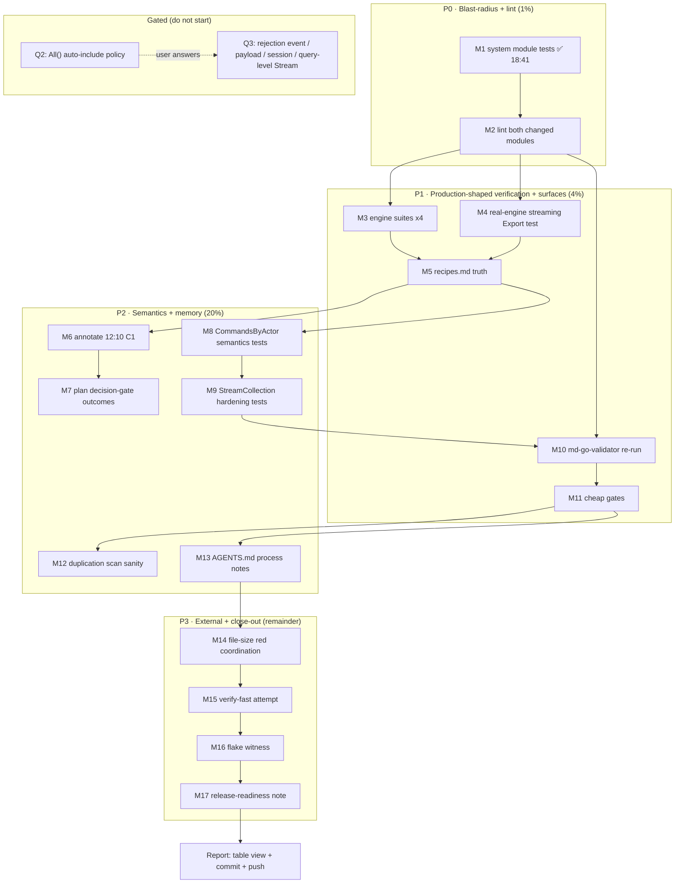

# SUPERB Plan: Reconciliation Close-Out — Verification, Truth Propagation, Hardening

**Date:** 2026-09-13 18:41 CEST
**Type:** Pareto execution plan (follow-up to the reconciliation execution)
**Basis:** [`docs/status/archived/2026-09-13_18-35_event-query-model-truth-reconciliation-execution.md`](../status/2026-09-13_18-35_event-query-model-truth-reconciliation-execution.md)
**Parent plan (executed):** [`2026-09-13_16-01_SUPERB-event-query-model-truth-reconciliation.md`](2026-09-13_16-01_SUPERB-event-query-model-truth-reconciliation.md)
**Target:** close every non-gated gap the status report identified — verification, stale doc surfaces, missing semantics tests, process notes — without touching gated product decisions.

> **EXECUTED IN FULL 2026-09-14** — all 17 tasks executed (M2/M15 partial-by-design,
> routed; see the authoritative execution report
> [`docs/status/archived/2026-09-14_03-29_reconciliation-close-out-execution.md`](../status/archived/2026-09-14_03-29_reconciliation-close-out-execution.md) §a;
> the in-file Status column below froze mid-run and was never updated). Q2 answered
> 2026-09-15 (`command.rejected` shipped). ARCHIVED by the docs-health 8th pass, 2026-09-19.

---

## Why this plan exists

The reconciliation itself is done and pushed (26/26 tasks; `Store.StreamCollection` + streaming `Export`, `CommandsByActor`, reconciled doc, memos, goldens). The 18:35 status report then identified what execution did **not** cover:

- **2 unverified blast-radius/gate items** (the `system` module consumes `projections.All()`; no lint was run).
- **5 verification gaps** (engine modules, real-engine export test, md-go-validator, cheap gates, full verify).
- **2 stale doc surfaces** (`recipes.md` projection list; the 12:10 report's C1 error unannotated).
- **3 missing semantics tests** (`CommandsByActor` empty-actor/received-only; `StreamCollection` reentrancy/early-stop).
- **4 process notes** (blast-radius rule, daemon-commit protocol, duplication-scan sanity, flake witness).
- **2 external reds** (file-size ratchet on another session's `lintutil.go`; the load-flake).
- **3 user-gated decisions** (unchanged: `All()` policy, rejection event/payload capture, session/stream scope).

This plan converts all of that into an ordered, verifiable execution. It is deliberately **all verification + docs + tests**: no new public API, no product moves.

## Non-negotiable constraints (do-not-verschlimmbessern)

1. **No public API changes.** Tests/docs/process only; lint fixes may touch only this session's own new files.
2. **Gated items stay gated** (Q2/Q3 answers pending) — no `command.rejected`, no payload capture, no session module, no query-level `Stream`, no `All()` policy change.
3. **Never touch other sessions' files** (`cmd/cqrs-lint/.../lintutil.go`, `scripts/check-module-layers.sh`, `example/scheduler-otel-status/*`).
4. **Record every result** — reds surfaced in the final table, never hidden.
5. **No baseline updates, no art-dupl re-pins.** If duplication flags a new group, annotate or refactor; never re-pin.
6. **Commit + push at the end** (explicitly requested for this plan).

---

## Pareto analysis

### The 1% → 51%

| Item                          | Tasks  | Why 51%                                                                                                                                                                                                     |
| ----------------------------- | ------ | ----------------------------------------------------------------------------------------------------------------------------------------------------------------------------------------------------------- |
| **Blast-radius + lint proof** | M1, M2 | M1 (`system` tests) and M2 (lint on both changed modules) either vouch for the entire shipped change set or surface a defect while the diff is small. Every other follow-up is polish on top of this truth. |

### The 4% → 64%

| Item                                               | Tasks                | Why +13%                                                                                                                                                                                                                                                |
| -------------------------------------------------- | -------------------- | ------------------------------------------------------------------------------------------------------------------------------------------------------------------------------------------------------------------------------------------------------- |
| **Production-shaped verification + surface truth** | M3, M4, M5, M10, M11 | Proves the streaming export on the 4 real capability engines, adds a real-engine test, fixes the stale recipe surface, re-runs the doc validator and the cheap gates. Converts "verified in a synthetic harness" into "verified where consumers stand". |

### The 20% → 80%

| Item                                       | Tasks           | Why +16%                                                                                                                                                                                                                                                        |
| ------------------------------------------ | --------------- | --------------------------------------------------------------------------------------------------------------------------------------------------------------------------------------------------------------------------------------------------------------- |
| **Semantics tests + institutional memory** | M6-M9, M12, M13 | Pins `CommandsByActor`/`StreamCollection` semantics with tests, annotates the old report's C1 error, adds the blast-radius + daemon-commit rules to AGENTS.md, sanity-checks the duplication scanner. Closes the "forgot" list so no future session reopens it. |

### The other 20% → 100%

| Item                                              | Tasks                | Why the remainder                                                                                                                                                                   |
| ------------------------------------------------- | -------------------- | ----------------------------------------------------------------------------------------------------------------------------------------------------------------------------------- |
| **External reds, full verify, release readiness** | M14-M17 + gated list | Blocked or continuous: the file-size red is another session's file, full `#verify-fast` depends on it, the flake needs a quiet machine, and the 3 product decisions are user-gated. |

**Execution order: 1% → 4% → 20% → remainder.**

---

## Execution graph

---

## Comprehensive plan — medium granularity (17 tasks, 15-90 min each)

Sorted by Pareto tier, then impact. Customer value: **consumer** = external library user, **contributor** = internal/AI sessions, **all** = both.

| #   | Task                                                                                                                                  | Tier | Impact   | Effort | Customer    | Depends | Status        |
| --- | ------------------------------------------------------------------------------------------------------------------------------------- | ---- | -------- | ------ | ----------- | ------- | ------------- |
| M1  | Run `system` module tests — verify `projections.All()` 4→5 blast radius                                                               | 1%   | Critical | 10m    | All         | —       | ✅ PASS 18:41 |
| M2  | `golangci-lint` metaengine + commandlifecycle/projections; fix all findings in this session's files (incl. redundant test `//nolint`) | 1%   | Critical | 45m    | Contributor | M1      | Running       |
| M3  | Engine-module suites: pebble, sqlite, bbolt, badger (`-short`)                                                                        | 4%   | High     | 60m    | Consumer    | M2      | Running       |
| M4  | Real-engine streaming `Export` test in `metaengine/sqliteengine` (correctness + row coverage over a real engine)                      | 4%   | High     | 60m    | Consumer    | M2      | Pending       |
| M5  | `recipes.md` truth: lifecycle projection list, `CommandsByActor` snippet, event-table row, doc-check re-run                           | 4%   | High     | 40m    | Consumer    | M3, M4  | Pending       |
| M10 | Re-run `md-go-validator` over `event-query-model.md`; record finding delta vs the 2026-09-13 review                                   | 4%   | Medium   | 20m    | Contributor | M9      | Pending       |
| M11 | Cheap gates: `#check-arch`, `#check-error-taxonomy`, `nix fmt --fail-on-change`                                                       | 4%   | Medium   | 25m    | Contributor | M10     | Pending       |
| M6  | ANNOTATE the 12:10 report: inline correction of the C1 command-log error + execution-outcome link                                     | 20%  | Medium   | 30m    | Contributor | M5      | Pending       |
| M7  | Parent plan: add outcome status to the decision gates (G1 executed, G2 half, G3 open)                                                 | 20%  | Medium   | 15m    | Contributor | M6      | Pending       |
| M8  | `CommandsByActor` semantics tests: empty-actor key pinned; received-only behavior pinned                                              | 20%  | High     | 45m    | Consumer    | M5      | Pending       |
| M9  | `StreamCollection` hardening tests: fn reentrancy (store call inside fn), early-stop on fn error, per-collection stream call count    | 20%  | High     | 50m    | Consumer    | M8      | Pending       |
| M12 | Duplication "0 groups vs 54 baseline" sanity check; document scan scope in gotchas if it is scope-dependent                           | 20%  | Medium   | 30m    | Contributor | M11     | Pending       |
| M13 | AGENTS.md process notes: exported-aggregate blast-radius rule; daemon-commit-protocol note; doc-check AGENTS.md                       | 20%  | High     | 20m    | Contributor | M11     | Pending       |
| M14 | File-size red coordination: re-run gate, inspect `lintutil.go` state, write owner handoff note if still red                           | Rest | Medium   | 15m    | Contributor | M13     | Pending       |
| M15 | Full `nix run .#verify-fast` attempt (if M14 green; else document exact blocked state)                                                | Rest | High     | 90m    | All         | M14     | Pending       |
| M16 | Load-flake witness: append second witness + repro command to the existing TODO contention item                                        | Rest | Medium   | 15m    | Contributor | M15     | Pending       |
| M17 | Release-readiness note: metaengine + commandlifecycle/projections are untagged since this work; add to Release TODO                   | Rest | Medium   | 15m    | All         | M16     | Pending       |

**Totals:** 17 tasks · ~9.5h raw · critical path (M2→M4→M5→M8→M9→M10→M11→M13→M14→M15) ≈ 6h.

---

## Fine-grained breakdown (58 tasks, ≤12 min each)

### M1 — system module tests (2)

| #    | Step                                                                                | Min           |
| ---- | ----------------------------------------------------------------------------------- | ------------- |
| M1.1 | `cd system && GOWORK=off go test -tags "goexperiment.jsonv2" -short -count=1 ./...` | 10            |
| M1.2 | Record result in status evidence                                                    | ✅ PASS 18:41 |

### M2 — lint both changed modules (6)

| #    | Step                                                                                                         | Min |
| ---- | ------------------------------------------------------------------------------------------------------------ | --- |
| M2.1 | `golangci-lint run` on metaengine module                                                                     | 10  |
| M2.2 | `golangci-lint run` on commandlifecycle/projections                                                          | 10  |
| M2.3 | Triage findings: mine vs pre-existing                                                                        | 10  |
| M2.4 | Fix findings in this session's files (e.g. drop redundant `//nolint:forcetypeassert` if nolintlint flags it) | 12  |
| M2.5 | Re-run both lints to green                                                                                   | 10  |
| M2.6 | Record findings + fixes                                                                                      | 5   |

### M3 — engine suites (5)

| #    | Step                        | Min |
| ---- | --------------------------- | --- |
| M3.1 | pebbleengine `-short` suite | 12  |
| M3.2 | sqliteengine `-short` suite | 12  |
| M3.3 | bboltengine `-short` suite  | 12  |
| M3.4 | badgerengine `-short` suite | 12  |
| M3.5 | Record all four results     | 5   |

### M4 — real-engine streaming Export test (5)

| #    | Step                                                                  | Min |
| ---- | --------------------------------------------------------------------- | --- |
| M4.1 | Read sqliteengine test conventions (imports, DSN helpers)             | 10  |
| M4.2 | Write export test: plan a map query, apply events, `Export` to buffer | 12  |
| M4.3 | Assert output contains all rows + valid JSON                          | 12  |
| M4.4 | Run test; fix until green                                             | 12  |
| M4.5 | Record                                                                | 5   |

### M5 — recipes.md truth (5)

| #    | Step                                                                               | Min |
| ---- | ---------------------------------------------------------------------------------- | --- |
| M5.1 | Fix comment `// DLQ, RetryCount, FailureLog, ProcessingTime` → + `CommandsByActor` | 5   |
| M5.2 | Add `projections.CommandsByActor()` to the Plan example                            | 10  |
| M5.3 | Add a CommandsByActor query snippet (typed execute)                                | 12  |
| M5.4 | Add the per-actor row to the event→projection table                                | 8   |
| M5.5 | Re-run doc-check over references                                                   | 10  |

### M6 — annotate 12:10 report (4)

| #    | Step                                                   | Min |
| ---- | ------------------------------------------------------ | --- |
| M6.1 | Locate C1 text in the 12:10 report                     | 5   |
| M6.2 | Insert inline correction (shipped-as-commandlifecycle) | 10  |
| M6.3 | Append execution-outcome cross-link at the file end    | 10  |
| M6.4 | Re-read for coherence                                  | 5   |

### M7 — plan decision gates outcome (2)

| #    | Step                                                                            | Min |
| ---- | ------------------------------------------------------------------------------- | --- |
| M7.1 | Add outcome column to the parent plan's gates (G1 executed / G2 half / G3 open) | 10  |
| M7.2 | Re-read                                                                         | 5   |

### M8 — CommandsByActor semantics tests (4)

| #    | Step                                                                                 | Min |
| ---- | ------------------------------------------------------------------------------------ | --- |
| M8.1 | Empty-actor test: received without Actor lands under `""` key (pin current contract) | 12  |
| M8.2 | Received-only test: a completed event does not add/alter the per-actor entry         | 12  |
| M8.3 | Run suite green                                                                      | 8   |
| M8.4 | Record                                                                               | 5   |

### M9 — StreamCollection hardening tests (5)

| #    | Step                                                            | Min |
| ---- | --------------------------------------------------------------- | --- |
| M9.1 | Reentrancy test: fn calls `store.ExecuteTyped` mid-stream       | 12  |
| M9.2 | Early-stop test: fn error stops iteration (no further fn calls) | 10  |
| M9.3 | Extend export test to assert one StreamScan call per collection | 10  |
| M9.4 | Run suite green                                                 | 8   |
| M9.5 | Record                                                          | 5   |

### M10 — md-go-validator re-run (3)

| #     | Step                                                                 | Min |
| ----- | -------------------------------------------------------------------- | --- |
| M10.1 | Run validator on `docs/planning/event-query-model.md`                | 8   |
| M10.2 | Diff findings vs `docs/reviews/2026-09-13_md-go-validator-review.md` | 10  |
| M10.3 | Record delta                                                         | 5   |

### M11 — cheap gates (4)

| #     | Step                                             | Min |
| ----- | ------------------------------------------------ | --- |
| M11.1 | `nix run .#check-arch`                           | 8   |
| M11.2 | `nix run .#check-error-taxonomy`                 | 8   |
| M11.3 | `nix fmt -- --fail-on-change` (formatting drift) | 8   |
| M11.4 | Record                                           | 5   |

### M12 — duplication scan sanity (4)

| #     | Step                                                   | Min |
| ----- | ------------------------------------------------------ | --- |
| M12.1 | Read art-dupl usage/help for scan-scope flags          | 10  |
| M12.2 | Run full-repo scan explicitly; compare group count     | 12  |
| M12.3 | If scope-dependent: note in `gotchas-tooling-build.md` | 10  |
| M12.4 | Record                                                 | 5   |

### M13 — AGENTS.md process notes (3)

| #     | Step                                                                 | Min |
| ----- | -------------------------------------------------------------------- | --- |
| M13.1 | Blast-radius rule: exported aggregate ⇒ grep consumers ⇒ test them   | 10  |
| M13.2 | Daemon-commit protocol note (commit immediately at phase boundaries) | 10  |
| M13.3 | Re-run doc-check over AGENTS.md                                      | 10  |

### M14 — file-size red coordination (3)

| #     | Step                                                                                | Min |
| ----- | ----------------------------------------------------------------------------------- | --- |
| M14.1 | Re-run `#check-file-size`; check current `lintutil.go` size                         | 8   |
| M14.2 | Check git log for owner-session commits since 18:00                                 | 5   |
| M14.3 | If still red: write handoff note (TODO or status appendix) — do NOT baseline-update | 10  |

### M15 — verify-fast attempt (4)

| #     | Step                                  | Min |
| ----- | ------------------------------------- | --- |
| M15.1 | Precondition: M14 green or documented | 5   |
| M15.2 | `nix run .#verify-fast`               | 60+ |
| M15.3 | Triage failures: mine vs external     | 12  |
| M15.4 | Record exact state                    | 8   |

### M16 — flake witness (2)

| #     | Step                                                              | Min |
| ----- | ----------------------------------------------------------------- | --- |
| M16.1 | Append second witness + repro command to the TODO contention item | 10  |
| M16.2 | Record                                                            | 5   |

### M17 — release-readiness note (2)

| #     | Step                                                                               | Min |
| ----- | ---------------------------------------------------------------------------------- | --- |
| M17.1 | List untagged modules touched (metaengine, commandlifecycle/projections) + symbols | 10  |
| M17.2 | Append note to Release TODO section                                                | 5   |

---

## Decision gates (unchanged — do not start)

| Gate | Question                                                                                    | Status                                                   | Owner                |
| ---- | ------------------------------------------------------------------------------------------- | -------------------------------------------------------- | -------------------- |
| Q1   | File-size red ownership (`lintutil.go` 453→474)                                             | Coordination handled by M14; fix itself NOT in this plan | other session / user |
| Q2   | Is the 5th `projections.All()` entry acceptable as an unversioned consumer behavior change? | OPEN                                                     | user                 |
| Q3   | Execute-and-beyond: rejection event/payload capture/session module/query-level `Stream`     | OPEN                                                     | user                 |

---

## Done criteria

- All non-gated tasks (M1-M17) executed; every result (pass/red/blocked) recorded in the final table.
- Lint + engine suites + real-engine export test green, or exact failures documented with owner.
- `recipes.md`, 12:10 report, parent plan, AGENTS.md updated; doc-check green over the gate files.
- No public API changes; no baselines re-pinned; other sessions' files untouched.
- Final report delivered as a table view; plan + fixes committed with a detailed message and pushed.

_Plan version: 1.0 · Execution start: 2026-09-13 18:41 CEST._
