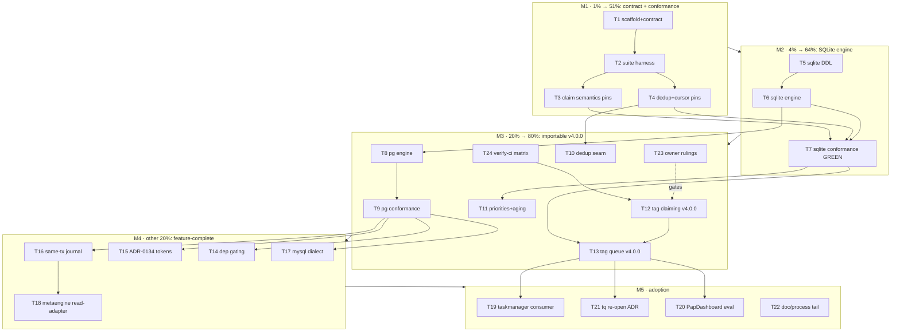

# SUPERB Plan — go-cqrs-lite to the max (durable work queue + adoption arc)

**Date:** 2026-09-14 12:45 CEST
**Trigger:** owner ruling — "I want to use go-cqrs-lite to the max that
makes sense!" (this answers the 2026-09-14 12-39 status report §g1:
queue/ P1 is GREEN-LIT; sequencing = build now, tag claiming in the same
train).
**Scope:** the cqrs-adoption arc ONLY — `queue/` assembly (P1–P5),
`claiming/` release, cross-repo adoption surfaces, and the doc/process
tail this arc owes. tq-internal work NOT about cqrs adoption (e.g. the
journal-drift audit, webui work) is OUT OF SCOPE here — it lives in tq's
TODO_LIST as pool food.
**Sources (all verified this arc):** tq `internal/queue` Store contract
(the spec donor, five weeks production dogfood); the 2026-09-13/14 max
sweep inventory (projectionhost, middleware retry+2×DLQ ADR-0043,
commandlifecycle ADR-0117, watermill, go-idempotency, ADR-0134 claim
tokens, claiming/ as landed extraction); 12-39 status report §f;
proposal `2026-09-13_durable-work-queue-module.md`.

## Guardrails (do not verschlimmbessern)

| #  | Rule                                                                                                                                                                                      | Why                                                |
| -- | ----------------------------------------------------------------------------------------------------------------------------------------------------------------------------------------- | -------------------------------------------------- |
| G1 | **Spec source of truth = tq's proven semantics.** Transcribe under a mirrored conformance suite; do NOT invent lifecycle shapes.                                                          | The whole value is upstreaming proof, not novelty. |
| G2 | **claiming/ stays a faithful extraction** (byte-pinned statements, zero speculative knobs — `And` was trimmed; `OrderBy` kept = it parameterized pre-existing SQL, owner may still veto). | Owner ruling 2026-09-14.                           |
| G3 | **New module ⇒ full ceremony in the same change** (go.work, flake testModules, api-stability slice + golden, module-map, references/modules.md, CHANGELOG, dep budgets).                  | AGENTS procedure; half-wired modules rot.          |
| G4 | **Every mutating store method emits its fact(s) in the SAME tx** when the journal option is on (P4) — the ADR-0001 lineage, upstreamed.                                                   | tq's load-bearing invariant.                       |
| G5 | **No collision with the command-side-depth plan (2026-09-13 11-45)** — that arc owns command/decider/commandlifecycle; this arc touches `queue/` + engines only.                          | Concurrent agents are active.                      |
| G6 | Cache env chain + `-tags "goexperiment.jsonv2"` + per-module `GOWORK=off` on every go command; api golden regen on any API change.                                                        | gowork-modes.md.                                   |
| G7 | Tags only via `scripts/tag-release.sh` / `batch-release.sh`, never lightweight, owner in the loop for the wave.                                                                           | Release process.                                   |

## Pareto breakdown

- **1% → 51%: the CONTRACT + CONFORMANCE SUITE.** Transcribing tq's
  Store semantics into `queue/` types plus a mirrored, engine-agnostic
  conformance suite. It transfers five weeks of production proof, makes
  every engine mechanical, and IS the parity bar tq's re-open ADR names.
  Without it everything downstream is unverified invention.
- **4% → 64%: + the SQLite engine.** Single-writer claims over
  claiming/ statements + lifecycle DDL, passing the suite. SQLite is
  tq's production dialect — this alone unblocks the dogfood-equality
  proof.
- **20% → 80%: + PG engine, dedup'd enqueue (go-idempotency seam),
  priorities(+aging), and the claiming tag wave.** The module becomes
  importable (v4.0.0) and covers tq's real feature set — external
  consumers (tq, PapDashboard) can start evaluating TODAY.
- **Other 20% → 100%:** deps gating, ADR-0134 tokens, same-tx journal
  option, MySQL dialect, metaengine read-adapter, taskmanager upgrade,
  PapDashboard evaluation, tq re-open ADR, doc/process tail, owner
  rulings.

## Table A — comprehensive plan (tasks 30–100 min, ALL arc todos, sorted)

Sorted by importance/impact/customer-value (rank), effort in minutes.

| Rank | ID  | Task                                                                                                         | Pareto | Impact   | Effort | Customer value                           | Depends       |
| ---- | --- | ------------------------------------------------------------------------------------------------------------ | ------ | -------- | ------ | ---------------------------------------- | ------------- |
| 1    | T1  | `queue/` scaffold + contract types (Task, Status state machine, Store interface, Claim)                      | 1%     | Critical | 60     | The API every consumer imports           | —             |
| 2    | T2  | Conformance suite harness + lifecycle transition pins                                                        | 1%     | Critical | 90     | The parity bar; makes engines mechanical | T1            |
| 3    | T3  | Conformance: fencing, expiry reclaim, attempts/backoff, DLQ                                                  | 1%     | Critical | 90     | Proves the claim semantics are tq's      | T2            |
| 4    | T4  | Conformance: dedup'd enqueue + watermark/cursor API stubs                                                    | 1%     | High     | 60     | Idempotency + journal-seam contracts     | T2            |
| 5    | T5  | SQLite engine: DDL + idempotent migrations + single-writer open                                              | 4%     | Critical | 60     | Production-dialect foundation            | T1            |
| 6    | T6  | SQLite engine: ClaimDue/Complete/Fail/Requeue/Cancel/Heartbeat                                               | 4%     | Critical | 90     | The store itself                         | T5, claiming/ |
| 7    | T7  | SQLite engine passes full conformance suite                                                                  | 4%     | Critical | 60     | The 64% milestone (M2)                   | T3, T4, T6    |
| 8    | T24 | cqrs `#verify-ci` full matrix over the claiming trim                                                         | 20%    | High     | 45     | Pre-tag insurance for everything below   | —             |
| 9    | T12 | Tag wave: cut `claiming` v4.0.0 (+pins, replace-strip, standalone builds)                                    | 20%    | High     | 60     | Makes P0 real on the proxy               | T24           |
| 10   | T8  | PG engine: DDL + SKIP LOCKED CTE claim + lifecycle                                                           | 20%    | High     | 90     | Second production dialect                | T6            |
| 11   | T9  | PG engine passes conformance (pgtestcontainer harness)                                                       | 20%    | High     | 60     | Mirrored-suite proof                     | T8            |
| 12   | T10 | Dedup'd enqueue via go-idempotency contract seam                                                             | 20%    | High     | 60     | Reuses the ecosystem primitive           | T4            |
| 13   | T11 | Priorities (+aging) in claim order + conformance pins                                                        | 20%    | High     | 90     | tq feature parity                        | T7            |
| 14   | T13 | Cut `queue/` v4.0.0 (golden, docs rows, CHANGELOG, tag)                                                      | 20%    | High     | 45     | The 80% milestone (M3): importable       | T7, T12       |
| 15   | T23 | Owner rulings batch (gci-vs-treefmt lint, OrderBy knob, rejection policy, wave timing)                       | other  | High     | 15     | Unblocks T12/T13 hygiene                 | —             |
| 16   | T14 | DAG dep gating: deps table + NOT EXISTS claims + conformance                                                 | other  | Med-High | 90     | tq parity (P3)                           | T9            |
| 17   | T15 | ADR-0134 claim tokens in queue/ (mint, predicates, theft detect)                                             | other  | Med-High | 90     | Correct ownership from day one           | T9            |
| 18   | T16 | Same-tx journal option (FactSink-in-tx, watermarks)                                                          | other  | Med-High | 90     | The ADR-0001 lineage upstreamed (P4)     | T9            |
| 19   | T17 | MySQL dialect engine (two-statement claims) + integration                                                    | other  | Medium   | 90     | Third dialect parity                     | T9            |
| 20   | T19 | example/taskmanager upgraded to a real queue consumer                                                        | other  | Medium   | 90     | The copy-paste on-ramp                   | T13           |
| 21   | T21 | tq re-open ADR: parity checklist + facade re-point spike                                                     | other  | High     | 90     | THE customer (tq) adoption decision (P5) | T13           |
| 22   | T18 | metaengine read-adapter (listing/projection over queue state)                                                | other  | Medium   | 90     | Dashboard-grade read side                | T16           |
| 23   | T20 | PapDashboard second-consumer evaluation (spike doc)                                                          | other  | Medium   | 45     | Consumer #2 validation                   | T13           |
| 24   | T22 | Doc/process tail: proposal phrasing, AGENTS go.work drift, rejection-rule encode, skill/doc rows per landing | other  | Medium   | 90     | Keeps the repo honest                    | rolling       |

## Table B — fine-grained breakdown (ALL tasks ≤12 min, sorted by rank then order)

| ID    | Micro-task                                                                             | Min | Parent |
| ----- | -------------------------------------------------------------------------------------- | --- | ------ |
| T1.1  | `queue/` dir + go.mod (module path, go 1.26.7, errorfamily dep)                        | 12  | T1     |
| T1.2  | go.work + flake testModules + api-stability modules slice                              | 12  | T1     |
| T1.3  | `task.go`: Task[T], Status enum, sentinel errors                                       | 12  | T1     |
| T1.4  | `status.go`: CanTransitionTo state machine (from tq internal/task)                     | 12  | T1     |
| T1.5  | `store.go`: Store contract (Enqueue/Claim/Heartbeat/Complete/Fail/Requeue/Cancel/List) | 12  | T1     |
| T1.6  | `claim.go`: Claim struct (owner, lease, token-ready) + options                         | 12  | T1     |
| T2.1  | conformance pkg skeleton: Suite + Run(store) driver                                    | 12  | T2     |
| T2.2  | lifecycle legal/illegal transition matrix pin                                          | 12  | T2     |
| T2.3  | enqueue→claim roundtrip pin                                                            | 12  | T2     |
| T2.4  | cooperative-cancel family contract + pin                                               | 12  | T2     |
| T2.5  | heartbeat/lease-extension pin                                                          | 12  | T2     |
| T2.6  | watermark/cursor API stub + pin                                                        | 12  | T2     |
| T2.7  | observability hooks (counters) pin                                                     | 12  | T2     |
| T2.8  | mirrored-suite registration pattern for engines                                        | 12  | T2     |
| T3.1  | fencing: concurrent claimers never overlap (stress)                                    | 12  | T3     |
| T3.2  | expiry reclaim re-opens crashed claim                                                  | 12  | T3     |
| T3.3  | attempts + NotBefore backoff ladder pin                                                | 12  | T3     |
| T3.4  | DLQ after max attempts + evidence pin                                                  | 12  | T3     |
| T3.5  | rescue/dismiss from DLQ pin                                                            | 12  | T3     |
| T3.6  | failure-evidence tail contract pin                                                     | 12  | T3     |
| T3.7  | claim order: stored priority never mutates pin                                         | 12  | T3     |
| T4.1  | dedup'd enqueue returns stored task unchanged                                          | 12  | T4     |
| T4.2  | cancelled/dead key still suppresses                                                    | 12  | T4     |
| T4.3  | no-key double enqueue allowed pin                                                      | 12  | T4     |
| T4.4  | go-idempotency contract alignment note + stub                                          | 12  | T4     |
| T4.5  | suite wiring into engine harness                                                       | 12  | T4     |
| T5.1  | schema const: tasks + indexes (lease, attempts, not_before)                            | 12  | T5     |
| T5.2  | migrate(): idempotent pragma-probe path                                                | 12  | T5     |
| T5.3  | Open/Close + MaxOpenConns(1) single-writer setup                                       | 12  | T5     |
| T5.4  | fixed-width RFC3339 time helpers                                                       | 12  | T5     |
| T5.5  | DDL test: fresh + legacy DB upgrade                                                    | 12  | T5     |
| T6.1  | Enqueue (+dedup ON CONFLICT)                                                           | 12  | T6     |
| T6.2  | ClaimDue: claiming-stmt shape + priority order                                         | 12  | T6     |
| T6.3  | Complete / Fail (in-tx evidence)                                                       | 12  | T6     |
| T6.4  | Requeue (NotBefore ladder) + Cancel                                                    | 12  | T6     |
| T6.5  | Heartbeat via claiming.RenewStmt                                                       | 12  | T6     |
| T6.6  | List/Filter read side                                                                  | 12  | T6     |
| T6.7  | module gates: GOWORK=off build/vet/test                                                | 12  | T6     |
| T7.1  | run suite, triage fallout (round 1)                                                    | 12  | T7     |
| T7.2  | fix cycle (round 2)                                                                    | 12  | T7     |
| T7.3  | fix cycle (round 3)                                                                    | 12  | T7     |
| T7.4  | fix cycle (round 4)                                                                    | 12  | T7     |
| T7.5  | suite green + record M2 evidence                                                       | 12  | T7     |
| T24.1 | run `nix run .#verify-ci` (matrix)                                                     | 12  | T24    |
| T24.2 | fix any fallout                                                                        | 12  | T24    |
| T24.3 | record matrix output as tag evidence                                                   | 12  | T24    |
| T12.1 | CHANGELOG/release-note check for claiming entry                                        | 12  | T12    |
| T12.2 | tag-release claiming v4.0.0 (script; owner in loop)                                    | 12  | T12    |
| T12.3 | push tag; bump pins (sqlstore, example)                                                | 12  | T12    |
| T12.4 | strip sibling replaces; standalone-build gate                                          | 12  | T12    |
| T12.5 | verify proxy resolution (`go get` probe)                                               | 12  | T12    |
| T8.1  | PG DDL + $N placeholder set                                                            | 12  | T8     |
| T8.2  | ClaimDue: SKIP LOCKED CTE (claiming shape)                                             | 12  | T8     |
| T8.3  | lifecycle methods parity                                                               | 12  | T8     |
| T8.4  | pgtestcontainer integration harness                                                    | 12  | T8     |
| T8.5  | module gates green                                                                     | 12  | T8     |
| T9.1  | run suite on PG, triage (round 1)                                                      | 12  | T9     |
| T9.2  | fix cycle (round 2)                                                                    | 12  | T9     |
| T9.3  | fix cycle (round 3)                                                                    | 12  | T9     |
| T9.4  | fix cycle (round 4)                                                                    | 12  | T9     |
| T9.5  | suite green + evidence                                                                 | 12  | T9     |
| T10.1 | seam design note (contract vs stored-task semantics)                                   | 12  | T10    |
| T10.2 | idempotency-backed dedup adapter                                                       | 12  | T10    |
| T10.3 | conformance pin through adapter                                                        | 12  | T10    |
| T10.4 | CHANGELOG + budget check                                                               | 12  | T10    |
| T10.5 | api golden regen                                                                       | 12  | T10    |
| T11.1 | aging constants in contract (single source)                                            | 12  | T11    |
| T11.2 | order expression in both engines                                                       | 12  | T11    |
| T11.3 | ordering conformance pin                                                               | 12  | T11    |
| T11.4 | clamp/provenance read fields                                                           | 12  | T11    |
| T11.5 | docs + golden                                                                          | 12  | T11    |
| T13.1 | api golden + TestEvery                                                                 | 12  | T13    |
| T13.2 | doc-check + references/modules.md row                                                  | 12  | T13    |
| T13.3 | module-map + FEATURES rows                                                             | 12  | T13    |
| T13.4 | CHANGELOG Added entry (cited symbols real)                                             | 12  | T13    |
| T13.5 | tag queue v4.0.0 + push                                                                | 12  | T13    |
| T23.1 | present rulings batch to owner (lint, OrderBy, policy, timing)                         | 12  | T23    |
| T14.1 | deps table DDL + migrations                                                            | 12  | T14    |
| T14.2 | NOT EXISTS predicate per dialect in claims                                             | 12  | T14    |
| T14.3 | enqueue dep validation                                                                 | 12  | T14    |
| T14.4 | completion unwires dependents                                                          | 12  | T14    |
| T14.5 | conformance: blocked-until-parent-done                                                 | 12  | T14    |
| T14.6 | cycle-rejection policy + test                                                          | 12  | T14    |
| T15.1 | adoption note: ADR-0134 tokens day one                                                 | 12  | T15    |
| T15.2 | token column + crypto/rand mint                                                        | 12  | T15    |
| T15.3 | renewal/finalize carry token predicate                                                 | 12  | T15    |
| T15.4 | theft detection error semantics                                                        | 12  | T15    |
| T15.5 | conformance pins (holder-only ops)                                                     | 12  | T15    |
| T15.6 | docs + golden                                                                          | 12  | T15    |
| T16.1 | capability interface: FactSink-in-tx                                                   | 12  | T16    |
| T16.2 | sqlite in-tx fact append                                                               | 12  | T16    |
| T16.3 | PG parity                                                                              | 12  | T16    |
| T16.4 | watermark/cursor API impl                                                              | 12  | T16    |
| T16.5 | conformance: no state change without fact                                              | 12  | T16    |
| T16.6 | docs (ADR-0001 lineage)                                                                | 12  | T16    |
| T17.1 | MySQL DDL (DATETIME(3))                                                                | 12  | T17    |
| T17.2 | two-statement claim via claiming MySQL helpers                                         | 12  | T17    |
| T17.3 | lifecycle methods                                                                      | 12  | T17    |
| T17.4 | nspawn integration run                                                                 | 12  | T17    |
| T17.5 | conformance green                                                                      | 12  | T17    |
| T19.1 | swap demo queue for queue/ store                                                       | 12  | T19    |
| T19.2 | async execution via queue worker loop                                                  | 12  | T19    |
| T19.3 | README + docs update                                                                   | 12  | T19    |
| T19.4 | integration tests green                                                                | 12  | T19    |
| T19.5 | cqrs-lint V006 golden refresh                                                          | 12  | T19    |
| T21.1 | parity checklist vs conformance suite                                                  | 12  | T21    |
| T21.2 | facade re-point spike in a tq branch                                                   | 12  | T21    |
| T21.3 | run tq conformance against upstream                                                    | 12  | T21    |
| T21.4 | journal migration sketch                                                               | 12  | T21    |
| T21.5 | ADR draft + verdict criteria                                                           | 12  | T21    |
| T18.1 | read-adapter design note (read side ONLY)                                              | 12  | T18    |
| T18.2 | projection folds over queue state                                                      | 12  | T18    |
| T18.3 | FilterSpec listing demo                                                                | 12  | T18    |
| T18.4 | bench sanity run                                                                       | 12  | T18    |
| T18.5 | docs + golden                                                                          | 12  | T18    |
| T20.1 | read PapDashboard queue usage                                                          | 12  | T20    |
| T20.2 | mapping doc                                                                            | 12  | T20    |
| T20.3 | gap list                                                                               | 12  | T20    |
| T20.4 | verdict note (adopt/wait)                                                              | 12  | T20    |
| T22.1 | fix proposal doc P0 phrasing (done + trim note)                                        | 12  | T22    |
| T22.2 | fix cqrs AGENTS go.work use-block drift                                                | 12  | T22    |
| T22.3 | encode rejection-propagation rule (tq AGENTS)                                          | 12  | T22    |
| T22.4 | per-landing skill/doc row checks                                                       | 12  | T22    |
| T22.5 | final arc status report + index row                                                    | 12  | T22    |

(125 micro-tasks; every one ≤12 min; total ≈ 25 h — four to five focused
days, or pool-parallelizable after M2.)

## Execution graph (mermaid)

## Milestones

- **M1 (1% → 51%)**: contract + suite exist; every future store is
  mechanical. Exit: T1–T4 green.
- **M2 (4% → 64%)**: SQLite engine passes the suite = dogfood-parity
  proof on tq's production dialect. Exit: T7 evidence recorded.
- **M3 (20% → 80%)**: claiming + queue tagged v4.0.0; module importable
  by tq/PapDashboard/taskmanager. Exit: T13.
- **M4 (other 20%)**: deps/tokens/journal/mysql — feature-complete vs
  tq. Exit: T14–T17 (+T18).
- **M5 (100%)**: consumers adopted or explicitly ruled out with
  evidence. Exit: T19–T21 + doc tail.

## Out of scope (explicitly)

tq journal-drift audit (live pool food, tq TODO_LIST); tq webui/fleet
work; cqrs command-side-depth arc (concurrent, G5); any tq facade
re-point before M3 parity evidence.
