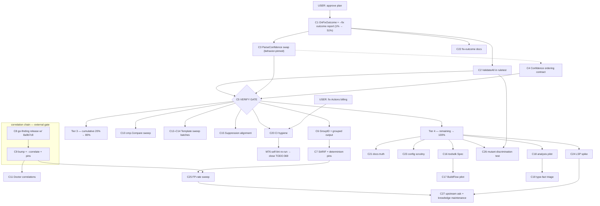

# SUPERB Plan: go-finding v1.10 Adoption in cqrs-lint (Pareto-Ranked)

> **STATUS (2026-09-17): EXECUTED.** C1–C7, C9–C17 (C17 pilot: BuildFlow
> blank-import recipe proven against dnsblockd), C18–C19 (verdict: no
> go/analysis pilot — no type-fact target, see IMPROVEMENT_IDEAS §Extended),
> C20 (codeable parts; M75/M76 remain user-gated on Actions billing), C21–C26
> DONE. C10 verified clean (zero subtraction comparators). C11 cancelled with
> C9's scope reduction (same-tool pairs never correlate). C9/C22/C24 shaped
> differently than planned (no --correlate flag; RULES.md is generated so
> docs live in README/flag help; LSP verdict GO on data, server deferred).
> Evidence: commits `debd4839e`..`dfc3cc492` + CHANGELOG [Unreleased]
> 2026-09-17 entry; upstream go-finding v1.11.0 cut (5 tags, preflight green,
> proxy-verified) and ask filed as go-finding#32.

**Created:** 2026-09-16 21:12 CEST
**Scope:** Execute the benefit analysis from `docs/status/archived/2026-09-16_21-05_go-finding-v1.10.0-benefit-analysis-cqrs-lint.md` — turn 8 verified-unadopted go-finding capabilities (50 candidate items) into an executable, impact-sorted plan for `cmd/cqrs-lint`.
**Method:** `pareto-planning` skill — 1%/4%/20% tiers, comprehensive plan (30–100 min tasks), micro plan (≤12 min tasks), execution graph.

---

## 0. Context (why this plan exists)

cqrs-lint already pins the **latest** go-finding release (`v1.10.0` + `pipeline v1.10.0`). The benefit is NOT a version bump — it is adopting capabilities already shipped but unused:

| Verified gap                                                    | Evidence                                                                                                                                                 |
| --------------------------------------------------------------- | -------------------------------------------------------------------------------------------------------------------------------------------------------- |
| `--fix` reports counts only; per-finding fix outcomes invisible | `run.go:368` never sets `pipeline.Config.OnFixOutcome` (`pipeline/config.go:42`); upstream itself flagged this as adoption item **L1-36** (issue #28 UX) |
| Rule tests assert counts, never validity                        | `pkg/ruletest/ruletest.go` — no `finding.ValidateAll`                                                                                                    |
| Hand-rolled confidence parser                                   | `filters.go:168-180` (`parseConfidence`) duplicates `finding.ParseConfidence` (v1.6)                                                                     |
| Multi-site rules emit ungrouped findings                        | No `GroupID` usage (v1.7/v1.8); e.g. C019 (multiple repositories per aggregate)                                                                          |
| Overlapping rules add noise                                     | IMPROVEMENT_IDEAS #25: C025 exists _because_ D006 is general — `CorrelateFindings` (`pipeline/config.go:47`) unused                                      |
| 171 raw `NewBuilder` sites                                      | No `finding.Template` (v1.6)                                                                                                                             |
| Type-fact rules impossible                                      | AST-walker only; `go-finding/analysis.AnalyzerDetector` bridge unused                                                                                    |
| Not a BuildFlow provider                                        | `toolsdk` (v1.10 headline) unused                                                                                                                        |

**Known external gates:** (1) correlation adoption must wait for a go-finding release carrying `8a9b7c8` (unreleased underflow fix in `correlateByProximity` — silently wrong sorts); (2) GitHub Actions billing is broken (TODO_LIST.md:366), blocking the self-lint re-run; (3) proxy fetch verified working 2026-09-16 (`GOWORK=off` → v1.10.0).

**VERSCHLIMMBESSERN guardrails (do-no-harm contract):**

- `nix run .#verify` after every code tier; `GOWORK=off` per-module tests for `cmd/cqrs-lint`.
- Behavior-pin tests BEFORE swapping implementations (parser swap must prove identical semantics).
- No go-finding API changes without its own repo gates; cqrs-lint dep additions go through `nix run .#check-arch` budget review.
- Auto-commit daemon runs — re-check `git status` immediately before every explicit commit; per-task commits.
- API-surface or skill-reference changes → update `.agents/skills/go-cqrs-lite/*` + run doc-check (zero-warning).

---

## 1. Pareto Breakdown

> Percentages are heuristic impact shares over the full item set (50 report items → 27 tasks → 101 micro-tasks), grounded in: user-visible frequency (`--fix` runs), upstream's own priority flags, and effort measured from source inspection. They are planning narrative, not measurements.

| Tier              | Cumulative effort | Cumulative result | Tasks                 | What                                                                                                                                                                                                                                                                                                    |
| ----------------- | ----------------- | ----------------- | --------------------- | ------------------------------------------------------------------------------------------------------------------------------------------------------------------------------------------------------------------------------------------------------------------------------------------------------- |
| **1%**            | ~4% of hours      | **~51%**          | C1                    | **OnFixOutcome wiring + `--fix` outcome report** — the only item upstream itself tracked (L1-36); touches the most-used surface; closes the biggest perceived gap with the smallest diff                                                                                                                |
| **4%**            | ~12%              | **~64%**          | C1–C4                 | + `ValidateAll` in ruletest (test-trust: kills invalid findings at test time) + `ParseConfidence` swap (deletes a reimplementation, behavior-pinned) + Confidence ordering contract check                                                                                                               |
| **20%**           | ~35%              | **~80%**          | C1–C15, C20, C22      | + GroupID output quality (C019 + grouped rendering + SARIF/determinism pins), correlation chain (release cut → bump → flag → regression pins → comparator sweep), Template sweep (consistency across 171 builder sites), suppression alignment, CI hygiene (billing→self-lint→canary), fix-outcome docs |
| **Remaining 80%** | 100%              | **100%**          | C16–C19, C21, C23–C27 | toolsdk/BuildFlow provider, `go/analysis` type-fact pilot + idea triage, docs truth (rule counts), pipeline config scrutiny, LSP spike, FP-rate measurement, discrimination-proof test, upstream `PipelineResult.FixOutcomes()` ask, knowledge maintenance                                              |

**Do-not-forget (the "other 80%"):** every item below Tier 3 is scheduled — nothing from the 50-item report is dropped; Tier 4 items are real but lower customer-visibility per hour.

---

## 2. Comprehensive Plan (27 tasks, 30–100 min each — ALL 50 items)

Sorted by importance/impact/effort/customer-value. "Covers" = item numbers from the 2026-09-16 status report §f.

| #   | Tier | Task                                                                                                                                                                                                                               | Covers             | Est  | Impact | CustValue           | Depends on     |
| --- | ---- | ---------------------------------------------------------------------------------------------------------------------------------------------------------------------------------------------------------------------------------- | ------------------ | ---- | ------ | ------------------- | -------------- |
| C1  | 1%   | Wire `pipeline.Config.OnFixOutcome` in `runPipeline`; render per-finding fix outcomes (applied/refused/conflict/failed + error) in `--fix` text output                                                                             | 1                  | 90m  | H      | H                   | user approval  |
| C2  | 4%   | Add `finding.ValidateAll` to `pkg/ruletest.RunDetector`; triage + fix any invalid findings it surfaces across all rule suites                                                                                                      | 2                  | 45m  | M-H    | H                   | —              |
| C3  | 4%   | Behavior-pin table test, then swap `filters.go parseConfidence` → `finding.ParseConfidence`; delete old parser                                                                                                                     | 3, 35              | 45m  | M      | M                   | —              |
| C4  | 4%   | Verify `finding.Confidence` ordering contract (`>=` filter semantics); assert in test; note in RULES.md                                                                                                                            | 47                 | 30m  | L-M    | M                   | —              |
| C5  | gate | Verification gate: `GOWORK=off` module tests + `nix run .#verify` over C1–C4                                                                                                                                                       | 4                  | 90m  | H      | H                   | C1–C4          |
| C6  | 20%  | GroupID audit across rules → stamp C019 (multi-repository) → grouped text + markdown via `Report.GroupFindingsSorted` → golden test                                                                                                | 9, 10              | 90m  | M      | M-H                 | C5             |
| C7  | 20%  | SARIF group-property round-trip test + byte-identical JSON/SARIF determinism tests (pin inherited `json.Deterministic`)                                                                                                            | 11, 12             | 60m  | M      | H                   | C6             |
| C8  | 20%  | Cut go-finding release carrying correlate underflow fix `8a9b7c8` (bump, CHANGELOG, preflight, 5 tags, push, proxy verify)                                                                                                         | 13                 | 60m  | H      | M                   | —              |
| C9  | 20%  | Bump cqrs-lint to that release; add `--correlate` flag → `CorrelateFindings`; sentinel-line ordering regression pin; correlations in JSON output; smoke run                                                                        | 14, 15             | 100m | M-H    | M                   | C8             |
| C10 | 20%  | `cmp.Compare` sweep: find subtraction-style comparators in cqrs-lint (the `8a9b7c8` bug class), fix + test                                                                                                                         | 16                 | 45m  | M      | M                   | C5             |
| C11 | 20%  | Doctor: render `PipelineResult.Correlations` for correlation-aware triage                                                                                                                                                          | 17                 | 30m  | L-M    | M                   | C9             |
| C12 | 20%  | Template exemplar rule + sweep batch 1: correctness + api rule files                                                                                                                                                               | 21a                | 100m | M      | M                   | C5             |
| C13 | 20%  | Template sweep batch 2: boilerplate + consistency                                                                                                                                                                                  | 21b                | 100m | M      | M                   | C12            |
| C14 | 20%  | Template sweep batch 3: architecture, security, performance, version, testing, adoption, testrules; standardize severity/confidence meta; delete dead helpers                                                                      | 21c, 22, 23        | 100m | M      | M                   | C13            |
| C15 | 20%  | Cross-check `pkg/suppression` validation vs go-finding's suppression rules (split-brain); map `in-review`/expiry; converge-or-document decision + implementation                                                                   | 24, 25, 26         | 90m  | M      | M-H                 | C5             |
| C16 | 80%  | `toolsdk.Spec` for cqrs-lint (Detect; Repair only for safe-fixable rules) + discovery tests                                                                                                                                        | 18                 | 100m | M      | M-H                 | C5             |
| C17 | 80%  | BuildFlow pilot: wire provider in one power-user consumer repo; run loop; README recipe                                                                                                                                            | 19, 20             | 90m  | M      | H (BuildFlow users) | C16            |
| C18 | 80%  | `go-finding/analysis` dep (check-arch budget) + `AnalyzerDetector` pilot type-fact rule + golden test                                                                                                                              | 5, 6               | 100m | M-H    | M                   | C5             |
| C19 | 80%  | Triage IMPROVEMENT_IDEAS parked ideas for type-fact candidates; document AST-walker vs go/analysis rule-split convention                                                                                                           | 7, 8               | 45m  | M      | M                   | C18            |
| C20 | 20%  | CI hygiene: (user) fix Actions billing → re-run self-lint leg → close TODO:369; go-finding version in `--version`; pin-sweep entry; weekly canary vs go-finding@master                                                             | 27, 28, 29, 30, 31 | 90m  | H      | H                   | billing (user) |
| C21 | 80%  | Docs truth: re-count rules, reconcile RULES.md ↔ IMPROVEMENT_IDEAS header (single source of truth); doc-check explicitly over TODO_LIST.md                                                                                         | 32, 33, 35         | 60m  | L-M    | M                   | —              |
| C22 | 20%  | Document `--fix` outcome reporting in README + RULES.md                                                                                                                                                                            | 34                 | 30m  | L-M    | M                   | C1             |
| C23 | 80%  | Pipeline config scrutiny: `MaxIterations=5` evidence; Timeout/GracefulDegradation docs; ConfigFile parity eval; `--fix` path-traversal safety test; detector-timing gate from MetricsSnapshot; `--trace` flag                      | 36–41              | 100m | L-M    | M                   | C5             |
| C24 | 80%  | LSP spike: convert cqrs-lint report via `ToLSP`; round-trip test; go/no-go decision note                                                                                                                                           | 42, 43             | 90m  | L      | M (editor users)    | C5             |
| C25 | 80%  | FP-rate sweep harness on the 45-consumer corpus; baseline run; post-correlate delta report                                                                                                                                         | 45                 | 100m | H      | H                   | C9             |
| C26 | 80%  | Discrimination-proof test: deliberately broken (mutant) rule must fail the suite; wire permanently                                                                                                                                 | 46                 | 60m  | M      | H (test trust)      | C2             |
| C27 | 80%  | Upstream ask in go-finding: expose `FixOutcomes` on `PipelineResult` (today: callback or metric counts only); update `.agents/skills/go-cqrs-lite` refs + SKILL.md; doc-check; annotate status report + this plan with DONE stamps | 48, 49, 50         | 90m  | M      | M                   | as items land  |

**Coverage check:** report items 1–50 → C1(1) C2(2) C3(3,35) C4(47) C5(4) C6(9,10) C7(11,12) C8(13) C9(14,15) C10(16) C11(17) C12–14(21,22,23) C15(24,25,26) C16(18) C17(19,20) C18(5,6) C19(7,8) C20(27–31) C21(32,33,35) C22(34) C23(36–41) C24(42,43) C25(45) C26(46) C27(48,49,50). **All 50 covered.**

---

## 3. Micro Plan (101 tasks, max 12 min each — ALL todos)

Sorted in execution (impact) order; `Parent` = comprehensive task.

| ID   | Task                                                                          | ≤min | Parent |
| ---- | ----------------------------------------------------------------------------- | ---- | ------ |
| M01  | Read `pipeline/fix_outcome.go` + `config.go` OnFixOutcome contract            | 8    | C1     |
| M02  | Add outcome collector + `OnFixOutcome` callback in `runPipeline`              | 10   | C1     |
| M03  | Render per-finding outcomes in `--fix` text summary (file, rule, status, err) | 12   | C1     |
| M04  | Test: applied outcome printed; exit code unchanged                            | 12   | C1     |
| M05  | Test: conflict/failed/refused outcomes printed verbatim                       | 12   | C1     |
| M06  | Test: DryRun emits no outcomes                                                | 8    | C1     |
| M07  | Run `cmd/cqrs-lint` test suite                                                | 10   | C1     |
| M08  | Add `finding.ValidateAll` call in `ruletest.RunDetector`                      | 8    | C2     |
| M09  | Run all rule suites; list invalid-finding offenders                           | 12   | C2     |
| M10  | Fix offenders batch 1                                                         | 12   | C2     |
| M11  | Fix offenders batch 2 / confirm clean                                         | 12   | C2     |
| M12  | Diff `finding.ParseConfidence` vs old `parseConfidence` semantics             | 10   | C3     |
| M13  | Behavior-pin table test (named levels, decimals, "", bogus)                   | 12   | C3     |
| M14  | Swap to `finding.ParseConfidence`; delete old func                            | 8    | C3     |
| M15  | `filters_test` + module tests                                                 | 10   | C3     |
| M16  | Verify Confidence ordering contract in go-finding source/docs; note RULES.md  | 12   | C4     |
| M17  | Assert ordering semantics in filter test                                      | 10   | C4     |
| M18  | Kick off `nix run .#verify` (quiet-window check, background)                  | 10   | C5     |
| M19  | Monitor + triage failures                                                     | 12   | C5     |
| M20  | Re-run affected module tests `GOWORK=off`                                     | 12   | C5     |
| M21  | Grep rules for multi-finding emissions; candidate list                        | 12   | C6     |
| M22  | Design group-ID scheme; stamp GroupID in C019                                 | 12   | C6     |
| M23  | Grouped text rendering via `GroupFindingsSorted`                              | 12   | C6     |
| M24  | Grouped markdown rendering                                                    | 10   | C6     |
| M25  | Golden test: grouped text + markdown                                          | 12   | C6     |
| M26  | Run output tests                                                              | 8    | C6     |
| M27  | SARIF group-property round-trip test                                          | 12   | C7     |
| M28  | Byte-identical JSON determinism test                                          | 12   | C7     |
| M29  | Byte-identical SARIF determinism test                                         | 12   | C7     |
| M30  | Run output test suite                                                         | 8    | C7     |
| M31  | go-finding: version bump + CHANGELOG for correlate fix                        | 12   | C8     |
| M32  | go-finding: release-preflight + 5 tags                                        | 12   | C8     |
| M33  | Push tags; verify proxy propagation (`go list -m @new`)                       | 12   | C8     |
| M34  | Bump cqrs-lint go.mod to release; tidy; build                                 | 12   | C9     |
| M35  | Add `--correlate` flag + `CorrelateFindings` wiring                           | 12   | C9     |
| M36  | Sentinel-line ordering regression pin test                                    | 12   | C9     |
| M37  | Surface Correlations in JSON output                                           | 12   | C9     |
| M38  | Correlate smoke run on testdata corpus                                        | 12   | C9     |
| M39  | Grep cqrs-lint for subtraction-style comparators                              | 12   | C10    |
| M40  | Fix hits with `cmp.Compare` + tests                                           | 12   | C10    |
| M41  | Test suite run                                                                | 10   | C10    |
| M42  | Render Correlations in doctor output                                          | 12   | C11    |
| M43  | Doctor golden test update                                                     | 10   | C11    |
| M44  | Design Template pattern; migrate one exemplar rule                            | 12   | C12    |
| M45  | Migrate correctness c001–c010                                                 | 12   | C12    |
| M46  | Migrate correctness c011–c020                                                 | 12   | C12    |
| M47  | Migrate correctness c021–c030                                                 | 12   | C12    |
| M48  | Migrate correctness c031–c042 + rules.go                                      | 12   | C12    |
| M49  | Migrate api a001–a017                                                         | 12   | C12    |
| M50  | Migrate api a018–a034                                                         | 12   | C13    |
| M51  | Migrate boilerplate b001–b028                                                 | 12   | C13    |
| M52  | Migrate consistency d001–d019                                                 | 12   | C13    |
| M53  | Migrate architecture + security                                               | 12   | C14    |
| M54  | Migrate performance + version                                                 | 12   | C14    |
| M55  | Migrate testing(T) + adoption(F) + testrules                                  | 12   | C14    |
| M56  | Standardize severity/confidence defaults in rule meta                         | 12   | C14    |
| M57  | Delete dead builder helpers; run all suites                                   | 12   | C14    |
| M58  | Diff `pkg/suppression` validation vs go-finding's                             | 12   | C15    |
| M59  | in-review / expiry parity check                                               | 12   | C15    |
| M60  | Decision note: converge or document divergence                                | 12   | C15    |
| M61  | Implement alignment decision                                                  | 12   | C15    |
| M62  | Suppression test suite run                                                    | 10   | C15    |
| M63  | Read toolsdk Spec contract + example providers                                | 12   | C16    |
| M64  | Implement cqrs-lint Spec (Detect) + init registration                         | 12   | C16    |
| M65  | Spec test + `All()` discovery test                                            | 12   | C16    |
| M66  | Repair capability for safe-fixable rules only                                 | 12   | C16    |
| M67  | Pick pilot consumer repo; wire provider                                       | 12   | C17    |
| M68  | Run BuildFlow run/fix/verify loop in pilot                                    | 12   | C17    |
| M69  | README recipe for BuildFlow wiring                                            | 12   | C17    |
| M70  | Add `go-finding/analysis` dep; `nix run .#check-arch` budget check            | 12   | C18    |
| M71  | Implement pilot `AnalyzerDetector` rule                                       | 12   | C18    |
| M72  | Golden test for pilot rule                                                    | 12   | C18    |
| M73  | Triage IMPROVEMENT_IDEAS for type-fact candidates                             | 12   | C19    |
| M74  | Document rule-split convention (walker vs go/analysis)                        | 8    | C19    |
| M75  | (USER) Fix GitHub Actions billing                                             | user | C20    |
| M76  | Re-run self-lint CI leg; verify proxy fetch                                   | 12   | C20    |
| M77  | Close/annotate TODO_LIST:369 with outcome                                     | 6    | C20    |
| M78  | go-finding version in `--version` output + test                               | 12   | C20    |
| M79  | Add go-finding to pin-sweep inventory                                         | 12   | C20    |
| M80  | Weekly canary workflow vs go-finding@master                                   | 12   | C20    |
| M81  | Re-count rules; reconcile vs RULES.md                                         | 12   | C21    |
| M82  | Refresh IMPROVEMENT_IDEAS header; RULES.md = source of truth                  | 12   | C21    |
| M83  | doc-check explicitly over TODO_LIST.md                                        | 8    | C21    |
| M84  | README/RULES: document `--fix` outcome reporting                              | 12   | C22    |
| M85  | MaxIterations=5 evidence check from iteration data                            | 12   | C23    |
| M86  | Document Timeout/GracefulDegradation choices                                  | 8    | C23    |
| M87  | ConfigFile parity evaluation note                                             | 12   | C23    |
| M88  | `--fix` path-traversal safety test (ResolveSafePath inheritance)              | 12   | C23    |
| M89  | Detector-timing regression gate from MetricsSnapshot                          | 12   | C23    |
| M90  | `--trace` FlightRecorder flag + smoke test                                    | 12   | C23    |
| M91  | ToLSP spike on a cqrs-lint report                                             | 12   | C24    |
| M92  | Round-trip test; go/no-go decision note                                       | 12   | C24    |
| M93  | FP sweep harness script on consumer corpus                                    | 12   | C25    |
| M94  | Baseline sweep run + record rates                                             | 12   | C25    |
| M95  | Post-correlate sweep + delta report                                           | 12   | C25    |
| M96  | Break one rule deliberately; assert suite fails                               | 12   | C26    |
| M97  | Restore; wire as permanent discrimination test                                | 12   | C26    |
| M98  | File go-finding issue: `PipelineResult.FixOutcomes()` accessor                | 12   | C27    |
| M99  | Update `.agents/skills/go-cqrs-lite` refs + SKILL.md                          | 12   | C27    |
| M100 | doc-check zero-warning run                                                    | 12   | C27    |
| M101 | Annotate status report + this plan with DONE stamps                           | 12   | C27    |

---

## 4. Execution Graph

**External gates:** user approval → C1; go-finding release (C8) → correlation chain; Actions billing (user) → CI hygiene.

---

## 5. Risks & mitigations

| Risk                                                 | Mitigation                                                                                                                   |
| ---------------------------------------------------- | ---------------------------------------------------------------------------------------------------------------------------- |
| Parser swap changes behavior subtly                  | M13 pin test BEFORE M14 swap; golden diffs                                                                                   |
| Template sweep touches 100+ files                    | Batches M45–M55 with suite runs per batch; mechanical, reviewable per category                                               |
| Correlation adopted against buggy master             | Hard gate: only after C8 release carrying `8a9b7c8`                                                                          |
| New deps break module isolation                      | `nix run .#check-arch` at M70; go.mod per-module isolation preserved                                                         |
| Daemon absorbs mid-phase edits into `chore:` commits | Commit per task immediately after each comprehensive task (explicit commits authorized)                                      |
| Verify gate blocked by load                          | `nix run .#verify` is quiet-window-gated; fall back to per-module `GOWORK=off` tests + lint, run full verify when load drops |

---

_Evidence base: `docs/status/archived/2026-09-16_21-05_go-finding-v1.10.0-benefit-analysis-cqrs-lint.md` (all file:line citations verified 2026-09-16). Plans are point-in-time — re-verify claims before acting (status-report §50)._
