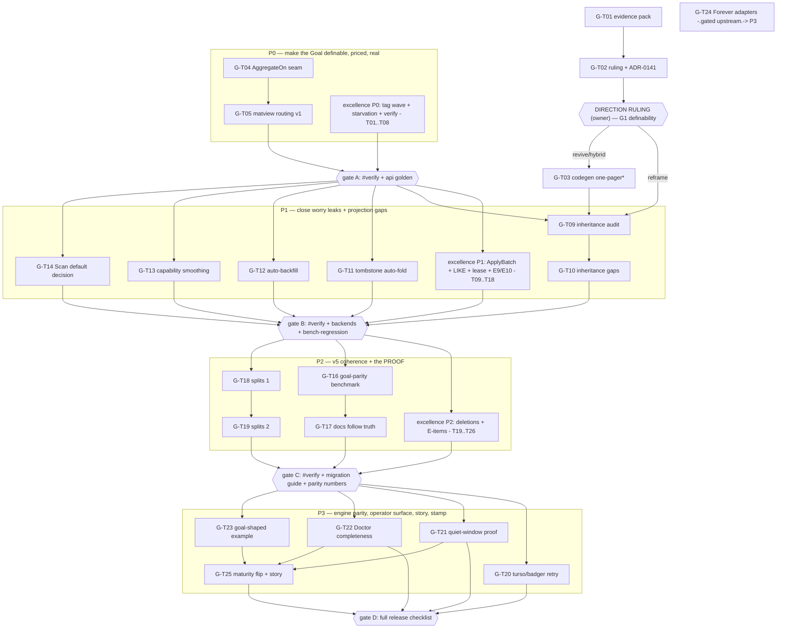

# SUPERB — metaengine Goal Closure (Pareto Plan)

- **Date:** 2026-09-17 05:49 CEST
- **The Goal being closed** (AGENTS.md north star, verbatim): _"Developers declare ONLY Commands + Events + Queries and their relationships. We should be able to build superb projections (materialized views) and developers never need to worry about anything else, while where data lives is up to operators at DEPLOYMENT time."_
- **Companion plan:** [`archived/2026-09-16_21-05_SUPERB-metaengine-system-excellence-pareto-plan.md`](archived/2026-09-16_21-05_SUPERB-metaengine-system-excellence-pareto-plan.md) — the reliability/release/v5-coherence train. THIS plan closes the **Goal gap** measured at ~55–60% consumer-experienced (distance analysis 2026-09-17). Shared items are cross-referenced by that plan's T-numbers — never duplicated as second markable rows.
- **Coverage note (honest, fixing the previous plan's D1):** ALL TODO_LIST sections have now been read, including the three previously unread ones (cqrs-lint, CI/Infrastructure, Code Quality). Vision-relevant rows found there are included; the rest (lint internals, CI billing, file-size policy) are referenced only where they gate proof.
- **Anti-Verschlimmbesserung contract:** same as the excellence plan — warn-first v4.x, api-golden-same-edit, gates per phase, owner-gated rows never executed unilaterally, and above all: **no revival of deprecated machinery without a ruling** (the `Infer` deprecation exists for a documented reason; undoing it casually IS the Verschlimmbesserung this plan guards against).

## 0. The Goal as testable claims + current distance

| #  | Claim (from the Goal sentence)                                | Distance                           | Ground truth (verified this session)                                                                                                                                                                                                                                                                                                                                                                                                                                         |
| -- | ------------------------------------------------------------- | ---------------------------------- | ---------------------------------------------------------------------------------------------------------------------------------------------------------------------------------------------------------------------------------------------------------------------------------------------------------------------------------------------------------------------------------------------------------------------------------------------------------------------------- |
| G1 | Developers declare ONLY Commands+Events+Queries+relationships | ~70%, **with a direction retreat** | `Infer`/`InferFromNamedEvents` — the Layer-1 auto-generation — are **Deprecated, removed at v5** (`fold_inference.go:58`: "hides projection semantics"); ADR-0116 steers production to explicit folds. Meanwhile `system`'s newer surface already declares `Evolutions` (fold once) + `Projections` (Lookup/QuerySet/Count/RawQuery) with **fold inheritance by result type** (`config_types.go:36-39`) — a pragmatic "declare once, wire everything" that is NOT deprecated |
| G2 | WE build superb projections                                   | ~55%                               | Planned tables, matviews (scalar exact, grouped upstream-blocked), 12 engines + EngineResetter; but ApplyBatch non-atomic, no LIKE pushdown, no auto-backfill, planner cannot price matview coverage (no `AggregateOn` seam)                                                                                                                                                                                                                                                 |
| G3 | Developers never worry about anything else                    | ~40%                               | Capability ladder leaks (ADTSet degraded pg/mysql), registration-before-data (no-backfill contract), pragma tuning, silent limits (Scan-100 now documented, default still truncates)                                                                                                                                                                                                                                                                                         |
| G4 | Operators own placement at DEPLOYMENT time                    | ~90% — the strongest pillar        | Cost planner + live calibration + health quarantine/CatchUp (ADR-0137) + `RegisterDriver` + operator layout planning (ADR-0124 Layer 4)                                                                                                                                                                                                                                                                                                                                      |
| G5 | …and it is SHIPPED                                            | ~30%                               | FEATURES: whole Metaengine section 🧪 EXPERIMENTAL; best work untagged (system v4.7.0 latest)                                                                                                                                                                                                                                                                                                                                                                                |

**The one-sentence diagnosis:** the Goal's infrastructure pillars (G4, G2-core) are nearly built, but its signature claim (G1 "ONLY") is currently _deprecated_, and its proof (G5 + parity with hand-rolled) doesn't exist yet. Closing the Goal is **one ruling + one routing seam + the excellence plan's P0/P1 + proof**, not a research moonshot.

## 1. Pareto Breakdown

### The 1% that delivers 51% — "Make the Goal DEFINABLE, PRICED, and REAL"

1. **The Direction Ruling (G1):** decide, with an evidence pack, between (a) **Reframe** — the Goal's "ONLY" means _declare Evolutions + Queries once; system wires projections_ (the non-deprecated `system` surface; `Infer` stays dead, ADR-0116 amended); (b) **Revive** — re-commit to Layer-1 inference as production-grade, but compile-time/visible (cqrs-gen codegen or `go:generate`-checked folds) so the auditability objection that killed runtime `Infer` is answered; (c) **Hybrid** — Reframe by default, codegen path for CRUD-shaped views as an opt-in. Everything else in G1 hangs on this. _My recommendation, argued from evidence: (c) Hybrid — the `system` surface is already 80% of (a), and codegen answers the only documented objection to (b)._
2. **`AggregateOn(fn, column, group)` planner seam + matview routing v1** (excellence-plan T26, elevated to vision-critical here): until the planner prices covered shapes O(1), "we build superb projections" is storage, not intelligence — the Goal says WE build them, i.e. the system chooses the materialization.
3. **Ship it** (excellence-plan P0/T01–T04, referenced): an unreleased Goal is 0% closed no matter the code.

### The 4% that delivers 64% — "Close the worry leaks and the projection gaps"

4. ApplyBatch atomicity + LIKE/contains pushdown (excellence-plan T09–T15, referenced — they ARE Goal items G2/G3).
5. **Auto-projection completion on the ruled surface:** Evolution-fold-inheritance coverage audit (which projection shapes inherit vs hand-wire), tombstone auto-fold (ADR-0114 wired into auto-projection), planned-table **auto-backfill option** (registration-before-data is a developer worry).
6. **Capability smoothing:** ADTSet on pg/mysql (or loud Doctor-first degraded contract on every query plan) so "operators pick any engine" never breaks a declared query.

### The 20% that delivers 80% — "v5 coherence + the proof"

7. The excellence plan's P2 (deletions, NewStreamRef, E-items — referenced): `system` must be THE root in truth for "operators reconcile config" to be single-surfaced.
8. **Goal-parity benchmark program:** tuned metaengine/planned-tables vs hand-rolled fold and hand-rolled SQL (CV's four-tier harness class, both sides tuned, parity-gated). The Goal's proof point: _hand-rolled buys nothing perceivable_. Includes flipping the readmodels tier-table guidance if the numbers say so.
9. Metaengine core file splits (store 940, typed_reader 1127, execute 778) — the smart core must stay maintainable while it absorbs the above.

### The other 20% to reach 100% — "engine parity, operator surface, story, stamp"

10. Engine reliability parity tail: turso/badger contention-retry review (the dgraph treatment), dgraph+redis shuffled-CI watch, quiet-window composed `#verify` + `metaengine -race` GREEN.
11. Operator surface completeness: Doctor/Explain sections for every new capability (batch mode, coverage routing, backfill status), ADR-0139 encryption ruling (owner-gated), lease story (excellence-plan T12–T13, referenced).
12. **The Goal told end-to-end:** one example repo (`example/goal-shaped-app`) + skill `core.md` §"The Goal in 5 minutes" — declare types, swap engines via config, show Doctor choosing. Docs are how a Goal becomes a promise.
13. Go 1.27 wave (own wave, referenced) + FEATURES maturity flip 🧪→✅ for the closed surface, earned not declared.
14. Forever adapters when upstream ships (excellence-plan T16, referenced) — the idempotency layer of "never worry".

### Owner-gated (listed, never unilaterally executed)

The Direction Ruling itself · ADR-0139 encryption (4 questions) · turso DSN strictness + sync decision + upstream filings · dgraph one-RPC · grouped-matview routing (upstream defect A) · 350-line policy ratification · CI cache-backend migration (needed for remotely-visible proof) · F040 branch protection.

## 2. Comprehensive Plan — medium granularity (10–30 min per task)

Sorted by importance (Goal-closure leverage × customer value) then effort. `[X-plan Tnn]` = cross-reference to the excellence plan (execute there, verify here); all other tasks are new and get TODO_LIST rows.

| #     | Task                                                                                                                                                                                                                                              | Goal claim  | Impact   | Effort | Phase |
| ----- | ------------------------------------------------------------------------------------------------------------------------------------------------------------------------------------------------------------------------------------------------- | ----------- | -------- | ------ | ----- |
| G-T01 | **Evidence pack for the Direction Ruling**: audit `system` Evolution-fold-inheritance coverage vs Infer's old coverage vs CV's actual declared shape; write the 3-option decision memo (reframe/revive-via-codegen/hybrid) with my recommendation | G1          | Critical | 30m    | P0    |
| G-T02 | **Direction Ruling session** (owner decides; ADR-0141 draft whichever way) + AGENTS.md Goal sentence amended to the ruled meaning if reframed                                                                                                     | G1          | Critical | 30m    | P0*   |
| G-T03 | If REVIVE/HYBRID: `cqrs-gen` (or `go:generate`) design one-pager — compile-time fold generation from types, visible+auditable output, `Infer` stays dead                                                                                          | G1          | Critical | 30m    | P0*   |
| G-T04 | `AggregateOn(fn, col, group)` seam design (excellence T26) + implementation on QueryDecl                                                                                                                                                          | G2          | Critical | 30m    | P0    |
| G-T05 | Matview routing v1: scalar-covered shapes priced O(1); grouped stays O(N) + Doctor note (upstream defect A)                                                                                                                                       | G2/G4       | Critical | 30m    | P0    |
| G-T06 | Ship it: excellence-plan T01–T04 (tag wave + smoke) — referenced, gate for everything                                                                                                                                                             | G5          | Critical | [X]    | P0    |
| G-T07 | ApplyBatch atomicity SQL+memory+bench (excellence T09–T11) — referenced                                                                                                                                                                           | G2          | Critical | [X]    | P1    |
| G-T08 | FilterContains/Prefix enum + pushdown ×4 dialects (excellence T14–T15) — referenced                                                                                                                                                               | G2/G3       | High     | [X]    | P1    |
| G-T09 | **Evolution-inheritance coverage audit:** enumerate projection declaration shapes (Lookup/QuerySet/Count/RawQuery) vs what inherits folds today; table the gaps                                                                                   | G1          | High     | 30m    | P1    |
| G-T10 | Close the top inheritance gaps found by G-T09 (per-gap slice, warn-first)                                                                                                                                                                         | G1          | High     | 30m    | P1    |
| G-T11 | **Tombstone auto-fold:** type-driven `Remove` wired into auto-projection (ADR-0114 × ADR-0116) with tests                                                                                                                                         | G1/G2       | High     | 30m    | P1    |
| G-T12 | **Planned-table auto-backfill option** (`WithBackfillOnRegister` or plan-time explicit): registration-before-data stops being a developer worry; Doctor shows backfill state                                                                      | G3          | High     | 30m    | P1    |
| G-T13 | **Capability smoothing pass 1:** ADTSet parity on pg/mysql (meta_set DDL + SetContains) OR every-query Doctor-first degraded warning — decide by effort probe                                                                                     | G3/G4       | High     | 30m    | P1    |
| G-T14 | **Scan default v5 decision:** documented-100 (status quo, now loud) vs unbounded default — breaking window is the v5 cut                                                                                                                          | G3          | Medium   | 30m    | P1    |
| G-T15 | Excellence-plan P2 deletions + NewStreamRef + E-items (T19–T25) — referenced; `system` THE root                                                                                                                                                   | G1/G4       | High     | [X]    | P2    |
| G-T16 | **Goal-parity benchmark:** tuned planned-tables vs hand-rolled fold vs hand-rolled SQL (CV harness class, parity gate first — excellence T27/M101–M102 build the gate)                                                                            | G2 proof    | Critical | 30m    | P2    |
| G-T17 | Readmodels tier-table + `core.md` decision matrix updated from G-T16 numbers (docs follow truth, always)                                                                                                                                          | G2          | High     | 30m    | P2    |
| G-T18 | Metaengine core splits wave 1: `typed_reader.go` 1127 → reader/scan/page files (gate: file-size ratchet)                                                                                                                                          | quality     | Medium   | 30m    | P2    |
| G-T19 | Core splits wave 2: `store.go` 940, `execute.go` 778                                                                                                                                                                                              | quality     | Medium   | 30m    | P2    |
| G-T20 | Engine reliability parity: turso/badger contention-retry review (dgraph treatment)                                                                                                                                                                | G2          | Medium   | 30m    | P3    |
| G-T21 | Quiet-window proof: composed `#verify` GREEN + `metaengine -race` + dgraph/redis shuffled-watch closeout                                                                                                                                          | G5          | High     | 30m    | P3    |
| G-T22 | Doctor/Explain completeness sweep: batch mode, coverage routing, backfill status, capability gaps — every new surface visible to operators                                                                                                        | G4          | High     | 30m    | P3    |
| G-T23 | **`example/goal-shaped-app`** + `core.md` "The Goal in 5 minutes": declare types → operator swaps engines in config → Doctor shows the planner choosing — compile-gated recipe                                                                    | G1/G4 story | High     | 30m    | P3    |
| G-T24 | Forever adapters + overflow pin (excellence T16, upstream-gated) — referenced                                                                                                                                                                     | G3          | High     | [X]    | P3g   |
| G-T25 | FEATURES maturity flip for the closed surface (🧪→✅ with evidence links) + CHANGELOG + release notes telling the Goal story                                                                                                                      | G5          | High     | 30m    | P3    |

\* P0* = depends on the ruling; if the owner rules REFRAME, G-T03 collapses to a doc note and G-T09–T11 absorb the effort.

## 3. Micro Breakdown — ≤12 min per task (78 micro tasks)

| Group | Micro tasks (each ≤12m)                                                                                                                                                                                                                   |
| ----- | ----------------------------------------------------------------------------------------------------------------------------------------------------------------------------------------------------------------------------------------- |
| G-T01 | R01 inventory Infer's old coverage (ADR-0116 §Impl + tests) · R02 inventory system inheritance surface (config_types, projection_builder) · R03 map CV's declared shape onto both · R04 write decision memo w/ 3 options + recommendation |
| G-T02 | R05 owner session (bring memo) · R06 ADR-0141 draft per ruling · R07 amend AGENTS.md Goal + ADR-0116 status addendum                                                                                                                      |
| G-T03 | R08 cqrs-gen spike scope (input types → generated folds file) · R09 generated-code auditability pattern (diffable, tested) · R10 one-pager + integration point with system DomainConfig                                                   |
| G-T04 | R11 QueryDecl aggregate-spec field design · R12 planner cost hook reads spec (ReadAggregate) · R13 unit tests: spec visible at Plan time · R14 Doctor renders declared aggregates                                                         |
| G-T05 | R15 matview coverage match (spec ↔ MaterializedViewSpec) · R16 scalar→O(1) cost rule + plan test · R17 grouped→O(N) + Doctor note · R18 routing integration test across 2 engines                                                         |
| G-T06 | (execute as excellence-plan M01–M16 — referenced)                                                                                                                                                                                         |
| G-T07 | (excellence-plan M32–M42 — referenced)                                                                                                                                                                                                    |
| G-T08 | (excellence-plan M50–M56 — referenced)                                                                                                                                                                                                    |
| G-T09 | R19 enumerate declaration shapes from tests/examples · R20 test-matrix: which inherit folds today · R21 gap table + severity ordering                                                                                                     |
| G-T10 | R22–R25 one gap per slice: implement + test + doc note (4 slices reserved)                                                                                                                                                                |
| G-T11 | R26 tombstone-type → Remove mapping in auto-projection · R27 rebirth handling · R28 tests incl. taskmanager example · R29 CHANGELOG                                                                                                       |
| G-T12 | R30 backfill-on-register option design (idempotent, KeyScanBackend-gated) · R31 implement + Doctor state · R32 tests (register-after-data) · R33 readmodels.md recipe update                                                              |
| G-T13 | R34 effort probe: pg meta_set DDL sketch · R35 if cheap: pg ADTSet + conformance · R36 mysql twin · R37 else: plan-time degraded warnings on every affected query + docs                                                                  |
| G-T14 | R38 decision memo (100-loud vs 0-unbounded; survey consumers) · R39 implement chosen default at v5 branch + migration note                                                                                                                |
| G-T15 | (excellence-plan M68–M96 — referenced)                                                                                                                                                                                                    |
| G-T16 | R40 build parity gate harness (excellence M102 dependency) · R41 tuned planned-table tier · R42 hand-rolled fold tier (CV pattern) · R43 hand-rolled SQL tier · R44 run 1×/10× + medians, artifact under docs/benchmarks/                 |
| G-T17 | R45 readmodels tier table rewrite from numbers · R46 core.md matrix + FAQ cross-links · R47 doc-check + recipes classification                                                                                                            |
| G-T18 | R48 split typed_reader_scan/cursor/prefetch files · R49 move shared trimToLimit/util · R50 module tests + size-gate green                                                                                                                 |
| G-T19 | R51 store.go split (apply/inspect/feed) · R52 execute.go split (patterns) · R53 golden + full module tests                                                                                                                                |
| G-T20 | R54 turso transient-abort class survey · R55 badger twin · R56 implement retries where justified + tests                                                                                                                                  |
| G-T21 | R57 quiet-window composed #verify · R58 metaengine -race · R59 dgraph/redis shuffled runs recorded + seeds triaged                                                                                                                        |
| G-T22 | R60 Doctor sections inventory vs new surfaces · R61 implement missing sections · R62 ExplainPlan coverage examples · R63 Doctor docs/tests                                                                                                |
| G-T23 | R64 example app skeleton (types only, no folds) · R65 operator config swap demo (sqlite→pg) · R66 Doctor walkthrough output in README · R67 core.md §"Goal in 5 min" + recipes gate                                                       |
| G-T24 | (excellence-plan M57–M61, upstream-gated — referenced)                                                                                                                                                                                    |
| G-T25 | R68 FEATURES evidence links per flipped row · R69 CHANGELOG Goal-story entry · R70 release notes draft · R71 skill SKILL.md tier table sync · R72 verify-docs tripwire green                                                              |

(73 rows listed; +5 reserve slices inside R22–R25 = 78 total.)

## 4. Execution Graph

**Phase rules:** P0 ruling first (G1 is undefinable without it); AggregateOn/routing parallel to the excellence plan's release train; P1 worry-leaks only after gate A (don't build on unreleased foundations); the PROOF (G-T16) requires the parity gate from the excellence plan's T27 and gates every docs claim in G-T17; P3 stamps what P0–P2 earned.

## 5. Verification gates

- **A (after P0):** `#verify` green + api golden + routing integration tests across ≥2 engines; ruling recorded as ADR.
- **B (after P1):** `#verify` + `#test-all-backends` + new-surface conformance (backfill, tombstone auto-fold, inheritance matrix) + bench-regression sweep.
- **C (after P2):** `#verify` + parity-benchmark artifact committed + docs regenerated FROM numbers (no claim without a table behind it).
- **D (final):** full release checklist + FEATURES flip carries evidence links + example repo runs green under two engine configs.

## 6. Risks

| Risk                                                                                      | Guard                                                                                                                                                                                                     |
| ----------------------------------------------------------------------------------------- | --------------------------------------------------------------------------------------------------------------------------------------------------------------------------------------------------------- |
| Reviving `Infer`-style magic re-imports the auditability problem that justified its death | Ruling requires the codegen/visible-output answer (G-T03) before any revival; runtime reflection inference stays dead                                                                                     |
| AggregateOn couples query declaration to matview internals                                | Seam is declarative-only (fn/column/group); engines interpret; Doctor renders the interpretation                                                                                                          |
| Auto-backfill on register doubles migration semantics                                     | Idempotent + KeyScanBackend-gated + off by default; Doctor shows state; conformance-pinned                                                                                                                |
| Parity benchmark shows hand-rolled still wins hot paths                                   | That is an ACCEPTABLE outcome per the CV verdict (fold-as-read-model is our own pattern) — docs then say so honestly (G-T17) and the Goal's "superb projections" claim scopes to what the numbers support |
| Two plans drift apart                                                                     | Excellence plan owns execution of shared T-numbers; THIS plan verifies Goal-closure only; TODO_LIST rows cross-link both; single markable copy everywhere                                                 |

## 7. Success definition (measurable, replaces "~55–60%")

- G1: a consumer app in `example/goal-shaped-app` declares types + at most Evolutions/folds-once — **zero engine, schema, registration, or limit knowledge** — and the ruling is an ADR.
- G2: parity benchmark shows tuned metaengine within perceivable distance of hand-rolled on served shapes, and O(1) routing on covered aggregates.
- G3: the worry-leak list (capability gaps, backfill, defaults, atomicity) is empty or Doctor-loud.
- G4: the example swaps engines by config alone; Doctor explains every placement.
- G5: tagged, FEATURES-flipped with evidence, told in the skill docs.
