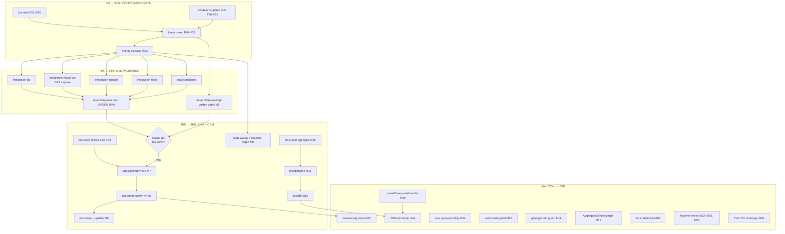

# SUPERB Plan: Verify-Green Gate → Substrate Ship (Tag Wave) → CRM Correctness Ports

**Date:** 2026-09-19 15:37 · **Author:** tail-execution session (continuation of the universal-storage-substrate arc)
**Inputs:** `docs/status/archived/2026-09-19_15-34_metaengine-substrate-tail-adr0143-jsonv2-sweep.md`, `TODO_LIST.md` (2026-09-19 state, incl. concurrent-session completions T18a/T22/T23), ADR-0142/0143.

## Situation (why this plan exists)

The ADR-0142 substrate work is functionally complete and **tests + race phases are green** — for the first time since the reset ladder shipped. What stands between the repo and shipping:

1. **The lint phase** of `#verify` carries ~44 unfixable findings across 22 modules — debt the auto-commit daemon landed while every earlier verify died before lint. This is the single gate blocking everything.
2. **Live validation** (`#test-integration`) has not run against the new code (ADR-0143 reset semantics, FactSink wiring on PG/MySQL, `ADTTEST_CAS_RACERS` cap in the QEMU leg).
3. **The tag wave** (claiming/v4.0.0 + queue family) — the substrate is invisible to consumers until tagged. Blocked on green verify + quiet tree; a concurrent session is active in the same area (their `SaveWatermark` GREATEST fix + taskmanager engine-backed queue work is in-flight).
4. **Two production CRM bugs** live in TODO_LIST 🔥: ctx-scoped tx port to pg/mysql/duckdb (sqlite already fixed in `22ab7b218`) and the planned-table camelCase pushdown silent-empty bug. The CRM pins this repo — every pushed fix is customer value.
5. Known upstream/infra friction: go1.27 go/types + x/tools parallel-check race (currently `-race`-skipped), exhaustruct_v5 analyzer panic on stack/{sqlite,mysql}, verify instability under external load (38-user box).

**Concurrent-session reality:** benchkit statistical-rigor workstream is active RIGHT NOW (dirty files: benchkit/*, cmd/cqrs-bench/*, workflows). This plan does not touch those files; ledger edits stay theirs.

---

## Step 1 — Pareto Breakdown

### The 1% that deliver 51% — FINISH THE LINT DEBT → `#verify` GREEN
One cluster, ~27 fine tasks. Every other outcome (tag wave, integration validation, CRM pin bumps, release train, benchmark baselines worth trusting) is gated on a green full gate. The fixes are enumerated to the line; nothing here is research.

### The 4% that deliver 64% — + LIVE VALIDATION + GATES
`#test-integration` across all backends (proves ADR-0143 journal-survival + FactSink + the CAS cap against real servers), post-wave gates (duplication/arch/file-size/api-golden), and ledger closure. Converts "tests green locally" into "validated on every substrate we ship".

### The 20% that deliver 80% — + SHIP THE SUBSTRATE + CRM CORRECTNESS
Tag wave (claiming/v4.0.0 then queue family ×4 — the entire ADR-0142/queue substrate becomes consumable), T18b benchmark re-baseline under Go 1.27, and the CRM ctx-scoped-tx ports to pg/mysql/duckdb (production dirty-read/flake fix, mechanical port of a proven pattern).

### The other 20% to reach 100%
CRM camelCase planned-table pushdown fix (M-effort design), matview routing seam (`AggregateOn` one-pager) + matview tag wave, Turso defect-A characterization, upstream race filing, resilience hardening (verify load guard, `.golangci.yml` drift guard), cqrs-lint/cqrs-upgrade/350-line hygiene waves, T19–T21 v5-gated design, conformance-sweep live tail, blocked owner decisions (kept as decisions, not tasks).

---

## Step 2 — Comprehensive Plan (30–100 min per task, ALL todos, sorted)

Sort: `Importance` (P0 blocker > P1 ship > P2 hardening > P3 backlog > P4 v5), then impact/customer-value, then effort ascending (quick wins first within a tier).

| # | Task | Pareto | Importance | Impact | Effort | Time | Gate/Dep |
|---|------|--------|-----------|--------|--------|------|----------|
| M1 | Finish lint debt: ~44 manual findings across 22 modules (embedded-field reorder ×11 structs, err113 sentinels ×4, gochecknoinits/gochecknoglobals nolints ×5, exhaustruct profile literals ×3+1, mnd consts ×5, contextcheck, exhaustive DuckDB ×3, varnamelen ×2, wastedassign, gocyclo, wrapcheck, maintidx, revive ×2, sqlclosecheck, tparallel ×2, godoclint, staticcheck Emit) | 1% | P0 | Blocks ALL gates | M | 100m | — |
| M2 | exhaustruct_v5 analyzer-panic exclusions for stack/sqlite + stack/mysql (dated upstream-bug comment) + `#check-lint-config` | 1% | P0 | Unblocks lint phase | S | 30m | M1 (parallel ok) |
| M3 | Full `nix run .#verify` green (quiet window; includes first doc-check phase pass) + triage transients | 1% | P0 | The gate | S+wait | 60m | M1, M2 |
| M4 | `#test-integration` all backends: PG, MySQL-QEMU (CAS cap live), Dgraph, Redis, composite local (sqlite/pebble/bbolt/duckdb) | 4% | P0 | Validates ADR-0143 + FactSink live | M | 100m | M3 |
| M5 | Post-wave gates: `#check-duplication` (bbolt reset rewrite), `#check-arch`, `#check-file-size`, api-stability golden review | 4% | P1 | Ratchet integrity | S | 30m | M1 |
| M6 | Review concurrent-session artifacts pre-wave (queue/mysql GREATEST, pgengine run-unique reset keys, taskmanager queue wiring, benchkit noise gate) — read + judge, don't touch | 20% | P0 | Wave safety | S | 30m | before M7/M8 |
| M7 | Tag wave 1: `claiming/v4.0.0` (dry-run, sqlstore replace pin, standalone build, proxy probe) | 20% | P1 | Ships substrate base | S | 45m | M3, M6, owner-go |
| M8 | Tag wave 2: queue family `queue`,`queue/sqlite`,`queue/postgres`,`queue/mysql` v4.0.0 + sibling-replace strip (incl. tursoengine claiming replace) + pin-sweep + golden regen | 20% | P1 | Ships the queue substrate | M | 90m | M7 |
| M9 | T18b: `#load-sweep` + `benchmark-regression.sh --save` re-baseline (quiet window; claimkit benches from T18a join the gate set) | 20% | P1 | Trustworthy perf claims | S | 60m | M3, quiet window |
| M10 | CRM ctx-tx port → pgengine (marker-ctx, delete engine-global activeTx, isolation test, `-race`) | 20% | P1 🔥 | Production correctness (CRM pin bump target) | M | 60m | — (independent) |
| M11 | CRM ctx-tx port → mysqlengine | 20% | P1 🔥 | Same | M | 60m | M10 pattern |
| M12 | CRM ctx-tx port → duckdbengine | 20% | P1 🔥 | Same | M | 60m | M10 pattern |
| M13 | Ledger closure: CHANGELOG section(s) for verify-green/lint-debt/tag wave; TODO_LIST sync (coordinate with concurrent session's edits) | 4% | P1 | Honest history | S | 30m | M3 |
| M14 | Upstream filing: go/types+x/tools parallel-check race (minimal repro → github-voice draft → file → link from `race_on_test.go`) | 100% | P2 | Ecosystem fix velocity | S | 30m | M3 |
| M15 | Verify load-threshold guard (refuse >N loadavg with retry message + self-test fixture) | 100% | P2 | Kills transient-red verify class | S | 30m | M3 |
| M16 | `.golangci.yml` drift guard (hash-golden check wired into verify/pre-commit; post-gci-incident) | 100% | P2 | Config ownership | S | 30m | M2 |
| M17 | Re-pin `TestEngineHealth_CatchUpUnderConcurrentApplies` TODO observation (distinct from fixed ADR-0143 bug) | 100% | P3 | Tidy ledger | S | 15m | — |
| M18 | CRM camelCase planned-table pushdown: repro test + canonical field→json-key mapping + extraction fix + Filterable round-trip parity test | 100% | P2 🔥 | Production correctness | M | 120m | — (independent) |
| M19 | Matview routing seam: `AggregateOn(fn, column, group)` one-pager on QueryDecl (S28) | 100% | P2 | Planner v1 unblock | S | 60m | — |
| M20 | Turso defect-A onset-boundary characterization (rows×groups×tx bisect) for upstream issue | 100% | P3 | Upstream filing prep | M | 100m | quiet window |
| M21 | Matview tag wave (sqliteengine/tursoengine/system pins + replace strip) | 100% | P2 | Ships matviews | M | 60m | M8 mechanics |
| M22 | 350-line policy: ratify shipped ratchet, then plan split waves | 100% | P3 | Debt control | S | 60m | — |
| M23 | cqrs-lint audit follow-ups (loose heuristic gates) | 100% | P3 | Tool quality | M | 100m | — |
| M24 | cqrs-upgrade strict-gate residual holes | 100% | P3 | Tool quality | M | 100m | — |
| M25 | Release hygiene: GitHub Releases for outstanding tags, `pin-sweep --check` standing step, `check-retracts-shipped.sh`, `tag-release.sh --audit --baseline` | 100% | P3 | Ops polish | M | 60m | M8 |
| M26 | T19–T21 v5 fold design one-pager (capabilities into universal Engine; SQL stack deletion; release train) — DESIGN ONLY, v5-gated | 100% | P4 | Direction | M | 100m | owner v5-go |
| M27 | Conformance-sweep live-server tail (dedup/live legs remainder) | 100% | P3 | Coverage | M | 100m | M4 |

**Blocked owner decisions kept OUT of task form** (they are questions, not work): daemon `.golangci.yml` exclusion (Q), dead-path module/tag decisions, release-policy severity tightening, Doctor-JSON semantics, branch protection F040, iroh P99 ratification, Turso DSN/sync policies, dgraph one-RPC scope, matview grouped-spec safety flag (upstream-timeline dependent).

---

## Step 3 — Fine Breakdown (≤12 min per task, ALL todos)

### M1 — Lint debt (27 tasks)
| ID | Fine task | Time | Dep |
|----|-----------|------|-----|
| F01 | Embedded-field reorder: queue/{sqlite,postgres,mysql} Engine structs | 12m | — |
| F02 | Embedded-field reorder: claimkit Claims/Dedup + claims_test host | 12m | — |
| F03 | Embedded-field reorder: badgerengine + bboltengine engine structs | 12m | — |
| F04 | Embedded-field reorder: duckdbengine + pebbleengine engine structs | 12m | — |
| F05 | Embedded-field reorder: pgengine + mysqlengine engine structs | 12m | — |
| F06 | err113 → sentinels: queue/{sqlite,postgres,mysql}/register.go DSN errors | 12m | — |
| F07 | err113 → sentinel: queue/conformance "observation abandoned" | 12m | — |
| F08 | gochecknoinits `//nolint` ×3 register.go (AGENTS #19 pattern, mirror engine register.go style) | 12m | — |
| F09 | exhaustruct_v5: 3 queue EngineProfile literals — match pebbleengine/profile.go pattern | 12m | — |
| F10 | exhaustruct_v5: queue/mysql open.go mysql.Store literal ownsDB | 12m | — |
| F11 | mnd consts: queue/postgres (5000, 500), queue/mysql open.go (8) | 12m | — |
| F12 | mnd consts: claiming/rich.go (3, 10, 10) | 12m | — |
| F13 | gochecknoglobals nolint: cqrs-lint loadMu, queue/mysql schemaStmts | 12m | — |
| F14 | contextcheck: queue/sqlite NewEngine ctx propagation | 12m | — |
| F15 | exhaustive: claiming DuckDB cases ×3 switches (migrate/rich/stmt) | 12m | — |
| F16 | varnamelen: queue/conformance deps.go `a`, benchkit metrics `lo` | 12m | — |
| F17 | wastedassign: queue/conformance lifecycle.go:190 | 12m | — |
| F18 | gocyclo: extract helper in pinWatermark (21→<20) | 12m | — |
| F19 | wrapcheck: queue/conformance facttx.go Append | 12m | — |
| F20 | maintidx nolint: adttest claim_conformance.go:34 (conformance-suite justification) | 12m | — |
| F21 | revive unused-params: temporal_conformance t1, vw → `_` | 12m | — |
| F22 | sqlclosecheck: claimkit bench_test.go Close → defer | 12m | — |
| F23 | tparallel: 2 adttest conformance tests' subtests | 12m | — |
| F24 | godoclint: metaengine/types.go IsDegraded comment start | 12m | — |
| F25 | staticcheck: otelobserver Emit → Value.String | 12m | — |
| F26 | Re-run per-module lint over all 22 modules → 0 findings | 12m | F01–F25 |
| F27 | Build + test the touched modules (workspace mode) | 12m | F26 |

### M2 — exhaustruct panic (2)
| F28 | .golangci.yml exhaustruct exclude stack/sqlite + stack/mysql with dated upstream-bug comment | 12m |
| F29 | `nix run .#check-lint-config` green | 12m |

### M3 — Verify green (3)
| F30 | Quiet-window check (loadavg < ~10) + launch `#verify` | 12m | F26–F29 |
| F31 | Triage failures: real vs load-transient; fix real, re-run transient | 12m | F30 |
| F32 | Confirm doc-check phase green in-run (references count ≥ 1183) | 12m | F31 |

### M4 — Integration (6)
| F33 | `#integration-pg` leg (pgengine + claimkit PG + queue/postgres FactSink live) | 12m† | F32 |
| F34 | `#integration-mysql-vm` leg (queue/mysql + mysqlengine; CAS cap live; `-p 1`) | 12m† | F32 |
| F35 | `#integration-dgraph` leg | 12m† | F32 |
| F36 | `#integration-redis` leg (watermill brokers) | 12m† | F32 |
| F37 | Composite `#test-integration` local backends (sqlite/pebble/bbolt/duckdb) | 12m† | F32 |
| F38 | Triage/fix live-leg failures | 12m† | F33–F37 |

### M5 — Gates (3)
| F39 | `#check-duplication` (bbolt prefix-sweep rewrite check) | 12m | F26 |
| F40 | `#check-arch` + `#check-file-size` | 12m | F26 |
| F41 | api-stability golden diff review (expect no-op; regen if comment-capture moved) | 12m | F26 |

### M6 — Pre-wave review (2)
| F42 | Read+judge concurrent-session diffs: queue/mysql SaveWatermark GREATEST, pgengine reset run-unique keys, taskmanager queue wiring | 12m |
| F43 | Confirm tree quiet + daemon absorbed; snapshot HEAD sha for the wave | 12m |

### M7/M8 — Tag waves (8, owner-go gated)
| F44 | claiming/v4.0.0 dry-run via tag-release.sh | 12m | M3, M6, owner-go |
| F45 | claiming: sqlstore replace pin + GOWORK=off standalone build gate | 12m | F44 |
| F46 | claiming: tag + proxy probe (`go list -m` fetch) | 12m | F45 |
| F47 | queue family ×4 dry-runs | 12m | F46 |
| F48 | Verify replace strips incl. new tursoengine claiming replace + queue sibling replaces | 12m | F47 |
| F49 | queue family tags + `pin-sweep.sh` over consumers | 12m | F48 |
| F50 | api-stability golden regen + TestEvery post-tag | 12m | F49 |
| F51 | `check-changelog-symbols` + CHANGELOG release-section touch-up | 12m | F50 |

### M9 — T18b baselines (3)
| F52 | `#load-sweep` under load coakers (quiet window) | 12m† | M3 |
| F53 | `benchmark-regression.sh --save` re-baseline with provenance header | 12m | F52 |
| F54 | Verify claimkit benches (T18a) present in gate set | 12m | F53 |

### M10–M12 — CRM ctx-tx ports (15)
| F55 | Read sqliteengine tx_isolation_test + marker pattern (`22ab7b218`) | 12m |
| F56 | pgengine: xc/xd → ctx-carried txMarker resolution | 12m |
| F57 | pgengine: delete engine-global activeTx + accessor refactor | 12m |
| F58 | pgengine: port isolation test (dirty-read guard) | 12m |
| F59 | pgengine: `-race` green + concurrent stream test | 12m |
| F60–F64 | mysqlengine: same five steps | 5×12m |
| F65–F69 | duckdbengine: same five steps | 5×12m |

### M18 — camelCase pushdown (5)
| F70 | Red-test: Filterable camelCase field + pushdown returns 0 rows | 12m |
| F71 | Map encoder field→json-key path; write canonical mapping note | 12m |
| F72 | Implement planned-column extraction fallback (field-name AND json-tag) | 12m |
| F73 | Round-trip parity test: every Filterable field survives pushdown | 12m |
| F74 | Note CRM workaround removal (`tasksForParentID`) in TODO_LIST | 12m |

### M13–M17, M14–M16 hardening (9)
| F75 | CHANGELOG: verify-green + lint-debt + tag-wave sections | 12m | M3 |
| F76 | TODO_LIST sync (marks + leftovers; re-read section first — concurrent session) | 12m | F75 |
| F77 | Race repro harness (minimal packages.Load + -race) | 12m |
| F78 | Draft upstream issue in Lars's voice (verify-before-filing checklist) | 12m | F77 |
| F79 | File + link from race_on_test.go comment | 12m | F78 |
| F80 | Verify-app load guard implementation | 12m |
| F81 | Load-guard self-test (planted loadavg fixture, mutation-tested) | 12m | F80 |
| F82 | `.golangci.yml` hash-golden drift check script + wiring | 12m |
| F83 | TODO_LIST: catchup-observation re-pin entry | 12m |

### M19–M27 backlog (coarse 12m chunks)
| F84–F85 | AggregateOn one-pager (read seam; draft) | 2×12m |
| F86–F90 | Turso defect-A bisect runs + characterization write-up | 5×12m |
| F91–F93 | Matview tag wave (pins, strip, probe) | 3×12m |
| F94–F95 | 350-line ratchet ratification + split-wave list | 2×12m |
| F96–F99 | cqrs-lint loose-gate follow-ups | 4×12m |
| F100–F103 | cqrs-upgrade residual holes | 4×12m |
| F104–F106 | Release hygiene (GH Releases, standing pin-sweep, retract script) | 3×12m |
| F107–F110 | T19–T21 v5 fold design one-pager | 4×12m |
| F111–F113 | Conformance-sweep live tail | 3×12m |

† = trigger + monitor; wall-clock longer, hands-on ≤12m.

---

## Step 4 — Execution Graph

## Execution rules

1. **Critical path only until `#verify` is green** (T1). No parallel workstream starts before M3 — every gate failure costs a full cycle.
2. **Concurrent-session discipline:** re-read shared ledgers before each edit; never touch benchkit/cqrs-bench/workflow files this plan doesn't own; commit authored work explicitly before long gates.
3. **Quiet-window policy for M3/M9/M20:** trigger-and-monitor; treat load-transient failures as retryable (until M15's guard automates the refusal).
4. **No verschlimmbessern:** every fix verified by its own gate before moving on; lint fixes must not weaken semantics (sentinels over stringly errors; nolint comments must cite the contract).
5. Tag waves (M7/M8/M21) execute only after owner go; never push tags without it.
