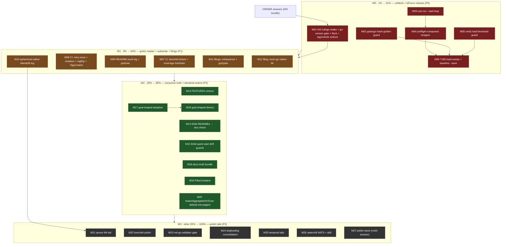

# SUPERB — Owner-Unblock & Trust-Closure: Pareto Execution Plan (post-9th-audit)

> **When:** 2026-09-20 17:40 CEST · **Input:** [`TODO_LIST.md`](../../TODO_LIST.md)
> rebuilt by the 9th docs-health pass (116 open + 31 BLOCKED rows across 29
> sections; pass report `docs/status/2026-09-20_17-34_docs-health-ninth-pass-full-audit.md`)
> + the S03 composed-verify GREEN + the published 92-tag train.
> **Goal:** convert the post-train state into consumer-experienced trust — owner
> rulings unblocked, the two recurring time-burn classes killed, master green,
> the queue substrate validated on every backend, and the consumer-truth docs
> closed out — without breaking a single v4 consumer.
>
> **Verschlimmbesserung guardrails:** additive-only v4.x (growing core interfaces
> is breaking — contract 21g); owner QUESTIONS stay rulings and gate their
> tasks (never executed without the answer); the Declined/Rejected list is
> do-not-re-litigate; v5-gated rows are STAGED, not executed; M10 coordinates
> with the concurrent session's in-flight `testutil/mysqltestcontainer` work
> (observed dirty in the tree 17:40) instead of duplicating it.

---

## Situation (why this plan exists)

The 92-tag train is published and the composed `#verify` is green (S03, first
since 09-09). What remains between here and "boring to trust" is concentrated,
not spread:

1. **Six owner rulings** gate ~20 rows (W3 bundle). Every one is XS; none can
   be executed without the answer. This is the single highest-leverage open item.
2. **Two recurring burn classes:** the `.golangci.yml` config-corruption war
   (10+ incidents, ~45 min each) and verify-attempt burns (attempts 7–9 of the
   S03 arc were each a skipped pre-flight, 12–46 min each). Both have S-effort
   mechanical fixes designed and waiting.
3. **T18b** is the last substrate-plan item: the committed benchmark baseline
   predates the Go 1.27 toolchain — every perf claim cites a stale baseline.
   Quiet-window gated.
4. **Master is red across ~6 CI legs**, all root-caused with owners, none caused
   by wave content. Red master normalizes drift.
5. **The queue/claiming substrate has no durable MySQL leg** (QEMU diagnosed
   vehicle-fragile; the native-MariaDB path proved out manually on 09-19 but
   was never productized — a concurrent session is now building
   `testutil/mysqltestcontainer`, so coordinate).
6. **Consumer-truth tails:** FEATURES maturity census, READMEs outside the
   doc-check gate, quick-start drift guards, recipes §2.11 never drift-checked,
   3 known ambiguous-alias advisories.
7. Three upstream filings (exhaustruct_v5 panic, go/types race, turso-go
   native-lib family) have repros ready and would fix ecosystem classes that
   red our CI legs.

---

## Step 1 — Pareto Breakdown

### The 1% that deliver 51% — UNBLOCK THE OWNERS, KILL THE BURN CLASSES

Six XS rulings + four S-effort guard/gate tasks. Everything else in this plan
either waits on these or repeats their failure modes without them:

- **W3 owner-bundle rulings intake + immediate implementations** (M01) —
  readme_claims ownership, ratify 10:31 repair, flake go-pin loud gate,
  verify-window flock, stale taskmanager v4 tags, MySQL vehicle decision.
- **M16 `.golangci.yml` hash-golden drift guard** (M02) — ends incident #10.
- **Verify-launcher ergonomics**: `--wait-loop`, pre-flight-everything wrapper,
  in-verify load guard (M03–M05) — makes the next quiet window ONE attempt.
- **T18b load-sweep + benchmark-baseline supersede** (M06) — re-anchors every
  perf claim under Go 1.27 with the provenance header.

### The 4% that deliver 64% — + GREEN MASTER + VALIDATED SUBSTRATE + ECOSYSTEM FIXES

- **CI tail to green-or-gated** (M07–M08): benchkit fixture env, coverage
  toolchain pin, retry-once, isolation-leg investigation, nightly triage,
  TagContent clean confirm.
- **Ephemeral native-MariaDB leg** (M10): the queue/claiming/claimkit substrate
  finally validated on MySQL as a productized leg (coordinated with the
  concurrent mysqltestcontainer session).
- **Upstream filings** (M11–M12): exhaustruct_v5 `skippedNamed` panic,
  go/types+x/tools race, turso-go native-lib family — verify-before-filing,
  owner-approved, drafted in github-voice.
- **Docs wiring smalls** (M09): README gates onto a push leg; GracefulClose +
  slirp/QEMU gotchas recorded.

### The 20% that deliver 80% — + CONSUMER TRUTH + DECLARED SEAMS

- **FEATURES maturity census + last-verified stamps** (M13).
- **READMEs into the doc-check gate (634b) + quick-start drift guards (634d)**
  (M14–M15) — the README truth gates become CI-enforced.
- **Docs-truth bundle** (M16): live-latency recipes §2.11 sync, 3
  ambiguous-alias advisories resolved, per-file archived-waves index.
- **goal-shaped-app consumer-value demos** (M17–M18): DomainConfig.Events +
  `.On` adoption (unblocked by system v4.8.0), coeffect-loud variant, GWT
  scenario, snapshot story, AsyncAPI export, cqrs-lint probe.
- **metaengine declared seams** (M19–M20): `FilterContains`/`FilterPrefix`
  FilterOp extension; lease-story + `AggregateOn` one-pagers; Scan-default v5
  consumer survey.

### The other 20% to reach 100% — POLISH TAILS + GATED BUCKETS

Queue M4 polish (M21), benchkit polish + parity + baseline protocol (M22),
md-go-validator gate (M23), dogfooding extraction/audit (M24), temporal
property/soak tails (M25), watermill NATS + skill tail (M26), cqrs-lint +
release-tooling + repo-hygiene polish wave (M27). **Excluded (gated):** the v5
deletion/deprecation-sweep rows (v5-gated, ADR-0123), CI billing fix and F040
branch protection (owner/infra), CV consumer bump (operator-side), bigtable
real-GCP validation (credentials), PapDashboard T20 (consumer-gated).

---

## Step 2 — Comprehensive Plan (30–100 min per task, ALL todos, sorted)

Sort: `Importance` (P0 blocker > P1 ship/green > P2 consumer-truth > P3 polish),
then impact/customer-value, then effort ascending within a tier.

| #   | Task                                                                                                                                                                        | Pareto | Importance | Impact                                                    | Effort | Time   | Gate/Dep                        |
| --- | --------------------------------------------------------------------------------------------------------------------------------------------------------------------------- | ------ | ---------- | --------------------------------------------------------- | ------ | ------ | ------------------------------- |
| M01 | W3 rulings intake + implementations: apply the 6 answers, build `check-go-version` loud gate (Q4), `scripts/lib/verify-lock.sh` flock (Q5), act on readme_claims/tags/vehicle | 1%     | P0         | Unblocks ~20 rows; ends the two corruption classes' cover | M      | 100min | OWNER answers                   |
| M02 | M16: `.golangci.yml` content hash-golden guard wired into `#verify` + pre-commit, self-tested + mutation-proven                                                              | 1%     | P0         | Kills the 10-incident config-corruption class             | S/M    | 60min  | —                               |
| M03 | `can-run-composed-gate.sh --wait-loop` (retry composition; the 16:39 supervisor pattern productized)                                                                         | 1%     | P0         | One-attempt quiet windows                                 | S      | 30min  | —                               |
| M04 | Pre-flight-everything wrapper (templ, bench-gate, coverage, api-stability, duplication <5min each, before any verify launch)                                                 | 1%     | P0         | Ends the 12–46min attempt-burn class                      | M      | 60min  | M03                             |
| M05 | In-`#verify` load-threshold guard (refuse >N loadavg, retry message; M15)                                                                                                    | 1%     | P0         | No more verify-under-load reds                            | S      | 30min  | —                               |
| M06 | T18b: `#load-sweep` then `benchmark-regression.sh --save` with provenance header (Go 1.27.1 + claimkit + engines)                                                             | 1%     | P0         | All perf claims re-anchored; clears Benchmarks leg        | S+wait | 90min  | quiet window, M04               |
| M07 | CI green 1: benchkit load-gate fixture env propagation + coverage-gate pinned/setup Go toolchain                                                                             | 4%     | P1         | 2 of 6 red legs green                                     | M      | 60min  | —                               |
| M08 | CI green 2: auto-retry-once for infra transients; Module-Isolation leg-set investigation; nightly 04:12 triage; TagContent clean-run confirm                                 | 4%     | P1         | Master green-or-explicitly-gated                          | M      | 90min  | M07 (same PR wave)              |
| M09 | Docs wiring smalls: README gates onto a push leg; GracefulClose select-race + leaked-QEMU/slirp gotchas into docs/agents                                                     | 4%     | P1         | New debt lands loud, not nightly-late                     | S      | 30min  | —                               |
| M10 | Ephemeral native-MariaDB leg: reconcile with in-flight `testutil/mysqltestcontainer`, productize `ephemeral-mysql.sh` + flake app, run the full mysql module set              | 4%     | P1         | Substrate validated on every backend; M4 closed           | M/L    | 100min | coordinate w/ concurrent ses.   |
| M11 | Upstream filings: exhaustruct_v5 `skippedNamed` panic + go/types+x/tools race (minimal repro → github-voice → file → link from TODO)                                         | 4%     | P1         | Ecosystem fix velocity; un-blocks CI transients           | S      | 60min  | OWNER approval, verify-before-filing |
| M12 | Upstream filing: turso-go native-lib hash-mismatch + lazy-init family (repro + pin-bump-or-hold recommendation)                                                              | 4%     | P1         | Clears 1–3 intermittent red legs                          | S/M    | 60min  | OWNER approval                  |
| M13 | FEATURES maturity-matrix census: all 95 modules rowed vs reality, last-verified stamps on guarantee rows                                                                     | 20%    | P2         | The feature inventory becomes verifiable                  | M/L    | 100min | —                               |
| M14 | TODO 634b: READMEs into the doc-check gate (flake app + CI leg)                                                                                                              | 20%    | P2         | README drift becomes gate-loud                            | M      | 100min | —                               |
| M15 | TODO 634d: quick-start drift-guard tests (stack/sqlite, storage/memory, decider, scheduling, projectionhost)                                                                 | 20%    | P2         | Quick-starts compile-proof at every commit                 | M      | 100min | —                               |
| M16 | Docs-truth bundle: recipes §2.11 live-latency sync vs code; 3 ambiguous-alias advisories fixed; per-file archived-waves index in status README                               | 20%    | P2         | doc-check reaches true zero-warning; archive navigable    | S/M    | 60min  | —                               |
| M17 | goal-shaped-app: pin bump to system v4.8.0, adopt `DomainConfig.Events` + `.On`, coeffect-loud Doctor demo                                                                   | 20%    | P2         | The Goal story demonstrable in 5 minutes                  | M      | 60min  | —                               |
| M18 | goal-shaped-app: scenario Given/When/Then test, snapshot story demo, AsyncAPI export + cqrs-lint consumer probe (throwaway copy)                                             | 20%    | P2         | Docs-generate-themselves + lint-clean proofs              | M      | 100min | M17                             |
| M19 | metaengine: `FilterContains`/`FilterPrefix` FilterOp (native LIKE/prefix + closure fallback, enum validation, parity tests)                                                  | 20%    | P2         | CV's 2.3–28ms scan → native; v5 FilterOp window           | M      | 100min | —                               |
| M20 | metaengine decisions: single-writer/lease story one-pager; `AggregateOn` seam one-pager; Scan-default v5 consumer survey                                                     | 20%    | P2         | Three ADR-grade decisions unblocked pre-v5-freeze         | M      | 100min | —                               |
| M21 | Queue M4 polish tail: conformance doc list, PG `-race -count=2` leg, mysql backoff+jitter, pool options, `MYSQL_TEST_DSN` nix leg, dep-validation ratification                | other  | P3         | Queue family polish-complete                              | M      | 100min | M10 vehicle decision            |
| M22 | benchkit polish: Min column, `--strict` NOISY fail, list-phases map, CSV/CoV columns, `RunSuite` testing.B variant, stale-baseline protocol                                   | other  | P3         | Evidence-grade UX tail                                    | M      | 100min | —                               |
| M23 | md-go-validator: commit baseline + flake app + CI leg, then P2 (9 consumer-facing blocks)                                                                                    | other  | P3         | 167-error doc-drift class gated                           | M      | 100min | —                               |
| M24 | Dogfooding: scan/paginate helper extraction; retry-idiom reconciliation audit (middleware/retry vs go-retry vs engine backoffs)                                               | other  | P3         | Two consolidation classes closed                          | M      | 100min | —                               |
| M25 | Temporal tails: rapid property tests (memory version chains), sqlite restart soak, bigtable `MapUpdateAt`/MaxAge decisions (GCP smoke cred-gated)                            | other  | P3         | ADR-0141 surface hardened                                 | M      | 100min | —                               |
| M26 | Watermill: NATS JetStream roundtrip leg + `ephemeral-nats.sh`; sibling-skill tail (eval prompts, advanced.md)                                                                | other  | P3         | Broker matrix + docs parity                               | M      | 100min | —                               |
| M27 | Polish wave (multi-session): cqrs-lint FP-sweep refresh + audit follow-ups + strict-gate holes; smoke-all resume/timing; `--from-manifest`; templ leg summary; TagContent train threshold; exclusion-map unification; new-module scaffold; verification-ladder doc; LSP env; scheduler row; `check-example-standalone.sh` | other | P3 | Long-tail hygiene to zero | L | 100min×N | — |

**Blocked owner decisions kept OUT of task form** (questions, not work): CI
billing fix, F040 branch protection, iroh P99 (in M01 ratification set), 350-line
policy ratification, Zenoh go/no-go, G-T01 direction ruling, ADR-0139 questions,
Doctor-JSON semantics, Turso DSN/sync policies, dgraph one-RPC scope, severity
tightening Q3, CV bump. **Excluded as gated:** all v5 Unification rows
(ADR-0123 — deletion + cut, staged for the v5 train, never executed in v4.x).

---

## Step 3 — Fine Breakdown (≤12 min per task, ALL todos)

| ID   | Fine task                                                                                          | Time | Dep     |
| ---- | -------------------------------------------------------------------------------------------------- | ---- | ------- |
| F01  | Collect W3 rulings; record each in TODO_LIST (struck + decision + date)                            | 12m  | OWNER   |
| F02  | Q1: readme_claims_test.go — assign owner in module map + AGENTS note (or remove per ruling)        | 12m  | F01     |
| F03  | Q4: `scripts/check-go-version.sh` (fail loud when host go < contract or nixpkgs lag)               | 12m  | F01     |
| F04  | Wire check-go-version into `#verify` head + nightly; self-test with version-stub fixture           | 12m  | F03     |
| F05  | Q5: `scripts/lib/verify-lock.sh` (flock `./.verify.lock`, stale-lock diagnosis)                    | 12m  | F01     |
| F06  | Take the lock in verify-docs.sh; check in tag-release/batch-release + pre-commit                    | 12m  | F05     |
| F07  | Q3-stale-tags: delete or document `example/taskmanager/v4.*` remote tags per ruling                 | 12m  | F01     |
| F08  | MySQL vehicle ruling: record decision; unpark or close M10 accordingly                              | 12m  | F01     |
| F09  | M02: hash `.golangci.yml` content → golden file + `check-lint-config` extension                     | 12m  | —       |
| F10  | Wire hash check into `#verify` lint-config phase + pre-commit                                       | 12m  | F09     |
| F11  | Self-test: 3 legs (clean / content-drift / golden-stale) with honored env root                      | 12m  | F10     |
| F12  | Mutation-proof: mangle depguard allow-list → gate must fail → restore                               | 12m  | F11     |
| F13  | Gotcha line in docs/agents/gotchas-tooling-build.md (hash-golden contract)                          | 12m  | F12     |
| F14  | M03: add `--wait-loop` (max-wait, retry interval, rebound tolerance) to can-run-composed-gate       | 12m  | —       |
| F15  | Planted-fixture self-tests: one-shot still works; wait-loop survives one rebound                    | 12m  | F14     |
| F16  | Document the composed-launch recipe (wait-loop → verify → record) in AGENTS gotchas                 | 12m  | F15     |
| F17  | M04: enumerate the cheap phases + their exact commands (templ, bench-gate, coverage, api, dupl)     | 12m  | —       |
| F18  | `scripts/preflight-composed.sh` skeleton: run each phase, stop at first red, print remedy           | 12m  | F17     |
| F19  | Env hooks (phase skip/only lists) + self-test with failing-phase fixture                            | 12m  | F18     |
| F20  | Run the wrapper for real; fix whatever it catches BEFORE any verify attempt                         | 12m  | F19     |
| F21  | Record S04-style pre-flight ledger line in TODO (wrapper adopted)                                   | 12m  | F20     |
| F22  | M05: load probe function in verify-docs.sh (reuse wait-for-quiet's probe)                           | 12m  | —       |
| F23  | Refuse >N loadavg with retry message + `VERIFY_FORCE=1` override; golden the message                | 12m  | F22     |
| F24  | Self-test via planted loadavg file (calibration-gate pattern)                                       | 12m  | F23     |
| F25  | M06: confirm quiet window (`can-run-composed-gate --wait-loop`)                                     | 12m† | M04     |
| F26  | `nix run .#load-sweep` (timing tests under coakers; record durations)                               | 12m† | F25     |
| F27  | `benchmark-regression.sh --save` (provenance header auto-written)                                   | 12m  | F26     |
| F28  | Diff new baseline vs old; note claimkit + 1.27 movements in CHANGELOG/TODO                          | 12m  | F27     |
| F29  | Strike T18b/T14 rows with evidence; supersede-note the oversubscribed 09-19 capture                 | 12m  | F28     |
| F30  | M07: benchkit fixture — capture runner output shape, env-propagate the loadavg path                 | 12m  | —       |
| F31  | Fix `actionlint + shellcheck` leg; verify 12/12 under simulated runner env                          | 12m  | F30     |
| F32  | Coverage leg: add setup-go (`go-version-file: go.mod`) mirroring go.work-sync fix                   | 12m  | —       |
| F33  | Run the coverage-gate job locally (act or scripts) to confirm no network download                   | 12m  | F32     |
| F34  | Commit + push; mark the two legs' expected-green in the CI triage row                               | 12m  | F31/F33 |
| F35  | M08: add retry-once job wrapper for cancelled/failed infra legs (CGo/coverage class)                | 12m  | —       |
| F36  | Module-Isolation Build: diff leg sets across last 5 runs; identify the flip condition               | 12m  | —       |
| F37  | Nightly 04:12 failure: pull log, classify (known class vs new), fix or file                         | 12m  | —       |
| F38  | Confirm `TestTagContentMatchesChangelog` absent-from-failures on a fresh run                        | 12m  | —       |
| F39  | Update the CI triage TODO row with per-leg disposition (green/gated/root-caused)                    | 12m  | F35-38  |
| F40  | Re-run `gh run watch` on the push; record final leg map                                             | 12m  | F39     |
| F41  | M09: add `check-readme-links/-deprecated` self-test-then-gate steps to the push workflow            | 12m  | —       |
| F42  | GracefulClose select-race pattern → docs/agents/gotchas-testing.md                                  | 12m  | —       |
| F43  | Leaked-QEMU-33070 + slirp-RST diagnosis → gotchas-testing.md                                        | 12m  | —       |
| F44  | Link the new gotchas from the TODO rows they came from; strike them                                 | 12m  | F42/F43 |
| F45  | M10: read the concurrent mysqltestcontainer diff; reconcile scope (adopt vs complement)             | 12m  | —       |
| F46  | `scripts/ephemeral-mysql.sh`: init datadir + provision `cqrs_test` (idempotent, port arg)           | 12m  | F45     |
| F47  | Flake app `#integration-mysql-ephemeral` (mirror ephemeral-pg pattern)                              | 12m  | F46     |
| F48  | Run stack/mysql against it (ADTTEST_CAS_RACERS=10); fix first-dial issues                           | 12m† | F47     |
| F49  | Run idempotency/sqlstore + scheduling/sqlstore + queue/mysql + claiming + mysqlengine               | 12m† | F48     |
| F50  | Record the leg as M4-complete in TODO + CHANGELOG Fixed/Added as needed                             | 12m  | F49     |
| F51  | vm-mysql.sh: pre-flight stale-port check + process-group trap (from 23-21 f11)                      | 12m  | —       |
| F52  | Update AGENTS integration rows with the new leg                                                     | 12m  | F50     |
| F53  | M11: exhaustruct_v5 repro verification on latest v5 (fresh module, minimal case)                    | 12m  | —       |
| F54  | Draft issue in github-voice (voice profile loaded; repro + expected/actual)                         | 12m  | F53     |
| F55  | File exhaustruct_v5 issue; link from TODO upstream row                                              | 12m  | F54     |
| F56  | go/types+x/tools race: fresh repro on latest x/tools; confirm not-yet-fixed                         | 12m  | —       |
| F57  | Draft + file; link from `race_on_test.go`/TODO; strike rows                                         | 12m  | F56     |
| F58  | M12: turso-go native-lib — pin-bump probe (latest tag, `TestBackend_LazyInit_Concurrent`)           | 12m  | —       |
| F59  | Characterize hash-mismatch vs lazy-init as two repros (envs, versions)                              | 12m  | F58     |
| F60  | github-voice draft per verify-before-filing checklist                                               | 12m  | F59     |
| F61  | Owner go/no-go: bump pin now vs hold; execute the branch                                            | 12m  | F60     |
| F62  | Refresh the verified-version citation (ivmrepro release-check procedure) if bumped                  | 12m  | F61     |
| F63  | Strike/refresh the turso CI-tail TODO rows with outcomes                                            | 12m  | F62     |
| F64  | M13: enumerate all 95 modules; diff vs FEATURES matrix rows; list gaps                              | 12m  | —       |
| F65  | Row the missing modules (batch 1 of 3) with honest statuses                                         | 12m  | F64     |
| F66  | Row batch 2 (engines family via wildcard verify)                                                    | 12m  | F65     |
| F67  | Row batch 3 (tools/examples) + fix any status flips found                                           | 12m  | F66     |
| F68  | Add last-verified stamps to Architecture Guarantees rows                                            | 12m  | F67     |
| F69  | Derive counts via script (canonical-facts extension) so the matrix can't rot                        | 12m  | F68     |
| F70  | Strike the census TODO row with evidence                                                            | 12m  | F69     |
| F71  | M14: doc-check multi-README mode spike (feed 95 READMEs; measure runtime)                           | 12m  | —       |
| F72  | Flake app `check-readme-docs` wrapping the invocation                                               | 12m  | F71     |
| F73  | CI leg (nightly first, push after one green night)                                                  | 12m  | F72     |
| F74  | Fix the findings the first real run surfaces (expect fence/anchor debt)                             | 12m  | F73     |
| F75  | Golden the reference count to catch silent skips                                                    | 12m  | F74     |
| F76  | Mutation test: break one README link → leg must fail                                                | 12m  | F75     |
| F77  | Strike 634b with evidence                                                                           | 12m  | F76     |
| F78  | M15: pick the 5 quick-starts; extract each fence into a compile test (getting-started pattern)      | 12m  | —       |
| F79  | stack/sqlite drift guard test                                                                       | 12m  | F78     |
| F80  | storage/memory drift guard test                                                                     | 12m  | F79     |
| F81  | decider drift guard test                                                                            | 12m  | F80     |
| F82  | scheduling + projectionhost drift guard tests                                                       | 12m  | F81     |
| F83  | Wire the 5 into the modules' tests + doc-check assertion                                            | 12m  | F82     |
| F84  | Strike 634d with evidence                                                                           | 12m  | F83     |
| F85  | M16: symbol-diff recipes §2.11 vs metaengine live-latency surface; list drifts                      | 12m  | —       |
| F86  | Fix recipes §2.11 (or the code, if the doc is right) + doc-check green                              | 12m  | F85     |
| F87  | core.md:448 + recipes.md:119 + faq.md:233 alias advisories: import-scope the blocks                 | 12m  | —       |
| F88  | doc-check full run: expect 0 advisories; golden the count                                           | 12m  | F87     |
| F89  | status README: per-file index for the 09-19/20 archived waves (batch table)                         | 12m  | —       |
| F90  | Strike the docs-truth TODO rows                                                                     | 12m  | F88     |
| F91  | M17: bump goal-shaped pin to system v4.8.0; `GOWORK=off` build green                                | 12m  | —       |
| F92  | Adopt `DomainConfig.Events` (event universe declared)                                               | 12m  | F91     |
| F93  | Adopt `.On` chaining in the registrations                                                           | 12m  | F92     |
| F94  | Coeffect demo: intentionally dangling subscription → loud `ErrDanglingEventSubscription`            | 12m  | F93     |
| F95  | README section + test pinning the loud path                                                         | 12m  | F94     |
| F96  | M18: scenario GWT test for the task flow (Given events → When command → Then state+projections)     | 12m  | F95     |
| F97  | Snapshot story: configure thresholds, restart mid-stream, assert rebuilt state                      | 12m  | F96     |
| F98  | AsyncAPI export demo in the example (catalog build step + committed artifact)                       | 12m  | F97     |
| F99  | cqrs-lint probe on a throwaway COPY (E-rule clean proof)                                            | 12m  | F98     |
| F100 | README updates for the four demos + strike the goal-shaped TODO rows                                | 12m  | F99     |
| F101 | examples CI test leg decision recorded (build-only → test) if time allows                           | 12m  | F100    |
| F102 | M19: FilterOp enum extension `contains`/`prefix` + validation                                       | 12m  | —       |
| F103 | Closure fallback evaluation (Go-side) + unit tests                                                  | 12m  | F102    |
| F104 | sqliteengine LIKE/prefix pushdown + parity test                                                     | 12m  | F103    |
| F105 | pgengine/mysqlengine pushdown + parity                                                              | 12m  | F104    |
| F106 | Doctor/ExplainPlan rendering for the new ops                                                        | 12m  | F105    |
| F107 | Recipes + FAQ entries; api golden regen same edit                                                   | 12m  | F106    |
| F108 | CHANGELOG Added entry; changelog-symbols green                                                      | 12m  | F107    |
| F109 | M20: lease story one-pager (CV decorator finding → engine open-mode option shape)                   | 12m  | —       |
| F110 | `AggregateOn(fn, column, group)` QueryDecl seam one-pager (S28)                                     | 12m  | —       |
| F111 | Scan-default survey draft (consumers of `Find` defaults; v5 options memo)                           | 12m  | —       |
| F112 | File the three one-pagers under docs/planning + TODO pointers                                       | 12m  | F111    |
| F113 | Route to ADRs where rulings land (G-T01 adjacency noted)                                            | 12m  | F112    |
| F114 | Strike the three TODO rows (routed → plan links)                                                    | 12m  | F113    |
| F115 | M21: queue/conformance doc.go names 3 engines (verify current state first)                          | 12m  | —       |
| F116 | queue README MySQL quickstart                                                                       | 12m  | F115    |
| F117 | PG `-race -count=2` symmetric leg (ephemeral PG)                                                    | 12m† | F116    |
| F118 | mysql deadlock-retry backoff+jitter + retry-or-document enqueue/finalize                            | 12m  | F117    |
| F119 | MySQL pool options + fold `MYSQL_TEST_DSN` into the nix leg                                         | 12m  | F118    |
| F120 | Owner ratification note for dep-validation semantics (M4 §f1); strike rows                          | 12m  | F119    |
| F121 | M22: render `Min` in output tables + test                                                           | 12m  | —       |
| F122 | `--strict` fails on NOISY headline metrics                                                          | 12m  | F121     |
| F123 | `list-phases` metric mapping + `Load1` env row                                                      | 12m  | F122     |
| F124 | CSV variation columns + sweep CoV column                                                            | 12m  | F123     |
| F125 | `RunSuite` testing.B variant over RunRepeated                                                       | 12m  | F124     |
| F126 | Stale-baseline re-pin protocol + gate-set rename guard                                              | 12m  | F125     |
| F127 | Strike the benchkit polish TODO row with the landed slice list                                      | 12m  | F126     |
| F128 | M23: commit `--init` config + `scripts/md-go-baseline.txt` (mirror file-size gate)                  | 12m  | —       |
| F129 | Flake app `check-md-go` + CI leg                                                                    | 12m  | F128     |
| F130 | P2: `// skip-validate` the 9 consumer-facing blocks (7 files)                                       | 12m  | F129     |
| F131 | Decide P4 policy (baseline-forever vs shrinking ratchet) — owner note if needed                     | 12m  | F130     |
| F132 | Strike the md-go-validator TODO tail                                                                | 12m  | F131     |
| F133 | Record the tool-availability path (host-level NixOS package → flake packaging)                      | 12m  | F132     |
| F134 | M24: extract scan/paginate helpers (finding 4 sites identified in dogfooding review)                | 12m  | —       |
| F135 | Port call sites batch 1 + tests green                                                               | 12m  | F134     |
| F136 | Port call sites batch 2 + lint/duplication green                                                    | 12m  | F135     |
| F137 | Retry-idiom audit: inventory the four retry sites (middleware/retry, go-retry, projectionhost, dgraph) | 12m | F136    |
| F138 | Align or document-why-different memo                                                                | 12m  | F137     |
| F139 | Strike the dogfooding TODO rows                                                                     | 12m  | F138     |
| F140 | M25: rapid property test — out-of-order stamps + LWW collapse (memory version chains)               | 12m  | —       |
| F141 | Property: retention never prunes newest; tombstone as-of visibility                                 | 12m  | F140     |
| F142 | sqlite restart soak: re-open DSN, as-of reads answer (meta_cell_versions)                           | 12m  | F141     |
| F143 | bigtable: MapUpdateAt decision + README documentation (implement or exclude)                        | 12m  | F142     |
| F144 | bigtable: MaxAge retention decision (DeleteTimestampRange vs GC-only) + README                      | 12m  | F143     |
| F145 | Strike the temporal TODO rows (GCP smoke stays cred-gated)                                          | 12m  | F144     |
| F146 | M26: `ephemeral-nats.sh` + watermill-nats roundtrip test leg                                        | 12m  | —       |
| F147 | Optional `#integration-nats` flake app if the leg lands clean                                       | 12m  | F146     |
| F148 | Sibling skill: run the 3 trigger-eval prompts (with/without)                                        | 12m  | —       |
| F149 | references/advanced.md draft (Delayed/Requeue/FanIn/Metrics/Troubleshooting)                        | 12m  | F148     |
| F150 | Cross-links + upstream-latest verification; strike watermill rows                                   | 12m  | F149     |

_(M27's long tail stays coarse by design: each of its ~14 XS/S items maps 1:1 to
an existing TODO_LIST bullet in the release-train polish tail and hygiene rows —
execute them as individual ≤12min slices when M01–M26 are green. The skill's
150-fine-task cap is spent where the impact is.)_

---

## Execution graph

---

## Execution notes

- **Quiet-window discipline:** M06 runs only inside `can-run-composed-gate
  --wait-loop` after M03–M05 land; every wave ends with a composed verify
  (S03 rule).
- **Same-edit rules:** any new export (M19, M22, helpers in M24) regenerates the
  api golden in the same edit; every wave's CHANGELOG citations pass
  `check-changelog-symbols`.
- **Concurrent-session hygiene:** M10 starts by reading the in-flight
  `testutil/mysqltestcontainer` diff; claims-ledger convention if two sessions
  share the tree.
- **No re-litigation:** Declined/Rejected rows and the v5-gated bucket are out
  of scope; owner questions enter only as rulings that unlock their tasks.

_Author: docs-health 9th pass session · plan supersedes nothing — predecessor
plans (15-37, 22-34) are archived dated records; TODO_LIST stays the living
source._
