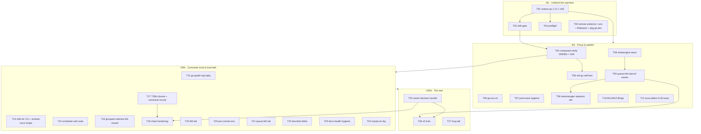

# SUPERB — Unblock · Prove · Deliver: Pareto Execution Plan (post-11th-audit)

**Date:** 2026-09-22 01:25 CEST
**Mandate:** owner directive (paste_1): full Pareto breakdown (1%→51%, 4%→64%, 20%→80%, +20%→100%), ALL TODO rows planned at 30–100min tasks, top tier micro-broken to ≤12min, sorted by importance/impact/effort/customer-value, execution graph, then commit + push (push explicitly authorized by the directive).
**Input:** `TODO_LIST.md` @ 2026-09-22 01:22 (131 open + 28 BLOCKED rows across 25 sections), rebuilt by the 11th docs-health pass (report: `docs/status/2026-09-22_01-20_docs-health-eleventh-pass-full-audit.md`).
**Companion skill:** pareto-planning (its HTML default is overridden by the directive's explicit `.md` + mermaid request — the repo's standing override rule).

## Situation snapshot (what changed in the last 2 hours)

1. **Master is PUSHED** (`origin/master` == `20a0e2f32`) — the 3-day push-decision row is moot; every "push-gated" CI-evidence task is now LIVE.
2. **The repo is still RED for workspace builds:** 93 go.mod/go.work files sit at `go 1.27` (third downgrade wave `4a540b02c`); a concurrent session restored 3–4 of them. Root cause is confirmed (`go 1.27` + deps requiring ≥1.27.1 → `GOTOOLCHAIN=auto` resolves 1.27.0 → hard fail). NOTHING else in this plan matters until the contract is restored AND mechanically locked.
3. **A concurrent goal-closure lane is ACTIVE** (`2026-09-22_01-19` report): G-T09..T14 executed (F031 shipped → cqrs-lint 207 rules; `WithDefaultLimit` shipped; G-T14 ruled Option C), TODO/CHANGELOG/goldens updated through ~01:15. **This plan does not touch that lane's files while it is live** (guardrail G3).
4. **T18b chain is ARMED** (quiet-window-gated closure → campaign → root-cause). Do not disturb; only watch + record.
5. CI billing is still broken (every paid job dies in 3–7s) — remote evidence will be partial (release.yml legs are free-tier).

## Pareto reasoning

The single deepest blocker is the **broken toolchain contract + no mechanical lock** — it breaks every build, lint leg, coverage gate, and example test at once, and it has now struck THREE times because nothing enforces it. Second deepest: **unproven release state** (4 tags cut but Releases/pkg.go.dev/CI unverified; ~7 tag waves queued in `[Unreleased]`). Third: **consumer trust** (go-graph-rag answered nowhere, skill refs teach pre-v4.9.0 shapes, one example untested). Everything else is valuable but downstream of those three.

---

## Tier 1% → 51% — UNBLOCK THE MACHINE (5 tasks, ~4.2h)

| ID | Task | Impact | Effort | Customer value | Why it's the 1% |
|----|------|--------|--------|----------------|-----------------|
| T01 | **Restore the `go 1.27.1` contract** — sed the 93 downgraded go.mod/go.work files back, `go mod tidy` only where build demands it, verify workspace build + `#test-examples` compile | Critical | 30m | Every consumer build + every gate | The tree is RED; everything gates on it |
| T02 | **go.work drift gate** — extend `check-go-version.sh`: `go.work go >= max(module go)`; wire into `#verify` head, nightly, and (ruling-permitting) pre-commit; CI=true self-test leg | Critical | 60m | Ends the 3×-recurring corruption class | Vigilance failed 3×; only a gate closes it |
| T03 | **Remote evidence sweep** — `gh run list` + the 4 GitHub Releases rendered + release-notes curation for system/v4.9.0 + pkg.go.dev spot-check (`On`, `ErrRacySaveRefused`) | High | 45m | Release trust | The wave is pushed but unproven |
| T04 | **Composed `#verify` re-record** — `preflight-composed.sh && can-run-composed-gate --wait-loop && nix run .#verify` in a quiet window (covers v4.9.0 wave + T01 + md-go wiring + F031) | Critical | 100m | The repo's standing trust floor (S03 is 2 days + 5 gate changes stale) | One green run re-proves the whole chain |
| T05 | **`scripts/go-env.sh` + adoption** — env chain in one sourced file; adopt in gate scripts + the ambient-PATH-fragile flake apps (`#check-coverage` class) | High | 60m | Every future session stops burning rounds on GOTOOLCHAIN | 4 sessions asked; the incident recurred in THIS plan's snapshot |

## Tier 4% → 64% — PROVE & PUBLISH (7 tasks, ~9h)

| ID | Task | Impact | Effort | Value |
|----|------|--------|--------|-------|
| T06 | **md-go `--self-test`** — planted fixture tree, golden message shapes, mutation-tested; + nightly-gates wiring + FEATURES gates row + release-checklist mention | High | 90m | The repo's own "gates ship with self-tests" convention |
| T07 | **Post-wave hygiene** — `pin-sweep.sh --check` pass; V007 `cqrs-lint-examples` over all six examples; V006 version-set goldens vs new tags; explain + decide the 11 tool-heuristic skips (+ `--fail-on-skipped` ruling) | High | 90m | Keeps the just-shipped wave honest |
| T08 | **metaengine tag wave** — publish G-T12 (`BackfillPlannedTables`) + G-T13 (ADTSet parity) + `ScanScoredVector`/`RowScanner`/adttest helpers; mysql VM adttest leg in a quiet window; golden + CHANGELOG cut | High | 100m | Consumers get the Goal-closure surface from tags |
| T09 | **queue-family tag wave** — queue/mysql + `testutil/mysqltestcontainer` + scheduling/engine (`ErrEngineNotDueClaimer`) + encryption docs/goldens + cqrs-lint typed-info tier (P014/F090/F091/C008/C013/C035) + cqrs-upgrade `--strict` + benchkit/cqrs-bench; then strip taskmanager's four sibling replaces | High | 100m (×2 waves) | Clears the biggest `[Unreleased]` backlog |
| T10 | **M11/M12 upstream filings** — exhaustruct_v5 panic, go/types+x/tools race, turso-go native-lib family (owner-approved): fresh repros, github-voice drafts, file | High | 90m | Pays the ecosystem forward; unblocks pinned deps |
| T11 | **Turso defect A+B upstream issue** — the verified draft exists; onset-boundary characterization pass, then file (owner-approval gate → this plan's owner bundle Q4) | High | 60m | Every grouped-matview consumer is silently wrong today |
| T12 | **md-go gate wiring tail + version stamp** — ARCHIVE_SEGMENT mutation test; packaged `--version` `dev` fix; host-binary catch-up note | Medium | 45m | Closes the gate's own TODO tail |

## Tier 20% → 80% — CONSUMER TRUST & LOUD TAILS (12 tasks, ~19h)

| ID | Task | Impact | Effort | Value |
|----|------|--------|--------|-------|
| T13 | **Reply to go-graph-rag** — #3/#5 shipped in v4.9.0; github-voice reply + re-test invite | High | 30m | The only live consumer, answered |
| T14 | **Skill-ref `.On` sweep + at-least-once recipe** — core.md/recipes.md fences + recipes catalog entries + `docs_compile_test.go` mirror + goal README check; dedup/at-least-once fold recipe in recipes+readmodels; getting-started canary README note | High | 100m | Docs teach the blessed v4.9.0 shapes |
| T15 | **scheduler-otel-status suite** — minimal claim-flow test (or drop the claim everywhere) | Medium | 60m | "All examples tested" becomes true |
| T16 | **Turso grouped-matview fail-closed** (feedback #2) — `WithKnownGroupedViewBug`-style opt-in + test | High | 60m | Silent-wrong-results class dies |
| T17 | **T18b closure + canonical record** — watch the armed chain land green; write `docs/benchmarks/2026-09-20-21_t18b-record.md` + gate-semantics ADR + calibration case-study appendix; retire `/var/tmp/t18b` copies | Critical | 100m | Ends a 6-report arc with one durable record |
| T18 | **T18b chain hardening** — systemd-user-unit/cron supervision, results-file polling, PHASE markers (post-closure; rides T17) | High | 60m | The arc stops being one reboot from stranded |
| T19 | **W0 verification tail (slices a–e, g–j)** — CI=true legs audit, empty-`go list` sweep, check-go-version into verify-ci, preflight growth, lock consumers, coverage Tier-2, lock docs, api-stability spot-verify, 18:38+23:33 downgrade root-cause | High | 100m ×2 | The guard wave gets its evidence |
| T20 | **Pre-commit hook env hygiene** — inject env chain or GOWORK=off per staged module (the broken-workspace-build-masking hole) | High | 60m | Authored commits stop needing `--no-verify` |
| T21 | **Queue M4 verification tail (a–f)** — deadlockBackoff pin, forced-deadlock test, skip-path proofs, clock seam, wart, parallel-migrate sweep, CI legs | Medium | 100m ×2 | The queue family earns its tags |
| T22 | **Benchkit verification debts (a–i)** — RunSuiteRepeated test, cov% through benchstat, teardown-order, NOISE_HEADLINE tripwire, list-phases map, `--progress` README row, API tours, guard tightening, teardown noise | Medium | 100m ×2 | The polish wave's exports get coverage |
| T23 | **docs-health hygiene** — index-vs-disk gate (canonical-facts extension), harvest-ledger artifact, pass checklist → crush-config suggestion | Medium | 60m | The 9th/10th/11th passes' shared index-rot class dies |
| T24 | **Real `#integration-mysql-vm` leg + F52** — hardened `vm-mysql.sh` under fire; AGENTS integration rows updated (quiet window) | Medium | 100m | M10's missing proof run |

## +20% → 100% — THE REST (5 grouped programs + owner bundle)

| ID | Program | Contents (TODO sections covered) | Effort |
|----|---------|----------------------------------|--------|
| T25 | **Owner-decision bundle** — ONE consolidated ruling session (memos exist for nearly all): G-T02 direction ruling → ADR-0146 · M20 ratifications (SingleWriter, AggregateOn, routing v1) · claiming V006 · `#test-examples`-in-verify · T18b deadline-lapse · 350-line policy · host ceiling · F040 branch protection · CI billing · daemon `--no-verify` root-cause go-ahead · foreign-lint policy · Zenoh go/no-go · ADR-0139 4 questions · Turso DSN strict + sync/replica + upstream (a–c) · dgraph one-RPC + CapabilityGaps · release-policy Q3 · S008/S009 severity · ERRAUDIT_PAT · MySQL-8 VM · `mysqlengine.Dialect()` · SA1019 · stale-pin policy · vulncheck placement · tracing omitempty · composite-runners fate · goal-shaped pg-e2e CI leg · weekly docs-health cadence | Critical | 30m memo-prep + owner time |
| T26 | **v5 train** — ADR-0123 deletions (Materialize, RelationalProjection+view, GraphProjection, Bundle+presets, ADR-0126 shells, BuildWhereClause), `NewStreamRef` validation, transport deletions, tombstone-API deletion, sweep §4 renames tail, ADR-0139 implementation, E1–E15 items, systemtest split (feedback #4), V5-MIGRATION-GUIDE expansion, scan-default flip (G-T14 ruled Option C — execute at the cut), DeferClose-twin note, FEATURES 🧪→✅ flips (G-T25), cut v5.0.0 | High | multi-wave, L |
| T27 | **Long tail (all remaining rows)** — temporal tails (property tests, restart soak, bigtable decisions, pebble/bbolt scope, fuzz, README notes, adapter stamp, soak run) · CV rows (FilterContains, Forever-mapping, parity gate, tuned-tier bench) · matview v2 surface + AggregateOn impl · cqrs-lint audit follow-ups + FP-sweep refresh · calibration campaigns (SearchQuery count=5, dgraph re-anchor) · bench-gate single-mention tail (10) · release-tooling polish tail · watermill NATS leg + upstream-latests · goal-closure G-T25 gates · md-go fleet/version tails · Green MySQL-VM shuffle replay · CI-tail remote legs · CSP/asyncapi owner rows · macOS/ephemeral verifications · LSP/gopls env fix · `/mnt/buildcache` monitoring · buildcache/fmt debt · ROADMAP raw ideas as they graduate | Medium | multi-session |

**Coverage check (all 25 TODO sections → tasks):** Universal-Substrate→T01/04/17/18/26 · Queue→T09/21/25 · Command-side→T25/26 · Reset-stall→T27 · Turso→T11/16/25/27 · Cordis→done rows · cqrs-lint→T07/09/27 · Release/Tagging→T03/07/08/09/25 · Metaengine→T08/16/27 · CI→T02/03/19/20/24/25/27 · Code-Quality→T24/27 · v5→T26 · Docs-truth→T14/23/12 · benchkit→T09/22/27 · CV→T27 · Goal-closure→T13(concurrent lane)/25/26 · Vector→done · Watermill→T27 · md-go→T06/12 · Temporal→T27 · go-graph-rag→T13/15/25 · 92-tag-tail→T03/07/10/19/27 · Declined→guard (never planned). **Every open row is mapped.**

---

## Micro-breakdown — tiers 1% + 4% at ≤12min granularity

| # | Micro-task | Parent | Est |
|---|-----------|--------|-----|
| M01 | Snapshot current directives (`for f in go.work $(fd go.mod)…`) → list of 93 targets; confirm 3 restored files stay untouched | T01 | 6m |
| M02 | Sed `go 1.27` → `go 1.27.1` across the 93 files (go.work last) | T01 | 6m |
| M03 | Workspace build: `go build ./...` (env chain); record | T01 | 10m |
| M04 | Spot-module tests: system + metaengine + one example GOWORK=off | T01 | 10m |
| M05 | `#test-examples` compile pass (test run optional if load high) | T01 | 10m |
| M06 | Commit T01 (authored, phase boundary) | T01 | 4m |
| M07 | Write `check-go-version.sh` max() assertion + fixture self-test | T02 | 12m |
| M08 | Wire into `#verify` head + nightly `Go version contract` step | T02 | 8m |
| M09 | `CI=true` self-test leg + commit | T02 | 6m |
| M10 | `gh run list --limit 15` — triage the first post-push runs; note billing-dead legs | T03 | 8m |
| M11 | Verify 4 GitHub Releases rendered (`gh release view` ×4); curate system/v4.9.0 notes (headline: fluent `.On` + fail-closed Save) | T03 | 12m |
| M12 | pkg.go.dev spot-check system v4.9.0 (`On`/`ErrRacySaveRefused`/`WithRacySave`); record verdict | T03 | 8m |
| M13 | Record T03 evidence in TODO row + CHANGELOG Unreleased (docs-only line) | T03 | 4m |
| M14 | `bash scripts/preflight-composed.sh` (cheap phases first) | T04 | 12m |
| M15 | `nix run .#can-run-composed-gate -- --wait-loop` (background, deadline 2h) | T04 | 6m |
| M16 | `nix run .#verify` composed run; log phases + durations | T04 | 12m+gate |
| M17 | Record S04 (date/commit/durations) in the composed-verify TODO row; strike with evidence | T04 | 6m |
| M18 | Write `scripts/go-env.sh` (GOTOOLCHAIN=auto + cache chain) + header doc | T05 | 10m |
| M19 | Source it in benchmark-regression.sh, quiet-window-run.sh, nightly-bench.sh, check-coverage path | T05 | 12m |
| M20 | Self-test: break env → gates still green; commit | T05 | 8m |
| M21 | md-go self-test: fixture tree skeleton + PATH-stub binary | T06 | 12m |
| M22 | Golden message shapes (green/new-error/policy/dirty-tree) in `scripts/testdata/` | T06 | 12m |
| M23 | Mutation legs (strip marker → fails; live path in baseline → fails) | T06 | 12m |
| M24 | Wire into `#check-release-scripts`; FEATURES gates row + release-checklist line | T06 | 10m |
| M25 | `pin-sweep.sh --check` repo-wide; triage stale pins | T07 | 12m |
| M26 | `cqrs-lint-examples` (V007) over all six examples; fix advisories | T07 | 12m |
| M27 | Regenerate taskmanager V006 golden vs new tag set | T07 | 6m |
| M28 | Investigate the 11 auto-skips (`-v` listing); document mechanism in the review-adjacent doc | T07 | 12m |
| M29 | Decide + encode `--fail-on-skipped` (strict vs tolerant) per M28 findings | T07 | 8m |
| M30 | Pre-tag module tests: metaengine + engines (GOWORK=off) | T08 | 12m |
| M31 | Cut metaengine tag (dry-run → cut → push → `--smoke`) | T08 | 12m |
| M32 | Update `[Unreleased]` → wave section (marker-anchored script); `check-changelog-symbols` | T08 | 10m |
| M33 | Queue-wave pre-tests (queue/mysql, testcontainers, scheduling/engine) | T09 | 12m |
| M34 | Cut queue-family tags in dependency order + smoke each | T09 | 12m |
| M35 | cqrs-lint typed-info + cqrs-upgrade + benchkit tags + smoke | T09 | 12m |
| M36 | Strip taskmanager's four sibling replaces; standalone build proof | T09 | 12m |
| M37 | M11 filing 1: exhaustruct_v5 repro + draft + file | T10 | 12m+ |
| M38 | M11 filing 2: go/types+x/tools race repro + file | T10 | 12m+ |
| M39 | M12 filing 3: turso-go hash-mismatch + lazy-init repros + file | T10 | 12m+ |
| M40 | Turso defect-A onset characterization (run `-tags ivmrepro` matrix; tabulate) | T11 | 12m |
| M41 | Finalize the issue draft with the boundary table; file (post owner-Q4) | T11 | 10m |

(M-tasks for the 20% tier are deliberately NOT pre-broken here — they get their own micro-pass when their wave starts, so the plan doesn't rot. T13–T24 are each 1–2 focused sessions.)

---

## Execution graph

**Critical path:** T01 → T02 → T04 → T08 → T09 → T26. **Parallel-friendly:** T03/T05/T06/T07/T10/T11/T13–T16/T19–T24 run independent of the path. **T18b watcher:** never blocks the plan — it fires autonomously; T17 only RECORDS.

## Guardrails (do not verschlimmbesser)

1. **Never touch the concurrent goal-closure lane's files** (`system/evolutions*`, `metaengine/set/backfill*`, cqrs-lint F031, goal-shaped example) while its session is live — re-read its report's close-out state first.
2. **Never disturb the armed T18b chain** (`/var/tmp/t18b/` pollers); only watch, record, then harden AFTER green.
3. **T01 is sed + build-verify only** — no `go mod tidy` sweeps beyond what the build demands (tidy churn = the collision class).
4. Tags only via `tag-release.sh`/`batch-release.sh`, dependency-ordered, `--smoke` after each, CHANGELOG cut in the same wave.
5. `trash`, never `rm`; `git mv`, never plain `mv`; no `git reset`/`checkout`; verify-lock honored (`#verify` exclusive).
6. Owner-gated rows (T25 bundle) get memos and WAIT — no unilateral rulings.
7. If a gate goes red for a foreign concurrent session's file: disclose + hands-off (pending the owner's foreign-lint ruling).

## New tasks surfaced by this plan (→ TODO_LIST on next harvest)

- F150: watch + triage the first post-push CI runs (remote evidence now possible) — folded into T03.
- F151: FEATURES/ROADMAP "206 rules" → 207 (F031) drift fix — folded into T14's doc pass.
- F152: verify goal-shaped `TestDocs_ReadmeEvolutionFence` green post-T01 (the 11th pass's one unverified fence edit) — folded into T01/M05.
