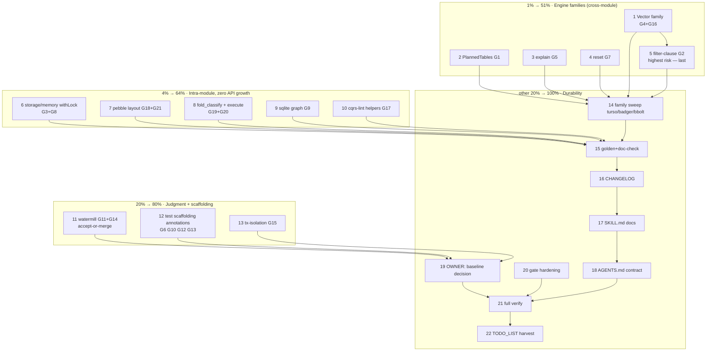

# SUPERB Plan: t4 Clone Elimination Campaign (art-dupl type-aware, 21 actionable groups)

| | |
| --- | --- |
| **Created** | 2026-09-23 00:03 CEST |
| **Input** | `art-dupl --sort total-tokens -t 4 --type-aware --html` → **21 actionable groups** (45 occurrences, 192 tokens; 42 production / 3 test; 1384 detected, 1363 suppressed) |
| **Predecessor** | 2026-09-22 session killed the t7 family (`MapScanKeyValues` ×4 engines, `MultiGroupedAggregate` ×3) → `metaengine.ScanKeyValuesPage/ScanLimit/CursorArg/ScanGroupedAggregates`. Status: `docs/status/2026-09-22_23-49_metaengine-scan-family-dedup.md` |
| **Repo state at authoring** | working tree clean; `check-duplication` (t3 baseline gate) red with 69 pre-existing groups (baseline pinned 2026-09-18, 60 groups) — decision pending with owner |
| **Hard rule** | **No verschlimmbessern.** Every extraction must preserve byte-identical error strings (label-prefix pattern), respect dep-isolated go.mod boundaries, keep functions ≤30 lines / files ≤350, regen api golden in the same change, and pass the touched modules' full test suites before moving on. |

---

## 1. Full Inventory (all 21 actionable groups @ t4)

### A. Engine cross-module families (6 groups, 14 occurrences) — metaengine core owns shared plumbing

| ID | Family | Sites | Prio | Verdict |
| --- | --- | --- | --- | --- |
| G1 | `PlannedTables` listing body (sort + COUNT loop) | duckdbengine/planned_parity.go:179 · pgengine/planned_tables.go:23 · sqliteengine/planned_parity.go:148 | low | **Extract** → `metaengine` helper (query per dialect is one COUNT string; body identical) |
| G2 | filter-clause builder (`values, ok := f.Value.([]any)` + WHERE/AND + placeholders) | mysqlengine/planned_scan.go:55 · pgengine/planned_scan.go:56 · sqliteengine/filter_clause.go:55 | low | **Extract** → shared clause builder in core (dialect param: placeholder style) |
| G4 | `VectorSearch` drain (rows→VectorResult) | duckdbengine/vector.go:140 · sqliteengine/vector.go:163 | **medium** | **Extract** → `ScanVectorResults(rows, label)` (same class as today's fix) |
| G5 | `explain.go` body | mysqlengine/explain.go:31 · pgengine/explain.go:31 | **medium** | **Extract** (check duckdb for same shape first) |
| G7 | `reset.go` body | mysqlengine/reset.go:65 · pgengine/reset.go:60 | low | **Extract** (check other engines first) |
| G16 | `VectorInsert` dimension-probe + metadata marshal | mysqlengine/vector.go:54 · sqliteengine/vector.go:88 | **medium** | **Extract** → shared probe/prepare helper (`CheckVectorDimension` already core; wrap probe+marshal) |

### B. Intra-module mechanical pairs (7 groups, 14 occurrences) — zero API growth, local helpers

| ID | Pair | Sites | Verdict |
| --- | --- | --- | --- |
| G3 | lock-run tail (`s.mu.Lock(); defer; return fn()`) | storage/memory: checkpoint.go:60 · log_store.go:77 · snapshot.go:54 | **Extract** local `withLock` (already idiomatic pattern in this pkg per AGENTS §14) |
| G8 | checkpoint/snapshot variant tail | storage/memory: checkpoint.go:76 · snapshot.go:71 | **Extract** (likely folds into G3's helper) |
| G9 | graph BFS step | sqliteengine: graph.go:138 · graph_undirected.go:87 | **Extract** local neighbor-step helper (judgment on structure) |
| G18 | index-key build A | pebbleengine/layout_planner.go:134 vs 182 | **Extract** local helper |
| G21 | index-key build B | pebbleengine/layout_planner.go:148 vs 193 | **Extract** local helper (may merge with G18) |
| G19 | key-extractor init | metaengine/fold_classify.go:82 vs 94 | **Extract** local helper |
| G20 | inputField resolution | metaengine/execute.go:402 vs 439 | **Extract** local helper |

### C. Tooling (1 group)

| ID | Pair | Sites | Verdict |
| --- | --- | --- | --- |
| G17 | import-contains helper | cmd/cqrs-lint/pkg/rules/architecture/helpers.go:36 · testrules/helpers.go:29 | **Extract** into one shared internal helpers package (same module, no boundary issue) |

### D. watermill (2 groups) — parallel command/event twins, judgment needed

| ID | Pair | Sites | Verdict |
| --- | --- | --- | --- |
| G11 | protocol decode/validate | watermill/command_protocol.go:78 · protocol.go:131 | **Judge**: command/event symmetry is deliberate documentation; likely `//art-dupl:accept` with rationale |
| G14 | bus Ack/continue loop | watermill/command_bus_internals.go:66 · event_bus_internals.go:87 | **Judge**: the two bodies carry DIFFERENT safety comments (Ack-vs-Nack rationale) — likely accept, NOT merge (merging would delete load-bearing comments) |

### E. Test scaffolding (5 groups, 9 occurrences)

| ID | Pair | Sites | Verdict |
| --- | --- | --- | --- |
| G6 | conformance harness block | queue/conformance: lifecycle.go:268 · retry.go:321 | Accept-annotate (same-package test scaffolding) or local helper |
| G10 | testcontainer setup | testutil/mysqltestcontainer:54 · pgtestcontainer:77 | Accept-annotate (dep-isolated testutil twins — rule-19 class) |
| G12 | assertion util | catalog/internal/cattest:10 · cmd/cqrs-upgrade/main_test.go:329 | Accept-annotate (different modules, cross-module test dep not worth it) |
| G13 | store-suite assertion | command/commandtest:147 · event/v4/eventtest:45 | Accept-annotate (dep-isolated sibling modules) |
| G15 | tx-isolation chan setup | metaengine/adttest:31 · pgengine/tx_isolation_test:34 | Judge: adttest IS the shared harness — promote the pg local copy to use adttest (may already; verify) else accept |

---

## 2. Pareto Breakdown

### 1% → 51% (do FIRST — the single highest-leverage move)
**Consolidate the engine read/write plumbing families (A: G1, G2, G4, G5, G7, G16).**
Six extractions into `metaengine` core, one API-review, one test matrix. Kills 6/21 groups and 14/45
occurrences, all cross-module (the highest-maintenance-cost class: a bug fix must today be replicated
in 2–3 engines). These are also 4 of the 12 medium-priority groups. Everything needed already exists:
the label-prefix helper pattern, `SQLExec`, `DeferClose` — proven twice this week.

### 4% → 64%
**Intra-module mechanical extractions (B: G3, G8, G9, G18, G19, G20, G21 + C: G17).**
Eight groups, zero public-API growth, pure local refactors, each independently testable. Zero risk of
boundary violations. Kills 8 more groups → 14/21 (67%) and 28/45 occurrences (62%).

### 20% → 80%
**Judgment groups (D: G11, G14) + test scaffolding triage (E: G6, G10, G12, G13, G15).**
Most of these are INTENTIONAL similarity (dep-isolated twins, parallel command/event semantics with
load-bearing comments, same-package test scaffolding). The 80% deliverable here is honest
`//art-dupl:accept` annotations with one-line rationales — NOT forced merges. Only G15 might be a real
promotion (pg local test → adttest harness).

### The other 20% → 100%
1. **Family completeness sweep**: turso + badger/bbolt/pebble checked against every new helper (the
   2026-09-22 session's miss: mysql/pg were found late; don't repeat).
2. **API golden + `TestEvery` + doc-check after each family** (repo procedure).
3. **CHANGELOG `[Unreleased]`** for new exports + `check-changelog-symbols`.
4. **SKILL.md/references docs**: new helpers documented as the canonical engine-authoring pattern.
5. **AGENTS.md internal contract**: "engine scan/aggregate/vector reads delegate to metaengine helpers".
6. **Baseline decision (OWNER)**: re-pin `.art-dupl-baseline.json` (t3, 69 pre-existing + campaign
   residue) on a committed tree, or triage-first. Blocks CI-green. Ask Lars.
7. **Gate hardening**: `check-duplication` silently SKIPs without art-dupl in PATH; provision from
   flake, fail hard.
8. **Full `nix run .#verify`** once the parallel eventcatalog session lands (their file-size offender
   + typecheck errors are currently mixed into repo-wide gates).

---

## 3. Comprehensive Plan (30–100 min tasks, ALL todos, sorted by importance/impact → effort → customer-value)

| # | Task | Outcome | Est | Impact | Risk | Depends |
| --- | --- | --- | --- | --- | --- | --- |
| 1 | Vector family extraction: `VectorSearch` drain (G4) + `VectorInsert` probe/marshal (G16); sweep duck/pg for same shape first | 2 core helpers, 4+ engines rewired | 90 | High | Med | — |
| 2 | `PlannedTables` trio → core helper (G1) | 1 helper, 3 engines | 45 | High | Low | — |
| 3 | explain pair → core helper (G5, check duckdb) | 1 helper, 2–3 engines | 45 | Med | Low | — |
| 4 | reset pair → core helper (G7, check others) | 1 helper, 2–4 engines | 30 | Med | Low | — |
| 5 | filter-clause builder trio → core (G2, dialect param) | 1 builder, 3 engines | 100 | High | **High** | 1 (pattern familiarity) |
| 6 | storage/memory `withLock` consolidation (G3+G8) | local helper, 3 files | 30 | Med | Low | — |
| 7 | pebble layout_planner pairs (G18+G21) | local helpers | 45 | Med | Low | — |
| 8 | metaengine fold_classify (G19) + execute.go (G20) | local helpers ×2 | 60 | Med | Low | — |
| 9 | sqliteengine graph BFS pair (G9) | local helper | 45 | Med | Med | — |
| 10 | cqrs-lint unified helpers pkg (G17) | one internal pkg | 30 | Med | Low | — |
| 11 | watermill G11+G14 judgment: read both fully, accept-annotate with rationale (or extract if truly mergeable WITHOUT losing comments) | 2 annotations/merges | 30 | Med | Med | — |
| 12 | Test scaffolding triage G6/G10/G12/G13: accept-annotate with rule-19 rationale | 4 annotations | 30 | Low | Low | — |
| 13 | G15 judgment: promote pg tx-isolation test to adttest or accept | 1 promotion/annotation | 30 | Low | Low | — |
| 14 | Family completeness sweep: turso/badger/bbolt/pebble vs every helper from tasks 1–5 | no stragglers | 45 | High | Low | 1–5 |
| 15 | API golden regen + `TestEvery` + doc-check after families land | golden current | 30 | High | Low | 1–10 |
| 16 | CHANGELOG `[Unreleased]` entries + `check-changelog-symbols` gate | changelog honest | 30 | Med | Low | 15 |
| 17 | SKILL.md references: document helper canon (recipes/modules/faq) | consumers informed | 60 | Med | Low | 15 |
| 18 | AGENTS.md internal contract entry: engine reads delegate to core helpers | convention durable | 15 | Med | Low | 17 |
| 19 | **OWNER DECISION**: baseline re-pin (69 pre-existing + residue) vs triage-first | gate green path | 30 | **High** | Med | 1–13 |
| 20 | Gate hardening: art-dupl nix-provisioned, no silent SKIP | deterministic gate | 45 | Med | Med | — |
| 21 | Post-campaign verify: t4+t3+t7 scans, per-module tests, `#verify` (after parallel session lands) | all green | 100 | High | Low | all |
| 22 | Update TODO_LIST.md from this plan (docs-health HARVEST) | living source current | 15 | Low | Low | 21 |

**Sorting rationale:** tasks 1–5 (engine families) are 1%/4% — highest maintenance-cost reduction per
hour and directly customer-visible (engine consistency + trust). 6–10 are safe mechanical wins. 11–13
are judgment (mostly annotations). 14–22 make the change durable and the gates trustworthy. Nothing
here touches the 69 pre-existing groups except via the explicit owner decision (19).

---

## 4. Micro Plan (≤12 min per task, ALL todos, sorted)

Columns: ID · action · min · impact · dep. Timeboxes assume warm caches; `source scripts/go-env.sh` before every go command; commit after each family (authored, not daemon).

**Family: Vector (task 1)**
| ID | Action | min | Impact | Dep |
| --- | --- | --- | --- | --- |
| 1.1 | Read all 4 engines' vector.go fully; map exact diffs (drain + probe) | 10 | High | — |
| 1.2 | Sweep duck/pg/mysql/sqlite for VectorSearch/VectorInsert family completeness (rg) | 6 | High | 1.1 |
| 1.3 | Write `ScanVectorResults(rows, label)` in metaengine/scan.go (≤30 lines) | 12 | High | 1.1 |
| 1.4 | Write `PrepareVectorInsert` (probe + dimension lock + metadata marshal) helper | 12 | High | 1.1 |
| 1.5 | Rewire duckdbengine vector.go to helpers; keep label strings identical | 12 | High | 1.3,1.4 |
| 1.6 | Rewire sqliteengine vector.go | 12 | High | 1.3,1.4 |
| 1.7 | Rewire mysqlengine vector.go | 12 | High | 1.4 |
| 1.8 | Rewire pgengine vector.go (if shape matches) | 12 | High | 1.3,1.4 |
| 1.9 | Build + full test all touched engine modules (GOWORK=off) | 10 | High | 1.5–1.8 |
| 1.10 | t4 scan: confirm G4+G16 gone; no new groups introduced | 5 | High | 1.9 |
| 1.11 | api golden regen + TestEvery; authored commit "vector family" | 8 | High | 1.10 |

**Family: PlannedTables (task 2)**
| 2.1 | Read trio bodies; diff placeholders/accessors (e.db vs conn) | 8 | Med | — |
| 2.2 | Write core helper (sort+list+COUNT, SQLExec param, label) | 12 | High | 2.1 |
| 2.3–2.5 | Rewire duck, pg, sqlite (12 min each) | 36 | High | 2.2 |
| 2.6 | Test 3 modules + golden + t4 verify + commit | 10 | High | 2.5 |

**Family: explain (task 3)**
| 3.1 | Read mysql/pg explain.go; check duckdb for same shape | 8 | Med | — |
| 3.2 | Extract core helper | 12 | Med | 3.1 |
| 3.3–3.4 | Rewire both (+duck if applicable) | 24 | Med | 3.2 |
| 3.5 | Test + t4 + commit | 8 | Med | 3.4 |

**Family: reset (task 4)**
| 4.1 | Read mysql/pg reset.go; check badger/bbolt/pebble/sqlite/duck | 8 | Med | — |
| 4.2 | Extract core helper | 10 | Med | 4.1 |
| 4.3–4.4 | Rewire engines | 24 | Med | 4.2 |
| 4.5 | Test + t4 + commit | 8 | Med | 4.4 |

**Family: filter-clause (task 5 — highest risk, do after pattern familiarity)**
| 5.1 | Read all 3 clause builders fully; enumerate dialect deltas (backticks, $n, ?, ::casts) | 12 | High | — |
| 5.2 | Design dialect-param shape (review before coding; ADR-0126 policy-injection style) | 12 | High | 5.1 |
| 5.3 | Implement builder in core with per-dialect placeholder func | 12 | High | 5.2 |
| 5.4 | Unit-test builder: table-driven across 3 dialects + edge (empty values, first/non-first clause) | 12 | High | 5.3 |
| 5.5–5.7 | Rewire mysql, pg, sqlite | 36 | High | 5.4 |
| 5.8 | Full tests ×3 + t4 + golden + commit | 10 | High | 5.7 |

**Intra-module (tasks 6–10)**
| 6.1 | storage/memory: read 3 files; write `withLock` helper; rewire 3 sites | 12 | Med | — |
| 6.2 | Test storage/memory (withReadLock patterns intact) + t4 (G3,G8 gone) + commit | 10 | Med | 6.1 |
| 7.1 | pebble layout_planner: read both index-build loops; extract key-build helper | 12 | Med | — |
| 7.2 | Rewire 4 sites (G18+G21); test pebbleengine; t4; commit | 10 | Med | 7.1 |
| 8.1 | metaengine fold_classify: extract extractor-init helper; rewire 2 sites | 10 | Med | — |
| 8.2 | metaengine execute.go: extract inputField-resolution helper; rewire 2 sites | 10 | Med | — |
| 8.3 | Test metaengine core; t4 (G19,G20 gone); commit | 8 | Med | 8.1,8.2 |
| 9.1 | sqlite graph: read both BFS loops; judge extract vs accept (structure may differ) | 10 | Med | — |
| 9.2 | Extract neighbor-step helper OR accept-annotate with rationale; test; t4; commit | 12 | Med | 9.1 |
| 10.1 | cqrs-lint: create shared helpers pkg; move import-contains; rewire 2 rules pkgs | 12 | Med | — |
| 10.2 | Test cqrs-lint (module_catalog meta-test!) + lint self-check; t4; commit | 10 | Med | 10.1 |

**Judgment + scaffolding (tasks 11–13)**
| 11.1 | watermill G11+G14: read both pairs fully incl. comments | 10 | Med | — |
| 11.2 | Decide per group: merge (if comments survive) or accept-annotate; apply | 12 | Med | 11.1 |
| 11.3 | Test watermill module; t4; commit | 8 | Med | 11.2 |
| 12.1 | Annotate G6, G10, G12, G13 with `//art-dupl:accept` + one-line rationale (directive ON region's first line!) | 10 | Low | — |
| 12.2 | Verify suppression via t4; commit | 5 | Low | 12.1 |
| 13.1 | G15: check if pgengine test can call adttest harness; promote or annotate | 12 | Low | — |

**Completeness + durability (tasks 14–18)**
| 14.1 | Sweep turso/badger/bbolt/pebble engines for every helper family (rg per function name) | 12 | High | fam 1–5 |
| 14.2 | Rewire any stragglers found (12-min box each, batch) | 12 | High | 14.1 |
| 15.1 | Final api golden regen + TestEvery + doc-check | 10 | High | 14 |
| 16.1 | Write CHANGELOG entries for all new exports | 10 | Med | 15.1 |
| 16.2 | Run check-changelog-symbols; fix any drift | 8 | Med | 16.1 |
| 17.1 | Draft SKILL.md reference updates (recipes + modules + faq) | 12 | Med | 15.1 |
| 17.2 | Run doc-check; commit docs | 8 | Med | 17.1 |
| 18.1 | Add AGENTS.md contract entry (engine reads → core helpers); commit | 8 | Med | 17.2 |

**Gates + owner + verify (tasks 19–22)**
| 19.1 | Present 3-question decision brief to Lars (baseline policy; e.db-vs-conn routing; helper contract status) | 8 | High | fam 1–13 |
| 19.2 | Execute chosen baseline action on a committed tree (re-pin or triage list) | 12 | High | 19.1 |
| 20.1 | Flake: add art-dupl to mkApp deps; remove PATH SKIP branch | 12 | Med | — |
| 20.2 | Test gate via `nix run .#check-duplication` (self-test if exists); commit | 8 | Med | 20.1 |
| 21.1 | Full scan trio: t4 + t3 gate + t7; record numbers in TODO_LIST | 10 | High | all |
| 21.2 | Per-module tests for every touched module (parallel batches) | 12 | High | all |
| 21.3 | `nix run .#verify` once parallel eventcatalog session lands | 12 | High | ext |
| 22.1 | docs-health HARVEST: pull remaining items into TODO_LIST.md | 10 | Low | 21.1 |

**Micro totals:** ~57 tasks · ≈10.5 h of 12-min boxes (realistic with overhead: 2–3 sessions).

---

## 5. Execution Graph

Execution order inside P0: 1 → 2 → 3 → 4 → 5 (filter-clause last: highest dialect risk, benefits
from warm pattern familiarity). P1 runs independent/parallel. An authored commit lands after every
family (NOT daemon-absorbed) — the 2026-09-22 session lost attribution to six `chore:` commits.

## 6. Guardrails (verschlimmbessern prevention)

1. Error strings must remain **byte-identical** (label-prefix pattern) — tests may pin them.
2. Never merge watermill command/event twins if it deletes their (deliberately different) safety
   comments; annotate instead.
3. Annotation directive sits **directly on/above the region's first line** (AGENTS §14 gotcha).
4. Each family: build + full module tests + t4 re-scan + golden regen **before** the next family.
5. No baseline re-pin mid-campaign; only task 19, on a committed tree, after the owner decides.
6. New core exports only where ≥2 engines share code (API budget discipline).
7. `e.db` vs `e.conn(ctx)` accessor per engine preserved as-is (owner question pending — do not
   "fix" transaction routing inside a dedup change).
8. Check for parallel-session commits (`git log`) before repo-wide gates.
