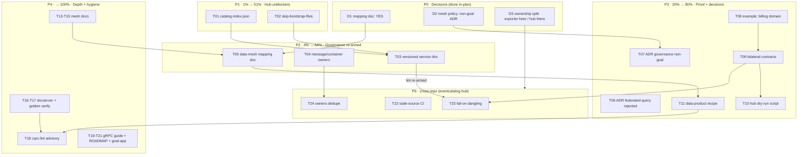

# SUPERB — Data-Mesh & Federation-Hub Pareto Plan

**Date:** 2026-09-23 22:12 · **Author:** planning session (user-prompted Pareto breakdown)
**Inputs:** [`docs/status/2026-09-23_18-09_data-mesh-conformance-assessment-session.md`](../status/2026-09-23_18-09_data-mesh-conformance-assessment-session.md) §f items 1–26, TODO_LIST "EventCatalog exporter options" (T13, routed from SystemNix 2026-09-23), and the session's 3 open questions (resolved as D1–D3 below).
**Goal:** Turn the data-mesh conformance assessment into shipped capability: unblock the federation hub, re-arm federated governance, prove the story with an example, and pin the decisions.

**Verschlimmbessern guard:** every task is additive (new docs, new options, new examples, new lint advisories). No task rewrites existing exporter behavior for existing consumers without a default-preserving option. Nothing here touches v4 API surface destructively.

---

## Decisions (autonomous, user-overridable)

| ID | Question (status report §g) | Decision | Rationale |
|----|------------------------------|----------|-----------|
| D1 | Durable data-mesh mapping doc? | **YES** — write `docs/architecture-understanding/2026-09-23_data-mesh-conformance-mapping.md` | Precedent: Cordis mapping doc (2026-09-10). Cheap, high positioning value, cross-links both ways. |
| D2 | Mesh-level policy enforcement: goal or non-goal? | **Explicit NON-goal for the library** — record as ADR | The repo's gates are repo-local CI + exporter-emitted contracts; mesh policy belongs to the hub. An undecided scope is worse than a recorded boundary. |
| D3 | Where do data-mesh tasks live? | **Exporter-side capabilities here; merge/build/lint-config in `eventcatalog-hub`** | Consistent with the cross-repo rule that routed T13 here: this repo owns what the exporter emits; the hub owns what it merges/renders/enforces. |

---

## Pareto Breakdown

### The 1% that delivers 51%
**T01 + T02 — the federation hub unblockers (T13 pair).** `catalog.index.json` gives the hub machine-readable change detection (PR gates, cheap diffs); `skip-bootstrap-files` ends the fragile first-wins bootstrap merge. Both are fully specified, small, and unblock an external pipeline that exists TODAY (`catalog.home.lan`).

### The 4% that delivers 64%
**T03 + T04 + T05 — governance re-armed + the positioning anchor.** Fixing the versioned/unversioned ref mismatch and emitting message/container owners re-arms the hub's warn-suppressed lint rules — turning "federated computational governance" (the weakest of the 4 principles) from partial to real. The mapping doc makes the whole story durable and quotable.

### The 20% that delivers 80%
**T06–T11 — decisions pinned + the living proof.** Two ADRs (federated-query rejection formalized; governance scope boundary), the multi-bounded-context example (two domains, bilateral contracts, hub-mergeable exports), the data-product recipe, and the harvest routing.

### The other 20% (→ 100%)
**T13–T27 — docs depth, verification, lint, cross-repo hub work.** Contract-evolution and serving-port docs, docserver/api-stability verification, the cqrs-lint advisory, gRPC v5 migration guide, ROADMAP positioning, hub CI niceties, SLA investigation, and the spot-verification of this session's single-source claims.

**Verification facts already established this session (no re-planning needed):** `catalog/docserver` has NO DataProduct rendering (T16 is real work); `recipes.md` has NO data-product recipe (T11 is real work); `example/` has NO multi-bounded-context example (T08–T10 are real work).

---

## Medium Plan — 27 tasks, 30–100 min each (sorted: tier → impact → customer value)

| ID | Task | Tier | Impact | Min | Customer value |
|----|------|------|--------|-----|----------------|
| T01 | Export `catalog.index.json` manifest (id/version/kind/path, deterministic order) + golden test | 1% | Critical | 90 | Hub diffing & PR gates; unblocks catalog.home.lan |
| T02 | `skip-bootstrap-files` export option (default off) + tests | 1% | High | 40 | Ends fragile first-wins bootstrap merge in hub CI |
| T03 | Emit versioned `services/<id>/v<ver>/` dirs; fix `refs/resource-exists`; re-arm hub linter | 4% | High | 90 | Federated contract checking becomes real |
| T04 | Emit `owners` on messages + containers (not just services) + tests | 4% | High | 60 | Re-arms ownership lint; data-mesh ownership story |
| T05 | `docs/architecture-understanding/2026-09-23_data-mesh-conformance-mapping.md` + Cordis cross-links | 4% | High | 80 | Durable positioning anchor (D1) |
| T06 | ADR: federated query engine — rejected (formalize `meta-engine-design.md:116`) | 20% | Med-High | 40 | Decision stops re-litigation; replication stance official |
| T07 | ADR: mesh-level policy enforcement = explicit non-goal (D2) | 20% | Med-High | 40 | Scope boundary recorded |
| T08 | `example/mesh-demo`: second bounded context (billing decider + events + catalog decls) | 20% | High | 90 | The living multi-domain proof |
| T09 | Example: bilateral `Sends`/`Receives` + both export commands + dangling-free coeffects.md | 20% | High | 60 | Proves bilateral-contract rendering rule |
| T10 | Example: hub dry-run union-merge script + README | 20% | Medium | 45 | Reproducible hub onboarding path |
| T11 | recipes.md: "Declare data products + contracts end-to-end" + doc-check catalog entry | 20% | Med-High | 60 | Consumer-facing cookbook for the mesh story |
| T13 | Doc: journal-as-outbox (ADR-016) as the mesh replication mechanism → input ports | 100% | Medium | 40 | Connects CatchUpSubscriber to data-product inputs |
| T14 | Doc: contract evolution — `schema` upcasting ↔ `DataContract` versioning | 100% | Medium | 60 | The "how do contracts evolve" answer |
| T15 | Doc: serving ports — `ServeSSE` + query surfaces as product output ports | 100% | Low-Med | 35 | Completes the product-port model |
| T16 | docserver: render DataProducts (page + nav + test) — verified missing | 100% | Medium | 45 | Docs UI parity with exporter |
| T17 | Verify api-stability golden covers `DataProduct`/`DataContract`; regen if needed | 100% | Low | 30 | API contract hygiene |
| T18 | cqrs-lint advisory: DataProduct without output DataContract | 100% | Medium | 80 | Automated contract-completeness check |
| T19 | gRPC v5 migration guide (sync cross-service contracts → HTTP/SSE/broker) | 100% | Medium | 60 | Unbreaks mesh consumers at v5 |
| T20 | ROADMAP.md: "data-mesh-ready SDK" positioning entry | 100% | Medium | 30 | Honest forward statement |
| T21 | `example/goal-shaped-app`: data-product materialized view via `cqrs.yaml` | 100% | Low-Med | 60 | Operator-side product story |
| T22 | [cross-repo] hub CI: stale-source detection (export-command probe per `sources.json` entry) | 100% | Low | 60 | Hub reliability |
| T23 | [cross-repo] hub CI: fail union-merge on dangling coeffect refs | 100% | Medium | 60 | Mesh-level governance enforcement (complements D2) |
| T24 | [cross-repo] hub: owners/teams dedupe strategy across per-service exports | 100% | Low | 50 | Hub render quality |
| T25 | Investigate EventCatalog SLA/freshness schema support → proposal note | 100% | Low | 35 | Future product-quality fields |
| T26 | Spot-verify 3 single-source claims (watermill brokers, ADR-016 wording, DeploymentConfig fields) | 100% | Low | 30 | Session honesty debt paid |
| T27 | Cross-link: status report ↔ this plan ↔ TODO_LIST ↔ SystemNix hub plan | 100% | Low | 30 | No orphaned artifacts |

*(T12 = HARVEST into TODO_LIST — executed as part of this planning session, see TODO_LIST diff.)*

---

## Fine Plan — 72 tasks, each ≤ 12 min (sorted: parent tier → execution order)

| ID | Parent | Task | Min |
|----|--------|------|-----|
| f01 | T01 | Manifest builder: id, version, kind, path structs + JSON marshal | 12 |
| f02 | T01 | Emit `catalog.index.json` at export root, deterministic ordering | 10 |
| f03 | T01 | Golden-test fixture update (ec-fixture render validation) | 12 |
| f04 | T01 | Doc: hub-side diff usage section in catalog/README | 8 |
| f05 | T01 | Unit test: manifest stable across re-export | 8 |
| f06 | T02 | Add `SkipBootstrapFiles` option field + Exporter wiring | 6 |
| f07 | T02 | Skip logic for `package.json`/`eventcatalog.config.js`/bootstrap files | 8 |
| f08 | T02 | Tests: default preserves current behavior; option omits files | 10 |
| f09 | T02 | CHANGELOG `[Unreleased]` entry | 5 |
| f10 | T03 | Reproduce `refs/resource-exists` in local fixture | 10 |
| f11 | T03 | Emit versioned `services/<id>/v<ver>/index.mdx` layout | 12 |
| f12 | T03 | Update path writers + walk/render tests | 12 |
| f13 | T03 | Verify `@eventcatalog/linter` clean on fixture | 12 |
| f14 | T03 | Note hub `.eventcatalogrc.js` warn-suppression removal | 6 |
| f15 | T04 | `owners` frontmatter on messages | 8 |
| f16 | T04 | `owners` frontmatter on containers | 8 |
| f17 | T04 | Golden/test updates | 10 |
| f18 | T04 | Verify linter owner rules re-armed | 8 |
| f19 | T05 | Mapping doc skeleton: 4-principle table from session findings | 10 |
| f20 | T05 | Module mapping (catalog/system/watermill/schema/signing/encryption) | 12 |
| f21 | T05 | Bidirectional cross-links with Cordis mapping doc | 8 |
| f22 | T05 | doc-check pass over new doc | 6 |
| f23 | T06 | Draft ADR-0146: federated query engine rejected (cite planner design) | 12 |
| f24 | T06 | ADR index entry + meta-engine-design.md cross-ref | 8 |
| f25 | T07 | Draft ADR-0147: mesh policy enforcement non-goal (D2 rationale) | 12 |
| f26 | T07 | Link from status-report gap section | 6 |
| f27 | T08 | Scaffold `example/mesh-demo`: orders + billing domains, go.mod, module wiring | 12 |
| f28 | T08 | Billing decider: events, commands, fold tests | 12 |
| f29 | T08 | Catalog declarations for both domains (domains, services, owners) | 12 |
| f30 | T08 | Compile + per-module test green | 10 |
| f31 | T09 | Bilateral `Sends`/`Receives` declarations | 8 |
| f32 | T09 | Two headless export commands (catalog-export template) | 10 |
| f33 | T09 | Assert coeffects.md dangling-free in example test | 12 |
| f34 | T10 | Union-merge dry-run script in example | 12 |
| f35 | T10 | Example README: hub onboarding walkthrough | 8 |
| f36 | T11 | Draft recipes.md §: DataProduct + DataContract declaration recipe | 12 |
| f37 | T11 | doc-check recipes catalog classification entry | 10 |
| f38 | T11 | Reference the recipe from core.md §3.9 area | 6 |
| f39 | T13 | Draft "journal-as-outbox = mesh replication" section | 10 |
| f40 | T13 | Cross-link ADR-016 + readmodels.md CatchUpSubscriber | 6 |
| f41 | T14 | Draft contract-evolution section (upcasting ↔ contract versioning) | 12 |
| f42 | T14 | Worked versioned-contract example | 10 |
| f43 | T15 | Draft serving-ports section (ServeSSE + query surfaces) | 8 |
| f44 | T15 | Cross-link readmodels/advanced refs | 6 |
| f45 | T16 | docserver DataProduct page handler | 12 |
| f46 | T16 | Nav entry + docserver test | 10 |
| f47 | T17 | Check golden for DataProduct/DataContract; regen if absent | 8 |
| f48 | T17 | Run `TestEvery` meta-tests | 6 |
| f49 | T18 | cqrs-lint analyzer: data-product-without-contract advisory | 12 |
| f50 | T18 | Analyzer tests + rule docs | 12 |
| f51 | T18 | Wire rule into module catalog + self-test | 8 |
| f52 | T19 | Inventory gRPC consumer surface (transport/grpc README + proto) | 10 |
| f53 | T19 | Mapping table: gRPC feature → HTTP/SSE/broker equivalent | 12 |
| f54 | T19 | Migration guide draft + faq.md link | 12 |
| f55 | T20 | ROADMAP entry draft (positioning, honest PARTIAL status) | 8 |
| f56 | T20 | Check against Declined guard — no re-litigation | 6 |
| f57 | T21 | Add cqrs.yaml materialized view serving a data product | 12 |
| f58 | T21 | Example README note | 6 |
| f59 | T22 | [hub] CI probe: run each sources.json export command | 12 |
| f60 | T22 | [hub] Stale-source report output | 10 |
| f61 | T23 | [hub] Parse coeffects.md during union-merge | 12 |
| f62 | T23 | [hub] Fail-build wiring on dangling refs | 10 |
| f63 | T24 | [hub] Owners-dedupe strategy doc | 10 |
| f64 | T24 | [hub] Implement owner union at merge | 12 |
| f65 | T25 | Probe EventCatalog schema for SLA/freshness fields | 10 |
| f66 | T25 | Proposal note (ROADMAP raw idea) | 8 |
| f67 | T26 | Verify watermill broker README claims (NATS/Kafka/Redis paths) | 8 |
| f68 | T26 | Verify ADR-016 outbox wording | 6 |
| f69 | T26 | Verify DeploymentConfig field list (config_types.go:124-205) | 8 |
| f70 | T27 | Status-report addendum: link plan | 6 |
| f71 | T27 | TODO_LIST section pointer (done this session) | 6 |
| f72 | T27 | SystemNix hub-plan cross-reference note | 8 |

---

## Execution Graph

**Wave gates:** P1 done = hub can diff + own bootstrap (verify: golden test green, hub CI dry-run). P2 done = `@eventcatalog/linter` clean without warn-suppression. P3 done = `example/mesh-demo` coeffects dangling-free + both ADRs indexed. P4/P5 close the tail.

## Definition of Done (per task class)

- **Exporter code:** golden tests updated + `cd catalog && GOWORK=off go test ./... -count=1` green + api-stability golden regen if surface changed + CHANGELOG entry for new options.
- **Docs:** `cmd/doc-check` green (zero warnings) + md-go parse gate green; recipes must be catalog-classified.
- **ADRs:** numbered, indexed in `docs/adr/README.md`, cross-linked from origin docs.
- **Example:** per-module `GOWORK=off go test` green + registered in `examplePaths` (NOT testModules).
- **cqrs-lint:** module catalog self-test + analyzer tests green.
- **Final:** `nix run .#verify` clean; then docs-health HARVEST strike-through pass on TODO_LIST rows.
