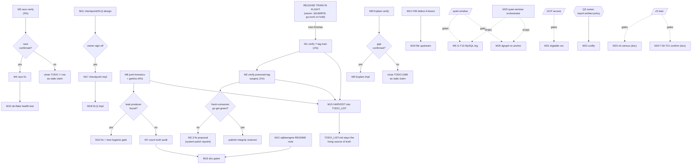

# SUPERB — Publish-Integrity-First Pareto Plan (session backlog)

**Planned:** 2026-09-28 01:26 CEST
**Source backlog:** [`docs/status/2026-09-27_23-43_sqliteengine-metaengine-system-qa-session.md`](../status/archived/2026-09-27_23-43_sqliteengine-metaengine-system-qa-session.md) §f (26 items) + §g (3 owner questions)
**Scope:** EVERYTHING this session surfaced — the full 26-item backlog and the 3 gates. NOT the whole `TODO_LIST.md` (that stays the living source; task M15/HARVEST syncs this plan into it).
**Method:** Pareto (1% → 4% → 20% → other 20%), two granularities (25 medium tasks 30–100 min; 107 micro tasks ≤ 12 min), impact/effort/customer-value sorted, dependency-graph executed.

> **Do-not-verschlimmbessern clause:** this plan schedules ZERO speculative rewrites. Every task either verifies a recorded claim, fixes a verified defect, ships a recorded gap, or records knowledge. Release-train collision is explicitly designed out (see §1).

---

## 1. Repo state at planning time (CRITICAL context)

Observed 2026-09-28 01:26, minutes before writing this plan:

| Observation                                                                                                                                            | Consequence for this plan                                                                                                                                                                      |
| ------------------------------------------------------------------------------------------------------------------------------------------------------ | ---------------------------------------------------------------------------------------------------------------------------------------------------------------------------------------------- |
| `2d1669f78` "chore(release): prep 2026-09-27 wave — CHANGELOG for 7-tag train, drop tursoengine binary garbage" is on `master` (origin already has it) | **The tag wave (old #18) and part of the poisoned-tag surgery (old #11) are IN FLIGHT by the owner.** This plan does NOT duplicate them — it schedules post-flight verification only (M1, M2). |
| `go.work`/`go.work.sum` renamed to `.hold` + module go.mod/go.sum edits in tree; daemon auto-committed them (`fee6ea85f`)                              | `batch-release.sh` mechanics (GOWORK=off builds). M1.1 waits for the train to finish (go.work restored). Do NOT "fix" the .hold state.                                                         |
| The garbled working-tree junk in `metaengine/tursoengine/` (`/`-wal/`PB`/`PB`-wal) is **gone** — directory is clean now                                | Old #3/#4 shrink from "investigate + trash" to **forensics + gotcha-record** (M6, M13). Q2 is effectively answered by the owner's action.                                                      |
| `master` ahead 1 of origin (daemon commit only)                                                                                                        | Safe to append commits + push after this plan.                                                                                                                                                 |

**Gates, re-assessed:**

- **Q1 (storage/v4.10.0 re-cut vs retract):** owner is acting (7-tag train). M2 verifies the executed decision instead of asking again. Escalate only if the fresh-consumer check fails.
- **Q2 (tursoengine junk keep/trash):** RESOLVED by `2d1669f78` (dropped). M6 records the class.
- **Q3 (report-artifact policy for narrow skill triggers):** STILL OPEN → gates M22 only.

---

## 2. Pareto breakdown

**Customer = external library consumers** (this is an SDK; consumers live outside the repo). Value ladder: _can consumers `go get` and trust what they get_ → _is the experimental surface correct_ → _do recorded gaps stop blocking real consumers_ → _do docs tell the truth_ → _long-tail/process_.

### The 1% that deliver 51% — POST-FLIGHT PUBLISH INTEGRITY (≈ 1.8h)

The release train determines whether every other improvement is reachable by consumers. Nothing else matters until `go get` resolves clean.

- **M1** — Verify the 7-tag train end-to-end (fresh consumer, proxy, pkg.go.dev) — 60 min
- **M2** — Verify the poisoned-tag surgery outcome (tursoengine v4.2.0 + storage/v4.10.0 + system/v4.9.0 graph) — 45 min

### The 4% that deliver 64% — CORRECTNESS TRUTH (≈ 5.1h)

The two recorded correctness defects of the shipped experimental surface + the two truth-audits that stop doc lies.

- **M3** — Verify the CatchUpEngine Events-snapshot race still exists (code + targeted `-race` repro) — 75 min
- **M4** — Fix the race if confirmed (design, implement, race-green ×10, module tests) — 100 min
- **M5** — ADTSet G-T13 MySQL VM-leg live verification (quiet window) — 90 min
- **M6** — Tursoengine junk-file forensics + gotcha record (was it ever tracked? = zip-poison vector) — 40 min

### The 20% that deliver 80% — CONSUMER UNBLOCKING + DOC TRUTH (≈ 10.9h)

- **M7** — Engine/driver/ADT count truth audit (12-vs-11-vs-10 drift across FEATURES.md) — 60 min
- **M8** — Verify the `System.Explain` Volume/placement gap against current code — 45 min
- **M9** — Implement Explain Volume/placement (if M8 confirms) — 90 min
- **M10** — De-flake `TestEngineHealth_CatchUpUnderConcurrentApplies` — 40 min
- **M11** — Durable checkpoint/DLQ **design** slice (ADR-0051 one-pager, option names, store choice) — 100 min
- **M12** — sqliteengine README: modernc `LoadExtension`/sqlite-vec operator-only note — 30 min
- **M13** — Junk-file leak-source check + tree-hygiene gate (conditional on M6) — 60 min
- **M14** — turso-go IVM defect-A onset characterization (bisect rows×groups×tx) — 100 min
- **M15** — HARVEST this plan into `TODO_LIST.md` (dedupe, receipts) — 60 min
- **M16** — Doc gates after all doc edits (doc-check, README gates) — 30 min

### The other 20% to reach 100% — LONG TAIL (≈ 10.3h)

- **M17** — Durable checkpoint store implementation (system.New option + tests + golden) — 100 min
- **M18** — Durable DLQ store implementation (FailureLog extraction + lifecycle tests) — 100 min
- **M19** — File turso-go zombie-tx readback upstream (verify-first + Lars's voice) — 90 min
- **M20** — dgraph calibration constants re-anchor + SearchQuery count=5 (quiet window) — 100 min
- **M21** — bigtableengine real-GCP run + prior calibration (access-gated) — 100 min
- **M22** — Codify Q3 answer (skill exception for narrow triggers) — 35 min — **GATED on Q3**
- **M23** — v5-prep removal census (On/OnTyped, Infer, stack.Bundle+presets vs api golden) — 30 min — **v5-gated, documentation only**
- **M24** — T19–T21 blocked-status confirmation (ADR-0142 §decision citation current) — 30 min — **v5-gated, documentation only**
- **M25** — Quiet-window orchestrator for M5/M20 (+M21) via `#quiet-window-run` — 45 min

**Totals:** 25 medium tasks ≈ 27.6h; 107 micro tasks ≤ 12 min each.

---

## 3. Comprehensive plan — medium granularity (30–100 min, sorted)

Sorted by importance → impact → customer value, effort as tiebreak. Tier: 🔴 1% / 🟠 4% / 🟡 20% / ⚪ tail. "Dep" = hard dependency; "Gate" = external precondition.

| #   | Task                                                                                                                                              | Tier | Impact | Effort | Dep / Gate             |
| --- | ------------------------------------------------------------------------------------------------------------------------------------------------- | ---- | ------ | ------ | ---------------------- |
| M1  | Verify 7-tag train post-flight: tags↔CHANGELOG parity, fresh-consumer `go get`+build, proxy/pkg.go.dev, receipts into TODO                        | 🔴   | H      | 60m    | release train finished |
| M2  | Verify poisoned-tag surgery: which Q1 path was executed, system/v4.9.0 graph resolves, fix proposal if broken                                     | 🔴   | H      | 45m    | M1                     |
| M3  | CatchUpEngine race verification: code read, snapshot-take point, `-race -count=5` concurrent repro, verdict into TODO 🔥 row                      | 🟠   | H      | 75m    | —                      |
| M4  | Race fix: re-snapshot/lock design, implement, race-green ×10, metaengine module tests, load-sweep if timing touched, golden+changelog if exported | 🟠   | H      | 100m   | M3 confirms            |
| M5  | ADTSet G-T13 MySQL VM leg via `#integration-mysql-nspawn`; receipt; dialect triage on failure                                                     | 🟠   | H      | 90m    | quiet window           |
| M6  | Junk-file forensics: exact dropped set (`git show 2d1669f78`), ever-tracked check (zip-poison vector), test-producer grep, gotcha entry           | 🟠   | M      | 40m    | —                      |
| M7  | Count truth audit: enumerate engine modules + `EngineResetter` implementers; fix FEATURES.md:325/1477/1500; sweep skill refs                      | 🟡   | M      | 60m    | —                      |
| M10 | De-flake health catch-up test: reproduce, tolerance-vs-quarantine call, 5× isolated + full suite                                                  | 🟡   | M      | 40m    | M4 (same area)         |
| M11 | Durable checkpoint/DLQ design: ADR-0051 read, cqrs-htmx pin census, option semantics, one-pager ADR-0146-candidate                                | 🟡   | H      | 100m   | —                      |
| M8  | Explain gap verification: read Explain path, Volume hints present?, probe, verdict into TODO:1080                                                 | 🟡   | M      | 45m    | —                      |
| M9  | Explain impl: per-query Volume/placement in topology + Doctor parity, tests, golden, changelog                                                    | 🟡   | M      | 90m    | M8 confirms            |
| M12 | sqliteengine README LoadExtension/sqlite-vec note + doc-check                                                                                     | 🟡   | L      | 30m    | —                      |
| M14 | IVM defect-A characterization: `-tags ivmrepro` repro, bisect rows/groups/tx, post-abort delta check, matrix into docs/benchmarks                 | 🟡   | M      | 100m   | —                      |
| M15 | HARVEST plan → TODO_LIST: diff vs existing rows, add new (junk class, count audit, verify-columns), update stale rows                             | 🟡   | M      | 60m    | M1, M2, M6 done        |
| M13 | Leak-source fix + tree-hygiene gate (script + `--self-test`, mutation-tested golden)                                                              | 🟡   | M      | 60m    | M6 finds producer      |
| M16 | Doc gates: `cmd/doc-check`, check-readme-deprecated/links, changelog-symbols if symbols cited                                                     | 🟡   | M      | 30m    | after M7, M12          |
| M17 | Durable checkpoint store impl: `NewEngineCheckpointStore` surface, engine-backed store, DeploymentConfig wiring, restart-persistence test, golden | ⚪   | H      | 100m   | M11 approved           |
| M18 | Durable DLQ store impl: FailureLog store extraction, option wiring, lifecycle tests, golden                                                       | ⚪   | H      | 100m   | M17                    |
| M19 | Upstream filing: minimal repro, latest-turso-go check, github-voice draft, file + link from TODO                                                  | ⚪   | M      | 90m    | M14                    |
| M20 | dgraph constants re-anchor + SearchQuery count=5, provenance lines, drift check vs baseline                                                       | ⚪   | M      | 100m   | quiet window           |
| M21 | bigtableengine real-GCP run + prior calibration, FEATURES/README note                                                                             | ⚪   | M      | 100m   | GCP access             |
| M25 | Quiet-window orchestrator: `#quiet-window-run` batch wrapper for M5/M20 (+M21), self-test                                                         | ⚪   | M      | 45m    | — (do before M5/M20)   |
| M22 | Codify Q3: recommendation memo; on approval edit skill exception + note                                                                           | ⚪   | L      | 35m    | Q3 answered            |
| M23 | v5-prep census: Deprecated-symbol list vs api golden (On/OnTyped, Infer, stack presets, shells)                                                   | ⚪   | L      | 30m    | — (doc only)           |
| M24 | T19–T21 status confirm: ADR-0142 citation + TODO row currency                                                                                     | ⚪   | L      | 30m    | — (doc only)           |

---

## 4. Fine breakdown — micro granularity (≤ 12 min each, ALL TODOs)

107 micros ≈ 27.6h. Format: `n.m micro-task (min)`.

### M1 — Tag-train post-flight verify (6 micros, 61m)

- 1.1 Confirm train finished: `go.work` restored (no `.hold`), verify-lock free, tree clean (5)
- 1.2 Enumerate the 7 new tags; diff vs CHANGELOG version-moved sections; parity assert (12)
- 1.3 Fresh scratch module: `go get` each new tag, minimal import builds (12)
- 1.4 Proxy check: proxy.golang.org `@v` lists new versions; pkg.go.dev spot check (12)
- 1.5 Record receipts (versions, resolutions) into TODO release-wave rows (10)
- 1.6 Update FEATURES/skill cross-refs if the wave moved documented surfaces (10)

### M2 — Poisoned-tag surgery verify (4 micros, 44m)

- 2.1 tursoengine v4.2.0: retracted (go.mod `retract`) or re-cut? Record executed Q1 path (10)
- 2.2 storage/v4.10.0 exists-or-retracted; fresh module: does system/v4.9.0 dep graph resolve? (12)
- 2.3 If broken: minimal fix proposal (system patch release repointing deps) (12)
- 2.4 Update TODO 13-32 §g3 rows + status-report pointer with the outcome (10)

### M3 — Race verification (5 micros, 58m)

- 3.1 Read `CatchUpEngine` + Events snapshot code path (store.go / catchup_state.go) (12)
- 3.2 Pin the exact snapshot-take point vs concurrent apply path (12)
- 3.3 Write concurrent apply-during-replay repro test (scratch, not committed yet) (12)
- 3.4 Run `-race -count=5`; capture failure signature or absence (12)
- 3.5 Verdict into TODO 🔥 row: confirmed / already-fixed / stale claim (10)

### M4 — Race fix (7 micros, 80m)

- 4.1 Design choice: per-batch re-snapshot vs apply-coordination lock (write 5-line rationale) (12)
- 4.2 Implement minimal fix (12)
- 4.3 Repro test green ×10 under `-race` (12)
- 4.4 Full metaengine module tests `GOWORK=off go test ./... -count=1` (12)
- 4.5 `#load-sweep` if timing paths touched (12)
- 4.6 api-stability golden regen if exported surface changed (10)
- 4.7 CHANGELOG entry + affected skill-reference updates (10)

### M5 — G-T13 MySQL leg (6 micros, 70m)

- 5.1 Locate ADTSet MySQL harness test names in adttest/mysqlengine (10)
- 5.2 Wrap `#integration-mysql-nspawn` in quiet-window wait (12)
- 5.3 Run suite; capture receipt (12)
- 5.4 On failure: triage dialect (Error-1064 class, numeric sorts) (12)
- 5.5 Update FEATURES G-T13 row + TODO tag-wave row with receipt (10)
- 5.6 Conditional: fix + re-run + receipt (12)

### M6 — Junk forensics + gotcha (5 micros, 42m)

- 6.1 `git show 2d1669f78 --stat` — exact dropped tursoengine file set (5)
- 6.2 Ever-tracked check (`git log --oneline -- <paths>`): were they the v4.2.0 zip-poison vector? (10)
- 6.3 Grep tursoengine tests for DSN/temp-file patterns that could regenerate stray files (12)
- 6.4 Gotcha entry in `docs/agents/gotchas-tooling-build.md`: junk-file class + `tag_zip_content_check` guard (10)
- 6.5 Cross-link TODO poisoned-tag row; `cmd/doc-check` on AGENTS scan set (5)

### M7 — Count truth audit (6 micros, 59m)

- 7.1 Enumerate engine modules: `ls -d metaengine/*engine*` + memory-in-core (5)
- 7.2 `rg 'EngineResetter' --type go` implementer census (10)
- 7.3 Truth table: who implements reset (bigtable? graphadapter? iroh delegation?) (12)
- 7.4 Fix FEATURES.md:325 (count + missing bigtable in list) (10)
- 7.5 Fix FEATURES.md:1477 ("10 engines") + :1500 ("10 drivers") (10)
- 7.6 Sweep `.agents/skills/go-cqrs-lite/references/modules.md` + module READMEs for same counts (12)

### M8 — Explain verify (4 micros, 39m)

- 8.1 Read Explain/topology render path in system/ (introspection*.go, scream_plan.go) (10)
- 8.2 Check Volume hint presence in plan → render chain (12)
- 8.3 Empirical probe: run Explain on a wired system, capture output (12)
- 8.4 Verdict into TODO:1080: confirmed gap / stale claim (5)

### M9 — Explain impl (4 micros, 46m)

- 9.1 Thread per-query Volume/placement into Explain data (12)
- 9.2 Render in topology view; parity in Doctor if applicable (12)
- 9.3 Tests (content assertions) (12)
- 9.4 Golden + changelog (10)

### M10 — De-flake (3 micros, 36m)

- 10.1 Reproduce under full-suite contention; assess tolerance vs quarantine (12)
- 10.2 Apply fix (eventual-consistency assert or documented skip-guard) (12)
- 10.3 5× isolated + 1× full metaengine suite (12)

### M11 — Durable checkpoint/DLQ design (5 micros, 58m)

- 11.1 Read ADR-0051 accepted-limitation + cqrs-htmx `NewProjectionLayer` pin (12)
- 11.2 Census available durable stores (kv engines, metaengine engines) for checkpoint shape (12)
- 11.3 Option semantics: `WithCheckpointStore`/`WithDLQStore` names, defaults unchanged (12)
- 11.4 One-pager ADR-0146-candidate under docs/adr/ (draft) (12)
- 11.5 TODO row update + owner sign-off request (10)

### M12 — README note (2 micros, 17m)

- 12.1 Write LoadExtension/sqlite-vec operator-only limitation into sqliteengine README (12)
- 12.2 doc-check pass (5)

### M13 — Leak fix + hygiene gate (4 micros, 48m) — conditional on M6

- 13.1 Reproduce leak in clean checkout if 6.3 found a producer (12)
- 13.2 Fix offending test to `t.TempDir()`/`t.Cleanup` (12)
- 13.3 Sweep other engine modules for the same pattern (12)
- 13.4 Tree-hygiene check script + `--self-test` (mutation-test the golden) (12)

### M14 — IVM characterization (5 micros, 60m)

- 14.1 Reproduce defect-A via `-tags ivmrepro` suite (12)
- 14.2 Bisect rows dimension (fixed groups/tx) (12)
- 14.3 Bisect groups dimension (12)
- 14.4 tx dimension + post-abort view-delta absorption check (12)
- 14.5 Record matrix in docs/benchmarks + TODO:198 update (12)

### M15 — HARVEST (4 micros, 48m)

- 15.1 Diff plan items vs existing TODO_LIST rows (12)
- 15.2 Add genuinely-new rows (junk-file class, count audit, verify-columns convention) (12)
- 15.3 Update stale rows with M1/M2/M6 receipts (12)
- 15.4 docs-health VERIFY spot-check of 3 claims (12)

### M16 — Doc gates (3 micros, 25m)

- 16.1 `cmd/doc-check` GOWORK=off run (10)
- 16.2 check-readme-deprecated + check-readme-links (10)
- 16.3 check-changelog-symbols if FEATURES/CHANGELOG cited symbols changed (5)

### M17 — Checkpoint impl (5 micros, 56m)

- 17.1 Confirm `system.NewEngineCheckpointStore` public surface shape (10)
- 17.2 Implement engine-backed checkpoint store (sqlite/bbolt) (12)
- 17.3 Wire DeploymentConfig option; default behavior unchanged (12)
- 17.4 Restart-persistence test (kill → reopen → resume position) (12)
- 17.5 api golden + changelog (10)

### M18 — DLQ impl (4 micros, 46m)

- 18.1 Extract FailureLog store interface from commandlifecycle wiring (12)
- 18.2 Implement engine-backed DLQ store + option wiring (12)
- 18.3 Lifecycle tests: rejection-not-dead-lettered invariant holds on durable store (12)
- 18.4 Golden + changelog (10)

### M19 — Upstream filing (4 micros, 46m)

- 19.1 verify-before-filing: minimal standalone repro (12)
- 19.2 Confirm zombie-tx readback present in latest turso-go release (12)
- 19.3 Draft issue in Lars's voice (github-voice skill) (12)
- 19.4 File; link from TODO IVM rows (10)

### M20 — dgraph re-anchor (4 micros, 46m)

- 20.1 Re-read calibration protocol items 6–8 (provenance rules) (10)
- 20.2 Quiet-window dgraph constants campaign (12)
- 20.3 SearchQuery count=5 re-run; supersede table if medians move >5% (12)
- 20.4 Provenance lines + `benchmark-regression.sh` drift check (12)

### M21 — bigtable GCP (4 micros, 39m)

- 21.1 GCP project/credentials access check (5)
- 21.2 Run engine suite against real Bigtable (12)
- 21.3 Calibrate priors probe (12)
- 21.4 FEATURES/README calibration-status note (10)

### M22 — Q3 codification (3 micros, 34m) — GATED on Q3

- 22.1 Recommendation memo: chat-answer + inline "report on request" offer as sanctioned exception (10)
- 22.2 On approval: edit status-report skill exception text (12)
- 22.3 Add "verified vs doc-claim" column convention to the same edit (12)

### M23 — v5-prep census (2 micros, 24m) — documentation only

- 23.1 Consolidate v5 removal list (On/OnTyped, Infer, stack.Bundle+8 presets, deprecated shells) (12)
- 23.2 Cross-check api-stability Deprecated markers cover every list entry (12)

### M24 — T19–T21 confirm (2 micros, 20m) — documentation only

- 24.1 Verify ADR-0142 §decision citation + TODO v5-gated row currency (10)
- 24.2 Note any drift; no code changes (10)

### M25 — Quiet-window orchestrator (2 micros, 24m)

- 25.1 Batch wrapper: `#quiet-window-run` around M5/M20(/M21) commands (12)
- 25.2 Self-test + document invocation in the plan's tail (12)

---

## 5. Execution graph



**Execution order (ready-queue view):** M25 → (train finishes) → M1 → M2 → M3 ∥ M6 ∥ M7 ∥ M8 ∥ M11 ∥ M12 ∥ M14 → M4/M10, M13, M9, M16, M15 → tail in table order (M17→M18, M19, M20, M21, M22 on Q3, M23, M24 anytime).

---

## 6. Guardrails (all from AGENTS.md — restated because they bind here)

1. **Never collide with the release train:** no tagging, no go.work restoration, no release-script runs until M1.1 confirms the train is done.
2. `source scripts/go-env.sh` before every go command; per-module `GOWORK=off`.
3. `#verify` runs exclusively — never concurrent with integration suites.
4. API-surface change ⇒ api golden regen in the same edit (`cmd/api-stability --update`).
5. `trash`, never `rm`; `git switch`/`git restore`, never `git checkout`; never `git reset --hard`.
6. Tag operations go through `tag-release.sh`/`batch-release.sh` (verify-lock + `tag_zip_content_check`).
7. v5-gated items (M23, M24 and the old T19–T21) are DOCUMENTATION-ONLY until the v5 train — do not grow core interfaces in v4.x.
8. Quiet-window items only run when `scripts/calibration-gate.sh` passes; never bench through a storm.
9. Every "verify" task updates its TODO row with a dated receipt — claims never silently rot again.

## 7. Definition of done

- **Tier 1%:** fresh scratch module `go get`s every wave tag + system/v4.9.0 graph resolves; receipts recorded.
- **Tier 4%:** race verdict is binary and rowed; G-T13 MySQL receipt exists; junk-file class documented.
- **Tier 20%:** FEATURES counts match a greppable census; Explain verdict closed (fixed or marked stale); design one-pager awaiting sign-off; TODO_LIST harvested.
- **Tail:** upstream issue filed or blocked-recorded; calibration provenance current; Q3 codified; v5 census accurate.

---

## 8. Execution addendum (2026-09-28)

**M25 orchestrator shipped:** `scripts/quiet-campaign.sh` — batch sequencer
wrapping each campaign leg in its own quiet window via
`scripts/quiet-window-run.sh`. Invocation:

```bash
scripts/quiet-campaign.sh                        # legs: mysql (G-T13, nspawn→vm fallback), dgraph (constants re-anchor bench)
scripts/quiet-campaign.sh --legs dgraph -- <cmd> # custom quiet-windowed leg
scripts/quiet-campaign.sh --dry-run              # print dispatch, execute nothing
scripts/quiet-campaign.sh --self-test            # offline suite (capture-then-grep: `| grep -q` SIGPIPEs under pipefail)
```

One leg's failure/deadline never aborts the remaining legs; per-leg logs land
under a printed `/tmp/quiet-campaign.*` dir. Self-test mutation-verified
2026-09-28 (corrupted leg → suite fails → original green ×2).

**M20 leg companion:** `scripts/dgraph-calibration-leg.sh` — the dgraph
constants re-anchor as one leg (mechanical calibration-gate WITH provenance
capture first, then ephemeral Dgraph +
`BenchmarkCalibration_DgraphScaled|DgraphSearchQuery` at count=5, protocol
items 6–8). Invocation:

```bash
scripts/quiet-campaign.sh --legs mysql,dgraph -- scripts/dgraph-calibration-leg.sh
```

(Note for compound legs: pass a SCRIPT path as the custom cmd — the wrapper's
`bash -c` joining mangles inline `&&` quoting.)

**Detached campaign in flight (2026-09-28 04:56 CEST):** the M5+M20 campaign
runs DETACHED (`nohup setsid`) under a sustained load storm (load1/5 ≈ 15–20,
ceiling 5), deadline 10:56 CEST. Progress: `/tmp/quiet-campaign-session.log`

- per-leg logs in the printed `/tmp/quiet-campaign.KpUgk0/` dir. Harvest
  procedure when it fires: (1) mysql leg output → G-T13 receipt into FEATURES +
  TODO release-wave row; (2) dgraph leg: gate PROVENANCE lines + bench medians
  vs the constants in `metaengine/dgraphengine/engine.go` (NsPerScan/
  NsPerFilteredScan = 2_200, NsPerAggregate = 2_700 per
  calibration-2026-08-30.md §G1) — supersede ONLY if medians move >5%, in the
  same commit as the baseline update + `TestRealProfiles_ReadCostsPinned`
  (protocol item 4); (3) `benchmark-regression.sh` drift check. If the deadline
  expired with no window: relaunch the same command (one line above).
