# SUPERB — Post-Wave Verification & Backlog Pareto Plan

**Planned:** 2026-09-28 22:00 CEST
**Source backlog:** the FULL open `TODO_LIST.md` (111 open rows, 21 sections — the living source stays authoritative) + this day's session leftovers ([status report](../status/2026-09-28_17-57_todo-execution-watermill-roundtrip-fix-lint-recovery.md) §b/§c).
**Scope:** ALL open TODOs, mapped. Owner-gated items become decision microtasks (never agent-self-executed); quiet-window items carry explicit load gates; v5-gated items are inventoried but NOT scheduled for v4.x execution.
**Method:** Pareto (1% → 4% → 20% → other 20%), two granularities (27 medium tasks 30–100 min; 109 micro tasks ≤ 12 min), impact/effort/customer-value sorted, dependency-graph executed.

> **Do-not-verschlimmbessern clause:** zero speculative rewrites. Every task either verifies a recorded claim, fixes a verified defect, ships a recorded gap, or records knowledge. The Declined list is excluded by reference (do not re-litigate). Release/tag mechanics stay owner-gated. No formatter/linter fights: `nix fmt` before every lint verdict; nolints on the REPORTED line, ≤120 chars.

---

## 1. Repo state at planning time (CRITICAL context)

Observed 2026-09-28 21:58–22:00 CEST:

| Observation                                                                                                                                                                                                                          | Consequence for this plan                                                                                                                                             |
| ------------------------------------------------------------------------------------------------------------------------------------------------------------------------------------------------------------------------------------ | --------------------------------------------------------------------------------------------------------------------------------------------------------------------- |
| **7-tag wave COMPLETE and proxy-published** (all 7 tags local+origin+proxy verified 2026-09-28 ~16:40; tagged 05:04 UTC)                                                                                                             | The old "stalled at 1/7" receipts are superseded (TODO row updated). Remaining wave work = CHANGELOG section cut + tursoengine/v4.2.1 re-cut → M07 (owner mechanics). |
| **`watermill.MessageToEvent` payload corruption FIXED in-tree but UNPUBLISHED** — published `watermill/v4.6.1` + `event/v4.12.0` silently CBOR-wraps bridged payloads (`P`-prefix, lying `json` stamp)                               | ACTIVE CONSUMER HARM. Hotfix re-tag is the single most customer-valuable action → M03 (owner confirm → cut).                                                          |
| **Lint RED: exactly 4 findings** — 2× gosec G703 (`catalog/cmd/ec-fixture/main.go:299,303` — nolints must move to the `os.MkdirAll`/`os.WriteFile` SINK lines) + dupl pair (`cmd/cqrs-lint` catalog_adoption vs catalog_boilerplate) | The gate guarding every future change is down → M01 is the 12-minute unblock.                                                                                         |
| **Composed `#verify` NOT re-run** since the guard chain + dedup campaign + fmt wave + config repair                                                                                                                                  | Biggest trust debt → M04 (quiet-window gated).                                                                                                                        |
| **Load storm at planning time: 163/93/38** (load1/load5/load15)                                                                                                                                                                      | ALL quiet-window tasks (M04, M05, M11, parts of M14) carry an explicit `load1 < 5` / `can-run-composed-gate` entry gate; never force them.                            |
| `.golangci.yml` daemon damage (2026-09-26 rewrite) fully repaired 2026-09-28 ~17:30 (gci removed, go floor 1.27.1, jsonv2 tag dropped, depguard indent fixed, hash re-pinned)                                                        | The class recurs faster than manual detection → M06 promotes the three config gates into `#verify-fast`.                                                              |
| Daemon auto-commit absorbs the tree continuously; master 6 commits ahead of origin                                                                                                                                                   | Plan commits ride on top; push is explicitly requested this session.                                                                                                  |
| Status report for the day exists and is indexed ([2026-09-28_17-57](../status/2026-09-28_17-57_todo-execution-watermill-roundtrip-fix-lint-recovery.md))                                                                             | Its §f next-task list is the seed of this plan — no divergence: this plan supersedes it as the execution artifact; TODO_LIST stays the living source.                 |

---

## 2. Pareto breakdown

**Definition of "result":** restored gate trust (lint/verify green), zero active consumer harm, zero stale claims (receipts), and forward motion on the standing backlog.

### 1% → 51% (the vital few — ~2h of work, over half the value)

| # | Action                                          | Why it is 1%→51%                                                                                                        |
| - | ----------------------------------------------- | ----------------------------------------------------------------------------------------------------------------------- |
| 1 | **M01 Lint → green** (4 findings, ~45min)       | The gate that guards EVERY future change is red; every other task's "verified" claim routes through it.                 |
| 2 | **M03 watermill/v4.6.2 hotfix re-tag** (~30min) | Stops ACTIVE consumer harm (silent payload corruption on the published pair). Highest customer value per minute.        |
| 3 | **M02 Receipts sync** (~30min)                  | Kills the stale-claim class (dedup row, CI row, AGENTS lessons) — cheap, prevents re-derivation by every later session. |

### 4% → 64% (verification + prevention core — ~half a day)

| # | Action                                                                 | Why                                                                          |
| - | ---------------------------------------------------------------------- | ---------------------------------------------------------------------------- |
| 4 | **M04 Composed `#verify` re-record** (quiet-window)                    | Re-proves the entire guard chain end-to-end; closes 2 TODO rows at once.     |
| 5 | **M05 MySQL quiet-window legs** (vm leg + shuffled seeds)              | Closes the dedup (d) remainder + the F52 AGENTS rows with evidence.          |
| 6 | **M06 Config-war tripwire trio → `#verify-fast`**                      | Makes the 2-day-undetected config-corruption class impossible going forward. |
| 7 | **M07 Tag-wave mechanics bundle** (CHANGELOG cut + tursoengine re-cut) | Publishes the already-shipped wave honestly; repairs `@latest`.              |
| 8 | **M08 Named-byte payload hazard** (sweep + FAQ + rule decision)        | Prevents the watermill bug class from recurring in other bridges.            |

### 20% → 80% (the standing backlog's high-leverage core)

| #  | Action                                                                    | Why                                                           |
| -- | ------------------------------------------------------------------------- | ------------------------------------------------------------- |
| 9  | **M09 catalog/v4.6+ wave + mesh-demo strip + pin sweep** (owner go-ahead) | Unblocks the data-mesh tail + bank-sync/cqrs-htmx adoption.   |
| 10 | **M10 cqrs-lint FP-sweep harness refresh**                                | Restores the lint trust surface for all future rule work.     |
| 11 | **M11 Calibration quiet-window campaign** (M5+M20)                        | Honest benchmarks again (SearchQuery, dgraph constants).      |
| 12 | **M12 benchkit polish-tail verification debts**                           | Five small test/doc debts, sliceable.                         |
| 13 | **M13 README/doc gates** (doc-check scan + quick-start drift-guards)      | Consumer-facing truth gains mechanical protection.            |
| 14 | **M14 Canonical-facts derivation into FEATURES**                          | Kills the hand-maintained counts that rotted 10-vs-11-vs-12.  |
| 15 | **M15 Owner decision bundles** (quick rulings + ADR-level)                | ~20 BLOCKED rows unblock on replies; nothing else moves them. |
| 16 | **M16 queue M4 tail** ((c) clock seam + (e) parallel-migrate sweep)       | Closes the M4 verification arc.                               |
| 17 | **M17 system test-mass gap** (Feedback #6)                                | The double-apply bug class lives in exactly this gap.         |
| 18 | **M18 temporal property tests + scope decision**                          | Cheap, high-leverage correctness pins.                        |
| 19 | **M19 NATS JetStream leg**                                                | Completes the watermill broker matrix.                        |
| 20 | **M21 quality long tail** (BFS unify, passthrough, retry backport)        | Prepaid debt the next engine change would pay interest on.    |

### The other 20% → 100% (long tail + gated/watch work)

| #  | Action                                                                                        | Nature                      |
| -- | --------------------------------------------------------------------------------------------- | --------------------------- |
| 21 | **M20 matview v2 surface**                                                                    | demand-gated triage row     |
| 22 | **M22 CI observe bundle** (first runs, nightly weekly leg, shuffle watch, billing-gated legs) | watch-only                  |
| 23 | **M23 upstream filings prep** (turso A+B, turso-go a/b/c, md-go-validator, go-graph-rag note) | approval-gated              |
| 24 | **M24 `requestContextEnricher` upstream into `event/`**                                       | code, M-effort              |
| 25 | **M25 mesh-demo `system.New` variant**                                                        | code, M-effort              |
| 26 | **M26 v5 inventory** (v5-gated rows — inventoried, NOT executed)                              | v5 train, no v4.x execution |
| 27 | **M27 goal-shaped-app activation + catalog pin tail**                                         | gated on M09                |

**Explicitly excluded:** the Declined/Rejected guard list (TODO_LIST §Declined) and everything the 2026-09-28 morning plan already closed (M1–M4, M6, M14–M16, M19, M23–M25 receipts are in TODO/CHANGELOG).

---

## 3. Comprehensive plan — 27 medium tasks (30–100 min), ALL TODOs mapped

Sorted by importance → impact → customer value (effort in parentheses; gates noted).

| ID  | Task                                                                    | Tier      | Impact | Effort         | Customer value           | Gate / dep               | TODO rows covered                          |
| --- | ----------------------------------------------------------------------- | --------- | ------ | -------------- | ------------------------ | ------------------------ | ------------------------------------------ |
| M01 | Lint → green (G703 sinks, dupl accept, module tests)                    | 1%        | 🔥🔥🔥 | S (45m)        | high (gate trust)        | —                        | Code Quality lint tail; session §b1        |
| M02 | Verification receipts sync (dedup row, CI row, AGENTS lessons)          | 1%        | 🔥🔥🔥 | S (30m)        | medium                   | M01 for honesty          | dedup 🔥 row; CI re-record row; AGENTS     |
| M03 | watermill/v4.6.2 hotfix re-tag + smoke                                  | 1%        | 🔥🔥🔥 | S (30m)        | 🔥 MAX (stops harm)      | owner confirm            | watermill re-tag row                       |
| M04 | Composed `#verify` re-record (full chain)                               | 4%        | 🔥🔥🔥 | M (100m)       | high                     | quiet window             | dedup (a); CI re-record row                |
| M05 | MySQL quiet-window legs (vm + shuffled seeds)                           | 4%        | 🔥🔥   | M (100m)       | medium                   | quiet window             | dedup (d) mysql; F52 rows; Green-MySQL row |
| M06 | Config-war tripwire trio → `#verify-fast`                               | 4%        | 🔥🔥   | S (45m)        | medium                   | —                        | Daemon Q2 class; CI section                |
| M07 | Tag-wave mechanics: CHANGELOG cut + tursoengine/v4.2.1                  | 4%        | 🔥🔥   | M (60m)        | high (honest release)    | owner                    | metaengine wave row; poisoned-tag row      |
| M08 | Named-byte payload hazard sweep + FAQ + rule decision                   | 4%        | 🔥🔥   | M (60m)        | medium-high              | —                        | NEW (from watermill RCA)                   |
| M09 | catalog/v4.6+ wave → mesh-demo strip → pin sweep                        | 20%       | 🔥🔥   | M (100m)       | high                     | owner go-ahead           | data-mesh tail rows 1+4                    |
| M10 | cqrs-lint FP-sweep harness refresh                                      | 20%       | 🔥🔥   | M (100m)       | medium-high              | —                        | cqrs-lint FP row                           |
| M11 | Calibration quiet-window campaign (M5+M20)                              | 20%       | 🔥     | M (100m)       | medium                   | quiet window             | metaengine calibration row                 |
| M12 | benchkit polish-tail debts (b,c,g,h,i)                                  | 20%       | 🔥     | M (60m)        | medium                   | —                        | benchkit tail rows                         |
| M13 | README/doc gates (doc-check scan + drift-guards)                        | 20%       | 🔥     | M (100m)       | high (consumer docs)     | —                        | README review tail (b)(d)                  |
| M14 | Canonical-facts derivation (go.mod/engines/drivers/ADTs)                | 20%       | 🔥     | M (60m)        | medium                   | quiet CPU for stamps     | M13-tail row                               |
| M15 | Owner decision bundles (quick rulings + ADR-level)                      | 20%       | 🔥🔥   | M (100m)       | high (unblocks ~20 rows) | owner replies            | BLOCKED rows passim                        |
| M16 | queue M4 tail ((c) clock seam design, (e) migrate sweep)                | 20%       | 🔥     | M (60m)        | medium                   | (c) design-gated         | queue M4 row                               |
| M17 | system test-mass gap (config-loader fuzz, shutdown stress, determinism) | 20%       | 🔥     | L (100m slice) | medium                   | —                        | Feedback #6 row                            |
| M18 | temporal property tests + pebble/bbolt scope                            | 20%       | 🔥     | M (60m)        | medium                   | —                        | temporal rows                              |
| M19 | NATS JetStream roundtrip leg                                            | 20%       | 🔥     | M (60m)        | medium                   | —                        | watermill skill row                        |
| M20 | matview v2 surface triage (demand-gated)                                | other 20% | ◦      | XS (10m)       | low until demanded       | consumer ask             | matview v2 row                             |
| M21 | quality long tail (BFS unify, passthrough, retry backport, templ watch) | other 20% | 🔥     | M (100m)       | medium                   | nil-vs-empty decision    | Code Quality rows                          |
| M22 | CI observe bundle (first runs, weekly leg, shuffle watch)               | other 20% | ◦      | S (30m)        | low                      | billing (remote)         | CI watch rows                              |
| M23 | upstream filings prep (turso A+B, turso-go, md-go, graph-rag)           | other 20% | 🔥     | M (60m)        | medium                   | owner approval           | upstream rows                              |
| M24 | `requestContextEnricher` upstream into `event/`                         | other 20% | 🔥     | M (60m)        | medium                   | —                        | cqrs-htmx ask row                          |
| M25 | mesh-demo `system.New` variant                                          | other 20% | 🔥     | M (100m)       | medium                   | —                        | mesh-demo row                              |
| M26 | v5 inventory (v5-gated rows — NO v4.x execution)                        | other 20% | ◦      | S (30m)        | low now/high at cut      | v5 train                 | v5 Unification section                     |
| M27 | goal-shaped-app activation + catalog pin tail                           | other 20% | 🔥     | S (20m)        | medium                   | M09 (turso+catalog tags) | data-mesh rows 3                           |

---

## 4. Micro breakdown — 109 tasks, each ≤ 12 min

Sorted within task by execution order; global order = the execution graph (§6).

| ID    | Micro task                                                                                                                                                                                              | ≤min | Impact | Dep      |
| ----- | ------------------------------------------------------------------------------------------------------------------------------------------------------------------------------------------------------- | ---- | ------ | -------- |
| M01.1 | Move G703 nolint onto `os.MkdirAll(contractDir, dirPerm)` sink line (ec-fixture:299)                                                                                                                    | 5    | 🔥🔥   | —        |
| M01.2 | Move G703 nolint onto `os.WriteFile(` sink line (ec-fixture:303)                                                                                                                                        | 5    | 🔥🔥   | —        |
| M01.3 | dupl accept-directive + rationale on catalog_adoption/boilerplate pair                                                                                                                                  | 10   | 🔥🔥   | —        |
| M01.4 | `nix fmt`                                                                                                                                                                                               | 2    | 🔥     | M01.1-3  |
| M01.5 | Module lint: catalog + cmd/cqrs-lint green                                                                                                                                                              | 5    | 🔥🔥   | M01.4    |
| M01.6 | Full `nix run .#lint` → green                                                                                                                                                                           | 12   | 🔥🔥🔥 | M01.5    |
| M01.7 | Quick tests: scenario, scheduling/sqlstore, storage, middleware, benchkit, metaengine, projectionhost, systemtest, catalog                                                                              | 12   | 🔥🔥   | M01.6    |
| M02.1 | Dedup row receipts: strike (b)(c)(d-pg/dgraph/redis)(e)(f); (a) stays pending M04                                                                                                                       | 10   | 🔥🔥   | M01      |
| M02.2 | CI "Composed #verify re-record" row: annotate load-storm context                                                                                                                                        | 3    | 🔥     | —        |
| M02.3 | Status-index integrity check (canonical-facts status leg)                                                                                                                                               | 5    | 🔥     | —        |
| M02.4 | AGENTS.md: nolint protocol + config-war trio + named-byte lesson                                                                                                                                        | 10   | 🔥🔥   | M06      |
| M03.1 | Owner confirm: cut watermill/v4.6.2 now                                                                                                                                                                 | 2    | 🔥🔥🔥 | —        |
| M03.2 | `batch-release.sh "watermill v4.6.2 ..."` (run log auto-kept)                                                                                                                                           | 10   | 🔥🔥🔥 | M03.1    |
| M03.3 | Push tag + `tag-release.sh --smoke watermill v4.6.2` + proxy probe                                                                                                                                      | 10   | 🔥🔥🔥 | M03.2    |
| M03.4 | TODO row receipt + CHANGELOG entry moves to the release section                                                                                                                                         | 8    | 🔥🔥   | M03.3    |
| M04.1 | Gate: `can-run-composed-gate --wait-loop` until quiet (load1<5)                                                                                                                                         | 12   | 🔥     | —        |
| M04.2 | `bash scripts/preflight-composed.sh`                                                                                                                                                                    | 5    | 🔥     | M04.1    |
| M04.3 | Launch `nix run .#verify` (background, exclusive window)                                                                                                                                                | 5    | 🔥🔥🔥 | M04.2    |
| M04.4 | Monitor + triage first-half failures (fix loops ≤12m each)                                                                                                                                              | 12   | 🔥🔥   | M04.3    |
| M04.5 | Receipts: dedup (a) + CI re-record rows closed GREEN (or triaged list)                                                                                                                                  | 10   | 🔥🔥🔥 | M04.4    |
| M05.1 | Gate: load1<5 + `wait-for-quiet.sh`                                                                                                                                                                     | 2    | 🔥     | —        |
| M05.2 | `nix run .#integration-mysql-vm` (hardened vm-mysql.sh)                                                                                                                                                 | 12+  | 🔥🔥   | M05.1    |
| M05.3 | Triage mysql-vm result; stale-port pre-flight for nspawn if red                                                                                                                                         | 12   | 🔥     | M05.2    |
| M05.4 | Shuffled-suite seed replay (`build/shuffle-seeds.log`)                                                                                                                                                  | 12+  | 🔥🔥   | M05.1    |
| M05.5 | Receipts: F52 AGENTS rows + Green-MySQL row strike                                                                                                                                                      | 10   | 🔥     | M05.2-4  |
| M06.1 | Wire `check-formatters` + `check-depguard` + `check-golangci-hash` into the `#verify-fast` flake app                                                                                                    | 12   | 🔥🔥   | —        |
| M06.2 | Mutation-test the gate (plant gci → `#verify-fast` must fail; restore)                                                                                                                                  | 10   | 🔥🔥   | M06.1    |
| M06.3 | CHANGELOG + AGENTS contract note (config-war trio is now structural)                                                                                                                                    | 8    | 🔥     | M06.2    |
| M07.1 | Draft CHANGELOG wave-section for the 7-tag train (move [Unreleased] bullets)                                                                                                                            | 12   | 🔥🔥   | owner    |
| M07.2 | `TestTagContentMatchesChangelog` green vs the new section                                                                                                                                               | 5    | 🔥🔥   | M07.1    |
| M07.3 | `tag-release.sh` tursoengine/v4.2.1 from the clean tree                                                                                                                                                 | 12   | 🔥🔥   | owner    |
| M07.4 | Push + smoke + `@latest` resolves check                                                                                                                                                                 | 10   | 🔥🔥   | M07.3    |
| M07.5 | Poisoned-tag row + wave row receipts                                                                                                                                                                    | 8    | 🔥     | M07.4    |
| M07.6 | CHANGELOG symbol-gate re-run (post-move)                                                                                                                                                                | 5    | 🔥     | M07.2    |
| M08.1 | Sweep bridges for named `[]byte`-kind types flowing into `event.New`/`command`/`query` constructors                                                                                                     | 12   | 🔥🔥   | —        |
| M08.2 | Fix any found bridge (convert at boundary) + regression test                                                                                                                                            | 12   | 🔥🔥   | M08.1    |
| M08.3 | FAQ entry: "never pass a named []byte type into event.New"                                                                                                                                              | 8    | 🔥     | —        |
| M08.4 | cqrs-lint rule candidate note (F032 name-collision reserved) — build vs defer decision                                                                                                                  | 12   | 🔥     | M08.1    |
| M09.1 | Owner go-ahead for catalog/v4.6+ wave (13-32 §g2)                                                                                                                                                       | 2    | 🔥🔥   | —        |
| M09.2 | `batch-release.sh --from-manifest` catalog wave cut                                                                                                                                                     | 12   | 🔥🔥   | M09.1    |
| M09.3 | Push + `--smoke-all` manifest (run log auto-kept)                                                                                                                                                       | 10   | 🔥🔥   | M09.2    |
| M09.4 | mesh-demo: strip `replace ../../catalog` + tidy + standalone build                                                                                                                                      | 10   | 🔥🔥   | M09.3    |
| M09.5 | `pin-sweep.sh` (example pins to the new tag) + goldens                                                                                                                                                  | 12   | 🔥🔥   | M09.3    |
| M09.6 | `check-example-standalone.sh --build` 0 findings; drop baselined replace                                                                                                                                | 10   | 🔥     | M09.4-5  |
| M09.7 | Data-mesh tail receipts (rows 1+4 closed)                                                                                                                                                               | 5    | 🔥     | M09.6    |
| M10.1 | Surface stderr in the FP-sweep harness rows                                                                                                                                                             | 12   | 🔥     | —        |
| M10.2 | Fix the 5 empty-repo silent failures                                                                                                                                                                    | 12   | 🔥     | M10.1    |
| M10.3 | Re-run the corrected 12-repo baseline                                                                                                                                                                   | 12+  | 🔥🔥   | M10.2    |
| M10.4 | Investigate crush-daily 39-finding outlier                                                                                                                                                              | 12   | 🔥     | M10.3    |
| M10.5 | Update fp-sweep-baseline doc (supersede known-bad snapshot)                                                                                                                                             | 10   | 🔥     | M10.3    |
| M11.1 | `calibration-gate.sh` PASS check                                                                                                                                                                        | 2    | 🔥     | quiet    |
| M11.2 | SearchQuery count=5 re-run (supersede if medians move >5%)                                                                                                                                              | 12+  | 🔥🔥   | M11.1    |
| M11.3 | Supersede-note on the oversubscribed 2026-09-19 capture                                                                                                                                                 | 10   | 🔥     | M11.2    |
| M11.4 | Benchmark-baseline re-pin decision (drift-provenance header)                                                                                                                                            | 12   | 🔥     | M11.2    |
| M11.5 | Dgraph constants re-anchor (one gate-passing window)                                                                                                                                                    | 12+  | 🔥     | M11.1    |
| M12.1 | Verify `<metric>_cov%` through real benchstat output                                                                                                                                                    | 12   | 🔥     | —        |
| M12.2 | `startProfiling` teardown-order test                                                                                                                                                                    | 12   | 🔥     | —        |
| M12.3 | benchkit README + doc.go API-tour sync (new exports)                                                                                                                                                    | 12   | 🔥     | —        |
| M12.4 | Tighten `noise_target_guard` to identifier-grade matching                                                                                                                                               | 12   | 🔥     | —        |
| M12.5 | Triage testcontainers teardown noise (leak vs expected)                                                                                                                                                 | 12   | 🔥     | —        |
| M13.1 | Extend doc-check scan set with module READMEs (config)                                                                                                                                                  | 12   | 🔥     | —        |
| M13.2 | Doc-check over READMEs green (fix lying rows)                                                                                                                                                           | 12   | 🔥     | M13.1    |
| M13.3 | Drift-guard test: stack/sqlite quick-start                                                                                                                                                              | 12   | 🔥     | —        |
| M13.4 | Drift-guard test: storage/memory quick-start                                                                                                                                                            | 12   | 🔥     | —        |
| M13.5 | Drift-guard test: decider quick-start                                                                                                                                                                   | 12   | 🔥     | —        |
| M13.6 | Drift-guard test: scheduling quick-start                                                                                                                                                                | 12   | 🔥     | —        |
| M13.7 | Drift-guard test: projectionhost quick-start                                                                                                                                                            | 12   | 🔥     | —        |
| M13.8 | CI leg for the README gate (ci.yml)                                                                                                                                                                     | 12   | 🔥     | M13.2    |
| M13.9 | Receipt + TODO row strike (README tail (b)(d))                                                                                                                                                          | 5    | 🔥     | M13.8    |
| M14.1 | Derive go.mod count into FEATURES via check-canonical-facts                                                                                                                                             | 8    | 🔥     | —        |
| M14.2 | Derive engines(12)/drivers(11)/ADTs(12) counts into FEATURES                                                                                                                                            | 12   | 🔥     | —        |
| M14.3 | Per-module fresh-run stamp protocol (quiet CPU)                                                                                                                                                         | 12   | 🔥     | quiet    |
| M14.4 | Canonical-facts gate green                                                                                                                                                                              | 5    | 🔥     | M14.1-3  |
| M15.1 | Quick-rulings one-pager: M22/Q3, push cadence, claiming V006, iroh P99, T18b (a)(b), DSN strict, sync/embedded scope, dgraph one-RPC, CapabilityGaps→Doctor, `#test-examples` gate, docs-health cadence | 12   | 🔥🔥   | —        |
| M15.2 | ADR-level rulings pack: SingleWriter ADR-0146, Direction ruling (ADR-0147), v5-encryption 4 questions, ADR-0138 demand-check                                                                            | 12   | 🔥🔥   | —        |
| M15.3 | Route owner replies → TODO rows (strike/deps update)                                                                                                                                                    | 12   | 🔥🔥   | owner    |
| M15.4 | User-action list: GH billing, ERRAUDIT_PAT, evals claude CLI, benchkit LICENSE                                                                                                                          | 10   | 🔥     | —        |
| M16.1 | Clock-seam design proposal (ADR-0122 WithClock, delete fixed sleeps)                                                                                                                                    | 12   | 🔥     | design   |
| M16.2 | Shared-DB parallel-migrate sweep (t.Parallel + shared DSN) across engine suites                                                                                                                         | 12+  | 🔥     | —        |
| M16.3 | Queue M4 receipts                                                                                                                                                                                       | 5    | 🔥     | M16.1-2  |
| M17.1 | system config-loader table tests (koanf/YAML)                                                                                                                                                           | 12+  | 🔥     | —        |
| M17.2 | Config-loader fuzz (rapid)                                                                                                                                                                              | 12+  | 🔥     | M17.1    |
| M17.3 | Lifecycle/shutdown stress with real engines                                                                                                                                                             | 12+  | 🔥     | —        |
| M17.4 | Determinism test (same domain+deployment → identical wiring)                                                                                                                                            | 12+  | 🔥     | —        |
| M18.1 | rapid property: out-of-order stamps + same-ms LWW collapse                                                                                                                                              | 12   | 🔥     | —        |
| M18.2 | rapid property: retention-never-prunes-newest                                                                                                                                                           | 12   | 🔥     | —        |
| M18.3 | rapid property: tombstone-as-of visibility                                                                                                                                                              | 12   | 🔥     | —        |
| M18.4 | pebble/bbolt join-scope decision note (owner)                                                                                                                                                           | 10   | 🔥     | —        |
| M19.1 | `ephemeral-nats.sh` + watermill-nats roundtrip test (mirrors redis leg)                                                                                                                                 | 12+  | 🔥     | —        |
| M19.2 | `#integration-nats` flake app + CI-leg decision                                                                                                                                                         | 12   | 🔥     | M19.1    |
| M20.1 | Matview v2 demand-triage (route individually when a consumer asks)                                                                                                                                      | 10   | ◦      | demand   |
| M21.1 | `graphNeighborsFallback` → `GraphBFS` unify (nil-vs-empty decision + typed-key param)                                                                                                                   | 12+  | 🔥     | decision |
| M21.2 | Ephemeral-script passthrough conventions unify                                                                                                                                                          | 12+  | 🔥     | —        |
| M21.3 | Contention-retry backport review (turso/badger transient-abort class)                                                                                                                                   | 12+  | 🔥     | —        |
| M21.4 | Baselined templ clone groups: watch note (no lever until art-dupl templ support)                                                                                                                        | 5    | ◦      | —        |
| M22.1 | First-CI-runs watch (Examples job, md-go leg, nightly go-version, README leg)                                                                                                                           | 10   | ◦      | billing  |
| M22.2 | Nightly weekly load-sweep leg (Sundays) verification                                                                                                                                                    | 10   | ◦      | —        |
| M22.3 | dgraph+redis shuffled CI watch (~10 runs, record seeds)                                                                                                                                                 | 10   | ◦      | —        |
| M22.4 | TestEngineHealth_CatchUp observe-only note (15/15 green receipt exists)                                                                                                                                 | 5    | ◦      | —        |
| M23.1 | turso A+B issue: final verify + file (github-voice, owner)                                                                                                                                              | 12+  | 🔥     | owner    |
| M23.2 | turso-go (a)(b)(c) verify-then-file                                                                                                                                                                     | 12+  | 🔥     | owner    |
| M23.3 | md-go-validator upstream asks (owner repo: relpath baseline, exit 0)                                                                                                                                    | 10   | 🔥     | owner    |
| M23.4 | go-graph-rag consumer update (v4.9.0 fixes shipped — invite re-test)                                                                                                                                    | 10   | 🔥     | owner    |
| M24.1 | Read cqrs-htmx `audit_context.go` local copy                                                                                                                                                            | 10   | 🔥     | —        |
| M24.2 | Design `event/` enricher API (fits WithEnricher surface)                                                                                                                                                | 12   | 🔥     | M24.1    |
| M24.3 | Implement + tests (api golden regen in same edit)                                                                                                                                                       | 12+  | 🔥     | M24.2    |
| M24.4 | Docs (core.md §) + cqrs-htmx TODO note                                                                                                                                                                  | 10   | 🔥     | M24.3    |
| M25.1 | mesh-demo system.New variant: coeffect-gate demo design                                                                                                                                                 | 12   | 🔥     | —        |
| M25.2 | Implement variant (runtime DomainConfig.Events gate demo)                                                                                                                                               | 12+  | 🔥     | M25.1    |
| M25.3 | Verify + core.md §9 row + receipts                                                                                                                                                                      | 12   | 🔥     | M25.2    |
| M26.1 | v5 inventory: every v5-gated row → readiness checklist (deps, order)                                                                                                                                    | 12   | ◦      | —        |
| M26.2 | Scan-default flip note (execute ON the v5 branch per ADR-0123)                                                                                                                                          | 5    | ◦      | v5       |
| M27.1 | goal-shaped-app: activate matview upgrade + boot test (cqrs.yaml path)                                                                                                                                  | 12   | 🔥     | M09      |
| M27.2 | Receipts (data-mesh row 3 closed)                                                                                                                                                                       | 5    | 🔥     | M27.1    |

---

## 5. Section → task coverage map (ALL 111 open rows)

| TODO_LIST section                          | Covered by                                                                                                                                |
| ------------------------------------------ | ----------------------------------------------------------------------------------------------------------------------------------------- |
| Data-mesh & federation tail (5 rows)       | M09 (wave+strip+pins), M27 (goal-shaped-app), M15 (owner go-aheads)                                                                       |
| Metaengine Universal Storage Substrate (2) | M26 (v5 inventory — T19–21 explicitly v5-gated)                                                                                           |
| Durable Work Queue (2)                     | M16 (M4 tail), M15.1 (ratification reply A/B)                                                                                             |
| Command-side depth (1)                     | M15.2 (ADR-0138 demand-check)                                                                                                             |
| Reset-projection stall (1)                 | M22.4 (observe-only, receipt exists)                                                                                                      |
| Turso matviews (4)                         | M23.1-2 (filings), M11 (calibration), M20 (v2 triage), M15.1/15.2 (rulings)                                                               |
| Cordis follow-ups (0 open — all done)      | — (receipts only, already in CHANGELOG)                                                                                                   |
| cqrs-lint (6)                              | M10 (FP sweep), M15.1 (Doctor-JSON, severity Q3, 350-line policy, F040, Daemon Q2→M06)                                                    |
| Release / Tagging (6)                      | M03 (watermill re-tag), M07 (wave cut + tursoengine), M15 (claiming V006, benchkit LICENSE, iroh P99), M09 (wave mechanics precedent)     |
| Metaengine follow-ups (7)                  | M04 (verify), M11 (calibration), M15.2 (M20 one-pagers, DSN policy, sync scope, dgraph Q1, CapabilityGaps Q2)                             |
| CI / Infrastructure (12)                   | M04, M05, M06, M22 (watch rows), M15.1 (push cadence, billing, ERRAUDIT_PAT), M26 (v5-related)                                            |
| Code Quality (9)                           | M01 (lint), M05 (mysql legs), M21 (BFS/passthrough/backport/templ), M15.1 (350-line ratification), M14 (canonical counts), M22 (CI watch) |
| v5 Unification (13)                        | M26 (inventory; execution is v5-gated — NOT this plan)                                                                                    |
| Docs / consumer-surface truth (6)          | M02 (receipts), M13 (README gates), M14 (M13 tail), M15.1 (M22/Q3, docs cadence)                                                          |
| benchkit tail (3)                          | M12 (debts), M15.1 (tag-wave timing)                                                                                                      |
| CV verdicts (5)                            | M15.2 (lease = ADR-0146), M26 (FilterOp v5), M15.4 (CV bump operator-gated)                                                               |
| Goal-closure (3)                           | M15.2 (Direction ruling), M26 (G-T14 v5 flip), wave-dependent G-T25                                                                       |
| Watermill skill (1)                        | M19 (NATS leg)                                                                                                                            |
| Temporal cells (4)                         | M18 (properties + scope), M15.4 (GCP access)                                                                                              |
| md-go-validator (1)                        | M23.3 (owner-repo asks)                                                                                                                   |
| go-graph-rag (3)                           | M23.4 (consumer note), M26 (v5 items)                                                                                                     |
| 92-tag tail (5)                            | M22 (billing-gated legs), M23 (filings), M06/M15 (daemon gate), M15 (release-tooling polish → folded into M15.1 quick list)               |
| Upstream asks cqrs-htmx (1)                | M24                                                                                                                                       |
| Skill hard-block (1)                       | M15.4 (claude CLI dependency)                                                                                                             |

**Not covered by design:** §Declined (guard list), v5-gated execution (M26 inventories only), billing-gated remote CI (M22 watch + M15.4 user action).

---

## 6. Execution graph

```mermaid
flowchart TD
    subgraph T1["1% → 51% (the vital few, ~2h)"]
        M01["M01 lint → green"]
        M03["M03 watermill/v4.6.2<br/>hotfix re-tag"]
        M02["M02 receipts sync"]
    end
    subgraph T2["4% → 64% (verification + prevention)"]
        M04["M04 composed #verify"]
        M05["M05 mysql quiet legs"]
        M06["M06 config-war trio<br/>→ #verify-fast"]
        M07["M07 CHANGELOG cut +<br/>tursoengine v4.2.1"]
        M08["M08 named-byte hazard"]
    end
    subgraph T3["20% → 80% (backlog core)"]
        M09["M09 catalog wave +<br/>mesh-demo strip"]
        M10["M10 FP-sweep refresh"]
        M11["M11 calibration campaign"]
        M12["M12 benchkit debts"]
        M13["M13 README/doc gates"]
        M14["M14 canonical counts"]
        M15["M15 owner decisions"]
        M16["M16 queue M4 tail"]
        M17["M17 system test-mass"]
        M18["M18 temporal props"]
        M19["M19 NATS leg"]
        M21["M21 quality long tail"]
    end
    subgraph T4["other 20% → 100%"]
        M20["M20 matview triage"]
        M22["M22 CI watch"]
        M23["M23 upstream prep"]
        M24["M24 enricher upstream"]
        M25["M25 mesh-demo variant"]
        M26["M26 v5 inventory"]
        M27["M27 goal-shaped-app"]
    end

    M01 --> M02
    M02 --> M04
    M03 --> M07
    M01 --> M04
    M06 --> M04
    QUIET{"load1 < 5?<br/>(can-run-composed-gate)"}
    M04 -.gated.-> QUIET
    M05 -.gated.-> QUIET
    M11 -.gated.-> QUIET
    OWNER{"owner replies<br/>(M15 bundles)"}
    M15 -.unblocks.-> M09
    M15 -.unblocks.-> M07
    M15 -.unblocks.-> M23
    M09 --> M27
    M04 --> CLOSE["dedup row + CI row<br/>CLOSED GREEN"]
    M06 --> VF["#verify-fast carries<br/>config tripwires"]
```

**Execution order (ready-queue view):** M01 → M02 ∥ M03(owner) ∥ M06 ∥ M08 → M04 (quiet) → M05 ∥ M11 (same quiet window if it holds) → M07(owner) → M10 ∥ M12 ∥ M13 ∥ M14 ∥ M16 ∥ M17 ∥ M18 ∥ M19 ∥ M21 → M15 bundles continuously → M09(owner) → M27 → M20 ∥ M22 ∥ M23 ∥ M24 ∥ M25 ∥ M26 (any order; all independent).

**Gate rules:** (1) quiet-window tasks only when `load1 < 5` — never force under storm (163 at planning time); (2) `#verify` runs EXCLUSIVELY; (3) tag mechanics after owner confirm; (4) every "verify" task closes its row with a DATED receipt (numbers, commands); (5) nolints on the reported line, `nix fmt` before lint verdicts.

---

## 7. What NOT to do (verschlimmbessern guard)

1. Do NOT re-cut or delete ANY existing tag beyond the two sanctioned re-tags (watermill/v4.6.2, tursoengine/v4.2.1) — proxy poisoning risk.
2. Do NOT "fix" the gopls `go-sqlitestore not used` advisory in system/integration (pre-existing, graph-required).
3. Do NOT run quiet-window gates under load, and do NOT run `#verify` concurrently with anything.
4. Do NOT execute v5-gated rows in v4.x (contract 21g; M26 inventories only).
5. Do NOT re-litigate the Declined list.
6. Do NOT merge the cqrs-lint dupl pair or the engine register.go clones (intentional, documented).
7. Do NOT edit the two `.templ` clone baselines (no suppression lever exists; baseline-only).
