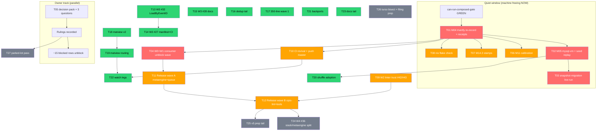

# SUPERB — Quiet-Window Burst, Release Waves & Backlog Pareto Plan

> **Point-in-time plan** (2026-10-01 15:02 CEST). Living source of truth: `TODO_LIST.md` (106 open rows, 35 BLOCKED). This plan is the execution snapshot; TODO_LIST wins on drift.
> Predecessors: `2026-09-28_22-00_SUPERB-post-wave-verification-and-backlog-pareto-plan.md` (M01–M27: M01–M03, M06–M10, M12–M14.1/2, M16–M19, M21, M24, M25, M26, M27 done; M04/M05/M11/M14.3 quiet-gated; M15.3 owner answers) and `2026-09-30_14-28_SUPERB-github-issue-backlog-pareto-plan.html` (W0–W4).
> **Machine state at planning**: the 3-hour foreign nix aarch64 Rust build is ENDING (load 8.6→20 bursts, 1 qemu left). The composed gate reached GREEN once today (attempt 45) before a load rebound; verify refused cleanly by its internal guard. The quiet queue is executable the moment the floor drops.

## 0) Execution rules (anti-verschlimmbessern)

1. **Quiet-gated work only through the gate**: `scripts/can-run-composed-gate.sh --wait-loop --max-wait 10800` → `nix run .#verify` (exclusive: no edits/builds during). Never `VERIFY_FORCE=1` under residual load.
2. **`source scripts/go-env.sh` before ANY go command.** Per-module: `cd <mod> && GOWORK=off go test ./...`.
3. **Every gate-script change keeps/extends its `--self-test`**; new pins are mutation-tested (corrupt → fail → restore → green) before they count.
4. **API-surface change ⇒ api golden regen in the same edit** (`cd cmd/api-stability && GOWORK=off go run . --update`).
5. **Owner-gated**: ADR rulings, public filings, billing, legal files, push cadence questions. Everything else is blanket-sanctioned wave mechanics.
6. **Receipts land with the work** (CHANGELOG bullet, TODO row strike, status-report index row) — a shipped change without a receipt is not done.
7. **Do not break the release-train**: tag waves only from a clean tree after the daemon absorbs; `tag-release.sh` self-sources go-env; smoke via `--smoke-all`.

## 1) Pareto breakdown

### The 1% that delivers 51%

| # | Item | Why it is the 1% |
|---|------|------------------|
| 1a | **Quiet-window execution burst** (T01–T03: M04 verify re-record, M05 MySQL-VM + seeds, item-19 snapshot-migration) | The machine is freeing NOW. M04 is the trust anchor for every other claim ("composed verify green on master"); M05 + item-19 close the last two load-gated verifications. Days of blocked work unlock in one ~3h window. |
| 1b | **W0+W1 consumer unblock wave** (T04: close #25, retract #26, release watermill v4.7.0 + stack/postgres v4.4.2) | Directly unblocks real consumers filing issues (#21 typed Causation fixed-but-unreleased; #26 poisoned tag). Smallest effort-to-visible-value ratio in the backlog. |
| 1c | **Owner decision-pack answers** (T05: A1–A14/B1–B5/C1-C4 + the 3 open session questions) | Zero agent effort, unblocks ~15 BLOCKED rows (v5 layers 0/10/12/13 scope, SingleWriter/Direction ADRs, encryption questions, push cadence, langserver kill, M04 fallback record). |

### The 4% that delivers 64%

| # | Item | Why |
|---|------|-----|
| 4a | Quiet-window tail (T06–T08: M11 calibration, M14.3 stamps, `nix flake check`) | Completes every load-sensitive verification in the same window — no second wait. |
| 4b | **W2 linter trust** (T09: #42 none-import guard, #43 D005 version-claim rule) | cqrs-lint adoption is gated on trust; both are verified root causes with proposed fixes. |
| 4c | **CI revival + push master** (T10) | Master red across 15+ jobs for 30+ runs; one root-caused infra fix (deprecated magic-nix-cache-action) + pushing 10 unpushed commits restarts the trust signal. |
| 4d | **Release waves A+B** (T11–T12: metaengine wave, queue/mysql pair, cqrs-lint typed-tier, cqrs-upgrade, scheduling/engine) | [Unreleased] holds weeks of shipped-but-invisible consumer value; publishing IS the customer deliverable. |

### The 20% that delivers 80%

W3 consumer features (#32/#27/#28), dedup-verification tail, cqrs-lint 350-line split waves, matview v2 surface + routing, shuffle adoption, backports, watch legs, docs stamps/tails (T13–T23).

### The other 20% (to 100%)

W4 structural (#36 module split), v5 prep tail, upstream filing prep (owner-gated), parked lot (evals, CV bumps, benchkit tag wave, parity gate, blocked parking) (T24–T27 + appendix).

## 2) Comprehensive plan — 27 medium tasks (30–100 min each)

Sorted by importance/impact → effort → customer value. Effort: minutes. Tier: P0=1%, P1=4%, P2=20%, P3=tail.

| ID | Task | Tier | Effort | Impact | Customer value | Depends on | Gate |
|----|------|------|--------|--------|----------------|------------|-----|
| T01 | M04 composed `#verify` re-record + M04.5 receipts (dedup (a) strike, CI re-record row) | P0 | 100 | 🔥🔥🔥 | Trust anchor for every shipped claim | quiet window | can-run-composed-gate GREEN; exclusive |
| T02 | M05: `#integration-mysql-vm` (port 33070 pre-checked) + shuffled-seed replay from `build/shuffle-seeds.log` + F52/Green-MySQL receipts | P0 | 100 | 🔥🔥 | Closes dedup (d) remainder with evidence | T01 (same window) | quiet |
| T03 | Item 19: MySQL/MariaDB snapshot-migration live run → tick v5 Layer 1 row | P0 | 30 | 🔥 | v5 cut readiness evidence | T02 (vm up) | quiet |
| T04 | W0+W1: close #25 (tag verified), retract #26, tag watermill/v4.7.0 + stack/postgres/v4.4.2, issue receipts | P0 | 90 | 🔥🔥🔥 | Unblocks #21/#26 consumers directly | T01 green (tags from verified master) | release mechanics |
| T05 | Route owner decision pack (A1–A14, B1–B5, C1–C4) + 3 session questions; record rulings in TODO rows | P0 | 30 | 🔥🔥🔥 | Unblocks ~15 BLOCKED rows | owner availability | none (present + wait) |
| T06 | M11 calibration: gate → SearchQuery count=5 → supersede note if >5% drift → dgraph constants re-anchor | P1 | 60 | 🔥 | Honest benchmarks again | T01 window ideally | quiet |
| T07 | M14.3: per-module fresh-run last-verified stamps (3 batches) + script-derived counts | P1 | 60 | 🔥 | Docs freshness = consumer trust | quiet | quiet |
| T08 | `nix flake check` full run + triage | P1 | 30 | 🔥 | Flake app hygiene proof | quiet | quiet |
| T09 | W2 linter trust: #42 none-import guard → `toolspec.detect`; #43 D005 positional version-claim rule; tests + RULES regen + fp-sweep delta | P1 | 90 | 🔥🔥 | cqrs-lint adoption trust | none | cqrs-lint tests + rule-count gates |
| T10 | CI revival: replace deprecated `magic-nix-cache-action` in ci.yml; commit + push master (10 unpushed); watch first legs; billing = owner ask | P1 | 60 | 🔥🔥🔥 | Green CI signal restored | T01 (push a verified master) | ci lint |
| T11 | Release wave A: metaengine post-v4.9.0 wave + queue/mysql + testutil/mysqltestcontainer pair (strip→tidy→verify→tag→smoke) | P1 | 90 | 🔥🔥 | Publishes the biggest [Unreleased] value | T04 pattern proven; T01 | release mechanics |
| T12 | Release wave B: cqrs-lint typed-info tier (+C043) + cqrs-upgrade `--strict` + scheduling/engine + encryption docs entry | P1 | 60 | 🔥🔥 | Linter + tooling value shipped | T11 (wave cadence) | release mechanics |
| T13 | W3 #32: `EventAdapter.LoadByEventID` via `EventByIDBackend` capability (+ tests, golden, docs) | P2 | 60 | 🔥 | Requested consumer API | none | api golden + module tests |
| T14 | W3 #27: committed versions.json manifest + tag-push CI leg + README version matrix | P2 | 90 | 🔥 | Consumers judge replace-to-master pins | T11/T12 tags exist | ci |
| T15 | W3 #28: document consumer upgrade-sweep pattern; bless `cmd/cqrs-upgrade` in docs | P2 | 30 | 🔥 | Reduces upgrade friction to a recipe | none | doc-check |
| T16 | Dedup verification tail (a) close-out + conformance-sweep live-server legs (dedup rows) | P2 | 60 | 🔥 | Campaign receipts complete | T01 | none |
| T17 | cqrs-lint 350-line: ratify ratchet → split wave 1 (top offenders at cohesive seams) | P2 | 100 | 🔥 | Maintainability, gate honesty | none | file-size gate shrinks only |
| T18 | Matview v2: planned-table matviews (ApplyLayout ordering + backfill) | P2 | 100 | 🔥🔥 | O(1) grouped reads for operators | none | metaengine tests |
| T19 | Matview routing: teach cost model matview-covered shapes (O(1)/O(groups)) | P2 | 60 | 🔥🔥 | Planner stops mis-routing | T18 | planner tests |
| T20 | Shuffle eval + adoption for `test-integration.sh`/suite scripts + Green-MySQL row updates | P2 | 60 | 🔥 | Flake-honest integration suites | T02 | none |
| T21 | Contention-retry review backport to turso/badger engines | P2 | 30 | 🔥 | Engine parity under load | none | engine tests |
| T22 | Watch legs batch: dgraph+redis shuffled CI (~10 runs), NATS 3rd run, nightly weekly load-sweep fire check | P2 | 30 | 🔥 | Flake ledger stays honest | pushes happen | none |
| T23 | Docs tail: M13 stamps script-derived counts integration + docs-health (b)(c) hygiene + README deep-read harvest rows | P2 | 60 | 🔥 | Consumer-surface truth | T07 | doc gates |
| T24 | W4 #36: extract `stack/metaengine` module (move WithMetaEngine + Bundle registration; root forwarders; full new-module gate sweep) | P3 | 100 | 🔥 | Dependency-graph honesty for stack consumers | T11+T12 (stable tags) | all new-module gates |
| T25 | v5 prep: expand V5-MIGRATION-GUIDE (before/after per tier) + systemtest sibling-replace strip + post-landing api sweep | P3 | 100 | 🔥 | v5 cut friction down | T11 waves | doc/api gates |
| T26 | Turso defect-A characterization sharpen (bisect onset) + upstream filing PREP (filing itself owner-gated) | P3 | 60 | 🔥 | Upstream fix becomes possible | none | verify-before-filing |
| T27 | Parked-lot review batch: evals execution status, CV bump ask, benchkit tag wave, FilterContains/FilterPrefix, tuned-tier bench, parity gate — one status pass + row updates | P3 | 30 | 🔥 | Backlog stays current, nothing rots silently | T05 rulings | none |

**Total ≈ 22.5 h.** P0 = 5.8 h, P1 = 7 h, P2 = 10.4 h (some parallelizable), P3 = 4.8 h.

## 3) Fine breakdown — tasks ≤ 12 min each

Sort: within tier by importance, then dependency order. "Gate" = verify step attached to the fine task.

### P0 — the 1%

| ID | Fine task | Est | Depends |
|----|-----------|-----|---------|
| F01.1 | Re-assert gate: `can-run-composed-gate.sh` one-shot; if refusing → launch `--wait-loop --max-wait 10800` supervised (poll ≤20 min, re-launch on timeout) | 12 | — |
| F01.2 | On GREEN: launch `nix run .#verify` exclusive; hands off tree; monitor first phase (build+vet) | 12 | F01.1 |
| F01.3 | Monitor verify mid phases (test+race); NO concurrent builds | 12 | F01.2 |
| F01.4 | Monitor verify tail (lint+doc-check+doc-assertions); capture full log to /tmp | 12 | F01.3 |
| F01.5 | Triage any red: fix loop ≤12 min each, restart verify only via gate | 12 | F01.4 |
| F01.6 | M04.5 receipts: strike dedup (a) row; CI re-record row GREEN; CHANGELOG bullet; report note | 12 | F01.4 |
| F02.1 | M05.1 pre-checks: port 33070 free (done 14:42 — re-assert), load gate, seeds file present (117) | 6 | T01 done |
| F02.2 | Launch `nix run .#integration-mysql-vm` (QEMU, ~131s+suite); monitor | 12 | F02.1 |
| F02.3 | Triage mysql-vm result; red → stale-port/diaper check per M05.3 | 12 | F02.2 |
| F02.4 | M05.4: shuffled-suite seed replay from `build/shuffle-seeds.log` (each seed ≤12 min slice) | 12 | F02.1 |
| F02.5 | M05.4 continued: remaining seeds slice | 12 | F02.4 |
| F02.6 | M05.5 receipts: F52 AGENTS rows strike, Green-MySQL row strike | 10 | F02.3, F02.5 |
| F03.1 | Run `integration/snapshot_migration_mysql_integration_test.go` behind the vm/mysql leg | 12 | F02.3 |
| F03.2 | Tick v5 checklist Layer-1 snapshot-migration row with dated evidence | 6 | F03.1 |
| F04.1 | W0: verify `metaengine/projectionadapter/v4.5.0` tag `OccurredAt` content vs #25 ask | 8 | — |
| F04.2 | W0: comment receipt on #25 + close | 6 | F04.1 |
| F04.3 | W1/#26: retract directive for `stack/postgres/v4 v4.2.0` + `go.mod`/`go.sum` re-tidy | 12 | — |
| F04.4 | W1/#21: tag `watermill/v4.7.0` — strip, tidy, module verify, tag | 12 | T01 green |
| F04.5 | W1/#21: tag wave cont.: smoke watermill tag (standalone build) | 12 | F04.4 |
| F04.6 | W1/#21: tag `stack/postgres/v4.4.2` (strip, verify, tag, smoke) | 12 | F04.4 |
| F04.7 | W1 receipts: issue comments (#21, #26), CHANGELOG wave note, TODO row strike | 10 | F04.3–F04.6 |
| F05.1 | Re-present decision pack (A1–A14 quick + B1–B5 ADR + C1–C4) + 3 session questions in one message | 10 | — |
| F05.2 | Record rulings: annotate TODO BLOCKED rows + decision pack file addendum | 12 | owner |
| F05.3 | Route first unblocked rows into TODO_LIST active section | 10 | F05.2 |

### P1 — the 4%

| ID | Fine task | Est | Depends |
|----|-----------|-----|---------|
| F06.1 | M11.1: `calibration-gate.sh` PASS check (quiet) | 6 | window |
| F06.2 | M11.2: SearchQuery count=5 re-run (bench slice) | 12 | F06.1 |
| F06.3 | M11.2: remaining count slices | 12 | F06.2 |
| F06.4 | M11.3: compare vs baseline; write supersede note if >5% drift | 12 | F06.3 |
| F06.5 | M11.4: dgraph constants re-anchor + citations sweep | 12 | F06.4 |
| F06.6 | M11.5: provenance/receipt rows | 8 | F06.5 |
| F07.1 | M14.3 batch 1 stamps: Tier 0–1 modules fresh-run + last-verified stamp | 12 | quiet |
| F07.2 | M14.3 batch 2 stamps: Tier 2–3 | 12 | F07.1 |
| F07.3 | M14.3 batch 3 stamps: Tier 4–6 | 12 | F07.2 |
| F07.4 | Integrate script-derived counts into stamp generator (no hand numbers) | 12 | F07.3 |
| F08.1 | `nix flake check` run (quiet) + first triage slice | 12 | quiet |
| F08.2 | Flake triage tail (per-app build breaks) | 12 | F08.1 |
| F09.1 | #42: port none-import guard from `cmd/cqrs-lint/run.go:326` into `toolspec.detect` | 12 | — |
| F09.2 | #42: tests (provider path lints non-consumers — the verified repro) | 12 | F09.1 |
| F09.3 | #43: D005 positional-attachment rule (stop `versions[0]` on cqrs-line) | 12 | — |
| F09.4 | #43: tests + golden updates | 12 | F09.3 |
| F09.5 | RULES.md/README regen + meta-test counts + issue comments #42/#43 | 10 | F09.2, F09.4 |
| F09.6 | fp-sweep delta re-run (post-rule-change distribution) | 10 | F09.5 |
| F10.1 | Replace deprecated `magic-nix-cache-action` in ci.yml with supported cache path | 12 | — |
| F10.2 | ci.yml lint (actionlint/yaml) + workflow self-review | 10 | F10.1 |
| F10.3 | `git status` clean check → push master (10 unpushed commits; owner sanctioned this plan's push) | 8 | T01 |
| F10.4 | Watch first CI legs; classify remaining reds (billing vs code) | 12 | F10.3 |
| F10.5 | Billing failure: owner ask note (BLOCKED row stays) | 6 | F10.4 |
| F11.1 | Wave A prep: module list + [Unreleased] bullet mapping + clean tree | 12 | T01 |
| F11.2 | Tag metaengine wave slice 1 (strip+tidy) | 12 | F11.1 |
| F11.3 | Tag metaengine wave slice 2 (verify+tag) | 12 | F11.2 |
| F11.4 | Tag queue/mysql + testutil/mysqltestcontainer pair | 12 | F11.3 |
| F11.5 | `--smoke-all` pass + proxy-tag probe on new tags | 12 | F11.4 |
| F11.6 | Wave A receipts (CHANGELOG, TODO strike, run log) | 10 | F11.5 |
| F12.1 | cqrs-lint tag prep (typed-info tier bullets + C043) | 10 | T11 |
| F12.2 | Tag cqrs-lint (strip, verify, tag, smoke) | 12 | F12.1 |
| F12.3 | Tag cqrs-upgrade + scheduling/engine | 12 | F12.2 |
| F12.4 | Encryption docs/wire-goldens CHANGELOG entry + wave B receipts | 10 | F12.3 |

### P2 — the 20%

| ID | Fine task | Est | Depends |
|----|-----------|-----|---------|
| F13.1 | #32: `EventByIDBackend` capability interface + adapter wiring | 12 | — |
| F13.2 | #32: `LoadByEventID` implementation + not-supported fallback | 12 | F13.1 |
| F13.3 | #32: tests (capability present/absent) + api golden regen | 12 | F13.2 |
| F13.4 | #32: docs row + issue comment + close | 10 | F13.3 |
| F14.1 | #27: versions.json manifest generator script (tag→module map from git) | 12 | T12 |
| F14.2 | #27: commit manifest at wave time + tag-push CI leg | 12 | F14.1 |
| F14.3 | #27: README version matrix table | 12 | F14.2 |
| F14.4 | #27: issue comment + close what's deliverable | 8 | F14.3 |
| F15.1 | #28: upgrade-sweep pattern doc (skill reference + README section) | 12 | — |
| F15.2 | #28: bless cqrs-upgrade section + issue close | 10 | F15.1 |
| F16.1 | Dedup (a) final strike verification (post-T01 evidence) | 8 | T01 |
| F16.2 | Conformance live-server legs: run + record (slice 1) | 12 | — |
| F16.3 | Conformance live-server legs (slice 2) | 12 | F16.2 |
| F17.1 | Ratify 350-line ratchet (baseline policy note; owner-visible) | 8 | — |
| F17.2 | Split wave 1: pick top 3 offenders + cohesive seams | 10 | F17.1 |
| F17.3 | Split offender 1 | 12 | F17.2 |
| F17.4 | Split offender 2 | 12 | F17.3 |
| F17.5 | Split offender 3 + gate re-run (shrinks only) | 12 | F17.4 |
| F18.1 | Matview v2 design slice: planned-table matview DDL in ApplyLayout | 12 | — |
| F18.2 | Backfill path (CREATE … AS SELECT under layout lock) | 12 | F18.1 |
| F18.3 | Incremental maintain slice (insert/update routing to matview) | 12 | F18.2 |
| F18.4 | Tests: layout+matview lifecycle, restart persistence | 12 | F18.3 |
| F18.5 | Docs: ADR-0135 addendum + operator recipe | 10 | F18.4 |
| F19.1 | Cost-model: matview-covered shape detection (grouped-filter match) | 12 | T18 |
| F19.2 | Planner: route covered shapes to matview engine + Explain rendering | 12 | F19.1 |
| F19.3 | Planner tests + calibration priors for O(1) shapes | 12 | F19.2 |
| F20.1 | Shuffle eval: run shuffled suite harness on 2 scripts | 12 | T02 |
| F20.2 | Adoption decision + script edits | 12 | F20.1 |
| F20.3 | Green-MySQL + F52 row final states | 8 | F20.2 |
| F21.1 | Backport contention-retry review: turso engine | 12 | — |
| F21.2 | badger engine + tests | 12 | F21.1 |
| F22.1 | Watch slice: dgraph+redis shuffled CI logs read+classify | 12 | pushes |
| F22.2 | NATS 3rd suite run (flake ledger 3-run rule) | 12 | — |
| F22.3 | Nightly weekly load-sweep fire check (Sunday leg config) | 8 | — |
| F23.1 | M13: stamps → script-derived counts wiring | 12 | T07 |
| F23.2 | Docs-health (b): status-report strike discipline pass | 12 | — |
| F23.3 | Docs-health (c): README deep-read tail rows harvest | 12 | — |
| F23.4 | Doc gates re-run (doc-check + canonical-facts) | 10 | F23.1–3 |

### P3 — the other 20% (to 100%)

| ID | Fine task | Est | Depends |
|----|-----------|-----|---------|
| F24.1 | #36: create `stack/metaengine` module skeleton (go.mod, go.work, flake testModules) | 12 | T12 |
| F24.2 | Move WithMetaEngine + Bundle registration files | 12 | F24.1 |
| F24.3 | Root forwarders (deprecated) + consumers re-pointed | 12 | F24.2 |
| F24.4 | New-module gate sweep (api-stability, module-layers, cqrs-lint catalog, exclusions) | 12 | F24.3 |
| F24.5 | Hermetic metaengine-free-graph probe + golden regen + receipts | 12 | F24.4 |
| F25.1 | V5-MIGRATION-GUIDE: tier-1/2 before/after examples | 12 | T12 |
| F25.2 | Guide: tier-3–6 examples + deprecation map | 12 | F25.1 |
| F25.3 | systemtest sibling-replace strip (post-waves) + standalone check | 12 | T11 |
| F25.4 | Post-landing api sweep + md-go gate | 12 | F25.3 |
| F26.1 | Turso defect-A onset bisect: pin ladder slice 1 | 12 | — |
| F26.2 | Bisect slice 2 + characterization note | 12 | F26.1 |
| F26.3 | Upstream filing DRAFT (verify-before-filing; FILE = owner-gated) | 12 | F26.2 |
| F27.1 | Parked-lot pass 1: evals/CV/benchkit rows status update | 10 | T05 |
| F27.2 | Parked-lot pass 2: FilterContains/FilterPrefix + parity + tuned-tier rows: keep/re-scope/schedule | 10 | F27.1 |
| F27.3 | TODO_LIST hygiene: strike dup rows this plan completed | 10 | all |

**Fine totals: 87 tasks · ≈14.6 h of ≤12-min slices** (medium-plan remainder is monitoring/wave-wait time).

## 4) Blocked parking lot (not scheduled — owner/external gates)

| Group | Count | Examples |
|-------|-------|----------|
| Owner rulings pending | ~12 | ADR-0138 demand check, queue ratification, claiming V006, Doctor-JSON semantics, push cadence, ERRAUDIT_PAT, branch protection F040, benchkit LICENSE |
| Owner filings | ~5 | turso upstream issues, md-go-validator, EventCatalog crash draft |
| External/billing | 3 | GitHub Actions billing, CV operator bump, macOS PG verification |
| Tooling-blocked | 2 | skill evals execution, BuildFlow templ cwd (external repo) |
| v5-gated | ~13 | T19–T21 fold, deletion layers 4–13, encryption ADR questions |

These surface through T05 (decision pack) and stay parked otherwise.

## 5) Execution graph

**Critical path**: window → T01 → {T04, T10} → T11 → T12 → {T24, T25}. Owner track (T05) runs fully parallel and unlocks the parking lot.

## 6) Verification per wave

- **Window wave**: gate GREEN → verify exit 0 → per-task receipts → status report row.
- **Release waves**: tag-release.sh per module → `--smoke-all` → proxy-tag probe → CHANGELOG/TODO receipts → unpushed-tag check.
- **Linter wave**: cqrs-lint tests + RULES regen + rule-count gates + fp-sweep delta.
- **Close-out**: preflight 9/9 → canonical-facts → closing report + index.

## 7) Source-of-truth pointers

- Quiet-gate mechanics + supervision lesson: `docs/status/2026-10-01_14-50_*.md` §c
- Release mechanics: `AGENTS.md` §Procedures + `scripts/tag-release.sh` / `batch-release.sh` (self-source go-env)
- GitHub waves detail: `docs/planning/2026-09-30_14-28_SUPERB-github-issue-backlog-pareto-plan.html`
- Owner decision pack: `docs/planning/2026-10-01_owner-decision-pack.md`
- v5 layers: `docs/planning/2026-10-01_v5-cut-readiness-checklist.md` (Layer 2 rows 1–3 ticked 2026-10-01)
