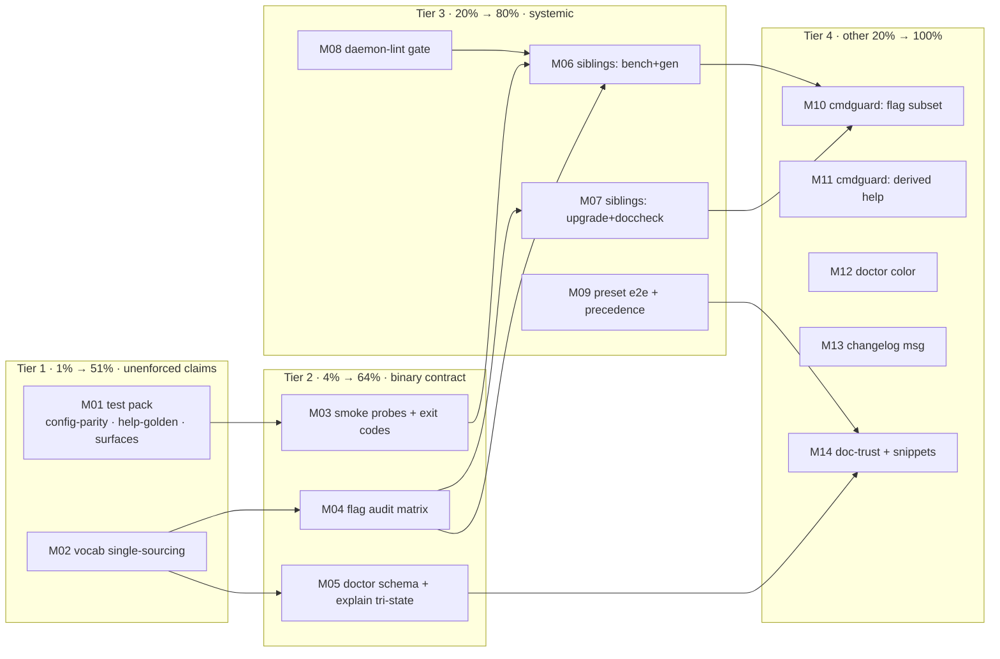

# SUPERB — cqrs-lint CLI Consistency Pareto Plan

**Date:** 2026-10-03 05:16
**Provenance:** Harvested from [`docs/status/2026-10-03_04-25_cqrs-lint-subcommand-consistency.md`](../status/2026-10-03_04-25_cqrs-lint-subcommand-consistency.md) §f (30 tasks, 6 groups) + the two open decisions from that report, both now RESOLVED:

- **Decision 1 (doctor `--fix` collision) — EXECUTED this session, pre-plan:** renamed to `doctor --prune-suppressions` (`--dry-run` keeps its doctor-local meaning). Regression-pinned by `TestDoctorFixFlagRenamedToPrune` (`cmd/cqrs-lint/subcommand_consistency_test.go`); README ×2, CHANGELOG `Changed` (breaking) entry with migration note. Root `--fix` remains the ONE autofix flag in the CLI.
- **Decision 2 (single-render commands vs `--format`) — RESOLVED this session:** `version`/`explain`/`changelog` deliberately IGNORE the inherited `--format` (shared vocabulary, one rendering each). Rationale: a config file setting `"format": "json"` for lint output must not break `cqrs-lint version` in CI scripts, and cmdguard cannot distinguish flag-source vs config-source in the handler cfg. Pinned by `TestSingleRenderCommandsIgnoreSharedFormat`.

**Concurrent work exclusion:** `cmd/cqrs-lint/pkg/analyzer/store_spec.go` (created 05:10 by a parallel multi-store-detection session) carries its own lint debt (err113 ×2, exhaustive, gofumpt). NOT planned here — touching another agent's WIP is out of scope; flagged to the owner via this note.

---

## Pareto Breakdown

### Tier 1 — the 1% that delivers 51%: kill every unenforced shipped claim

The session shipped a contract (README + CONTRIBUTING + CHANGELOG). Three claims have no mechanical enforcement — each is a future doc-lie:

1. **Config-file `format`/`color` parity** (README claims it; no test pins `.cqrs-lint.json` → scorecard/doctor flow).
2. **Single-sourced format vocabularies** (supported lists duplicated 2–3× per command: validate call + WithShort + explain — a drift seed I introduced).
3. **Help-drift golden** (hand-written usage block vs cobra COMMANDS section — the `changelog` omission class, currently only human-checked).

### Tier 2 — the 4% that delivers 64%: binary-level contract + flag honesty

4. Smoke probes at the BINARY level (`scripts/smoke-probes.txt` grows the contract e2e; tests are in-process only today).
5. Accepted-but-ignored flag sweep (e.g. `--min-severity` on `rules`?) — consume, scope local, or document-ignore; nothing silent.
6. `doctor --format json` schema docs + `completion`/`help [cmd]` surface tests.
7. Backlog routing: this plan → `TODO_LIST.md` (done this turn).

### Tier 3 — the 20% that delivers 80%: systemic + sibling fixes

8. Same audit on `cmd/cqrs-bench`, `cmd/cqrs-gen`, `cmd/cqrs-upgrade`, `cmd/doc-check` (same cmdguard patterns, same disease expected).
9. **Daemon-bypasses-lint hole** (root cause of master's 5 pre-existing findings): pre-commit gate or nightly lint alert.
10. `explain` tri-state teaching row (why `tracing`=on/off but `server`=true/false — the question that started this arc).
11. `init --preset` ×6 e2e + flag-over-config precedence tests.

### Tier 4 — the other 20% to 100%: polish + upstream

12. cmdguard upstream proposals (shared-flag-subset helper; validator-derived help; unused-persistent detector; `local:"true"` docs).
13. Doctor colorize-or-dedocument `--color`.
14. Exit-code documentation; `rules --json`+`--markdown` precedence; changelog fallback message; doc-trust sweep; CONTRIBUTING probe snippet.

---

## Comprehensive Plan (30–100 min tasks, sorted by importance → impact → effort → customer-value)

| ID | Task | Tier | Impact | Effort | Customer value |
|----|------|------|--------|--------|----------------|
| M01 | Contract-enforcement test pack: config-parity e2e (temp `.cqrs-lint.json`), help-drift golden, `completion`/`help` surface | 1 | Critical | 90min | README claims become mechanically true |
| M02 | Single-source format vocabularies: per-command `[]string` const → validate + `WithShort` + explain | 1 | High | 60min | Adding a format edits ONE place; no drift |
| M03 | Binary smoke-probe extension (6 probes) + README exit-code table | 2 | High | 45min | CI catches contract regressions pre-release |
| M04 | Flag-consumption audit matrix (subcommand × flag) + scope fixes + `rules --json`+`--markdown` precedence | 2 | Medium | 90min | Zero silent no-op flags remain |
| M05 | `doctor --format json` schema table (advanced.md) + explain tri-state row | 2/3 | Medium | 60min | Consumers script against a documented schema |
| M06 | Sibling audit: cqrs-bench + cqrs-gen (probe → fix → regression) | 3 | High | 100min | Same honesty across the tool family |
| M07 | Sibling audit: cqrs-upgrade + doc-check | 3 | High | 80min | — “ — |
| M08 | Daemon-bypasses-lint root cause: reproduce, options memo, implement gate (pre-commit or nightly), self-test | 3 | Critical | 100min | Master can never silently rot again |
| M09 | `init --preset` ×6 e2e + flag-over-config precedence test | 3 | Medium | 50min | Preset templates verified valid |
| M10 | cmdguard upstream: `WithSharedFlagSubset` proposal + `local:"true`" docs PR | 4 | Medium | 90min | Framework makes the contract easy |
| M11 | cmdguard upstream: validator-derived help lists + unused-persistent-flag detector proposal | 4 | Low | 100min | Drift class dies at the framework level |
| M12 | Doctor: colorize section headers OR remove `--color` from its documented surface | 4 | Low | 40min | No accepted-but-inert flag on doctor |
| M13 | `changelog` fallback message (distinguish "no tag yet" from error) | 4 | Low | 30min | Honest CLI output |
| M14 | Doc-trust sweep (cqrs-lint claims without tests) + CONTRIBUTING probe-snippet section | 4 | Medium | 60min | Docs ≠ lies, reproducibly |

**Pareto check:** M01–M02 (Tier 1) ≈ 2/14 tasks ≈ the 1%→51%. M01–M05 ≈ 4/14 ≈ 4%→64%. M01–M09 ≈ 9/14 ≈ 20%→80%. M10–M14 complete the 100%.

---

## Fine-Grained Breakdown (≤12 min per task, sorted by importance)

| # | Micro-task | Parent | Est |
|---|-----------|--------|-----|
| 1 | Helper `tempDirWithConfig(t, json)` in consistency test file | M01 | 12m |
| 2 | Test: scorecard in `"format":"json"` dir emits JSON | M01 | 12m |
| 3 | Test: doctor in `"format":"json"` dir emits JSON | M01 | 12m |
| 4 | Golden: extract command names from hand-written help block + cobra COMMANDS, assert set equality | M01 | 12m |
| 5 | Test: `completion bash` rc=0 under new scoping | M01 | 5m |
| 6 | Test: `help doctor` rc=0, mentions prune flag | M01 | 5m |
| 7 | Define `formatVocabulary` map: command → supported []string | M02 | 12m |
| 8 | Wire scorecard validate + WithShort to vocab | M02 | 12m |
| 9 | Wire doctor + rules to vocab | M02 | 12m |
| 10 | Wire root `run()` validation list to vocab | M02 | 12m |
| 11 | explain: render format rows from vocab | M02 | 12m |
| 12 | fmt + lint + full module tests after M02 | M02 | 5m |
| 13 | Probe: `rules --format json` → stdout starts `[` | M03 | 5m |
| 14 | Probe: `scorecard --format csv` → rc≠0 | M03 | 5m |
| 15 | Probe: `doctor --format yaml` → rc≠0 | M03 | 5m |
| 16 | Probe: `version --fix` → rc≠0 | M03 | 5m |
| 17 | Probe: `init --path $tmp` writes file | M03 | 8m |
| 18 | Probe: `doctor --fix` → rc≠0 (rename pin, binary level) | M03 | 5m |
| 19 | README: exit-code table (format errors rc=1, threshold rc=1, findings rc=1, clean rc=0) | M03 | 12m |
| 20 | Script: enumerate subcommand × flag acceptance matrix | M04 | 12m |
| 21 | Classify matrix: consumed / make-local / document-ignore | M04 | 12m |
| 22 | Apply scoping edits from matrix | M04 | 12m |
| 23 | Define+test `rules --json`+`--markdown` precedence (markdown wins, documented) | M04 | 12m |
| 24 | README contract rows update after M04 | M04 | 8m |
| 25 | advanced.md: doctor JSON field table | M05 | 12m |
| 26 | explain: Kind column note (tri-state `unknown` defers to heuristics) | M05 | 12m |
| 27 | cqrs-bench: probe help/flags/formats/exit codes | M06 | 8m |
| 28 | cqrs-bench: fix scoping + validation | M06 | 12m |
| 29 | cqrs-bench: regression test | M06 | 12m |
| 30 | cqrs-gen: probe help/flags/formats/exit codes | M06 | 8m |
| 31 | cqrs-gen: fix scoping + validation | M06 | 12m |
| 32 | cqrs-gen: regression test | M06 | 12m |
| 33 | cqrs-upgrade: probe help/flags/formats/exit codes | M07 | 8m |
| 34 | cqrs-upgrade: fix scoping + validation | M07 | 12m |
| 35 | cqrs-upgrade: regression test | M07 | 12m |
| 36 | doc-check: probe help/flags/formats/exit codes | M07 | 8m |
| 37 | doc-check: fix scoping + validation | M07 | 12m |
| 38 | doc-check: regression test | M07 | 12m |
| 39 | Reproduce daemon hole: plant lint-dirty file, watch daemon absorb it | M08 | 12m |
| 40 | Options memo: pre-commit gate vs nightly lint vs verify-fast daemon hook | M08 | 12m |
| 41 | Implement chosen gate (part 1: script) | M08 | 12m |
| 42 | Implement chosen gate (part 2: wiring) | M08 | 12m |
| 43 | Self-test the gate (fault injection) | M08 | 12m |
| 44 | Test: `init --preset` ×6 generate valid JSONC | M09 | 12m |
| 45 | Test: root `--format` flag beats config-file value | M09 | 12m |
| 46 | cmdguard issue draft: WithSharedFlagSubset API sketch | M10 | 12m |
| 47 | Verify-need code sample (cqrs-lint as the motivating case) | M10 | 12m |
| 48 | File upstream issue (USER-GATED: review first) | M10 | 2m |
| 49 | cmdguard docs PR: local:"true" scoping section | M10 | 12m |
| 50 | Proposal draft: validator-derived help lists | M11 | 12m |
| 51 | Proposal draft: unused-persistent-flag detector | M11 | 12m |
| 52 | Doctor: colorize headers via go-output OR dedocument --color | M12 | 12m |
| 53 | changelog: distinct "no release tag yet" fallback message | M13 | 12m |
| 54 | Sweep: grep README/CONTRIBUTING claims → list unpinned (batch 1) | M14 | 12m |
| 55 | Pin top claims (batch 2) | M14 | 12m |
| 56 | Pin top claims (batch 3) | M14 | 12m |
| 57 | CONTRIBUTING: rc-safe probe snippet section | M14 | 12m |
| 58 | Route this plan into TODO_LIST.md (DONE this turn) | — | 5m |

---

## Execution Graph

**Critical path:** M01 → M03 → M06/M07 → M10 (contract tests → binary probes → siblings → upstream).
**Parallel-safe:** M08 (process work) and M12/M13 run anytime; M05/M09 independent of Tier 1.

## Verification gates (every task)

- `cd cmd/cqrs-lint && GOWORK=off go build ./... && go vet ./... && go test . -count=1`
- `golangci-lint run --config ../../.golangci.yml ./...` → 0 issues (excluding concurrent-agent files)
- Doc tasks: `nix run .#check-md-go` + `bash scripts/check-readme-links.sh` + `bash scripts/check-changelog-symbols.sh`
- Sibling tools: their module tests + `nix run .#verify-fast`

## Verschlimmbesser guard

No speculative rewrites. Each fix must leave the repo verifiably no worse: run() behavior for existing flag combos unchanged unless a CHANGELOG `Changed` entry says so; no renames beyond the approved `--prune-suppressions`; sibling-tool changes follow the same audit→fix→pin loop, never blanket refactors.
