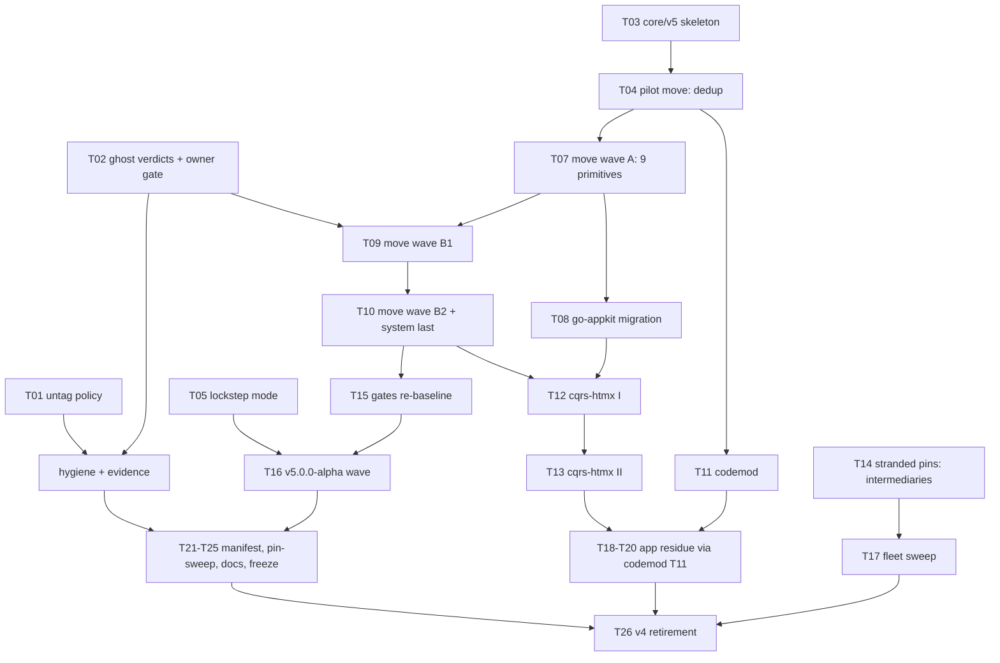

# SUPERB — v5 Fleet-First Consolidation: Execution Plan

**Date:** 2026-10-08 20:40 CEST
**Input:** ADR-0152 (fleet-first topology, dual-support v4/v5, cqrs-htmx + go-appkit as in-scope companions) + the 2026-10-08 module audit (`docs/status/2026-10-08_20-23_go-modules-audit-external-usage-and-self-review.md`)
**Program goal:** 101 release trains → 1 `core/v5` module + a tagged-on-first-consumer driver tier; lockstep versioning for v5 waves; the two in-scope companions migrate first; v4 serves fixes during transition and retires when the fleet completes migration.

> **Verschlimmbessern guardrails (hard rules for every task):**
> 1. v4 train directories are NEVER modified, moved, or deleted during dual-support — v5 is a *copy-forward*; fixes cherry-pick v4→v5. Deletion happens exactly once, in T26, gated on zero v4 pins in the fleet.
> 2. Ghost-module kills require the T02 owner sign-off gate; deletions go through `trash`, never `rm`.
> 3. Every move wave is verified before the next: per-module `GOWORK=off go test`, api-stability golden regen, `#verify-fast`, doc-check. A red wave stops the line.
> 4. Untagging = stop tagging + manifest marking. It never deletes code or tags.
> 5. Release-script changes ship with `--self-test` extensions (repo convention; `nix run .#check-release-scripts` must stay green).
> 6. The auto-commit daemon races authored commits: re-check `git status` immediately before `git add`; commit at every phase boundary for authored history.

---

## 1. Pareto Breakdown

### The 1% that delivers 51%

| Act | Why it is the leverage point |
|---|---|
| **Untag policy switch** (T01) | Zero code risk; every release wave drops from 90+ tags to <15 *immediately*; halves the operational cost of dual-support before v5 even exists |
| **v5 core skeleton + pilot move** (T03, T04) | The single structural act: creates `core/v5`, proves the move pipeline end-to-end on the smallest merge-set train (dedup, 1 direct consumer) before mass execution |
| **Ghost-system verdicts** (T02) | 8 undecided modules block the composition of the core; a 60-minute decision memo unblocks two full move waves |

### The 4% that delivers 64% (adds)

| Act | Why |
|---|---|
| Lockstep mode in batch-release (T05) | Retires per-train semver mechanically; one version per wave kills the pin-sweep class for all future releases |
| Move wave A — Tier 0/1 primitives (T07) | record/id/kv/dispatcher/metadata/dedup/event/command/query become packages of the core; the darlings' future home exists |
| go-appkit migration (T08) | First in-scope companion flips (8 production files); end-to-end proof that consumers survive the path change |
| P0 hygiene bundle (T06) | Closes the audit's evidence gaps; cheap, prevents repeat of this session's false-claim class |

### The 20% that delivers 80% (adds)

| Act | Why |
|---|---|
| Move waves B1+B2 — the rest of the core (T09, T10) | The full ~30-train merge set lives in `core/v5`; new development has one home |
| cqrs-upgrade codemod (T11) | Turns the 40-app migration from a project into a pipeline |
| cqrs-htmx migration I+II (T12, T13) | The chassis (500/685 edges) flips; ~73% of the fleet's indirect surface moves with it |
| Stranded-pin sweep — intermediaries (T14) | Kills the frozen codec/idempotency/retry/flightrecorder pins where they enter the fleet |
| Gates re-baseline + v5.0.0-alpha lockstep wave (T15, T16) | The toolchain recognizes the new topology; first one-version wave ships and smokes |

### The other 20% to reach 100%

App-residue migration in 3 batches (T18–T20), fleet-wide stranded-pin sweep (T17), versions.json split + manifest marking (T21), pin-sweep simplification (T22), docs/skill/FEATURES/CHANGELOG refresh (T23), nightly consumer gate (T24), v4 freeze policy (T25), v4 retirement ceremony (T26).

---

## 2. Comprehensive Plan — 26 macro tasks (30–100 min each), sorted by importance/impact/effort

| ID | Task | Phase | Est | Impact | Deps | Verify |
|----|------|-------|-----|--------|------|--------|
| T01 | Untag policy: CONTRIBUTING policy + batch-release untag-list guard + manifest marking (49 trains + root + internal tools; keep cqrs-lint) | P1 | 45m | CRITICAL | — | `#check-release-scripts` green; guard self-test |
| T02 | Ghost-verdict memo: graph, deriver, transport/grpc, transport/http, otel/otlp, idempotency/kvstore, queue/mysql, storage/pebble, backuptest → kill / keep-driver / absorb; owner gate | P1 | 60m | CRITICAL | — | ADR-0152 addendum records verdicts |
| T03 | `core/v5` skeleton: go.mod + all 5 gate registrations (go.work, flake testModules, api-stability slice, cqrs-lint catalog, module-layers LAYER/DEP_BUDGET) | P1 | 90m | CRITICAL | — | `#verify-fast` green on empty core |
| T04 | Pilot move: dedup → `core/v5/dedup` (copy-forward; v4 untouched); import rewrite; surface-equality diff vs v4 | P1 | 60m | CRITICAL | T03 | GOWORK=off test; golden regen; api surface == v4 |
| T05 | batch-release `--lockstep vX.Y.Z` mode (one version, fanned to listed trains, dep-ordered) + self-tests | P2 | 90m | HIGH | T01 | self-test green; dry-run on fake manifest |
| T06 | P0 hygiene: AGENTS 98→101 count-rot, gopls-noise gotcha, phantom-root-tag note, finish 47-train pkg.go.dev evidence sweep | P2 | 60m | HIGH | — | doc-check green; evidence doc complete |
| T07 | Move wave A (9 trains): record, id, kv, dispatcher, metadata, dedup✓, event, command, query → core packages | P2 | 100m | HIGH | T04 | per-train GOWORK=off test + golden + doc-check |
| T08 | go-appkit → core/v5 (8 prod files + integration module; scratch-module install probe) | P2 | 90m | HIGH | T07 | go-appkit full test suite green |
| T09 | Move wave B1 (14 trains): schema, snapshot, projection, projectionhost, listing, scenario, claiming, commandlifecycle+projections, middleware, otel, prometheus, encryption, signing, catalog | P3 | 100m | HIGH | T02, T07 | wave verify gate |
| T10 | Move wave B2 (10 trains): decider, scheduling+engine+sqlstore, stack, storage+memory, metaengine, projectionadapter, system (+graph/deriver per T02) — system last | P3 | 100m | HIGH | T09 | wave verify gate; systemtest suite green |
| T11 | cqrs-upgrade codemod: v4train→v5package mapping, import + go.mod rewrite, --dry-run report, fixture test | P3 | 100m | HIGH | T07 | fixture golden; dogfood on 1 app |
| T12 | cqrs-htmx migration I: inventory, root package, dashboardui (system_bridge first) | P3 | 100m | HIGH | T08, T10 | htmx root+dashboardui tests green |
| T13 | cqrs-htmx migration II: adminui, datastar, usermgmt, identity-model, e2e, examples | P3 | 100m | HIGH | T12 | full htmx test matrix green |
| T14 | Stranded-pin sweep (intermediaries): codec→go-codec, idempotency→go-idempotency, retry, flightrecorder in cqrs-htmx + go-appkit | P3 | 60m | MED-HIGH | — | tidy+tests green; zero frozen-path pins left |
| T15 | Gates re-baseline: module-layers + dep budgets + api-stability prune + cqrs-lint catalog for the new topology | P3 | 90m | MED-HIGH | T10 | `#verify-fast` + `#check-arch` green |
| T16 | v5.0.0-alpha lockstep wave: CHANGELOG section, dry-run, cut, push, smoke-all + scratch probe | P3 | 60m | MED-HIGH | T05, T15 | proxy serves; clean-dir install probe |
| T17 | Stranded-pin sweep (fleet): scripted sweep across ~40 apps | P4 | 90m | MED | T14 | who-uses re-run: zero stranded pins |
| T18 | App-residue migration batch 1 (~12 apps via codemod) | P4 | 100m | MED | T11, T13 | each app: build+test green |
| T19 | App-residue migration batch 2 (~12 apps) | P4 | 100m | MED | T18 | same |
| T20 | App-residue migration batch 3 (remainder) | P4 | 100m | MED | T19 | same |
| T21 | versions.json live/retired split + README manifest marking (incl. phantom root v4.0.0 note) | P4 | 60m | MED | T16 | `check-versions-manifest --check` green |
| T22 | pin-sweep simplification for v5 (lockstep makes it one-version; keep v4 mode) | P4 | 60m | MED | T05 | sweep self-test green |
| T23 | Docs refresh: SKILL.md references, module-map census, FEATURES maturity w/ consumer counts, CHANGELOG v5 section | P4 | 100m | MED | T16 | doc-check + recipe gate green |
| T24 | Nightly who-uses consumer gate → FEATURES maturity matrix | P4 | 90m | MED | — | self-test; nightly run report |
| T25 | v4 freeze policy: fixes-only rules, cherry-pick discipline doc, wave manifest archive | P4 | 45m | LOW-MED | T16 | CONTRIBUTING + ADR addendum |
| T26 | v4 retirement: delete merged v4 dirs (trash), final golden/manifest regen, archive ceremony | P4 | 100m | CLOSING | T17–T20, fleet-zero-v4-pins gate | `#verify` green; who-uses: zero v4 imports fleet-wide |

**Critical path:** T03 → T04 → T07 → T09 → T10 → T16 → T12/T13 → T18–T20 → T26.

---

## 3. Micro Breakdown — 96 tasks, max 12 min each

| ID | Micro-task (≤12m) | Est | Parent |
|----|-------------------|-----|--------|
| M01 | Read CONTRIBUTING release section; mark untag insertion point | 5 | T01 |
| M02 | Write untag policy + definitive untag list (49 + root + internal tools) | 10 | T01 |
| M03 | Add UNTAGGED-set guard to batch-release (refuse tag for untagged train) | 12 | T01 |
| M04 | Guard self-test fixture + mutation leg | 12 | T01 |
| M05 | Run `nix run .#check-release-scripts` | 5 | T01 |
| M06 | Evidence table per ghost module: consumers=0 proof + integration-suite usage | 12 | T02 |
| M07 | Draft verdicts (kill / keep-driver / absorb-into-core) with one-line rationales | 10 | T02 |
| M08 | Owner sign-off gate: present memo, record decision | 5 | T02 |
| M09 | Record verdicts as ADR-0152 addendum | 8 | T02 |
| M10 | Create `core/v5` dir + go.mod (module github.com/larsartmann/go-cqrs-lite/core/v5) | 5 | T03 |
| M11 | Register in go.work + `go work sync` | 5 | T03 |
| M12 | Register in flake testModules | 5 | T03 |
| M13 | Register in cmd/api-stability modules slice | 5 | T03 |
| M14 | Register in cqrs-lint module-catalog test map | 8 | T03 |
| M15 | Register in check-module-layers LAYER + DEP_BUDGET | 10 | T03 |
| M16 | Placeholder package builds; `nix run .#verify-fast` | 12 | T03 |
| M17 | Copy dedup → core/v5/dedup (cp -r, v4 untouched) | 8 | T04 |
| M18 | Rewrite internal imports to core/v5 paths | 12 | T04 |
| M19 | go.mod requires + tidy (GOWORK=off) | 8 | T04 |
| M20 | GOWORK=off build + test core/v5 | 12 | T04 |
| M21 | api-stability golden regen | 5 | T04 |
| M22 | api-diff: core/v5/dedup surface == dedup/v4 surface (no drift) | 12 | T04 |
| M23 | Design lockstep flag (--lockstop semantics, module list source) | 12 | T05 |
| M24 | Implement version fanout to listed trains | 12 | T05 |
| M25 | Dependency-order sequencing within one lockstep batch | 12 | T05 |
| M26 | Self-test fixture (fake manifest, mutation legs) | 12 | T05 |
| M27 | Run `#check-release-scripts` | 5 | T05 |
| M28 | AGENTS.md: fix 98→101 + note canonical-facts regen path | 5 | T06 |
| M29 | Append gopls go-humanize false-alarm to LSP-noise gotcha | 10 | T06 |
| M30 | Phantom-root-tag note in check-versions-manifest.sh header comment | 8 | T06 |
| M31 | pkg.go.dev/proxy sweep trains 1–16 of remaining 47 → evidence doc | 12 | T06 |
| M32 | Sweep trains 17–32 | 12 | T06 |
| M33 | Sweep trains 33–47 + write summary verdict | 12 | T06 |
| M34 | Move record → core/v5 (copy, imports, tidy, build) | 10 | T07 |
| M35 | Move id | 10 | T07 |
| M36 | Move kv | 10 | T07 |
| M37 | Move dispatcher | 10 | T07 |
| M38 | Move metadata | 10 | T07 |
| M39 | Move event (largest; eventtest decision per T02) | 12 | T07 |
| M40 | Move command | 10 | T07 |
| M41 | Move query | 10 | T07 |
| M42 | Wave A verify: GOWORK=off tests ×9 + golden + doc-check | 12 | T07 |
| M43 | go-appkit branch; go.mod requires → core/v5 (+drivers) | 10 | T08 |
| M44 | Rewrite 8 production files' imports | 12 | T08 |
| M45 | Rewrite integration/docs module imports | 12 | T08 |
| M46 | tidy + full go-appkit test suite | 12 | T08 |
| M47 | Scratch-module `go get core/v5` + compile probe | 10 | T08 |
| M48 | Move schema + snapshot | 12 | T09 |
| M49 | Move projection + projectionhost | 12 | T09 |
| M50 | Move listing + scenario | 12 | T09 |
| M51 | Move claiming + commandlifecycle + projections | 12 | T09 |
| M52 | Move middleware + otel + prometheus | 12 | T09 |
| M53 | Move encryption + signing + catalog | 12 | T09 |
| M54 | Wave B1 verify gate | 12 | T09 |
| M55 | Move decider | 12 | T10 |
| M56 | Move scheduling + engine + sqlstore | 12 | T10 |
| M57 | Move stack + storage + storage/memory | 12 | T10 |
| M58 | Move metaengine + projectionadapter | 12 | T10 |
| M59 | Move graph/deriver per T02 verdicts (or skip) | 12 | T10 |
| M60 | Move system (last; depends on all above) | 12 | T10 |
| M61 | Wave B2 verify gate + systemtest suite | 12 | T10 |
| M62 | Build v4train→v5package mapping table | 8 | T11 |
| M63 | Implement import-line rewrite engine | 12 | T11 |
| M64 | Implement go.mod require rewrite + tidy hook | 12 | T11 |
| M65 | --dry-run mode with per-file report | 10 | T11 |
| M66 | Fixture test + golden | 12 | T11 |
| M67 | Dogfood codemod on one small app (e.g. dnsblockd) | 12 | T11 |
| M68 | Inventory cqrs-htmx imports per submodule (mechanical list) | 8 | T12 |
| M69 | Migrate htmx root package | 12 | T12 |
| M70 | Migrate dashboardui/system_bridge.go (system-first) | 12 | T12 |
| M71 | Migrate dashboardui remainder | 12 | T12 |
| M72 | htmx root + dashboardui test matrix green | 12 | T12 |
| M73 | Migrate adminui | 12 | T13 |
| M74 | Migrate datastar | 12 | T13 |
| M75 | Migrate usermgmt + identity-model | 12 | T13 |
| M76 | Migrate e2e + examples | 12 | T13 |
| M77 | Full cqrs-htmx test matrix green | 12 | T13 |
| M78 | codec→go-codec in cqrs-htmx + go-appkit | 12 | T14 |
| M79 | idempotency→go-idempotency | 10 | T14 |
| M80 | retry + flightrecorder pins | 8 | T14 |
| M81 | Intermediaries tidy + tests green | 12 | T14 |
| M82 | Rewrite check-module-layers for core+v5 topology | 12 | T15 |
| M83 | Re-pin dep budgets | 10 | T15 |
| M84 | Prune api-stability modules list + golden regen | 12 | T15 |
| M85 | Update cqrs-lint catalog meta-test | 8 | T15 |
| M86 | `#verify-fast` + `#check-arch` green | 12 | T15 |
| M87 | CHANGELOG v5.0.0-alpha section | 10 | T16 |
| M88 | Lockstep dry-run over wave manifest | 5 | T16 |
| M89 | Cut + push wave (daemon-aware: detached worktree if dirty) | 12 | T16 |
| M90 | smoke-all + scratch-module compile probe | 12 | T16 |
| M91 | Script fleet stranded-pin sweep (who-uses driven) | 12 | T17 |
| M92 | Run sweep over ~40 apps; capture failures | 12 | T17 |
| M93 | Fix stragglers + re-run who-uses: zero stranded pins | 12 | T17 |
| M94 | App-residue batch runbook: codemod + test + commit per app (batches T18–T20 follow this runbook; ~8 min/app) | 12 | T18 |
| M95 | versions.json split + README marking + manifest gate green | 12 | T21 |
| M96 | Final program retrospective: ADR-0152 status addendum, TODO_LIST harvest, lessons → references | 12 | T26 |

*(T18–T20, T22–T25 execute per their macro descriptions using the T11/T94 runbook and the repo's existing script conventions; each decomposes into the same codemod→tidy→test→commit micro-loop.)*

---

## 4. Execution Graph

**Gates:** T02 owner sign-off before any kill; wave verify gate before each next wave; fleet-zero-v4-pins before T26.

---

## 5. Immediate next actions (this week)

1. T01 (45m) — wave cost halves today.
2. T02 (60m) — decision memo; only task needing the owner in the loop.
3. T03+T04 (150m) — skeleton + pilot; everything else is repetition of the pipeline they prove.
