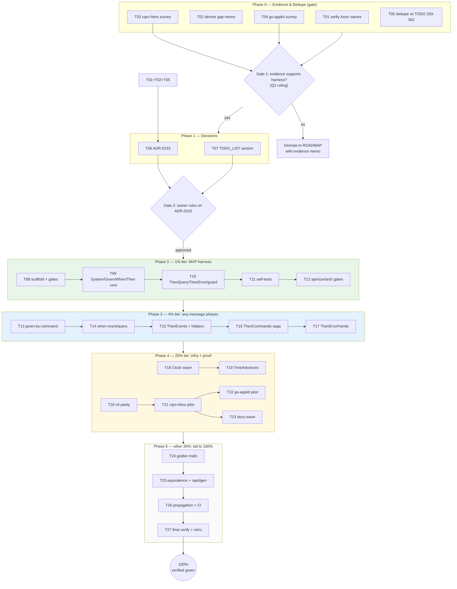

# SUPERB — BDD Testing Harness (Axon-5-informed) Pareto Execution Plan

> **Date:** 2026-10-09 04:04 · **Status:** PLAN (awaiting owner go / Full Execution Mode)
> **Source:** session analysis (Axon 5 comparison) + status report `docs/status/2026-10-09_02-46_axon5-bdd-testing-analysis-session-review.md`
> **Format note:** written as `.md` with mermaid graph per operator instruction (pareto-planning skill default is HTML — explicit override).
> **Companion planning context:** TODO_LIST §"V5 declarative schema evolution" (lines 293-302) is a DIFFERENT axis (schema evolution); this plan rides its T2 (named upcast ops) and T4 (snapshot stamp) where they overlap — no duplication.

## 1. Objective

Give go-cqrs-lite consumers (fleet: **cqrs-htmx** — imports `system/v4` in 11 files, `scenario/v4` in 4; **go-appkit** — thin wrapper, 0 scenario usage today) a **Command/Event-native, system-level BDD testing framework**: Given/When/Then over a real `system.New` boot, informed by Axon Framework 5's `AxonTestFixture` lessons (fixture-from-production-config, any-message-any-phase, time control, legacy shims).

**Verified starting facts (this session):**
- `scenario/v4` (Production, FEATURES.md:1470) covers deciders + projections only — pure functional core, imports just `event`+`projection`.
- NO dispatch-level harness exists; nothing boots `system.New` and asserts across command→dispatch→decider→store→bus→projection→query.
- NO `Clock`/`TimeSource` abstraction in `system`/`scheduling` production code (recursive case-insensitive grep, zero hits).
- `deriver` has 16 unit tests, 0 saga-level Given/When/Then DSL usage.
- `systemtest/fixtures_test.go` has boot-adjacent helpers (`applyTask`, `mustEvent`, `newCmd`, `projectionDecoder`) — a seed to build on.
- Axon 5 research (single-source sub-agent; names pending T01 verification): `AxonTestFixture.with(configurer)` replaces `AggregateTestFixture`/`SagaTestFixture`; any message in any phase; `when().timeElapses(...)`; legacy shims delegate to the new engine.

## 2. Embedded decision recommendations (the 3 open questions)

| Q | Recommendation | Rationale |
|---|---------------|-----------|
| Q1 priority | **Slot as the first v5-era feature wave in small increments, NOT displacing ADR-0152 topology work.** Phase-0 evidence gate (T03/T04) confirms/denies demand before Phase 2+ spend. | Demand signal already real (cqrs-htmx: 11 system imports); MVP is ~1-2 focused days. If Phase 0 contradicts, demote to ROADMAP with evidence. |
| Q2 style | **Plain `testing.T` fluent chains** (scenario/v4-consistent, zero new deps, dep-budget-safe). Ginkgo/Gomega stays a consumer choice, never a library dep. | Budget gate (`#check-arch`) + library-not-framework stance + v4 precedent. |
| Q3 Clock | **`Clock` option on `system.New` only** — `system` is experimental (FEATURES.md), so additive options don't violate the stability promise. `scheduling/` stays untouched until v5. | api-stability golden grows only on an experimental surface; timer testing unlocks without a v5 wait. |

## 3. Pareto breakdown

### The 1% that delivers 51% — **MVP harness skeleton**
`scenario.System(ctx, DomainConfig, DeploymentConfig)` booting `system.New` on memory engines + `Given(events).When(command).Then(eventTypes)` + `ThenQuery` + `ThenError` + vacuous guard. This one surface converts the #1 Axon lesson into code, kills config drift, covers the whole loop end-to-end, and is the skeleton every later phase method layers onto. **Tasks:** T08-T12.

### The 4% that delivers 64% — **any-message-any-phase + assertion completeness**
Given-by-command; `When(event)`; `When(query)`; `ThenEvents` (payload/metadata/actor escape hatch); `ThenCommands` (deriver/saga side-effects); `ThenErrorFamily`. Makes the harness usable for EVERY component type (deciders, projections, sagas, conflict paths). **Tasks:** T13-T17.

### The 20% that delivers 80% — **testability infra + proof**
Virtual `Clock` + `TimeAdvances` (timers/deadlines testable — Axon `timeElapses` analog); v4-parity mapping (no breaks); companion pilots (cqrs-htmx train + go-appkit) proving DX and feeding API fixes; docs wave. **Tasks:** T18-T23.

### The other 20% (to 100%) — **the tail**
Golden-file event trails; observational-equivalence + rapidgen at system level; CI/wave propagation (bench boot-cost, CHANGELOG, codemod no-op check, systemtest README); final verification + retro. **Tasks:** T24-T27.

**Order of execution: 1% first, then 4%, then 20%, then the tail — gated by Phase 0 evidence + ADR-0153 owner ruling.**

## 4. Comprehensive plan — medium tasks (30-100 min each)

Sorted by importance/impact/effort/customer-value (Rank = execution order). Impact: C=Critical, H=High, M=Medium, L=Low. Customer = fleet consumers (cqrs-htmx > go-appkit > apps).

| Rank | ID | Task | Phase/Pareto tier | Impact | Effort | Customer value |
|---|---|---|---|---|---|---|
| 1 | T01 | Verify Axon 5 API names against saved primary pages (`.crush/crush-fetch-2485518710/`) | P0 gate | H | 30m | Indirect: kills hallucinated-API risk before it enters the ADR |
| 2 | T03 | cqrs-htmx test-suite survey: wiring-test styles per train, boot-code duplication pain, pilot-train pick | P0 gate (Q1 evidence) | H | 60m | Direct: harness scoped to real companion pain |
| 3 | T06 | Draft **ADR-0153** (harness design: phases API, module topology, style + Clock rulings, alternatives, consequences) | P1 decision | C | 100m | Unblocks everything |
| 4 | T08 | Module scaffold per ADR ruling + three-gate registration (layers/budget, api-stability maps, cqrs-lint catalog) | P2 / 1% | C | 45m | Importable surface exists |
| 5 | T09 | Harness core: `System()` boot (memory engines) + `Given(events)` + `When(command)` + `Then(types)` w/ precise failure messages | P2 / 1% | C | 100m | The 51% deliverable |
| 6 | T10 | `ThenQuery` (ExecuteTyped) + `ThenError` + vacuous-assertion guard parity | P2 / 1% | H | 60m | Read-model + rejection assertions |
| 7 | T11 | Harness self-tests: happy path, config-drift demo (same DomainConfig as prod fixture), metadata e2e, error-path diagnostics | P2 / 1% | H | 60m | Trust in the harness |
| 8 | T12 | Gates: api-stability golden regen, `#check-arch`, `#check-file-size` (350-line rule) | P2 / 1% | C | 30m | CI stays green |
| 9 | T13 | `Given().Command()` seeding (dispatch-based given) + recursion guard | P3 / 4% | H | 45m | Seed scenarios by intent, not raw events |
| 10 | T14 | `When(event)` (bus path) + `When(query)` phases + combined-phase tests | P3 / 4% | H | 60m | Projection/saga/read-model triggers uniform |
| 11 | T15 | `ThenEvents(inspect)` port + typed payload + metadata/actor assertion helpers | P3 / 4% | H | 60m | Assert beyond event types |
| 12 | T16 | `ThenCommands` / `ThenCommandsSatisfy` — command-capture hook for deriver/saga chains | P3 / 4% | H | 60m | First-ever saga test story |
| 13 | T17 | `ThenErrorFamily` (Rejection/Conflict per errorfamily taxonomy) | P3 / 4% | M | 30m | Fleet-standard error assertions |
| 14 | T18 | `Clock` seam: interface + `WithClock` option on system.New (experimental surface) + timer injection audit | P4 / 20% | H | 100m | Timers/deadlines testable |
| 15 | T19 | `When().TimeAdvances(d)` + deadline/timer scenario | P4 / 20% | H | 60m | Axon timeElapses analog |
| 16 | T20 | v4-parity mapping doc + zero-cost delegations; prove scenario/v4 tests untouched-green | P4 / 20% | H | 45m | No consumer breakage (verschlimmbessern guard) |
| 17 | T21 | **cqrs-htmx pilot:** migrate chosen train to harness; measure DX + suite-time delta; API-feedback memo | P4 / 20% | C | 100m | Proof + real feedback loop |
| 18 | T23 | Docs wave: recipes.md section, advanced.md §6.10 ext, recipes catalog entries, SKILL.md/modules.md rows, doc-check green | P4 / 20% | H | 100m | Discoverability = adoption |
| 19 | T22 | **go-appkit pilot** scenario + feedback | P4 / 20% | M | 45m | Second companion proof |
| 20 | T05 | Dedupe cross-map: this plan vs TODO_LIST:293-302 (rides T2 upcast ops / T4 snapshot stamp); mark pure duplicates | P0 gate | M | 30m | No split-brain with schema-evolution axis |
| 21 | T02 | deriver saga-coverage gap memo (16 unit tests, 0 DSL) → ADR-0153 inputs | P0 gate | M | 30m | Corrects session's overstated claim with evidence |
| 22 | T04 | go-appkit test survey + pilot slice pick | P0 gate (Q1 evidence) | M | 30m | Right-sized second pilot |
| 23 | T07 | TODO_LIST update: new "BDD testing harness" section (owner-ruling checkboxes, mirroring :293 pattern) | P1 decision | H | 30m | Living source of truth |
| 24 | T24 | Golden-file event-trail assert (reuse `eventtest/golden.go`) | P5 / tail | L | 60m | Regression-friendly scenario diffs |
| 25 | T25 | `AssertObservationalEquivalence` system-level wrapper + rapidgen property feed | P5 / tail | L | 60m | Composability proofs at full-system level |
| 26 | T26 | Propagation: harness boot-cost bench, CI wiring, CHANGELOG entry, codemod no-op check, `systemtest/README.md` | P5 / tail | M | 60m | Wave hygiene |
| 27 | T27 | Final verification: `nix run .#verify` + companion suites green + retro (lessons → AGENTS/testing gotchas) + plan addendum | P5 / tail | C | 60m | Definition of done |

**Totals:** 27 tasks · ~17.5h · Phase 0 ≈ 3h · 1% tier ≈ 5.5h · 4% tier ≈ 4.2h · 20% tier ≈ 6.5h · tail ≈ 4h.

## 5. Fine breakdown — ALL tasks ≤12 min each

111 fine tasks, grouped by parent. Sorted by parent rank (= execution order). Effort = minutes.

### T01 Verify Axon names (P0)
| ID | Task | Impact | Effort |
|---|---|---|---|
| F01.1 | Read saved AxonTestFixture reference page from `.crush/crush-fetch-2485518710/`; confirm class name + `with(configurer)` | H | 8m |
| F01.2 | Read saved `AxonTestPhase` apidoc; confirm given/when/then phase methods | H | 8m |
| F01.3 | Read saved api-changes/07 (entities + test fixtures); confirm fixture-replaces-aggregate-fixture claim | H | 8m |
| F01.4 | Record verified-names table into ADR-0153 inputs; flag any mismatch vs session claims | H | 6m |

### T02 deriver gap memo (P0)
| ID | Task | Impact | Effort |
|---|---|---|---|
| F02.1 | Map the 16 deriver tests: what flows are covered | M | 10m |
| F02.2 | List saga-shaped UNcovered flows (event→command chains) | M | 10m |
| F02.3 | Write gap memo section for ADR-0153 | M | 10m |

### T03 cqrs-htmx survey (P0)
| ID | Task | Impact | Effort |
|---|---|---|---|
| F03.1 | Inventory cqrs-htmx test files touching system/v4 (11 files) | H | 10m |
| F03.2 | Classify wiring-test style per file (boot duplication, fakes, real engines) | H | 12m |
| F03.3 | Quantify boot-code duplication (lines repeated per train) | H | 10m |
| F03.4 | Select pilot train (max pain + representative) | H | 8m |
| F03.5 | Record evidence numbers into plan/ADR (demand signal for Q1) | H | 8m |

### T04 go-appkit survey (P0)
| ID | Task | Impact | Effort |
|---|---|---|---|
| F04.1 | Survey appkit test files (8 prod files context) | M | 10m |
| F04.2 | Pick pilot slice (wrapper surface) | M | 10m |
| F04.3 | Record evidence | M | 8m |

### T05 Dedupe cross-map (P0)
| ID | Task | Impact | Effort |
|---|---|---|---|
| F05.1 | Map this plan's upcast-in-given item onto TODO T2 named upcast ops (ride, don't build) | M | 10m |
| F05.2 | Map snapshot round-trip assert onto TODO T4 stamp (ride) | M | 8m |
| F05.3 | Mark pure duplicates (if any) in both docs; note in ADR | M | 8m |

### T06 ADR-0153 (P1)
| ID | Task | Impact | Effort |
|---|---|---|---|
| F06.1 | Context + verified Axon lessons section | C | 12m |
| F06.2 | Decision: phases API sketch (Go signatures) | C | 12m |
| F06.3 | Decision: module topology (scenario/v5 new module vs systemtest export; ADR-0152 alignment) | C | 12m |
| F06.4 | Decision: style ruling (testing.T; rationale vs Ginkgo) | C | 8m |
| F06.5 | Decision: Clock ruling (system-only, experimental surface) | C | 10m |
| F06.6 | Alternatives considered (status quo, Ginkgo lib, Axon-port) | H | 10m |
| F06.7 | Consequences + verschlimmbessern guardrails section | H | 10m |
| F06.8 | Self-review ADR vs ADR-0123/0152/0136 consistency; commit | C | 12m |

### T07 TODO_LIST section (P1)
| ID | Task | Impact | Effort |
|---|---|---|---|
| F07.1 | Add "BDD testing harness (proposed 2026-10-09)" section: owner-ruling checkbox + tier checkboxes + plan link | H | 12m |
| F07.2 | Verify checkbox/link format matches repo conventions | H | 6m |

### T08 Module scaffold (P2)
| ID | Task | Impact | Effort |
|---|---|---|---|
| F08.1 | Create module dir + go.mod per ADR topology ruling | C | 10m |
| F08.2 | Add to go.work | C | 5m |
| F08.3 | Register in check-module-layers.sh (tier + DEP_BUDGET w/ rationale) | C | 10m |
| F08.4 | Register in api-stability maps + cqrs-lint module catalog; run both meta-tests | C | 12m |

### T09 Harness core (P2)
| ID | Task | Impact | Effort |
|---|---|---|---|
| F09.1 | `System(ctx, domainCfg, deployCfg)` constructor: memory-engine DeploymentConfig boot via system.New | C | 12m |
| F09.2 | `Given(events...)`: journal seeding (correct stream refs + versions) | C | 12m |
| F09.3 | `When(command)`: dispatch through system dispatcher; capture outcome | C | 12m |
| F09.4 | `Then(types...)`: journal diff compare (order-sensitive) | C | 12m |
| F09.5 | Failure messages: want vs got, stream, version, actor context | H | 10m |
| F09.6 | Happy-path self-test (counter domain fixture) | C | 12m |

### T10 ThenQuery/ThenError/guard (P2)
| ID | Task | Impact | Effort |
|---|---|---|---|
| F10.1 | `ThenQuery(fn, want)` via ExecuteTyped closure pattern (ThenQueryResult parity) | H | 12m |
| F10.2 | `ThenError(target)` with errorfamily-aware matching | H | 12m |
| F10.3 | Vacuous-assertion guard port (dsl.go:81 pattern) | H | 12m |
| F10.4 | Tests for all three | H | 12m |

### T11 Harness self-tests (P2)
| ID | Task | Impact | Effort |
|---|---|---|---|
| F11.1 | Config-drift demo: one DomainConfig used by prod fixture AND harness test | H | 12m |
| F11.2 | Metadata/actor assertion e2e through full loop | H | 12m |
| F11.3 | Error-path diagnostics test (assert failure output quality) | H | 12m |
| F11.4 | Suite timing sanity (boot cost per scenario) | M | 10m |

### T12 Gates (P2)
| ID | Task | Impact | Effort |
|---|---|---|---|
| F12.1 | `api-stability --update` + review diff | C | 10m |
| F12.2 | `nix run .#check-arch` green | C | 10m |
| F12.3 | `nix run .#check-file-size` green (fix/split if >350) | C | 10m |

### T13 Given-by-command (P3)
| ID | Task | Impact | Effort |
|---|---|---|---|
| F13.1 | `Given().Command(...)` impl (dispatch, journal grows) | H | 12m |
| F13.2 | Recursion/order guard (given commands run in order, errors fatal) | H | 10m |
| F13.3 | Tests: seed-by-command → When → Then | H | 12m |

### T14 When(event)/When(query) (P3)
| ID | Task | Impact | Effort |
|---|---|---|---|
| F14.1 | `When().Event(...)` via bus publish; projection visibility | H | 12m |
| F14.2 | `When().Query(q, want)` phase | H | 12m |
| F14.3 | Combined-phase test (given cmd → when event → then query) | H | 12m |
| F14.4 | Doc snippet for each phase | M | 8m |

### T15 ThenEvents + helpers (P3)
| ID | Task | Impact | Effort |
|---|---|---|---|
| F15.1 | `ThenEvents(inspect)` port from v4 | H | 10m |
| F15.2 | Typed payload helper (decode payload[i] → compare) | H | 12m |
| F15.3 | Metadata/actor helper (`ThenMetadata` spot-check) | H | 12m |
| F15.4 | Tests | H | 12m |

### T16 ThenCommands (P3)
| ID | Task | Impact | Effort |
|---|---|---|---|
| F16.1 | Command-capture hook in harness boot (dispatcher middleware) | H | 12m |
| F16.2 | `ThenCommands(types...)` | H | 12m |
| F16.3 | `ThenCommandsSatisfy(inspect)` | H | 10m |
| F16.4 | Tests incl. deriver event→command chain (first saga story) | H | 12m |

### T17 ThenErrorFamily (P3)
| ID | Task | Impact | Effort |
|---|---|---|---|
| F17.1 | `ThenErrorFamily(family)` impl | M | 10m |
| F17.2 | Tests: Rejection vs Conflict paths | M | 10m |
| F17.3 | Doc row | M | 5m |

### T18 Clock seam (P4)
| ID | Task | Impact | Effort |
|---|---|---|---|
| F18.1 | Clock interface design (system-local, zero-dep) | H | 10m |
| F18.2 | `WithClock` option on system.New | H | 12m |
| F18.3 | Timer-wheel injection audit in system (where Now() is read) | H | 12m |
| F18.4 | ManualClock impl (freeze/advance) exported for tests | H | 12m |
| F18.5 | Timer tests with frozen clock | H | 12m |
| F18.6 | Sanity: default clock path unchanged (production behavior identical) | H | 10m |

### T19 TimeAdvances (P4)
| ID | Task | Impact | Effort |
|---|---|---|---|
| F19.1 | `When().TimeAdvances(d)` method | H | 12m |
| F19.2 | Deadline/timer scenario test | H | 12m |
| F19.3 | Edge: TimeAdvances with no timers registered | M | 8m |

### T20 v4 parity (P4)
| ID | Task | Impact | Effort |
|---|---|---|---|
| F20.1 | v4↔v5 API mapping doc section | H | 12m |
| F20.2 | Zero-cost delegations where free (else documented side-by-side) | H | 12m |
| F20.3 | Regression: scenario/v4 suite untouched-green | H | 10m |

### T21 cqrs-htmx pilot (P4)
| ID | Task | Impact | Effort |
|---|---|---|---|
| F21.1 | Write first harness scenario for pilot train | C | 12m |
| F21.2 | Migrate remaining cases of that train | C | 12m |
| F21.3 | Run train suite green | C | 12m |
| F21.4 | Measure suite-time delta vs old style | H | 10m |
| F21.5 | DX/API-feedback memo → harness fixes | C | 12m |
| F21.6 | Commit pilot in cqrs-htmx (their conventions) | H | 12m |

### T22 go-appkit pilot (P4)
| ID | Task | Impact | Effort |
|---|---|---|---|
| F22.1 | Appkit pilot scenario | M | 12m |
| F22.2 | Run + feedback | M | 12m |
| F22.3 | Commit per appkit conventions | M | 10m |

### T23 Docs wave (P4)
| ID | Task | Impact | Effort |
|---|---|---|---|
| F23.1 | recipes.md section draft (harness quickstart + phases) | H | 12m |
| F23.2 | advanced.md §6.10 extension | H | 10m |
| F23.3 | recipes catalog classification entries (doc-check compile gate) | H | 12m |
| F23.4 | SKILL.md + references/modules.md row updates | H | 10m |
| F23.5 | Run doc-check; zero warnings | C | 12m |
| F23.6 | AGENTS.md internal-contracts entry (harness conventions) | M | 10m |

### T24 Golden trails (P5)
| ID | Task | Impact | Effort |
|---|---|---|---|
| F24.1 | Golden trail format design (reuse eventtest/golden.go) | L | 12m |
| F24.2 | `ThenGoldenFile` impl | L | 12m |
| F24.3 | Update-flag mechanism | L | 10m |
| F24.4 | Tests | L | 10m |

### T25 Equivalence + rapidgen (P5)
| ID | Task | Impact | Effort |
|---|---|---|---|
| F25.1 | `AssertObservationalEquivalence` system-level wrapper | L | 12m |
| F25.2 | rapidgen feed into harness (random command sequences) | L | 12m |
| F25.3 | Fuzz smoke test | L | 12m |
| F25.4 | Docs note | L | 6m |

### T26 Propagation (P5)
| ID | Task | Impact | Effort |
|---|---|---|---|
| F26.1 | Harness boot-cost bench (scenario/s) | M | 12m |
| F26.2 | CI wiring for new module (testModules if applicable per topology ruling) | M | 10m |
| F26.3 | CHANGELOG entry (symbols pass check-changelog-symbols) | M | 10m |
| F26.4 | cqrs-upgrade codemod check (expect no-op; document) | L | 8m |
| F26.5 | Write systemtest/README.md (missing; noticed this session) | M | 10m |

### T27 Final verification (P5)
| ID | Task | Impact | Effort |
|---|---|---|---|
| F27.1 | `nix run .#verify` green | C | 12m |
| F27.2 | Companion suites green (cqrs-htmx + go-appkit) | C | 12m |
| F27.3 | Retro: lessons → AGENTS.md/testing gotchas (incl. verify-before-claim rule) | H | 10m |
| F27.4 | Plan addendum (DONE/PARTIAL/NOT SHIPPED per section) | H | 10m |

## 6. Execution graph (mermaid)

**Gate semantics:** Phase 0 output is the Q1 ruling evidence; Gate 2 (ADR-0153 owner ruling) matches the existing TODO_LIST:297 ruling pattern. If Gate 1 says no: only T01/T02/T05 findings survive (as evidence memos) — nothing else is built.

## 7. Guardrails (verschlimmbessern protection)

1. **Zero v4 API breaks** — `scenario/v4` stays untouched-green (F20.3 proves it); deprecated shells removal stays v5-gated per AGENTS.md.
2. **No new production deps** — the harness module imports only in-repo modules; dep budget registered with rationale (T08).
3. **350-line / 30-line rules** — checked at T12, not at the end.
4. **ADR-0123 compliance** — the harness boots `system.New`; it never hand-wires low-level modules.
5. **No duplication of the schema-evolution axis** — upcast-in-given rides TODO T2, snapshot asserts ride T4 (T05 map).
6. **`scheduling/` untouched until v5** — Clock lives in experimental `system` only (Q3 ruling).
7. **Every phase gate runs tests** — no phase exits red; pilots measured (suite-time delta) before docs claim wins.
8. **Point-in-time artifact** — this plan goes stale; ANNOTATE, never rewrite; new tasks → TODO_LIST via docs-health HARVEST.

## 8. Post-plan obligations

- TODO_LIST section added (T07) — the living source; this file is the snapshot.
- On approval: Full Execution Mode — top to bottom, gates respected, every task verified.
