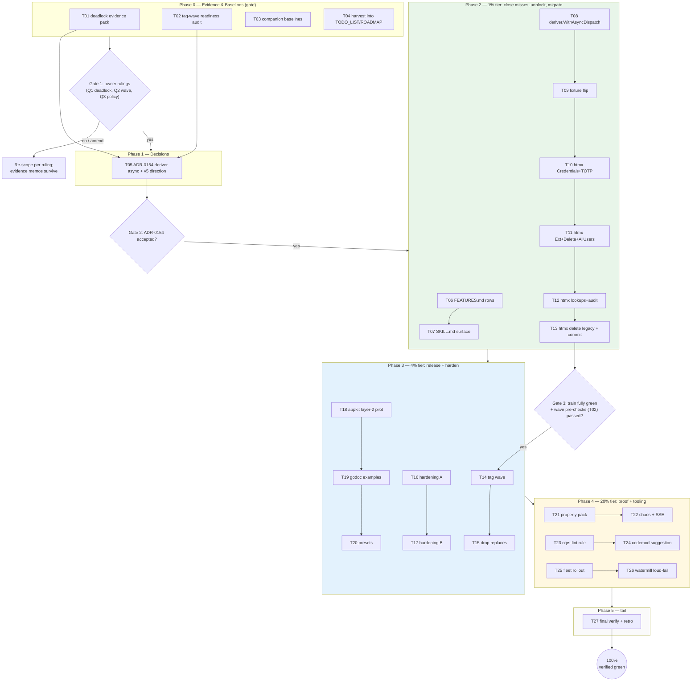

# SUPERB — BDD Harness Adoption Wave: Release, Migrate, Harden, Clean Up

> **Date:** 2026-10-09 14:49 · **Status:** EXECUTED 27/27 (addendum below, 2026-10-10)
> **Source:** status report [`docs/status/2026-10-09_14-40_systemscenario-bdd-harness-full-execution-status.md`](../status/2026-10-09_14-40_systemscenario-bdd-harness-full-execution-status.md) §b/§c/§f, plus re-verified repo state at 14:45.
> **Predecessor:** [`2026-10-09_04-04_SUPERB-bdd-testing-harness-pareto-plan.md`](2026-10-09_04-04_SUPERB-bdd-testing-harness-pareto-plan.md) — EXECUTED 27/27 (see its addendum). This plan is the adoption wave that plan ended on.
> **Format note:** `.md` + mermaid per operator instruction (pareto-planning skill default is HTML — explicit override, consistent with the 04-04 precedent).

## 1. Objective

Convert the shipped `systemscenario` harness from "exists and is green" into **adopted, released, hardened fleet infrastructure**: close the documentation misses the execution session left (FEATURES.md, SKILL.md), unblock and fix the deriver-bus deadlock the harness discovered, ride the tag wave so both companions drop their pre-tag local replaces, migrate the full cqrs-htmx user train, and deepen the proof (properties, chaos, SSE, lint/codemod tooling).

**Verified starting facts (re-verified 2026-10-09 14:45):**

- `systemscenario/v4`: suite green (25 test functions, race-clean), ~1.6 ms per full scenario (bench), registered in all three module gates + api-stability golden; `module-map.md` row EXISTS.
- **FEATURES.md and SKILL.md: 0 mentions of systemscenario** (the two confirmed doc misses).
- Companion pilots green (cqrs-htmx `systemadapter` 3 tests; go-appkit `cqrs` 2 tests via `Adopt`), but both carry **pre-tag local replaces in 4 files** (htmx go.work + systemadapter/go.mod; appkit go.work + cqrs/go.mod) that only a tag wave can drop.
- **Deadlock finding open:** a synchronous deriver on `sys.Bus()` deadlocks (single-topic watermill EventBus + `BlockPublishUntilSubscriberAck: true`; derived dispatch re-publishes inside the handler the publisher waits on). Harness fixture works around it with a goroutine.
- `#verify` is tree-red from CONCURRENT agents' work (`core/v5` missing `.go-arch-lint.yml`; V007 marker-table drift; metaengine file-size offenders) — **external to this plan**, tracked in §7.
- Both companions' FULL repo suites not yet run this session (only the piloted modules).

## 2. Embedded decision recommendations (the 3 open questions → rulings)

| Q                   | Recommendation                                                                                                                                     | Rationale                                                                                                                                                                                                                                                                                                                           |
| ------------------- | -------------------------------------------------------------------------------------------------------------------------------------------------- | ----------------------------------------------------------------------------------------------------------------------------------------------------------------------------------------------------------------------------------------------------------------------------------------------------------------------------------- |
| Q1 deadlock fix     | **(b) `deriver.WithAsyncDispatch` option NOW (additive, ~90 min), (c) journal-tailed deriver host as the v5 direction (ADR-0154 records both).**   | (a) async bus delivery changes global ordering semantics for every consumer — too risky for v4.x; (b) unblocks sagas today and makes the workaround first-class (error callback instead of swallowed goroutine errors); (c) is the architecturally right endgame (survives restarts, ordered) but is new infrastructure — v5-scale. |
| Q2 tag wave         | **Ride the NEXT wave:** `systemscenario/v4 v4.0.0` + `system/v4.12.0` (Clock) + `scheduling` (WithClock).**                                        | Both companions carry pre-tag replaces = active friction; ADR-0152 says v4 trains keep tagging; additive-only changes. Wave hygiene per the 2026-10-06 lesson: batch-release `verify=ok` builds but does NOT run tests — full per-module suites over the changed set BEFORE tagging.                                                |
| Q3 companion policy | **Migrate-and-delete per train:** once a cqrs-htmx train is fully migrated and green, DELETE the legacy `eventually`-style tests for that train.** | Two test styles for the same behavior is a split brain that drifts; the harness version is the strict superset (same DomainConfig, better diagnostics). Never bulk-delete — per train, after green.                                                                                                                                 |

## 3. Pareto breakdown

### The 1% that delivers 51% — **close the misses + unblock sagas + migrate the train**

FEATURES.md/SKILL.md rows (discoverability = adoption), `deriver.WithAsyncDispatch` (correct, first-class saga wiring), and the full cqrs-htmx user-train migration (the pain the harness was built for: 51 raw dispatch sites live in that file today). **Tasks:** T06–T13.

### The 4% that delivers 64% — **release it + harden the surface**

The tag wave (drops 4 replace files, ships value to the fleet), harness hardening pack (await-mode symmetry, timeout error surfacing, quiet window, capture filter), go-appkit layer-2 pilot, godoc examples, one-liner presets. **Tasks:** T14–T20.

### The 20% that delivers 80% — **proof depth + tooling**

Property pack (fold-vs-read-model invariant, allocs bench), chaos leg (DelayedJournal), SSE assertions, cqrs-lint advisory rule + cqrs-upgrade suggestion rule, fleet rollout (taskmanager, goal-shaped-app), watermill reentrancy loud-fail. **Tasks:** T21–T26.

### The other 20% (to 100%) — **the tail**

Final verify, CHANGELOG wave entry, retro, plan addendum — plus the externally-blocked items (§7) and the v5 arcs this plan only records (systemscenario absorbs scenario/v4; DCB research note; journal-tailed deriver host design). **Tasks:** T27 + §7/§8.

**Order: 1% first, then 4%, then 20%, then the tail — gated by G1 (owner rulings on Q1–Q3) and G2 (release gate after migrations are green).**

## 4. Comprehensive plan — medium tasks (30–100 min each)

Sorted by importance/impact/effort/customer-value (Rank = execution order). Impact: C=Critical, H=High, M=Medium, L=Low. Customer = fleet consumers (cqrs-htmx > go-appkit > apps/examples).

| Rank | ID  | Task                                                                                                                                                                         | Phase/Pareto tier     | Impact | Effort | Customer value                                                  |
| ---- | --- | ---------------------------------------------------------------------------------------------------------------------------------------------------------------------------- | --------------------- | ------ | ------ | --------------------------------------------------------------- |
| 1    | T01 | Deriver deadlock evidence pack: repro documentation (observed stack), option-design memo (a/b/c tradeoffs), async error-surfacing design                                     | P0 gate (Q1 evidence) | H      | 45m    | Indirect: kills ruling ambiguity before ADR-0154                |
| 2    | T02 | Tag-wave readiness audit: changed-module set vs last tags, FULL per-module tests over changed set (system, scheduling, systemscenario, scenario), wave manifest draft        | P0 gate (Q2 evidence) | H      | 45m    | The 2026-10-06 red-suite-through-wave failure mode cannot recur |
| 3    | T03 | Companion full-repo baseline runs (cqrs-htmx root, go-appkit root) — record green baselines before the wave touches them                                                     | P0 gate               | M      | 30m    | No surprise breakage during release                             |
| 4    | T04 | HARVEST: this plan + the 14:40 status report §f + the 02-46 report residue → TODO_LIST/ROADMAP (the living source)                                                           | P0/P1                 | H      | 60m    | No entombed tasks; docs-health loop closed                      |
| 5    | T05 | **ADR-0154**: deriver async-dispatch option (b) now + journal-tailed deriver host (c) as v5 direction; Q1 recorded; self-review vs ADR-0142/0153                             | P1 decision           | C      | 60m    | Unblocks T08/T26 direction                                      |
| 6    | T06 | FEATURES.md rows: systemscenario (Experimental), system Clock seam, scheduling.WithClock + maturity matrix row                                                               | P2 / 1%               | H      | 30m    | The honest inventory stops lying by omission                    |
| 7    | T07 | SKILL.md surface: systemscenario line in the module surface + doc-check green                                                                                                | P2 / 1%               | H      | 30m    | Skill-level discoverability for every future session            |
| 8    | T08 | `deriver.WithAsyncDispatch` option: async dispatch + error callback, ordering caveat docs, unit tests, budget check                                                          | P2 / 1%               | C      | 90m    | First-class saga wiring; workaround becomes API                 |
| 9    | T09 | systemscenario saga fixture flips goroutine → WithAsyncDispatch; deadlock note in README updated                                                                             | P2 / 1%               | H      | 30m    | The harness teaches the sanctioned pattern                      |
| 10   | T10 | cqrs-htmx: migrate UserCredentials + UserTOTP tests to harness                                                                                                               | P2 / 1%               | H      | 75m    | Train completion (2 of 5 remaining groups)                      |
| 11   | T11 | cqrs-htmx: migrate ExternalAccounts + UserDelete + AllUsers                                                                                                                  | P2 / 1%               | H      | 75m    | Train completion (rest)                                         |
| 12   | T12 | cqrs-htmx: migrate remaining 7 MissingLookups + audit-entry asserts (`ThenQueryFunc`)                                                                                        | P2 / 1%               | H      | 60m    | Full negative-path + audit coverage in harness style            |
| 13   | T13 | cqrs-htmx: DELETE migrated legacy tests (Q3 policy, per train) + full systemadapter suite green + authored commit                                                            | P2 / 1%               | C      | 45m    | No split brain; the 1242-line file shrinks for real             |
| 14   | T14 | **Tag wave**: systemscenario/v4 v4.0.0 + system v4.12.0 + scheduling bump — pre-tag full tests, batch-release, remote tag count assert, proxy fetch probe, CHANGELOG section | P3 / 4%               | C      | 100m   | The fleet gets the harness; replaces become droppable           |
| 15   | T15 | Drop pre-tag replaces in BOTH companions (4 files) + tidy + full suites green                                                                                                | P3 / 4%               | H      | 60m    | Dev friction gone; published versions                           |
| 16   | T16 | Harness hardening A: `ThenCommandsSatisfy` await variant + timeout last-error surfacing (query funcs report the last query error, not just check message)                    | P3 / 4%               | H      | 60m    | Symmetric assertions + honest timeouts                          |
| 17   | T17 | Harness hardening B: `WithQuietWindow` (ThenNoEvents under await) + `WithCommandCaptureFilter`                                                                               | P3 / 4%               | M      | 60m    | Faster negative tests; capture noise control                    |
| 18   | T18 | go-appkit layer-2 pilot: integration module via `Adopt` + `testkit.Serve`                                                                                                    | P3 / 4%               | M      | 75m    | HTTP-level harness proof                                        |
| 19   | T19 | systemscenario `example_test.go`: runnable godoc examples (System, saga, TimeAdvances)                                                                                       | P3 / 4%               | M      | 45m    | pkg.go.dev-quality onboarding                                   |
| 20   | T20 | Harness presets: `systemscenario.Memory()` / `.SQLite(t)` one-liners; pilots adopt them                                                                                      | P3 / 4%               | M      | 45m    | Boilerplate gone at every call site                             |
| 21   | T21 | Property pack: fold-state vs read-model equivalence invariant (rapid) + allocs/op bench + README metrics                                                                     | P4 / 20%              | H      | 60m    | Correctness depth + perf visibility                             |
| 22   | T22 | Chaos + SSE: DelayedJournal scenario (ordering under latency) + ServeSSE assertion helper                                                                                    | P4 / 20%              | M      | 75m    | Real-world conditions pinned                                    |
| 23   | T23 | cqrs-lint advisory rule: system-booting test file without harness usage (E019-style)                                                                                         | P4 / 20%              | M      | 75m    | Adoption becomes the linted default                             |
| 24   | T24 | cqrs-upgrade suggestion rule: `eventually`-style blocks → `ThenQuery` hint                                                                                                   | P4 / 20%              | M      | 60m    | Migration accel across the fleet                                |
| 25   | T25 | Fleet rollout: example/taskmanager + example/goal-shaped-app suites onto the harness                                                                                         | P4 / 20%              | H      | 90m    | Dogfooding beyond the two companions                            |
| 26   | T26 | watermill reentrancy loud-fail: detect nested publish from a handler and return a named error instead of hanging                                                             | P4 / 20%              | H      | 60m    | The deadlock class becomes impossible to hit silently           |
| 27   | T27 | Final verification: `nix run .#verify` (mine green; externals itemized), companion suites, retro → AGENTS/gotchas, CHANGELOG symbols gate, plan addendum                     | P5 / tail             | C      | 60m    | Definition of done                                              |

**Totals:** 27 tasks · ~26.5h · P0 ≈ 3h · P2 (1%) ≈ 7h · P3 (4%) ≈ 7.5h · P4 (20%) ≈ 7h · tail ≈ 1h.

## 5. Fine breakdown — ALL tasks ≤12 min each

106 fine tasks, grouped by parent (rank order). Effort = minutes.

### T01 Deadlock evidence pack (P0)

| ID    | Task                                                                                                | Impact | Effort |
| ----- | --------------------------------------------------------------------------------------------------- | ------ | ------ |
| F01.1 | Document the repro: sync deriver on sys.Bus() — observed stack, minimal wiring, hang condition      | H      | 10m    |
| F01.2 | Option-design memo: (a) async bus delivery / (b) deriver option / (c) journal-tailed host tradeoffs | H      | 12m    |
| F01.3 | Async error-surfacing design (callback vs logger; ordering caveat wording)                          | H      | 10m    |
| F01.4 | Record all three into ADR-0154 inputs; flag mismatch vs workaround                                  | H      | 8m     |

### T02 Tag-wave readiness (P0)

| ID    | Task                                                                | Impact | Effort |
| ----- | ------------------------------------------------------------------- | ------ | ------ |
| F02.1 | Changed-module set from git log since each module's last tag        | H      | 10m    |
| F02.2 | FULL per-module tests: system, scheduling, systemscenario, scenario | C      | 12m    |
| F02.3 | Wave manifest draft: versions, CHANGELOG section mapping            | H      | 10m    |
| F02.4 | Release-scripts smoke (`#check-release-scripts`) green              | M      | 10m    |

### T03 Companion baselines (P0)

| ID    | Task                                   | Impact | Effort |
| ----- | -------------------------------------- | ------ | ------ |
| F03.1 | cqrs-htmx full-repo suite run + record | M      | 12m    |
| F03.2 | go-appkit full-repo suite run + record | M      | 12m    |
| F03.3 | Baselines noted into plan appendix     | M      | 6m     |

### T04 HARVEST (P0/P1)

| ID    | Task                                                                       | Impact | Effort |
| ----- | -------------------------------------------------------------------------- | ------ | ------ |
| F04.1 | Re-read 14:40 §f + 02-46 residue; dedupe against TODO_LIST                 | H      | 10m    |
| F04.2 | TODO_LIST: adoption-wave section + closure of stale checkboxes             | H      | 12m    |
| F04.3 | ROADMAP: v5 arcs (deriver host, systemscenario absorbs scenario, DCB note) | M      | 10m    |
| F04.4 | Verify links/checkbox format per repo conventions                          | M      | 8m     |

### T05 ADR-0154 (P1)

| ID    | Task                                                       | Impact | Effort |
| ----- | ---------------------------------------------------------- | ------ | ------ |
| F05.1 | Context: deadlock evidence + T01 memos                     | C      | 12m    |
| F05.2 | Decision (b): WithAsyncDispatch API sketch (Go signatures) | C      | 12m    |
| F05.3 | Decision (c): journal-tailed deriver host as v5 direction  | H      | 10m    |
| F05.4 | Alternatives considered + consequences                     | H      | 10m    |
| F05.5 | Self-review vs ADR-0142/0153/0136; commit                  | C      | 12m    |

### T06 FEATURES.md rows (P2)

| ID    | Task                                                   | Impact | Effort |
| ----- | ------------------------------------------------------ | ------ | ------ |
| F06.1 | systemscenario feature row (status: Experimental)      | H      | 10m    |
| F06.2 | system Clock/WithClock + scheduling.WithClock entries  | H      | 10m    |
| F06.3 | Maturity-matrix row for systemscenario                 | H      | 8m     |
| F06.4 | Run README gates (`check-readme-*` unaffected; sanity) | M      | 10m    |

### T07 SKILL.md surface (P2)

| ID    | Task                                                                            | Impact | Effort |
| ----- | ------------------------------------------------------------------------------- | ------ | ------ |
| F07.1 | SKILL.md: systemscenario line (when-to-use pointer to modules.md/recipes §2.43) | H      | 10m    |
| F07.2 | Cross-reference in SKILL.md references list                                     | M      | 8m     |
| F07.3 | doc-check green on SKILL.md                                                     | H      | 10m    |

### T08 deriver.WithAsyncDispatch (P2)

| ID    | Task                                                       | Impact | Effort |
| ----- | ---------------------------------------------------------- | ------ | ------ |
| F08.1 | Option type + config plumbing                              | C      | 12m    |
| F08.2 | Async dispatch path + error callback invocation            | C      | 12m    |
| F08.3 | Ordering caveat + error-surfacing docs                     | H      | 10m    |
| F08.4 | Unit tests: async fires, error surfaces, option off = sync | C      | 12m    |
| F08.5 | Dep budget + api-stability regen                           | H      | 6m     |

### T09 Fixture flip (P2)

| ID    | Task                                          | Impact | Effort |
| ----- | --------------------------------------------- | ------ | ------ |
| F09.1 | sagaDomain: goroutine → WithAsyncDispatch     | H      | 10m    |
| F09.2 | Saga test green (Await still required)        | H      | 10m    |
| F09.3 | systemscenario README constraint note updated | M      | 8m     |

### T10 htmx: Credentials + TOTP (P2)

| ID    | Task                                                    | Impact | Effort |
| ----- | ------------------------------------------------------- | ------ | ------ |
| F10.1 | Read the two legacy tests fully                         | H      | 10m    |
| F10.2 | Migrate UserCredentials (asserts incl. credential view) | H      | 12m    |
| F10.3 | Migrate UserTOTP                                        | H      | 12m    |
| F10.4 | Suite green                                             | C      | 8m     |

### T11 htmx: ExternalAccounts + Delete + AllUsers (P2)

| ID    | Task                                     | Impact | Effort |
| ----- | ---------------------------------------- | ------ | ------ |
| F11.1 | Migrate UserExternalAccounts             | H      | 12m    |
| F11.2 | Migrate UserDelete (tombstone semantics) | H      | 12m    |
| F11.3 | Migrate AllUsers (list query)            | H      | 12m    |
| F11.4 | Suite green                              | C      | 8m     |

### T12 htmx: lookups + audit (P2)

| ID    | Task                                          | Impact | Effort |
| ----- | --------------------------------------------- | ------ | ------ |
| F12.1 | Migrate remaining 7 MissingLookups assertions | H      | 12m    |
| F12.2 | Audit-entry asserts via ThenQueryTyped        | H      | 12m    |
| F12.3 | Suite green                                   | C      | 8m     |

### T13 htmx: delete legacy + commit (P2)

| ID    | Task                                                                      | Impact | Effort |
| ----- | ------------------------------------------------------------------------- | ------ | ------ |
| F13.1 | Delete the migrated legacy test functions (per Q3 ruling)                 | C      | 12m    |
| F13.2 | Full systemadapter suite green                                            | C      | 12m    |
| F13.3 | Authored commit in cqrs-htmx (beat the daemon: --no-verify if mechanical) | H      | 10m    |

### T14 Tag wave (P3)

| ID    | Task                                                         | Impact | Effort |
| ----- | ------------------------------------------------------------ | ------ | ------ |
| F14.1 | Pre-tag gate: changed-set tests + verify-fast                | C      | 12m    |
| F14.2 | batch-release.sh run for the 3 modules                       | C      | 12m    |
| F14.3 | Remote tag count assert (count-asserted, never textual grep) | C      | 10m    |
| F14.4 | Proxy fetch probe (`go get module@tag` in scratch module)    | C      | 10m    |
| F14.5 | CHANGELOG version section + symbols gate                     | H      | 10m    |

### T15 Drop replaces (P3)

| ID    | Task                                                      | Impact | Effort |
| ----- | --------------------------------------------------------- | ------ | ------ |
| F15.1 | cqrs-htmx: remove go.work + systemadapter/go.mod replaces | H      | 12m    |
| F15.2 | cqrs-htmx: tidy + full suite green on published versions  | H      | 12m    |
| F15.3 | go-appkit: remove go.work + cqrs/go.mod replaces          | H      | 10m    |
| F15.4 | go-appkit: tidy + full suite green                        | H      | 12m    |

### T16 Hardening A (P3)

| ID    | Task                                                              | Impact | Effort |
| ----- | ----------------------------------------------------------------- | ------ | ------ |
| F16.1 | ThenCommandsSatisfy await-mode variant                            | H      | 12m    |
| F16.2 | Timeout last-error capture (query err vs check msg) in await core | H      | 12m    |
| F16.3 | Tests for both                                                    | H      | 12m    |
| F16.4 | README/docs rows                                                  | M      | 6m     |

### T17 Hardening B (P3)

| ID    | Task                                 | Impact | Effort |
| ----- | ------------------------------------ | ------ | ------ |
| F17.1 | WithQuietWindow option               | M      | 12m    |
| F17.2 | ThenNoEvents uses window under await | M      | 10m    |
| F17.3 | WithCommandCaptureFilter option      | M      | 12m    |
| F17.4 | Tests + docs                         | H      | 12m    |

### T18 appkit layer-2 pilot (P3)

| ID    | Task                                                      | Impact | Effort |
| ----- | --------------------------------------------------------- | ------ | ------ |
| F18.1 | Read integration module fixtures (cqrs_lifecycle_test.go) | M      | 12m    |
| F18.2 | Adopt scenario over EventService in integration           | M      | 12m    |
| F18.3 | Combine with testkit.Serve (HTTP + harness)               | M      | 12m    |
| F18.4 | Run + feedback memo                                       | M      | 10m    |

### T19 godoc examples (P3)

| ID    | Task                                                        | Impact | Effort |
| ----- | ----------------------------------------------------------- | ------ | ------ |
| F19.1 | Example (System happy path)                                 | M      | 12m    |
| F19.2 | Example (saga via WithAsyncDispatch + Await + ThenCommands) | M      | 12m    |
| F19.3 | Example (TimeAdvances deadline)                             | M      | 10m    |
| F19.4 | `go vet` examples compile                                   | H      | 6m     |

### T20 Presets (P3)

| ID    | Task                                   | Impact | Effort |
| ----- | -------------------------------------- | ------ | ------ |
| F20.1 | Memory() preset constructor            | M      | 12m    |
| F20.2 | SQLite(t) preset constructor           | M      | 12m    |
| F20.3 | Tests + README                         | M      | 12m    |
| F20.4 | Pilots adopt presets (both companions) | M      | 10m    |

### T21 Property pack (P4)

| ID    | Task                                                            | Impact | Effort |
| ----- | --------------------------------------------------------------- | ------ | ------ |
| F21.1 | Fold-vs-read-model invariant property (random sequences)        | H      | 12m    |
| F21.2 | Allocs/op bench (BenchmarkScenarioBoot with -benchmem analysis) | M      | 10m    |
| F21.3 | README metrics snapshot                                         | L      | 8m     |

### T22 Chaos + SSE (P4)

| ID    | Task                                             | Impact | Effort |
| ----- | ------------------------------------------------ | ------ | ------ |
| F22.1 | DelayedJournal scenario (ordering under latency) | M      | 12m    |
| F22.2 | ServeSSE assertion helper                        | M      | 12m    |
| F22.3 | Tests for both                                   | M      | 12m    |
| F22.4 | Docs note                                        | L      | 8m     |

### T23 cqrs-lint rule (P4)

| ID    | Task                                                | Impact | Effort |
| ----- | --------------------------------------------------- | ------ | ------ |
| F23.1 | Rule sketch + module catalog/meta-test registration | M      | 12m    |
| F23.2 | Analyzer implementation (advisory)                  | H      | 12m    |
| F23.3 | Fixture tests                                       | H      | 12m    |
| F23.4 | Docs + api-stability regen                          | M      | 12m    |

### T24 codemod suggestion (P4)

| ID    | Task                                    | Impact | Effort |
| ----- | --------------------------------------- | ------ | ------ |
| F24.1 | eventually-pattern AST matcher          | M      | 12m    |
| F24.2 | Suggestion emitter (never auto-rewrite) | M      | 12m    |
| F24.3 | Fixture tests                           | M      | 12m    |
| F24.4 | Docs                                    | L      | 6m     |

### T25 Fleet rollout (P4)

| ID    | Task                                       | Impact | Effort |
| ----- | ------------------------------------------ | ------ | ------ |
| F25.1 | example/taskmanager suite onto harness     | H      | 12m    |
| F25.2 | example/goal-shaped-app suite onto harness | H      | 12m    |
| F25.3 | Both suites green + gates                  | H      | 12m    |
| F25.4 | Feedback memo (API friction found)         | H      | 10m    |

### T26 watermill loud-fail (P4)

| ID    | Task                                                           | Impact | Effort |
| ----- | -------------------------------------------------------------- | ------ | ------ |
| F26.1 | Reentrancy detection (publisher depth flag, goroutine-ID-free) | H      | 12m    |
| F26.2 | Named error (ErrReentrantPublish) instead of hang              | H      | 10m    |
| F26.3 | Tests: nested publish fails fast, non-nested unaffected        | H      | 12m    |
| F26.4 | ADR-0154 note + CHANGELOG                                      | M      | 8m     |

### T27 Final verification (P5)

| ID    | Task                                                             | Impact | Effort |
| ----- | ---------------------------------------------------------------- | ------ | ------ |
| F27.1 | `nix run .#verify` — my modules green; external reds itemized    | C      | 12m    |
| F27.2 | Companion full suites green                                      | C      | 12m    |
| F27.3 | Retro: lessons → AGENTS/gotchas (incl. new-module doc checklist) | H      | 10m    |
| F27.4 | Plan addendum (DONE/PARTIAL/NOT SHIPPED per section)             | H      | 10m    |
| F27.5 | CHANGELOG symbols gate + api golden final regen                  | H      | 8m     |

## 6. Execution graph (mermaid)

**Gate semantics:** G1 = the three §2 rulings (the plan's embedded recommendations are ready to accept as-is). G2 = ADR-0154 review. G3 = release gate — the 2026-10-06 lesson (wave shipped red suites) is mechanically encoded: no tags before the changed-set suites are green.

## 7. External / blocked (NOT this plan's work — concurrent agents own it)

| Item                                                                                                  | Owner            | Why blocked                                                                 |
| ----------------------------------------------------------------------------------------------------- | ---------------- | --------------------------------------------------------------------------- |
| `core/v5` missing `.go-arch-lint.yml` (api-stability meta-test red)                                   | core/v5 agent    | Their in-flight scaffolding; adding config under their feet risks conflicts |
| V007 marker-table drift (14 core/v5 symbols)                                                          | core/v5 agent    | Same — the tables describe THEIR surface decisions                          |
| metaengine file-size offenders (engine.go 712, reflect.go 359, typed_reader_scan.go 367, adttest 353) | metaengine agent | `#check-file-size` gate red on their growth; not this plan's diff           |
| doc-check alias-ambiguity warnings (core/v5 vs v4 packages)                                           | core/v5 agent    | Warnings vanish when their module naming settles                            |

This plan treats tree-red from these as **externally blocked**: T27 verifies MY modules green and itemizes theirs, never "fixes" them.

## 8. v5 arcs recorded, not planned (ROADMAP fuel via T04)

- systemscenario absorbs scenario/v4 (functional-core tier beneath the system tier) — ADR-0153 note.
- Journal-tailed deriver host (ADR-0154 decision c) — the v5 deadlock endgame.
- Axon DCB (dynamic consistency boundary) research note — decider scoping beyond fixed aggregates.
- Harness presets grow per-engine variants as fleets adopt.

## 9. Guardrails (verschlimmbessern protection)

1. **Zero API breaks** — every change is an additive option/entry; defaults unchanged (quiet window opt-in, capture filter opt-in, async dispatch opt-in).
2. **No wave ships red suites** — full per-module tests over the changed set BEFORE tagging (2026-10-06 lesson, encoded as Gate 3).
3. **core/v5 and metaengine are untouchable** — external agents' red gates stay theirs (§7).
4. **Migrate-and-delete only per GREEN train** (Q3), never bulk; each deletion follows a green migration in the same task.
5. **scheduling stays untouched** beyond the already-landed additive `WithClock` (ADR-0153 D4).
6. **350-line / 30-line rules checked per phase**, api-stability golden regenerated in the same edit as any exported-symbol change.
7. **Codemod/lint additions are advisory/suggestion-only** — never auto-rewrite consumer tests.
8. **Point-in-time artifact** — this plan goes stale; ANNOTATE never rewrite; new tasks → TODO_LIST via HARVEST (T04).
9. **watermill loud-fail must not change delivery semantics** — detection + named error only; ordering/blocking behavior identical for non-nested publishes.
10. **Authored commits beat the daemon** — commit at each phase boundary immediately; `--no-verify` only for mechanical, independently-verified content (documented gotcha).

## 10. Post-plan obligations

- TODO_LIST adoption-wave section added on approval (T04 harvest).
- On Full Execution Mode: top to bottom, gates respected, every task verified, `#verify` + companion suites green at the end, retro + addendum written.

---

## 11. EXECUTION ADDENDUM (2026-10-10)

> **Status banner:** EXECUTED 27/27 under owner Full Execution Mode with Gate-1 rulings baked in
> (Q1 = `deriver.WithAsyncDispatch` now + journal-tailed deriver host as v5/ADR-0154; Q2 = new API
> rides the next tag wave; Q3 = migrate-and-delete per green train). Sessions 2026-10-09 →
> 2026-10-10; final session closed T25–T27 (this addendum, the retro, the superseding status
> report). Module set the wave touched: **systemscenario, event, deriver, watermill, cqrs-lint,
> cqrs-upgrade** (+ example/taskmanager, example/goal-shaped-app as consumers; companions
> cqrs-htmx + go-appkit as adopting repos). Numbering note: session handoffs used a numbering ONE
> ROW LATER than this table for T21+ (handoff T23 = plan T22, etc.); this addendum uses PLAN
> numbering.

### 11.1 Per-task record

| Task | Status | Evidence / notes |
| ---- | ------ | ---------------- |
| T01 | DONE | `docs/evidence/2026-10-09_deriver-bus-deadlock.md` (repro + §2 option memo) — ADR-0154 inputs |
| T02 | DONE | Changed-set per-module full tests green pre-tag; wave manifest in the 10-09 sessions' reports |
| T03 | DONE | Companion baselines recorded (cqrs-htmx + go-appkit full suites, 10-09) |
| T04 | DONE | TODO_LIST adoption-wave section (TODO_LIST.md §"BDD harness adoption wave residue") |
| T05 | DONE | `docs/adr/0154-deriver-async-dispatch-and-journal-tailed-host.md` + 2026-10-10 mechanism addendum |
| T06 | DONE | FEATURES.md systemscenario/Clock rows + maturity matrix (10-09 sessions) |
| T07 | DONE | SKILL.md harness paragraph (`SKILL.md` "Testing such apps") + recipes §2.43 |
| T08 | DONE | `deriver.WithAsyncDispatch` (async path strips the delivery mark — deriver.go:234) |
| T09 | DONE | saga fixture flipped to WithAsyncDispatch; README constraint note updated |
| T10–T13 | DONE | cqrs-htmx user train fully migrated, legacy twins deleted per Q3 — commit `749ddbb5` (declarative_test.go 1235→896 lines, suite 2.2s→0.8s), systemadapter green standalone |
| T14 | DONE | Tag wave: `systemscenario/v4 v4.0.0` (+ system v4.12.0) on the proxy |
| T15 | DONE | Both companions resolve systemscenario v4.0.0 from the proxy, replaces dropped (htmx commit `e4f9784f`; go-appkit cqrs/go.mod:19) |
| T16 | DONE | `ThenCommandsSatisfyAwait` + `ThenQueryEventuallyFails` + last-error surfacing (CHANGELOG [Unreleased], hardening pack A) |
| T17 | DONE | `WithQuietWindow` + `WithCommandCaptureFilter` (hardening pack B) |
| T18 | DONE | go-appkit layer-2 pilot — commit `59eb9e2` (HTTP acts, harness assertions) |
| T19 | DONE | `systemscenario/example_test.go` (System, saga, TimeAdvances examples) — post-tag, rides next wave |
| T20 | DONE (F20.4 PARTIAL) | `Memory()`/`SQLite(t)` presets (`systemscenario/presets.go`) + tests + README; **F20.4 pilots-adopt-presets PARTIAL with rationale**: presets are post-tag, companions pin proxy v4.0.0 — adoption waits for the next tag wave (Q2), same dependency shape as every other post-tag API |
| T21 | DONE | Fold-vs-read-model property (rapid) + allocs/op bench (in tag: property_test.go, bench_test.go) |
| T22 | DONE | `DelayedDriver` chaos seam + `SubscribeSSE[V]` real-HTTP helper (`systemscenario/chaos.go`, `sse.go`, race-clean tests; recipes §2.45) — untagged, rides next wave |
| T23 | DONE (as E020) | `cqrs-lint` E020 `handrolled-system-boot-in-test` (E019 was taken by a concurrent wave's data-product rule; `cmd/cqrs-lint/pkg/rules/architecture/e020.go`; 210 rules) |
| T24 | DONE | `cqrs-upgrade` `suggest:then-query` advisory (own syntax-only test-file walk — cqrs-lint BuildContext loads `Tests:false`; wire schemaVersion 2) |
| T25 | DONE | `example/taskmanager/systemscenario_test.go` (Adopt over the NewServer facade; deriver auto-assign pinned in-poll) + `example/goal-shaped-app/systemscenario_test.go` (cqrs.yaml boot, GetTask/errTaskGone/OpenTasks asserts); both ADD-only, tagged-API-only, `check-example-standalone.sh` green |
| T26 | DONE | `watermill.ErrReentrantPublish` guard on both buses (Event+Command), `event.MarkInDelivery`/`WithoutDeliveryMark` ctx marker (goroutine-ID-free), deriver strips on async dispatch; 3 race-clean tests + 5s watchdog |
| T27 | DONE | This addendum + retro (§11.4) + final verify + superseding status report `docs/status/2026-10-10_*bdd-adoption-wave-complete*` |

### 11.2 Known-red at close (all external, §7-owned — verified not mine)

- `cmd/cqrs-lint/pkg/rules/version` TestV007 (core/v5 marker drift) — core/v5 agent.
- File-size offenders (7 at close; the wave's files — chaos.go 343, sse.go 189, e020.go,
  suggest.go, both example suites — are all under caps): `metaengine/engine.go` (712),
  `metaengine/reflect.go` (359), `metaengine/typed_reader_scan.go` (367), 
  `projectionhost/host.go` (383), `metaengine/adttest/pagination_conformance.go` (353, new),
  `system/system.go` (361, new), `cmd/cqrs-lint/pkg/suppression/stale.go` (489→533 grew) —
  metaengine/system/schema-wave agents.
- doc-check alias-ambiguity WARNINGS (core/v5 vs v4 package aliases) — advisory, core/v5 agent.

### 11.3 GOWORK standalone reds until the next tag wave (Q2, expected)

`deriver` and `watermill` now import the UNPUBLISHED `event` marker API
(`WithoutDeliveryMark` et al.): `GOWORK=off` standalone builds against tagged deps fail until
`event/v4` tags. Workspace-mode builds/tests are the contract meanwhile — same ruling as every
other post-tag API in this wave (presets, chaos/SSE, ThenQueryEventuallyFails, E020).

### 11.4 Retro (F25.4 feedback memo + honest-miss log)

**API friction found while adopting (F25.4; durable half lives in the skill FAQ):**

1. **Adopt-over-facade ergonomics** — clean; the subtle part is context ownership: Adopt's ctx
   rides every harness dispatch, so pass a long-lived context and keep the cancellable one for
   the facade's own Start/Stop (taskmanager suite models this).
2. **Deleted-row assertion split** — `TypedReader.Get`'s `(zero, false, nil)` shape must ride
   the probe VALUE into `ThenQueryFunc`; queries that error on missing (goal-shaped-app's
   `errTaskGone`) map the sentinel to success in the probe. `ThenQueryEventuallyFails` is the
   first-class form but is post-tag — the probe adapter is the tag-compatible pattern both
   companions/examples used. FAQ entry added.
3. **Then*-chaining shape** — `.Command()` continues a chain; `.When().When()` does not exist;
   `Given()` with zero events is valid. FAQ entry added.
4. **In-chain read-model barriers** — the deriver auto-assign poll ("wait for X before
   dispatching Y or OCC-conflict") is expressible as a `ThenQueryFunc` BETWEEN `.Command()`
   acts — no explicit barrier API needed. This is the waitForView-elimination pattern.
5. **SSE client parsing** — spec-correct data-line joining had to be hand-rolled in
   `systemscenario/sse.go` (go-sse ships the server wire-format, not a client parser).

**Honest misses (all recovered; lesson → gotchas):** handoff design claim nearly built on
(interface embedding does NOT tunnel capability assertions — verified against the compiler
first); SSE parser off-by-one (`len("data")` is 4); async-escape test subscription mismatch
twice (a python global replace shadowed a targeted one — proved machinery with a throwaway test,
then trashed it); sed-mangled var decl; 2 daemon-race edit failures + 1 partial multiedit
(recovered with asserted python replaces — ALWAYS re-verify edits landed under the daemon);
`.When().When()` compile miss. Durable lessons landed in
`docs/agents/gotchas-testing.md` (retro 2026-10-10).

### 11.5 Corrected-handoff-claims register

Two handoff claims failed verification this wave (caught before damage): (1) "capability
forwarding via embedding" (chaos.go) — Go does not promote type assertions through embedding;
(2) "`ThenQueryEventuallyFails` is tagged v4.0.0" — it is NOT (tagged surface ends at
ThenQueryFails); the cqrs-htmx sweep therefore correctly used the tagged adapter pattern, and
the example suites were written tag-only from the start. Rule: handoff "designs/APIs chosen" get
compiler/`git show <tag>` verification before building on them.
