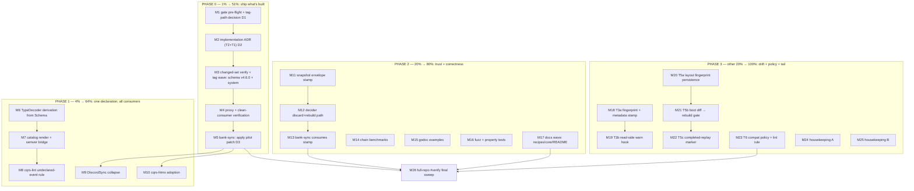

# SUPERB — v5 Schema Evolution: Execution Plan (T2/T1 shipped → fleet value)

> **Date:** 2026-10-09 18:02 CEST · **Plan type:** Pareto execution plan (pareto-planning skill)
> **Scope:** the v5 declarative schema-evolution program — everything open after T2 + T1-core
> shipped gate-green this session (status:
> [`docs/status/2026-10-09_17-57_v5-schema-evolution-t2-t1-shipped.md`](../status/2026-10-09_17-57_v5-schema-evolution-t2-t1-shipped.md)).
> Other `TODO_LIST.md` sections (BDD harness, queue module, data-mesh, metaengine substrate…)
> belong to sibling work streams with active sessions and are deliberately OUT of scope here.
> **Customer** = the first-party fleet (bank-sync, DiscordSync, cqrs-htmx, go-appkit) + v5-us.
> **Source of truth for state:** `TODO_LIST.md` "V5 declarative schema evolution" section; this
> file is the point-in-time breakdown snapshot.

## Context (why this plan exists)

The proposal ([`2026-10-09_v5-declarative-schema-evolution.md`](2026-10-09_v5-declarative-schema-evolution.md))
was ruled on 2026-10-09 (delegated via standing loop): T2-first sequence adopted. T2 (named upcast
ops: `schema.Compile` + 7 ops + `Chain`) and T1-core (`system.DomainConfig.Schema` composing the
chain over both read seams) are implemented, tested, lint-clean, gate-green — **but nothing is
released and no consumer imports it yet**. The bank-sync pilot is proven via a preserved patch
(`2026-10-09_t2-pilot-bank-sync.patch`) that applies the moment `schema/v4 v4.6.0` tags.
The blocking dependency is repo-wide: two gates are red from the CONCURRENT session's in-flight
files (`metaengine/typed_reader_scan.go` file-size; 6 clone groups in `systemscenario/` +
`cmd/cqrs-lint`) — not from this stream.

Three owner questions from the 17:57 status report remain open (tag timing, ADR shape,
bank-sync application path). This plan encodes the recommended answer to each as its default
path with the decision point marked (D1–D3) — executing the plan without further ruling follows
the same delegated-approval pattern already used twice today.

## Pareto breakdown

### The 1% → 51% — SHIP WHAT'S BUILT (release + first adoption)

The tag wave (`schema/v4 v4.6.0` + system minor bump, co-released) plus applying the preserved
bank-sync patch. Every line of T2/T1 value is zero until a consumer imports it: the tag converts
workspace code into fleet value, unblocks system's `GOWORK=off` per-module CI (its go.mod pins
published schema v4.5.2 which lacks the new API), proves the release path end-to-end, and makes
the demand-proven consumer (bank-sync) the first adopter. Everything else in this plan compounds
on an API that nobody imports yet.

### The 4% → 64% — ONE DECLARATION, ALL CONSUMERS (T1 completion + 2nd/3rd adoption)

The declaration's promised payoff — "one list, four consumers" — is half-built: TypeDecoder
registration, catalog render (+ the semver version-identity bridge), and the cqrs-lint
undeclared-event rule still read OTHER sources. Finish those and adopt in DiscordSync (211-line
hand-rolled upcasters package → `RenameType` + `Transform`; the rename-family showcase) and
cqrs-htmx (surfaces `SchemaVersion` with zero upcasters today). After this tier the declaration
is load-bearing across the fleet and drift is machine-detected in three places — that IS the
"evolvable schema" the original ask wanted, running in production.

### The 20% → 80% — TRUST + CORRECTNESS SURFACE

- **T4 snapshot state-shape stamp** — kills today's silent stale-snapshot load (a real
  correctness bug class; bank-sync snapshots `BalanceSyncState`). Absent stamp = accept,
  mismatch = discard + counted stat + rebuild from journal (ADR-0136/0143).
- **ADRs for the shipped work** (the ruling said ADRs split out _as increments land_ — owed).
- **Benchmarks** (upcasting runs on every event load; chain vs closure cost unmeasured),
  **godoc Examples**, **fuzz + property tests** — the trust surface.
- **Docs wave**: recipes.md recipe (compile-harness classified), core.md §3, README polish.

### The other 20% → 100% — DRIFT DETECTION + POLICY + TAIL

T3 payload fingerprint ledger (declared-shape hash, metadata-carried first, advisory),
T5 persisted layout fingerprints + boot drift gate (existing `RebuildThreshold`/`ConfirmRebuild`
machinery) + completed-replay marker, T6 compat policy + additive-change lint rule, and the
housekeeping tail (kv-alias sweep, `RevisionSnapshotFilter` lead, proposal-fence convention doc,
parallel-declaration ritual, runbook note, TODO prune).

## Execution graph (mermaid)

**Decision points:** D1 (M1) tag now vs wait for concurrent-session gates — default: re-check;
tag from changed-set testing if their gates stay red (runbook-compliant, per the 2026-10-06
lesson). D2 (M2) one combined ADR vs two — default: ONE combined ADR (ops + composition shipped
as one semantic unit). D3 (M5) who applies the bank-sync patch — default: this stream applies it
post-tag, battery-verified.

## Medium plan — 26 tasks, 30–100 min each (sorted by importance/impact/effort/customer-value)

| #   | Task                                                                                                                                               | Tier | Impact (1–5) | Effort (min) | Customer value                                | Depends    |
| --- | -------------------------------------------------------------------------------------------------------------------------------------------------- | ---- | ------------ | ------------ | --------------------------------------------- | ---------- |
| M1  | Gate pre-flight: re-run `#check-file-size` + `#check-duplication`, assess concurrent-session state, decide + record tag path (D1)                  | 1%   | 5            | 30           | Unblocks the entire release chain             | —          |
| M2  | Implementation ADR for T2+T1 (one combined; D2): ops semantics, batch-vs-bridge, DomainConfig composition, layering, rejected alternatives         | 20%  | 5            | 60           | Decision archaeology ships WITH the wave      | M1         |
| M3  | Changed-set release: `GOWORK=off` per-module tests (schema+system), CHANGELOG cuts, tag `schema/v4.6.0` + system minor via release scripts (flock) | 1%   | 5            | 90           | Fleet can import; system CI unblocked         | M2         |
| M4  | Post-tag verify: proxy propagation, clean-consumer `go get` smoke, release note                                                                    | 1%   | 4            | 30           | Trust the tag is real                         | M3         |
| M5  | bank-sync: apply `2026-10-09_t2-pilot-bank-sync.patch`, resolve drift vs their HEAD, full battery, commit (D3)                                     | 1%   | 5            | 45           | First real consumer live on ops               | M4         |
| M6  | T1a: `EventSchema` Go-type binding (`Event[T]`) + `projectionadapter.TypeDecoder` derivation + system wiring when `ProjectionTypeDecoder` nil      | 4%   | 5            | 90           | Declaration replaces hand-registered decoders | M3         |
| M7  | T1b: catalog render from `Schema` + version-identity bridge (semver derived from wire int)                                                         | 4%   | 4            | 90           | One declaration → governance export           | M6         |
| M8  | T1c: cqrs-lint undeclared-event rule reading `Schema`                                                                                              | 4%   | 4            | 90           | Typo-proof declarations, third lockstep tier  | M7         |
| M9  | DiscordSync pilot: collapse 211-line upcasters onto `RenameType`/`Transform`; battery; adopt or preserve patch per tag state                       | 4%   | 4            | 60           | Second consumer; rename-family showcase       | M5         |
| M10 | cqrs-htmx: adopt `DomainConfig.Schema` (today: SchemaVersion surfaced, zero upcasters)                                                             | 4%   | 3            | 45           | Third consumer; zero-upcaster → declared      | M5         |
| M11 | T4a: snapshot envelope optional state-shape stamp + accessors + roundtrip tests (absent = accept)                                                  | 20%  | 4            | 60           | Kills silent stale-snapshot loads (class)     | —          |
| M12 | T4b: `decider.WithSnapshotStateVersion` + mismatch → discard + counted stat + rebuild-from-journal + conformance test                              | 20%  | 5            | 90           | Snapshot correctness, journal-is-truth        | M11        |
| M13 | T4c: bank-sync stamps `BalanceSyncState` (real-consumer proof) + battery                                                                           | 20%  | 3            | 30           | Proven on the snapshot user                   | M12, M5    |
| M14 | Benchmarks: chain `SourceTransform` vs hand-rolled closure (ns/op + allocs), record baseline, perf note                                            | 20%  | 3            | 60           | Read-path cost known, not guessed             | —          |
| M15 | Godoc `Example` functions: `Compile`, `Chain.SourceTransform`, `Declare`+system                                                                    | 20%  | 3            | 45           | Discoverability on pkg.go.dev                 | —          |
| M16 | Fuzz (arbitrary payloads × chains; random op sets) + rapid properties (version monotonicity, identity preservation)                                | 20%  | 4            | 90           | Hostile-input trust for every-load path       | —          |
| M17 | Docs wave: recipes.md recipe (compile-harness classified), core.md §3 conventions, README/faq cross-links                                          | 20%  | 3            | 90           | The sanctioned-form documentation             | M6         |
| M18 | T3a: declared-shape fingerprint helper (stable hash, never ciphertext) + opt-in metadata stamp on write                                            | tail | 3            | 90           | Drift becomes detectable                      | M6         |
| M19 | T3b: read-side compare + warn hook + opt-in hard mode + burn-in criterion wiring                                                                   | tail | 3            | 60           | Advisory ledger live in fleet                 | M18        |
| M20 | T5a: `LayoutPlan` stable fingerprint, engine-side persistence (memory+sqlite), reset clears/journal exempt, absent=accept                          | tail | 3            | 90           | Layout drift detectable at boot               | —          |
| M21 | T5b: boot diff → `LayoutDiff` → `RebuildThreshold` auto / `ConfirmRebuild` gate + tests                                                            | tail | 4            | 90           | LiveStore-style rematerialization             | M20        |
| M22 | T5c: completed-replay marker (crash-mid-rebuild safety) + Doctor render                                                                            | tail | 3            | 60           | Never serve half-rebuilt state                | M21        |
| M23 | T6: compat policy doc (additive vs version-bump triggers) + cqrs-lint additive-change rule + fixtures                                              | tail | 3            | 90           | Policy enforced, not remembered               | M8         |
| M24 | Housekeeping A: kv-alias sweep (recipes.md:65, core.md id), proposal-fence convention → gotchas doc, parallel-declaration ritual → AGENTS          | tail | 2            | 60           | Future sessions stop re-learning              | M17        |
| M25 | Housekeeping B: verify/drop `RevisionSnapshotFilter` lead, migrate-journal runbook note, TODO prune, status annotate                               | tail | 2            | 45           | Debt recorded honestly                        | M5         |
| M26 | Full-repo `nix run .#verify` + fast integration set once concurrent session is green; triage anything of mine                                      | 1%   | 4            | 60           | The one gate run this stream never did        | M5, others |

**Order = priority.** Total ≈ 23.5 h of planned work. Phases 0–1 (M1–M10, ≈ 8.5 h) deliver 64%;

- Phase 2 (M11–M17, ≈ 7.5 h) = 80%; Phase 3 (M18–M25, ≈ 8.5 h) closes to 100%; M26 is the
  closing gate.

## Fine plan — 134 subtasks, ≤12 min each

| Sub   | Task (≤12 min)                                                            | Min | Dep     |
| ----- | ------------------------------------------------------------------------- | --- | ------- |
| M1.1  | Re-run `#check-file-size`, record verdict + owner of offender             | 6   | —       |
| M1.2  | Re-run `#check-duplication`, record group owners                          | 6   | —       |
| M1.3  | Check concurrent-session git log for gate fixes landed since 17:57        | 5   | —       |
| M1.4  | Decide + record D1 (wait vs changed-set tag) in this plan's blocker log   | 8   | M1.1–3  |
| M1.5  | If green: `nix run .#verify-fast` pre-flight; record                      | 10  | M1.4    |
| M2.1  | ADR skeleton + Context section (proposal + status links)                  | 12  | M1      |
| M2.2  | Decision: op set + matching/versioning semantics                          | 12  | M2.1    |
| M2.3  | Decision: batch SourceTransform vs Upcasters bridge boundary              | 10  | M2.2    |
| M2.4  | Decision: DomainConfig composition point + Tier5→Tier2 layering           | 12  | M2.3    |
| M2.5  | Alternatives-rejected section (port from proposal §11)                    | 10  | M2.4    |
| M2.6  | Consequences + cross-links; md-go + doc-check gates                       | 8   | M2.5    |
| M3.1  | `GOWORK=off go test ./...` schema module, record                          | 8   | M2      |
| M3.2  | Schema CHANGELOG cut for v4.6.0                                           | 10  | M3.1    |
| M3.3  | Tag schema v4.6.0 (`tag-release.sh`, flock, self-sourced env)             | 12  | M3.2    |
| M3.4  | system: bump schema pin → v4.6.0, `go mod tidy`                           | 10  | M3.3    |
| M3.5  | `GOWORK=off go test ./...` system module                                  | 10  | M3.4    |
| M3.6  | System CHANGELOG cut (minor)                                              | 8   | M3.5    |
| M3.7  | Tag system minor via release script                                       | 10  | M3.6    |
| M3.8  | Versions-manifest + README-link gates; record tag pair                    | 10  | M3.7    |
| M4.1  | Proxy verification: `go list -m -versions`, pkg.go.dev spot-check         | 10  | M3.8    |
| M4.2  | Clean-consumer smoke: temp module `go get` + compile a chain              | 12  | M4.1    |
| M4.3  | Write release note into status stream                                     | 8   | M4.2    |
| M5.1  | `git apply` pilot patch in bank-sync                                      | 8   | M4      |
| M5.2  | Resolve drift vs bank-sync HEAD (other session moved files)               | 12  | M5.1    |
| M5.3  | `go build ./...` + `internal/cqrs` tests                                  | 10  | M5.2    |
| M5.4  | `-race` + lint + erraudit on touched pkg                                  | 12  | M5.3    |
| M5.5  | Commit in bank-sync (daemon-aware) + record                               | 5   | M5.4    |
| M6.1  | Design note: `Event[T]` type binding + inference rules                    | 12  | M3      |
| M6.2  | schema: `Event[T]` generic constructor + validation                       | 12  | M6.1    |
| M6.3  | projectionadapter: derive TypeDecoder registrations from declarations     | 12  | M6.2    |
| M6.4  | system: auto-fill `ProjectionTypeDecoder` when nil + Schema present       | 12  | M6.3    |
| M6.5  | Tests: declaration → decoder roundtrip (typed fold sees upcasted payload) | 12  | M6.4    |
| M6.6  | Gates: arch + api golden + module tests + lint                            | 10  | M6.5    |
| M7.1  | Map `EventSchema` → `catalog.Event` surface (incl. WithVersion)           | 12  | M6      |
| M7.2  | Semver derivation from wire int (version-identity ruling)                 | 12  | M7.1    |
| M7.3  | Exporter bridge + render tests                                            | 12  | M7.2    |
| M7.4  | system: expose declaration list to catalog path                           | 12  | M7.3    |
| M7.5  | `#check-eventcatalog` gate green                                          | 10  | M7.4    |
| M7.6  | Docs (modules.md, faq) + api golden                                       | 10  | M7.5    |
| M8.1  | cqrs-lint: parse `DomainConfig.Schema` declarations in analyzer           | 12  | M7      |
| M8.2  | Rule logic: consumed-but-undeclared → diagnostic                          | 12  | M8.1    |
| M8.3  | Testdata fixture project (declared + dangling consumer)                   | 12  | M8.2    |
| M8.4  | Suggestion text + catalog.Event counts as provided (E018 lockstep)        | 10  | M8.3    |
| M8.5  | Analyzer self-tests + module-catalog meta-test                            | 12  | M8.4    |
| M8.6  | cqrs-lint README + CHANGELOG + golden                                     | 10  | M8.5    |
| M9.1  | Read DiscordSync upcasters fresh; add replace scaffolding                 | 10  | M5      |
| M9.2  | Map two type renames → `RenameType` ops                                   | 12  | M9.1    |
| M9.3  | Map derived-field upcasters → `Transform` ops                             | 12  | M9.2    |
| M9.4  | Wire chain + rewrite their tests                                          | 12  | M9.3    |
| M9.5  | Battery; adopt (tag available) or preserve patch + revert                 | 12  | M9.4    |
| M10.1 | Locate cqrs-htmx SchemaVersion surface + config seam                      | 10  | M5      |
| M10.2 | Declare `DomainConfig.Schema` in their composition                        | 12  | M10.1   |
| M10.3 | Tests + battery                                                           | 12  | M10.2   |
| M10.4 | Adopt or preserve patch; record                                           | 10  | M10.3   |
| M11.1 | snapshot: envelope optional stamp field                                   | 12  | —       |
| M11.2 | Accessors + validation (stamp format decision: string version)            | 12  | M11.1   |
| M11.3 | Envelope encode/decode roundtrip tests                                    | 12  | M11.2   |
| M11.4 | Legacy absent-stamp accept-path tests (pre-change snapshots)              | 12  | M11.3   |
| M11.5 | snapshot golden + CHANGELOG + api golden                                  | 10  | M11.4   |
| M12.1 | decider: `WithSnapshotStateVersion[State]` option                         | 12  | M11     |
| M12.2 | Save path: stamp envelope with declared version                           | 12  | M12.1   |
| M12.3 | Load path: mismatch → discard + counted stat                              | 12  | M12.2   |
| M12.4 | Integration test: stale snapshot → rebuild from journal correctness       | 12  | M12.3   |
| M12.5 | Conformance test (snapshot contract suite)                                | 12  | M12.4   |
| M12.6 | Gates: module tests + lint + arch + changelog                             | 10  | M12.5   |
| M13.1 | bank-sync: stamp BalanceSyncState version                                 | 8   | M12, M5 |
| M13.2 | Test the discard+rebuild path on real snapshots                           | 12  | M13.1   |
| M13.3 | bank-sync battery + record                                                | 10  | M13.2   |
| M14.1 | Bench fixtures: identical chain vs hand-rolled closure                    | 12  | —       |
| M14.2 | Run `-bench` (JSON + CBOR), record ns/op + allocs                         | 12  | M14.1   |
| M14.3 | Compare table + accept/reject threshold decision                          | 12  | M14.2   |
| M14.4 | Perf note in schema README                                                | 10  | M14.3   |
| M15.1 | `ExampleCompile` godoc example                                            | 12  | —       |
| M15.2 | `ExampleChain_SourceTransform` example                                    | 12  | M15.1   |
| M15.3 | `ExampleDeclare` + system composition example                             | 12  | M15.2   |
| M15.4 | vet + doc gates                                                           | 8   | M15.3   |
| M16.1 | Fuzz: arbitrary payload bytes through chains (no panic, version sane)     | 12  | —       |
| M16.2 | Fuzz: random op sets — Compile accepts/rejects deterministically          | 12  | M16.1   |
| M16.3 | rapid: version monotonicity (never below source, never decreasing)        | 12  | M16.2   |
| M16.4 | rapid: identity preservation under field ops                              | 12  | M16.3   |
| M16.5 | Seed corpus run + fix findings                                            | 12  | M16.4   |
| M16.6 | Wire into existing fuzz/golden suites + gates                             | 10  | M16.5   |
| M17.1 | recipes.md: named-ops recipe fence (full example)                         | 12  | M6      |
| M17.2 | Classify in `recipes_catalog*.go` maps                                    | 12  | M17.1   |
| M17.3 | Compile-harness run green (`TestRecipes*`)                                | 12  | M17.2   |
| M17.4 | core.md §3 conventions: declarative form is sanctioned                    | 12  | M17.3   |
| M17.5 | faq + modules cross-link polish                                           | 10  | M17.4   |
| M17.6 | doc-check + md-go gates                                                   | 10  | M17.5   |
| M18.1 | Fingerprint helper: declared-shape stable hash (sorted fields, typed)     | 12  | M6      |
| M18.2 | `EventSchema` → fingerprint exposure                                      | 12  | M18.1   |
| M18.3 | Write-path metadata stamp (opt-in option)                                 | 12  | M18.2   |
| M18.4 | system wiring: opt-in stamping from Schema                                | 12  | M18.3   |
| M18.5 | Tests: stable across runs/processes; differs on shape change              | 12  | M18.4   |
| M18.6 | Gates + changelog-symbols                                                 | 10  | M18.5   |
| M19.1 | Read-side compare hook (declared vs stamped)                              | 12  | M18     |
| M19.2 | Warn seam (slog/otel event, no default noise)                             | 12  | M19.1   |
| M19.3 | Opt-in hard mode (Rejection on mismatch)                                  | 12  | M19.2   |
| M19.4 | Tests + burn-in criterion doc note (named consumers, named cycle)         | 12  | M19.3   |
| M20.1 | `LayoutPlan` stable-hash function (deterministic serialization)           | 12  | —       |
| M20.2 | Engine-side persistence contract (small interface)                        | 12  | M20.1   |
| M20.3 | Implementations: memory + sqlite engines                                  | 12  | M20.2   |
| M20.4 | Reset clears stamps / journal exempt test (ADR-0143)                      | 12  | M20.3   |
| M20.5 | Absent stamp = accept (existing collections migration)                    | 12  | M20.4   |
| M20.6 | Gates + enginetest pin                                                    | 10  | M20.5   |
| M21.1 | Boot: read persisted vs declared, produce diff set                        | 12  | M20     |
| M21.2 | Route diff → `LayoutDiff`                                                 | 12  | M21.1   |
| M21.3 | `RebuildThreshold` auto-rebuild path + test                               | 12  | M21.2   |
| M21.4 | `ConfirmRebuild` operator-gate path + test                                | 12  | M21.3   |
| M21.5 | Both-paths integration tests (engine reset + replay)                      | 12  | M21.4   |
| M21.6 | Gates                                                                     | 10  | M21.5   |
| M22.1 | Completed-replay marker type + persistence                                | 12  | M21     |
| M22.2 | Write-at-completion; check-at-serve                                       | 12  | M22.1   |
| M22.3 | Crash-mid-rebuild test (kill before marker → rebuild again)               | 12  | M22.2   |
| M22.4 | Doctor/Explain render of fingerprint + marker state                       | 12  | M22.3   |
| M22.5 | Gates                                                                     | 10  | M22.4   |
| M23.1 | Policy doc: additive changes (safe without version bump)                  | 12  | M8      |
| M23.2 | Policy doc: version-bump triggers + breaking rules                        | 12  | M23.1   |
| M23.3 | cqrs-lint additive-change rule on declared events                         | 12  | M23.2   |
| M23.4 | Fixtures + mutation-verified self-test                                    | 12  | M23.3   |
| M23.5 | Wire into policy docs + README                                            | 10  | M23.4   |
| M23.6 | Gates                                                                     | 10  | M23.5   |
| M24.1 | kv-alias sweep: recipes.md:65 + core.md:315 import-scoping                | 12  | M17     |
| M24.2 | Proposal-fence convention → gotchas-tooling-build.md                      | 12  | M24.1   |
| M24.3 | Parallel-declaration check ritual → AGENTS.md notes                       | 12  | M24.2   |
| M24.4 | doc-check + md-go after doc edits                                         | 10  | M24.3   |
| M25.1 | `RevisionSnapshotFilter`: primary-source search; verify or drop lead      | 12  | M5      |
| M25.2 | bank-sync migrate-journal runbook: declarative-upcasting note             | 10  | M25.1   |
| M25.3 | TODO_LIST schema section prune against this plan                          | 12  | M25.2   |
| M25.4 | Annotate 17:57 status report with plan link                               | 8   | M25.3   |
| M26.1 | Confirm concurrent-session gates green                                    | 10  | M5      |
| M26.2 | `nix run .#verify` full                                                   | 12  | M26.1   |
| M26.3 | Fast integration set (`#test-integration` core engines)                   | 12  | M26.2   |
| M26.4 | Triage/fix anything from this stream                                      | 12  | M26.3   |
| M26.5 | Record final green snapshot + close plan                                  | 8   | M26.4   |

## Verification criteria (per phase)

- **Phase 0 done =** tags exist + resolve from proxy; bank-sync compiles + tests green ON the tag;
  system `GOWORK=off` per-module build/test green.
- **Phase 1 done =** one declaration produces decoder registrations + catalog output + lint
  diagnostics; DiscordSync + cqrs-htmx import the ops (or patches preserved if tags lag).
- **Phase 2 done =** stale snapshot test proves discard+rebuild; benchmark table committed;
  fuzz/rapid suites green; recipes recipe compiles in the harness.
- **Phase 3 done =** fingerprint stamp survives restart and warns on drift (advisory); boot gate
  routes to rebuild; policy doc + lint rule green; housekeeping rows closed.
- **Plan closed =** `nix run .#verify` green repo-wide.

## Risks / blockers

| Risk                                         | Mitigation                                                                                                                                                                       |
| -------------------------------------------- | -------------------------------------------------------------------------------------------------------------------------------------------------------------------------------- |
| Concurrent session's red gates block tagging | D1 changed-set path: release scripts test the changed set; per the 2026-10-06 lesson, run real per-module tests ourselves                                                        |
| bank-sync HEAD drift vs pilot patch          | M5.2 resolution step; patch is 417 lines across 6 files, all touched only by this stream                                                                                         |
| Another session edits system/ mid-T1a/b/c    | Re-view before every edit (daemon discipline); small PR-sized increments                                                                                                         |
| `Event[T]` type-binding design churn         | Design note FIRST (M6.1); mirrors projectionadapter's existing registration shape                                                                                                |
| Verschllimmbessern                           | Every task ends at a gate; no speculative rewrites; reverts only of self-authored scaffolding; the pilot-replace pattern (prove → preserve → revert) for unreleased-API adoption |

## Decision log (executed)

### D1 — tag timing (decided 2026-10-09 22:45): TAG NOW via changed-set

Re-check at M1 found the concurrent session's gates REDDER than at 17:57 (11 file-size offenders:
cqrs-lint ×5, metaengine ×4, projectionhost ×1, system/system.go; 6 clone groups in
systemscenario/ + cqrs-lint) and `tag-release.sh` verified to NOT run repo-wide ratchet gates
(it strips replaces → tidy → resolve-verify → tag). This stream's own files were cleaned to green
first (schema/chain_engine.go split → chain_payload.go; system/config_types.go → engine_config.go
extraction, 421→302; system/constructor.go → system_lifecycle.go + projection_wiring.go
extractions, 435→352; system tests green after each). Ruling: proceed with the tag wave on
changed-set testing (schema + system real per-module test runs) per the 2026-10-06 lesson;
concurrent-session offenders stay theirs to shrink or baseline.

### D2 — ADR shape (decided at M2, below): ONE combined implementation ADR

Executed as `docs/adr/0154-declarative-schema-evolution-t2-t1.md` — see M2 notes in the status
stream.
