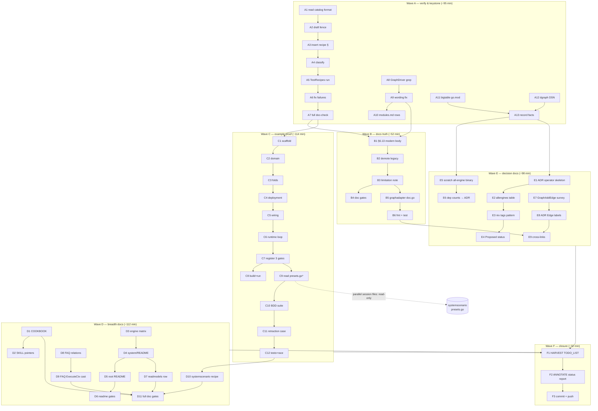

# SUPERB Plan — Graph-Native Adoption Closure + Operator Story (v4.x-safe docs/example wave)

> **⚠ SUPERSEDED (2026-10-10 06:11, same session, pre-execution)** by
> [`2026-10-10_06-11_SUPERB-graph-native-adoption-closure-and-operator-story-V2.md`](2026-10-10_06-11_SUPERB-graph-native-adoption-closure-and-operator-story-V2.md).
> Self-challenge found 7 flaws: recipe-before-example ordering (compile-only
> verification, the session's own confessed weakness), no wave-boundary commits
> (daemon absorbs authored history), no systemic ADT-recipe ratchet, no consumer
> dry-run acceptance test, no shared-file collision guard, no TODO_LIST in-flight
> marker, unbounded fix loops + unnamed value assumption. V2 §1 has the full diff.

**Date:** 2026-10-10 06:05
**Source:** Session status report `docs/status/2026-10-10_05-48_graph-native-docs-audit-allengines-consult-session.md` (35 tasks, 3 open questions)
**Objective:** Make the modern graph-native path (`system.New` + `metaengine` Edge folds) adoptable from docs alone, kill every docs-lie found, and ship the two operator-story decision docs — with ZERO API/breaking changes.

---

## 1. Context (why this wave exists)

The 2026-10-10 05:48 session proved a fleet consumer asking _"how do I build graph-native with the modern system APIs?"_ cannot be answered from the docs: the canonical answer exists nowhere end-to-end. Meanwhile the repo's strategic bet is exactly this surface (`system` + `metaengine`, ADR-0123), cqrs-htmx/go-appkit migrate onto it first, and metaengine is _the_ declared strategic future.

**Confirmed damage (status report §d):**

1. `recipes.md` (86 recipes) + `metaengine/COOKBOOK.md`: **zero** graph recipes.
2. `advanced.md` §6.13 teaches the **deprecated** `graph.GraphProjection` first; its v5-replacement pointer aims at `graphadapter` — which **flattens every node to `Label:"entity"`** (adapter.go:59-60,78).
3. Suspected docs lie: _"reads run native Cypher/Gremlin via the driver"_ — no non-MemoryDriver `GraphDriver` found in the repo.
4. `SKILL.md` names COOKBOOK as THE copy-paste source; COOKBOOK has no graph content.
5. `graphadapter` is a near-ghost: no example, no recipe, never composed.

**Constraints / guardrails:**

- **No API changes** in this wave. `metaengine.Edge` label growth and the `allengines` module are BREAKING/product decisions → ADR drafts only, implementation behind approval. (Verschlimmbesserung guard.)
- **Parallel session in flight:** `systemscenario/{then*.go,presets*.go,go.mod,go.sum}` are modified by ANOTHER session right now — do NOT touch, revert, or commit those files. T6 must READ `presets.go` first and reuse, not duplicate.
- All doc Go fences must pass the parse gate (`nix run .#check-md-go`); recipes.md fences must be compile-classified (`cmd/doc-check` `TestRecipes*`).
- Every phase ends with its gates green (see §6).

## 2. Decisions taken (planner's call — veto any time)

| ID | Decision                                                                                                                                | Rationale                                                                     |
| -- | --------------------------------------------------------------------------------------------------------------------------------------- | ----------------------------------------------------------------------------- |
| D1 | Docs+example wave first; **no engine/API code changes**                                                                                 | Highest customer value at zero break-risk; matches fleet-first consumer scope |
| D2 | Edge-label flattening: **document as v4.x limitation** (+ `Driver()` escape hatch), propose label growth **only as ADR draft for v5**   | v4.x must stay non-breaking; the ADR formalizes the v5 call                   |
| D3 | `allengines`: **ADR + measurement only**, no module yet                                                                                 | Needs dep-budget review (product gate); evidence first                        |
| D4 | Operator story = **two levels**: nix `-tags` engine set (compile-time) + `cqrs.yaml` via `system.LoadConfig` (runtime, already shipped) | Both idiomatic already; ADR just names and proofs the pattern                 |

## 3. Pareto Breakdown

| Tier                 | Tasks                                                                                                                                                                                                   | Result delivered                                                                                                                                                               |
| -------------------- | ------------------------------------------------------------------------------------------------------------------------------------------------------------------------------------------------------- | ------------------------------------------------------------------------------------------------------------------------------------------------------------------------------ |
| **1% → 51%**         | **T1**: one compile-verified `recipes.md` §graph recipe                                                                                                                                                 | The canonical answer exists and is GATE-VERIFIED (the session's confessed miss — an unverified chat walkthrough — becomes compile-checked truth). Every other doc links to it. |
| **4% → 64%**         | T1 + **T2** (§6.13 modern-first rewrite) + **T3** (Cypher/Gremlin honesty fix)                                                                                                                          | Canonical answer + **no doc lies**: the deprecation pointer no longer steers into label-flattening unawares, §6.13 teaches the modern path first                               |
| **20% → 80%**        | 4% + **T4** (graphadapter limitation doc) + **T5/T6** (`example/graph-native/` + systemscenario BDD) + **T7** (COOKBOOK chapter) + **T8** (system/README + engine matrix) + **T12** (fact verification) | A fleet developer adopts graph-native END-TO-END from docs alone, with a runnable, tested reference and an honest capability matrix                                            |
| **other 20% → 100%** | **T9–T11, T13–T15, T17, T20** (readmodels/FAQ/SKILL pointers, operator-story ADR + measurements, Edge-labels ADR, HARVEST/annotate closure)                                                             | Breadth, decision enablement for v5, process closure — the plan dies in a timestamped file without T17                                                                         |

## 4. Medium Plan — 17 tasks, 30–100 min each (sorted by importance/impact/effort/customer-value)

| #   | Task                                                                                                                                                                                                       | Tier | Impact   | Effort | Value (customer)                                                    | Depends |
| --- | ---------------------------------------------------------------------------------------------------------------------------------------------------------------------------------------------------------- | ---- | -------- | ------ | ------------------------------------------------------------------- | ------- |
| T1  | `recipes.md` §graph recipe: full system-composed walkthrough (Edge + EdgeRemoval folds, `RawQuery`, dgraph/sqlite DeploymentConfig, `ExecuteCtx` traversal) — compile-verified via doc-check `TestRecipes` | 1%   | Critical | 90     | The canonical, gate-checked answer to "graph-native how?"           | —       |
| T2  | Rewrite `advanced.md` §6.13: modern metaengine path first; `GraphProjection` demoted to migration note; label-limitation + escape-hatch note                                                               | 4%   | Critical | 45     | Kills the deprecated-first teaching and the lossy-bridge ambush     | T1      |
| T3  | Verify Cypher/Gremlin claim (find all `GraphDriver` impls); fix §6.13 + modules.md wording (capability vs portability target)                                                                              | 4%   | High     | 30     | Docs stop overclaiming                                              | —       |
| T12 | Fact verification: bigtableengine go.mod dep weight; dgraphengine DSN format; record in ADR inputs                                                                                                         | 20%  | Medium   | 30     | Decisions on evidence, not folklore                                 | —       |
| T4  | `graphadapter` doc.go: document label flattening + `Driver()` escape hatch explicitly (D2)                                                                                                                 | 20%  | High     | 30     | v5 migrators not ambushed                                           | T3      |
| T5  | `example/graph-native/`: follow graph domain (Followed/Unfollowed), decider, folds, `system.New`, sqlite+dgraph deployments, runnable main                                                                 | 20%  | High     | 100    | Runnable end-to-end reference; de-ghosts graphadapter composition   | T1      |
| T6  | systemscenario BDD suite for the example: depth-2 traversal asserts + unfollow edge-retraction asserts (READ parallel session's `presets.go` first — reuse)                                                | 20%  | High     | 60     | Proves the story under test; ADR-0153 harness gets its graph recipe | T5      |
| T7  | COOKBOOK.md graph chapter (port of T1 recipe) + TOC entry                                                                                                                                                  | 20%  | Med-High | 40     | SKILL's copy-paste promise becomes true                             | T1      |
| T8  | system/README graph-native section + consolidated engine×graph capability matrix (native CTE / graph DB / BFS fallback / undirected) + root README bullet                                                  | 20%  | Med-High | 60     | Operator-facing truth in one table                                  | T12     |
| T20 | `recipes.md` systemscenario §graph-BDD recipe fence + catalog entry (after T6 proves the shape)                                                                                                            | 20%  | Medium   | 30     | BDD pattern documented, not just built                              | T6      |
| T9  | `readmodels.md`: tier-table graph row → modern ADT path; engine matrix cross-link                                                                                                                          | 100% | Medium   | 30     | Read-model guide stops pointing at v5-removed tier only             | T2, T8  |
| T10 | FAQ: "modeling relations/graphs" entry + `ExecuteCtx` `[]any` cast contract (+ `ExecuteTypedByName` traversal coverage check)                                                                              | 100% | Medium   | 30     | Kills two known footguns                                            | T1      |
| T11 | SKILL.md pointers reconciliation (tier table, §6.13 title, SKILL↔COOKBOOK↔recipes triangle)                                                                                                                | 100% | Medium   | 30     | Entry-point consistency                                             | T1, T7  |
| T13 | ADR (next free ≥0155): two-level operator story — nix `-tags` engine set + `cqrs.yaml` runtime; `allengines` proposal w/ membership table; links ADR-0123 §3                                               | 100% | Med-High | 60     | Unblocks the "SUPERB easy all engines" ask with a decision doc      | T12     |
| T14 | Measurements: scratch binary importing all pure-Go engines vs single-engine — size + `go mod graph` count → ADR evidence                                                                                   | 100% | Medium   | 30     | ADR argues from data                                                | T12     |
| T15 | ADR: `metaengine.Edge` labels at v5 — extend (breaks every `GraphAddEdge`) vs documented limitation; survey engine signatures; recommendation + §6.13/graphadapter cross-links                             | 100% | Medium   | 45     | The v5 product call gets a decision doc                             | T4      |
| T17 | Process closure: HARVEST plan into `TODO_LIST.md`; annotate 05-48 status report (dispatched/closed); final commit + push                                                                                   | 100% | High     | 30     | Nothing entombed in timestamped files                               | all     |

**Total ≈ 730 min (~12 h).** No task touches engine code, `metaengine` core, or `system` internals.

## 5. Fine Plan — 61 tasks, ≤12 min each (sorted by execution order within dependency waves)

| ID                             | Micro-task                                                                                                                                        | Min | Impact   | Dep       |
| ------------------------------ | ------------------------------------------------------------------------------------------------------------------------------------------------- | --- | -------- | --------- |
| **Wave A — verify & keystone** |                                                                                                                                                   |     |          |           |
| A1                             | Read `recipes_catalog*.go` classification map format + one nearby recipe's preamble conventions                                                   | 6   | —        | —         |
| A2                             | Draft the graph recipe Go fence (complete, parseable: types + folds + `system.New` + `ExecuteCtx`)                                                | 12  | Critical | A1        |
| A3                             | Insert fence as new recipes.md §(next free 2.4x) with intro prose + anchor in TOC                                                                 | 12  | Critical | A2        |
| A4                             | Add recipes_catalog entry classifying the fence (compiled scaffold)                                                                               | 8   | Critical | A3        |
| A5                             | Run `cd cmd/doc-check && GOWORK=off go test -run TestRecipes .` (first cold run ≈100 s)                                                           | 12  | Critical | A4        |
| A6                             | Fix compiler/doc failures iteratively (fix the DOC if it lies; never paper over with skip)                                                        | 12  | Critical | A5        |
| A7                             | Run full doc-check over SKILL.md + references + AGENTS.md (zero-warning policy)                                                                   | 10  | Critical | A6        |
| A8                             | Grep repo for `GraphDriver` implementations beyond MemoryDriver (settle Cypher/Gremlin claim)                                                     | 5   | High     | —         |
| A9                             | Decide wording: shipped capability vs portability target; write fix for §6.13 sentence                                                            | 6   | High     | A8        |
| A10                            | Fix modules.md `graph` row + `graphadapter` row wording                                                                                           | 8   | High     | A9        |
| A11                            | Read `metaengine/bigtableengine/go.mod`; record dep weight verdict                                                                                | 6   | Med      | —         |
| A12                            | Read `dgraphengine/register.go` DSN handling; record DSN format                                                                                   | 8   | Med      | —         |
| A13                            | Record A11+A12 outcomes into ADR input notes (§ this plan, section 7 scratchpad)                                                                  | 6   | Med      | A11, A12  |
| **Wave B — docs truth**        |                                                                                                                                                   |     |          |           |
| B1                             | Draft modern-first §6.13 body (metaengine Edge folds → planner ADT → engine matrix)                                                               | 12  | Critical | A7        |
| B2                             | Demote `GraphProjection` sample to migration sub-note with v5-removal pointer                                                                     | 10  | Critical | B1        |
| B3                             | Add label-flattening limitation + `Driver()` escape-hatch note (D2)                                                                               | 8   | High     | B2        |
| B4                             | Run doc-check + `nix run .#check-md-go` (planning/docs parse gates)                                                                               | 10  | Critical | B3        |
| B5                             | Write graphadapter `doc.go` limitation paragraph + adapter comment guards                                                                         | 12  | High     | B3        |
| B6                             | `nix fmt` on touched files + graphadapter module test                                                                                             | 8   | High     | B5        |
| **Wave C — example proof**     |                                                                                                                                                   |     |          |           |
| C1                             | Scaffold `example/graph-native/`: go.mod (module path `/example/graph-native/v4`? follow `example/getting-started` pattern), main.go skeleton     | 12  | High     | A7        |
| C2                             | Domain: `Followed`/`Unfollowed` events, `FollowState` decider (guard: no self-follow, no double-follow), commands                                 | 12  | High     | C1        |
| C3                             | Folds: `OnRecordTyped` → `Edge` + `EdgeRemoval`; traversal `Query[ReachabilityQuery, []string]`                                                   | 12  | High     | C2        |
| C4                             | DeploymentConfig: sqlite primary + (flag-gated) dgraph projections; `LoadConfig` fallback                                                         | 10  | High     | C3        |
| C5                             | Wire `ProjectionTypeDecoder` + `Events` coeffect universe + `system.RegisterDecider/RegisterCommand`                                              | 10  | High     | C4        |
| C6                             | Runtime: start host, dispatch follow batch, print depth-1/2 traversals, unfollow retraction proof                                                 | 12  | High     | C5        |
| C7                             | Register module in the three gates: flake `examplePaths`, api-stability exclusion maps, cqrs-lint module catalog; add to `go.work`                | 12  | Critical | C6        |
| C8                             | `go build ./...` + run example + verify printed output matches expectations                                                                       | 10  | Critical | C7        |
| C9                             | READ parallel session's `systemscenario/presets.go`; list reusable pieces (do not edit their files)                                               | 8   | High     | C7        |
| C10                            | Write systemscenario suite: Given follows → When traversal query → Then neighbors (poll mode)                                                     | 12  | High     | C9        |
| C11                            | Add unfollow case: WhenEvent unfollowed → Then traversal excludes retracted edge                                                                  | 12  | High     | C10       |
| C12                            | Run module tests + `-race` + `nix run .#check-module-layers` sanity                                                                               | 12  | Critical | C11       |
| **Wave D — breadth docs**      |                                                                                                                                                   |     |          |           |
| D1                             | Port T1 recipe into COOKBOOK graph chapter + TOC/anchor                                                                                           | 12  | Med-High | A7        |
| D2                             | SKILL.md: fix SKILL↔COOKBOOK promise (graph now covered); add recipe link                                                                         | 8   | Med      | D1        |
| D3                             | Build engine×graph capability matrix from engine `profile.go` files (CTE/graphDB/BFS/undirected/degraded)                                         | 12  | Med-High | A8        |
| D4                             | Write system/README graph-native section (matrix + YAML snippets sqlite/dgraph)                                                                   | 12  | Med-High | D3        |
| D5                             | Root README: extend deployment-choice bullet with graph ADT mention                                                                               | 6   | Med      | D4        |
| D6                             | Run `bash scripts/check-readme-links.sh` + deprecated-symbol gate                                                                                 | 8   | Med      | D5        |
| D7                             | readmodels.md: tier-table graph row → modern path; cross-link matrix                                                                              | 10  | Med      | D4        |
| D8                             | FAQ entry: "How do I model relations/graphs?"                                                                                                     | 10  | Med      | A7        |
| D9                             | FAQ entry: `ExecuteCtx` traversal returns `[]any` regardless of R (+ `ExecuteTypedByName` check + doc if typed results available)                 | 12  | Med      | D8        |
| D10                            | recipes.md: systemscenario graph-BDD fence + catalog entry (shape proven by C10)                                                                  | 12  | Med      | C12       |
| D11                            | Full doc-check + check-md-go over all touched docs                                                                                                | 10  | Critical | D1–D10    |
| **Wave E — decision docs**     |                                                                                                                                                   |     |          |           |
| E1                             | ADR skeleton ≥0155: context (Q3 session), two-level operator story, LoadConfig as runtime half                                                    | 12  | Med-High | A13       |
| E2                             | ADR: `allengines` membership table (pure-Go set; duckdb behind `//go:build cgo`; bigtable verdict from A11)                                       | 12  | Med-High | E1        |
| E3                             | ADR: nix `-tags` per-deployment pattern (flake profiles sketch in appendix)                                                                       | 12  | Med-High | E2        |
| E4                             | ADR: consequences, open questions, ADR-0123 §3 cross-link; status = Proposed                                                                      | 10  | Med-High | E3        |
| E5                             | Scratch main blank-importing all pure-Go engines; `go build` size record                                                                          | 12  | Med      | A13       |
| E6                             | `go mod graph` dep count vs single-engine build; numbers → ADR                                                                                    | 12  | Med      | E5        |
| E7                             | Survey `GraphAddEdge` signatures (badger/dgraph/iroh/graphadapter/sqlite CTE)                                                                     | 10  | Med      | —         |
| E8                             | ADR draft: Edge labels at v5 — Option A extend (breaking inventory) vs Option B documented limitation; recommendation B-for-v4.x, A-decided-at-v5 | 12  | Med      | E7        |
| E9                             | Cross-link E8-ADR from §6.13 note + graphadapter doc.go                                                                                           | 6   | Med      | E8, B5    |
| **Wave F — process closure**   |                                                                                                                                                   |     |          |           |
| F1                             | HARVEST: merge plan tasks into `TODO_LIST.md` (checked-off state for completed waves)                                                             | 12  | High     | waves A–E |
| F2                             | ANNOTATE 05-48 status report: decisions taken, items dispatched/closed (appendix, non-destructive)                                                | 10  | High     | F1        |
| F3                             | Final `git status` sweep; commit plan+work in detailed message(s); push                                                                           | 10  | High     | F2        |

**61 micro-tasks. Longest = 12 min. Every task has a pass/fail observable (gate, test, or written output).**

## 6. Execution Graph



`*` = guardrail: `systemscenario/*` is being modified by a parallel session — read, never edit/revert/commit their files.

## 7. Verification Plan (per wave)

| Wave | Gates                                                                                                                                                                                                  |
| ---- | ------------------------------------------------------------------------------------------------------------------------------------------------------------------------------------------------------ |
| A    | `TestRecipes*` green; doc-check zero warnings; `check-md-go` parse-clean                                                                                                                               |
| B    | doc-check; `check-md-go`; graphadapter module test; `nix fmt --fail-on-change` on touched files                                                                                                        |
| C    | `go build ./...`; example runs with correct traversal output; module registered in flake `examplePaths` + api-stability maps + cqrs-lint catalog (`TestEvery`); `go test -race`; `check-module-layers` |
| D    | doc-check; `check-md-go`; `check-readme-links.sh`; `check-readme-deprecated.sh`                                                                                                                        |
| E    | ADR numbered ≥0155 (verify at execution); measurement numbers recorded IN the ADR; no code changes                                                                                                     |
| F    | TODO_LIST updated; status report annotated (appendix); `git status` clean of MY files; commit + push                                                                                                   |

**Definition of done for the whole wave:** the Q1 session question is answerable by pointing at ONE recipe; §6.13 leads with the modern path; every capability claim is verified; both ADRs exist as Proposed; nothing in `metaengine/`, `system/`, or engine modules changed.

## 8. Out of scope (decision-gated, NOT verschlimmbessert)

- Implementing `metaengine.Edge` label fields (any engine signature changes) — gated on E8 ADR approval.
- Creating `metaengine/allengines` — gated on E2/E4 ADR approval + dep budget review.
- Any change to `systemscenario/` shared files (parallel session owns them).
- Rewriting COOKBOOK beyond the graph chapter.

## 9. Illustrative fence — the keystone recipe (target shape for A2; parse-gated)

```go
// Target content of recipes.md §graph (full fence will carry complete imports
// and a compile preamble per recipes_catalog classification).
package graphrecipe

import (
	"context"

	"github.com/larsartmann/go-cqrs-lite/metaengine/v4"
	"github.com/larsartmann/go-cqrs-lite/record/v4"
	"github.com/larsartmann/go-cqrs-lite/system/v4"
)

type Followed struct{ From, To string }

type Unfollowed struct{ From, To string }

type ReachabilityQuery struct {
	Node  string
	Depth int
}

func declareFollowGraph() metaengine.QueryDecl {
	return metaengine.Query[ReachabilityQuery, []string]("follow_graph",
		metaengine.OnRecordTyped("user.followed", Followed{},
			func(_ record.Record, e Followed) metaengine.Edge {
				return metaengine.Edge{From: e.From, To: e.To}
			}),
		metaengine.OnRecordTyped("user.unfollowed", Unfollowed{},
			func(_ record.Record, e Unfollowed) metaengine.EdgeRemoval {
				return metaengine.EdgeRemoval{From: e.From, To: e.To}
			}),
	)
}

func compose(ctx context.Context, followGraph metaengine.QueryDecl) (*system.System, error) {
	domain := system.DomainConfig{
		Projections: []system.ProjectionDeclaration{system.RawQuery(followGraph)},
		// Commands + ProjectionTypeDecoder + Events universe per getting-started pattern.
	}
	deployment := system.DeploymentConfig{
		// engines: {"primary": {Driver: "sqlite"}}, instances: source-of-truth + projections.
	}
	return system.New(ctx, domain, deployment)
}

func traverse(ctx context.Context, sys *system.System, node string, depth int) ([]any, error) {
	res, err := sys.MetaEngine().ExecuteCtx(ctx, ReachabilityQuery{Node: node, Depth: depth})
	if err != nil {
		return nil, err
	}
	neighbors, _ := res.([]any)
	return neighbors, nil
}
```

_(Exact signatures verified at A2 against `metaengine`/`system` sources — e.g. `QueryDecl` name and `RawQuery` parameter type — before the fence lands; TestRecipes is the arbiter.)_

---

_Point-in-time plan. ANNOTATE, never rewrite. HARVEST into TODO_LIST at Wave F. Verschlimmbesserung guard active: if a task would worsen the system, STOP and report instead._
