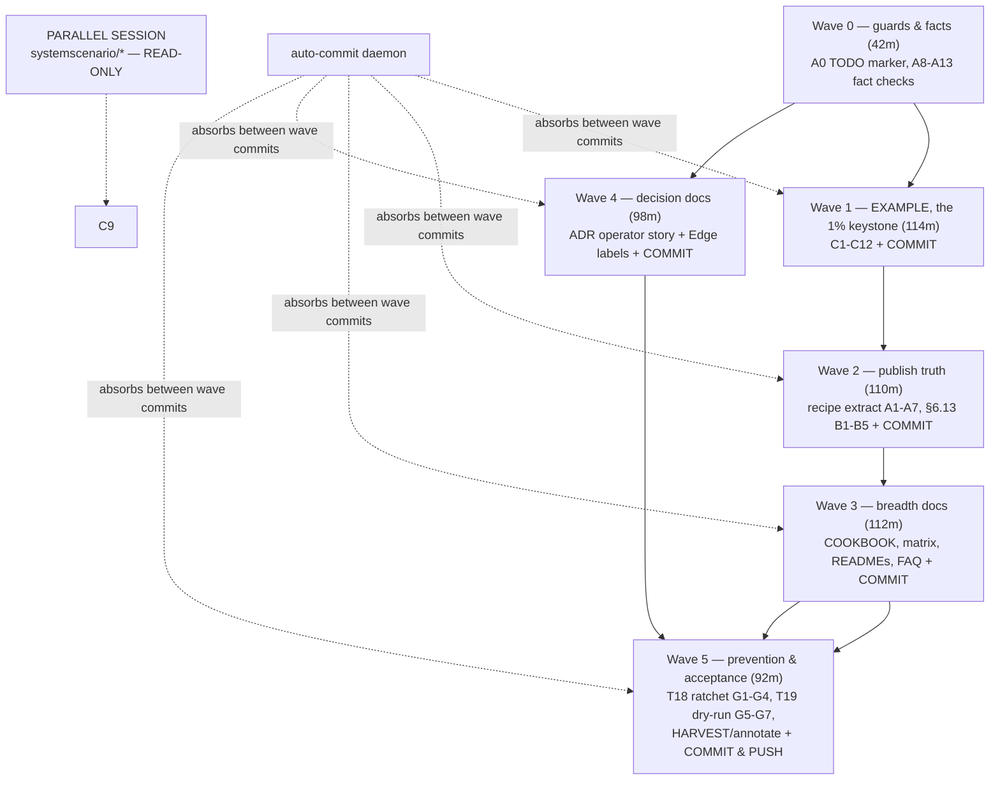

# SUPERB Plan V2 — Graph-Native Adoption Closure + Operator Story (supersedes V1)

**Date:** 2026-10-10 06:11
**Supersedes:** `2026-10-10_06-05_SUPERB-graph-native-adoption-closure-and-operator-story.md` (same session, pre-execution self-challenge — V1's own flaws are the diff, listed in §1)
**Source:** Session status report `docs/status/2026-10-10_05-48_graph-native-docs-audit-allengines-consult-session.md`
**Objective:** unchanged — make the modern graph-native path adoptable from docs alone, kill every docs-lie, ship the two operator-story decision ADRs, ZERO API changes.

---

## 1. What V1 got wrong (the honest diff)

| # | V1 flaw | V2 fix |
|---|---------|--------|
| 1 | **Recipe (docs) was the 1% keystone, example second.** A compile-scaffold-passing recipe still verifies nothing at runtime — the exact verification weakness the session confessed. Truth must flow FROM proven code INTO docs. | **Example first (Wave 1), recipe becomes a ~45min extract of proven code (Wave 2).** The example is the 1% keystone: it proves behavior (systemscenario BDD), de-ghosts graphadapter, feeds recipe/§6.13/COOKBOOK/matrix. |
| 2 | **Commits only at the very end (F3).** The auto-commit daemon absorbs mid-wave edits into `chore:` blobs — documented repo gotcha #4 — so all authored history would be lost. | **Commit at every wave boundary** (6 commits minimum), detailed messages. |
| 3 | **Fixed instances, not the root cause.** Nothing prevents the next capability ADT (spatial? search? streamlog?) shipping with a recipe void. | **T18: ADT→recipe coverage ratchet** — doc-check meta-test enumerating `AllADTs()` × recipes.md; gap = fail or explicit waive-with-reason. |
| 4 | **No acceptance test that the docs actually serve the consumer.** All gates verify artifacts, none verify the OUTCOME. | **T19: consumer dry-run** — sub-agent answers "graph-native how?" using ONLY the updated docs; wherever it stalls = remaining gap. This is the wave's real definition-of-done. |
| 5 | **Shared-file collision unguarded.** flake.nix (`examplePaths`), go.work, api-stability maps are also touched by the parallel session + daemon. | Explicit guardrail: `git status` re-check before each shared-file edit; wave commits limit the blast radius. |
| 6 | **No in-flight visibility** — TODO_LIST updated only at the end; a parallel session could duplicate this wave. | **A0: TODO_LIST in-flight marker in Wave 0.** |
| 7 | **Unbounded fix loops** (A6-style "fix iteratively") and **unnamed value assumption** (graph demand is hypothetical until a fleet consumer confirms). | 3-attempt timebox then documented fallback; assumption named in §2 with the example doubling as demand probe. |

## 2. Named assumptions & risks

- **A-R1 (value):** graph-native demand is HYPOTHETICAL until cqrs-htmx/go-appkit confirms need. Mitigation: the example is also the demand probe; T17 harvest marks docs tasks "adopt-if-needed" evidence-linked. If Lars says "no fleet consumer needs graph," Waves 1–3 shrink to §6.13-honesty + T18 ratchet only (~3h).
- **A-R2 (collision):** parallel session owns `systemscenario/*` (read-only for us) and shares flake.nix/go.work/api-stability registries.
- **A-R3 (estimates):** all minute-numbers are estimates; timeboxes cap drift, wave gates cap damage.

## 3. Decisions (carried from V1, unchanged — veto any time)

| ID | Decision |
|----|----------|
| D1 | Docs+example wave first; no engine/API code changes |
| D2 | Edge-label flattening: documented v4.x limitation + `Driver()` escape hatch; label growth only as Proposed v5 ADR |
| D3 | `allengines`: ADR + measurements only; module behind approval + dep-budget review |
| D4 | Operator story = nix `-tags` (compile-time) + `cqrs.yaml` via `LoadConfig` (runtime, shipped) |

## 4. Pareto Breakdown (V2 ordering)

| Tier | Tasks | Result |
|------|-------|--------|
| **1% → 51%** | **Wave 1: `example/graph-native/`** (domain → folds → system.New → runnable → BDD) | One BEHAVIOR-verified artifact (not compile-only): proves the composition works, de-ghosts graphadapter, becomes the source every doc extracts from |
| **4% → 64%** | + **Wave 2**: recipe extracted from proven example (compile-gated) + §6.13 modern-first rewrite + Cypher/Gremlin honesty fix + graphadapter limitation doc | Canonical published answer + zero docs-lies |
| **20% → 80%** | + **Wave 3**: COOKBOOK chapter, system/README + engine×graph matrix, readmodels/FAQ/SKILL pointers, systemscenario recipe | Fleet developer adopts graph-native from docs alone |
| **other 20% → 100%** | **Wave 4**: operator-story ADR + measurements, Edge-labels ADR · **Wave 5**: T18 ADT-coverage ratchet + T19 consumer dry-run + HARVEST/annotate/closure | Decision enablement, systemic prevention (no next recipe void), process closure |

## 5. Medium Plan — 19 tasks, 30–100 min (sorted by importance/impact/effort/customer-value)

| # | Task | Tier | Impact | Min | Dep |
|---|------|------|--------|-----|-----|
| T5 | `example/graph-native/`: domain (Followed/Unfollowed + guards), decider, Edge+EdgeRemoval folds, system.New (sqlite; flag-gated dgraph), runnable main | 1% | Critical | 100 | A0–A13 |
| T6 | systemscenario BDD suite: depth-2 traversal + unfollow retraction asserts (reuse parallel session's `presets.go` — read-only) | 1% | Critical | 60 | T5 |
| T1 | recipes.md §graph recipe — EXTRACT from proven example code, compile-classified, ~half V1 effort | 4% | Critical | 45 | T6 |
| T2 | advanced.md §6.13 rewrite: modern path first, legacy demoted, label-limitation + escape hatch | 4% | Critical | 45 | T1 |
| T3 | Verify Cypher/Gremlin claim (all GraphDriver impls); fix §6.13 + modules.md | 4% | High | 30 | — |
| T4 | graphadapter doc.go: flattening limitation + `Driver()` escape hatch | 4% | High | 30 | T3 |
| T7 | COOKBOOK.md graph chapter + TOC | 20% | Med-High | 40 | T1 |
| T8 | system/README graph section + consolidated engine×graph capability matrix + root README bullet | 20% | Med-High | 60 | T12 |
| T9 | readmodels.md graph row → modern path + matrix cross-link | 20% | Medium | 30 | T2,T8 |
| T10 | FAQ: relations entry + `ExecuteCtx` `[]any` cast contract (+`ExecuteTypedByName` check) | 20% | Medium | 30 | T1 |
| T11 | SKILL.md pointer reconciliation (SKILL↔COOKBOOK↔recipes↔example) | 20% | Medium | 30 | T1,T7 |
| T20 | recipes.md systemscenario graph-BDD recipe | 20% | Medium | 30 | T6 |
| T12 | Fact verification: bigtableengine go.mod weight, dgraph DSN format (Wave 0, feeds T8/T13/T14) | 20% | Medium | 30 | — |
| T13 | ADR ≥0155: two-level operator story + allengines proposal + nix `-tags` pattern | 100% | Med-High | 60 | T12 |
| T14 | Measurements: all-pure-Go-engines scratch binary vs single-engine (size + dep count) → ADR | 100% | Medium | 30 | T12 |
| T15 | ADR: Edge labels at v5 — extend vs limitation; GraphAddEdge signature survey | 100% | Medium | 45 | T4 |
| T18 | **ADT→recipe coverage ratchet**: doc-check meta-test, `AllADTs()` × recipes.md, gap = fail or waive-with-reason (also names TODAY's gaps: graph/spatial/search/streamlog?) | 100% | High | 45 | T1 |
| T19 | **Consumer dry-run acceptance test**: fresh sub-agent answers "graph-native how?" from updated docs ONLY; stalls = gaps = fix | 100% | Critical | 30 | Waves 1–3 |
| T17 | Closure: HARVEST → TODO_LIST (incl. adopt-if-needed markers), ANNOTATE 05-48 report + V1 plan, final push | 100% | High | 30 | all |

**Total ≈ 800 min (~13.5 h), ~75 min more than V1 for systemic prevention + real acceptance test.**

## 6. Fine Plan — 68 micro-tasks, ≤12 min (execution order; `▶` = wave-boundary COMMIT)

| ID | Micro-task | Min | Dep |
|----|-----------|-----|-----|
| **Wave 0 — guards & facts (~42m)** |
| A0 | TODO_LIST.md: add in-flight marker line (graph-native docs wave, plan V2 link) — prevents parallel-session duplication | 6 | — |
| A8 | Grep all `GraphDriver` implementations (settle Cypher/Gremlin claim) | 5 | — |
| A9 | Decide wording: shipped capability vs portability target | 6 | A8 |
| A10 | Fix modules.md `graph` + `graphadapter` rows | 8 | A9 |
| A11 | Read bigtableengine go.mod; record dep-weight verdict | 6 | — |
| A12 | Read dgraphengine register.go; record DSN format | 8 | — |
| A13 | Record A8–A12 outcomes into this plan's §7 scratchpad + ADR inputs | 6 | A10–A12 |
| **Wave 1 — example, THE keystone (~114m)** ▶ commit after A0 (guards) |
| C1 | Scaffold `example/graph-native/` following getting-started module pattern (go.mod, main.go skeleton) | 12 | — |
| C2 | Domain: Followed/Unfollowed events, FollowState decider (guards: no self-follow, no dup) | 12 | C1 |
| C3 | Folds: `OnRecordTyped` → `Edge` + `EdgeRemoval`; `Query[ReachabilityQuery, []string]` | 12 | C2 |
| C4 | DeploymentConfig: sqlite primary; flag-gated dgraph projections; `LoadConfig` fallback | 10 | C3 |
| C5 | Wire `ProjectionTypeDecoder` + `Events` universe + `RegisterDecider/RegisterCommand` | 10 | C4 |
| C6 | Runtime loop: host start, follow batch, depth-1/2 prints, unfollow retraction proof | 12 | C5 |
| C7 | Register module in 3 gates: flake `examplePaths`, api-stability exclusion maps, cqrs-lint catalog (+go.work). **git status re-check first — shared files** | 12 | C6 |
| C8 | `go build ./...` + run + verify printed traversal output | 10 | C7 |
| C9 | READ parallel session's `systemscenario/presets.go`; list reusable pieces (read-only!) | 8 | C7 |
| C10 | BDD suite: Given follows → When query → Then neighbors (poll mode) | 12 | C9 |
| C11 | BDD retraction case: unfollowed → traversal excludes retracted edge | 12 | C10 |
| C12 | Module tests + `-race`; `check-module-layers` sanity | 12 | C11 |
| ▶ | **COMMIT Wave 1** (example + gates; detailed message) | 5 | C12 |
| **Wave 2 — publish truth (~110m)** |
| A1 | Read recipes_catalog format + one nearby recipe's preamble | 6 | — |
| A2 | Extract recipe fence FROM the proven example (trim to doc shape) | 10 | A1, C12 |
| A3 | Insert as recipes.md §(next free) + TOC anchor | 10 | A2 |
| A4 | recipes_catalog classification entry | 8 | A3 |
| A5 | `TestRecipes` run (cold ≈100 s) | 12 | A4 |
| A6 | Fix failures — **TIMEBOX: 3 attempts**, then fallback to scaffold+preamble classification + doc fix | 12 | A5 |
| A7 | Full doc-check (zero warnings) | 10 | A6 |
| B1 | §6.13 modern-first body | 12 | A7 |
| B2 | Demote GraphProjection to migration note | 10 | B1 |
| B3 | Label-flattening limitation + `Driver()` escape-hatch note | 8 | B2 |
| B4 | doc-check + `check-md-go` | 10 | B3 |
| B5 | graphadapter doc.go limitation paragraph | 12 | B3 |
| ▶ | **COMMIT Wave 2** | 5 | B4,B5 |
| **Wave 3 — breadth (~112m)** |
| D1 | COOKBOOK chapter (port of recipe) + TOC | 12 | A7 |
| D2 | SKILL pointer fixes (SKILL↔COOKBOOK promise now true) | 8 | D1 |
| D3 | Engine×graph capability matrix from engine profile.go files | 12 | A8 |
| D4 | system/README graph section (matrix + sqlite/dgraph YAML) | 12 | D3 |
| D5 | Root README deployment bullet | 6 | D4 |
| D6 | `check-readme-links.sh` + deprecated-symbol gate | 8 | D5 |
| D7 | readmodels.md graph row → modern path | 10 | D4 |
| D8 | FAQ: modeling relations/graphs | 10 | A7 |
| D9 | FAQ: ExecuteCtx `[]any` cast + `ExecuteTypedByName` check/doc | 12 | D8 |
| D10 | recipes.md systemscenario graph-BDD fence + catalog | 12 | C12 |
| D11 | Full doc gates over everything touched | 10 | D1–D10 |
| ▶ | **COMMIT Wave 3** | 5 | D11 |
| **Wave 4 — decision docs (~98m)** |
| E1 | ADR ≥0155 skeleton: two-level operator story, LoadConfig runtime half | 12 | A13 |
| E2 | allengines membership table (duckdb behind cgo tag; bigtable verdict from A11) | 12 | E1 |
| E3 | nix `-tags` per-deployment pattern (flake profiles appendix) | 12 | E2 |
| E4 | Consequences + open questions + ADR-0123 §3 link; status Proposed | 10 | E3 |
| E5 | Scratch binary: all pure-Go engines; build size record | 12 | A13 |
| E6 | `go mod graph` dep count vs single-engine → ADR numbers | 12 | E5 |
| E7 | GraphAddEdge signature survey (badger/dgraph/iroh/graphadapter/sqlite) | 10 | — |
| E8 | ADR: Edge labels at v5, Option A/B + recommendation; Proposed | 12 | E7 |
| E9 | Cross-link E8-ADR from §6.13 + graphadapter doc.go | 6 | E8,B5 |
| ▶ | **COMMIT Wave 4** | 5 | E4,E6,E9 |
| **Wave 5 — prevention, acceptance, closure (~92m)** |
| G1 | T18 ratchet: enumerate `AllADTs()` × recipes.md coverage (report today's gaps) | 10 | A7 |
| G2 | T18 ratchet: doc-check meta-test (gap = fail; `// waived: <reason>` escape) | 12 | G1 |
| G3 | T18 ratchet: waive-or-fix today's gaps found in G1 (graph now covered; spatial/search/streamlog → waive-with-reason or TODO_LIST) | 12 | G2 |
| G4 | T18 ratchet: run doc-check suite green | 8 | G3 |
| G5 | T19 dry-run: sub-agent answers "graph-native how?" from docs ONLY (no repo code reading) | 12 | D11 |
| G6 | T19: wherever the agent stalls → fix the doc; iterate ≤3 | 12 | G5 |
| G7 | T19: second dry-run passes clean → acceptance = GREEN | 10 | G6 |
| G8 | HARVEST: TODO_LIST update (incl. adopt-if-needed markers per A-R1; remove A0 marker) | 12 | G7 |
| G9 | ANNOTATE 05-48 status report (dispatched/closed appendix) + V1 plan (superseded note exists — verify) | 10 | G8 |
| ▶ | **COMMIT Wave 5 + push** | 5 | G9 |

**68 micro-tasks incl. 6 wave-boundary commits.**

## 7. Fact scratchpad (filled during Wave 0)

- GraphDriver implementations found: (A8, 2026-10-10) **`graph.MemoryDriver` ONLY** (`graph/memory.go:11` "the reference implementation"; `graph/graph.go:130` interface assertion; no other impl in 38 repo matches). Neo4j/Memgraph drivers are design-hypothetical "consumer-pulled sibling modules" (`graph/graph.go:29-32`).
- Cypher/Gremlin verdict: (A9) **portability target, NOT shipped capability.** `graph/graph.go:20-23` documents the asymmetry: reads deliberately NOT abstracted; a real-DB driver would expose native Cypher/Gremlin directly, but none ships — only MemoryDriver's Go-native read API (Traverse/Neighbors/ShortestPath). modules.md `graph` row fixed (A10); advanced.md §6.13 line "Reads run native Cypher/Gremlin via the driver" gets the same honesty fix in Wave 2 (B1).
- bigtableengine dep weight: (A11) **HEAVY.** 3 direct production deps (`cloud.google.com/go/bigtable`, `google.golang.org/api`, `google.golang.org/grpc`) pulling ~50 indirect modules (full GCP auth/OTel/SPIFFE/longrunning surface). allengines membership: EXCLUDE (ADR E2 input).
- dgraph DSN format: (A12) **plain gRPC address `host:port`** (e.g. `localhost:9080`) — `register.go:18` passes `cfg.DSN` to `New(addr)` → `dgo.NewClient(addr, insecure creds…)` (`engine.go:76-81`). No DSN scheme parsing; TLS/custom grpc options require `NewFromClient(client)`.
- Bonus (C-scoping): `graphadapter` also implements `GraphRemoveEdge` (adapter.go:94, idempotent, directed-only) — EdgeRemoval folds work through the adapter; `Profile()` name "graph-memory", NsPerOp 3000.

## 8. Execution Graph

## 9. Verification & guardrails (unchanged gates from V1, plus)

- Per-wave gates as V1 §6 (build/test/doc-check/readme/registration checks).
- **NEW: wave-boundary commits** — authored history survives the daemon; shared-file edits re-check `git status` first.
- **NEW: timebox 3 attempts** on any fix loop, then documented fallback.
- **NEW: T19 dry-run is the wave's acceptance test** — gates verify artifacts, the dry-run verifies the OUTCOME.
- Definition of done: V1's definition + T18 ratchet green + dry-run GREEN.

## 10. Out of scope (unchanged)

Edge-label implementation · allengines module itself · systemscenario shared files · COOKBOOK beyond graph chapter.

---

*V2 supersedes V1 pre-execution. Point-in-time plan: ANNOTATE, never rewrite. Verschlimmbesserung guard active.*
